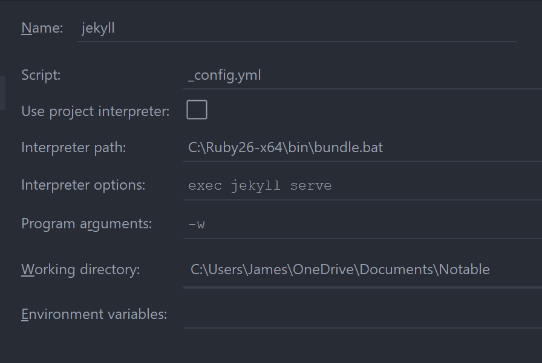

# Notebooks

## Adding a notebook

- To keep notes organised add a folder
  `<project_root>/_notebooks/<notebook_name>`
  - Create notes in this folder
  - Use front-matter to specify which notebook the note belongs to

## Create a note

Front matter
```yaml
---
title: <title of note>
notebook: <notebook name>
date: YYYY-mm-dd
layout: note
order: <specifies sequential order of page in notebook>
...
```
A file template has been set up so that it's easy to create a new note:
```markdown
---
title: $title
notebook: $notebook
layout: default
date: ${YEAR}-${MONTH}-${DAY} ${HOUR}:${MINUTE}
tags: $tag
...

# $title

[TOC]: #
```

## Images and other files

Through use of [jekyll-relative-links](https://github.com/benbalter/jekyll-relative-links),  
images can be placed in `_notebooks/<notebook>/img/`.

Alternative location: `static/img/<notebook>/` can be used to uncouple an image
from a particular notebook for whatever reason.

Other files should be placed in:
- `_notebooks/<notebook>/files`: for tightly coupled files
- `static/files`: for loosely coupled files

## Math

Math is rendered with Katex on jekyll and markdown preview (in Pycharm) with Markdown
Navigator enabled.  This required some custom setup which can likely be improved upon.

Math is enclosed in `$$ $$`

e.g. $$E = mc^2$$

### Katex with Jekyll
[Part 1](https://web.archive.org/web/20170117172154/http://willdrevo.com/latex-equation-rendering-in-javascript-with-jekyll-and-katex/)
I installed katex with npm, then copied the katex dist directory into static files
I added javascript and css imports for katex to the default.html and head.html files
Then I added .equation to main.css and katex rendering to default.js
This enabled rendering of katex in raw display tags
[Part 2](https://nealde.github.io/blog/2017/10/20/How-to-make-a-local-Jekyll-website/)
I instead moved to copy this approach which enables \$\$ syntax
This makes Katex work with Jekyll both locally and on github pages.
This syntax also seems to work with pandoc for pdf generation.

### Katex in Preview

- Only way I could get this to work was to add the following to the HTML head in
  _Settings > Markdown > HTML Generation > Head Top_
```html
<link rel="stylesheet" href="https://cdn.jsdelivr.net/npm/katex@0.11.1/dist/katex.min.css" integrity="sha384-zB1R0rpPzHqg7Kpt0Aljp8JPLqbXI3bhnPWROx27a9N0Ll6ZP/+DiW/UqRcLbRjq" crossorigin="anonymous">
<script defer src="https://cdn.jsdelivr.net/npm/katex@0.11.1/dist/katex.min.js" integrity="sha384-y23I5Q6l+B6vatafAwxRu/0oK/79VlbSz7Q9aiSZUvyWYIYsd+qj+o24G5ZU2zJz" crossorigin="anonymous"></script>
<script defer src="https://cdn.jsdelivr.net/npm/katex@0.11.1/dist/contrib/auto-render.min.js" integrity="sha384-kWPLUVMOks5AQFrykwIup5lo0m3iMkkHrD0uJ4H5cjeGihAutqP0yW0J6dpFiVkI" crossorigin="anonymous"
    onload="renderMathInElement(document.body);"></script>
```
_From [Katex docs](https://katex.org/docs/autorender.html)_

The default delimiters are:
```
[
  {left: "$$", right: "$$", display: true},
  {left: "\\(", right: "\\)", display: false},
  {left: "\\[", right: "\\]", display: true}
]
```
\\(E=mc^2\\)


# PDFs

In the project root run `make` to build all PDFs for all *.md files in notebook folders. Note I have only used this on WSL.

PDFs are stored as `static/pdf/<notebook>/<note>.pdf`

To remove generated pdfs, run `make clean`

The template used for PDFs is [Eisvogel](https://github.com/Wandmalfarbe/pandoc-latex-template)

Templates for building PDFs are stored in `static/tex`

# Development

To build and view the site locally, run:
```bash
bundle exec jekyll serve -w 
```
- `-w`: auto-regeneration
- `-v`: verbose

## PyCharm Run Config

So that you aren't constantly running this command, you can [ set up a configuration ](https://turing4ever.github.io/2018/07/16/use-pycharm-to-blog-with-jekyll.html)
in pycharm and just hit run (`shift+f10`).

My setup:

On Windows, to find the path to bundler, in PowerShell run:
```commandline
> where.exe bundle
```
