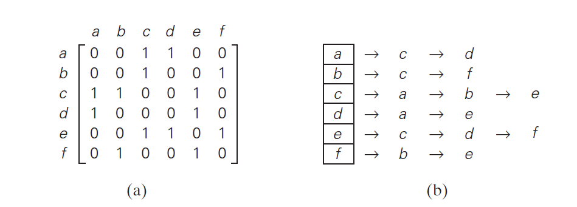
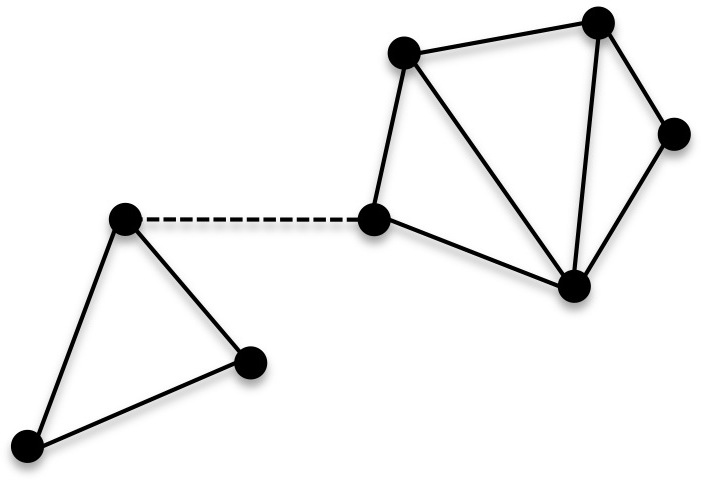
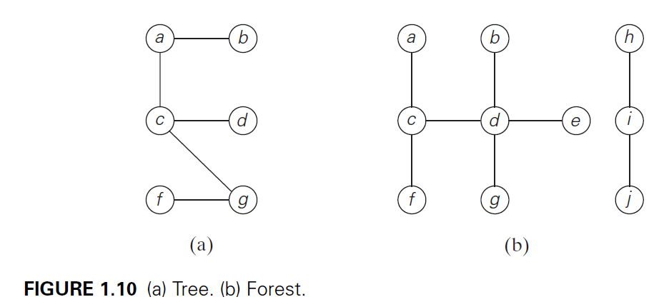
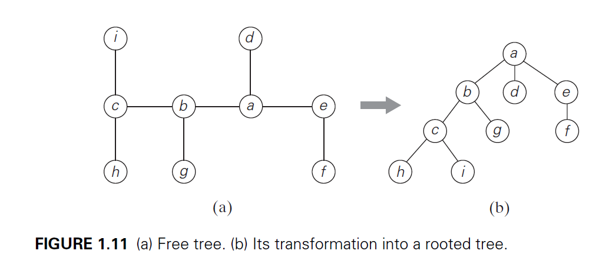
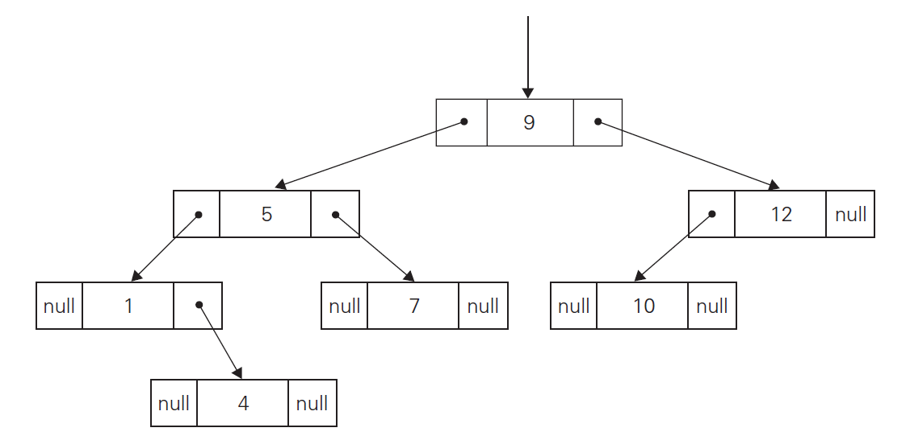

---
title: Algorithms
notebook: Design of Algorithms
layout: note
date: 2020-03-03 13:06
tags: 
...

# Algorithms

[TOC]: #

## Table of Contents
- [Algorithms](#algorithms)
- [Greatest common divisor](#greatest-common-divisor)
- [Sieve of Eratosthenes](#sieve-of-eratosthenes)
- [Algorithmic Problem Solving](#algorithmic-problem-solving)
- [Important problem types](#important-problem-types)
- [Linear data structures](#linear-data-structures)
  - [Array](#array)
  - [Linked list](#linked-list)
  - [List](#list)
  - [Stacks](#stacks)
  - [Queue](#queue)
  - [Priority queues](#priority-queues)
- [Graphs](#graphs)
  - [Graph representations](#graph-representations)
  - [Weighted graphs](#weighted-graphs)
  - [Paths and Cycles](#paths-and-cycles)
- [Trees](#trees)
  - [Rooted trees](#rooted-trees)
  - [Ordered trees](#ordered-trees)
- [Sets and Dictionaries](#sets-and-dictionaries)
  - [Universal set](#universal-set)
  - [List structure](#list-structure)
  - [Dictionary](#dictionary)


## Algorithms

- Sequence of *unambiguous* instructions for solving a problem to obtain
  required output for *legitimate input* in a *finite* amount of time
- multiple valid solutions with different efficiency

## Greatest common divisor

Euclid's algorithm ```gcd(m, n) = gcd(n, m mod n)```

For example

```
gcd(24, 60) = gcd(60, 24)
            = gcd(24, 12)
            = gcd(12, 0)
            = 12
```

Since `gcd(m, 0) = m`

## Sieve of Eratosthenes

- algorithm to generate consecutive primes not exceeding a given integer `n > 1`
- procedure:
  - generate a list of prime candidates from 2 to n
  - loop over the list, each time eliminating candidates that are multiples of
    2, 3, ...
  - no pass for 4 is necessary as all multiples of 4 have already been
    eliminated
  - algorithm continues until no more numbers can be eliminated; remaining
    numbers are prime

- what is largest `p` whose multiples can still remain on the list to make
  further iterations of the algorithm necessary?
  - if `p` is a number whose multiples are being eliminated on the current pass,
    first multiple we should consider is `p.p` because all smaller multiples
    `2p, ..., (p-1)p` have been eliminated on earlier passes
  - `p.p` should be less than `n` otherwise it isn't a candidate, i.e.

  ```math
  p \leq \lfloor\sqrt{n}\rfloor
  ```

## Algorithmic Problem Solving

- understand the problem
- understand the capabilities of the hardware
- decide between exact/approximate solution
- choose design techniques
- design algorithm and data structure
- prove correctness: prove that algorithm yields required result for every
  legitimate input in finite time
  - often uses mathematical induction
  - for approximation algorithms you need to show error does not exceed defined
    limit
- analysis
  - time efficiency: run time
  - space efficiency: memory
  - generality
- implement the algorithm

## Important problem types

- sorting: rearrange list items in non-decreasing order
  - stable: preserves relative order of equal elements
  - typically algorithms that switch keys far apart are not stable but are
    faster
  - in-place: doesn't require extra memory to run
- searching: find a given value (_search key_) in a given set
- string processing
  - e.g. string matching
- graph problems
  - graph is a collection of vertices, connected by edges
  - e.g. graph traversal, shortest path
  - graph-coloring: assign smallest number of colors to vertices of a graph such
    that no two adjacent vertices are the same color (event scheduling)
  - travelling salesman problem: shortest tour through n cities that visits each
    city only once
- combinatorial problems
  - ask to find a combinatorial object satisfying constraints (e.g. permutation,
    combination, subset)
  - typically most difficult class of problems: number of objects grows
    extremely fast with problem size
- geometric problems: points, lines and polygons
  - e.g. computer graphics, robotics, tomography
  - closest-pair problem: given n points in the plane, find the closest pair
    among them
  - convex-hull problem: smallest convex polygon that contains all points of a
    set
- numerical problems: mathematical objects of continuous nature
  - solving systems of equations, computing integrals, evaluating functions

## Linear data structures

### Array

- sequence of `n` items of the same data type stored contiguously in memory
- accessible by **index**
- each element of an array can be accessed by an identical constant amount of
  time (c.f. linked lists)
- useful for **strings**

### Linked list

- sequence of **nodes** each containing data and **pointers** to other nodes
- **singly linked list**: each node (except last) contains a single pointer to the
  next element
- nodes are accessed by traversing the list: time dependent on node's location
- doesn't require preliminary reservation of memory
- efficient insertions and deletions
- **header**: special node at start of list, points to first item in list, could
  contain:
  - metadata about list e.g. current length
  - pointer to last element in list
- **doubly linked list**: each node contains a pointer to the next and previous
  node


### List

- **list**: finite sequence of data items
- operations:
  - search for
  - insert
  - delete

### Stacks

- **stack**: list in which insertions and deletions are performed at the end
  (**top**) of the list
  - last-in-first-out
  - picture vertical stack of plates

### Queue

- **queue**: elements added to rear, and removed from the front
  - **dequeue**: elements deleted from the **front**
  - **enqueue**: elements added to the **rear**
  - first-in-first-out
  - think queue of customers in line

### Priority queues

- *priority queue*: useful for selection of an item of highest priority from
  dynamically changing candidates
  - collection of data items from a totally ordered universe (e.g. integer/real
    numbers)
- operations:
  - find largest element
  - delete largest element
  - add a new element
- *heap* is the most efficient solution to this problem

## Graphs

- collection of points, called **vertices** or **nodes**, with some connected by
  **edges**
- a graph $$G = \langle{V,E}\rangle$$, is a pair of two sets
  - finite nonempty set V, vertices
  - set E of pairs of these items, edges
- if these pairs of vertices is unordered i.e. $$(u, v)$$ is the same as $$(v, u)$$,
  v and u are **adjacent**, connected by **undirected edge** $$(u,v)$$
- vertices _u_ and _v_ are **endpoints** of edge $$(u, v)$$
  - _u_ and_v_ are **incident** to this edge (and vice versa)
- a graph is **undirected** if all edges are undirected
- **directed** edge $$(u, v)$$ means vertices $$(u, v)$$ are not the same as vertices $$(v, u)$$
  - from **tail** u to **head** v
- a graph is **directed** if all edges are directed (aka **digraphs**)

- convenient to label vertices with letters or numbers
- graph with 6 vertices and 7 undirected edges

```math
V = \{a, b, c, d, e, f\}
\newline
E = \{(a,c), (a,d), (b,c), (b,f), (c,e), (d,e), (e,f)\}
```

- digraph with 6 vertices and 8 directed edges

```math
  V = \{a, b, c, d, e, f\}
\newline
E = \{(a,c), (b,c), (b,f), (c,e), (d,a), (d,e), (e,c), (e,f)\}
```


- this definition allows **loops**, including edges connecting vertices
  to themselves, however unless stated will be expected to have no loops
- definition disallows multiple edges between the same vertices of an undirected graph:
  - number of edges $$\mid E\mid$$
  - number of vertices $$\mid V\mid $$
  - $$ 0 \le \mid E\mid  \le \mid V\mid \frac{(\mid V\mid -1)}{2}$$
- graph is **complete** if every pair of vertices is connected by an edge
  - complete graph with $$\mid V\mid $$ vertices: $$K_{\mid V\mid }$$
- graph with few missing edges is **dense**
- graph with few edges present is **sparse**

### Graph representations

- **adjacency matrix**: for graph with $$n$$ vertices is $$n \times n$$ boolean
  matrix
  - row i, col j: 1 if edge from i to j; 0 otherwise
  - undirected graph has a symmetric adjacency matrix $$A_{ij}=A_{ji}$$ for all i, j
- **adjacency list**: collection of linked lists for each vertex containing all
  adjacent vertices (those connected by an edge)
- sparse graphs more efficiently represented by adjacency list
- dense graphs more efficiently represented by adjacency matrix



### Weighted graphs

- **weighted graph**: graph with numbers (**weights**, **costs**) assigned to edges
- adjacency matrix can be updated to a **weight matrix** such that $$A_{ij}$$ is the weight for that edge
  - if there is no such edge, entries are $$\infty$$

### Paths and Cycles

- **path** from vertex u to vertex v of graph G: sequence of adjacent vertices from
  u to v.
- **simple path**: all vertices of a path are distinct
- **path length**: (num. vertices)-1, (num. edges)
- **directed path**: sequence of vertices, with each successive pair of vertices u, v
  having a directed edge (u,v)
- **connected graph**: for every pair of vertices u,v there is a path from u to v
  - i.e. no **unreachable** vertices
- a disconnected graph forms multiple **connected components**: maximal connected
  subgraphs of a graph


*Graph becomes disconnected when dashed line is removed*

- **cycle**: path of positive length that starts and ends at the same vertex,
  without traversing the same edge more than once
- **acyclic**: graph without cycles

## Trees

- **free tree**, aka tree: connected acyclic graph
  - Necessary property for graph to be a tree:
    - (number of edges) = (number of vertices) - 1
    - $$ \mid E/\mid  = \mid V\mid  - 1 $$
  - For connected graphs this is a sufficient property; useful for checking if a
    connected graph has a cycle
- **forest**: graph with no cycles but is not necessarily connected, with each
  component being called a tree



### Rooted trees

- for every two vertices in a tree, there exists exactly one simple path from one 
  vertex to the other
- can select arbitrary vertex in a free tree as **root** of the **rooted tree**
- e.g. file system hierarchy



- **ancestor** of vertex v: all vertices on simple path from root to vertex v
  - vertex usually considered its own ancestor
  - **proper ancestor** excludes the vertex itself
- if $$(u,v)$$ is the last edge of simple path from root to vertex v
  - u is **parent** of v
  - v is **child** of u
- **sibling**: vertices with same parents
- **leaf**: vertex with no children
- **parental**: vertex with at least one child
- **descendants**: all vertices for which v is an ancestor
  - **proper descendants**: excludes v itself
- **subtree** rooted at v: all descendants of v with all edges connecting
- **depth** of a vertex v: length of simple path to v
- **height** of a tree: longest simple path from root to leaf

### Ordered trees

- **ordered tree**: rooted tree in which all children of each vertex are ordered
- **binary tree**: ordered tree where each vertex has at most two children
  - each child is a **left child** or a **right child**
  - binary tree with root at left child of a vertex in a binary tree is the **left subtree**
  - as subtrees are also binary trees, they are useful for recursive algorithms
  - inequality for height _h_ of a binary search tree with _n_ nodes:
    $$\lfloor \log_2 n \rfloor \leq h \leq n-1$$
- **binary search tree**: numbers assigned to vertices, with parent vertex being
  larger than all elements in left subtree, and smaller than all elements in right
  subtree
- **multiway search tree**: generalisation of binary search trees
  - useful for efficient access to very large datasets
- **first child-next sibling** representation: left subtree of vertex is child,
  while right subtree is siblings.
  - useful for computer representation of an arbitrary ordered tree with widely
    varying numbers of children by converting to a binary tree



## Sets and Dictionaries

- **set**: unordered collection of _distinct_ **elements**
- operations:
  - checking membership
  - finding union
  - finding intersection

### Universal set

- consider large set U with n elements
- **bit vector**: subset S of U can be represented by bit string of size n

e.g.

$$  
U = \{1, 2, 3, 4, 5, 6, 7, 8\}
\newline
S = \{2, 3, 7\}  
$$

- bit string: 01100010
- these set representations allow very fast set operations but with high memory
  use

### List structure

- more common approach for handling sets
- **multiset/bag**: circumvents uniqueness set requirement with an unordered collection of items
  that are not necessarily distinct
- lists are ordered, where as sets are not: largely this doesn't matter for practical
  purposes

### Dictionary

- **dictionary**: data structure that implements most common set operations:
  - searching for an item
  - adding items
  - deleting items
- many implementations, from arrays to hashing and balanced search trees


