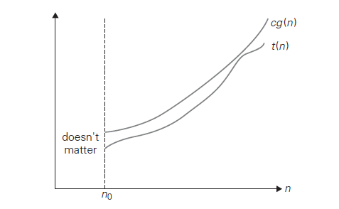
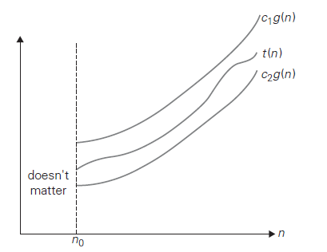

---
title: Analysis of Algorithms
notebook: Design of Algorithms
layout: note
date: 2020-03-08 12:57
tags: 
...

# Analysis of Algorithms

[TOC]: #

## Table of Contents
- [What analysis measures](#what-analysis-measures)
- [Running time](#running-time)
- [Orders of Growth](#orders-of-growth)
- [Efficiencies](#efficiencies)
- [Asymptotic Notations](#asymptotic-notations)
- [Comparing Orders of Growth](#comparing-orders-of-growth)
  - [L’Hopital’s rule](#lhopitals-rule)
  - [Stirling's Formula](#stirlings-formula)
- [Efficiency Classes](#efficiency-classes)
- [Process: Analysing time efficiency of non-recursive algorithms](#process-analysing-time-efficiency-of-non-recursive-algorithms)
  - [Basic rules](#basic-rules)

## What analysis measures

- **time complexity/efficiency**: how fast an algorithm runs
- **space complexity/efficiency**: amount of space needed to run an algorithm and
  space required for input/output
- most algorithms run longer on longer inputs, so consider efficiency as a function
  of input size $n$
- when input is a single number, and $n$ is a magnitude (e.g. checking if $n$ is
  prime), you measure size using $b$, the number of bits in $n$'s binary representation:
  $$b=\lfloor\log_{2}n\rfloor+1$$

## Running time

- counting all operations that run is usually difficult and unnecessary
- instead identify **basic operation** that has highest proportion of running
  time and count number of times this is executed
  - usually most time-consuming operation on innermost loop
  - e.g. sorting: basic operation is key comparison
  - arithmetic: (least time consuming) addition ~ subtraction < multiplication < division (most time consuming)
- time complexity analysis: determine number of times basic operation is executed for input size $n$

## Orders of Growth

- small $n$: differences between algorithms are in the noise
- large $n$: the order of growth of the time complexity dominates and differentiates
  between algorithms

Some functions
$$\log_{2}n < n < n\log_{2}n < n^2 < n^3 < 2^n < n!$$

- $\log$ grows so slowly you would expect an algorithm with basic-operation to run
  practically instantaneously on inputs of all realistic size

- change of base results in multiplicative constant, so you can simply write $\log n$
  when you are only interested in order of growth
$$\log_a n = \log_a b \log_b n$$
- $2^n$ and $n!$ are both exponential-growth functions.  Algorithms requiring
  an exponential number of operations are practical for solving only problems of
  very small size

## Efficiencies

Algorithm run-time can be dependent on particulars of input e.g. sequential search

Efficiency can be:
- **worst-case**: algorithm runs longest among all possible inputs of size $n$
- **best-case**: algorithm runs fastest among all possible inputs of size $n$
- **average-case**: algorithm runs on typical/random input; typically more difficult
  to assess and requires assumptions about input
- **amortized**: for cases where a single operation could be expensive, but remainder of operations
  occur much better than worst-case efficiency
  - amortize high cost over entire sequence

## Asymptotic Notations

Notations for comparing orders of growth:
- $O$: big-oh; $\le$ order of growth
  - $O(g(n))$: set of all functions with lower/same order of growth
    as $g(n)$ as $n\rightarrow\infty$
- $\Omega$: big-omega; $\ge$ order of growth
- $\Theta$: big-theta; $=$ order of growth

e.g.  
$$n \in O(n^2)$$  
$$\frac{n}{2}(n-1)\in O(n^2)$$  
$$n^3\not\in O(n^2)$$

**Definition:** A function $t(n) \in O(g(n))$ if $\exists c \in \R^+, n_0 \in \Z^+$ s.t.  $\forall n\ge n_0$:
$$t(n) \le cg(n)$$

**_Big O_**

**Definition:** A function $t(n) \in \Omega(g(n))$ if $\exists c \in \R^+, n_0 \in \Z^+$ s.t.  $\forall n\ge n_0$:
$$t(n) \ge cg(n)$$

**Definition:** A function $t(n) \in \Theta(g(n))$ if $\exists c_1,c_2 \in \R^+, n_0 \in \Z^+$ s.t. $\forall n\ge n_0$:
$$c_1 g(n) \le t(n) \le c_2 g(n)$$

**_Big $\Theta$_**

**Theorem**: If $t_{1}(n) \in O(g_{1}(n))$ and $t_{2}(n) \in O(g_{2}(n))$:
$$t_{1}(n)+t_{2}(n) \in O(\max\{g_{1}(n), g_{2}(n)\})$$

Analogous assertions also hold for $\Omega$, $\Theta$

- This implies that an algorithm comprised of two consecutively executed components
has an overall efficiency determined by the part with a higher order of growth (the least
efficient part)
- e.g.: check if an array has equal elements by first sorting, then checking consecutive items for equality
  - part 1 may take no more than $\frac{n}{2}(n-1)$ comparisons, i.e. $\in O(n^2)$
  - part 2 may take no more than $n-1$ comparisons, i.e. $\in O(n)$
  - overall efficiency: $O(n^2)$

## Comparing Orders of Growth

- to directly compare two functions, compute the limit of their ratio:
  $$\lim_{n\rightarrow\infty}\frac{t(n)}{g(n)}$$
  - This could be: ($\sim$: order of growth)
    1. $0: \sim t(n) < \sim g(n)$
    2. $c: \sim t(n) = \sim g(n)$
    3. $\infty: \sim t(n) \gt \sim g(n)$
- Case a, b $\Rightarrow t(n) \in O(g(n))$
- Case b, c $\Rightarrow t(n) \in \Omega(g(n))$
- Case b $\Rightarrow t(n) \in \Theta(g(n))$

### L’Hopital’s rule

$$\lim_{n\rightarrow\infty}\frac{t(n)}{g(n)} = \lim_{n\rightarrow\infty}\frac{t'(n)}{g'(n)}$$

### Stirling's Formula

For large $n$
$$n! \approx \sqrt{2\pi n}\frac{n}{e}^n$$

## Efficiency Classes

|   Class   |     Name     | Comments                                                             |
|:---------:|:------------:|:---------------------------------------------------------------------|
|     1     |   constant   | very few algorithms fall in this class                               |
| $\log n$  | logarithmic  | results from cutting problem's size by constant factor               |
|    $n$    |    linear    | scan a list of size $n$ e.g. sequential search                       |
| $n\log n$ | linearithmic | divide-and-conquer e.g. mergesort; quicksort                         |
|   $n^2$   |  quadratic   | two embedded loops e.g. basic sorting; $n\times n$ matrix operations |
|   $n^3$   |    cubic     | three embedded loops; e.g. often used in linear algebra              |
|   $2^n$   | exponential  | generate all subsets of $n$-element set                              |
|   $n!$    |  factorial   | generate all permutations of $n$-element set                         |

## Process: Analysing time efficiency of non-recursive algorithms

1. define parameter indicating input's size
2. identify algorithm's basic operation (typically on innermost loop)
3. check if number of times basic operation is executed is only a function of input size
    - if not: worst case, average case to be considered separately
4. set up sum expressing number of times the basic operation is executed
5. use formulas/sum manipulation to find a closed form solution for the count or
   determine order of growth

### Basic rules

$$\sum_{i=l}^{u}{ca_i} = c\sum_{i=l}^{u}{a_i}$$
$$\sum_{i=l}^{u}{a_i+b_i} = \sum_{i=l}^{u}{a_i}+\sum_{i=l}^{u}{b_i}$$
$$\sum_{i=l}^{u}1 = u-l+1$$
In particular
$$\sum_{i=1}^{n}{1} = n$$
$$\sum_{i=l}^{u}{i} = \frac{n(n+1)}{2}$$
