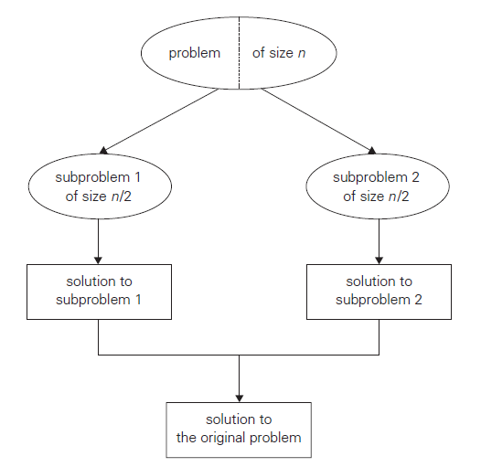
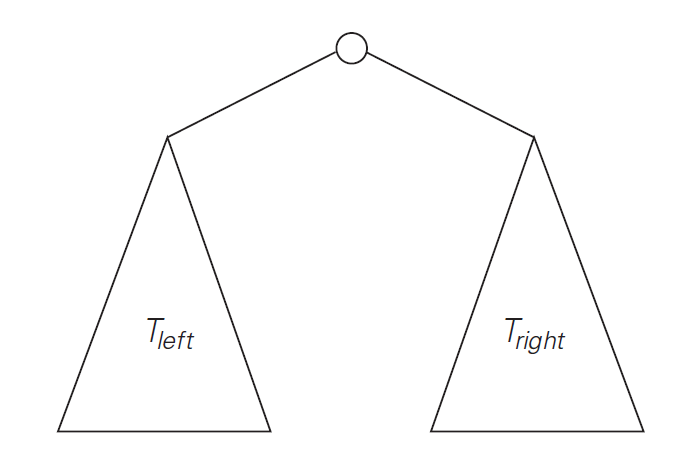
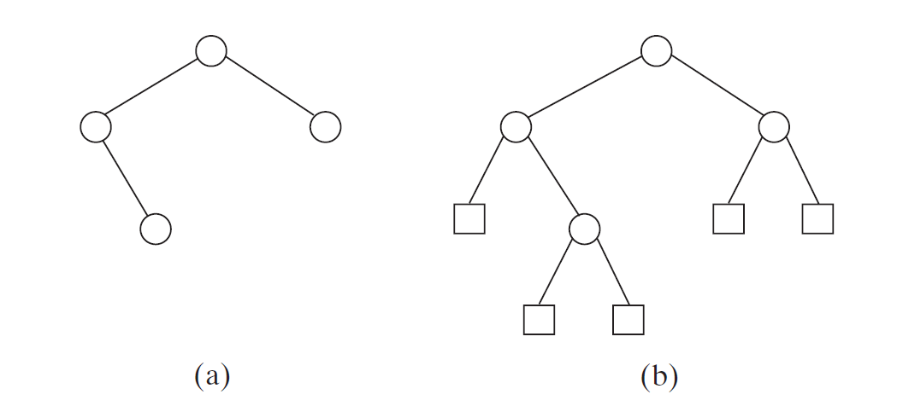
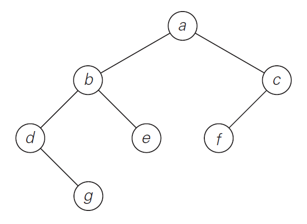

---
title: Divide and Conquer
notebook: Design of Algorithms
layout: note
date: 2020-03-29 15:20
tags: 
...

# Divide and Conquer

[TOC]: #

## Table of Contents
- [Overview](#overview)
- [General divide and conquer recurrence relation](#general-divide-and-conquer-recurrence-relation)
- [Binary Tree](#binary-tree)
  - [Height](#height)
- [Tree traversals](#tree-traversals)
- [Closest Pair](#closest-pair)


## Overview

- divide and conquer:
  - split into multiple smaller problems
  - solve these: typically recursive, and may become brute force when sufficiently
    small
  - combine sub-problem results to get final solution



- not necessarily more efficient than brute force
- some divide and conquer algorithms are the most efficient algorithms possible
- well suited to parallel computation, where each subproblem is solved simultaneously
  on a distinct processor

## General divide and conquer recurrence relation

- problem size $n$ can be divided into $b$ sub-problems of size $n/b$, with $a$
  sub-problems needing to be solved
  - i.e. $a \ge 1, b > 1$, with $a, b$ constants
- with $n = b^k$ for some $k\in\Z^+$: time complexity $T(n)$

$$T(n) = aT(\frac{a}{b}) + f(n)$$

- $f(n)$: time spent dividing into subproblems and combining subproblem solutions

- applying the master theorem: if $f(n) \in \Theta(n), k > 0$:

$$T(n)\in\begin{cases}\Theta(n^k)\text{ if }a<b^k\\\ \Theta(n^k\log{n})\text{ if }a=b^k\\\ \Theta(n^{\log{a}_b)}\text{ if }a>b^k\end{cases}$$

## Binary Tree

- Binary tree T: finite set of nodes; a root + 2 disjoint binary trees $T_L$ (left)
  and $T_R$; otherwise empty

- all subtrees are also binary trees: many problems can be approached with divide and
  conquer/recursive algorithms
- not all questions about binary trees require traversal of entire tree
  - e.g. search and insert requires processing one of two subtrees

### Height

- height: length of longest path from root to leaf

```python
"""
Recusively compute height of binary tree
input: binary tree T
output: height of T
"""
Height(T):
    if T is empty:
        return -1
    else:
        return max(Height(T_L), Height(T_R) + 1
```

- measure instance size by number of nodes $n(T)$
- number of comparisons for max height will be the same as number of additions
  $A(n(T))$, so for $n(T)>0$ with $A(0)=0$:

$$A(n(T)) = A(n(T_L)) + A(n(T_R)) + 1$$

- _checking_ the tree is empty is actually the most common operation here
- consider the tree drawn with **internal nodes** (circles) and empty children
  as **external nodes** (rectangles)

- $\implies$ comparison to empty set occurs for _all_ internal and external nodes,
  while addition is only for internal nodes
- for a full binary tree with $n$ internal nodes, every node except the root
  is 1 of 2 children
- total internal + external nodes is then:
$$n+x = 2n+1$$

So

$$x = n+1$$

Number of comparisons to empty tree $C(n)$ is then:
$$C(n) = n+x = n + 1$$
Number of additions $A(n)$ is:
$$A(n) = n$$

## Tree traversals

- most import divide and conquer algorithms for trees are tree traversals
- **preorder traversal**: root $\rightarrow$ left subtree $\rightarrow$ right subtree
- **inorder traversal**: left subtree $\rightarrow$ root $\rightarrow$ right subtree
- **postorder traversal**: left subtree $\rightarrow$ right subtree $\rightarrow$ root



- preorder: $a,b, d, g, e, c, f$
- inorder: $d, g, b, e, a, f, c$
- postorder: $g, d, e, b, f, c, a$

- efficiency: identical to that of height, as recursive calls are made for each node
  of extended binary tree

## Closest Pair

- brute force closest pair: $\Theta(n^2)$
- $P$: set of $n > 1$ distinct points in Cartesian plane, ordered by x-coordinate (non-decreasing)
- $Q$: set of $n > 1$ distinct points in Cartesian plane, ordered by y-coordinate (non-decreasing)

- if $2\le n \le 3$: solve by brute force
- $n > 3$:
  - divide points into 2 subsets $P_l, P_r$ of size $\lfloor n/2\rfloor$, analogous
    to vertical line through median x-coordinate
  - solve recursively for $P_l, P_r$, to produce minimum distance $d_l, d_r$
  - combine result: $d = \min{d_l, d_r}$
  - now need to consider whether there are any pairs of points $p_l \in P_l, p_r \in P_r$
    such that $dist(p_l, p_r) < d$; i.e. are there any points between $P_l, P_r$
    closer than $d$ that we missed by splitting up the problem?
  - only need to consider points from a strip of width $2d$ around the median, call
    these points $S$ obtained from $Q$
  - scan S, looking for any points closer than $d_min$:
    - for a point $p'(x', y') to be closer to $p(x, y)$ than $d_min$, the point must follow $p$
    - i.e. $|y-y'|<d_min$
    - so $p'$ must be in a rectangle with width $2d$ and height $d_min$
    - rectangle can only contain a few points as points in left and right rectangle
      must be at least $d$ distance apart
    - can be shown that rectangle has $\le 8$ points (more rigorously $\le 6$)
    - algorithm considers no more than 5 next points on list $S$ before moving to
      the next $p$
- linear time for dividing problem in two
- linear time for combining solutions

- if $n$ is a power of 2:

$$T(n)=2T(\frac{n}{2})+f(n)$$
where $f(n)\in\Theta(n)$
Applying master theorem, with $a=2, b=2, d=1$:
$$T(n)\in\Theta(n\log{n})$$
- best efficiency possible for this problem: can be shown that any algorithm for
  this problem is $\Omega(n\log{n})$

```python
EfficientClosestPair(P, Q):
# solve closest pair using divide and conquer
# input: array P of n >= 2 points sorted in nondecreasing order in x-coord
#        array Q in >= 2 points sorted in nondecreasing order in y-coord
# output: euclidean distance between closest pair of points
if n <= 3:
    return BruteForceClosestPair(P, Q)
else:
    copy first ceil(n/2) points of P to array P_l
    copy same ceil(n/2) points of Q to array Q_l
    copy remaining floor(n/2) points of P to array P_r
    copy same floor(n/2) points of Q to Q_r
    d_l = EfficientClosestPair(P_l, Q_l)
    d_r = EfficientClosestPair(P_r, Q_r)
    d = min(d_l, d_r)
    m = P[ceil(n/2)-1].x
    copy all points of Q for which abs(x-m) < d into S[0..num-1]
    dminsq = d^2
    for i = 0 to num-2:
        k = i + 1
        while k <= num-1 and (S[k].y-S[i].y)^2 < dminsq:
            dminsq = min((S[k].x-S[i].x)^2+(S[k].y-S[i].y)^2, dminsq)
            k += 1
    
    return sqrt(dminsq)
```

