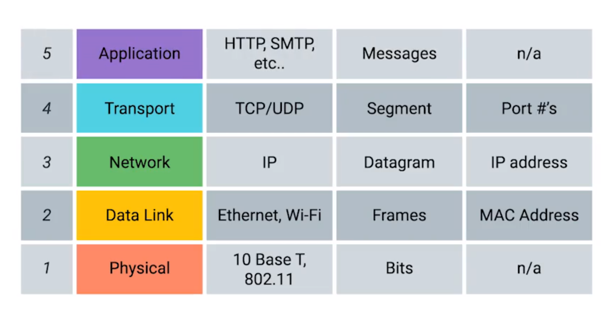
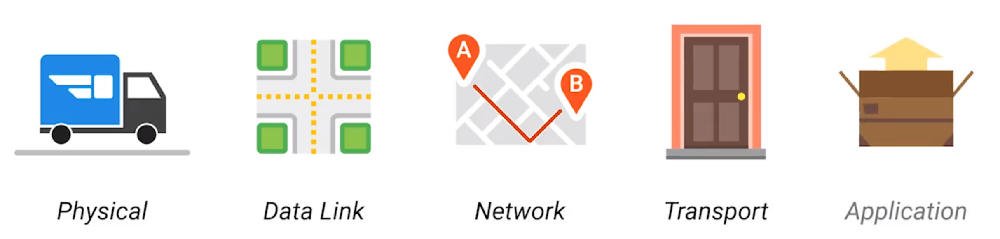
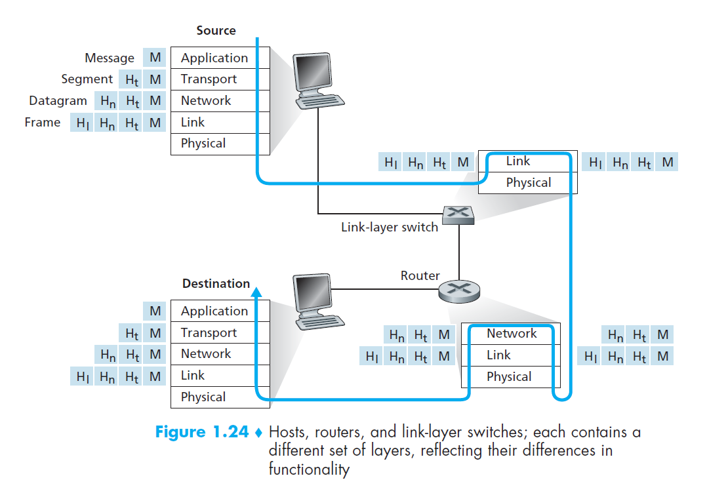

---
title: "Internet: Protocols and Service Models"
notebook: Computer Systems
layout: note
date: 2020-03-03 16:14
tags: 
...

# Intro to internet/layers

[TOC]: #

## Table of Contents
- [History (K&R)](#history-kr)
- [1961-1972](#1961-1972)
  - [1972-1980](#1972-1980)
  - [1980-1990](#1980-1990)
  - [1990s](#1990s)
  - [2000s](#2000s)
- [Outcome](#outcome)
- [[OSI: the internet that wasn't](https://spectrum.ieee.org/tech-history/cyberspace/osi-the-internet-that-wasnt)](#osi-the-internet-that-wasnt)
  - [Flaw of OSI Approach](#flaw-of-osi-approach)
  - [Pros of OSI approach](#pros-of-osi-approach)
  - [Internet](#internet)
- [Network Models](#network-models)
- [Connection-oriented vs connectionless](#connection-oriented-vs-connectionless)
- [TCP/IP vs OSI](#tcpip-vs-osi)
- [OSI philosophy](#osi-philosophy)
- [OSI model](#osi-model)
- [TCP/IP model](#tcpip-model)
- [Protocol Stack](#protocol-stack)
- [Internet by nuts and bolts](#internet-by-nuts-and-bolts)
  - [ISPs](#isps)
  - [Protocols](#protocols)
- [Internet by services](#internet-by-services)
- [Protocol Layers](#protocol-layers)
- [IP Stack](#ip-stack)
  - [Application Layer](#application-layer)
  - [Transport Layer](#transport-layer)
  - [Network Layer](#network-layer)
  - [Link Layer](#link-layer)
  - [Physical Layer](#physical-layer)
- [OSI Model](#osi-model-1)
  - [Presentation layer](#presentation-layer)
  - [Session Layer](#session-layer)
- [Encapsulation](#encapsulation)

Readings
[x] K&R 1.1, 1.5

- aggregation of many smaller networks
- history in 3 phases
  - 60s-70s: ARPANET
  - 70s-80s: NSFNET
  - 80s: on Internet
- social media + Web 2.0: individual users can add content

- Tier 1 ISP: guarantees routing of packet

## History (K&R)

## 1961-1972
- **packet switching** pursued to connect computers from distinct geographic regions
  as traffic likely to come in **bursts**, i.e. intervals of activity, with periods of
  inactivity (c.f. circuit switching on telephones)
- multiple teams with opposing approaches and philosophies
- **ARPAnet**: first packet-switched computer network
  - 4 nodes in 1969 at universities/research groups
  - funded by US DoD (Advanced Research Projects Agency, soon to be DARPA)
  - 15 nodes in 1972
    - implemented first host-to-host protocol NCP (Network Communications Protocol)
      defined in RFC001
    - first email program developed
  - initially restricted to computers within ARPAnet
- early-mid 1970s: other standalone packet-switching networks came into existence.
  A few examples:
  - ALOHAnet: microwave network linking Hawaiian universities
  - DARPA's packet-satellite and packet-radio networks
  - Telenet: commercial packet-switching network

### 1972-1980
- now it became goal to interconnect these networks as a network of networks
- international network working group (1972)
  - developed TCP/IP
  - robustness built in due to unreliable communication links
  - packet switched datagram based network standard proposed
  - initially TCP included forwarding functions but these were later separated to IP
    due to need to have distinct transport layer protocol
- Ethernet protocol: 1976

### 1980-1990
- end of 1970s: 200 hosts on ARPAnet
- end of 1980s: 100,000 hosts on public Internet
- most of this growth came from efforts to link university networks together
- 1986: **NSFNET** created for NSF-sponsored supercomputing centres
  - Initially 56kbps, backbone 1.5Mbps by end of decade
  - became primary backbone linking regional networks
- Jan 1 1983: deployment of TCP/IP as standard host protocol on ARPAnet, replacing NCP
- *OSI model* (open system for interconnection)
  - rivalry between ARPANET and OSI teams
  - became published ISO
  - slow development led to frustration
- *NSFNet* by National Science Foundation 1986 to provide researchers with
  supercomputer access
- late 80s:
  - TCP enhanced with congestion control mechanism
  - DNS developed
  - commercial ISPs appear
  - CERN develops TCP/IP

### 1990s

- ARPAnet decommissioned
- 1995: NSFNET decommissioned
- Commercial ISPs providing internet backbone trafic
- emergence of the World Wide Web application: explosion into popular usage
  - Web: invented at CERN by Tim Berners-Lee (1989-1991) based on earlier work on hypertext
- 1995-2000: huge growth; dot com boom
  - Email
  - the Web
  - instant messaging
  - peer-to-peer file sharing (pioneered by Napster)
- 2001: dot com bubble bursts

### 2000s

- growth in broadband to homes
- on-demand streaming
- online social networks
- Web 2.0 with user created content
- cloud-based applications/storage

## Outcome

- two protocol stacks:
  - TCP/IP standards post-hoc
  - OSI standardised before the fact, not widely implemented
- why is a model necessary?
  - ensure interoperability: open rather than proprietary
  - reference model to develop and validate against independently
  - simplify design process through abstraction
- protocols were designed without consideration of adversaries on the network
  - security was retrofitted, many insecure protocols are still in use e.g. DNS
- "palace revolt" 1992: OSI solution to IPv4 limitations was rejected; so IPv6 only
  introduced in 1996 and isn't widely used

## [OSI: the internet that wasn't](https://spectrum.ieee.org/tech-history/cyberspace/osi-the-internet-that-wasnt)

- OSI Vision: complete, open, multilayered system
  - easy data exchange
  - enable collaboration and commerce
  - was supported by those who mattered: computer and telephone companies, regulators, governments, international standards orgs, academics, US DoD
  - mid-80s: adoption of OSI appeared inevitable
  - early-90s: project stalled in face of cheap, agile, less comprehensive Internet TCP/IP
  - "OSI is a beautiful dream, and TCP/IP is living it!"
- 1960s: Packet switching being developed by many different bodies simultaneously
  - existing giants e.g. IBM wanted to protect existing revenue and use connection-oriented virtual circuits for packet switching
- 1972: International Network Working Group (INWG) forms to attempt standardisation
  - promoted datagram style packet-switching (connectionless)
- 1975: INWG submission of protocol to body overseeing telecom standards International Telegraph and Telephone Consultative Committee (French acronym, CCITT)
  - committee rejected INWG proposal as too risky and untested
  - CCITT "do not object to packet switching as long as it looks just like circuit-switching"
  - resulted in rift between development of internet and regroupings of INWG who proposed OSI
- 1976: CCITT publishes standard for packet switching via virtual circuits
- 1977: British proposal of new ISO standards committee for packet-switching networks
  - called for "network standards for open working": signalled desire for competition with IBM and telecom monopolies
  - chairman was Charles Bachman who won Turing award for Integrated Data Store (DBMS)
    - had architectural vision for OSI with distinct layers for which protocols would be developed
  - IBM System Network architecture focused on terminal-to-computer, while OSI would interconnect computers as peers
  - Attractive to GM with vast amounts of incompatible hardware and software: Bachman's scheme allows proprietary computers to work together
  - OSI model provides modularity - enabling subdivision of work between subcommittees
  - International standard process: four steps
    - working draft
    - draft proposed international standard
    - draft international standard
    - international standard
- 1978: OSI first plenary meeting
  - each player has own agenda, projects and interests
  - many were skeptical that networking could be taken from hands of IBM/big telecom
  - IBM reps steered discussion in line with IBMs own interests
  - OSI progressed with both connectionless protocols + virtual circuits, increasing its size and complexity
- 1983: birth of internet: US DoD mandated use of TCP/IP on ARPAnet
- 1983: OSI reference model published as international standard ISO7498
  - Individual standards for transport protocols, email, ... followed
  - large companies (Honeywell, IBM) were heavily invested in OSI,
- 1985: US DoD recommended to migrate to OSI from TCP/IP
- 1988: US Dept of Commerce: mandated OSI standard to be used in all computers purchased by US Government after 1990
- 1989: "Is OSI too late?" talk given
  - frustration with slow development
  - “Government and corporate policies never fail to recommend OSI as the solution. But, it is easier and quicker to implement homogenous networks based on proprietary architectures, or else to interconnect heterogeneous systems with TCP-based products.”
- 1991: Tim Berners-Lee announces public release of WWW
- 1992: NSF revises policies to allow commercial traffic over internet
- 1992: "palace revolt": Internet engineers reject ISO ConnectionLess Network protocol as replacement for IPv4
  - engineers in 80s began to view OSI as misguided monstrosity created by European bureaucrats: this bias led to rejection of OSI's technical insights
  - leaders of Internet Engineering Task Force suggested IPv4 limitations needed to be addressed and community should consider OSI technical protocols
- they were subsequently sacked by engineer body
- 1996: IPv6 defined
- 2013: IPv6 carries ~1% of global traffic

### Flaw of OSI Approach

- commitment to openness: international standards give all interested parties a
  voice, which can be subject to disruptive tactics, incompatible visions, different business models
  - significant organisational overhead: e.g. debating use of words like SHOULD/WILL
  - anticipatory standardisation
### Pros of OSI approach
- handled cutting-edge technological questions
- learning by doing approach producing many bright minds in the field

### Internet
- view was that IP/TCP solved immediate practical need for interoperability, with view that OSI would eventually become the future network approach
- decades of government subsidies for research meant Internet protocols could be implemented for free
- Unix had IP/TCP integrated in early 80s due to DoD subsidized research
  - To use OSI standards each network equipment company needs to purchased document in paper
  - “On one side you have something that’s free, available, you just have to load it. And on the other side, you have something which is much more architectured, much more complete, much more elaborate, but it is expensive. If you are a director of computation in a company, what do you choose?”

## Network Models

- _model_ network as stack of layers
- each layer offers services to layers above it
- inter-layer exchanges per protocol
- in reality layering violations do occur, but a helpful abstraction

- *service*: set of primitives that a layer provides to a layer above it (think API)
- *protocol*: rules which governs format and meaning of packets exchanged by peers within layer
  - packets are sent between peer entities

## Connection-oriented vs connectionless

- connection-oriented (TCP)
  - connect, use, disconnect
  - negotiation inherent in connection setup
  - think telephone call
- connectionless (UDP)
  - think postal service or sending text message: you don't notify you are sending text messages
- choice affects
  - reliability
  - cost
  - quality of service

## TCP/IP vs OSI

- TCP/IP model reflects what happens on internet
- OSI model reflects more what _should_ happen

## OSI philosophy

- layers should be created iff a different abstraction needed
- each layer should perform well defined function
- layer boundaries should minimise information flow across interfaces
- number of layers should be
  - small enough that architecture isn't unwieldy
  - big enough that multiple functions aren't grouped together in a layer by necessity

## OSI model

- Application
- Presentation
- Session
- Transport
- Network
- Data link
- Physical

## TCP/IP model

- Application
- Transport
- Internet
- Host-to-network

## Protocol Stack

- application: TELNET, FTP, SMTP, DNS
- transport: TCP, UDP
- network: IP
- physical, data-link: SATNET, LAN

## Internet by nuts and bolts

- network inerconnecting hundreds of millions of computing devices,
  **hosts** aka **end systems**
- **communication links** connect hosts
  - physical media: coaxial cable, copper wire, optical fibre, radio spectrum
- **packet**: data + header
  - sent through network to destination host
- **packet switch**: forwards packet from ingoing to outgoing communication link
  - e.g. **router**, **link-layer switch**
- **route**/**path**: sequence of communication links and packet switches

### ISPs

- **Internet service providers**: network of packet switches and communication links
  providing Internet access to end systems
- ISPs, with lower tiers being connected through national and international
  upper-tier ISPs
- upper-tier ISPs: high speed routers interconnected with high speed fibre-optic links

### Protocols

- internet's principal protocols are **TCP/IP**
  - **Transmission Control Protocol (TCP)**
  - **Internet Protocol (IP)**
- **internet standards** developed by Internet Engineering Task Force (IETF)
  - standards documents are **requests for comments (RFCs)**
- IEEE 802 LAN/MAN Standards committee: specifies Ethernet, wireless WiFi standards

## Internet by services

- Internet can be considered _infrastructure that provides services to applications_
  - e.g. email, web surfing, social networks, VoIP, streaming, ...
- applications are **distributed applications** because they involve multiple
  end systems exchanging data, and run on end systems (not in packet switches)
- **application programming interface (API)**: defines how a program on one end system
  can deliver data to a destination program running on another end system
  - _analogy: sending a letter ~ postal service API._  You need to label envelope with name and address + post code
    affix a stamp and drop in a post box.
- **protocol**: defines format and order of messages exchanged between communicating
  entities, and actions taken on transmission/receipt of message/event

## Protocol Layers

- **protocols layer**: used to group protocols, and associated hardware and software implementing them into layers
  - provide **services** to layer above
  - depend on services of layer below
- **protocol stack**: set of protocol layers
- layers may use a mix of hardware and software
  - HTTP on application layer: software
  - network layer: software + hardware
  - Ethernet on physical layer: hardware
- pros of layering:
  - modularity
- cons of layering:
  - potential duplication of lower-layer functionality
  - functionality at one layer may need information from another layer, which violates
    the goal of layer separation

## IP Stack

Analogy of the IP stack

### Application Layer

- where network applications live e.g. HTTP (web), SMTP (email), FTP (file transfer), DNS
- **message**: (K&R) packet of information at application layer

### Transport Layer

- transports application-layer messages between application endpoints
- either TCP, UDP
- Transmission Control Protocol (TCP):
  - connection-oriented service to applications
  - guaranteed delivery
  - flow control (speed matching)
  - breaks long messages into shorter segments
  - congestion-control
- User Datagram Protocol (UDP):
  - connectionless service
  - no frills: no reliability, no flow control, no congestion control
- **segment**: (K&R) packet of information at transport-layer

### Network Layer

- aka IP layer
- transports datagrams between hosts
- **datagrams**: network-layer packets
- transport-layer protocol in a source passes segment and destination address to network layer
  - network layer provides delivery of segment to transport layer in destination host
- Internet Protocol (IP) + routing protocols

### Link Layer

- serves the network layer by delivering datagram to next node along its route
- at the next node the link layer passes datagram up to network layer
- protocols include Ethernet, WiFi
- along route from source to destination a datagram may be handled by different link-layer
  protocols e.g. WiFi and Ethernet
- **frames**: (K&R) link-layer packets

### Physical Layer

- move individual bits within frame from one node to the next
- protocols dependent on physical transmission medium (e.g. twisted-pair copper wire, fibre optic cable)

## OSI Model

- Open Systems Interconnection (OSI) model
- adds presentation and session layers
- absence of these layers from IP stack implies that it is up to the
  application developer to implement this functionality if it is desired

### Presentation layer

- provides services that allow communicating applications to interpret
  the meaning of data exchanged
  - data compression
  - data encryption
  - data description

### Session Layer

- provides for delimiting and synchronisation of data exchange
  - checkpointing and recovery scheme

## Encapsulation

- application-layer message has transport layer header $`H_t`$ appended
- ... so on through the stack until bits are transmitted along the physical
  medium
- at each layer a packet typically has:
  - header: e.g. at network layer, source and destination host IP addresses
  - payload field: packet from the layer above
