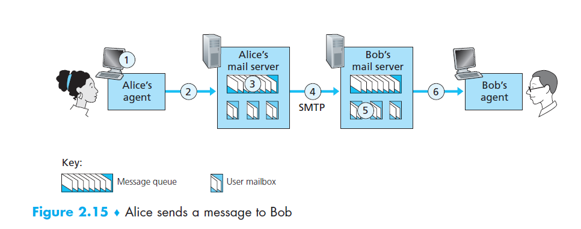
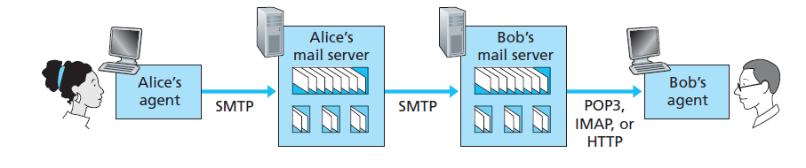

---
title: "Application Layer: HTTP and Cookies"
notebook: Computer Systems
layout: note
date: 2020-03-05 23:53
tags: 
...

# "Application Layer: HTTP and Cookies"

[TOC]: #

## Table of Contents
- [Readings](#readings)
- [Principles of Network Applications](#principles-of-network-applications)
  - [Network Application Architectures](#network-application-architectures)
  - [Processes Communicating](#processes-communicating)
  - [Interface between process and network](#interface-between-process-and-network)
  - [Addressing processes](#addressing-processes)
  - [Transport Services](#transport-services)
  - [TCP services](#tcp-services)
  - [SSL](#ssl)
  - [UDP Services](#udp-services)
  - [Application Layer Protocols](#application-layer-protocols)
- [The Web and HTTP](#the-web-and-http)
  - [HTTP: HyperText Transfer Protocol](#http-hypertext-transfer-protocol)
  - [Non-persistent and persistent connections](#non-persistent-and-persistent-connections)
  - [HTTP Request Message](#http-request-message)
  - [HTTP Response Message](#http-response-message)
  - [Cookies](#cookies)
  - [Web Caching](#web-caching)
  - [Static Web Documents](#static-web-documents)
  - [Dynamic content](#dynamic-content)
- [File Transfer Protocol: FTP](#file-transfer-protocol-ftp)
  - [FTP Commands and Replies](#ftp-commands-and-replies)
- [Email](#email)
  - [SMTP](#smtp)
  - [SMTP Commands](#smtp-commands)
  - [SMTP vs HTTP](#smtp-vs-http)
  - [Mail message header](#mail-message-header)
  - [MIME - Multipurpose Internet Mail Extensions](#mime---multipurpose-internet-mail-extensions)
  - [Mail access protocols](#mail-access-protocols)
- [DNS](#dns)
  - [DNS Components](#dns-components)
  - [Domain name characteristics](#domain-name-characteristics)
  - [Database: Resource Records](#database-resource-records)
  - [Inserting records into DNS](#inserting-records-into-dns)
  - [Types of name servers](#types-of-name-servers)
  - [Resolving queries](#resolving-queries)
  - [DNS Messages](#dns-messages)
  - [DNS Caching](#dns-caching)
  - [DNS Security](#dns-security)


## Readings
- [x] K&R 2.1
- [x] K&R 2.2
- [x] K&R 2.3
- [x] K&R 2.4
- [ ] K&R 2.6

## Principles of Network Applications

### Network Application Architectures

- **client-server:** always on _server_ host services requests from many other _client_ hosts
  - clients do not directly communicate
  - server has static IP address
  - e.g. Web, FTP, Telnet, email
  - data centres with multiple hosts provide powerful server to handle
    large volume of requests
- **peer-to-peer (P2P)**: direct communication between intermittently connected _peer_ hosts
  - peers are not owned by service providers but by end users
  - e.g. BitTorrent, Skype
  - self scalable: peers introduce workload with requests but also add service capacity
    through file distribution etc
  - cost effective: minimal server infrastructure/bandwidth

### Processes Communicating

- **process**: instance of a program running in an end system
- processes on different hosts communicate by exchanging **messages** across the network
- in context of communication session between two processes:
  - _client process_ initiates communicaton
  - _server process_ waits to be contacted

### Interface between process and network

- **socket**: software interface that allows a process to send/receive messages from the network
  - aka API between application and network, as socket is programming interface
    with which network apps are built
  - app developer has control over everything app side of socket, very little control
    transport-layer side:
    - may have a choice of protocol (UDP/TCP)
    - may have ability to set some transport-layer parameters


### Addressing processes

To communicate with a process on a remote host, you need:
- **IP address** identifying a host
  - IPv4: 32-bit
- **port number** specifies receiving process in destination host
  - e.g. HTTP: 80, SMTP: 25

### Transport Services

Can be classified by these dimensions:
- reliable data transfer
  - guaranteed data delivery
  - without it app needs to be loss-tolerant
  - provided by TCP
- throughput
  - specification of bits/sec required
  - elastic applications make use of whatever throughput is available
  - not provided by Internet transport protocols
- security
  - encryption/decryption
  - data integrity
  - end-point authentication
  - TCP with SSL
- timing
  - e.g. guarantee that every bit pumped into the socket is received within 100ms
  - e.g. applications: telephony, gaming
  - not provided by Internet transport protocols

### TCP services

- **connection oriented service**: handshake to set up connection
  - **full-duplex**: two processes can send messages over the connection simultaneously
  - connection must be torn down once finished
- **reliable data transfer service**: communicating processes can rely on TCP
  to deliver all data sent without error and in proper order
- **congestion control**: serves Internet as a whole rather than communicating processes
  - throttles a sending process when network is congested
  - attempts to allocate fair share of bandwidth

### SSL

- TCP and UDP have no built-in encryption
- **Secure Sockets Layer (SSL)**: TCP enhancement providing encryption, data
  integrity, end-point authentication
  - not a transport protocol, but an enhancement in residing in application layer
  - to use SSL, you need to include the code in your application
  - similar API to TCP, but before the transmission occurs it is first encrypted, then
    passed to TCP socket

### UDP Services

- lightweight transport protocol with minimal services
- connectionless
- unreliable data transfer service:
  - no guarantee of delivery
  - messages may arrive out of order
- no congestion control

### Application Layer Protocols

- **application-layer protocol**: defines how application's processes on different hosts
  pass messages, in particular
  - type of messages e.g. requests/responses
  - syntax of message types: fields, delimiters
  - semantics: what values of fields means
  - rules determining when/how process sends/responds to messages
- application layer protocol $\not =$ network application; the protocol is one
  part of the application
  - e.g. the Web
    - application: includes standard for document formats (HTML), web browsers,
      web servers, application-layer protocol
    - protocol: HTTP

## The Web and HTTP

- before the Web, the Internet was used primarily by researchers, academics, university students
  primarily to transfer files, receive news, send email
- early 90s saw introduction of the Web, and general public was now using the Internet
  - on demand content
  - easy/low cost to publish content

### HTTP: HyperText Transfer Protocol

- HTTP 1.0 [RFC1945](https://tools.ietf.org/html/rfc1945)
- HTTP 1.1 [RFC2616](https://www.ietf.org/rfc/rfc2616.txt)
- HTTP 2.0 [RFC7540](https://tools.ietf.org/html/rfc7540)

- Web's application-layer protocol
- implemented on client program and server program, on distinct hosts, which communicate via
  HTTP messages
- HTTP defines structure of the messages and how the client/server exchange messages
- **web page** consists of **objects** - a file addressable by a single URL
- most web pages: **base HTML file** + several objects (images, CSS, javascript, ...)
  referenced by base HTML file
- once HTTP client sends message into socket interface, it is out of hands of client
  and in hands of TCP
- **stateless protocol**: HTTP server maintains no info about clients

### Non-persistent and persistent connections

- decision by app developer whether to use **persistent/non-persistent connection**
- **non-persistent connections**
  - TCP connection needs to be established for each object: lots of overhead
    and significant burden on the server
  - could use parallel TCP connections (typically up to 5-10) handling individual
    request-response transaction
- **three-way handshake**: each step involves transfer of TCP segment
  - client: requests connection
  - server: responds with acknowledgement
  - client: acknowledges connection + HTTP request
- **persistent connection**: server leaves TCP connection open after sending response
  - **pipelining**: back-to-back requests made without waiting for replies to pending
    requests; speeds up transfer
  - multiple web pages residing on the same server can be sent via a single persistent
    TCP connection
  - server closes connection after a timeout interval
  - default mode: persistent connections with pipelining

### HTTP Request Message

- `User-agent:` specifies browser type making request, allowing server to provide
  different versions of the same object depending on the user agent
- `Host:` necessary for Web proxy caches


### HTTP Response Message

Consists of
- status line
- header lines
- entity body: requested object itself

### Cookies

- **cookies** allow sites to keep track of users to identify users, either to restrict
  access or serve tailored content
- place small amount of info (<4kB) on user's computer,
- fields: domain: server the cookie belongs to, path, content, expiry, security
- HTTP messages carry state
- components
  - cookie header line in HTTP response message: `Set-cookie: 1678`
  - cookie header line in HTTP request message: `Cookie: 1678`
  - cookie file kept on user's end system, managed by the browser
  - back-end database server-side
- when you access a site, it may respond with a Set-cookie: <id>, with that id and the server hostname
  being appended to a cookie file.  When you make HTTP requests this id is
  added to the header, and the server uses it for some cookie-specific action,
  such as maintaining intended purchases.


### Web Caching

- **web cache/proxy server**: network entity satisfying HTTP requests on behalf of
  origin web server
  - has storage on which it caches recently requested objects
  - browsers can be configured so that HTTP requests are first directed to
    the web cache
  - if the web cache doesn't have a copy of that object it requests it from the
    origin server
  - typically installed by an ISP or e.g. university campus
- **benefits:**
  - reduces response times for client requests if there is a high speed connection
    from client-cache c.f. client-origin
  - substantial reduction in traffic on access link (e.g. within campus), using less bandwidth
  - substantial reduction in Internet traffic, improving performance for all applications
- **conditional GET**: HTTP mechanism to verify objects are up to date
  - adds an `If-Modified-Since:` header line to a GET request
  - cache will issue this request if it has a cached object, using the `Last-Modified:` header line
    from the response header
  - if the object has not been modified, the server responds with a `304 Not Modified`
    and an empty entity body
  - conditional GET saves bandwidth and increases end user response times


**_Conditional get from browser cache_**


**_Proxy server for cacheing, security, IP address sharing_**

### Static Web Documents

- **hypertext markup language (HTML)**
  - plain text encoding, browser rendering
- components of a web page
  - Head <head>...</head>
  - Body <body>...</body>
  - Attributes and values ">
  - hyperlinks/anchors <a href="next_page.html">
  - cannot nest tags, < and > can be in argument strings
  - cannot mis-nest <b><i>text</b></i> $\Rightarrow$ <b><i>text</i></b>

### Dynamic content

- server side: PHP script
- client side: e.g. JavaScript, AJAX
  - script sent to client

## File Transfer Protocol: FTP

- local host wants to transfer files to/from remote host
- user provides remote hostname + authentication and then can transfer files using an FTP user agent
- runs on TCP, but uses two parallel connections to transfer a file
  - **control connection**: sending information e.g. credentials, put/get commands
    - this is **out-of-band**
    - port 21
  - **data connection**: send actual files
    - this is **in-band**
    - port 20
    - one connection per file transfer
- user **state** maintained:
  - control connection associated with an account
  - current directory
- need to keep track of state info constrains total number of simultaneous sessions


### FTP Commands and Replies

- [RFC 959](https://tools.ietf.org/html/rfc959)
- commands/replies sent across control connection in 7-bit ASCII format
- successive commands delimited by <cr><lf>
- commands are 4 uppercase characters, some with arguments
  - `USER username`
  - `PASS password`
  - `LIST`: file listing in current directory
  - `RETR filename`: retrieve file from current directory of remote host
  - `STOR filename`: put file
- replies: 3 digit numbers with optional message
  - `331 Username OK, password required`
  - `125 Data connection already open; transfer starting`
  - `425 Can't open data connection`
  - `452 Error writing file`

## Email

- high level view
  - **user agents**: e.g. Microsoft Outlook, allows users to read/compose/etc. email
  - **mail servers**: user **mailboxes** stored on the mail server
    - manages and maintains messages sent to him
    - authenticates users
    - attempts to deliver message to recipient's mail server.  This goes in **message queue**
      and stays on the senders queue until successfully sent.  User is notified if
      there is no success after several days
  - **Simple Mail Transfer Protocol (SMTP)**: principal application-layer protocol for Internet e-mail
    - uses TCP for reliable data transfer between mail servers

### SMTP

- defined in RFC5321, first published 1982, but protocol was around much earlier
- port 25
- much older than HTTP, has archaic characteristics
  - e.g. restricts message body to 7-bit ASCII: binary media data has to be encoded
    in ASCII then decoded back to binary
- does not normally use intermediate mail servers for sending mail: TCP connection
  is direct between mail servers
- when sending mail:
  - user submits mail to client mail server
  - client mail server establishes TCP connection with recipient mail server
  - SMTP handshake: identifies sender address and recipient address
  - client sends message
  - process is repeated if there are other messages to send to that server, otherwise
    the connection is closed (persistent connections)


### SMTP Commands

- `HELO`: Hello; initiate handshake
- `MAIL FROM`: sender email
- `RCPT TO`: recipient email
- `DATA`: email message, terminated with period `.`
- `QUIT`: close connection

### SMTP vs HTTP

- HTTP transfers objects (files) from Web server to Web client
- SMTP transfers messages (files) from mail server to mail server
- HTTP mainly **pull protocol**: someone loads information, HTTP used to pull at convenience
  - TCP connection initiated by machine that _wants to receive_ file
- SMTP mainly **push protocol**: sending mail server pushes file to receiving mail server
  - TCP connection initiated by machine that _wants to send_ file
- SMTP requires ASCII message, HTTP does not
- HTTP encapsulates each object in an individual HTTP response message
- SMTP combines all message objects into one message

### Mail message header

- distinct from SMTP handshake
- headers are separated by `<CR><LF>`
- header ends with a blank line i.e. `<CR><LF>`
- mandatory header lines:
```
From: abc@xyz.com
To: ijk@bbb.com
Subject: searching for the meaning of life
```
- other header lines:
```
CC:
Bcc:
Message-Id:
In-Reply-To: <- ID of message you are replying to
Reply-To:
...
```

### MIME - Multipurpose Internet Mail Extensions

- originally email messages only used ASCII.  Mime introduced to support:
  - other languages
  - alternative message content types (audio, images)
- 5 additional message headers:
  - MIME-Version
  - Content-Description: human readable description
  - Content-Id
  - Content-Transfer-Encoding: how body is wrapped for transmission
  - Content-Type: type/format of content

### Mail access protocols



- used to access mailbox from user's mail server
- cannot use SMTP to pull mail as it is a push protocol
- options:
  - **POP3 (Post office protocol - version 3):** simple, limited functionality
    - user agent opens TCP connection on port 110 of mail server
    - 3 phases:
      - authorisation phase
      - transaction phase: user agent retrieves messages, mark messages for deletion etc.
      - update phase: ends POP3 session, then mail server deletes messages marked
    - does not maintain state between POP3 sessions
  - **IMAP: Internet Mail Access Protocol**
    - nomadic user wants to maintain state e.g. folders of mail across
      different devices
    - IMAP provides ability to
      - add folders
      - move mail to folders
      - search remote folders
      - obtain component of a message (e.g. message header) saving bandwidth
    - IMAP server maintains state across folders
  - HTTP
    - Hotmail introduced Web based email access in 1990s
    - user agent is an ordinary broswer
    - messages retrieved from mail server via HTTP

## DNS

- **hostname**: human-readable identifier of Internet host
  - provides little info on location of host on Internet
  - variable length strings: difficult to process by routers
- **IP addresses**: "machine-readable" host identifier
  - IPv4 address: 4 bytes a.b.c.d, $a,b,c,d \in [0,255]$
  - hierarchical: address from left to right is increasingly specific about
    where host resides in Internet
- **domain name system (DNS)**: directory service translating hostnames to IP addresses
  - distributed database implemented in a hierarchy of DNS servers
  - application-layer protocol that allows hosts to query this database
  - servers are typically UNIX machines running Berkeley Internet Domain Name (BIND) software
  - uses **UDP, port 53**
  - commonly used by other application-layer protocols (e.g. HTTP, SMTP) to translate
    user-supplied hostnames to IP addresses
  - IP addresses are often cached in nearby servers to reduce DNS traffic and latency
  - unlike HTTP, FTP, SMTP; DNS is not intended for end user use
- other services DNS provides
  - **host aliasing**: resolve to **canonical hostname** and corresponding IP address from multiple aliases
  - **mail server aliasing**: useful to have mnemonic mail server address, which
    can also be identical to Web server hostname
  - **load distribution** among replicated servers by providing round robin response of IP address

  - why DNS is distributed not centralised:
    - single point of failure: if DNS failed entire Internet would cease working
    - traffic volume
    - distant centralised database: e.g. Australian queries directed to America would introduce
      significant latency
    - maintenance
    - in summary: it doesn't scale

### DNS Components
[TODO]
- **domain name space**:
- **DNS database**
- **name servers**
- **resolvers**:

### Domain name characteristics

- case insensitive
- $\le$ 63 chars per constituent
- $\le$ 255 chars per path
- can be internationalised: introduces security problems as people can repeat domain name


- opened up in 2014 to allow e.g. `.accenture`

### Database: Resource Records

- resource records carried by DNS replies
  - 4-tuple: `(Name, Value, Type, TTL)`

| Type  |                                                   Value                                                    |
|:-----:|:----------------------------------------------------------------------------------------------------------:|
|   A   |                                      IPv4 address for hostname `Name`                                      |
| AAAA  |                                      IPv6 address for hostname `Name`                                      |
|  NS   |                           Hostname of authoritative DNS server for domain `Name`                           |
| CNAME |                                Canonical hostname for alias hostname `Name`                                |
|  MX   | Mail exchange. Canonical name of a mail server.  Allows company to have same aliased name for mail and Web |

- Authoritative DNS server for a particular hostname contains corresponding A record
- Non-authoritative server for a given hostname: contains a NS record for domain that includes the hostname
  - also contains A record that provides IP address of the DNS server referenced in the NS record
- Can use multiple A records for a single domain name to balance traffic across multiple servers

### Inserting records into DNS

- **DNS registrar** provided with names, IP addresses of authoritative name server
  - ensures uniqueness of the domain name
  - inserts two resource records into TLD server
- create authoritative server: [TODO]

### Types of name servers

Hierarchy

- **Root DNS servers**: managed by 13 different organisations, with [~1100 (at 2020-03-12)](https://root-servers.org/) distinct server instances around the world
  - provide IP address of TLD servers
  - [IANA list of root servers](https://www.iana.org/domains/root/servers)
  - a.root-servers.net
  - 13 root servers [due to](https://securitytrails.com/blog/dns-root-servers)
    old DNS infrastructure + IPv4: IP addresses needed to fit in
    single packet of 512 bytes = 13*(32 bytes)+(96 bytes for protocol info)
- **Top-level domain DNS servers**: server clusters for
  - top-level domains e.g. com, edu, org, net
  - country top-level domains e.g. au, fr
  - provide IP address of Authoritative DNS servers
- **Authoritative DNS servers**: houses DNS records that map hostnames to IP addresses
  - publicly accessible hosts e.g. web servers, mail servers, provide these records
  - organisations can implement their own or pay to host records with a service provider that implements authoritative DNS server
- **Local DNS server**: not part of hierarchy
  - each ISP has a local DNS server (default name server)
  - when host connects to an ISP, ISP provides IP addresses of 1+ local DNS servers
  - local DNS server is typically close to the host
  - local DNS server acts as a proxy, forwarding DNS queries into server hierarchy
  - ISP has default name server that handles DNS queries
  - local DNS server acts as proxy

### Resolving queries


- **recursive query** e.g. $1$ in image, as `dns.nyu.edu` obtains mapping on behalf of
  `cse.nyu.edu`
- **iterative query** e.g. $2, 3, 4$ in image, as replies are directly returned to `dns.nyu.edu`
- in theory: any query could be recursive or iterative, but usually follow pattern
  - requesting host $\rightarrow$ local DNS server: recursive
  - remaining queries: iterative

### DNS Messages

- DNS has only query and reply messages

_**DNS message format**_

- to see this in action, use `nslookup`:
```bash
# query A record for google.com
$ nslookup
> google.com
Server:         192.168.20.1
Address:        192.168.20.1#53

Non-authoritative answer:
Name:   google.com
Address: 216.239.32.117
Name:   google.com
Address: 216.239.34.117
Name:   google.com
Address: 216.239.38.117
Name:   google.com
Address: 216.239.36.117
Name:   google.com
Address: 2001:4860:4802:38::75
>^C
# look up NS record of registermachine.com with google name server 8.8.8.8
$ nslookup -type=NS registermachine.com 8.8.8.8
Server:         8.8.8.8
Address:        8.8.8.8#53

Non-authoritative answer:
registermachine.com     nameserver = ns-1362.awsdns-42.org.
registermachine.com     nameserver = ns-1556.awsdns-02.co.uk.
registermachine.com     nameserver = ns-363.awsdns-45.com.
registermachine.com     nameserver = ns-894.awsdns-47.net.

Authoritative answers can be found from:
```
### DNS Caching

- DNS caching used extensively to
  - improve delay performance
  - reduce number of DNS messages travelling through the Internet
- when DNS server receives a DNS reply, it caches the mapping in local memory,
  and returns this for any future queries
- DNS servers discard cached information after time period (typically 2 days)
- due to caching, root servers are largely bypassed

### DNS Security

- no security in original design
  - DNS spoofing: e.g. "I'm google"
  - DNS flooding: DNS critical to Internet so DOS on DNS could break a huge amount
- solutions to make DNS secure
  - DNSSEC: digitally signed answers to DNS queries
    - not yet fully deployed
  - root signing

