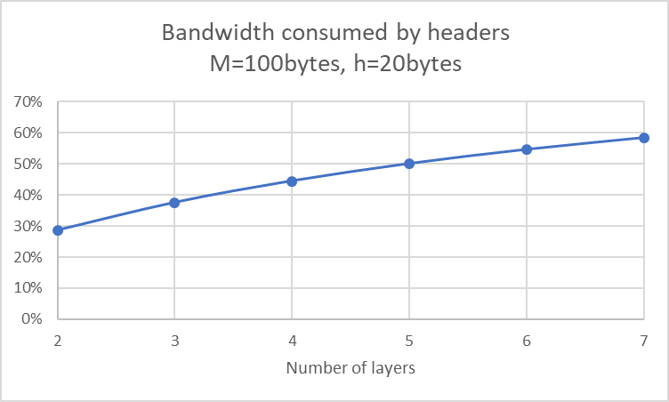
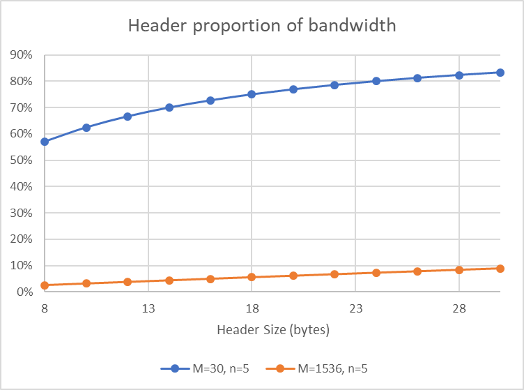

---
title: "T2 Service Models, Application Layer: HTTP and Cookies"
notebook: Computer Systems
layout: note
date: 2020-03-07 22:43
tags: 
...

# T2 Service Models, Application Layer: HTTP and Cookies

[TOC]: #

Service Models, Application Layer: HTTP and Cookies
1. List two advantages and two disadvantages of having international standards for network protocols.

  - Advantages:
    - you are able to produce a system with global interoperability, without being locked
      into proprietary systems
    - standards provide a framework that allows engineers to approach
      development with well defined boundaries about which layer of the stack they
      are interacting with
  - Disadvantages:
    - very slow to develop, meaning that non-standardised solutions may appear and
      dominate prior to any standard being released
    - you may be locked into a system with inferior performance (per some metric)
      as a result of a) satisfying the needs of a large group rather than the specific
      needs of a particular project; or b) due to technology moving faster than
      the standards
2. Suppose the algorithms used to implement the operations at layer $k$ are
changed. Do the implementations of the operations at layers $k-1$ and
$k + 1$ need to change accordingly?
  - ideally, neither of the implementations would change assuming that the API
    on each interface does not change.  However, if the implementation is not "pure"
    (i.e. it crosses multiple layers), then the crossed layers may also need modifications
3. Suppose there is a change in the service (set of operations) provided by
layer $k$. How does this impact services at layers $k-1$ and $k + 1$?
  - this will not affect layer $k-1$, since it is providing services to layer $k$,
    however it will affect layer $k+1$, since the services provided to it are changing
4. Suppose that an application generates a message of length M bytes and
there are n lower layers each of which adds a $h$-byte header. What fraction
of the network bandwidth is filled with headers?
  - $\frac{nh}{nh+M}$

Optional: To give yourself a feeling for the role of overheads,
- plot this for M = 100, h = 20 and N ranging from 2 to 7.

- Plot it again for M = 30, n = 5 and h ranging from 8 to 30.
- Plot it again for M = 1536, n = 5 and h ranging from 8 to 30.


5. List five non-proprietary Internet applications and the application-layer
protocols that they use. (Search beyond the lecture notes.)
  - File transfer e.g. FileZilla: FTP
  - Any email client: SMTP
  - Putty: SSH
  - the web e.g. Firefox: HTTP
  - time synchronisation: NTP (Network time protocol)
  - network management; collating log files and modifying device behaviour: SNMP
    (Simple network management protocol)
6. Consider an e-commerce site that wants to keep a purchase record for each
of its customers. Describe how this can be done with cookies.

7. Consider the following string of ASCII characters that were captured by
Wireshark when the browser sent an HTTP GET message (i.e., this is the
actual content of an HTTP GET message). The characters $\langle cr\rangle\langle lf\rangle$ are
carriage return and line-feed characters Answer the following questions,
indicating where in the HTTP GET message below you find the answer.
```console
GET /people/index.html HTTP/1.1<cr><lf>
Host: cis.unimelb.edu.au<cr><lf>
Connection: keep-alive<cr><lf>
Cache-Control: max-age=0<cr><lf>
Upgrade-Insecure-Requests: 1<cr><lf>
User-Agent: Mozilla/5.0 (Windows NT 6.1; Win64; x64)
AppleWebKit/537.36 (KHTML, like Gecko) Chrome/64.0.3282.186 Safari/537.36<cr><lf>
Accept: text/html,application/xhtml+xml,application/xml;q=0.9,
image/webp,image/apng,*/*;q=0.8<cr><lf>
Accept-Encoding: gzip, deflate<cr><lf>
Accept-Language: en-AU,en;q=0.9<cr><lf>
<cr><lf>
```
- a. What is the URL of the document requested by the browser?
  - http://cis.unimelb.edu.au/people/index.html from lines 1 and 2
- b. What version of HTTP is the browser running?
  - HTTP 1.1 from line 1
- c. Does the browser request a non-persistent or a persistent connection?
  - persistent (keep-alive), line 3
- d. What is the IP address of the host on which the browser is running?
  - Not listed, requires DNS resolution for cis.unimelb.edu.au
- e. What type of browser initiates this message? Why is the browser
  type needed in an HTTP request message?
  - browser is Firefox; they implement features differently so you may need to be
    served slightly different content for compatibility
8. True or false?
- a. A user requests a Web page that consists of some text and three
images. For this page, the client will send one request message and
receive four response messages.
  - False: four requests and four responses, but assuming on HTTP >= 1.1 then likely
    only one connection established
- Two distinctWeb pages (for example, http://cis.unimelb.edu.au/research/
  and http://cis.unimelb.edu.au/people) can be sent over the same persistent connection.
  - True: they are on the same server.
- With non-persistent connections between browser and origin server,
  it is possible for a single TCP connection to carry two distinct HTTP
  request messages.
  - False: connection closes at the end of a request.
- The Date: header in the HTTP response message indicates when the
object in the response was last modified.
  - False: indicates datetime message was sent
- HTTP response messages never have an empty message body.
  - False: e.g. Statuscode 204: no content; must not include a message body
