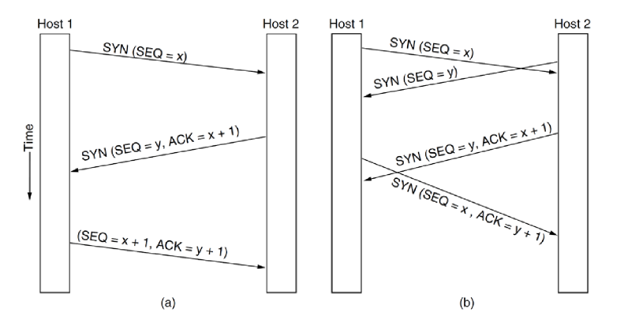

---
title: Transport Layer
notebook: Computer Systems
layout: note
date: 2020-03-13 00:01
tags: 
...

# Transport Layer

[TOC]: #

## Table of Contents
- [Reading](#reading)
- [Presentation Layer](#presentation-layer)
- [Session Layer](#session-layer)
- [Transport Layer Services](#transport-layer-services)
- [TCP/UDP Service Models](#tcpudp-service-models)
- [Multiplexing and Demultiplexing](#multiplexing-and-demultiplexing)
- [Transport Layer Addressing](#transport-layer-addressing)
- [Port scanning](#port-scanning)
- [Multiplexing UDP](#multiplexing-udp)
- [UDP](#udp)
  - [DNS](#dns)
  - [SNMP](#snmp)
  - [VoIP](#voip)
  - [RPC](#rpc)
  - [RTP](#rtp)
- [UDP Segment Structure](#udp-segment-structure)
- [DDoS](#ddos)
- [Multiplexing TCP](#multiplexing-tcp)
- [TCP Service Primitives](#tcp-service-primitives)
- [Connection Establishment Complications](#connection-establishment-complications)
- [TCP Service Model](#tcp-service-model)
- [Establishing a TCP connection](#establishing-a-tcp-connection)
- [Web servers and TCP](#web-servers-and-tcp)
- [TCP Connection features](#tcp-connection-features)
- [TCP Properties](#tcp-properties)
- [TCP Header](#tcp-header)
- [Three-way handshake](#three-way-handshake)
- [TCP segments](#tcp-segments)
- [Synchronisation](#synchronisation)
- [Retransmission](#retransmission)
- [Closing TCP connection](#closing-tcp-connection)
- [`SYN` flooding](#syn-flooding)
- [Reliable Data Transfer](#reliable-data-transfer)
  - [Mechanisms for reliable data transfer](#mechanisms-for-reliable-data-transfer)
- [Socket Programming](#socket-programming)
  - [Berkeley Sockets](#berkeley-sockets)
  - [Using sockets](#using-sockets)
  - [Simple Connection Management](#simple-connection-management)
  - [Socket Finite State Machine](#socket-finite-state-machine)
- [Sockets in C](#sockets-in-c)
  - [Multi-threaded web server](#multi-threaded-web-server)
- [Round-Trip Time estimation and Timeout](#round-trip-time-estimation-and-timeout)
  - [Estimating round trip time](#estimating-round-trip-time)
  - [Timeout interval](#timeout-interval)
- [TCP Reliable data transfer](#tcp-reliable-data-transfer)
  - [Fast retransmit](#fast-retransmit)
- [TCP Flow Control](#tcp-flow-control)
  - [TCP Sliding window](#tcp-sliding-window)
  - [Avoiding Deadlock](#avoiding-deadlock)
- [Congestion Control](#congestion-control)
  - [Congestion Control Principles](#congestion-control-principles)
  - [Approaches to congestion control](#approaches-to-congestion-control)
- [TCP Congestion control](#tcp-congestion-control)
  - [Original Approach](#original-approach)
  - [Principles](#principles)
  - [Slow Start](#slow-start)
  - [Congestion Avoidance](#congestion-avoidance)
  - [Fast recovery](#fast-recovery)
  - [Additive Increase, Multiplicative Decrease](#additive-increase-multiplicative-decrease)
  - [Further Optimisations to TCP](#further-optimisations-to-tcp)
  - [Estimating the size of the congestion window](#estimating-the-size-of-the-congestion-window)
  - [Fairness](#fairness)


## Reading

- [x] K&R 3.1
- [x] K&R 3.2
- [x] K&R 3.3
- [x] K&R 3.4
- [x] K&R 3.5
- [x] K&R 3.6
- [x] K&R 3.7

## Presentation Layer

- OSI Layer 6 services
  - encryption
  - compression
  - data conversion (e.g. mapping CR/LF to LF, .doc to .docx)
  - maps between character sets (ASCII/EBCDIC, UTF-8/BIG5/...)
- these services are performed by applications
- why IET considers them application layer?
  - protocol to negotiate encryption etc. is simple and separate from algorithms
  - aren't simple common services needed by all apps
  - app is not in the kernel, making it more flexible
    - lower layers handled in kernel and hardware
  - Layering violations would occur if this was separated out
- closest thing to presentation layer: **Real Time Protocol (RTP)**

## Session Layer

- OSI Layer 5 services
  - authentication
  - authorisation
  - session restoration: e.g. continue a failed download; log back in to same
    point in online purchase
- e.g.
  - Remote procedure call (RPC)
  - point-to-point tunnelling protocol (PPTP)
  - Password/Extensible Authentication Protocol (PAP/EAP)
  - often used between protocols called* layer 2 and 3
    - Ethernet is always referred to as layer 2, but has some properties of 3
      and 4


## Transport Layer Services

- provide services needed by applications, using services available by network
  layer

Application needs:
- data as a stream of bytes
- data from applications is not mixed with that of another
- Data arrives reliably (or know when a packet has been lost)
- data arrives in order
- data doesn't arrive faster than can be handled

Network provides:
- moves packets from host to host, unreliably
  - packets may be dropped
  - may get duplicate packets: packet sent on multiple paths

- **logical communication** at transport-layer: service provided by
  transport-layer protocol that makes it appear from application perspective
  that hosts running the processes are directly connected, even though they may
  be on opposite sides of the world connected by various links
  - allows apps to send messages without worrying about physical infrastructure
    carrying these messages


- **segments** are transport-layer packets
- **packets** internet/network layer
- **frame** link/data link layer


- NB TCP has some info in trailer for faster hardware processing

- transport-layer protocols are implemented on hosts, not in routers, and
  handles messages from application process to network edge
  - doesn't have any say about routing in network core
- network layer provides logical communication between _hosts_
  - doesn't respond to information transport layer may have added to messages
- **User Datagram Protocol (UDP)**: unreliable, connectionless service
- **Transmission Control Protocol (TCP)**: reliable, connection-oriented service
  by which applications can transmit IP datagrams
- network layer protocol: **Internet Protocol (IP)**
  - best-effort delivery service: no guarantees
  - unreliable service
  - every host has an IP address

## TCP/UDP Service Models

- TCP + UDP
  - **transport-layer de-/multi-plexing**: extend host-to-host delivery to
    process-to-process delivery
  - **integrity checking**
- TCP only
  - **reliable data transfer** (TCP only)
  - **congestion control**


## Multiplexing and Demultiplexing

- e.g. downloading Web pages, while running FTP session and telnet sessions: 4
  network application processes running
  - transport layer receives data from network layer and needs to direct to one
    of these four processes
- **sockets**: interfaces between process and network; each with a unique ID
- **demultiplexing/demuxing**: deliver data from segment to correct socket
  - splitting distinct streams out from a single shared stream
- **multiplexing/muxing**: combining data from different sockets in a segment
  and passing to network
  - combining multiple distinct streams to a single shared stream layer
- ports used to distinguish between streams


## Transport Layer Addressing

- full address is a 5-tuple: (source IP addr, source port, destination IP addr,
  destination port, protcol)
- **source/destination port number:** listed in header field of segment
  - 16-bit: 0-65535
  - [well-known port numbers](https://www.iana.org/assignments/port-numbers):
    0-1023; restricted/reserved for well known application protocols
  - On *nix systems, can see services with `$ less /etc/services`
  - 0-1023: system ports; allocated by Internet Assigned Numbers Authority
  - 1024-49151: registered ports/user ports; still registered with IANA
  - 49152-65535: dynamic ports
  - application must be assigned a port number
  - On *nix systems:
    [`/etc/xinetd` (Extended internet service daemon)](https://en.m.wikipedia.org/wiki/Xinet)
    is a super-server daemon that listens for incoming requests over a network,
    and launches the appropriate service (usually another daemon) for that
    request

Some well-known ports

| Port Number | Application |
|:-----------:|:-----------:|
|     21      |     FTP     |
|     22      |     SSH     |
|     23      |   Telnet    |
|     25      |    SMTP     |
|     80      |    HTTP     |
|     110     |    POP3     |

## Port scanning

- `nmap`
  - TCP: sequentially scans ports for those accepting TCP connections
  - UDP: sequentially scans ports for those UDP ports that respond to
    transmitted UDP segments
  - returns a list of open/closed/unreachable ports
  - can attempt to scan any target host anywhere in the world

## Multiplexing UDP

- socket identified by 2-tuple: (destination IP address, destination port
  number)
- segments with distinct source IP address and/or source port, but with the same
  destination IP address and port, will be directed to the same socket
- source IP address/port are used as a return address

## UDP

- does about as little as transport protocol can: de-/multiplexing + error
  checking
- simple and efficient
- why to choose UDP for an application
  - finer application-level control over what data is sent and when
    - UDP immediately packages data in segment and passes to network layer
    - TCP has congestion control which throttles sender
    - real-time apps typically require minimum sending rate and can tolerate
      data loss
  - no overhead associated with connection establishment
    - main reason for DNS to use UDP as it is much faster than would be with TCP
    - Quick UDP Internet connection (QUIC) protocol: used in Chrome; uses UDP as
      underlying transport protocol and implements reliability as
      application-layer protocol
  - no connection state
    - allows UDP to support many more active clients c.f. TCP
  - small packet header overhead
    - UDP: 8 bytes overhead per segment
    - TCP: 20 bytes overhead per segment
- use of UDP widely for multimedia applications will cause network congestion,
  - high rate of packet loss
  - slow down rates of TCP connections
  - research area: adaptive congestion control for UDP
- reliability of data transfer is possible, but responsibility of application
  layer

### DNS

- e.g. DNS uses UDP
- if application at querying host doesn't receive reply, it may resend the
  query, try sending query to another name server, inform invoking application
  that it cannot get a reply

### SNMP

- e.g. SNMP (Simple Network Management Protocol) uses UDP
- must operate when network is in a stressed state, which is when reliable,
  congestion- controlled is difficult

### VoIP

- e.g. Internet phone (VoIP), video-conferencing may use UDP
- applications react poorly to TCP's congestion control
- tolerate some packet loss
  - loss concealment: looks at previous audio data and tries to extrapolate new
    data

### RPC

- e.g. RPC (Remote Procedure Calls)
- allows calling procedures on remote server as if local to client
- hides networking from programmer
- not a single protocol/API; many flavours
- high-level overview:
  - client process on machine A calls procedure on machine B
  - process on machine A is suspended while execution of procedure occurs on B
  - machine B response with result to A, which then continues processing
- to hide networking, client and server are bound to respective stubs
  - client stub operates in client address space
  - server stub operates in server address space
- from perspective of client and server processes, all calls are local
- parameters can be passed/returned
  - marshalling: convert in-memory data structure to a form that can be
    stored/transmitted
    - think Python pickling
  - unmarshalling: convert stored/transmitted data into in-memory data structure
- simple conceptually but many challenges
  - cannot pass pointers easily as address spaces different on server/client
    - can marshal/unmarshal underlying value and create pointer in each address
      space, but this won't work for complex data structures
  - weakly typed languages: e.g. C; unknown array sizes
    - need to ensure you pass enough information so client knows e.g. how big
      allocation is
  - unable to deduce parameter types
  - global variables are not shares


- UDP good choice for RPC
  - requires additional scaffolding, not provided by UDP
    - resending after timeout if no reply
      - reply constitutes acknowledgement of request
    - handling large parameter sizes that need to be split across multiple UDP
      segments
  - caution must be used if operation is not idempotent
    - e.g. incrementing bank balance and you start re-sending requests
- TCP can then be used for non-idempotent operations

### RTP

- real-time transport protocol
- for streaming
- Which layer?
  - runs in user space, uses UDP from transport layer: application layer
  - generic protocol that provides services to applications: transport layer
  - No: presentation layer!
- multiplexes several streams into single stream of UDP segments


RTP sits above UDP and below application


#### RTP Header


- timestamp: source controlled relative to start of stream; indicates when e.g.
  content should be displayed
- payload type: indicates encoding (e.g. MP3), can vary each time
- sequence number: counter incremented for each packet

#### RTCP: Real-time transport control protocol

- control protocol for RTP
- handles feedback, sync (e.g. different streams with different clocks), UI
  (e.g. naming who is on conference call)
- feedback to source:
  - delay, jitter, bandwidth, congestion
  - used by encoder to adaptively encode to suit network conditions
  - in multicast scenario: feedback limited to small % of media bandwidth
- network model: control plane stack is parallel to data plane stack

#### RTP Playback


- **jitter**: variation in delay of packets
  - buffer at receiver to counter it
- e.g. packet 8 is too late, application may wait or skip
- size of buffer is app specific
  - VoIP has a small buffer


## UDP Segment Structure


- UDP header: 4 fields, 2 bytes each
  - Souce port #
  - Destination port #
  - Length: number of bytes in segment (header + message)
- Checksum: error-check
  - determine if bits of UDP segment have been altered (noise in links, while
    stored in router, ...) between source and destination
  - see RFC1071
  - sender side: 1s complement of sum of all 16-bit words, with overflow being
    wrapped
    - 1s complement: flip bits
  - receiver side: sum all 16-bit words, add to checksum
    - if no errors are introduced, should get 0xffff, i.e. if any of the bits is
      0, there has been an error introduced
  - UDP provides checksum because no guarantee that link-layer protocol will
    provide error-checking, and it's possible an error will occur while segment
    is stored in router's memory, or IP may abort sending of a packet (truncated
    IP packet)
  - UDP includes IPv4 **pseudoheader** in checksum to detect truncated IP packet

## DDoS

- Distributed denial of service attack
- Memcached Reflected DDoS attacks
  - distributed memory object caching speeds up dynamic websites by caching
    database queries
  - should never have been configured externally facing
- small UDP request made to memcached server with fake source IP
- Memcached responds with up to 50,000 times the data
  - 203 byte request results in 100MB response

## Multiplexing TCP

- socket identified by 4-tuple: (source IP address, source port #, destination
  IP add., destination port #)
- when TCP segment arrives from network to host, all four values are used to
  demultiplex to the appropriate socket
- two segments with distinct source IP address and/or source port will be
  directed to two different sockets
  - exception: segment containing original connection-establishment request
- TCP server has "welcoming socket" on port 12000 that listens for
  connection-establishment requests from TCP clients
  - connection establishment request segment
    - destination port 12000
    - connection-establishment bit set in TCP header
    - source port number set by client
- server host may support simultaneous TCP connection sockets, each attached to
  a process, and each socket identified uniquely by its 4-tuple

## TCP Service Primitives

- primitives: core functions which allow interface with transport services (in
  particular TCP)

| Primitive  |    Packet sent    |                  Meaning                   |
|:----------:|:-----------------:|:------------------------------------------:|
|   LISTEN   |      (none)       |   Block until something tries to connect   |
|  CONNECT   |  CONNECTION REQ   | Actively attempt to establish a connection |
|    SEND    |       DATA        |              Send information              |
|  RECEIVE   |      (none)       |      Block until DATA packet arrives       |
| DISCONNECT | DISCONNECTION REQ | This side wants to release the connection  |

 _Simplified TCP state diagram_

## Connection Establishment Complications

- TCP is connection oriented running over a connectionless network layer (IP)
- networks can lose, store, duplicate packets
- congested networks can delay acknowledgements
- repeated multiple transmissions
- any may not arrive at all or arrive out of sequence (delayed duplicates)

## TCP Service Model

- Transmission Control Protocol: provides service to applications to reliably
  transmit IP datagrams reliably within a connection-oriented framework
  - TCP transport entity manages TCP streams, interfacing with IP layer
  - TCP entity accepts user data streams, segmenting into pieces < 64kB and
    sends each piece as a separate IP datagram
    - typically 1460 bytes to fit IP and TCP headers in single Ethernet frame
- Vinton Cerf/Robert Kahn invented TCP/IP, seeing the need for a networking
  protocol with broad support for applications while allowing arbitrary hosts
  and link-layer protocols to operate
- recipient TCP entities reconstruct original byte streams from encapsulation


- TCP doesn't retain packet boundaries: this might be undesirable, and might
  mean UDP is preferred

- both sender and receiver create sockets
  - **kernel:** part of OS that runs with more privileges than the rest
    - kernel interacts with hardware directly
    - if you are outside the kernel, everything is done with system calls
  - **socket:** kernel data structure; can consider it a connection between
    kernel and application
    - named by 5-tuple of IP address+port number of sender and receiver, and
      protocol
    - there are also 3-tuple _half-sockets_ when listening for a connection
  - for TCP service to be activated: connections must be explicitly established
    between socket at sending host (src-host, src-port) and socket at receiving
    host (dest-host, dest-port)

## Establishing a TCP connection

- TCP client creates a socket
  - sends connection-establishment request
- host OS on server receives connection-request segment
  - locates server process waiting to accept a connection,
  - server creates a new socket
  - transport layer keeps track of
    - source port number
    - IP address of source host
    - destination port number in segment
    - server IP address

## Web servers and TCP


- consider host running Apache Web server on port 80:
  - when browsers send segments to the server, all segments will have
    destination port 80 (including connection-establishment segment and segment
    carrying HTTP request messages)
  - server distinguishes between them using source IP address and source port
  - Web server may spawn a new process for each connection, each with its own
    socket
  - high performance Web servers typically only use one process, and create new
    threads (lightweight processes) for each new client connection
  - persistent HTTP: for duration of connection, client and server exchange HTTP
    messages via the same server socket
  - non-persistent: new socket created/closed for every request/response


## TCP Connection features

- **full duplex:** data in both directions simultaneously
- **end to end/point-to-point:** exact pairs of senders and receivers
  - _multicasting_ from one sender to many receivers with a single send cannot
    be conducted with TCP
- **byte streams** not message streams: message boundaries are not preserved
- **buffer capable:** TCP entity can choose to buffer prior to sending or not
  depending on context
  - `PUSH` flag: transmission is not to be delayed, should interrupt receiving
    application
  - `URGENT` flag: indicates transmission should be sent immediately (priority
    above data in progress), and receiver should send it to application
    out-of-band
    - e.g. for mechanical control system that has an error: send `URGENT` to
      prevent system damage

## TCP Properties

- data exchanged between TCP entities in segments
  - 20-60 byte header plus 0+ data bytes (e.g. acknowledgements of data receipt)
- entities decide how large segments should be, constrained by:
  - IP payload < 65,515 bytes (~64kB)
  - < **Maximum Transfer Unit (MTU)** (typically 1500 bytes e.g. Ethernet MTU)
    - determined by largest link-layer frame that can be sent by local sending
      host
    - **Maximum segment size (MSS)**: $MTU - (\text{header size})$; maximum
      application-layer data in segment (typically ~ 1460 bytes)
- **sliding window protocol**
  - initial use: reliable data delivery without overloading receiver
    - receiver has fixed buffer size, needs time to pass data to application
  - current use: tied to congestion control

 ___TCP send and receive buffers___

- TCP connection: buffers, variables, socket connection at source and
  destination host

## TCP Header


- [Wikipedia entry](https://en.m.wikipedia.org/wiki/Transmission_Control_Protocol)
  has good info
- sequence number, acknowledgement number, window size used for sliding window
  protocol
- **sequence number**: 32-bit
  - if syn=1: initial sequence number
  - if syn=0: accumulated sequence number of the first data byte of this segment
  - randomly seeded sequence number used
- **acknowledgement number**: 32-bit
  - ACK=1: next sequence number sender of ACK is expecting
- urgent pointer: distinct from urgent flag, handles out-of-band case
- **flags**: single bit flags; 6-bit
  - **SYN**: synchronise; used in setup/teardown
  - **FIN**: final; end of packets sender will send; used in tear-down
  - **RST**: reset; this connection shouldn't exist; used in tear-down
  - **ACK**: acknowledgement of a segment received; set-up
  - **PSH**: push; receiver should pass data to upper layer immediately
    - not used much in practice
  - **URG**: data in this segment has been marked by upper-layer as urgent
    - not used much in practice
- data offset: size of TCP header (20-60 bytes)
- TCP header length: needed because options has variable length (0 to 32-bit
  words)
- **window size**: size of receive window; how much data sender of this segment
  is willing to receive
- **options field**: optional, variable length
  - used when sender/receiver negotiate maximum segment size

## Three-way handshake

- goals of reliable connection establishment:
  - ensure one and only one connection is established, even if some setup
    packets are lost
  - establish initial sequence numbers for sliding window
- **three-way handshake**
  - solution which avoids problems that can occur when both sides allocate same
    sequence numbers by accident (e.g. after host/router crash)
  - sender/receiver exchange information about which sequencing strategy each
    will use, and agree before transmitting segments
    

 a. normal operation b.
simultaneous connection attempts: two attempts result in only one connection
- may occur if e.g. connection is dropped and both ends try to reestablish
  connection
- in the end, host 1 and host 2 have agreed on the respective sequence numbers:
  1 connection

## TCP segments

- TCP views data as a byte stream
- sequence number for a segment is the byte-stream number
  

## Synchronisation

- `SYN`: used for synchronisation during connection establishment
  - sending `SYN` or `FIN` causes sequence number to increment
- **Sequence number:** first byte of segments payload
  - offset by a random number i.e. initial value is arbitrary; minimises chance
    that a segment still present in network from an earlier, terminated
    connection is mistaken for a valid segment in a later connection
  - offset will be reflected in both Sequence and Acknowledgement numbers
- **Acknowledgement number:** next byte sender expects to receive from other
  host
  - Bytes received without gaps: missing segment will stop this incrementing,
    even if later segments have been received
- **cumulative acknowledgements:** TCP only acknowledges bytes up to the first
  missing byte in the stream
- `SYN` bit is used to establish connection
  - connection request: `SYN=1, ACK=0`
  - connection reply: `SYN=1, ACK=1`
- `SYN` is used in `CONNECTION_REQUEST` and `CONNECTION_ACCEPTED`
  - `ACK` distinguishes between the two
- RFCs don't define behaviour of out-of-order segments, it is up to particular
  implementation to handle. Either
  - receiver discards out-of-order segments; simplifies receiver
  - receiver buffers out-of-order bytes and waits to fill in the gaps; more
    efficient re network bandwidth; in practice this is the approach taken

## Retransmission

- each segment has a **retransmission timer (RTO)**
  - (N.B. real implementations typically have something different to this e.g.
    most recent non-acknowledged packet)
  - initialised with default value
  - updated based on network performance
  - if timer expires before `ACK` received, segment has _timed out_ and is
    resent
- situation: segment has been lost
  - i.e. receiver receives segment with sequence number higher than expected
  - **DupACK (duplicate acknowledgement)**: receiver sends `ACK` with sequence
    number it was expecting (i.e. the sequence number of the first lost segment)
  - **fast retransmission:** after receiving 3 `DupACK`s sender resends lost
    segment
    - fast because not waiting for timeout

## Closing TCP connection

- `FIN` flag signifies request to close connection
- each `FIN` is directional: once acknowledged no further data can be sent from
  sender of `FIN` to receiver
  - data can flow in other direction: e.g. client could send `FIN` after making
    request but before receiving response
  - sender of `FIN` will still retransmit unacknowledged segments
- typically requires 4 segments to close: 1 `FIN` and 1 `ACK` for each direction
  - can be optimised:
    - Host A sends `FIN` request
    - Host B responds with `ACK` + `FIN` together
    - Host A sends `ACK`
    - connection is closed


- **`RST`**: reset, hard close of a connection
  - sender is closing the connection and will not listen for further messages
  - sent in reply to a packet sent to a 5-tuple with no open connection e.g.
    invalid data being sent; crashed process that left a remote socket open that
    OS is cleaning up
  - can be used to close a connection but `FIN` is the orderly shutdown

## `SYN` flooding

- popular attack in 90s for DoS of a server
- arbitrary initial random sequence number:
  - server needs to remember initial sequence number for each receive `SYN`
    request
  - attacker would make initial `SYN` requests then not send appropriate `ACK`
  - server gradually fills up queue with sequence numbers for now defunct
    connections
- one solution: `SYN` cookies
  - rather than store sequence number, derive it from connection information and
    a timer that creates a stateless `SYN` queue with cryptographic hashing
  - performance cost to validate `SYN` cookies, but preferable to being
    unresponsive
  - typically only enabled when under attack


## Reliable Data Transfer

- reliable data transfer is fundamentally important problem in networking and
  applies at transport layer, link layer, application layer
- service abstraction provided to upper layers is a reliable channel through
  which data can be transferred
  - reliable channel: no data bits corrupted, all data delivered in order sent
     _rdt: reliable
    data transfer; udt: unreliable data transfer_

- **stop-and-wait protocol**: sends 1 packet at a time, waiting for an ACK
  before sending the next packet. Very poor throughput
- **Go-back-N protocol**: allows sender to send multiple packets without
  acknowledgement, to a maximum of _N_ unacknowledged packets
  - N: window size; in place to impose a limit on sender + congestion control
  - sliding window protocol
  - _Go-back-N_ resends all packets previously sent but not yet acknowledged
  - improved throughput compared to stop-and-wait, but introduces lots of
    retransmissions that may have been correctly received
  - receiver doesn't need to store/reorder packets
- **selective repeat**: sender retransmits only those packets lost/corrupted at
  receiver
  - receiver acknowledges correctly received packet whether it is out of order
    or not
  - out of order packets are buffered until missing packets are received
  - sender and receiver windows may not coincide
  - window size $\le (# sequence numbers)/2
  - more complex than Go-back-N, but only helps is loss is common

### Mechanisms for reliable data transfer

|        Mechanism         | Use, comments                                                                                                                   |
|:------------------------:|:--------------------------------------------------------------------------------------------------------------------------------|
|         Checksum         | Detect bit errors in transmitted packet                                                                                         |
|          Timer           | Timeout/retransmit a packet.  Duplicate packets may be received                                                                 |
|     Sequence number      | Allow detection of duplicate packets and lost packets                                                                           |
|     Acknowledgement      | Indicates packet referenced by sequence number has been received correctly                                                      |
| Negative Acknowledgement | Indicate packet referenced by sequence number was not received correctly                                                        |
|    Window, pipelining    | Restrict sender to send only packets with sequence numbers in a given range.  Increased network utilisation over stop-and-wait. |
|       Packet life        | Packet cannot live in network beyond time limit.  Ensures prevention of overlapping sequence numbers                            |


## Socket Programming

- sockets are a general interface, not specific to TCP
- sockets make system calls to kernel
- process sends/receives through a socket: _doorway_ leading in/out of the
  application
  
- kernel interacts with hardware via interrupts: mostly involved in receiver
  behaviour
- **address**: 5-tuple; protocol, source-IP, source-port number, destination-IP,
  destination-port number
  - `AF_INET`: address family for IPv4


- on receipt of packet, hardware interrupts the kernel and sends packet to port
  80
- Echo server i.e. ping

### Berkeley Sockets

- originally provided in Berkeley UNIX
- eventually adopted by most operating systems
- simplifies porting applications to different OSes
- in UNIX, everything is like a file
  - all input is like reading a file
  - all output is like writing a file
  - file is _addressed_ by integer file descriptor
- API implemented as system calls:
  - e.g. `connect(), read(), write(), close()`

### Using sockets


- `read()` can be blocking or non-blocking

**Socket Primitives**

|   State   | Description                                                          |
|:---------:|:---------------------------------------------------------------------|
| `SOCKET`  | Creates a new communication endpoint (1/2 socket: no connection yet) |
|  `BIND`   | Associate a local address with a socket                              |
| `LISTEN`  | Announce willingness to accept connections; give queue size          |
| `ACCEPT`  | Passively establish an incoming connection                           |
| `CONNECT` | Actively attempt to establish a connection                           |
|  `SEND`   | Send some data over a connection (`write()`)                         |
| `RECEIVE` | Receive some data from the connection (`read()`)                     |
|  `CLOSE`  | Release the connection                                               |

### Simple Connection Management


### Socket Finite State Machine

|     State     | Description                                    |
|:-------------:|:-----------------------------------------------|
|   `CLOSED`    | No connection active/pending                   |
|   `LISTEN`    | Server waiting for incoming call               |
|  `SYN RCVD`   | Connection request has arrived; wait for `ACK` |
|  `SYN SENT`   | Application has started to open connection     |
| `ESTABLISHED` | normal data transfer state                     |
| `FIN WAIT 1`  | application has said it's finished             |
| `FIN WAIT 2`  | other side has agreed to release               |
|  `TIME WAIT`  | Wait for all packets to die off                |
|   `CLOSING`   | Both sides have tried to close simultaneously  |
| `CLOSE WAIT`  | Other side has initiated release               |
|  `LAST ACK`   | wait or all packets to die off                 |


## Sockets in C

```c
// Headers
#include <arpa/inet.h>
#include <sys/socket.h>
#include <netinet/in.h>   

// Variables
int listenfd = 0; // listen file descriptor
int connfd = 0;   // connection file descriptor
char sendBuff[1025]; // send buffer
struct sockaddr_in serv_addr; // server address

// create socket
listenfd = socket(AF_INET, SOCK_STREAM, 0); 
// initialise server address (fill with zeros)
memset(&serv_addr, '0', sizeof(serv_addr)); 
// initialise send buffer with 0s
memset(sendBuff, '0', sizeof(sendBuff));

// IPv4 address
serv_addr.sin_family = AF_INET; 
// Listen on any IP address
serv_addr.sin_addr.s_addr = htonl(INADDR_ANY);  
// listen on port 5000
serv_addr.sin_port = htons(5000);

// bind and listen
bind(listenfd, (struct sockaddr*)&serv_addr, sizeof(serv_addr));
listen(listenfd, 10);   // maximum number of client connections to queue

// Accept, send, close
connfd = accept(listenfd, (struct sockaddr*)NULL, NULL);  // -1 if no-one, else file descriptor
snprintf(sendBuff, sizeof(sendBuff), "Hello World!");  // snprintf: print no more than n bytes
write(connfd, sendBuff, strlen(sendBuff));

close(connfd);
```

- NB `htonl()`: host to network (long); establishes standard byte order: most
  significant byte first as some systems are big/little endian

**client side**

```c
// connect
connect(connfd, (struct sockaddr*)&serv_addr, sizeof(serv_addr));

// receive: process data that's arrived so far; repeat while loop later if there is
// more data
while ((n = read(connfd, recvBuff, sizeof(recvBuff)-1)) > 0) {
    // process received buffer
}
```

### Multi-threaded web server

- web servers need to be able to handle concurrent connections from multiple
  clients
- can be achieved via a multi-threaded web server

  [Multi-threaded web server](img/multi_thread_web_server.png)

**Dispatcher thread**

```
while (TRUE) {
  get_next_request(&buf);
  handoff_word(&buf);
}
```

**Worker thread**

```
while (TRUE) {
  wait_for_work(&buf);
  look_for_page_in_cache(&buf, &page);
  if (page_not_in_cache(&page)) {
    read_page_from_disk(&buf, &page);
  }
  return_page(&page);
}
```

## Round-Trip Time estimation and Timeout

- length of timeout intervals > round-trip time

### Estimating round trip time

- SampleRTT: amount of time between sending segment and acknowledgement that
  segment was received
- TCP typically only measures SampleRTT for one segment at any one time
- TCP doesn't measure RTT for retransmissions
- exponential weighted moving average: $EstimatedRTT = (1-\alpha) EstimatedRTT +
  \alpha Sample RTT$
  - RFC 6298 recommends $\alpha = 1/8$
  - Weights recent samples more heavily than older samples, as recent samples
    reflect current state of congestion in the network
- exponential weighted moving average of deviation: $DevRTT =
  (1-\beta)DevRTT+\beta abs(SampleRTT-EstimatedRTT)
  - recommended $\beta = 1/4$


### Timeout interval

- Needs to be
  - > EstimatedRTT, otherwise unnecessary retransmissions sent
  - Not >> EstimatedRTT, otherwise large transfer delays
  - EstimatedRTT + some margin: large when there is lots of variability in
    SampleRTT, and small otherwise

$$TimeoutInterval = EstimatedRTT + 4 DevRtt$$

- initial `TimeoutInterval` of 1s recommended by RFC6298
- when a timeout occurs, `TimeoutInterval` is doubled to prevent premature
  timeouts for subsequent segments that will soon be acknowledged

## TCP Reliable data transfer

- TCP sender major events
  - data received from application: TCP encapsulates data in segment and passes
    to TCP, including a sequence number. TCP starts timer if not running with
    `TimeoutInterval` determined based on `EstimatedRTT` and `DevRTT`
  - timer timeout: retransmit segment that caused the timeout, restart the timer
  - ACK received: TCP sender compares ACK value `y` with `SendBase`, the
    sequence number of the oldest unacknowledged byte. If `y > SendBase`, update
    `SendBase` and restart the timer for any unacknowledged segments

### Fast retransmit

- when a segment is los, the long timeout period forces the sender to delay
  resending, increasing end-to-end delay.
- sender can often detect packet loss well before time event via **duplicate
  ACKs**
- **duplicate ACK**: ACK that re-acknowledges a segment for which sender has
  already received an acknowledgement
- if receiver detects a gap in the data stream (missing segment), it immediately
  sends a duplicate ACK for last in-order data received
- if sender receives 3 duplicate ACKs for the same data (ACK, dup ACK 1, dup ACK
  2, dup ACK 3), this is an indication the segment was lost, so the sender
  performs a **fast retransmit** of the missing segment prior to a timeout


## TCP Flow Control

- TCP provides **flow-control service** to prevent overflowing receiver's buffer
- speed matching service: matches send rate to rate at which receiver is reading
- implemented by sender maintaining **receive window** updated by the receiver
  on every segment it sends to sender


### TCP Sliding window

- **sliding window**: controlled by receiver
  - determine amount of data receiver is able to accept
  - sender and receiver maintain buffers to send/receive data independently of
    the application
  - no guarantee data is immediately sent/read from respective buffers
- sender may delay sending data: e.g. instead of sending 2KB immediately, may
  wait for further 2KB to fill 4KB receive window


- **send window:** _data_ sender is able to send; unacknowledged segments and
  unsent data that will fit into receive window
- **receive window:** _amount_ of data receiver is willing to receive; window
  size provided by receiver in every ACK
- congestion windows also maintained for congestion control


### Avoiding Deadlock

- deadlock can be resolved by either sender or receiver
- when window is 0, sender shouldn't send data as the receiver's buffer is full.
  Sender can still send data:
  - _URGENT data_
  - on receipt of size 0 window, sender starts _Persist Timer_, which periodically
    issues _ZeroWindowProbe_ segments
  - _zero window probe_: 0 byte segment; causes receiver to re-announce next
    expected byte and window size
    - in case that sender never becomes notified that buffer has free space
- receiver can initiate an update by sending a _Window Update_ (not a flag), can
  occur any time window moves forward.
  - not considered a duplicate ACK if ACK is identical but window has changed
  - [Stackoverflow: what is a tcp window update?](https://stackoverflow.com/questions/1466307/what-is-a-tcp-window-update)

## Congestion Control

- overloaded networks experience congestion, potentially affecting all layers
- while link/network layers attempt to ameliorate congestion, TCP affects congestion
  most significantly: it has methods to transparently reduce data rate and hence
  reduce congestion

### Congestion Control Principles

- typically packet loss results from overflowing router buffers as network
  becomes congested
- packet retransmission treats the symptom, but is not the cure
- there needs to be a way to throttle senders when the network is congested
- consider a network link with capacity $R$, a router with an infinite buffer,
  and two hosts communicating with one hop via the router. If each host
  transmits at a rate up to $R/2$, the throughput at the receiver will be the
  same rate. Above this rate, however, the link cannot consistently deliver
  packets, and the throughput will remain constant, but the delay will increase
  towards infinity, as the router will have to buffer the data that cannot be
  passed onto the link.
- large queue delays will occur as the packet-arrival rate nears the link
  capacity
- with a finite router buffer, packets will be dropped, and retransmission
  required
- **offerred rate**: rate of transport layer sending data into the network,
  including original data and retransmissions
- unneeded retransmissions when large delays are experienced take up bandwidth
  on the link
- end-to-end throughput goes to 0 in the limit of heavy traffic
- when a packet is dropped along a path, the transmission capacity used at each
  upstream link to forward that packet to the drop point is wasted

### Approaches to congestion control

- **end-to-end**: network layer doesn't explicitly support transport layer for
  congestion-control
  - presence of congestion must be inferred by end systems based on network
    behaviour e.g. packet loss, delay
  - TCP takes this approach as IP layer is not required to provide this service
- **network-assisted**: routers provide explicit feedback to sender/receiver
  regarding congestion
  - can be implemented with a single bit indicating congestion at a link
  - information can be fed back directly to the sender via a choke packet, or
    more commonly by marking a packet it is passing forward to receiver, and the
    receiver notifies the sender

## TCP Congestion control

- approach: sender limits send rate into connection as a function of perceived
  network congestion
- **congestion window (`cwnd`):** constrains senders transmission rate in terms
  of the maximum unacknowledged data, maintained by sender in response to `ACK`s
  received

```
LastByteSent - LastByteAcked <= min(cwnd, rwnd)
```

- sender can send up to `cwnd` bytes per RTT: send rate is ~ `cwnd/RTT`
  bytes/sec
- **loss event:** at sender is taken to be indicative of network congestion, and
  results from either:
  - timeout
  - duplicate ACK (fast retransmit)
- if there is excessive congestion, a router buffer along the path overflows,
  causing a datagram containing a TCP segment to be dropped. This results in a
  loss event at the sender
- arrival of ACKs for previously unacknowledged segments indicate all is well,
  and TCP increases send rate by increasing congestion window size
- TCP is **self-clocking**: rate of arrival of acknowledgements will affect rate
  of increase of congestion window
- link/network layers also attempt to lessen congestion, but TCP affects
  congestion most significantly, as it offers methods to transparently reduce
  the data rate, thus reducing congestion

### Original Approach

- flow and loss control existed for single point-to-point links
- TCP originally used experience for link layer, using a _Go-back-N_ style flow
  control
  - this ignored that packets get lost not only on bit-flips but also when
    buffers of intermediate routers overflow
- TCP congestion control was developed in response to congestion collapse
  observed under early versions of TCP in late 1980s
  - tens of minutes to send packet to next building
  - _Go-back-N_ approach meant every packet lost introduced N more packets to
    enter the system
  - problem diagnosed and solution formulated by Van Jacobson
  - use selective repeat via fast retransmit
  - _packet conservation principle_: only put a new packet into the network when
    an old packet leaves
  - Jacobson approach required no changes to packet formats to send an
    additional field


[Source](https://courses.cs.washington.edu/courses/cse461/17au/lectures/04-2-congestionControl.pdf)

- [Jacobson original article](https://dl.acm.org/doi/abs/10.1145/52324.52356)

### Principles

- lost segment implies congestion. Decrease TCP sender rate
- acknowledged segment indicates network is delivering sender's segments.
  Increase sender rate
- probe bandwidth: increase send rate in response to arriving ACKs until a loss
  event occurs, then decrease transmission rate


### Slow Start

- `cwnd` starts at 1 MSS
- increase `cwnd` by 1 MSS for every segment acknowledged
- sending rate doubles every RTT
- exponential growth in `cwnd` per RTT
- if `cwnd` reaches `ssthresh`, enter congestion avoidance mode
  - `ssthresh` is set in response to previous loss events, and so exponential
    rate increases are too aggressive, a more conservative approach needed
- if there is a timeout loss event
  - set `ssthresh` (slow start threshold) to `cwnd/2`
  - `cwnd` reset to 1 MSS
  - restart slow start
- if duplicate ACK loss event
  - move to fast recovery mode and perform a fast retransmit
- initial value `ssthresh`:

### Congestion Avoidance

- increase `cwnd` by 1 MSS per RTT
- linear increase
- if timeout loss event occurs
  - update `ssthresh` to `cwnd/2`
  - reset `cwnd` to 1 MSS
- if duplicate ACK loss event
  - network is continuing to deliver segments, as we just received triple
    duplicate ACK
  - take less extreme action:
    - set `ssthresh` to `cwnd/2`
    - set `cwnd` to `cwnd/2 + 3 MSS`
  - move to fast recovery state

### Fast recovery

- `cwnd` increased by 1 MSS for every duplicate ACK received for missing segment
  that caused TCP to enter fast-recovery state
- when ACK arrives for missing segment, TCP enters congestion avoidance state
  after deflating `cwnd`
- if a timeout loss event occurs
  - set `ssthresh` to `cwnd/2`
  - set `cwnd` to 1 MSS
  - move to slow start state
- fast recovery is recommended but not required part of TCP
  - TCP Tahoe unconditionally cut congestion window to 1 MSS and entered
    slow-start phase after a timeout/duplicate-ACK loss event
  - newer TCP Reno incorporated fast recovery


### Additive Increase, Multiplicative Decrease

- except for the slow start state, which doesn't last long, TCP increases send
  rate linearly (adding 1 MSS per RTT), while on a loss event, TCP drops rate to
  a fraction of its rate when the loss was experienced
- TCP congestion control is therefore considered **additive-increase,
  multiplicative decrease**, resulting in saw-tooth behaviour
- has been shown that this algorithm serves as ditributed
  asynchronous-optimisation algorithm


### Further Optimisations to TCP

- **Selective Acknowledgements (SACK)**: greater ability to track segments
  in-flight by allowing up to 3 ranges of bytes received to be specified
  - e.g. I'm missing 2 and 5, but have received 3-4, and 6
  - provided by TCP header option
  - typically used if you have lots of packets in-flight


- **explicit congestion notification (ECN)**: allows IP layer to indicate
  congestion without dropping the segment by setting an ECN flag
  - receiver indicates this back to sender via ECE (ECN Echo) flag
  - sender acknowledges this by setting Congestion Window Reduced flag (CWR),
    reacting as if a segment was lost

### Estimating the size of the congestion window

- window size $W$ increases once per RTT, with $W$ bytes transmitted
- approximately increases $1/W$ for each packet that arrives
- a loss event occurs with probability $p$, resulting in the window being halved
- then the average increase in window size: $$(\text{window increase on
  arrival})(\text{prob. of arrival}) + (\text{window decrease on
  loss})(\text{prob. of loss})$$ $$\frac{1}{W}(1-p)+\frac{W}{2}p$$ For
  steady-state, average increase is 0, yielding: $$W \approx
  \sqrt{\frac{2}{p}}$$ Implies:
- small probability of loss: large congestion window
- large probability of packet loss: small congestion window

### Fairness

- for $K$ TCP connections passing through a bottleneck link with transmission
  rate $R$ bps, congestion control is **fair** if average transmission rate is
  $R/K$, such that each connection gets an equal share of the bandwidth
- TCP congestion control converges to provide equal share of bottleneck links
  bandwidth
- consider two TCP connections as shown below


- the throughput will adjust as shown below


- doesn't solve issue of multiple parallel connections
- as TCP decreases transmission rate in face of increasing congestion, UDP does
  not
- this makes it possible for UDP to crowd out TCP traffic
- Window is sent once per RTT, implying:

$$\frac{W}{RTT}\approx\frac{1}{RTT}\sqrt{\frac{2}{p}}$$

- implies for a given packet loss rate long RTT gets less rate
- for a small RTT, TCP forces a large packet loss rate

