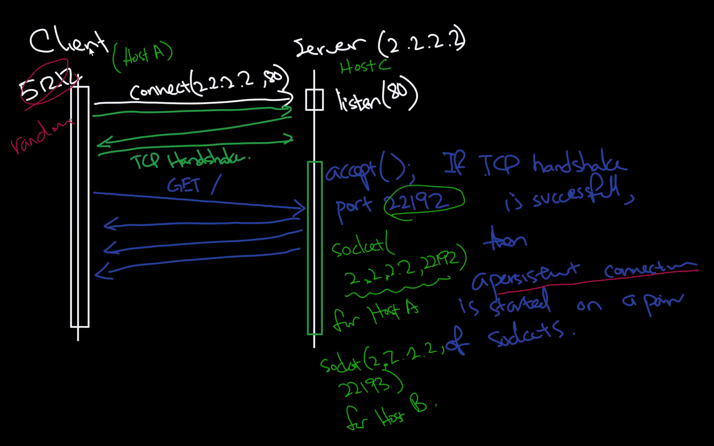
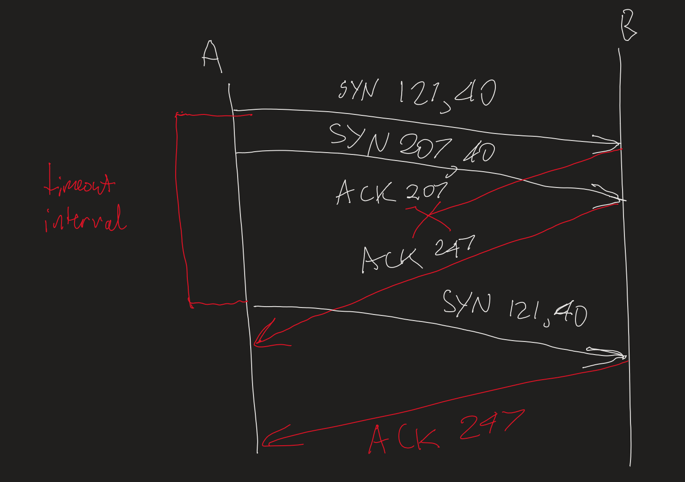

---
title: "Tutorial 5: TCP + git"
notebook: Computer Systems
layout: note
date: 2020-04-20
tags:
...

# Tutorial Week 5

## Transport Layer: TCP (plus git)

_1. Consider a TCP connection between Host A and Host B. Suppose that the
TCP segments traveling from Host A to Host B have source port number
x and destination port number y. What are the source and destination
port numbers for the segments traveling from Host B to Host A?_

- source port number: y
- destination port number: x

_2. Suppose that a Web server runs in Host C on port 80. Suppose this Web
server uses persistent connections, and is currently receiving requests from
two different Hosts, A and B. Are all of the requests being sent through
the same socket at Host C? If they are being passed through different
sockets, do both of the sockets have port 80? Discuss and explain._

They use different sockets.  For a persistent connection the web server  
listens on port 80, and then spawns a new socket with a different port number
Typically the web server will have a single process with a thread for each connection socket, or could
use separate processes with individual sockets.

_3. A negative acknowledgement tells the sender that a particular packet has
not been received, rather than that a packet has been received. Consider
a reliable data transfer protocol that uses only negative acknowledgments.
Suppose the sender sends data only infrequently. Would a NAK-only pro-
tocol be preferable to a protocol that uses ACKs? Why? Now suppose the
sender has a lot of data to send and the end-to-end connection experiences
few losses. In this second case, would a NAK-only protocol be preferable
to a protocol that uses ACKs? Why?_

- NAK only: Would not be preferable; if there was a single segment sent, the
  receiver would be unaware they had missing data until the next segment was received
  and so there would be a substantial delay in recovery
- Second case: NAK-only would have much less overhead because there only needs to be a NAK
  for a lost packet, and the response time would be short because lots of data is being 
  transmitted

_4. Suppose Host A sends two TCP segments back to back to Host B over a
TCP connection. The first segment has sequence number 900; the second
has sequence number 1024._

_(a) How much data is in the first segment?_

data: 1024-900=124 bytes

_(b) Suppose the first segment is lost but the second segment arrives at
B. In the acknowledgement that Host B sends to Host A, what will
be the acknowledgement number?_

900

_(c) Suppose that now the third segment with sequence number of 1124
from Host A arrives to Host B, and the second segment is still missing.
What will be the acknowledgement number?_

1024

_5. Host A and B are communicating over a TCP connection, and Host B
has already received from A all bytes up through byte 126. Suppose
Host A then sends two segments to Host B back-to-back. The first and
second segments contain 80 and 40 bytes of data, respectively. In the
first segment, the sequence number is 127, the source port number is 302,
and the destination port number is 80. Host B sends an acknowledgment
whenever it receives a segment from Host A._

_(a) In the second segment sent from Host A to B, what are the sequence
number, source port number, and destination port number?_

sequence number: 127+80=207
source port number: 302
destination port number: 80

_(b) If the first segment arrives before the second segment, in the acknowl-
edgment of the first arriving segment, what is the acknowledgment
number, the source port number, and the destination port number?_

ack. number: 207
source port number: 80
destination port number: 302

_(c) If the second segment arrives before the first segment, in the acknowl-
edgment of the first arriving segment, what is the acknowledgment
number?_

ack. number: 127

_(d) Suppose the two segments sent by A arrive in order at B. The first
acknowledgment is lost and the second acknowledgment arrives after
the first timeout interval. Draw a timing diagram, showing these
segments and all other segments and acknowledgments sent. (As-
      sume there is no additional packet loss.) For each segment in your
figure, provide the sequence number and the number of bytes of data;
for each acknowledgment that you add, provide the acknowledgment
number._

_6. A reliable data transfer should provide two guarantees:_

  - the delivery of the packet, i.e., no packet loss;
  - protection against accidental errors, i.e., packets corrupted by ran-
    dom changes of bits will not be delivered.

_It does not guarantee in-order delivery; we say “TCP provides reliable,
in-order delivery” because reliable does not imply in-order. What other
notions of “reliability” are there, and at what layers are they provided?_

- tcp checksum is not robust: high probability of collisions; not collision resistant
  - multiple payloads can generate the same checksum
  - adversary could interfere
  - mitigant: use digital signatures (cryptography); guarantees integrity
- not clear if origin is authentic: need authentication as well; provided with certificates
  - HTTPS
- privacy: encryption via TLS (OSI model layer 5); between transport layer/and application
  layer

_7. Imagine you were going to reimplement git. What algorithm would you
use to merge two sets of changes to a text file? Think about how fast your
scheme would be, and how accurate it would be._

[stackoverflow: how does git merge work?](https://stackoverflow.com/questions/14961255/how-does-git-merge-work-in-details)
- find a merge base, i.e. common ancestor of two candidates
- perform diffs of each candidate against the merge base
- walk through diffs:
  - if both sides have the change, accept it
  - if one side has the change, the other has no change in that region, accept the change
  - if both sides have changes, mark a conflict for manual resolution
