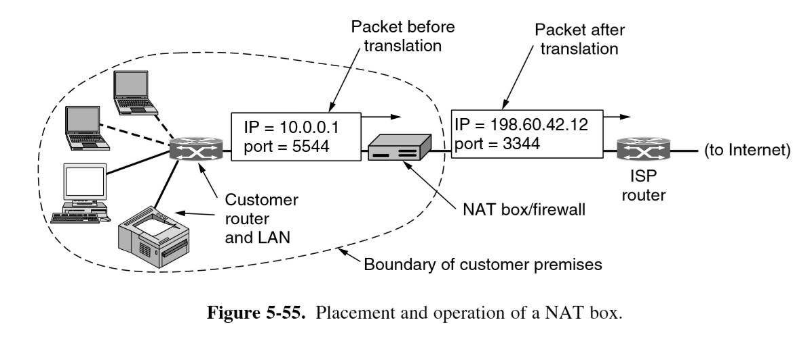

---
title: Summary
notebook: Computer Systems
layout: note
date: 2020-06-20 21:52
tags: 
...

# Summary

[TOC]: #

## Table of Contents
- [Subnets](#subnets)
- [Network Address Translation (NAT)](#network-address-translation-nat)
  - [NAT Criticisms](#nat-criticisms)
- [Fragmentation](#fragmentation)
  - [Downsides](#downsides)
  - [Path MTU Discovery](#path-mtu-discovery)
  - [IPv4 vs IPv6 fragmentation](#ipv4-vs-ipv6-fragmentation)
- [IPv6](#ipv6)
  - [IPv6 Addresses](#ipv6-addresses)
- [Memory Management](#memory-management)
  - [Optimal Page Replacement algorithm](#optimal-page-replacement-algorithm)
- [Threads](#threads)
  - [Classical thread model](#classical-thread-model)
  - [POSIX Threads `pthreads`](#posix-threads-pthreads)
  - [User-level threads vs kernel-level threads](#user-level-threads-vs-kernel-level-threads)
- [AES: Advanced Encryption Standard](#aes-advanced-encryption-standard)
  - [ECB: Electronic Code Book mode](#ecb-electronic-code-book-mode)
  - [CBC: Cipher Block Chaining mode](#cbc-cipher-block-chaining-mode)
- [Public Key Cryptography](#public-key-cryptography)
  - [RSA](#rsa)
- [Digital Signatures](#digital-signatures)
  - [Public key approach](#public-key-approach)
  - [Message Digests](#message-digests)
  - [SHA-1](#sha-1)
  - [MAC Message Authentication Code](#mac-message-authentication-code)
- [Management of Public Keys](#management-of-public-keys)
  - [Certificates](#certificates)
  - [X.509](#x509)
  - [Public key infrastructure](#public-key-infrastructure)

# Networks 

## Subnets

- **subnetting**: splitting up network into several parts internally within an organisation
  while acting externally as a single network
  - splits can be unequal but need to share a **common prefix**
  - future changes can be made with no external impact (e.g. additional IP allocation)
  - hierarchical: ISP allocates subnets to organisations; no real distinction between network/subnet
  
## Network Address Translation (NAT)

- method to handle greater number of clients than IPv4 address space would allow
- ISP assigns individual home/business single IP address for Internet traffic
- within customer network, every computer gets a unique internal IP address
- when packets need to exit the customer network they undergo address translation
  by the NAT box.  This rips out the internal IP address and replaces it with the
  external IP address
- NAT maintains a **translation table**, which replaces TCP source port
  - entry: private IP, private source port, public source port
- IP, TCP checksums are recomputed
- packets arriving from outside the network are able to be looked up and directed
  to the correct host (after updating headers and recomputing checksums)
- widely used, significant security advantage: packets can only be received once
  outgoing connection established.  Shields from attack
- holes need to be poked in NAT to allow, say external access to a web server behind
  NAT box

Private address ranges used:
- 10.0.0.0-10.255.255.255.255
- 172.16.0.0-172.31.255.255
- 192.168.0.0-192.168.255.255

### NAT Criticisms

- violates IP architectural model: every interface should have unique IP address
- breaks end to end connectivity
- makes internet partly connection oriented
- violates layer model: assumes nature of payload contents e.g. UDP, TCP
- limits number of outgoing connections

## Fragmentation

- IP packets have maximum size of 65,535 bytes (16-bit total length header)
- most network links cannot handle such large sizes
- lower layer needs to be able to fragment larger packets
- motivations: hardware (buffers), OS, protocols, reduce transmission errors, increase
  efficiency
- hosts want to transmit large packets (reduced workload)
- common max size
  - Ethernet: 1500 bytes
  - WiFi: 2304 bytes
- **MTU**: maximum transmission unit: maximum size for that network/protocol
- **Path MTU**: max size for path through network, i.e. min of MTU on each link
  - dynamic routing: don't know in advance 
- original solution: allow routers to break large packets into fragments
- **transparent fragmentation**: reassembly at next router.  Subsequent routers are
  unaware of it
- **nontransparent fragmentation**: reassembly at destination host

- IP headers:
  - **identification**: identifies packet
  - **DF: Don't fragment**:  orders routers not to fragment packets.  also part of
    determining path MTU
  - **MF: More fragments**: all fragments except the last one have this set.  indicates
    whether all fragments have arrived
  - **Fragment offset**: where in current packet fragment belongs
    - fragments are in 8 byte blocks: fragment offset must be on 8 byte boundary
    - 13 bits
    
### Downsides

- overhead: 20 byte header per fragment incurred from point of fragmentation on
- if a single fragment is lost, entire packet needs to be resent
- overhead on hosts for reassembly is high

### Path MTU Discovery

- packets are sent with DF bit set: if a router cannot handle the packet it sends ICMP
  to sender telling it to fragment packets at smaller size
  
### IPv4 vs IPv6 fragmentation

- IPv4: either non-transparent fragmentation or path MTU discovery
- IPv6: routers will not perform fragmentation.  Hosts expected to discover optimal
  path MTU
## IPv6

### IPv6 Addresses

- 8 hextets (4 hexadecimal digits) separated by `:`
- 128 bits (16 bytes)
- abbreviation:
  - leading 0s from any group is removed (all/none)
  - consecutive hextets of 0s replaced with `::`.  Can only be used once in an 
    address, otherwise would be indeterminate

Consider `2001:0db8:0000:0000:0000:ff00:0042:8329`
Removing leading zeros: `2001:db8:0:0:0:ff00:42:8329`
Use double colon: `2001:db8::ff00:42:8329`

# Operating Systems

## Memory Management

### Optimal Page Replacement algorithm

- some pages in memory will be referenced in a few instructions, while others
  won't be referenced for many instructions
- optimal algorithm removes page that won't be referenced for the greatest number
  of instructions
- impossible: operating system has no way of knowing when each page will be next
  referenced
  - by running a program on a simulator and keeping track of page references,
    you could implement optimal page replacement on second run
- useful benchmark  

## Threads

- threads are a lightweight process: 
  - faster to create and destroy than processes
  - useful when number of threads needs to change rapidly/dynamically
  - no performance gain when all are CPU bound, but performance gain when substantial
    I/O
- main motivation: handle multiple activities at once, where any one activity
  may block.  Introducing threads allows multiple sequential threads to run
  quasi-parallel, simplifying programming model
- example: web server
  - dispatcher thread reads incoming requests
  - passes work to an idle worker thread that performs a `read`
  - when the worker blocks on disk, another thread is chosen to run
  - without threads the CPU would be idle every time disk IO was occurring
- example: heavy data processing 
  - process blocks while data IO in progress
  - input thread, output thread, processing thread: 
    - input thread writes to input buffer
    - processing thread reads from input buffer and writes to output buffer
    - output thread reads from output buffer and writes back to disk
 
### Classical thread model

- c.f. Linux thread model, which blurs line between process and thread
- process: way of grouping related resources for simple management.  It has:
  - address space (program text + data)
  - other resources (open files, child processes, ...)
  - **thread of execution/thread**: executes in some process.  It has:
    - program counter
    - registers
    - stack
- processes group resources; threads are entities scheduled for execution on CPU
- threads allow multiple executions to occur in same process environment, to a degree
  independently
  

- every thread can access every memory address in process address space
  - one thread can read/write/wipe out another thread's stack
  - no protection between threads: not possible and shouldn't be necessary, as 
    process is always owned by a single user that should be aware of threads
    created  

  

### POSIX Threads `pthreads`

- each pthread has:
  - id
  - set of registers + program counter
  - set of attributes: stack size, scheduling parameters, ...
  
- `pthread_create`: returns thread identifier
  - similar to `fork`

### User-level threads vs kernel-level threads

- user-space:
  - implemented by library
  - kernel unaware of threads
  - each process needs to maintain private **thread table**
  - advantage: 
    - thread switching much faster as no system call needed
    - OS doesn't need to support threads
    - can customise scheduling
    - scales well for large number of threads as you aren't taking up table/stack space in kernel
  - disadvantage:
    - blocking system calls: if a thread makes the call this will stop all threads
    - requires mechanism to tell in advance if calls will block
    - threads causing page faults will also cause kernel to block the process even
      thought other threads may be able to run
    - if thread starts running, no other thread will ever run unless first thread
      voluntarily yields.  There are no clock interrupts in the process
- kernel space
  - kernel maintains thread table
  - threads created/destroyed etc through system calls  
  - advantage: 
    - kernel is aware of threads, so when one thread blocks it may schedule
      another thread of the same process to run
    - doesn't require additional non-blocking system calls  
  - disadvantages:
    - cost of a system call is substantial: if thread creation/removal etc is common
      will have much higher overhead
    - needs to be implemented in OS  
    
      

# Security 

## AES: Advanced Encryption Standard

- symmetric block cipher
- same plaintext block always produces same ciphertext
- world's dominant cryptographic cipher
- part of instruction set for some processors e.g. Intel
- 2 de facto variants:
  - 128-bit block with 128-bit key,
  - 128-bit block with 256-bit key
- key space: $2^{128}$

### ECB: Electronic Code Book mode

- basically: monoalphabetic substitution cipher using big characters (128-bit)
- break plaintext up into 128-bit blocks and encrypt them one after the other
- parallelisable
- easy to attack: can swap cipher blocks without disrupting message integrity
- repeated content in same location of ciphertext also helps cryptanalysis

### CBC: Cipher Block Chaining mode

- each plaintext block is XORed with previous ciphertext block before being
  encrypted
- same plaintext no longer maps onto the same ciphertext block, and encryption is
  no longer big monoalphabetic substitution cipher
- swapping out blocks would produce garbled message, which may hint compromise to
  the recipient
- **initialisation vector**: randomly chosen and XORed with the first block
  - transmitted in plaintext with ciphertext

 

## Public Key Cryptography

- keyed encryption algorithm, E; keyed decryption algorithm, D
- requirements to make encryption key public

1. $D(E(P)) = P$ i.e. if we apply D to encrypted message we get plaintext
2. Exceedingly difficult to deduce D from E
3. E cannot be broken by chosen plaintext attack

### RSA

- Rivest, Shamir, Adleman
- very secure
- disadvantage: requires keys at least 1024 bits long, so its slow
- mostly used to distribute session keys for symmetric-key algorithms, as too
  slow to encrypt large volumes of data
- security dependent on difficulty of factoring large numbers

## Digital Signatures

- **message integrity**: message was not tampered with
- **message authentication requirements**:
  - **verification**: receiver can verify claimed identity of sender: e.g. bank verifying a request
    for an account transfer
  - **non-repudiation**: sender cannot later repudiate the contents of the message: protect bank against
    fraud, where someone claims they didn't authorise a transfer
  - receiver cannot have concocted the message themself: prevent bank conducting fraud

### Public key approach

- public key would be preferred: you could use symmetric key if there was a central authority
  everyone could trust, not only to keep track of keys but also to have full access
  to signed messages
- assume that public-key algorithms also have property $E(D(P)) = P$ (as well as usual properties)
- sender signs with their private key, then encrypts plaintext with recipient's public
  key.  Recipient decrypts with their private key, then verifies signature with 
  sender's public key:

- does this satisfy properties? yes
  - verification: yes
  - recipient doesn't know sender's secret key; the only way for the recipient to have it is if sender sent it
- criticism: coupling of **authentication** and **secrecy**
  
### Message Digests

- method that provides authentication but not secrecy
- don't need to encrypt entire message
- much faster digital signature
- **MD: message digest/hash:** one-way hash function goes from plaintext to fixed-length bit string
- **MD/cryptographic hash properties**:
  - given P, it is easy to compute MD(P)
  - given MD(P), it is effectively impossible to find P
  - given P, it is computationally infeasible to find another message P' such that MD(P') = MD(P). 
    This requires digest to be > 128 bits long
  - change to input of 1 bit produces very different output
  

### SHA-1

- secure hash algorithm 1
- generates 160-bit message digest

- **verification**: on receipt Bob computes the SHA-1 hash of the message, then applies Alice's public key to the signed
  hash received to extract the SHA-1 Alice sent.  If these match, then the message
  is valid.
- no way for Trudy to modify plaintext in transit or Bob would detect the change 
  

### MAC Message Authentication Code

## Management of Public Keys

- public-key crypto enables two people who don't share a common key in advance to
  communicate securely, as well as enabling authentication without presence of a 
  trusted 3rd party
- signed message digests make it possible to verify integrity easily and securely
- issue: how to securely communicate your public key?

### Certificates

- could conceive of having a single key distribution centre online at all times:
  not scalable and if it went down all internet security would come to a halt
- **CA: certification authority**: organisation that certifies public keys
- **certificate**: binds public key to name of principal (individual/company/...) or attribute
  - not secret/protected themselves
- CA issues a certificate, signing the SHA-1 hash with its private key

### X.509

- certificate standard in widespread use on internet

Fields of X509 certificate:

### Public key infrastructure

- cannot have single CA: collapse under load, central point of failure
- users, CAs, certificates, directories
- PKI provides way of structuring public key certification, forming a hierarchy
- **root**: top-level CA that certifies second-level regional CAs
  - **trust anchor**: root public keys are shipped with the browser/system
- regional CAs then certify other CAs which undertake the issuance of X.509 certificates 
  to organisations/individuals
  

- **chain of trust/certification path**: chain of verified certificates back to the root
- **revocation**: each CA periodically issues **Certificate Revocation List/CRL**
  providing serial numbers of all certificates it has revoked (that have not expired)
  

  
