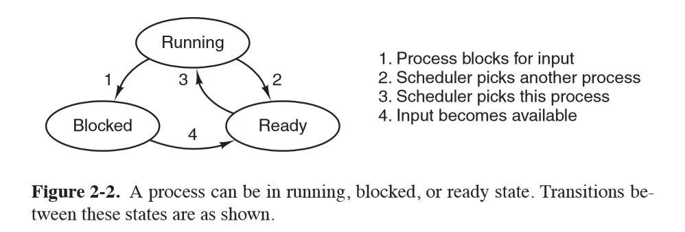
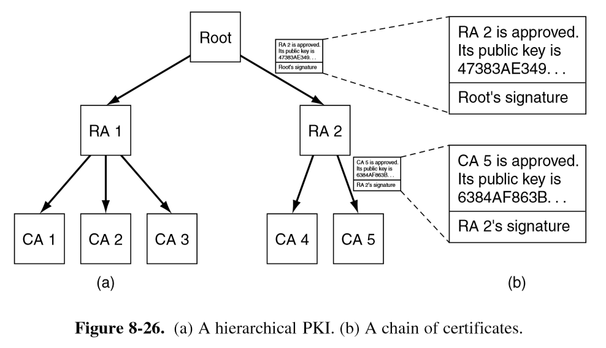

---
title: Summary
notebook: Computer Systems
layout: note
date: 2020-06-20 21:52
tags: 
...

# Summary

[TOC]: #

## Table of Contents
- [Subnets](#subnets)
- [Network Address Translation (NAT)](#network-address-translation-nat)
  - [NAT Criticisms](#nat-criticisms)
- [Fragmentation](#fragmentation)
  - [Downsides](#downsides)
  - [Path MTU Discovery](#path-mtu-discovery)
  - [IPv4 vs IPv6 fragmentation](#ipv4-vs-ipv6-fragmentation)
- [IPv6](#ipv6)
  - [IPv6 Addresses](#ipv6-addresses)
- [Operating Systems Fundamentals](#operating-systems-fundamentals)
  - [Modes of operation](#modes-of-operation)
- [Processes](#processes)
  - [Process state](#process-state)
  - [Process Termination](#process-termination)
  - [Address space](#address-space)
  - [Multiprogramming](#multiprogramming)
  - [System call](#system-call)
  - [POSIX System calls](#posix-system-calls)
  - [Interrupt](#interrupt)
  - [Process table](#process-table)
- [Threads](#threads)
  - [Classical thread model](#classical-thread-model)
  - [POSIX Threads `pthreads`](#posix-threads-pthreads)
  - [User-level threads vs kernel-level threads](#user-level-threads-vs-kernel-level-threads)
- [Process Communication](#process-communication)
  - [Interprocess Communication](#interprocess-communication)
  - [Race Conditions](#race-conditions)
  - [Requirements for solution to avoid race conditions](#requirements-for-solution-to-avoid-race-conditions)
  - [Avoiding race conditions](#avoiding-race-conditions)
  - [Strict alternation with busy waiting](#strict-alternation-with-busy-waiting)
  - [Test and Set Lock (TSL)](#test-and-set-lock-tsl)
  - [Busy Waiting](#busy-waiting)
  - [Blocking](#blocking)
  - [Deadlock](#deadlock)
- [Process Scheduling](#process-scheduling)
  - [Process Scheduler](#process-scheduler)
  - [Scheduling Algorithms](#scheduling-algorithms)
  - [Scheduling Algorithm Goals](#scheduling-algorithm-goals)
  - [Scheduling Algorithms](#scheduling-algorithms-1)
- [Memory Management](#memory-management)
  - [Memory hierarchy](#memory-hierarchy)
  - [Memory allocation and management](#memory-allocation-and-management)
  - [Swapping](#swapping)
  - [Managing free memory](#managing-free-memory)
  - [Memory Allocation Algorithms](#memory-allocation-algorithms)
  - [Virtual memory](#virtual-memory)
  - [Fragmentation](#fragmentation-1)
  - [Memory management unit MMU](#memory-management-unit-mmu)
  - [Translation lookaside buffer](#translation-lookaside-buffer)
  - [Multilevel page tables](#multilevel-page-tables)
  - [Memory Replacement Algorithms](#memory-replacement-algorithms)
- [Goal](#goal)
  - [Symmetric cryptography](#symmetric-cryptography)
- [AES: Advanced Encryption Standard](#aes-advanced-encryption-standard)
  - [ECB: Electronic Code Book mode](#ecb-electronic-code-book-mode)
  - [CBC: Cipher Block Chaining mode](#cbc-cipher-block-chaining-mode)
- [Public Key Cryptography](#public-key-cryptography)
  - [RSA](#rsa)
- [Digital Signatures](#digital-signatures)
  - [Public key approach](#public-key-approach)
  - [Message Digests](#message-digests)
  - [SHA-1](#sha-1)
- [Management of Public Keys](#management-of-public-keys)
  - [Certificates](#certificates)
  - [X.509](#x509)
  - [Public key infrastructure](#public-key-infrastructure)
  - [Certificate issuance](#certificate-issuance)
  - [Certificate Validation](#certificate-validation)
  - [PGP](#pgp)
- [Secure Communication](#secure-communication)
  - [MAC Message Authentication Code](#mac-message-authentication-code)
  - [HMAC](#hmac)
  - [Authenticated Encryption](#authenticated-encryption)
  - [Diffie-Hellman Key Exchange](#diffie-hellman-key-exchange)
  - [SSL/TLS history](#ssltls-history)
  - [TLS Basics](#tls-basics)
  - [QUIC](#quic)
- [System Security](#system-security)
  - [Goal](#goal-1)
  - [Trusted Computing Base](#trusted-computing-base)
  - [Protection Domains](#protection-domains)
  - [Access Control Lists](#access-control-lists)
  - [Capabilities](#capabilities)
  - [Code Signing - Specialised hardware](#code-signing---specialised-hardware)
  - [Covert Channels](#covert-channels)
- [Future Computer Systems](#future-computer-systems)
  - [Trends](#trends)
  - [Cloud Services](#cloud-services)

# Networks 

## Subnets

- **subnetting**: splitting up network into several parts internally within an organisation
  while acting externally as a single network
  - splits can be unequal but need to share a **common prefix**
  - future changes can be made with no external impact (e.g. additional IP allocation)
  - hierarchical: ISP allocates subnets to organisations; no real distinction between network/subnet
  
## Network Address Translation (NAT)

- method to handle greater number of clients than IPv4 address space would allow
- ISP assigns individual home/business single IP address for Internet traffic
- within customer network, every computer gets a unique internal IP address
- when packets need to exit the customer network they undergo address translation
  by the NAT box.  This rips out the internal IP address and replaces it with the
  external IP address
- NAT maintains a **translation table**, which replaces TCP source port
  - entry: private IP, private source port, public source port
- IP, TCP checksums are recomputed
- packets arriving from outside the network are able to be looked up and directed
  to the correct host (after updating headers and recomputing checksums)
- widely used, significant security advantage: packets can only be received once
  outgoing connection established.  Shields from attack
- holes need to be poked in NAT to allow, say external access to a web server behind
  NAT box


Private address ranges used:
- 10.0.0.0-10.255.255.255.255
- 172.16.0.0-172.31.255.255
- 192.168.0.0-192.168.255.255

### NAT Criticisms

- violates IP architectural model: every interface should have unique IP address
- breaks end to end connectivity
- makes internet partly connection oriented
- violates layer model: assumes nature of payload contents e.g. UDP, TCP
- limits number of outgoing connections

## Fragmentation

- IP packets have maximum size of 65,535 bytes (16-bit total length header)
- most network links cannot handle such large sizes
- lower layer needs to be able to fragment larger packets
- motivations: hardware (buffers), OS, protocols, reduce transmission errors, increase
  efficiency
- hosts want to transmit large packets (reduced workload)
- common max size
  - Ethernet: 1500 bytes
  - WiFi: 2304 bytes
- **MTU**: maximum transmission unit: maximum size for that network/protocol
- **Path MTU**: max size for path through network, i.e. min of MTU on each link
  - dynamic routing: don't know in advance 
- original solution: allow routers to break large packets into fragments
- **transparent fragmentation**: reassembly at next router.  Subsequent routers are
  unaware of it
- **nontransparent fragmentation**: reassembly at destination host


- IP headers:
  - **identification**: identifies packet
  - **DF: Don't fragment**:  orders routers not to fragment packets.  also part of
    determining path MTU
  - **MF: More fragments**: all fragments except the last one have this set.  indicates
    whether all fragments have arrived
  - **Fragment offset**: where in current packet fragment belongs
    - fragments are in 8 byte blocks: fragment offset must be on 8 byte boundary
    - 13 bits
    
### Downsides

- overhead: 20 byte header per fragment incurred from point of fragmentation on
- if a single fragment is lost, entire packet needs to be resent
- overhead on hosts for reassembly is high

### Path MTU Discovery

- packets are sent with DF bit set: if a router cannot handle the packet it sends ICMP
  to sender telling it to fragment packets at smaller size
  
### IPv4 vs IPv6 fragmentation

- IPv4: either non-transparent fragmentation or path MTU discovery
- IPv6: routers will not perform fragmentation.  Hosts expected to discover optimal
  path MTU
## IPv6

### IPv6 Addresses

- 8 hextets (4 hexadecimal digits) separated by `:`
- 128 bits (16 bytes)
- abbreviation:
  - leading 0s from any group is removed (all/none)
  - consecutive hextets of 0s replaced with `::`.  Can only be used once in an 
    address, otherwise would be indeterminate

Consider `2001:0db8:0000:0000:0000:ff00:0042:8329`
Removing leading zeros: `2001:db8:0:0:0:ff00:42:8329`
Use double colon: `2001:db8::ff00:42:8329`

# Operating Systems

## Operating Systems Fundamentals

- **operating system**:
  - provide clean, simple abstraction of hardware resources to user and applications
  - manage resources: CPU, memory, display, network interfaces, ...
    - many processes trying to make use of shared resources
  - runs in kernel mode

### Modes of operation

- **kernel**: provides services as **system calls** to user processes e.g. read bytes from file
  - not a process.  Cannot be terminated


- CPUs typically have 2 modes of operation, kernel and user
- **program status word**: CPU register storing current mode
- **kernel mode**: full access to all hardware, ability to execute any instruction
- **user mode**: subset of machine instructions is available
  - instructions affecting control of the machine or do I/O are forbidden
  - code running in user mode cannot issue priviliged instructions, can only
    access parts of memory kernel allows
- kernel/user mode distinction is foundation needed by kernel for building security mechanisms
- instructions/memory locations whose use could interfere with other processes
  are **privileged**
  - e.g. accessing I/O devices

## Processes

- **program**: group of instructions to perform a task; static
- **process**: running instance of a program; dynamic
  - container that holds all information to run a program:
    - code/text of program
    - values of variables: in memory, in registers
    - program counter: address of next instruction
    - set of resources: registers, open files, alarms, related processes, ...
- cooking analogy: recipe: program; cooking: process
- most processes a user interacts with are created by user
- some OS services run in privileged mode e.g. **print daemon**.  Gives access
  to disk, ability to create network connections, ...
  - provide services to user-level processes

### Process state

1. running: using CPU
2. ready: runnable; temporarily stopped while another process is running
3. blocked: unable to run while waiting for external event



### Process Termination

Typical conditions for process termination:

- normal exit, when a process finishes.  Voluntary
- error exit, anticipated error e.g. incorrect input.  Voluntary
- fatal error, unanticipated error, e.g. divide by 0. Involuntary
- killed by another process.  Involuntary
  - system call to verify if caller has ability to kill process

### Address space

- process has its own address space: list of memory locations which the process can read/write
  - **text**: program code, read-only
  - **data**: constant data strings, global variables
  - **stack**: local variables, function calls
- data segment grows upward, stack grows downward


### Multiprogramming

- each process has its own virtual CPU
- **multiprogramming**: ability to have multiple processes share CPU by running
  each for a small period of time
  - increases system efficiency: maximises CPU use while waiting for I/O etc.

### System call

- allow user programs to ask kernel to execute privileged instructions/access privileged memory
  locations on their behalf
  - OS checks requests before executing them to ensure integrity/security
- **trap instruction**: transfers control from user mode to kernel mode


### POSIX System calls


- **`fork`**: creates child process that is an exact duplicate of parent process
  - returns 0 in child
  - returns child PID to parent
  - e.g. use in shell: when command is typed, shell forks off new process and must
    execute the user command
    - does this with `execve` system call: replaces core image by file provided as parameter
- **`waitpid`**: wait for child process to  terminate
- **`exit`**: terminate a process


- **`read`/`write`**: read/write from file into a buffer

___Standard C library handling of `write`___


### Interrupt

- signal to interrupt CPU that is issued when a hardware device needs CPU attention
- e.g. it has finished carrying out current command and is ready for the next one
- asynchronous with currently executing process
- CPU hardware takes values in program counter and PSW registers and saves them in
  privileged memory locations reserved for this purpose
- replaces them with new values, and move to kernel mode
- replacement program code causes execution to resume at start of the **interrupt handler**,
  code that is part of kernel
- **interrupt vector**: address of interrupt handler.  Functions:
  - save rest of status of current process
  - service the interrupt
  - restore what was saved
  - execute a return from interrupt to restore previous state
- **pseudo-interrupt**: from CPU itself, c.f true interrupts from devices external to CPU
  - **exception**: user program generates pseudo-interrupt inadvertently e.g. divide by 0
    - may cause process termination
  - can also be created intentionally by user mode executing special instruction e.g. TRAP

### Process table

- one entry per process
- contains state info to resume a process
  - process management: registers, program counter, PSW
  - memory management
  - file management

## Threads

- **thread**: sequential execution stream within a process
  - basic unit of CPU utilisation
- threads are a lightweight process:
  - faster to create and destroy than processes
  - useful when number of threads needs to change rapidly/dynamically
  - no performance gain when all are CPU bound, but performance gain when substantial
    I/O
- main motivation: handle multiple activities at once, where any one activity
  may block.  Introducing threads allows multiple sequential threads to run
  quasi-parallel, simplifying programming model
- **example: web server**
  - dispatcher thread reads incoming requests
  - passes work to an idle worker thread that performs a `read`
  - when the worker blocks on disk, another thread is chosen to run
  - without threads the CPU would be idle every time disk IO was occurring
- **example: heavy data processing**
  - process blocks while data IO in progress
  - input thread, output thread, processing thread:
    - input thread writes to input buffer
    - processing thread reads from input buffer and writes to output buffer
    - output thread reads from output buffer and writes back to disk
- **example: text editor**: consider replacing one word through entire large file
  - single thread: long time to process: user will be blocked from other actions
    until this is complete
  - multiple threads: 1 thread edits currently displayed contents, spawn 2nd thread
    to make replacements through the rest of the document (in the background)
    - separate process: bad solution as they are editing the same file
    - 3rd thread may be used to save to disk

### Classical thread model

- c.f. Linux thread model, which blurs line between process and thread
- process: way of grouping related resources for simple management.  It has:
  - address space (program text + data)
  - other resources (open files, child processes, ...)
  - **thread of execution/thread**: executes in some process.  It has:
    - program counter
    - registers
    - stack
- processes group resources; threads are entities scheduled for execution on CPU
- threads allow multiple executions to occur in same process environment, to a degree
  independently
- multiple threads have reduced overhead c.f. multiple processes
  - less time to create new thread
  - less time to terminate
  - less time to switch between threads (no system call needed)
  - less time to communicate between threads (no system call needed)


- every thread can access every memory address in process address space
  - one thread can read/write/wipe out another thread's stack
  - no protection between threads: not possible and shouldn't be necessary, as
    process is always owned by a single user that should be aware of threads
    created

  

### POSIX Threads `pthreads`


- each pthread has:
  - id
  - set of registers + program counter
  - set of attributes: stack size, scheduling parameters, ...

- `pthread_create`: returns thread identifier
  - similar to `fork`
- global variables shared
  - thread switches can occur at any point: synchronisation important! e.g. so you
    don't overwrite value in memory used by another thread

### User-level threads vs kernel-level threads

- user-space:
  - implemented by library
  - kernel unaware of threads
  - each process needs to maintain private **thread table**
  - advantage:
    - thread switching much faster as no system call needed
    - OS doesn't need to support threads
    - can customise scheduling
    - scales well for large number of threads as you aren't taking up table/stack space in kernel
  - disadvantage:
    - blocking system calls: if a thread makes the call this will stop all threads
    - requires mechanism to tell in advance if calls will block
    - threads causing page faults will also cause kernel to block the process even
      thought other threads may be able to run
    - if thread starts running, no other thread will ever run unless first thread
      voluntarily yields.  There are no clock interrupts in the process
- kernel space
  - kernel maintains thread table
  - threads created/destroyed etc through system calls
  - advantage:
    - kernel is aware of threads, so when one thread blocks it may schedule
      another thread of the same process to run
    - doesn't require additional non-blocking system calls
  - disadvantages:
    - cost of a system call is substantial: if thread creation/removal etc is common
      will have much higher overhead
    - needs to be implemented in OS


## Process Communication

### Interprocess Communication

- increase efficiency through cooperation
- exchange information between processes
- concerns:
  - processes could interfere with each other
  - sequencing, order
  - ensure system integrity
  - predictable behaviour

### Race Conditions

- multiple processes have access to a shared object (e.g. a file), to which they
  can all read/write
  - **race condition**: output depends on the order of operations
  - hard to debug: non-deterministic; cannot predict in advance how scheduler will
    determine order
  - e.g. 2 processes attempting to add their job to print queue
- **critical region**: section of code in which mutual exclusion is required
  - prohibit access to shared object at the same time


### Requirements for solution to avoid race conditions

- no two processes may simultaneously be inside critical regions
- no assumptions about speeds/number of CPUs
- no process outside critical region should block other processes
- no process should have to wait forever to enter critical region

### Avoiding race conditions

Methods for avoiding race conditions include:

- disabling interrupts: not a good option as requires giving lots of power to user process
- strict alternation
- test and set lock
- sleep and wake-up
- semaphores, monitors, message passing


### Strict alternation with busy waiting

```c
// process A
while (TRUE) {
  while (turn != 0) { }
  critical_region();
  turn = 1;
  noncritical_region();
}

// process B
while (TRUE) {
  while (turn != 1) { }
  critical_region();
  turn = 0;
  noncritical_region();
}
```
- `turn` flag indicates whether it is process A/B's turn
- issue: if process B is much slower than A in non-critical region it will end up
  being blocked by B
- doesn't meet requirements: blocked by a process not in critical region

### Test and Set Lock (TSL)

- test and set lock CPU instruction:

```
TSL RX, LOCK
```

- **atomic operation**:
  - reads contents of variable `LOCK` into regiser `RX`
  - stores nonzero value at `LOCK`
- no other processor can access the memory word until the instruction is finished: the CPU locks the memory bus to achieve this
- assume when `LOCK` is 0, any process may set it to 1 using `TSL` instruction, then
  read/write shared memory.  When done it sets `LOCK` back to 0 using ordinary `MOVE`

Entering and leaving critical region using `TSL` instruction

```
enter_region:
  TSL REGISTER,LOCK     // copy lock to register, set lock to 1
  CMP REGISTER,#0       // was lock 0?
  JNE enter_region      // if not, lock was set, so loop
  RET                   // return to caller; critical region entered

leave_region:
  MOVE_LOCK,#0          // store 0 in lock
  RET                   // return to caller
```

### Busy Waiting
- busy waiting: check if allowed to enter critical region.  If not, execute loop
  until allowed
- wastes CPU
- **priority inversion**:
  - low priority process may starve: low priority process L is in critical region.
    High priority process H becomes ready.  H begins busy waiting, but L is never
    scheduled while H is running, so L never gets to leave critical region, and
    H loops forever

### Blocking

- approach:
  - attempt to enter critical region
  - if available, enter
  - otherwise: register interest and block
  - when critical section available, OS unblocks process waiting for critical region
- `sleep`: system call that causes caller to **block** (suspend) until another
  process wakes up
- `wakeup`: system call that wakes a process
- improves CPU utilisation over busy waiting

### Deadlock

- **deadlock**: multiple processes in set are waiting for an event that only another
  process in the set can cause
- approaches:
  - detection and recovery
  - careful resource allocation: typically impractical as you cannot know ordering
    of accesses
  - prevention: prohibit process to have > 1 lock at a time


- detection: model processes/locks as graph.  existence of cycle implies deadlock

## Process Scheduling

### Process Scheduler

- **process scheduler**: determines which process to run, and for how long based on
  its scheduling algorithm
  - input: processes in ready state (kept in run queue)
- scheduling varies for different workloads and environments
  - e.g. email: idle most of the time
  - e.g. rendering video requires lots of CPU
  - e.g. does user need real-time feedback
- scheduler has limited information about processes

Processes can be categorised as being CPU-bound or I/O-bound:

- **CPU-bound**: long periods of processing, and infrequent I/O waits
- **I/O-bound**: short bursts of processing, and frequent I/O waits
  - determined by length of CPU burst, not length of I/O burst
  - as CPUs get faster, processes tend become more I/O-bound

  

Scheduling decisions are made:

- when a new process created
- when a process exits
- when a process blocks (for I/O etc.)
- when an I/O interrupt occurs

### Scheduling Algorithms

- **non-pre-emptive scheduling algorithm**: picks a process to run and lets it run until
  it blocks or voluntarily yields CPU
- **pre-emptive scheduling algorithm**: picks a process and lets it run for maximum fixed time
  - process is then suspended
  - clock interrupt used to signal process has used up time interval

- algorithm chosen depends on environment:

- **batch**: periodic analytic tasks, e.g. bank transaction consolidation, high performance computing jobs
  - Nonpreemptive, or preemptive with long quantum often acceptable
  - reduce process switches, improves performance
- **interactive**: user facing, servers
  - need to prevent one process hogging CPU and denying service to others
  - preemption needed
- **real-time**: need answer at certain time e.g. air traffic control
  - processes know they may not run for long period of time, so they do their work and block quickly
  - preemption sometimes not needed
  - only runs tasks specific to purpose at hand, c.f. interactive systems which are general purpose

- **context switch**: (aka process switch) involves saving and reloading process state
  - saving, loading registers and memory maps
  - update various memory tables, lists
  - takes time

### Scheduling Algorithm Goals

#### All systems

- **fairness**: give each process fair share of CPU
- **policy enforcement**: e.g. policy where safety control process can run whenever
  it needs to, even though this may make payroll process 30s late
- **balance**: keeping all parts of system busy

#### Batch Systems

- **throughput**: maximise jobs complete per unit time
- **turnaround time**: minimise time between submission and termination
- **CPU utilisation**: keep CPU busy all the time

#### Interactive

- **response time**: respond to requests quickly: prioritise interactive requests
- **proportionality**: meet users' expectations i.e. how long a user things an action
  should take

#### Real-time

- **meeting deadlines**: e.g. process reading data from data-collection device needs to avoid losing data
- **predictability**: e.g. multimedia systems, audio jitter

### Scheduling Algorithms

#### First-come first served

- batch systems
- processes are assigned CPU in order they request it
- maintain queue of ready processes
- if current process is blocked CPU is handed to next process in queue
- when blocked process becomes ready it is enqueued
- pro: simple, fair
- con: CPU bound process competing with many I/O bound processes.  Will take very
  long time for it to receive CPU time

#### Shortest Job First

- batch systems
- assumption: run times are known in advance
- e.g. running batch of 1000 claims will take similar time every day
- scheduler picks shortest job to run first: minimises turnaround time
- not optimal if processes don't arrive at the same time

#### Round-Robin Scheduling

- interactive systems
- simple, fair
- each process is assigned a **quantum** (time interval) during which it is allowed
  to run
- if it is still running at the end of the quantum, CPU is preempted and given to
  another process
- choosing quantum length:
  - too short: lots of overhead on process switching, poor CPU utilisation
  - too long: poor response to interactive requests
  - 20-50ms usually good compromise

#### Priority Scheduling

- interactive systems
- each process is assigned a priority, and runnable process with highest priority
  is allowed to run
- system processes usually more important than user processes
- scheduler may decrease priority of running process at each clock interrupt to
  prevent process running indefinitely
- when priority drops below that of another process, context switch occurs
- alternate approach: maximum time quantum
- priority can be allocated:
  - **statically**: e.g. every process created by user X has priority Y
  - **dynamically**: system allocates priority based on achieving system goals
    - e.g. I/O bound process should be given high priority when it is ready, as it
      will spend long time occupying memory and can shoot off next I/O request
    - e.g. give priority $1/f$, f: fraction of last quantum a process used
- another approach: group processes into priority classes and use priority scheduling between classes,
  use round robin within classes
  - e.g. as long as there are processes in priority 4, run them in round robin.  Then
    run priority 3 processes in round-robin, etc.
  - **starvation**: priority needs to be adjusted regularly to ensure that low
    priority processes receive CPU time if higher priority jobs constantly arrive


#### Others

- shortest process next
- guaranteed: every process guaranteed some portion of CPU time
- lottery: randomised with priority bias
- fair-share scheduling: each user given portion of CPU time

## Memory Management

### Memory hierarchy

Ideally:
- fast
- cheap
- large
- non-volatile

Reality:
- different memory types with different properties
- higher speed, smaller capacity, greater cost


- cost increases up the pyramid
- distance from CPU decreases up the pyramid
- size decreases up the pyramid
- **registers**: internal to CPU, as fast as CPU, no delay in accessing
  - programs decide what to keep in them
- **cache**: managed by hardware
  - fast random access
  - L1 cache, on CPU, very fast
  - other caches may be shared between cores
  - store frequently accessed data
  - cache hit: cache line is in the cache, no memory request sent to main memory
  - cache miss: need to go to memory with substantial size penalty

### Memory allocation and management

- **memory manager**: part of operating system managing part of memory hierarchy
  - to keep track of which parts are in use
  - allocate/deallocate memory to processes as needed
  - protect memory against unathorised accesses
  - simulate appearance of bigger main memory by moving data automatically between
    main memory and disk

#### No Memory Abstraction

- expose absolute physical memory to processes
- issues: security, multiple processes
  - prevention of processes from overwriting what they shouldn't
- **relocation problem**: multiple processes loaded into memory, sequentially
  - `JMP 28` in process (b) results in access of address of process (a) , likely
    causing it to crash
  - both processes reference absolute physical memory
- still common in embedded systems


#### Memory Abstraction: Address spaces

- exposing physical memory:
  - difficult to have multiple programs running at once
  - easy for user programs to trash operating system
- **address space**: abstraction; set of addresses a process can use to address memory
  - each process has its own address space, independent of those belonging to other processes

Simple dynamic relocation approach that used to be common, hardware support with base and limit registers:
- **base register**: loaded with physical address where program begins in memory
- **limit register**: loaded with length of program
- every time a process references memory CPU hardware automatically adds base value
  to address generated by the process before sending address to memory bus
- disadvantage: needs extra addition and comparison on every memory reference

### Swapping

- assume physical memory is large enough to hold a given process
- **swapping**: load each process in entirety, run for a while, then put back on disk
  - idle processes mostly stored on disk so they don't take up memory when not running
  - if insufficient room for process to grow in memory and swap area is full,
    process needs to be suspended until space is freed
  - if expected that most processes will grow, good idea to allocate extra memory
    when a process is swapped in or moved to reduce overhead


### Managing free memory

#### Bitmaps

- memory is divided into allocation units, which corresponds to a bit in the bitmap
  - 0 = free, 1 = occupied
- issue: when you decide to bring k-unit process into memory, memory manager must
  search bitmap to find run of k consecutive bits in the map: slow $\Theta(n)$


#### Linked Lists

- maintain double linked list of allocated/free memory segments
- each segment contains either a process or a hole
- terminating process requires replacing process with hole, may require entries to merge
- stored sorted by memory address: easy to find a block to fill


### Memory Allocation Algorithms

- **first fit**: put new process in first hole of sufficient size
- **next fit**: keeps track of where it is whenever it finds a suitable hole, starts
  searching from here next time
  - slightly worse performance than first fit
- **best fit**: widely used.  Searches entire list and take smallest adequate hole
  - slower than first fit, as searches entire list
  - more memory wasted than first fit/next fit because it leaves small useless holes
- **worst fit**: take largest available hole; not a good idea either
- all of these can be sped up by maintaining separate lists for processes and holes
  - speed up for allocation; slowdown for deallocation
- **quick fit**: maintain separate list for common sizes requested

### Virtual memory

- **overlays**: approach in 1960s, splitting programs into pieces called overlays
  - when program was started, only the overlay manager was loaded, which immediately
    loaded/ran overlay 0.  Subsequent overlays were either placed above overlay 0
    if space was available or on top of overlay 0 if no space was available
  - responsibility of developer to break software into overlays: repetitive, boring
    error prone work
  - extra complexity, replicated for every program
- **virtual memory**: used when need to run a process that cannot fit in memory
  - support multiple programs running simultaneously, each of which fits in memory but
    collectively exceed memory: swapping has large I/O costs
  - allows programs to run when only partially loaded in memory
  - each process has address space broken up into **pages**, a contiguous range of addresses
  - from point of view of process it looks like it has contiguous memory
  - virtual address space may be larger than physical address space
  - pages are mapped onto physical memory, but not all pages need be in physical
    memory at the same time to run the program

- pages typically 4kB

### Fragmentation

- **external fragmentation**: unused memory external to/between pages
- **internal fragmentation**: unused memory internal to pages, where page size
  - paging wastes a fraction of a page for each process as process memory needs
    unlikely to be exact multiple of page size

### Memory management unit MMU

- **memory management unit**: maps virtual addresses to physical memory addresses


- **page frame**: page in physical memory
- **page table**: stores mapping of virtual pages to page frames
  - **present/absent bit**: indicates if page is physically present in memory
- **page fault**: occurs when virtual page is not physically present in memory
  - CPU traps to OS, which evicts a page frame if necessary and writes contents
    to disk
  - fetches from disk the referenced page, updates the page table, and restarts
    trapped instruction


- virtual address
  - high order bits: virtual page number, indexing page table for the page frame number
  - offset: low order bits

#### Page Table Entry


- **page frame number**: mapping between virtual page number and page frame number
- **protection**: permitted access: e.g. 3 bits for read/write/execute
- **present/absent**:
  - 1: valid entry and used.
  - 0: virtual page currently not in memory, causes page fault
- **modified**: dirty/clean.
  - dirty: if page has been modified it will need to be written back to disk
  - clean: if page hasn't been modified it can be dscarded
- **referenced**: set whenever page is referenced, useful for eviction
  - pages not being used are better eviction candidates
- **caching disabled**: important for pages mapping onto device registers instead of memory

### Translation lookaside buffer

- issues with paging:
  - mapping needs to be fast: must be done for every memory reference
    - could have array of hardware registers: unbelievably expensive
    - alternatively could have page table entirely in memory: very slow
  - if virtual address space is large, page table will be large

- most programs tend to make large number of references to small number of pages
- only small fraction of page table entries are heavily read, while the rest are barely used
- **translation lookaside buffer**: speeds up page access by acting as cache for recently accessed
    page table entries
  - small hardware device to map virtual addresses to physical addresses without going through page table
    - much faster than main memory
  - aka **associative memory**
  - has small number of entries, a subset of page tabe entries
  - 1-1 correspondence between fields in page table except for virtual page number (not needed)
- fields:
  - **valid**: whether entry is in use


### Multilevel page tables

- another way to speed up page table access
- TLB stores frequently accessed entries but still have performance issues if address
  space of program is large
- key: don't keep all page tables in memory all the time


- e.g. 32-bit virtual address: 10 bit PT1, 10-bit PT2, 12-bit offset
  - 12 bit offset: 4kB pages
  - $2^20$ pages (20 address bits)
  - PT1 references second-level page table page frame number
  - PT2 indexes page frame number for page itself

### Memory Replacement Algorithms

- when a page fault occurs and there is not enough free space, you need to decide what
  to remove to make space
  - local: remove page of same process
  - global: remove page of any process
- discard page/write page to disk

#### Summary

|      Algorithm      | Comment                             |
|:-------------------:|:------------------------------------|
|       Optimal       | Not implementable, useful benchmark |
|  Not recently used  | Very crude approximation of LRU     |
|        FIFO         | May throw out heavily used pages    |
|    Second chance    | Big improvement over FIFO           |
|        Clock        | Realistic                           |
|         LRU         | Excellent, difficult to implement   |
| Not frequently used | Crude approximation of LRU          |
|        Aging        | Efficient approximation of LRU      |
|     Working set     | Expensive to implement              |
|       WSClock       | Good efficient algorithm            |

#### Optimal Page Replacement

- some pages in memory will be referenced in a few instructions, while others
  won't be referenced for many instructions
- optimal algorithm removes page that won't be referenced for the greatest number
  of instructions
- impossible: operating system has no way of knowing when each page will be next
  referenced
  - by running a program on a simulator and keeping track of page references,
    you could implement optimal page replacement on second run
- useful benchmark  

#### Not recently used

- idea: better to remove modified page that hasn't been referenced in at least one
  clock tick (~20ms) than clean page in heavy use
- simple, moderately efficient to implement, performance may be adequate
- uses 2 bits of past behaviour
- eviction candidates categorised on values of `R` (referenced) and `M` (modified) bits:
  - not referenced, not modified: good candidateo
  - not referenced, modified
  - referenced, not modified
  - referenced, modified: poor candidate
- NRU removes page at random from lowest numbered nonempty category

#### First in first out replacement

- makes no distinction between heavily used pages: poor performance

#### Second Chance algorithm

- pages sorted FIFO but uses referenced bit to avoid throwing out heavily used pages
  - if R 0: page at head of queue is both old and unreferenced, so is removed
  - if R 1: page at head of queue was referenced, the bit is cleared and it is put on end of the queue
  - search proceeds
- inefficient: constantly moving pages around in the list


#### Clock

- overcome inefficiency of second chance algorithm by maintaining circular list


#### Least Recently Used

- good approximation of optimal algorithm: pages heavily used recently will probably
  be heavily used soon
- evict pages that have been unused for the longest time
- expensive to implement: linked list of all pages that must be updated on every memory reference

#### Working Set

- **working set**: pages currently used by process
  - **thrashing**: frequent page faults resulting from a working set that is too small
- **locality of reference**:  process references only small fraction of pages
  - data access is not uniform through memory
  - **temporal**
  - **spatial**
- at a given time, access is clustered around areas
  - consecutive code locations
  - within data structure
- **working set model**: approach taken by paging systems to keep track of working sets
  and ensure it is in memory before process is run

# Security

## Goal

- secure communication
- authentication
- confidentiality

- **encryption**: output ciphertext; hide data from everyone except those holding
  decryption key
- **decryption**: output plaintext; recover original data from cipher text using the key
- **cryptography**
  - based on hard problems on average:
    - RSA: factorising product of 2 large primes
    - AES: substituion-permutation network
  - SAT not appropriate: on average can be solved quickly
- **one-time pad**: cannot be cracked.  Uses one time pre-shared key of the same size
  as the message being sent.  Plaintext is paired with random secret key
- no perfect security:
  - always susceptible to brute force attack
  - challenge: make brute force take so long as to be infeasible to perform in lifetime
    of data

### Symmetric cryptography

```
Encrypt(SecretKey, message) -> ciphertext
Decrypt(SecretKey, ciphertext) -> message
```

- e.g. AES
- need way to securely exchange secret key
- useful for keeping your own data secure, e.g. full disk encryption

## AES: Advanced Encryption Standard

- symmetric block cipher: break data into blocks and encrypt each block
- same plaintext block always produces same ciphertext
- world's dominant cryptographic cipher
- part of instruction set for some processors e.g. Intel
- 2 de facto variants:
  - 128-bit block with 128-bit key,
  - 128-bit block with 256-bit key
- key space: $2^{128}$
- hardware support: AES-NI instruction set extension on Intel

### ECB: Electronic Code Book mode

- monoalphabetic substitution cipher using big characters (128-bit)
- break plaintext up into 128-bit blocks and encrypt them one after the other
- parallelisable
- easy to attack: can swap cipher blocks without disrupting message integrity
  - no diffusion
  - may not provide confidentialityX
  - shouldn't be used
- repeated content in same location of ciphertext also helps cryptanalysis


### CBC: Cipher Block Chaining mode

- each plaintext block is XORed with previous ciphertext block before being
  encrypted
- same plaintext no longer maps onto the same ciphertext block, and encryption is
  no longer big monoalphabetic substitution cipher
- swapping out blocks would produce garbled message, which may hint compromise to
  the recipient
- **initialisation vector**: randomly chosen and XORed with the first block
  - transmitted in plaintext with ciphertext
  - **salt**: random value added to encryption/hash; public; not to be reused

 

## Public Key Cryptography

- aka asymmetric cryptography
- at heart of modern security: Digital signatures, TLS, PGP, Secure messaging, end-to-end encryption
- keyed encryption algorithm, E; keyed decryption algorithm, D
- requirements to make encryption key public

1. $D(E(P)) = P$ i.e. if we apply D to encrypted message we get plaintext
2. Exceedingly difficult to deduce D from E
3. E cannot be broken by chosen plaintext attack

- asymmetric slower than symmetric
- often unsuitable for encrypting large amounts of data
- often used in combination with symmetric cryptography as way of exchanging joint
  secret key

### RSA

- Rivest, Shamir, Adleman
- very secure
- disadvantage: requires keys at least 1024 bits long, so its slow
- mostly used to distribute session keys for symmetric-key algorithms, as too
  slow to encrypt large volumes of data
- security dependent on difficulty of factoring large numbers

## Digital Signatures

- **message integrity**: message was not tampered with
- **message authentication requirements**:
  - **verification**: receiver can verify claimed identity of sender: e.g. bank verifying a request
    for an account transfer
  - **non-repudiation**: sender cannot later repudiate the contents of the message: protect bank against
    fraud, where someone claims they didn't authorise a transfer
  - receiver cannot have concocted the message themself: prevent bank conducting fraud

### Public key approach

- public key would be preferred: you could use symmetric key if there was a central authority
  everyone could trust, not only to keep track of keys but also to have full access
  to signed messages
- assume that public-key algorithms also have property $E(D(P)) = P$ (as well as usual properties)
- sender signs with their private key, then encrypts plaintext with recipient's public
  key.  Recipient decrypts with their private key, then verifies signature with
  sender's public key:
- sign with private `SignKey`; verify with public `VerifKey`


- does this satisfy properties? yes
  - verification: yes
  - recipient doesn't know sender's secret key; the only way for the recipient to have it is if sender sent it
- criticism: coupling of **authentication** and **secrecy**

### Message Digests

- method that provides authentication but not secrecy
- don't need to encrypt entire message (i.e. suited to large documents)
- much faster digital signature
- **MD: message digest/hash:** one-way hash function goes from plaintext to fixed-length bit string
  - lossy-compression function
- **MD/cryptographic hash properties**:
  - given P, it is easy to compute MD(P)
  - given MD(P), it is effectively impossible to find P
  - given P, it is computationally infeasible to find another message P' such that MD(P') = MD(P).
    This requires digest to be > 128 bits long
  - change to input of 1 bit produces very different output


- storing password hash is subject to dictionary attack: hash common passwords

### SHA-1

- secure hash algorithm 1
- generates 160-bit message digest


- **verification**: on receipt Bob computes the SHA-1 hash of the message, then applies Alice's public key to the signed
  hash received to extract the SHA-1 Alice sent.  If these match, then the message
  is valid.
- no way for Trudy to modify plaintext in transit or Bob would detect the change


## Management of Public Keys

- public-key crypto enables two people who don't share a common key in advance to
  communicate securely, as well as enabling authentication without presence of a
  trusted 3rd party
- signed message digests make it possible to verify integrity easily and securely
- issue: how to securely communicate your public key?


### Certificates

- could conceive of having a single key distribution centre online at all times:
  not scalable and if it went down all internet security would come to a halt
- **CA: certification authority**: organisation that certifies public keys
- **certificate**: binds public key to name of principal (individual/company/...) or attribute
  - not secret/protected themselves
  - provides proof of identity/ownership
- CA issues a certificate, signing the SHA-1 hash with its private key
- prevent: website spoofing; server impersonation; man in the middle attacks

Alice asks issuer to sign info
d = (PK_alice, Alice)  
s = Sign(SK_issuer, d')  
Certificate: Issuer, signature s, d' = (Issuer, PK_Alice, Alice, ...)
Verification: Verify(PK_issuer, d', s)

### X.509

- certificate standard in widespread use on internet

Fields of X509 certificate:


### Public key infrastructure

- cannot have single CA: collapse under load, central point of failure
- users, CAs, certificates, directories
- PKI provides way of structuring public key certification, forming a hierarchy
- **root**: top-level CA that certifies second-level regional CAs
  - **trust anchor**: root public keys are shipped with the browser/system
- regional CAs then certify other CAs which undertake the issuance of X.509 certificates
  to organisations/individuals



- **chain of trust/certification path**: chain of verified certificates back to the root
- **revocation**: each CA periodically issues **Certificate Revocation List/CRL**
  providing serial numbers of all certificates it has revoked (that have not expired)
  - if root certificate revoked, all certs below it become untrusted: cross-signing is important

### Certificate issuance

- **domain validation**: most common
  - ties cert to domain
  - checks requester has control over the domain
  - validation via email/DNS/URL
- **organisation validation**: ties cert to domain and legal entity
- **extended validation**: establishes legal entity, jurisdiction, presence of
  authorised officer
  - offline + expensive


- issues: DV certificates don't establish link between domain and real world entity
  - LetsEncrypt issued 14,000 certs containing word paypal

### Certificate Validation

- **CN Common Name**: contains DNS URL
  - may be wildcard `*.google.com`
  - only 1 URL
- **Subject Alternative Name** extension allows multiple URLs to be covered by 1 cert
- **Valid From/To**
- **Public Key**: including algorithm and key length
- **Constraints**: can it be used as CA cert? or is it end entity
- **enhanced key usage**

### PGP

- Pretty Good Privacy
- decentralised web of trust
- not as scalable as centralised approach: hard to connect subnets which may be individually trusted

## Secure Communication

Goals

- **encryption**: secure private communication between two endpoints
- **authentication**: establish identities of one/both endpoint/s
- **integrity**: ensure data doesn't change in transit

- encryption, digital signatures, cryptographic hashing, certificates: provide
  privacy and authentication, but not integrity
  - adversary could arbitrarily delete, reorder, modify, ...

- **CBC tampering**: as every possible ciphertext corresponds to valid plaintext, attacker can:
  - reorder ciphertext
  - flip bits in IV

### MAC Message Authentication Code

- identify if message has been tampered with
- verify integrity of message using a shared secret key
  - c.f. digital signature, which uses public key to verify
  - not for error correction
  - doesn't require an encryption algorithm: can be used if confidentiality isn't an issue
  
- k: secret key, m: message

```
t = Mac(k, m)         # compute tag
b = Verify(k, m, t)   # bit is 0/1 indicating success of verification
```

- for this to work: adversary should not be able to create m', t' such that
  `Verify(k, m', t') = true` for m' it hasn't seen


1. Alice creates $m$, concatenates $s$ with $m$ giving $m+s$.  Computes hash
  $H(m+s)$, called the **message authentication code**
2. Alice appends the MAC to the message $m$: $(m, H(m+s))$ and sends this to Bob
3. Bob receives $(m,h)$ and knowing $s$, calculates MAC $H(m+s)$.  If $H(m+s) = h$
   Bob is convinced of the integrity of the message.

 e.g. CBC-MAC, HMAC

### HMAC

- industry standard, widely used
- used in TLS

```
t = Hash((k XOR opad) || Hash((k XOR ipad) || m))
```

- hashes twice
- prevents attacks where you append to hash output
- `ipad, opad`: fixed constants used for padding

### Authenticated Encryption

- confidentiality + integrity of messages between Alice and Bob
- e.g. AES-GCM, AES-OCB, AES-CCM
- encrypt-then-mac

```
// Encrypt
c = Enc(SK, m)
// Compute tag over ciphertext
t = MAC(k, c)
// Transmit (c, t) 
// Verify tag
b = Verify(k, t, c)
// if successful, decrypt
m = Dec(SK, c)
```

### Diffie-Hellman Key Exchange

[Wiki](https://en.m.wikipedia.org/wiki/Diffie%E2%80%93Hellman_key_exchange)

- fundamental to HTTPS, SSH, IPSec, SMTPS, TLS
- goal: get 2 parties to agree on a shared session key
- **session key**: ephemeral key for use in a single session
- provides **perfect forward secrecy**: exposure of long term keys doesn't compromise
  security of past sessions
- sends information in a way that allows both parties to calculate a shared key without
  ever having to explicitly communicate the shared key


- generate public information:
  - $p$: large prime
  - $g$: generator (primitive root modulo p)
- Alice picks random private value $x$ and computes $X = g^x\mod{p}$
  - send $X$ to Bob
- Bob picks random private value $Y$ and computes $y = g^y\mod{p}$
  - send $Y$ to Alice
- Alice calculates secret key $s = Y^x\mod{p} = g^{xy}\mod{p}$
- Bob calculates secret key $s = X^y\mod{p} = g^{yx}\mod{p}$
- Bob and Alice now have a shared secret that they never explicitly communicated


- solving discrete log is a hard problem: infeasible to recover $a$ from $g^a$
- provided 2 parties discard secrets, even if one has their private key exposed, it
  will not allow past communication to be decrypted
- secret key should look indistinguishable from random string

- DH is not secure against:
  - impersonation
  - main-in-the-middle attack
  - convert $g^xy$ to secret key
  - need to agree of $p$ and $g$

### SSL/TLS history

- **SSL secure sockets layer**: historical
  - Secure TCP connection
  - Designed by Netscape 1994
  - v1.0 never released: security flaws
  - v2.0: first to be made public; also had security flaws
  - v3.0: 1996, complete redesign, forming basis of TLS
- **TLS transport layer security**: protocol
  - TLS 1.0: 1999, upgrade from SSL3.0 with additional security improements
  - TLS 1.1: 2006, further upgrades/defences against known attacks
  - TLS 1.2: 2008, updated primitives, moving from MD5-SHA1 to SHA-256 for pseudorandom
    number generation, due to broken collision resistance
    - adds support for AES
    - 2011 update to prevent downgrade attacks
  - TLS 1.3: significant differences, not backward compatible
    - remove weak crypto primitives
    - enforce forward secrecy
    - Firefox, Chrome briefly defaulted to TLS 1.3 but had to switch back due to incompatibility

### TLS Basics

- TLS provides private communication with integrity guarantees
- certificates, certificate authorities provide authentication
- supported by most web browsers, servers, ...
- **HTTPS**: implementation of TLS over HTTP

#### Handshake protocol

- uses public-key cryptography to establish several shared secret keys between client and server
- negotiate version of protocol and set of cryptographic algorithms to use
  - e.g. Diffie-Hellman, RSA, ...
  - need to find interoperable set
- authenticate server and client (optional)
  - use digital certificates to learn each other's public keys and verify identity
  - often only server will be authenticated
- use public keys to establish shared secret

- TCP connection established
- Alice send `ClientHello`: in plaintext protocol version, cryptographic algorihtms, ...
- Bob responds `ServerHello`: in plaintext highest supported protocol version supported
  by both, strongest cryptographic suite selected from those offered
- Bob sends `ServerKeyExchange`:
  - public-key certificate containing either public key or Diffie-Hellman public key $g^y$
- Alice validates the certificate
- Alice sends `ClientKeyExchange`: client generates secret key material and sends to server
  encrypted with server's public key, or $g^x$ if Diffie-Hellmann
- Handshake concludes: both parties share key for encryption/decryption

#### Record protocol

- uses secret keys established in handshake to protect confidentiality, integrity, authenticity
  of data exchange

#### Local TLS Interception

- TLS can be intercepted locally or at server level
- web traffic analysis: may be legitimate reason to intercept
- create own local certificate authority and install in root stores
- local proxy can intercept TLS connections
  - acts as MITM
  - dynamically issues fake certificate using local CA
  - virtually invisible to user
  - commonly done by antivirus software
  - from point of view of browser, will appear that you are communicating securely
  - here you are trusting tools for privacy _and_ security
  - when acting as MITM, local proxy performs validation rather than the browser
- often flawed:
  - susceptibility to [FREAK](https://en.m.wikipedia.org/wiki/FREAK) (Factoring RSA Export Keys)
  - may not support modern features
  - may be susceptible to protocol downgrade attacks
- worst case: Superfish/eDellRoot
  - Superfish: marketing company trying to analyse web traffic
  - the same root certificate was installed on all machines with an identical private key
  - once compromised anyone could impersonate websites/code signing
  - Superfish also had faulty certificate checking

#### Network level TLS Interception

- many companies use same approach to intercept TLS connections: install root certificate
  on all machines within the company
  - can be important for network protection
  - private network proxy acts as MITM and generates fake certificates
  - domain controllers install root cert on machine
  - if you don't control the machine you don't control the trust
  - similar issues: poor validation, old cipher suites
- web servers increasingly use TLS proxies/load balancers
  - protect against hacking/DDoS
  - prevalent on cloud services


- issues:
  - proxy has cert for many sites: must trust proxy for privacy
  - breaks concept of end-end encryption
- Cloudbleed attack
  - Cloudflare: CDN and TLS proxy service
  - HTML parser error: memory leaked into returned pages (unbalanced tags)
  - led to that data being crawled by Google etc, making it visible in public domain
  - potential breaches of authentication tokens, passwords, messages, ...

### QUIC

- Quick UDP Internet Connection
- goal: replace TCP and TLS
- combines 3-way handshake with TLS 1.3 handshake


## System Security

- often an afterthought due to pressure to get to market
- problems only arise when something go wrong; usually quite bad when it does
- why it matters: confidential, proprietary, sensitive, private information, e.g.
  - health records, financial information, IP, personal data
- attacks may be:
  - physical theft/acces
  - access to the system: multi-user system, botnet
  - network
- attackers may be
  - **passive**: observing traffic/activities
    - may be active in background, e.g. keylogger
  - **active**: maliciously changing content, tampering

### Goal

- **confidentiality**: only intended recipient can understand message
  - threat: exposure of data
- **integrity**: ensure that message is delivered without modification
  - threat: tampering with data
- **availability**: cannot disturb system so that it is unusable
  - threat: denial of service

- additional goals
  - **authenticity**
  - **privacy**: protect misuse of personal information

- usability vs security:
  - with a small number of lines of code, you can formally verify security, e.g. that
    there are no buffer overruns
  - users like features, adding many lines of code, making verification infeasible
  - e.g. static plaintext website vs dynamic website: introduces JavaScript

### Trusted Computing Base

- **trusted systems**: systems with formally stated security requirements, that meet
  those requirements
- **trusted computing base**: minimal hardware/software to enforce security rules
  - if trusted computing base working to specification, system security cannot be compromised
  - consists of most of hardware (excluding I/O devices that have no impact on security),
    portion of OS kernel, and most user programs with superuser power
  - process creation, switching, memory management, some file + I/O management must
    be part of TCB
  - often will be separate from rest of OS to minimise size to allow verification of
    correctness
  - anything inside TCB is trusted, anything external is not
- **reference monitor**: accepts all system calls involving security and decides whether
  or not to process them
  - allows all security decisions to be put in one place with no chance of bypassing
  - most OSs are not designed this way, making them quite insecure


### Protection Domains

- computer systems consists of many resources (objects) that need to be protected,
  both hardware and software.
- **domain**: set of (object, rights) pairs.  Each pair specifies an object and a subset
  of operations that can be performed on it
  - **right**: permission to perform one of the operations
  - often may correspond to a single user, but is more general
- at each moment in time, a process runs in some protection domain: it has a set of objects
  it can access, and for each of those objects it has some set of rights
- processes can switch from domain to domain during execution
- UNIX: domain of a process defined by `UID, GID`
  - when user logs in, shell gets `UID, GID` contained in the user entry in the password file
  - these are inherited by all children
  - two processes with the same `(UID, GID)` will have access to exactly the same set of objects
  - each process in UNIX has user part and kernel part
    - kernel part has access to different objects e.g. all pages in physical memory
    - a system call therefore causes a domain switch


- **principle of least authority**: need to know; each domain has minimal objects
  and privileges for it to complete its task, and no more

### Access Control Lists

- associate each object with domains that may access the object and how
- Entry: `User, Group: access rights`
- rights: read, write, execute


- any process owned by user A can read and write file F1
- `tana, *: RW`: gives Tana access to file no matter which group she is currently in

### Capabilities

- **capability list**: associate each process with objects and corresponding rights (capabilities)
- must be protected from user tampering
- much harder to keep track of than ACLs
- revoking access is quite difficult for kernel-managed capability list
  - hard for system to find all outstanding capabilities for any object and take them back
    as they can be started in capability lists all over the disk
- very efficient c.f. ACL, which may require a long search to verify permissions
- ACLs allow selective revocation of rights, C-lists do not


### Code Signing - Specialised hardware

- code signing: ensure that code running in hardware is what you expect it to be
- specialised hardware can perform this function and protect against physical theft


- encrypted hard drive
- trusted platform module
- secure processors:
  - Intel SGX
  - ARM TrustZone

#### Encrypted hard drive

- protect against: data theft from lost/stolen/decommissioned computers
- disk appears as normal, with encryption/decryption performed transparently to user
- disk driver has encryption engine
- can be combined with TPM to allow decryption only on the machine the disk is in
- Data is encrypted with Data Encryption Key
- Data Encryption Key is encrypted with Authentication Key
  - this allows user to change Authentication Key without needing to decrpyt/re-encrypt
    entire disk

#### Trusted Platform Module TPM

- cryptoprocessor with non-volatile storage used to store secret keys
- performs some cryptographic operations
- verify digital signatures
- specialised hardware for these functions makes it much faster and more widely used

- uses:
  - prevent unauthorised code
  - encrypt hard drive (store the DEK in TPM)
  - remote attestation

#### Remote Attestation

- **remote attestation**: allows external part to verify that the computer with TPM
  runs the software it should be, and not something that cannot be trusted

- On machine to be verified, create a measurement by taking a hash of loaded code.
- store hash in **Platform Counter Register (PCR)**
  - PCR cannot be overwritten, only extended
  - extend PCR value using hash chain: `hash(prev_PCR + measurement)`
- External party: create a nonce and send to machine
  - nonce used to prevent replay attack
- TPM signs PCR value and nonce
- external party verifies

- **TPM measurement** verifies software stack booted on machine is as expected
  - BIOS
  - hardware configuration
  - boot loader and its configuration
  - operating system
  - loaded apps

- cannot protect against running code being compromised

#### Intel SGX

- software guard extensions
- extension to Intel processor instruction set
- protect processes from the host/OS: as OS is all-powerful entity that may have been
  compromised
- **enclave**: run code and memory isolated from rest of the system
  - specialised memory regions
- attestation: prove to local/remote system what code is running in enclave
- minimum TCB: only processor is trusted
- DRAM and peripherals are untrusted, all accesses need to be encrypted
  - responsibility of application

### Covert Channels

- even system with formal verification of secure and correct implementation, security
  leaks can occur
- consider 3 processes on a protected machine:
  - process 1: client wants process 2 (server) to perform work
  - client and server don't trust each other
  - process 3: collaborator, conspiring with server to steal client's data
- **covert channel**: deliberate modulation of something to intentionally leak
  information to a collaborator
  - e.g. CPU modulation: to communicate a 1 bit, it computes as hard as
  it can for a fixed time.  To send a 0 bit, it sleeps for the same amount of time.
  - e.g. locking/unlocking a file
  - e.g. modulate paging rate: many page faults = 1, few page faults = 0
- so many possible covert channels it is nearly hopeless to attempt to block them


- **side channel**: unintentional leakage of data, without a collaborator
  - observer observes shared resources: memory, caches, page faults, timing, power
  - meta-data observations about encrypted data: e.g. you know a message is being sent
    between 2 parties, even if you don't necessarily know what it is

- **steganography**: hiding information in non-obvious ways
  - can be used to communicate information between processes without being detected
  - e.g. change low-order bit of each RGB channel to store secret information

## Future Computer Systems

### Trends

- end user: shift in hardware from desktop to laptop to tablet
  - commoditised hardware
  - online services
  - **Desktop as a Service**:
    - Citrix XenDesktop: multiple clients access central OS installation
- impact on development:
  - web first approach
  - collaborative tools increasingly important
  - need to support multiple platforms

#### History of Multi-User Systems

- mainframe: 1960s-80s
- microcomputer server: internal data centre, 1990s
- large scale data centre: mid-1990s
- virtualisation: VMWare 1999
- SaaS: Software as a Service
  - Salesforce 1999
- IaaS: infrastructure as a service
  - AWS 2006
- PaaS: platform as a service
  - Canon Zimki 2006
  - Google app engine 2008

### Cloud Services


#### SaaS

- **what it is**: enterprise applications delivered through browser: email, CRM, collaboration
- **benefit**: streamlines enterprise IT management: vendor maintains OS, runtimes, patches, backup,
  hardware
- e.g. Office 365, GitHub, Zoom
- start of cloud services
- **issues**
  - dependent on good connectivity
  - trust in single provider
  - privacy and security challenges:
    - where is data stored?
    - what protection does it have

#### IaaS

- **what it is**: virtualised access to hardware instances
  - software is still responsibility of enterprise: install patches, keep OS up to date,
    manage software
- many hardware specifications available
- e.g. AWS EC2
- shared/dedicated instances depending on security/performance requirements
- **benefit**: able to reduce hardware purchase/support costs
  - rapid rescaling of resources: can handle peak demand more efficiently at lower cost
  - good for startups
- **issues**:
  - requires skilled system administrators
  - replication for scaling can replicate vulnerabilities
    - out of date images
    - poorly configured server instance
    - incorrect security settings

- Amazon S3: many not configured correctly and publicly accessible
- 2017 breach: Republican National Committee, 198 million voter details
- AWS EC2: instance will always have some insecurity
  - globally accessible
  - password based access
  - publicly available metadata
- credentials can be compromised: hardcoding/storing in git repository

#### PaaS

- **what it is**: framework for rapid development and deployment of applications
  - select frameworks to add to an application (e.g. Python runtime, Postgres instance, ...)
- **benefits**
  - developer doesn't need to manage installation or update of underlying frameworks
  - auto-scaling
  - integrates with CI/CD on git for automated deployment
- e.g. Salesforce Heroku, AWS Elastic Beanstalk, Microsoft Azure

#### Serverless

- **what it is**: developer only implements app functionality with no concern for infrastructure
  or software stack
- **benefits**
  - simplified development
  - no low-level handling of requests
  - functions are small pieces of code running in milliseconds
  - static content served via CDN
  - aligns with microservice development: applications are loosely coupled services
  - allows companies to focus on their product rather than commoditised infrastructure
- e.g. AWS Lambda, Hook.io
- e.g. Alexa:
  - easy access to advanced APIs and functionality
  - to include Alexa there is some configuration and a single JS function, you can
    implement an Alexa skill
  - delivered with no configuration of server/installation of software library
- security implications: <!--TODO-->

#### System Administrator

- skillset changing: configuration vs installation
  - awareness of best practice, network configuration, security, privacy
  - role moving away from low-level OS and network management to strategic planning
    and anomaly management
  - understanding bottlenecks and advise changes in architecture
  - understanding security and privacy, and constraints they impose
