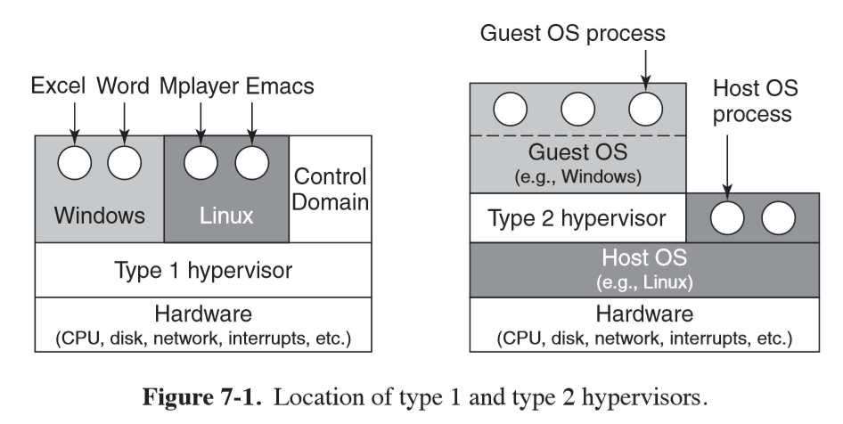

---
title: Virtualisation
notebook: Computer Systems
layout: note
date: 2020-07-06 15:04
tags: 
...

# Virtualisation

[TOC]: #

## Table of Contents
- [Motivation](#motivation)
- [History](#history)
- [Requirements for Virtualisation](#requirements-for-virtualisation)
- [Type 1 and Type 2 Hypervisors](#type-1-and-type-2-hypervisors)

## Motivation

- **virtual machine**: efficient, isolated duplicate of a real machine
- **Virtual machine monitor (VMM)/Hypervisor**: piece of software that creates illusion of multiple virtual machines
  on the same physical hardware
- **virtualisation**: allows single computer to host multiple virtual machines
- advantages:
  - failure in one virtual machine doesn't bring down the system
  - can run multiple operating systems on the same hardware
  - fewer physical machines: less capital expenditure and operating costs
  - easier maintenance
  - ability to run legacy applications unsupported by current hardware
  - ability to test application in variety of environments

## History

- seminal work 1974: [Formal Requirements for Virtualizable Third Generation Architectures](http://citeseerx.ist.psu.edu/viewdoc/download?doi=10.1.1.141.4815&rep=rep1&type=pdf)
  - listed conditions a computer should satisfy to support virtualisation efficiently
  - x86 didn't meet these requirements until 2005

## Requirements for Virtualisation

Hypervisors should provide:

- **safety**: hypervisor should have full control of virtualised resources
- **fidelity**: behaviour of program on VM should be identical to behaviour
  on bare hardware
  - **sensitive instructions**: behave differently when executed in kernel mode c.f. user mode
  - **privileged instructions**: cause a trap if executed in user mode
  - a machine is virtualisable only if the sensitive instructions are a subset of
    the privileged instructions
  - i.e. if you try to do something in user mode that you should not be doing, the
    hardware should trap
  - Intel 386 didn't do this meaning couldn't support hypervisor directly
- **efficiency**: a substantial subset of the virtual processor's instructions
  should be executed directly by the real processor with no software intervention
  by the VMM

- **paravirtualisation**: presents a machine-like software interface, exposing
  the fact that it is a virtualised environment
  - provides **hypercalls**, allowing explicit requests to be sent to hypervisor
  - guests use hypercalls for privileged sensitive operations e.g. updating the page
    tables
  - by cooperating with hypervisor explicitly you get simpler and faster system
- **process-level virtualisation**: allow a process to run where the program was
  intended to run on a different architecture/OS

## Type 1 and Type 2 Hypervisors

- terminology from Goldberg (1972)
- both pretend to be a full computer, and must execute machine's instruction set
  in a safe manner
- **type 1**: similar to an OS, as it is the only program running in most privileged
  mode
  - supports multiple copies of actual hardware (virtual machines) similar to processes
    an OS runs
- **type 2**: program that relies on an OS to allocate/schedule resources, similar
  to a regular process
- **guest operating system**: OS running on top of hypervisor
- **host operating system**: OS running on hardware (for Type 2 hypervisor)

- **virtual disk**: file on disk of host

## Questions 

1. Give a reason why a data center might be interested in virtualization. 

Can run a number of servers on the same hardware, reducing costs, and increasing versatility.

2. Give a reason why a company might be interested in running a hypervisor on a machine that 
has been in use for a while. 

If the hardware is upgraded, you can allow the old software to keep running

3. Give a reason why a software developer might use virtualization on a desktop machine being 
used for development. 

To test whether the application being developed works on a particular platform

4. Give a reason why an individual at home might be interested in virtualization. 

The ability to run applications that aren't supported on the operating system they run.

5. Why do you think virtualization took so long to become popular? After all, the key 
paper was written in 1974 and IBM mainframes had the necessary hardware and software 
throughout the 1970s and beyond. 

The explosion of PCs vs access to a mainframe: there was little need to support multiple systems. The adoption of the 
x86 architecture also meant that it was difficult to implement virtualisation when it might 
have been useful.

6. Name two kinds of instructions that are sensitive in the Popek and Goldberg sense. 

- `popf`: replaces the flags register; changes the bit that enables interrupts
- anything involving I/O, changing page tables/memory maps, or reading machine state is sensitive

7. Name three machine instructions that are not sensitive in the Popek and Goldberg sense. 

- move, arithmetic, jump, call instructions

8. What is the difference between full virtualization and paravirtualization? Which do you 
think is harder to do? Explain your answer. 

- full virtualisation: emulate full set of instructions of virtual machine; emulate hardware exactly
  so that every OS running on the virtual machine behaves exactly as it would on the metal
- paravirtualisation: specify virtualisable subset of processor architecture and port the guest 
  operating system to the new platform; change the OS so it doesn't do things that are hard to 
  virtualise
- full virtualisation is difficult without hardware support and on CISC architectures, but is
  easier for RISC machines.  Which is harder depends on the architecture/hardware support.

9. Does it make sense to paravirtualize an operating system if the source code is available? What 
if it is not? 

Yes. In paravirtualisation, the guest operating system needs to be ported - this cannot be done
if the source code is unavailable.  An alternative is full virtualisation where all instructions
are emulated

10. Consider a type 1 hypervisor that can support up to n virtual machines at the same time. PCs 
can have a maximum of four disk primary partitions. Can n be larger than 4? If so, where 
can the data be stored?

Yes: there is a virtual disk for each VM stored as a file on disk.

11. Briefly explain the concept of process-level virtualization. 

Process-level virtualisation allows a process to run that was originally written for a different OS.
To do this a virtualisation layer between the application and the OS is used which executes the 
application's instructions, modifying as necessary prior to execution. e.g. WINE: Windows Emulator

12. Why do type 2 hypervisors exist? After all, there is nothing they can do that type 1 
hypervisors cannot do and the type 1 hypervisors are generally more efficient as well. 

Type 2 hypervisors allow the user to run an application within their existing OS - this may be of
greater convenience to the user.

14. Why was binary translation invented? Do you think it has much of a future? Explain your answer.

Binary translation was invented to handle sensitive, non-privileged instructions, by rewriting them
with an equivalent instruction that will trap.  As modern architectures are designed with 
virtualisation in mind and have hardware support, it is unlikely to be a key part of future 
virtualisation.  However it will continue to be used to support legacy applications.

15. Explain how the x86’s four protection rings can be used to support virtualization.

x86 has 4 protection rings: the innermost ring, ring 0, is the most privileged and is used by the
kernel.  The outermost ring, ring 3, is the least privileged ring and is used for user mode.  Rings
1 and 2 aren't used in existing operating systems, meaning ring 1 can be used for the privileged 
mode of the guest OS, which is both more privileged that user mode, and less privileged than 
the hypervisor.

16. State one reason as to why a hardware-based approach using VT-enabled CPUs can perform 
poorly when compared to translation-based software approaches.

The hardware-based approach of trap-and-emulate can produce a large number of costly traps
in comparison to software approaches.

20. Briefly explain why memory is so difficult to virtualize well in practice? Explain your answer.

Memory is difficult to virtualize because guests don't really control physical pages, and it is
necessary to add another level of page tables to prevent multiple guest OSs allocating the same
physical page.

21. Running multiple virtual machines on a PC is known to require large amounts of memory. Why? Can you think of any ways to reduce the memory usage? Explain. 

Multiple virtual machines need to load the kernel of each OS into memory, and additional memory is
required for the hypervisor itself.  To reduce memory usage, if you have multiple VMs running 
the same OS, you could share kernel pages of shared code.

22. Explain the concept of shadow page tables, as used in memory virtualization. 

Shadow page tables provide a mapping between the guest OS page tables and the physical page tables.
They are necessary because the guest OS thinks it owns the memory, while there may be multiple
guests trying to allocate the same physical page.

24. Why are balloon drivers used? Is this cheating? 

Balloon drivers are used to force a guest OS to evict pages when the hypervisor runs out of pages,
as the hypervisor itself doesn't know which pages should be kept.

25. Descibe a situation in which balloon drivers do not work. 

If the hypervisor knows nothing about the guest OS, or if there is no way to include a balloon
driver.

34. What were the three main requirements considered while designing VMware? 

- compatibility: any x86 OS and all applications should be able to run as a VM without modification
- performance: needs to have low overhead so that it can be used as a primary work environment; i.e.
  near native speeds
- isolation: guarantee VM isolation without making assumptions about software; protecting
  hardware from malicious access

35. Why was the enormous number of peripheral devices available a problem when VMware Workstation 
was first introduced? 

VMware could not produce drivers for all devices available.  By making VMware a Type 2 hypervisor,
it could run on the drivers already installed on the host OS.

