---
title: File Systems
notebook: Computer Systems
layout: note
date: 2020-07-06 15:46
tags: 
...

# File Systems

[TOC]: #

## Table of Contents
- [File Systems](#file-systems)
  - [Long-term Storage Requirements](#long-term-storage-requirements)
  - [Basic Operations](#basic-operations)
  - [File Types](#file-types)
- [File-System Layout](#file-system-layout)
- [Implementing Files](#implementing-files)
  - [Contiguous Allocation](#contiguous-allocation)
  - [Linked-list allocation](#linked-list-allocation)
  - [File allocation table](#file-allocation-table)
  - [I-Nodes](#i-nodes)
- [Implementing Directories](#implementing-directories)
  - [File attributes](#file-attributes)
  - [Variable-length file names](#variable-length-file-names)
- [Shared Files](#shared-files)
- [Journalling File Systems](#journalling-file-systems)
- [Virtual File System](#virtual-file-system)
- [Efficient File Systems](#efficient-file-systems)
  - [Block size](#block-size)
  - [Tracking Free Blocks](#tracking-free-blocks)
- [Consistency](#consistency)
  - [Block consistency](#block-consistency)
  - [Directory consistency](#directory-consistency)
- [File System Performance](#file-system-performance)
  - [Caching](#caching)
  - [Block Read Ahead](#block-read-ahead)
  - [Reduce disk arm motion](#reduce-disk-arm-motion)
  - [Defragmentation](#defragmentation)
- [Example File Systems](#example-file-systems)
  - [MS-DOS](#ms-dos)
  - [UNIX V7](#unix-v7)
  - [CD-ROM File Systems: ISO 9660](#cd-rom-file-systems-iso-9660)
  - [NTFS](#ntfs)

## File Systems

- major function of OS:
  - hide particulars of disks and I/O devices
  - present user with clean, abstract model of device-indendent files

### Long-term Storage Requirements

- ability to store large amounts of information
- **persistence**: information must survive termination of process using it
- multiple processes need to be able to access the information at once

### Basic Operations

1. Read block $k$
2. Write block $k$

- **file**: logical unit of information created by processes
  - abstraction allowing user to store/access information, without concern for how/where
    the information is stored, or how the hardware works
- **file system**: part of OS dealing with access, usage, protection, structure of files

- where is the information I want stored?
- how to control access?
- which blocks are free?

### File Types

- **regular file**: contains user information
- **directory**: system files for maintaining the structure of the file system
- **character special file**: for I/O, used to model serial devices, e.g. terminals,
  printers, and networks
  - makes I/O devices look like files, such that they can be read/written to using
    the same system calls used for reading/writing files
- **block special file**: used to model disks
- **pipe**: pseudofile used to connect 2 processes

## File-System Layout

- file systems are stored on disks
- disks can be divided into partitions, each having an independent file system
- **Master Boot Record (MBR)**: Sector 0 of the disk used to boot the computer
  - **partition table**: provides start/end address of each partition of a disk
    - listed at end of MBR,
  - when computer boots, BIOS reads in and executes MBR
  - MBR locates active partition, reads in the **boot block** and executes it
  - program in boot block loads OS contained in that partition
  - every partition starts with a boot block, even if it doesn't contain a bootable OS

- **superblock**: stores key parameters about file system, and is loaded on boot
  or when the file system is first touched
  - magic number (identifier), number of blocks in file system, ...
- **i-nodes**: array of data structures, one per file, with metadata about the file

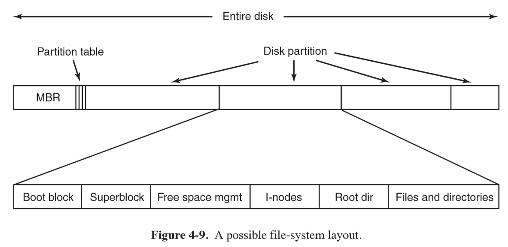

## Implementing Files

### Contiguous Allocation

- **contiguous allocation**: store each file as contiguous run of disk blocks
  - simple to implement: only need to know start block and number of blocks
  - excellent read performance: entire file read in a single operation
  - over time disk becomes fragmented, requiring expensive compaction
  - used on CD-ROMs

### Linked-list allocation

- **linked-list allocation**: linked list of disk blocks.  First word of each block
  is used as a pointer to the next one
  - every disk block can be used (unlike in contiguous)
  - no space lost to disk fragmentation (except internal fragmentation)
  - directory entry needs only store disk address of first block
  - very slow random access: to get to block $n$ requires reading $n-1$ preceding blocks
  - amount of data storage in a block not a power of 2: makes less efficient

### File allocation table

- **linked-list allocation using a table in memory**: store pointers in a **file allocation table (FAT)** in main memory
  - chains are terminated with a special marker (e.g. -1) that isn't a valid block number
  - entire block available for data
  - random access is much easier, as chain is entirely in memory, so you can follow it
    without disk references
  - disadvantage: entire table must be in memory all the time
    - 1TB disk with 1kB blocks needs 1 entry (4 bytes in size): 3GB of main memory all the time
    - doesn't scale for large disks
    - original MS-DOS file system

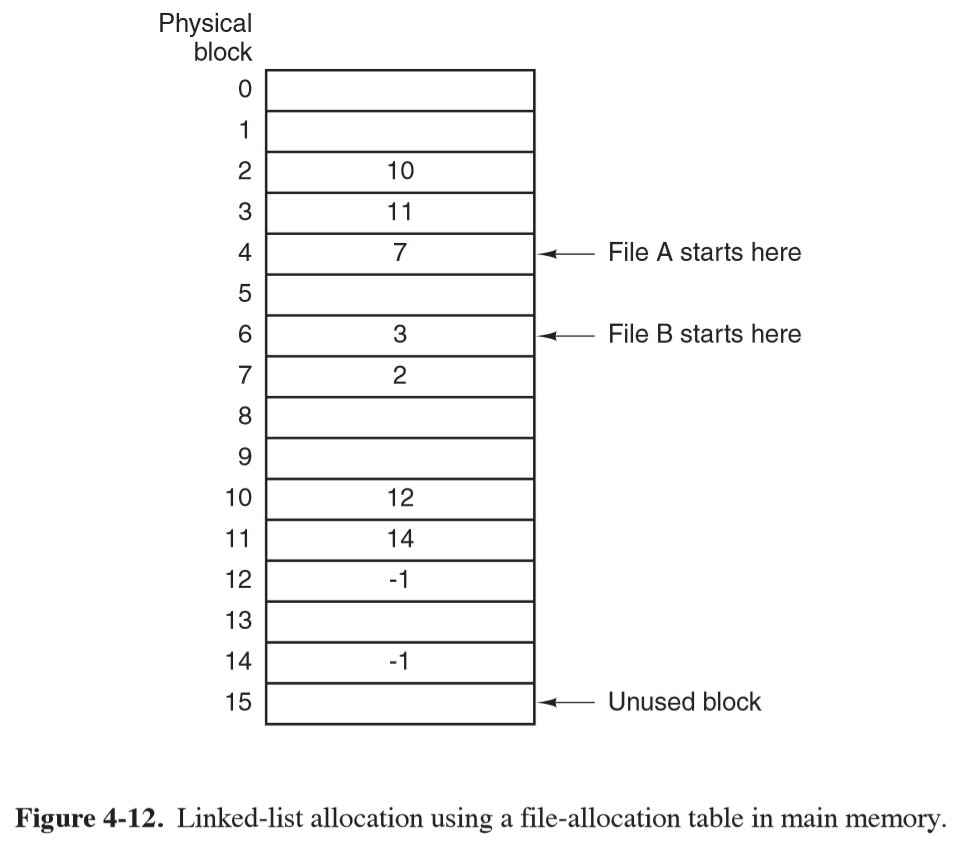

### I-Nodes

- **I-Nodes**: index node
  - lists attributes and disk addresses of file's blocks
  - given the i-node, it is possible to find all blocks of the file
  - advantage: i-node only needs to be memory when the file is open
  - size is proportional to the maximum number of files open at once, c.f. FAT
    which grows linearly with disk size
  - reserve last address of block for next block of disk-block addresses
  - UNIX, NTFS uses a similar idea

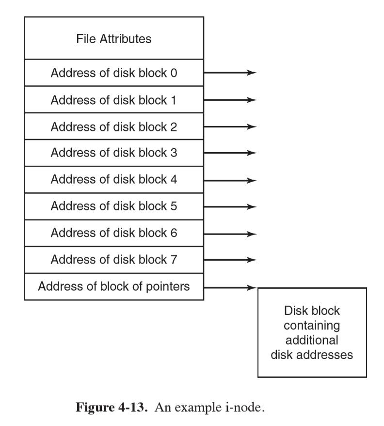

## Implementing Directories

- main function of directory system: map ASCII name of file onto information needed
  to locate the data
- **directory entry**: provides information to find disk blocks

### File attributes

- need to decide where to store file attributes
  - store attributes in directory entry
  - i-nodes: store attributes in i-nodes, rather than directory entry

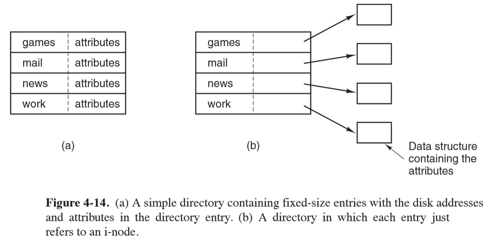

### Variable-length file names

- fixed-length: simple approach of setting limit of file name length, e.g. 255 characters, and
  provide 255 characters for each filename: wastes a lot of space
- in-line: directory entry contains a fixed portion of length and attributes, followed
  by a null-terminated file-name string
  - when a file is removed a variable size gap is introduced
  - single directory entry may span multiple pages, so a page fault could occur
    when reading a file name
- heap: make all directory entries fixed length, and keep file names together in heap
  at the end of the directory
  - when an entry is removed, the next file entered will always fit
  - additional management overhead
- hash table: table entry corresponding to hash of file name is inspected
  - insertion: pointer to file entry is stored in bucket, or a linked list is constructed
  - lookup: hash file name to select hashtable entry.  Entries on a chain are checked to see if the file is present
  - much faster lookup: previous approaches search directories linearly from beginning
    to end when looking up a file name
  - more complex administration: only a serious candidate when directories routinely
    contain thousands of files

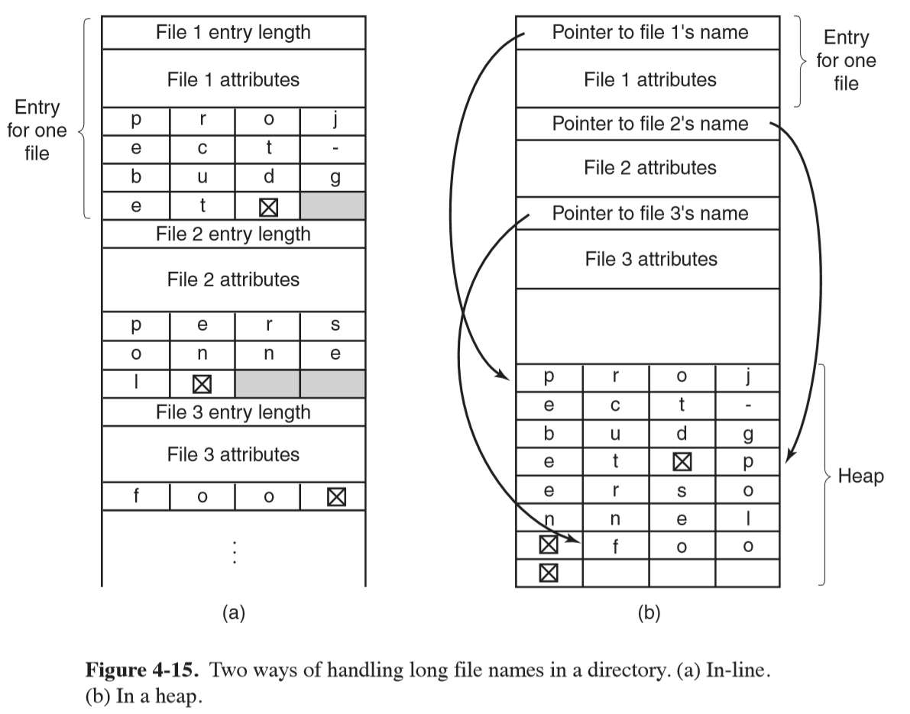

## Shared Files

- often convenient for a shared file to appear simultaneously in different directories
  belonging to different users.  Means file system must be a DAG rather than tree

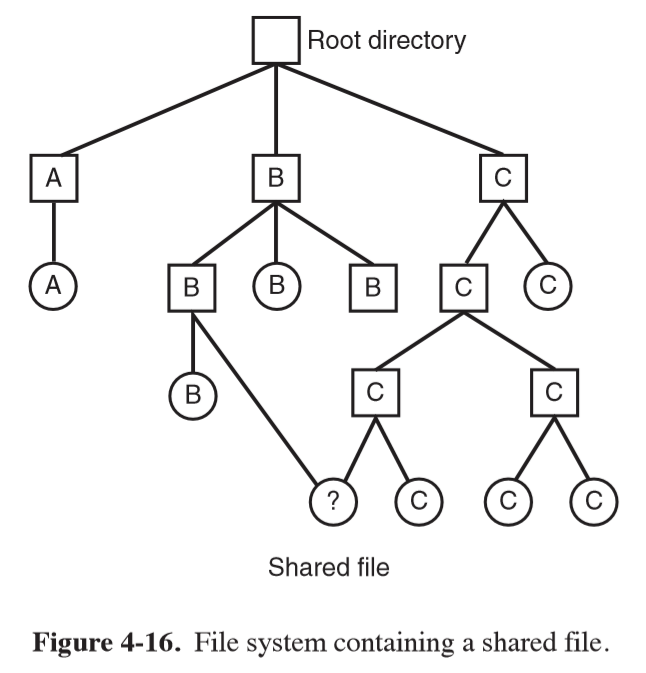

- issue: if directory contains disk addresses, then a copy of disk addresses to make a
  file shared can become out of date if the file is appended to
- **hard linking**: disk blocks aren't listed in directories, the i-node associated
  with the file is referenced
  - managing ownership presents some challenges
- **symbolic linking**: create a new file of type `LINK` and place that in the recipient
  directory.  The file contains the path name of the file it is linked to
  - additional overhead to read file containing path, then following the path until the
    i-node is reached
- linked files: files can have multiple paths
  - programs that find all files in a directory recursively may locate a linked
    file multiple times

## Journalling File Systems

- keep a log of what the file system is going to do before doing it
- if the system crashes before planned work is completed, upon reboot, the pending
  work can be seen in the log and completed
- e.g. NTFS, ext3
- journalling file systems need data structures/logged operations to be idempotent:
  this makes crash recovery fast and secure
- atomic transactions: borrowed from DBs with `begin transaction`/`end transaction`
  bracketing a group of actions

## Virtual File System

- Windows: no attempt to integrate heterogenous file systems into a unified whole.
  Each disparate file system is simply given a distinct letter `C:`, `D:`

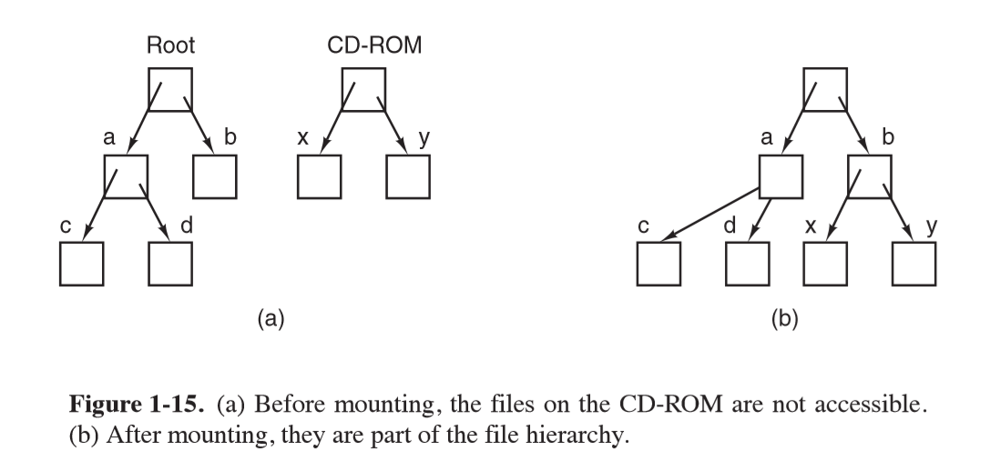

- UNIX: integrates multiple file systems into a single structure
  - `mount`: system call allowing you to attach one file system onto a part of the
    existing root file system
  - from user's point of view, there is a single file-system hierarchy
- **Virtual file system VFS**: integrate multiple file systems into an orderly structure
  - abstract out common code for all file system as VFS, with concrete file system code
    in a separate lower layer to actually manage data
  - user issues standard POSIX system calls: `open, read, write`, which are upper interface
    to VFS
  - lower interface is implemented by concrete file system code, and VFS calls these
    methods to make each file system do work
  - originally intended to support **Network File System (NFS)**

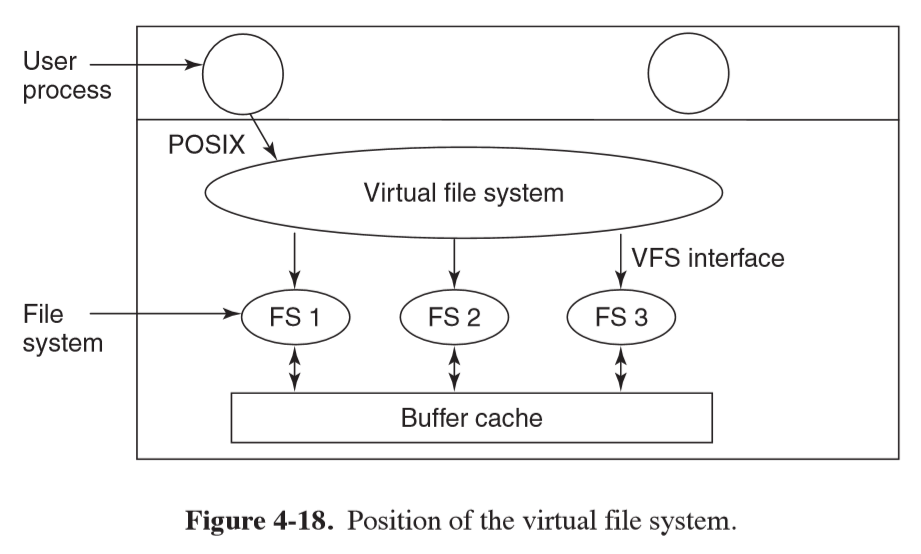

- object types in implementation of a VFS (usually C), with methods that must be implemented
  by each concrete file system:
  - superblock: describes file system
  - v-node: describes file
  - directory: describes file system directory
- VFS data structures:
  - mount table
  - array of file descriptors: keep track of all open files in user processes

- when system boots, root file system is registered with VFS
- when other file systems are mounted they must register with VFS by providing
  list of addresses of functions VFS requires

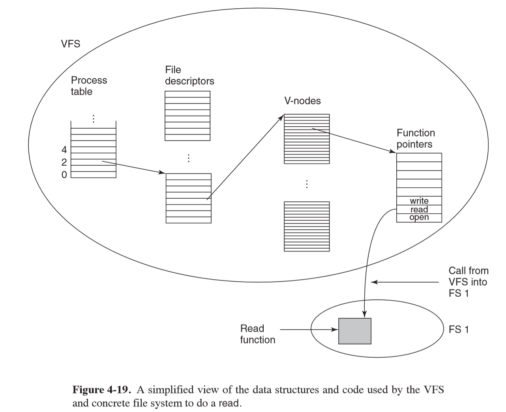

## Efficient File Systems

### Block size

- large block size: waste space
  - means small files waste a large amount of disk space
- small block size: waste time
  - means most files span multiples blocks and need multiple seeks, with rotational delays to read them

### Tracking Free Blocks

- linked list: store list of free disk blocks in a block, and then link to the
  next block of free addresses
  - if long runs of consecutive blocks: aggregated adjacent blocks and represent
    with a count.  Not very useful if disk is highly fragmented
- bitmap: more space efficient

## Consistency

- if system crashes before modified blocks have been fully written out, the file system
  can be left in an inconsistent state
- especially bad if those blocks that have not been written out are i-node blocks,
  directory blocks, or free list blocks
- utilities to check file system consistency of a partition
  - UNIX: `fsck`
  - Windows: `sfc`

### Block consistency

- **block consistency**: for each block, count the number of times it is referenced
  by an i-node, and the number of times it is referenced in the free list
- if file system is consistent, each block will be referenced exactly once in either an i-node
  or in the free list
- **missing block**: a block is never referenced.  Does no harm but would prevent
  the block being allocated, wasting space.  To rectify the file system checker adds
  them to the free list
- **duplicate block in free list**: rebuild the free list
- **duplicate data block**: block is referenced by 2 files, worst case.
   - To resolve, the checker allocates a free block, copies the contents of the duplicate block, and inserts
    it into one of the files
  - this ensures the filesystem is consistent
  - information content is unchanged, meaning one file probably has corrupt data: error should be
    reported for user to inspect damage

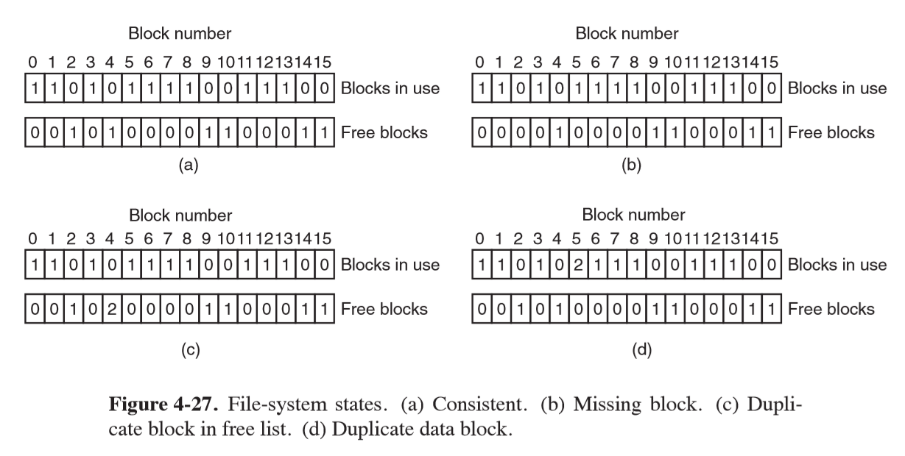

### Directory consistency

- check the directory system using a per file count
- starts at root directory, recursively descends the tree, inspecting each directory
  - at every i-node in each directory, it increments a counter for that file's usage
- when complete, checker has a list indexed by i-node number indicating how many directories
  contain each file.  This is compared with the link count stored in each i-node
- errors: i-node link count
  - higher than number of directory entries: even if all files are removed, the count
    will still be non-zero, so the i-node won't be removed.  This wastes space, not serious.
    Rectify by correcting i-node link count
  - lower than number of directory entries: when an count goes to zero, it is marked as unused and
    all blocks are released.  If two directory entries are linked to a file, but
    the i-node says there is only one, if either entry is removed, the count will go to 0,
    resulting in the other directory pointing to an unused i-node whose blocks
    may be assigned to other files

## File System Performance

### Caching

- **block/buffer cache**: collection of blocks kept in memory for performance
  - check all read requests to see if needed block is in the cache.
  - if in cache: request can be satisfied without disk access
  - if not in cache: read block from disk into cache then copy wherever needed
- cache typically holds ~ thousands of blocks: fast lookup critical
  - hashtable: addressed by hashing device + disk address
    - use separate chaining for those blocks with the same hash value
- difference to paging: cache references are infrequent in comparison.  Linked list
  is feasible to keep all blocks in LRU order
- use doubly-linked list to allow easy removal and replacement to end of list
- modified LRU scheme to maintain consistency:
- if a critical block (e.g. i-node block) is read into the cache and modified, but not rewritten to
  disk, the file system will be in an inconsistent state
- i-node blocks are rarely referenced twice within a short interval
- factors:
  - is the block likely to be needed again soon?
    - if not: e.g. i-node; block goes to front of LRU list so that it will be reused
      quickly
    - otherwise: block goes to back of LRU list so they will stay around for a long time
  - is the block critical to file system consistency?
    - if yes: write immediately if modified
- in addition: undesirable to keep data blocks in the cache too long before writing
  them out
- UNIX: `sync` forces all modified blocks out onto disk immediately
  - when system starts up a program (`update`) starts in the background in an endless
    loop issuing `sync` calls
  - maximum of 30 seconds work lost due to a crash
- Windows: now uses `FlushFile-Buffers`, equivalent to `sync`
  - old approach: **write-through cache**; used to write every modified block to disk as soon as it was written to the cache
  - this is because Windows evolved from MS-DOS, which ran off floppy disks, while
    Unix ran off hard disks

### Block Read Ahead

- many files are read sequentially
- when the file system is asked to produce block $k$ of a file, it does that,
  then checks if $k+1$ is in the cache.  If it is not, it schedules a read for
  the next block in the hope that it will reduce delay
- if a file is being randomly accessed, this will increase delay as the disk is tied
  up reading in useless blocks which then need to be removed from the cache
- file system needs to keep track of access patterns to determine whether to read
  ahead or not.  Each file could simply use a bit to maintain this state (sequential-access/random access)
  - if a seek is done: clear the bit

### Reduce disk arm motion

- put blocks likely to be accessed in sequence close to each other, preferably
  in the same cylinder
- reading a short file requires 2 disk accesses: one for the i-node and one for the
  block.  i-nodes are usually placed near the start of the disk, so the average distance
  between the i-node and its blocks would be half the number of cylinders, meaning
  long seeks
- by putting i-nodes in the middle of the disk you can reduce average seek by 2
- alternatively you could divide disk into cylinder groups, each with its own
  i-nodes, blocks, free-list

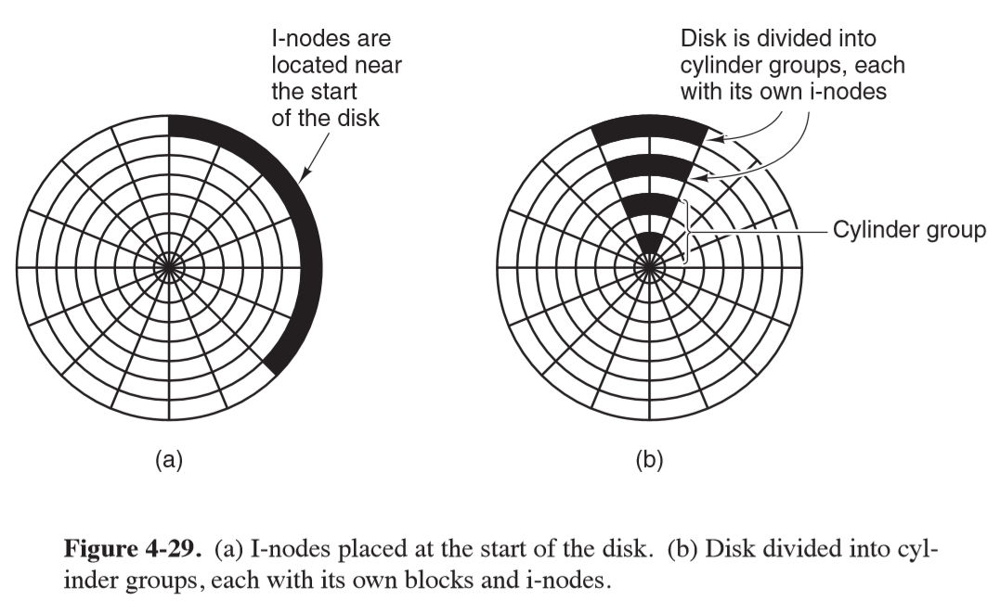

### Defragmentation

- over time, as files are added and removed, the disk becomes heavily fragmented,
  with files and holes all over
- when a new file gets created its blocks may end up being spread all over the disk,
  producing poor performance
- Windows utility: `defrag`
- defragmentation works best on file systems with a large contiguous free block
  at the end of the partition: this can be used as working space to move fragmented
  files to, freeing up contiguous blocks at the start of the partition. Original
  files can now be rewritten contiguously

## Example File Systems

### MS-DOS

- file system that shipped with the first IBM PCs
- FAT-32, an extension of MS-DOS, became widely used for embedded systems
- MS-DOS directory entries: fixed-size 32 bytes
- keeps track of file blocks via a file allocation table in main memory
  - directory entry contains number of first file block, which is used to index the FAT
  - by following the chain, all blocks can be found
- FAT-x variants depend on the number of bits a disk address contains
- disk block can be set to some allowed multiple of 512 bytes
- exFAT: proprietary variant for large removable devices
- MS-DOS uses the FAT to keep track of free disk blocks: any unallocated block is
  marked with a special code.
  - When MS-DOS needs a new block, it searches the FAT for an entry containing this code
  - no bitmap/free list required

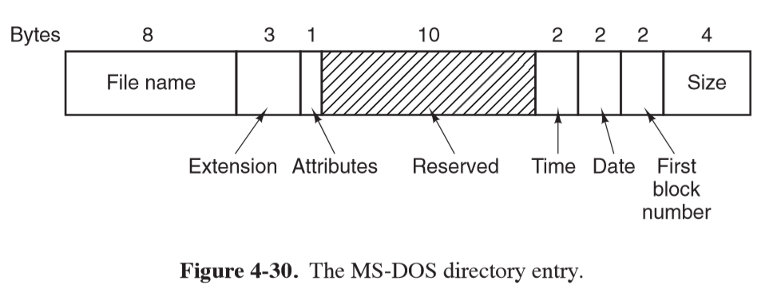

### UNIX V7

- early version used on PDP-11
- directory entry contains only I-node number and file name

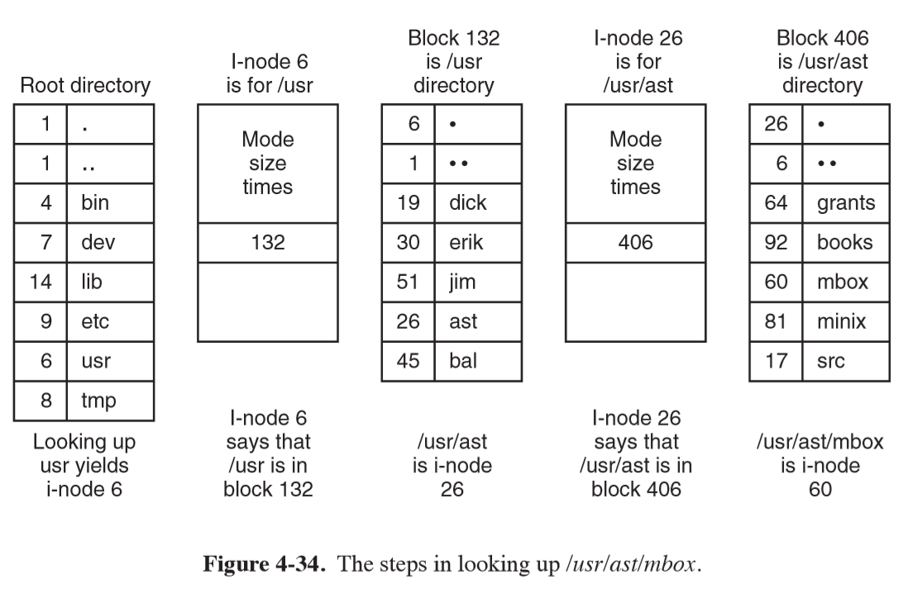

### CD-ROM File Systems: ISO 9660

- adopted in 1988
- it was a goal to make every CD-ROM readable on every computer, independent of
  byte ordering/OS.  This produced some limitations to ensure it would be compatible
  with the weakest OS then in use
- CD-ROMs store data in a single continuous spiral
  - divided into logical blocks of 2352 bytes
  - block payload is 2048 bytes
- supports CD-ROM sets with up to $2^16 -1$ CDs in the set
- individual CD-ROMs may be partitioned into logical volumes
- CD-ROMs begin with undefined 16 blocks, followed by a **primary volume descriptor** block.
  This contains general information about the CD-ROM, including a directory entry
  for the root directory, from which the rest of the file system can be located
- any directory consists of a variable number of variable-length entries
  - **location of file/file size**: files are stored as contiguous runs of blocks, so the start block
    location and file size completely specifies where the file is located
  - redundant coding was used for binary fields in directory entries (little-endian and big-endian
    for interoperability

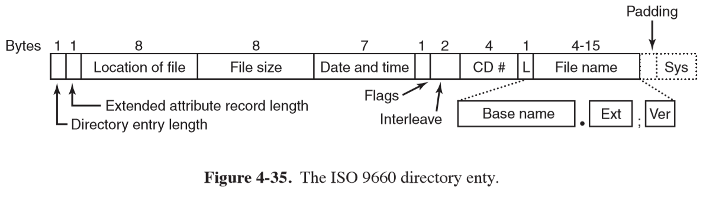

### NTFS

- [Wiki](https://en.m.wikipedia.org/wiki/NTFS)
- proprietary journaling file system developed by Microsoft for Windows NT
- vast increase in allowable file sizes and volume sizes over FAT
- optimised for 4KB clusters, but supports up to 2MB clusters
- journaling: uses NTS log to record metadata changes to the volume
  - maintains consistency of internal data structures
  - allows easy rollback of uncommitted changes
- disk quotas
- access control lists
