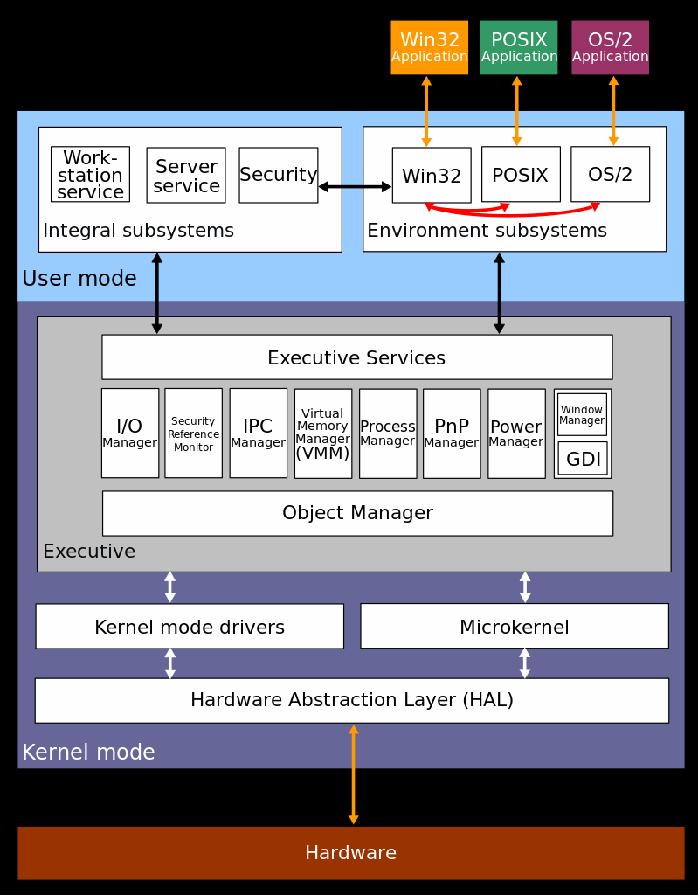

---
title: Operating System Examples
notebook: Computer Systems
layout: note
date: 2020-07-07 22:10
tags: 
...

# Operating System Examples

[TOC]: #

## Table of Contents
- [Windows NT](#windows-nt)
  - [OS Properties](#os-properties)

## Windows NT

[Wiki: Windows NT](https://en.m.wikipedia.org/wiki/Windows_NT)

- family of operating systems
- processor-independent, multiprocessing, multi-user OS
- initially produced for workstations and servers
- eventually expanded into general purpose OS for all PCs, deprecating Windows 9x family
- "NT": originally New Technology
- written in C (kernel mode code) and C++ (user mode code)
- goals: hardware, software portability
- features:
  - Hyper-V: native hypervisor
  - Hardware Abstraction layer: set of routines in software providing programs
    with access to hardware through programming interfaces
  - BitLocker: full volume encryption feature, using AES in CBC mode
  - NTFS: journaled, secure file system

[Wiki: Architecture](https://en.m.wikipedia.org/wiki/Architecture_of_Windows_NT)

- hybrid kernel:

### OS Properties

- preemptive: processes can be suspended without their cooperation, returning control
  to the OS
- reentrant: ability of code to be executed 2+ times simultaneously
  - in a multiprocessor there is the chance a CPU will start executing it at the
    same time as another, meaning threads could be executing the same code at the
    same time. Protect against with mutexes etc to protect critical regions
  - in a uniprocessor: a procedure could be invoked in the middle of execution
    of the same procedure.  It is possible that the data structure the new procedure
    is access was left in an inconsistent state by the interrupted procedure
  - consider scheduling manager: if this was updating the queue, which gets interrupted
    partway through. The scheduler is called and encounters an inconsistent queue,
    causing it to crash
- multitasking: concurrent execution of multiple tasks

