---
title: Unix, Linux, Android
notebook: Computer Systems
layout: note
date: 2020-07-07 22:51
tags:
...

# Unix, Linux, Android

[TOC]: #

## Table of Contents
- [History](#history)
  - [MULTICS](#multics)
  - [PDP-11 UNIX](#pdp-11-unix)
  - [Portable UNIX](#portable-unix)
  - [Berkeley UNIX](#berkeley-unix)
  - [POSIX](#posix)
  - [MINIX](#minix)
  - [Linux](#linux)
- [Linux Overview](#linux-overview)
  - [Linux Goals](#linux-goals)
  - [Interfaces](#interfaces)
- [Kernel Structure](#kernel-structure)
  - [I/O Component](#io-component)
  - [Interdependence](#interdependence)
  - [System call interface](#system-call-interface)
- [Processes](#processes)
  - [Signals](#signals)
  - [Implementation](#implementation)
  - [Process Descriptor](#process-descriptor)
  - [Executing `ls`](#executing-ls)
  - [Kernel Threads and `clone`](#kernel-threads-and-clone)
- [Scheduling](#scheduling)
  - [Linux O(1) Scheduler](#linux-o1-scheduler)
  - [Completely Fair Scheduler (CFS)](#completely-fair-scheduler-cfs)
- [Boot Process](#boot-process)
  - [Dynamic Loading](#dynamic-loading)
  - [`init`](#init)
- [Memory Management](#memory-management)
  - [System Calls](#system-calls)
  - [Implementation](#implementation-1)
  - [Physical memory](#physical-memory)
  - [Paging Scheme](#paging-scheme)
  - [Memory-Allocation](#memory-allocation)
  - [Representation of Virtual Address Space](#representation-of-virtual-address-space)
  - [Paging](#paging)
  - [Page Frame Reclaiming Algorithm](#page-frame-reclaiming-algorithm)
- [I/O](#io)
  - [Implementation](#implementation-2)
  - [Modules](#modules)
- [File System](#file-system)
  - [System calls](#system-calls-1)
  - [Virtual File System](#virtual-file-system)
  - [`ext2`](#ext2)
  - [`ext4`](#ext4)
  - [`/proc` file system](#proc-file-system)
- [Security](#security)


## History

### MULTICS

- 1940s-1950s: book time on a computer
- 1960s: batch systems where you leave your punched cards at the machine room
  - long delay between submitting and getting the output
  - debugging immensely difficult
- timesharing invented at Dartmouth College and MIT
- **MULTICS: Multiplexed Information and Computing Service**: developed by Bell Labs and GE, before
  Bell Labs pulled out
- Ken Thompson: Bell Labs researcher writes stripped-down MULTICS in assembly on a PDP-7
- Brian Kernighan referred to it as **UNICS (Uniplexed Information and Computing Service**,
  which eventually became UNIX

### PDP-11 UNIX

- UNIX was moved to PDP-11, which was a powerful machine and large memory, with
  memory-protection hardware, allowing multi-user support
- Thompson rewrote UNIX in high-level language he designed, B.  But it lacked structures
  making it insufficient.
- Dennis Ritchie designed successor C and a compiler
- Thompson and Ritchie then rewrite UNIX in C, publishing landmark paper
  [The UNIX Time-Sharing System](https://people.eecs.berkeley.edu/~brewer/cs262/unix.pdf) in 1974
- Bell Labs, owned by AT&T, as a regulated monopoly was not allowed to be in the
  computer business, so licensed UNIX to universities for a modest fee.  At the time,
  most universities had PDP-11s, and the OS that came with them was terrible, so
  UNIX came in at the right time.

### Portable UNIX

- porting UNIX to a new machine was made much simpler once it was written in C.
  The process involves:
  - writing a C compiler for the new machine
  - writing device drivers for the new machine's I/O devices
  - small amount of machine-dependent code for interrupt handlers/memory management in assembly
- processing of porting to an Interdata machine revealed lots of assumptions implicitly
  made by UNIX about integers being 16 bits, pointers, being 16 bits, etc.  UNIX
  had to be cleaned up to make it portable.
- a portable C compiler was implemented, allowing easy modification for any machine
  with moderate effort
- AT&T was broken up in 1984 by the US government, and accordingly established a computer
  subsidiary, releasing commercial UNIX product (System III/V)

### Berkeley UNIX

- source code for UNIX was available, so Berkeley heavily modified it, with funding
  from ARPA
- 4BSD (Fourth Berkeley software distribution) introduced many improvements
  - virtual memory and paging
  - longer file names
  - reimplemented file system with improved performance
  - increased signal handling reliability
  - introduced networking causing TCP/IP protocol stack to become de facto standard
    in UNIX world
- added a number of utility programs: `vi`, `csh`, Pascal and Lisp compilers, ...
- some vendors subsequently based their UNIX off Berkely UNIX rather than System V

### POSIX

[IEEE 1003.1-2017](https://ieeexplore.ieee.org/document/8277153)

- late 1980s: 4.3BSD and System V Release 3 were both in widespread use and were
  somewhat incompatible, with each vendor additionally complicating matters with
  their own non-standard enhancements
- prevented commercial success as software vendors could not package UNIX programs
  and guarantee that they would run on any system, as was the case with MS-DOS
- attempts were made to standardise, e.g. by AT&T issuing the SVID (System V Interface
  Definition), however this was only relevant to System V vendors and ignored by BSD
- IEEE Standards Board came together with industry, academia, and government to
  produce POSIX, a Portable Operating System, defined in standard 1003.1
- 1003.1 defines a set of library procedures that every conformant UNIX system must supply.
  Most procedures invoke a system call (e.g. `open, read, fork`), but some can be
  implemented outside the kernel
- as a result a vendor writing a program using only procedures defined by 1003.1
  knows that this program will run on every conformant UNIX system
- approach taken by IEEE was unusual in that it took the intersection of System V
  and BSD, rather than the union, such that 1003.1 looks lie a common ancestor of both
  OSs
- related documents standardise threads, utilities, networking, ...
- C has also been standardised by ISO/ANSI

### MINIX

- modern UNIX is large and complicated, the antithesis of the original conception of UNIX
- 1987: MINIX was produced as a UNIX-like system that was small enough to understand, with
  11,800 lines of C and 800 lines of assembly
- MINIX used microkernel design, providing minimal functionality in the kernel so that it
  is reliable and efficient.  Memory management and file system become user processes,
  while the kernel handles message passing between processes and not much else
  - Kernel: 1600 lines of code + 800 lines of assembler
  - I/O device drivers: 2900 lines of C, also in kernel
  - File system: 5100 lines of C
  - Memory manager: 2200 lines of C
- microkernels vs monolithic:
  - the former is easier to understand and maintain, with a highly modular structure
  - highly reliable: a crash of a user mode process does much less damage than a kernel-mode crash
  - lower performance due to extra switches between user/kernel mode
- 2004: direction of MINIX development changed to focus on building an extremely
  reliable and dependent system that could automatically repair faults
  - all device drivers were moved to user space, each running as a separate process
  - kernel was under 4000 lines of code
- has been ported to ARM, so it is available for embedded systems

### Linux

- many features were requested for MINIX but these were often denied due to the goal
  of keeping the system small
- 1991: Linus Torvalds wrote Linux as a UNIX clone, intending for it to be a full production system
  - monolithic, with the entire OS in the kernel
  - initially 9,300 lines of C + 950 lines of assembly
- 1994: v1.0, 165,000 lines of code
- 1996: v2.0, 470,000 lines of C, 8000 lines of assembly
- 2013: ~ 16 million lines of code
- version `A.B.C.D`:
  - `A`: kernel version
  - `B`: major version
  - `C`: minor revision, e.g. support for new drivers
  - `D`: minor bug fixes and security patches
- issued under GPL (GNU Public License), permitting you to use, copy, modify, and redistribute
  the source and binary code freely. All derivatives of the Linux kernel may not be sold/redistributed in binary form only,
  they must be shipped with source code
- 1992: Berkeley terminated BSD development, releasing 4.4BSD
  - FreeBSD was based off this
  - Berkeley issued software under an open source license
  - AT&T subsidiary sued Berkeley, keeping FreeBSD off the market for long enough
    for Linux to become well established
  - had this not happened, Linux would have an immature OS competing with mature
    and stable system

## Linux Overview

### Linux Goals

- UNIX: interactive system for multiple processes and multiple users, designed
  by programmers for programmers

#### Goals

- simplicity
- elegance
- consistency
- power
- flexibility
- avoid useless redundancy

#### Examples

- files should just be a collection of bytes, not with different classes
- principle of least surprise: e.g. `ls *A` and `rm *A` should be predictable and
- small number of basic elements should be able to be combined infinite ways as needed

### Interfaces

- operating system runs on bare hardware, controling the hardware and provides
  system calls interface to programs
- system calls allow users to create and manage processes, files, resources
- programs make system calls by putting arguments in registers and issuing trap
  instructions.  As there is no way to write a trap instruction in C, a standard library
  is provided with one procedure per system call
- standard library is written in assembly but can be called from C
- POSIX specifies the library interface, not the system call interface
- Linux also supplies standard programs, some of which are specified by 1003.2, which
  get invoked by the user


- GUIs are supported by X windowing system (X11/X), defining communication and
  display protocols for window manipulation on bitmap displays
- X server: controls devices and redirects I/O
- GUI environment built on top of low-level library `xlib` which contains functionality
  to interact with the X server
  - graphical interface extends functionality of X11 by enriching window view: e.g. buttons, menus, ...
  - `xterm`: terminal emulator program, providing basic command-line interface to OS

## Kernel Structure


- interrupt handlers: primary way of interacting with devices
- dispatching occurs as the result of an interrupt: code stops running process,
  saves its state and starts the appropriate driver
  - written in assembler

### I/O Component

- **I/O component**: responsible for interacting with devices, network, storage I/O operations
- I/O operations are integrated under a **Virtual File System (VFS)** layer
- at the low-level all I/O operations pass through a device driver
- drivers are either character/block-device, depending on whether they are random access
  or not, and network devices, while a form of character devices are sufficiently different
  to consider them a different category
- **character devices** used in 2 ways:
  - every keystroke: e.g. `vim`
  - line oriented: e.g. `bash`.  The character stream is passed through a line discipline
- **network devices**:
  - above network drivers is full functionality of hardware router
  - above routing code is protocol stack (including IP/TCP)
  - above this is the socket interface, allowing programs to create sockets
- **block devices**:
  - I/O scheduler orders/issues disk-operation requests per some system policy
  - file system: Linux has multiple file systems concurrently, so to abstract away
    architectural differences, a generic block-device layer is used by all file systems

### Interdependence

- 3 components are interdependent
- e.g. page caches may be used to hide latencies of accessing files: block device dependent on memory manager
- e.g. virtual memory relies on swap area: memory manager dependent on I/O

### System call interface

- all system calls come here, causing a trap which switches execution from user mode into
  protected kernel mode, passing control to one of the kernel components

## Processes

- each process runs a single program, starting with 1 thread of control
- **process group**: ancestors, siblings, descendants
- **daemon**: background process e.g. `cron` daemon for scheduling jobs
- created by `fork`
- **pipe**: channel for two processes to communicate, one process can write a stream
  of bytes for the other to read
  - when a process tries to read an empty pipe, the process is blocked until data is available
- **zombie state**: process exits, and parent has not waited for it.  When parent
  calls `wait` for it, the process terminates

### Signals

- **signal**: software interrupt for one process to send signal to another process
- processes catching signals must specify signal-handling procedure
- when a signal arries, control abruptly switches to the handler. After finishing,
  control returns to the previous location
- processes can only send signals to members of its **process group**
- `sigaction`: syscall for a process to announce signal-handler for a particular signal
- `kill`: syscall for a process to signal another related process
  - uncaught signals kill the recipient
- `alarm`: syscall for a process to be interrupted after a specific time interval with `SIGALRM`
- `pause`: suspends process until next signal arrives

### Implementation

- every process has a user part running the user program
- when a thread makes a syscall it traps to kernel mode and begins running in kernel
  context, with a different memory map, and full access to machine resources
- this is still the same thread, but with more power and its own kernel mode stack and program
  counter
- kernel represents any execution context (thread, process) as a **task** via `task_struct`,
  - multithreadd process has one task structure for each user level thread
- kernel is multithreaded, having kernel-level threads
  - executing kernel code
  - not associated with any user processes
- `task_struct`s are in memory for each process at all times, stored as a doubly linked list
- there is also a hashmap from PID to the address of the task structure for quick lookup.
  This uses chaining in case of collisions.

### Process Descriptor

- **scheduling parameters**: process priority, CPU time used, time sleeping
- **memory image**: pointers to text, data, stack, page tables
- **signals**: mask indicate which signals are caught/ignored/delivered
- **machine registers**: when a trap occurs, machine registers are stored ere
- **syscall state**: info about the current system call
- **file descriptor table**: table mapping between file descriptor and file's i-node
- **accounting**: keep track of CPU time used by the process
- **kernel stack**: fixed stack, for use by kernel part of process
- **miscellaneous**: process state, event being waited for, PID, parent PID, UID, GUID

### Executing `ls`


### Kernel Threads and `clone`

- kernel threads in Linux differ from the standard UNIX implementation
- in UNIX, processes are resource containers, and threads units of execution.  Processes
  contain 1+ threads, sharing address space, open files, signal handlers, alarms, ...
- `clone`: introduced in Linux in 2000, blurring the distinction between threads and processes,
  allowing parameters to be specified as process specific or thread specific

```c
pid = clone(function, stack_ptr, sharing_flags, arg);
```

Whether a `clone` call creates a new thread in the current process or in a new process
is dependent on `sharing_flags`, which is a bitmap allowing fine-grained control over what
gets shared.


- divergence from UNIX, meaning Linux code using `clone` is no longer portable to UNIX
- Linux stores in `task_struct` both the process identifier PID and task identifier TID
- when `clone` creates a new task sharing nothing with the creator, and PID is set to a new value
- otherwise `clone` creates a task receives a new TID but inherits the PID

## Scheduling

- As Linux threads are kernel threads, scheduling is based on threads, not processes
- runnable tasks are stored in the **runqueue**, associated with each CPU
- tasks which are not runnable are stored in the **waitqueue**
- 140 priority values:
  - 0: highest priority
  - 139: lowest priority
- 3 classes of threads:
  - **real-time FIFO**: highest priority 0-99, not preemptable except by a newly readied
    real-time FIFO thread with higher priority
  - **real-time round robin**: highest priority 0-99, preemptable by the clock, having
    an associated time quantum
  - **timesharing**: lower priority 100-139, conventional threads
- NB these are not actually real-time threads, in terms of a deadline guarantee.  The naming
  is for consistency with standards
- `nice(value)`: syscall to adjust static priority of a thread, where value ranges from -20 to +19

### Linux O(1) Scheduler

- historically popular scheduler, but the heuristics were complex and imperfect, producing
  poor performance for interactive tasks
- constant time to select/enqueue tasks
- the runqueue uses two arrays, active and expired, storing the heads of a linked list,
  each corresponding to 1 of 140 priority levels
- scheduler selects task from highest-priority list in active array
- after the task's quantum has expired, it is moved to the expired list, possibly with
  a different priority level
- a task that blocks is placed on the waitqueue until it is ready again, at which point
  it is enqueued on the active array
- when there are no more tasks in the active array, the pointers are swapped to make the
  expired array the active array
- higher priority levels are assigned higher quanta to get processes out of the kernel quickly
- interactivity heuristics: dynamic priority is continuously recalculated to reward interactive
  threads and punish CPU-hogging threads (-5 to +5 penalty)

### Completely Fair Scheduler (CFS)

- uses a red-black tree as the runqueue
- tasks are ordered based on amount of CPU time they have spent, `vruntime`, measured in
  nanoseconds
- left children have had less time on CPU and will be scheduled sooner than right children
- schedule the task which has had the least CPU time (typically left-most node)
- CFS periodically increments `vruntime` of the task, with the effective rate adjusted according to
  the task's priority: low priority tasks have time pass more quickly.  This avoids
  maintaining separate runqueues for different priorities
- selection of a node: constant time $O(1)$
- insertion of a node: $O(\log{n})$


## Boot Process

- BIOS performs Power-On-Self-Test (POST) and initial device discovery and initialisation
- [Master Boot Record](https://en.m.wikipedia.org/wiki/Master_boot_record) first
  sector of the boot disk, is read into a fixed memory location and executed
- execution of MBR program loads a standalone `boot` program from the boot device
- `boot` is then run
  - copies itself to a fixed high memory address, freeing low memory for the OS
  - reads root directory of the boot device
  - reads in OS kernel and jumps to it.  Kernel is running
- kernel start-up code is written in assembly, so is highly machine dependent
  - setting up kernel stack
  - identify CPU
  - calculate RAM present
  - disable interrupts
  - enable MMU
  - call C-language `main` procedure to start main part of the OS
- kernel data structures are allocated: page cache, page tables
- autoconfiguration: probe for present devices and add them to a table
  - device drivers can be loaded dynamically
- set up process 0 (idle process), set up its stack, and run it
  - initialisation: e.g. program real-time clock
  - mount root file system
  - create `init` (process 1)
  - create `page` daemon (process 2)
- `init` checks if it is single/multiuser:
  - single: `fork` a process executing the shell, and wait for it to exit
  - multi:
    - `fork` a process that executes system initialisation shell script `/etc/rc`,
    - read `/etc/ttys` to list terminals and their properties
    - `fork` a copy of itself for each terminal, then execute `getty`
- if someone tries to login, `getty` executes `/bin/login`, which requests credentials
- if authenticated, `login` replaces itself with the shell


- terminal 0: `getty` is waiting for input
- terminal 1: user has typed login name, so `getty` has overwritten itself with `login`
- terminal 2: successful login has occurred, so `login` has replaced itself with `/bin/sh`,
  which has printed the prompt.  The user has typed `cp f1 f2`, causing the shell
  to `fork` off a child process executing `cp`.  The shell is blocked, waiting for the
  child to terminate.

### Dynamic Loading

- traditional UNIX: static linking of drivers
- dynamic loading allows you to ship a single binary for multiple configurations,
  with the system automatically loading the drivers it needs, possibly obtaining them
  over the network
- downside: this creates security vulnerabilities

### `init`

[Wiki: Init](https://en.m.wikipedia.org/wiki/Init)

## Memory Management

- each process has an address space with three logical segments: text, data, stack
- **text**: machine instructions that form the program's executable code, read only
- **data**: variables, strings, arrays.  Two parts: initialised and uninitialised data
  - initialised data: variables and compiler constants that have an initial value
    when the program starts. Similar to program text, bit patterns produced by the compiler
  - **Block Started by Symbol (BSS)**: uninitialised data
  - data segment can be increased in size by system call `brk`
    - heavily used by `malloc`
    - **heap** is dynamically allocated memory area
- **stack**: starts at/near top of virtual address space and grows downward
  - programs don't manage the size of the stack explicitly
  - if the stack grows below the bottom of the stack segment, a hardware fault occurs
    and the OS lowers the bottom of the stack segment by 1 page
  - when a program starts it contains environment variables and command line arguments
- **shared text segments**: allows two processes running the same program can share the same piece
  of text in physical memory
- some computer hardware allows separate address spaces to be used for text (in one)
  and data + stack (in the other), doubling the available address space
- **memory-mapped files**: ability to map a file onto a portion of a process' address space
  so that it can be read/written as if a byte array, making random access much easier
  - shared libraries are accessed by mapping them in this way
  - two or more files can map in the same file at the same time

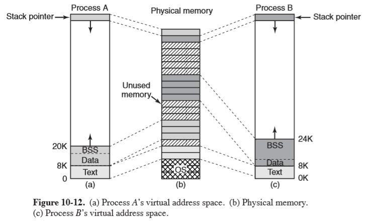

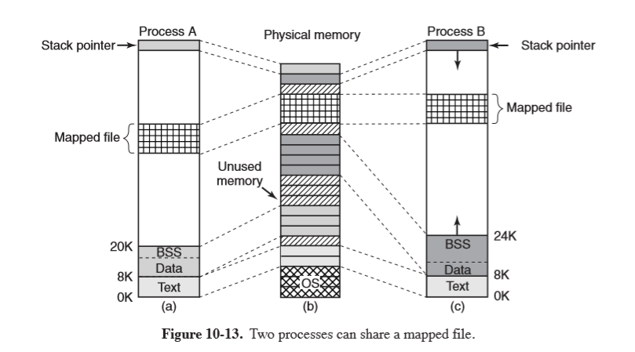

### System Calls

- POSIX doesn't specify system calls for memory management as they were considered too
  system dependent.  Instead programs need to use `malloc`, defined in ANSI C.
- most Linux systems have system calls for managing memory:
  - `brk`: change data segment to new address
  - `mmap`: map a file in

### Implementation

[Duke: linux memory management](https://www2.cs.duke.edu/courses/spring04/cps210/projects/mmlinux.html)

- each process on a 32-bit machine has 2 segments of the address space: user and kernel.
- 3GB: private user segment individual to a process, including text, data, and stack
- 1GB: every process maps the same kernel segment into its address space,
  storing a small stack, kernel data structures, and mappings to directly access
  physical memory.  This eliminates the need for address translation.
- the kernel segment is only accessible in kernel mode.  If an attempt to access an address
  over (and including) `0xC00000000`, this will produce a fault

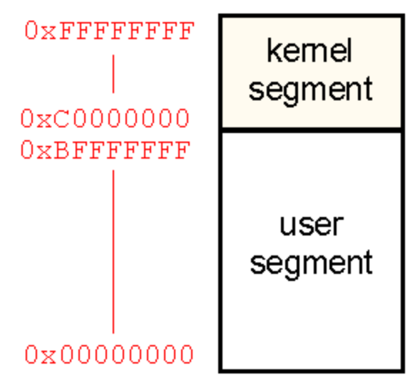

- 64-bit x86 machines: only use 48 bits for addressing, for a theoretical limit of 256TB of addressable
  memory
  - Linux divides this between kernel and user space, of 128TB each
- address space gets created when a process is created, and is overwritten on an `exec`

### Physical memory

- Linux uses **nodes** to allow it to support **Non-Uniform Memory Access (NUMA)**,
  where access time for different memory locations may vary.  Physical memory is partitioned
  into nodes.
- in the case of **Uniform Memory Access**, physical memory is represented under a single node

For each node, Linux distinguishes between **zones** of memory, resulting from differences idiosyncracices
of hardware which require them to be handled differently.  Memory allocation can then
be performed for each zone separately.

- **pinned**: memory that doesn't get pages out
- the kernel and **memory map** are pinned, while the rest of memory is divided into page frames
- a page frame can be a page for: (or else on the free list)
  - text
  - data
  - stack
  - page-table
- **memory map**: map maintained by the kernel representing the usage of physical memory
  - `mem_map`: an array of page descriptors (`page`) for each physical page frame in
    the system
- **zone descriptor**: one for each zone. It stores:
  - memory utilisation
  - array of free areas, where the $i$th element identifies the head of a list of
    page descriptors of blocks of $2^i$ free pages (used in the buddy scheme)
- page descriptor `page`: contains pointer to address space that it belongs to
  - if free, it has an additional pair of pointers that allow it to form a doublyy
    linked list with other free page frames

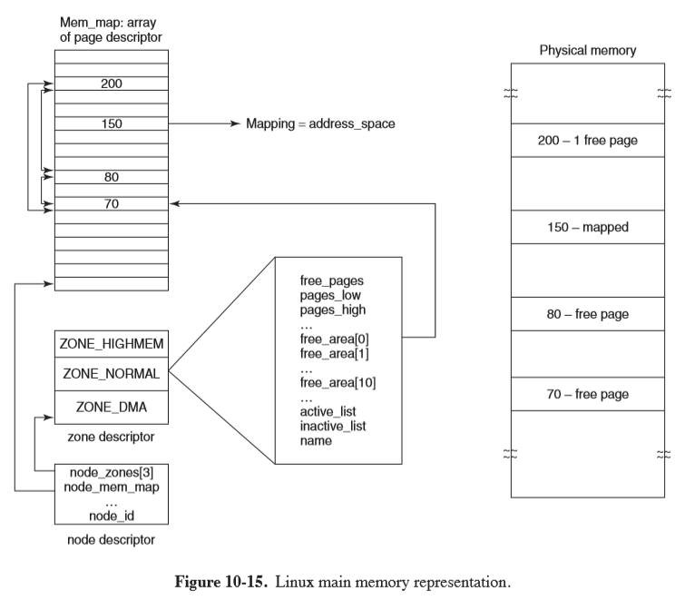

### Paging Scheme

- Linux uses a 4-level paging scheme for efficient paging
- virtual address is broken into 5 fields, each used to index the appropriate page of
  the table

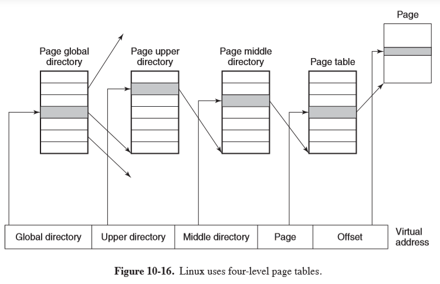

### Memory-Allocation

- **page allocator**: allocates new page frames of physical memory using **buddy algorithm**
  - request for memory (in number of pages) is rounded up to the next power of 2
  - chunk of memory is repeatedly split until the chunk size matches this power of 2,
    which can then be allocated
- the array of free areas in the zone descriptor is used to store lists of blocks of
  size $2^i$, allowing you to quickly locate such a block by indexing the array
- this results in a lot of internal fragmentation (e.g. 65 page chunk requested would yield a 128-page chunk)
- **slab allocator**: second memory allocation which takes chunks from buddy algorihtm
  and carves them into smaller slabs for separate management
  - slabs maintain **object caches** which can be used for storing objects frequently
    created/destroyed by the kernel

### Representation of Virtual Address Space

The virtual address space can be broken into **areas** that are runs of consecutive pages
sharing protection and paging properties, e.g. text segment, mapped files

- **`vm_area_struct`**: describes an area, including:
  - protection mode (read/write),
  - pinned/pageable,
  - growth direction (up/down),
  - private/shared between processes,
  - whether it has backing storage on disk: e.g. text segment: uses executable binary as backing storage,
    memory-mapped file: uses disk file as backing storage.  The stack doesn't have
    backing storage assigned until they need to be paged out
- **`mm_struct`**: top-level memory descriptor, with information about all virtual-memory
  areas in an address space, information about different segments, users sharing the address
  space

There are 2 ways to access of an area of an address space via this top-level memory descriptor:

- linked-list: useful when all areas need to be accessed, or the kernel is trying to
  find a virtual memory region of a specific size to allocate
- red-black tree: gives fast lookup when a specific virtual memory needs to be accessed

### Paging

- early UNIX used **swapper process** to move entire process between memory and disk
- Linux: demand-paged system, no prepaging, no working set
- paging is implemented by both kernel and **page daemon** (process 2), which runs periodically,
  checking if there are sufficient free memory pages, and if not, it starts to free some
- pages with backing storage are paged to their files on disk
- pages without backing storage are paged to the **swap area** (either paging partition
  or fixed-length paging file)
- paging to a separation partition is more efficient:
  - no mapping between file blocks/disk blocks is needed
  - physical writes can be of any size, not just file block size
  - page is always written contiguously to disk

### Page Frame Reclaiming Algorithm

- idea: keep some pages free so that they can be claimed as needed
  - requires continual replenishment of the pool
- page types
  - *unreclaimable*: may not be paged out, e.g. kernel mode stacks
  - *swappable*: must be written to the swap area before the page can be reclaimed
  - *syncable*: must be written back to the disk if dirty
  - *discardable*: can be immediately reclaimed
- page daemon `kswapd` is started by `init` at boot for each node
- each time it awakens, `kswapd` checks if there are enough free pages available.
  If free pages falls below a threshold, it initiates PFRA
- for each run, only a target number of pages is reclaimed, typically a maximum of 32,
  to control I/O pressure
- approach: reclaim easy pages, then harder ones
  - discardable and unreferenced pages can be reclaimed immediately by moving to the
    zone's free list
  - pages with a backing store that haven't been referenced recently are next
  - then come shared pages that no user seems to be using much
  - pages that are invalid, absent from memory, shared, locked, or being used for
    Direct Memory Access are skipped
- uses a clock-like algorithm within a category to select old pages for eviction
- pages get categorised by two flags: _active/inactive_ and _referenced/not referenced_

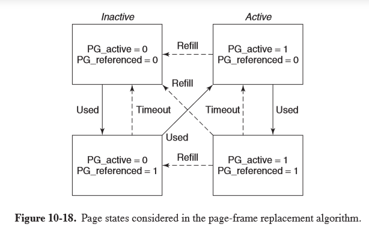

- when PFRA first scans pages, it clears the reference bits
- on the next scan of pages, if the page has been referenced it is advanced to another state where it is
  less likely to be reclaimed
- pages on the inactive list which have not been referenced since last inspected are the
  best eviction candidates
- `pdflush`: a set of background daemons that wake periodically to write very old
  dirty pages back to disk
  - can also be explicitly awakened when the available memory falls below a threshold to write
    dirty pages from the page cache back to disk

## I/O

- all I/O devices are made to look like files, and are accessed as such, using the
  same system calls `read`, `write`, etc.
- **special file**: integrates device into file system, with each device being assigned
  a path e.g. `/dev/hd1`
- **block special file**: consists of a sequence of numbered blocks, allowing addressing/accessing of individual blocks
  - e.g. hard disk
- **character special file**: input/output character stream
  - e.g. keyboard, printer, network, mouse, ...
- each special file is associated with a device driver handling the device
- **sockets** are networking interfaces
  - socket creation returns a file descriptor
  - connections function like a pipe between processes

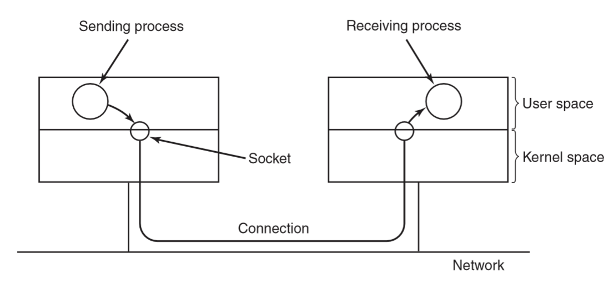

### Implementation

- I/O is implemented by a collection of device drivers, one per device type
- the driver isolates the rest of the system from the hardware particulars,
  providing a standard interface that allows the I/O system to be largely machine-independent
- major device number: identifies driver, used to index a hash table containing data structures
  for character/block devices
  - these structures contain pointers to procedures to open/read/write to the device
- minor device number: allows distinguishing devices supported by the same driver
- major + minor device numbers uniquely specify each I/O device
- adding new device type to Linux involves adding an entry to one of the tables, and
  supplying procedures to handle device operations

Drivers are split into 2 parts, both of which are part of the kernel and run in kernel mode

- top half: runs in the context of the caller, interfacing with the rest of Linux
- bottom half: runs in kernel context, interacting with the device
- drivers can call a set of kernel procedures e.g. memory allocation, timer management,
  as defined in **Driver Kernel Interface** document
- goal for system handling block special files: minimise the number of transfers required
- Linux uses a page cache between disk drivers and the file system
- **generic block layer**: performs translations between disk sectors, blocks, buffers,
  pages of data
- **page cache**: table in the kernel holding thousands of most recently used blocks
  - works for reads and writes: when a program writes a block, it goes to the cache, not to disk
  - `pdflush` daemon flushes the block to disk if the cache exceeds a threshold, and
    dirty blocks are written to the disk every 30s
- **I/O scheduler**: aims to reduce latency of repetitive disk-head movements by reordering
  and bundling read/write requests to block devices
- **Linux elevator scheduler**: sort disk operations in a doubly linked list, ordered
  by address of the sector of the disk request
  - new requests are inserted in order
  - request list can be merged so that adjacent operations are issued via a single disk request
  - to prevent starvation, two additional lists are maintained for read/write operations
  - these lists are ordered by deadline, after which the read/write request will be
    serviced before any on the main doubly linked list
    - read deadline: 0.5s
    - write deadline: 5s
- **raw block file**: allow programs to access the disk using absolute block numbers
  without regard to filesystem
  - used for paging, swapping, file system utilities (e.g. `mkfs`, `fsck`)
- **line discipline**: provide support for random access across a line on a device
  that is otherwise a character device (supplying a stream of bytes), typically
  a terminal
- **network devices**: due to asynchronous nature they aren't easily integrated under the
  same interface as character devices
  - `skbuff`: socket buffer structure used to represent portions of memory filled with packet data

### Modules

- UNIX originally had device drivers statically linked into the kernel, so that they
  were all present in memory when the system was booted.  This meant the kernel
  was built specific to the devices being used.
- with Linux on PCs, a vast array of I/O devices was possible, but building a separate
  kernel is not feasible for widespread use
- Linux uses **loadable modules** which are chunks of code loaded into the kernel
  while it runs
- process of loading a module
  - relocate it on the fly
  - check if resources needed are available and mark as in use
  - set up interrupt vectors
  - update driver switch table for new major device type
  - perform device-specific initialisation
  - driver is now fully installed

## File System

- exemplifies _small is beautiful_, providing minimal mechanisms and function calls
  while providing powerful and elegant file system
- initially Linux used `MINIX 1` file system, which was extremely limited in file name
  length and file size
- `ext` was developed with much longer file names and maximum file sizes, but was
  slower than `MINIX 1`
- `ext2`: long file names, long files, good performance
- **virtual file system (VFS) layer** allows Linux to support multiple file systems,
  which can be linked to the kernel or dynamically loaded
- file: sequence of 0+ bytes.  No distinction between file types: this is entirely
  up to the file owner
- mount: disks can be mounted in different parts of the tree
- **locking**: POSIX defines ability to lock from an individual byte to an entire file
  into an atomic operation
  - **shared lock**: a second attempt to place a lock on the same portion of a file already under a shared lock
    will success for a shared lock, and fail for an exclusive lock
  - **exclusive lock**: any attempt to lock a portion of a file under an exclusive lock will
    fail until the lock is released
  - for a lock to be placed every byte in the region must be available
  - locked regions may overlap

### System calls

```c
// create and open file "abc" with protection bits specified in mode
fd = creat("abc", mode);
```

- file descriptor: small nonnegative integer used to index the process' file descriptor
  table
- each file has a pointer associated with it indicating the current position in the file
- `lseek` allows you to change the value of the position pointer at will
  - ironically it is the only file system call that never causes a real disk seek
    because it is just updating a pointer value
- `stat` lets you find out file metadata
- `pipe` creates shell pipelines, creating a pseudofile that buffers data between pipeline
  components

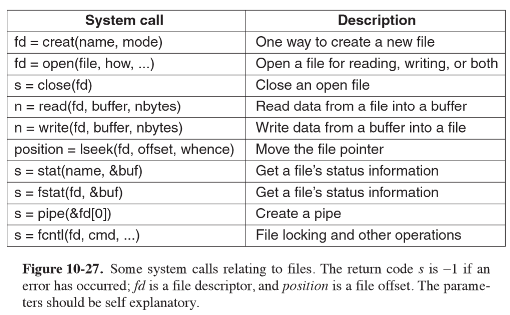

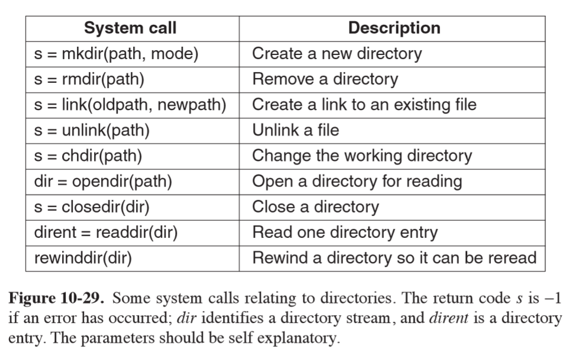

### Virtual File System

- VFS is a file-system abstraction that hides details of particular file systems
  from user processes and applications, as well as whether the file system
  is local or remote
- VFS supports four main file-system structures:

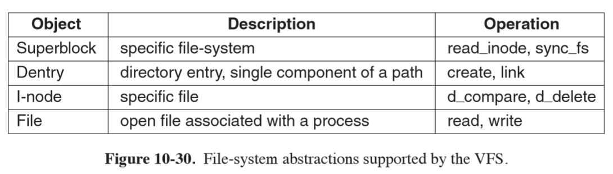

- **superblock**: contains critical information about layout of the filesystem
- **i-nodes**: index nodes, describe one file each
- superblocks and i-nodes have corresponding structures maintained on the physical disk
- **dentry**: struture representing a directory entry, a single component of a path, created on the fly
  - cached in the `dentry_cache`
- **file**: in-memory representation of an open file, created in response to an `open` syscall
  - supports `read, write, sendfile, lock, ...`
- operations in data structures for each VFS object are pointers to underlying
  functions in the file system

### `ext2`

- block 0: not used by Linux, contains boot code
- block groups: disk partition is divided into block groups, with no consideration
  for disk cylinder boundaries
- **superblock**: contains information about the layout of the file system
  - number of i-nodes
  - number of disk blocks
  - start of list of free disk blocks
- uses bitmaps to keep track of free blocks and free i-nodes, each one block long
- **i-nodes**: 128 bytes long

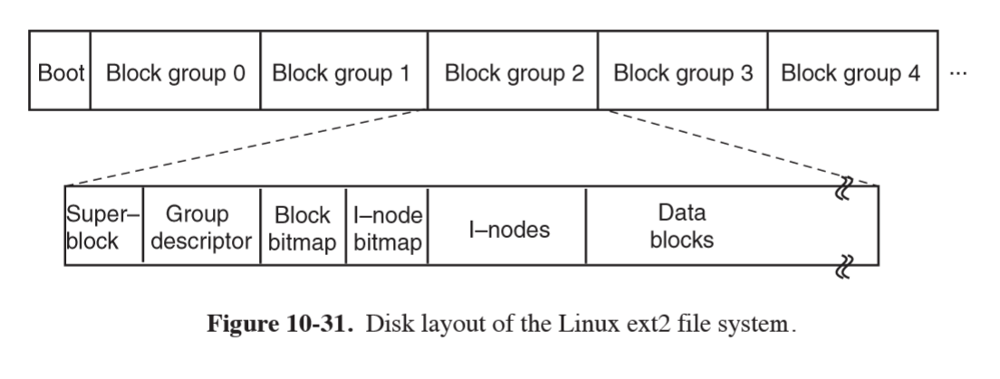

- within a directory, entries for files are in unsorted entry
- as directories are searched linearly, it can take a long time to find an entry,
  hence the **dentry cache** for recently accessed directories
  - lookups use the name of the file

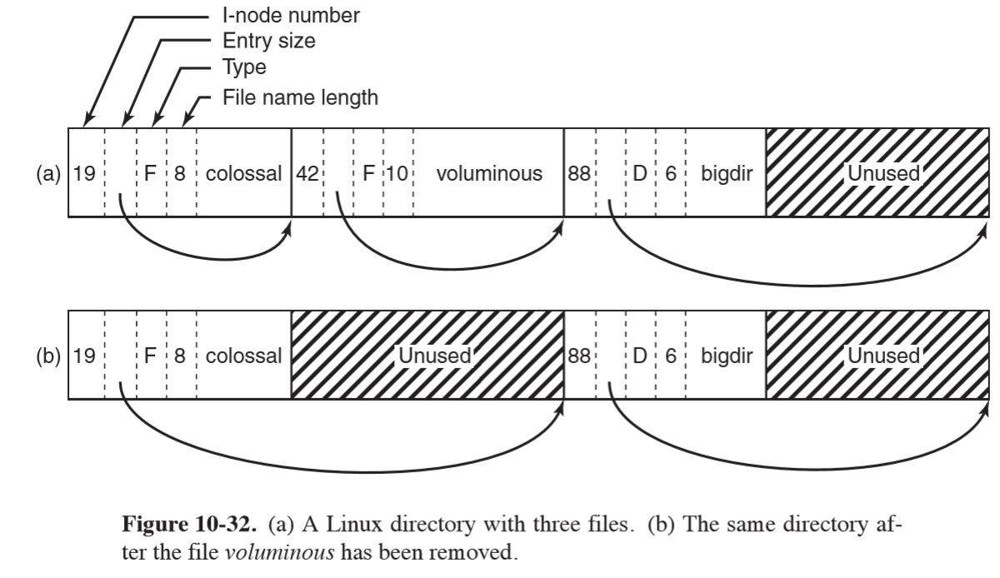

- e.g. lookup `/usr/ast/file`:

1. system locates root directory (usually i-node 2), placing entry in dentry cache
for future lookups of `/`
2. look up `usr` in `/` to get i-node of `/usr` directory, and enter this in dentry cache
3. fetch the i-node, extract the disk blocks from it
4. search `/usr` directory file for filename string `ast`, and get the corresponding
i-node number
5. read the i-node for `/usr/ast`, and extract directory blocks
6. look up `file` and find the i-node number
7. use the i-node number to index the on-disk i-node table and bring it into memory
8. put the i-node on an in-memory i-node table, which is a kernel data structure
holding i-nodes for all open files


- **open-file-description table**: maps between file descriptor of a process and
  the i-node table, also storing the file position and read/write bit
  - allows parent and child to share a file position, while allowing unrelated
    processes to have their own file position values

- e.g. reading a file `n = read(fd, buffer, nbytes)`
  - use file descriptor to index the open-file-description table and map to an i-node and position
  - if the file position falls in the first 12 blocks, read them in and copy the data
    to the user.  Otherwise the i-node will have to contain a disk address to an
    indirect block of i-nodes (of potentially several layers of indirection)

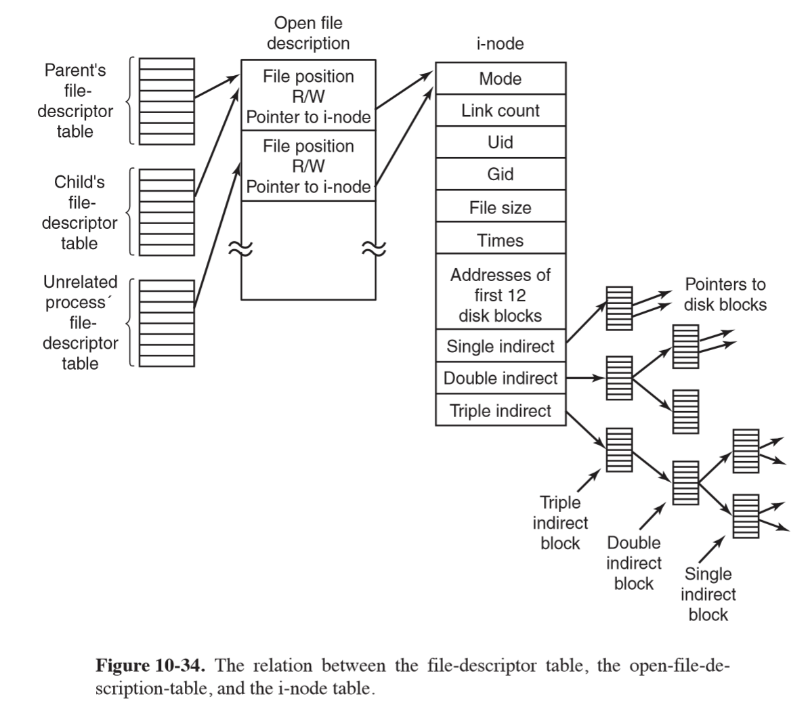

### `ext4`

- `ext3` added journalling
- `ext4` uses journalling and changed the block addressing scheme, supporting larger
  files and file-system sizes
- journal is a file managed as a circular buffer, and may be stored on the same or a separate
  device from the main file system
- **journal blocking device (JBD)** is used to perform read/write operations for the journal
  - data structures: log record, atomic operation handle, transaction
  - log record: describes low-level file system operation resulting in changes within a block
  - atomic operation handle: ext4 notifies JBD at start/end of system-call processing
  - transaction: collects atomic operations for efficiency reasons
- can be configured to journal all disk changes, or only metadata changes, with the latter
  providing less system overhead but no protection against file data corruption
- **extents**: contiguous blocks of storage, e.g. 128MB of 4KB blocks, are used in `ext4`
  - don't need metadata operations for each block of storage
  - reduces fragmentation of large files
  - increases speed of file system operations
  - supports larger files and file system sizes

### `/proc` file system

- for every process in the system, a directory is created in `/proc`, named after
  the PID
- directory contains files with information about the process: environment, signal masks, ...
- provides safe way for user programs to learn about system behaviour
- provides way to tune some system parameters

## Security

- **UID User ID**: unique ID for a registered user of a linux system, 0-65,535
  - files are marked with the UID of their owner
  - **superuser/root**: UID 0; power to read/write all files in the system, as well
    as make some protected system calls
- **GID Group ID**: used to group users, 16-bit integer
- each process carries the UID and GID of its owner
- when a file is created, it gets the UID and GID of the creating process
- the file also gets permissions determined by the creating process
- **permissions**: 9 bits representing read/write/execute for
  - owner
  - group
  - everyone else

[`chmod` calculator](https://chmod-calculator.com/)

|   Binary    |  Symbolic   | Octal | Allowed file access                                             |
|:-----------:|:-----------:|:------|:----------------------------------------------------------------|
| `111000000` | `rwx------` | `700` | Owner can read, write, execute                                  |
| `110100000` | `rw-r-----` | `640` | Owner can read, write; group can read                           |
| `111101101` | `rwxr-xr-x` | `755` | Owner can read, write, execute; all others can read and execute |

- **`SETUID`**: additional protection bit which can be set on a program, such that
  the **effective UID** for the process becomes the UID of the executable file's owner,
  rather than the UID of the user who invoked it.  Temporary change in permissions
  allowing the user to execute a program
  - useful for say, granting access to a printer
  - many sensitive programs are owned by root but with `SETUID` set, e.g. `passwd` the program
    allowing users to change their passwords.  This needs to write in the passwords
    file, but you don't want to give users free ability to write to it.  Instead they
    can invoke `passwd`, which has full access to the password file, but only changes
    the caller's password

## Questions


1. Explain how writing UNIX in C made it easier to port it to new machines. 

This meant that you only needed to implement a C compiler for a particular architecture and re-implement
specific device drivers, which involves
less work than re-implementing a whole operating system in assembly for a different architecture.

2. The POSIX interface defines a set of library procedures. Explain why POSIX standardizes library procedures instead of the system-call interface. 

By standardising library procedures, some procedures can be implemented in user space.  It allows
existing operating systems to implement POSIX without modifying their system calls, and prevents
tightly coupling the kernel design to the POSIX interface.

3. Linux depends on gcc compiler to be ported to new architectures. Describe one advantage and one disadvantage of this dependency. 

Advantage: Linux can use special capabilities of gcc
Disadvantage: Linux cannot be compiled with other compilers, e.g. `llvm` which may 
provide more features 

4. A directory contains the following files: 

```
aardvark ferret koala porpoise unicorn 
bonefish grunion llama quacker vicuna 
capybara hyena marmot rabbit weasel 
dingo ibex nuthatch seahorse yak 
emu jellyfish ostrich tuna zebu 
```

Which files will be listed by the command `ls [abc]*e*`? 

This command asks to list files starting with either a, b, or c, followed by 0 or more characters, then e, then 0 or more characters.
`bonefish` is the only returned file.

5. What does the following Linux shell pipeline do? grep nd xyz | wc –l

Counts the number of lines containing "nd" in file xyz

6. Write a Linux pipeline that prints the eighth line of file z on standard output. 

```bash
head -n 8 z | tail -n 1
```

7. Why does Linux distinguish between standard output and standard error, when both default to the terminal? 

This allows standard output to be redirected without being affected by standard error, as the result may
be pipeline.  It is also useful to be able to direct error output to a log file for debugging 

8. A user at a terminal types the following commands: `a | b | c & d | e | f &` 
After the shell has processed them, how many new processes are running? 

6 new processes were started

9. When the Linux shell starts up a process, it puts copies of its environment variables, such as HOME, 
on the process’ stack, so the process can find out what its home directory is. If this process should 
later fork, will the child automatically get these variables, too? 

Yes.  The child's memory is an exact copy of the parent's, which includes the stack, of which the environment
variables are a part.

10. About how long does it take a traditional UNIX system to fork off a child process under the 
following conditions: text size = 100 KB, data size = 20 KB, stack size = 10 KB, task structure = 1 KB, 
user structure = 5 KB. The kernel trap and return takes 1 msec, and the machine can copy one 32-bit word 
every 50 nsec. Text segments are shared, but data and stack segments are not. 

Child process will have: data: 20KB, stack: 10KB, task structure: 1KB, user structure: 5KB = 36KB
Trap and return: 1ms
Copy 36KB / 32-bit words = 9000 words @ 50ns = 450$\mu$s

Total: 1.45ms

11. As multimegabyte programs became more common, the time spent executing the fork system call 
and copying the data and stack segments of the calling process grew proportionally. When fork 
is executed in Linux, the parent’s address space is not copied, as traditional fork semantics 
would dictate. How does Linux prevent the child from doing something that would completely 
change the fork semantics?

Copy on write: the child gets pointers to the parent's address space, but marks the parent's pages 
write-protected.  When the child attempts to write into the parent's address space, a fault occurs
and a copy of the parent's page is created and allocated into the child's address space.

12. Why are negative arguments to nice reserved exclusively for the superuser? 

This is to prevent abuse of priority: all users would attempt to prioritise their processes.

13. A non-real-time Linux process has priority levels from 100 to 139. What is the default static priority and how is the nice value used to change this? 

The default static priority is 120.  
`nice` allows you to adjust this by -20 to +19.  A positive nice value decreases the priority.

14. Does it make sense to take away a process’ memory when it enters zombie state? Why or why not? 

A process enters a zombie state when it exits but the parent hasn't waited for it.
The process cannot run any more so it would be beneficial to free up the memory.

15. To what hardware concept is a signal closely related? Give two examples of how signals are used. 

A signal is closely related to hardware interrupt.  Signals are used for interprocess communication.

- `SIGKILL` sends a kill signal
- `SIGALRM` notifies a process that a period has elapsed

16. Why do you think the designers of Linux made it impossible for a process to send a signal to another process that is not in its process group? 

For security: to prevent malicious tampering, or prevent unintended signals being passed from processes that are not associated with that group.

18. In general, do you think daemons have higher or lower priority than interactive processes? Why? 

Lower priority, because interactive processes are more time-sensitive 

19. When a new process is forked off, it must be assigned a unique integer as its PID. Is it sufficient 
to have a counter in the kernel that is incremented on each process creation, with the counter used as 
the new PID? Discuss your answer. 

Almost - you also need to check which PIDs are already allocated.  As an example, if many processes 
are created and destroyed the counter will eventually overflow, and process 0 and 1 will
still be running.

20. In every process’ entry in the task structure, the PID of the parent is stored. Why? 

The parent PID is needed so that when the process exits the parent can be notified of the exit status.

22. What combination of the sharing flags bits used by the Linux clone command 
corresponds to a conventional UNIX fork call? To creating a conventional UNIX thread? 

- conventional UNIX fork: none set
- conventional UNIX thread: all set, `CLONE_VM | CLONE_FS | CLONE_FILES | CLONE_SIGHAND | CLINE_PARENT`

23. Two tasks A and B need to perform the same amount of work. However, task A has 
higher priority, and needs to be given more CPU time. Explain
how will this be achieved in each of the Linux schedulers described in this chapter, 
the O(1) and the CFS scheduler. 

- O(1): runs highest priority task in the active list.  Each time it runs the priority may be reduced
- CFS: uses a red-black tree sorted on the amount of cpu time each process has had.  Processes
  with higher priority have time run more slowly than processes with low priority.

24. Some UNIX systems are tickless, meaning they do not have periodic clock interrupts. Why is 
this done? Also, does ticklessness make sense on a computer (such as an embedded system) 
running only one process? 

This is done because frequent clock interrupts can use a lot of CPU time.  Normally, processes make 
hundreds of system calls per second, so the kernel can check on whether a process' quantum has elapsed
during the system call, rather than using an interrupt.  If there is only 1 process, there is
no need for pre-emption, so no interrupts are needed. 

25. When booting Linux (or most other operating systems for that matter), the bootstrap 
loader in sector 0 of the disk first loads a boot program which then loads the operating 
system. Why is this extra step necessary? Surely it would be simpler to have the bootstrap 
loader in sector 0 just load the operating system directly. 

This allows you to keep the bootloader very small (i.e. it has to be at most 512 bytes), while the 
boot program itself to load the operating system is quite complicated and will be quite large.  The boot
program can also be modified this way (e.g. if the operating system is updated) without the disk 
needing to be reorganised to locate the bootloader at the beginning (or else wasting disk space).

26. A certain editor has 100 KB of program text, 30 KB of initialized data, and 50 KB of BSS. 
The initial stack is 10 KB. Suppose that three copies of this editor are started 
simultaneously. How much physical memory is needed (a) if shared text is used, and (b) if it is not? 

- a. shared text: `100 + 30*3 + 50*3 + 10*3 = 370KB`
- b. non shared: `(100+30+50+10)*3 = 570KB`

27. Why are open-file-descriptor tables necessary in Linux?

Open file descriptor tables map between a file descriptor and a physical page, maintaining the mode and file position.
Having the open file descriptor table means that processes can share/copy a file descriptor, while other processes
can have completely independent position in the same file.


28. In Linux, the data and stack segments are paged and swapped to a scratch copy kept on a special paging disk or partition, but the text segment uses the executable binary file instead. Why? 

The text is read-only, while the data and stack pages are likely to be modified.

29. Describe a way to use `mmap` and signals to construct an interprocess-communication mechanism. 

`mmap` is used to request the kernel to map a file to memory at a specific address.  Two processes
can request the same file to be mapped to the same location, allowing shared access to physical memory.
Half of this could be used by each process as it's write buffer.  A signal could be used to communicate
to the other process that it has written a message, and the other process can now read it.

30. A file is mapped in using the following mmap system call: `mmap(65536, 32768, READ, FLAGS, fd, 0)` 
Pages are 8 KB. Which byte in the file is accessed by reading a byte at memory address 72,000? 

The arguments for mmap are addr, len, prot, flags, fd, offset
Here:
addr = 65536

`72000 - 65536 = 6464`

i.e. byte 6464 is accessed

32. Can a page fault ever lead to the faulting process being terminated? If so, give an example. If not, why not? 

Yes: e.g. if the stack has bumped into the data stack, the next available page cannot be allocated to the
stack, so the process must be terminated as it has run out of virtual memory.  Alternatively,
the paging area of the disk may be full.

34. It is stated in the text that a paging partition will perform better than a paging file. Why is this so? 

Paging to a partition allows the use of a raw device, eliminating overhead from handling file-system data
structures.

35. Give two examples of the advantages of relative path names over absolute ones. 

Convenient for the programmer
Much simpler and requires fewer disk accesses

36. The following locking calls are made by a collection of processes. For each call, tell what happens. If a process fails to get a lock, it blocks. 

- a. A wants a shared lock on bytes 0 through 10.  
- b. B wants an exclusive lock on bytes 20 through 30. 
- c. C wants a shared lock on bytes 8 through 40. 
- d. A wants a shared lock on bytes 25 through 35. 
- e. B wants an exclusive lock on byte 8. 

- a. A is granted shared lock from 0-10
- b. B is granted exclusive lock from 20-30
- c. C is denied the lock
- d. A is denied the lock
- e. B is denied the lock

37. Consider the locked file of Fig. 10-26(c). Suppose that a process tries to lock bytes 10 and 11 and blocks. 
Then, before C releases its lock, yet another process tries to lock bytes 10 and 11, and also blocks. What 
kinds of problems are introduced into the semantics by this situation? Propose and defend two solutions. 

The issue is which process should get the lock first.
Solutions: leave it undefined, grant locks in order of request, let processes provide a priority when asking for a lock

38. Explain under what situations a process may request a shared lock or an exclusive lock. What problem 
may a process requesting an exclusive lock suffer from? 

39. If a Linux file has protection mode 755 (octal), what can the owner, the owner’s group, and everyone 
else do to the file? 

40. Some tape drives hav e numbered blocks and the ability to overwrite a particular block in place without 
disturbing the blocks in front of or behind it. Could such a device hold a mounted Linux file system?

