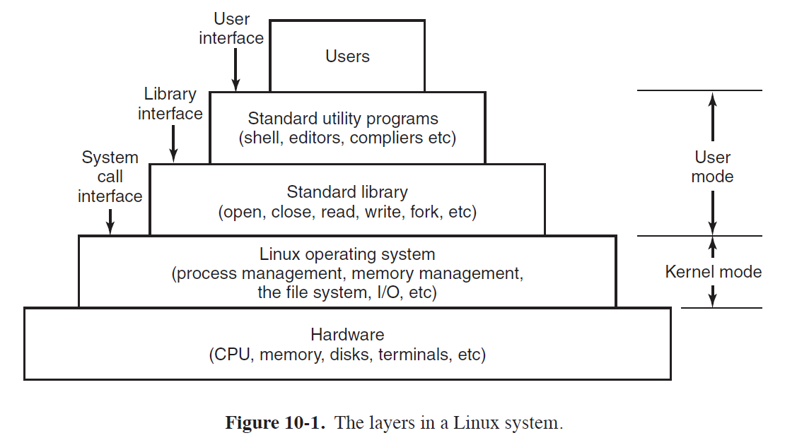
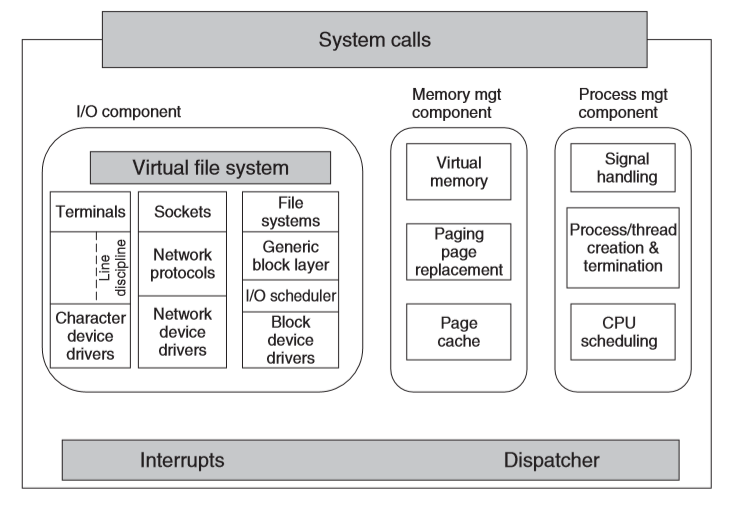
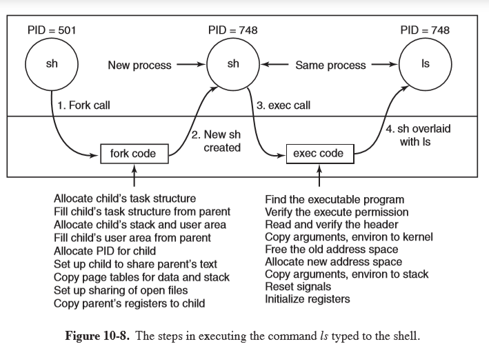
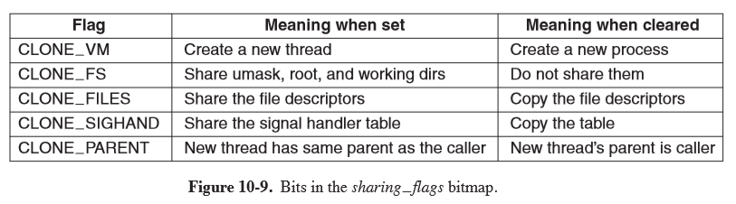
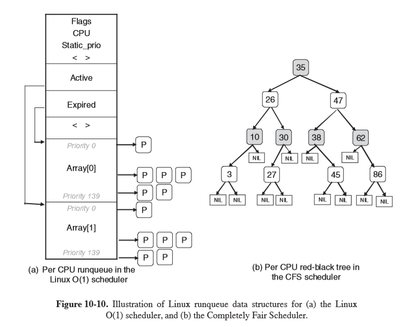
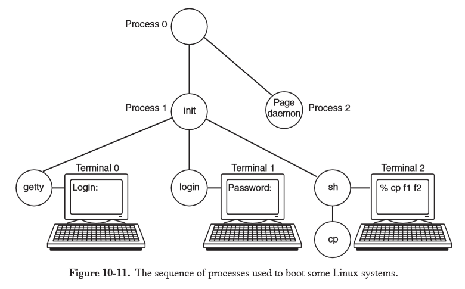

---
title: Unix, Linux, Android
notebook: Computer Systems
layout: note
date: 2020-07-07 22:51
tags: 
...

# Unix, Linux, Android

[TOC]: #

## Table of Contents
- [History](#history)
  - [MULTICS](#multics)
  - [PDP-11 UNIX](#pdp-11-unix)
  - [Portable UNIX](#portable-unix)
  - [Berkeley UNIX](#berkeley-unix)
  - [POSIX](#posix)
  - [MINIX](#minix)
  - [Linux](#linux)
- [Linux Overview](#linux-overview)
  - [Linux Goals](#linux-goals)
  - [Interfaces](#interfaces)
- [Kernel Structure](#kernel-structure)
  - [I/O Component](#io-component)
  - [Interdependence](#interdependence)
  - [System call interface](#system-call-interface)
- [Processes](#processes)
  - [Signals](#signals)
  - [Implementation](#implementation)
  - [Process Descriptor](#process-descriptor)
  - [Executing `ls`](#executing-ls)
  - [Kernel Threads and `clone`](#kernel-threads-and-clone)
- [Scheduling](#scheduling)
  - [Linux O(1) Scheduler](#linux-o1-scheduler)
  - [Completely Fair Scheduler (CFS)](#completely-fair-scheduler-cfs)
- [Boot Process](#boot-process)
  - [Dynamic Loading](#dynamic-loading)
  - [`init`](#init)


## History

### MULTICS

- 1940s-1950s: book time on a computer
- 1960s: batch systems where you leave your punched cards at the machine room
  - long delay between submitting and getting the output
  - debugging immensely difficult
- timesharing invented at Dartmouth College and MIT
- **MULTICS: Multiplexed Information and Computing Service**: developed by Bell Labs and GE, before
  Bell Labs pulled out
- Ken Thompson: Bell Labs researcher writes stripped-down MULTICS in assembly on a PDP-7
- Brian Kernighan referred to it as **UNICS (Uniplexed Information and Computing Service**,
  which eventually became UNIX

### PDP-11 UNIX

- UNIX was moved to PDP-11, which was a powerful machine and large memory, with
  memory-protection hardware, allowing multi-user support
- Thompson rewrote UNIX in high-level language he designed, B.  But it lacked structures
  making it insufficient.
- Dennis Ritchie designed successor C and a compiler
- Thompson and Ritchie then rewrite UNIX in C, publishing landmark paper
  [The UNIX Time-Sharing System](https://people.eecs.berkeley.edu/~brewer/cs262/unix.pdf) in 1974
- Bell Labs, owned by AT&T, as a regulated monopoly was not allowed to be in the
  computer business, so licensed UNIX to universities for a modest fee.  At the time,
  most universities had PDP-11s, and the OS that came with them was terrible, so
  UNIX came in at the right time.

### Portable UNIX

- porting UNIX to a new machine was made much simpler once it was written in C.
  The process involves:
  - writing a C compiler for the new machine
  - writing device drivers for the new machine's I/O devices
  - small amount of machine-dependent code for interrupt handlers/memory management in assembly
- processing of porting to an Interdata machine revealed lots of assumptions implicitly
  made by UNIX about integers being 16 bits, pointers, being 16 bits, etc.  UNIX
  had to be cleaned up to make it portable.
- a portable C compiler was implemented, allowing easy modification for any machine
  with moderate effort
- AT&T was broken up in 1984 by the US government, and accordingly established a computer
  subsidiary, releasing commercial UNIX product (System III/V)

### Berkeley UNIX

- source code for UNIX was available, so Berkeley heavily modified it, with funding
  from ARPA
- 4BSD (Fourth Berkeley software distribution) introduced many improvements
  - virtual memory and paging
  - longer file names
  - reimplemented file system with improved performance
  - increased signal handling reliability
  - introduced networking causing TCP/IP protocol stack to become de facto standard
    in UNIX world
- added a number of utility programs: `vi`, `csh`, Pascal and Lisp compilers, ...
- some vendors subsequently based their UNIX off Berkely UNIX rather than System V

### POSIX

[IEEE 1003.1-2017](https://ieeexplore.ieee.org/document/8277153)

- late 1980s: 4.3BSD and System V Release 3 were both in widespread use and were
  somewhat incompatible, with each vendor additionally complicating matters with
  their own non-standard enhancements
- prevented commercial success as software vendors could not package UNIX programs
  and guarantee that they would run on any system, as was the case with MS-DOS
- attempts were made to standardise, e.g. by AT&T issuing the SVID (System V Interface
  Definition), however this was only relevant to System V vendors and ignored by BSD
- IEEE Standards Board came together with industry, academia, and government to
  produce POSIX, a Portable Operating System, defined in standard 1003.1
- 1003.1 defines a set of library procedures that every conformant UNIX system must supply.
  Most procedures invoke a system call (e.g. `open, read, fork`), but some can be
  implemented outside the kernel
- as a result a vendor writing a program using only procedures defined by 1003.1
  knows that this program will run on every conformant UNIX system
- approach taken by IEEE was unusual in that it took the intersection of System V
  and BSD, rather than the union, such that 1003.1 looks lie a common ancestor of both
  OSs
- related documents standardise threads, utilities, networking, ...
- C has also been standardised by ISO/ANSI

### MINIX

- modern UNIX is large and complicated, the antithesis of the original conception of UNIX
- 1987: MINIX was produced as a UNIX-like system that was small enough to understand, with
  11,800 lines of C and 800 lines of assembly
- MINIX used microkernel design, providing minimal functionality in the kernel so that it
  is reliable and efficient.  Memory management and file system become user processes,
  while the kernel handles message passing between processes and not much else
  - Kernel: 1600 lines of code + 800 lines of assembler
  - I/O device drivers: 2900 lines of C, also in kernel
  - File system: 5100 lines of C
  - Memory manager: 2200 lines of C
- microkernels vs monolithic:
  - the former is easier to understand and maintain, with a highly modular structure
  - highly reliable: a crash of a user mode process does much less damage than a kernel-mode crash
  - lower performance due to extra switches between user/kernel mode
- 2004: direction of MINIX development changed to focus on building an extremely
  reliable and dependent system that could automatically repair faults
  - all device drivers were moved to user space, each running as a separate process
  - kernel was under 4000 lines of code
- has been ported to ARM, so it is available for embedded systems

### Linux

- many features were requested for MINIX but these were often denied due to the goal
  of keeping the system small
- 1991: Linus Torvalds wrote Linux as a UNIX clone, intending for it to be a full production system
  - monolithic, with the entire OS in the kernel
  - initially 9,300 lines of C + 950 lines of assembly
- 1994: v1.0, 165,000 lines of code
- 1996: v2.0, 470,000 lines of C, 8000 lines of assembly
- 2013: ~ 16 million lines of code
- version `A.B.C.D`:
  - `A`: kernel version
  - `B`: major version
  - `C`: minor revision, e.g. support for new drivers
  - `D`: minor bug fixes and security patches
- issued under GPL (GNU Public License), permitting you to use, copy, modify, and redistribute
  the source and binary code freely. All derivatives of the Linux kernel may not be sold/redistributed in binary form only,
  they must be shipped with source code
- 1992: Berkeley terminated BSD development, releasing 4.4BSD
  - FreeBSD was based off this
  - Berkeley issued software under an open source license
  - AT&T subsidiary sued Berkeley, keeping FreeBSD off the market for long enough
    for Linux to become well established
  - had this not happened, Linux would have an immature OS competing with mature
    and stable system

## Linux Overview

### Linux Goals

- UNIX: interactive system for multiple processes and multiple users, designed
  by programmers for programmers

#### Goals

- simplicity
- elegance
- consistency
- power
- flexibility
- avoid useless redundancy

#### Examples

- files should just be a collection of bytes, not with different classes
- principle of least surprise: e.g. `ls *A` and `rm *A` should be predictable and
- small number of basic elements should be able to be combined infinite ways as needed

### Interfaces

- operating system runs on bare hardware, controling the hardware and provides
  system calls interface to programs
- system calls allow users to create and manage processes, files, resources
- programs make system calls by putting arguments in registers and issuing trap
  instructions.  As there is no way to write a trap instruction in C, a standard library
  is provided with one procedure per system call
- standard library is written in assembly but can be called from C
- POSIX specifies the library interface, not the system call interface
- Linux also supplies standard programs, some of which are specified by 1003.2, which
  get invoked by the user



- GUIs are supported by X windowing system (X11/X), defining communication and
  display protocols for window manipulation on bitmap displays
- X server: controls devices and redirects I/O
- GUI environment built on top of low-level library `xlib` which contains functionality
  to interact with the X server
  - graphical interface extends functionality of X11 by enriching window view: e.g. buttons, menus, ...
  - `xterm`: terminal emulator program, providing basic command-line interface to OS

## Kernel Structure



- interrupt handlers: primary way of interacting with devices
- dispatching occurs as the result of an interrupt: code stops running process,
  saves its state and starts the appropriate driver
  - written in assembler

### I/O Component

- **I/O component**: responsible for interacting with devices, network, storage I/O operations
- I/O operations are integrated under a **Virtual File System (VFS)** layer
- at the low-level all I/O operations pass through a device driver
- drivers are either character/block-device, depending on whether they are random access
  or not, and network devices, while a form of character devices are sufficiently different
  to consider them a different category
- **character devices** used in 2 ways:
  - every keystroke: e.g. `vim`
  - line oriented: e.g. `bash`.  The character stream is passed through a line discipline
- **network devices**:
  - above network drivers is full functionality of hardware router
  - above routing code is protocol stack (including IP/TCP)
  - above this is the socket interface, allowing programs to create sockets
- **block devices**:
  - I/O scheduler orders/issues disk-operation requests per some system policy
  - file system: Linux has multiple file systems concurrently, so to abstract away
    architectural differences, a generic block-device layer is used by all file systems

### Interdependence

- 3 components are interdependent
- e.g. page caches may be used to hide latencies of accessing files: block device dependent on memory manager
- e.g. virtual memory relies on swap area: memory manager dependent on I/O

### System call interface

- all system calls come here, causing a trap which switches execution from user mode into
  protected kernel mode, passing control to one of the kernel components

## Processes

- each process runs a single program, starting with 1 thread of control
- **process group**: ancestors, siblings, descendants
- **daemon**: background process e.g. `cron` daemon for scheduling jobs
- created by `fork`
- **pipe**: channel for two processes to communicate, one process can write a stream
  of bytes for the other to read
  - when a process tries to read an empty pipe, the process is blocked until data is available
- **zombie state**: process exits, and parent has not waited for it.  When parent
  calls `wait` for it, the process terminates

### Signals

- **signal**: software interrupt for one process to send signal to another process
- processes catching signals must specify signal-handling procedure
- when a signal arries, control abruptly switches to the handler. After finishing,
  control returns to the previous location
- processes can only send signals to members of its **process group**
- `sigaction`: syscall for a process to announce signal-handler for a particular signal
- `kill`: syscall for a process to signal another related process
  - uncaught signals kill the recipient
- `alarm`: syscall for a process to be interrupted after a specific time interval with `SIGALRM`
- `pause`: suspends process until next signal arrives

### Implementation

- every process has a user part running the user program
- when a thread makes a syscall it traps to kernel mode and begins running in kernel
  context, with a different memory map, and full access to machine resources
- this is still the same thread, but with more power and its own kernel mode stack and program
  counter
- kernel represents any execution context (thread, process) as a **task** via `task_struct`,
  - multithreadd process has one task structure for each user level thread
- kernel is multithreaded, having kernel-level threads
  - executing kernel code
  - not associated with any user processes
- `task_struct`s are in memory for each process at all times, stored as a doubly linked list
- there is also a hashmap from PID to the address of the task structure for quick lookup.
  This uses chaining in case of collisions.

### Process Descriptor

- **scheduling parameters**: process priority, CPU time used, time sleeping
- **memory image**: pointers to text, data, stack, page tables
- **signals**: mask indicate which signals are caught/ignored/delivered
- **machine registers**: when a trap occurs, machine registers are stored ere
- **syscall state**: info about the current system call
- **file descriptor table**: table mapping between file descriptor and file's i-node
- **accounting**: keep track of CPU time used by the process
- **kernel stack**: fixed stack, for use by kernel part of process
- **miscellaneous**: process state, event being waited for, PID, parent PID, UID, GUID

### Executing `ls`



### Kernel Threads and `clone`

- kernel threads in Linux differ from the standard UNIX implementation
- in UNIX, processes are resource containers, and threads units of execution.  Processes
  contain 1+ threads, sharing address space, open files, signal handlers, alarms, ...
- `clone`: introduced in Linux in 2000, blurring the distinction between threads and processes,
  allowing parameters to be specified as process specific or thread specific
  
```c
pid = clone(function, stack_ptr, sharing_flags, arg);
```

Whether a `clone` call creates a new thread in the current process or in a new process
is dependent on `sharing_flags`, which is a bitmap allowing fine-grained control over what
gets shared.



- divergence from UNIX, meaning Linux code using `clone` is no longer portable to UNIX
- Linux stores in `task_struct` both the process identifier PID and task identifier TID
- when `clone` creates a new task sharing nothing with the creator, and PID is set to a new value
- otherwise `clone` creates a task receives a new TID but inherits the PID

## Scheduling

- As Linux threads are kernel threads, scheduling is based on threads, not processes
- runnable tasks are stored in the **runqueue**, associated with each CPU
- tasks which are not runnable are stored in the **waitqueue**
- 140 priority values:
  - 0: highest priority
  - 139: lowest priority
- 3 classes of threads:
  - **real-time FIFO**: highest priority 0-99, not preemptable except by a newly readied
    real-time FIFO thread with higher priority
  - **real-time round robin**: highest priority 0-99, preemptable by the clock, having
    an associated time quantum
  - **timesharing**: lower priority 100-139, conventional threads
- NB these are not actually real-time threads, in terms of a deadline guarantee.  The naming
  is for consistency with standards
- `nice(value)`: syscall to adjust static priority of a thread, where value ranges from -20 to +19

### Linux O(1) Scheduler

- historically popular scheduler, but the heuristics were complex and imperfect, producing
  poor performance for interactive tasks
- constant time to select/enqueue tasks
- the runqueue uses two arrays, active and expired, storing the heads of a linked list,
  each corresponding to 1 of 140 priority levels
- scheduler selects task from highest-priority list in active array
- after the task's quantum has expired, it is moved to the expired list, possibly with
  a different priority level
- a task that blocks is placed on the waitqueue until it is ready again, at which point
  it is enqueued on the active array
- when there are no more tasks in the active array, the pointers are swapped to make the
  expired array the active array
- higher priority levels are assigned higher quanta to get processes out of the kernel quickly
- interactivity heuristics: dynamic priority is continuously recalculated to reward interactive
  threads and punish CPU-hogging threads (-5 to +5 penalty)

### Completely Fair Scheduler (CFS)

- uses a red-black tree as the runqueue
- tasks are ordered based on amount of CPU time they have spent, `vruntime`, measured in
  nanoseconds
- left children have had less time on CPU and will be scheduled sooner than right children
- schedule the task which has had the least CPU time (typically left-most node)
- CFS periodically increments `vruntime` of the task, with the effective rate adjusted according to
  the task's priority: low priority tasks have time pass more quickly.  This avoids
  maintaining separate runqueues for different priorities
- selection of a node: constant time $O(1)$
- insertion of a node: $O(\log{n})$



## Boot Process

- BIOS performs Power-On-Self-Test (POST) and initial device discovery and initialisation
- [Master Boot Record](https://en.m.wikipedia.org/wiki/Master_boot_record) first
  sector of the boot disk, is read into a fixed memory location and executed
- execution of MBR program loads a standalone `boot` program from the boot device
- `boot` is then run
  - copies itself to a fixed high memory address, freeing low memory for the OS
  - reads root directory of the boot device
  - reads in OS kernel and jumps to it.  Kernel is running
- kernel start-up code is written in assembly, so is highly machine dependent
  - setting up kernel stack
  - identify CPU
  - calculate RAM present
  - disable interrupts
  - enable MMU
  - call C-language `main` procedure to start main part of the OS
- kernel data structures are allocated: page cache, page tables
- autoconfiguration: probe for present devices and add them to a table
  - device drivers can be loaded dynamically
- set up process 0, set up its stack, and run it
  - initialisation: e.g. program real-time clock
  - mount root file system
  - create `init` (process 1)
  - create `page` daemon (process 2)
- `init` checks if it is single/multiuser:
  - single: `fork` a process executing the shell, and wait for it to exit
  - multi:
    - `fork` a process that executes system initialisation shell script `/etc/rc`,
    - read `/etc/ttys` to list terminals and their properties
    - `fork` a copy of itself for each terminal, then execute `getty`
- if someone tries to login, `getty` executes `/bin/login`, which requests credentials
- if authenticated, `login` replaces itself with the shell



- terminal 0: `getty` is waiting for input
- terminal 1: user has typed login name, so `getty` has overwritten itself with `login`
- terminal 2: successful login has occurred, so `login` has replaced itself with `/bin/sh`,
  which has printed the prompt.  The user has typed `cp f1 f2`, causing the shell
  to `fork` off a child process executing `cp`.  The shell is blocked, waiting for the
  child to terminate.
  
### Dynamic Loading

- traditional UNIX: static linking of drivers
- dynamic loading allows you to ship a single binary for multiple configurations,
  with the system automatically loading the drivers it needs, possibly obtaining them
  over the network
- downside: this creates security vulnerabilities

### `init`

[Wiki: Init](https://en.m.wikipedia.org/wiki/Init)


