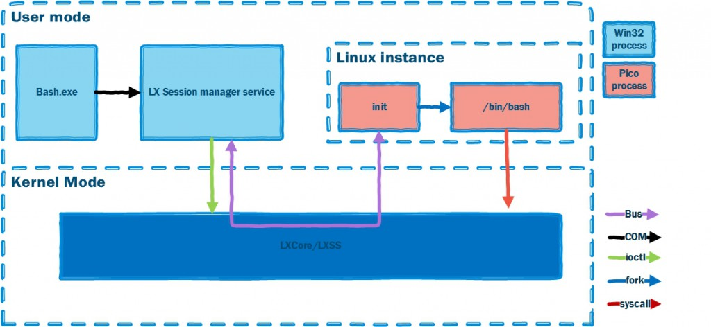
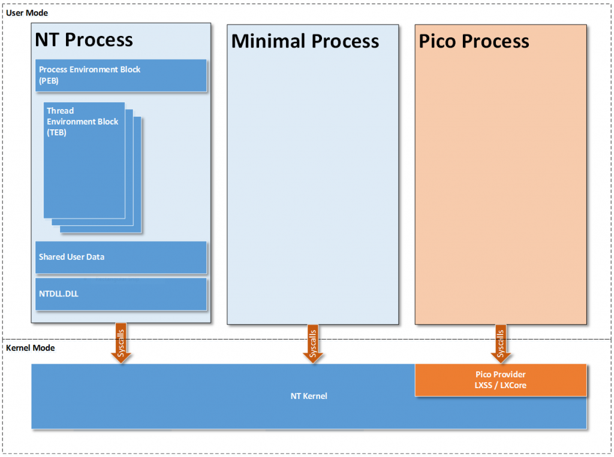

---
title: Windows Subsystem for Linux
notebook: Computer Systems
layout: note
date: 2020-07-08 11:51
tags: 
...

# Windows Subsystem for Linux

[TOC]: #

## Table of Contents
- [WSL Components (WSL1)](#wsl-components-wsl1)
- [Pico Processes](#pico-processes)

## WSL Components (WSL1)

[Microsoft Blog](https://docs.microsoft.com/en-us/archive/blogs/wsl/windows-subsystem-for-linux-overview)

- user mode session manager handling Linux instance lifecycle
- pico provider drivers (`lxss.sys`, `lxcore.sys`) which emulate Linux kernel
  - these drivers translate Linux syscalls into NT APIs, and are clean implementation
    of Linux-compatible kernel interfaces
  - when a syscall is made from an executable the NT kernel forwards the request to `lxcore.sys`
  - `lxcore.sys` translates this to equivalent NT call, which then executes it
  - if there is no mapping, the Windows kernel mode driver must service the request directly
- pico processes that host unmodified user mode Linux (e.g. `/bin/bash`)

## Pico Processes

[Microsoft Blog](https://docs.microsoft.com/en-us/archive/blogs/wsl/pico-process-overview)

- lightweight way to run an application in an isolated environment, decoupling
  the application's OS dependencies from the host OS
- approach: run target application and OS in user-mode address space of single
  process on host OS
- less resource overhead than running application and OS in VM
- in a __pico process__, host OS doesn't try to manage user-mode address space
  inside the process
- kernel-mode driver supports pico processes
- support in Windows kernel was implemented with two layers: minimal processes and pico processes

- __minimal process__: empty user-mode address space
  - has ended up being used for memory compression + virtualisation based security
- __pico process__: minimal process with associated pico provider kernel-mode driver
  to manage it

- Windows kernel passes all sys-calls/exceptions from user-mode of pico process to
  __pico provider__ to handle, meaning pico provider can do something different
  to Windows
- pico provider registers with Windows kernel during boot and exchange interfaces
  - e.g. function pointers for kernel to call when dispatching a user-mode sys-call
  - e.g. kernel provides function pointers for creating pico processes/threads
- pico provider still relies on Windows kernel for thread scheduling, memory management
  and I/O
