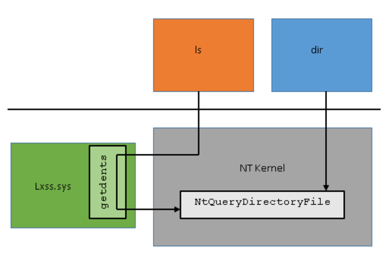
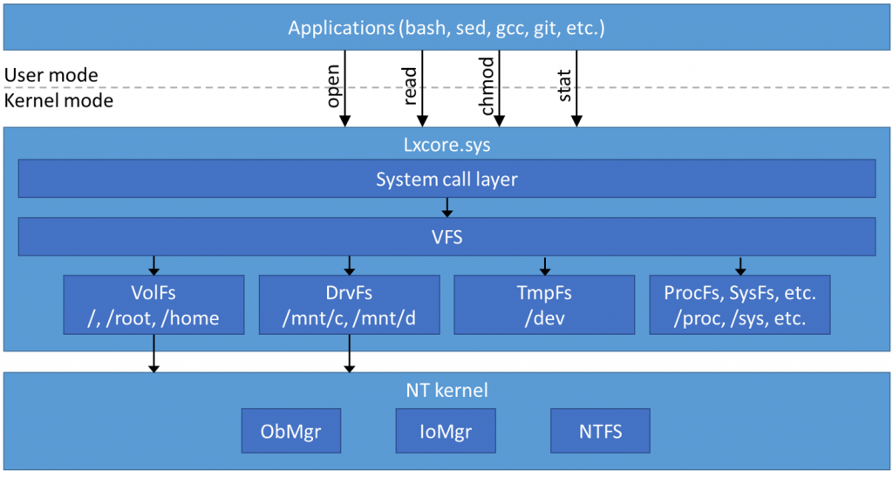

---
title: Windows Subsystem for Linux
notebook: Computer Systems
layout: note
date: 2020-07-08 11:51
tags: 
...

# Windows Subsystem for Linux

[TOC]: #

## Table of Contents
- [WSL Components (WSL1)](#wsl-components-wsl1)
- [Pico Processes](#pico-processes)
- [System Calls](#system-calls)
- [File System](#file-system)
  - [Linux File Systems](#linux-file-systems)
  - [Windows File Systems](#windows-file-systems)
  - [WSL File Systems](#wsl-file-systems)
  - [VolFs](#volfs)
  - [DrvFS](#drvfs)

## WSL Components (WSL1)

[Microsoft Blog](https://docs.microsoft.com/en-us/archive/blogs/wsl/windows-subsystem-for-linux-overview)

- user mode session manager handling Linux instance lifecycle
- pico provider drivers (`lxss.sys`, `lxcore.sys`) which emulate Linux kernel
  - these drivers translate Linux syscalls into NT APIs, and are clean implementation
    of Linux-compatible kernel interfaces
  - when a syscall is made from an executable the NT kernel forwards the request to `lxcore.sys`
  - `lxcore.sys` translates this to equivalent NT call, which then executes it
  - if there is no mapping, the Windows kernel mode driver must service the request directly
- pico processes that host unmodified user mode Linux (e.g. `/bin/bash`)

## Pico Processes

[Microsoft Blog](https://docs.microsoft.com/en-us/archive/blogs/wsl/pico-process-overview)

- lightweight way to run an application in an isolated environment, decoupling
  the application's OS dependencies from the host OS
- approach: run target application and OS in user-mode address space of single
  process on host OS
- less resource overhead than running application and OS in VM
- in a __pico process__, host OS doesn't try to manage user-mode address space
  inside the process
- kernel-mode driver supports pico processes
- support in Windows kernel was implemented with two layers: minimal processes and pico processes

- __minimal process__: empty user-mode address space
  - has ended up being used for memory compression + virtualisation based security
- __pico process__: minimal process with associated pico provider kernel-mode driver
  to manage it

- Windows kernel passes all sys-calls/exceptions from user-mode of pico process to
  __pico provider__ to handle, meaning pico provider can do something different
  to Windows
- pico provider registers with Windows kernel during boot and exchange interfaces
  - e.g. function pointers for kernel to call when dispatching a user-mode sys-call
  - e.g. kernel provides function pointers for creating pico processes/threads
- pico provider still relies on Windows kernel for thread scheduling, memory management
  and I/O

## System Calls

System calls are made by:

- marshalling parameters: moving parameters into CPU registers as defined by the
  ABI
- making the system call with a trap to transition to kernel mode to make the syscall
- return from the system call with another special instruction to return to user mode
- user mode checks the return value

This is fairly similar between Linux and NT kernels, however the ABI differs, and
syscalls don't typically map directly.

When a WSL process makes a syscall, the NT kernel recognises that it came from a pico
process, it maintains the register state and forwards the request to the pico driver.
The pico driver inspects the rax register to determine which syscall was being made,
and will then pass the parameters to the code to execute the syscall.  This will
likely issue an NT syscall. After the pico driver has handled the syscall it returns
to NT, which restores the registers, placing the return value in rax, and invokes
sysret instruction to return to user mode.

- Linux `sched_yield` maps one to one with `ZwYieldExecution`
- Linux pipes differ substantially from NT pipes, so WSL implements Linux pipes
  separately while relying on NT functionality for primitives (synchronisation, data
  structures)

## File System

[Microsoft Blog: WSL File System Support](https://docs.microsoft.com/en-us/archive/blogs/wsl/wsl-file-system-support)

### Linux File Systems

- Linux uses Virtual File System (VFS) to abstract away details of particular file systems,
  allowing multiple file systems to coexist, while using a single namespace to view
  all of these file systems
- file systems are mounted on different directories in the namespace
- VFS implements system calls for file system ops using data structures such as
  i-nodes, directory entries, and files
- **i-node**: represents information about a single file system object: file type,
  permissions, size, last modified, ...
  - on-disk data structures typically correspond directly to the i-node structure used
    by the Linux kernel
  - doesn't represent file name
- **directory entries**: VFS uses a directory entry cache to represent the file system namespae
  - `dentry`s are in memory, with no physical store, and contain a pointer to the inode for the file
  - e.g. the path `/home/user/foo` will have directory entries for home, user, and foo,
    each with a pointer to an i-node
- **special file types**: device files, FIFOs, sockets, symlinks
- `TmpFs`: used as temporary in-memory file system
- `ProcFs`, `SysFs`: provide access to kernel information about processes, devicers, drivers
  - file systems don't have a disk, network, or other device associated with them,
    and are virtualised by the kernel
  - e.g. `/proc`: window into the kernel's internal data structure: what processes are
    running, memory usage, etc.

### Windows File Systems

- all system resources are generalised as objects, including files, threads, timers, ...
- request to open a file goes through NT kernel's Object Manager, which routes the request
  through the I/O manager to the correct file system driver
- the interface that file system drivers implement in Windows is more generi,
  enforcing fewer requirements, e.g. no common i-node structure, no directory entry
- file system drivers e.g. `ntfs.sys` are responsible for resolving paths and opening
  file objects
- drive letters like `C:` are a Win32 construct.  The Object Manager keeps a namespace
  similar to the Linux file system namespace, rooted at `\`, with file system
  volumes represented by device objects with paths like `\Device\HarddiskVolume1`
- when opening a file `C:\foo\bar`, Win32 `CreateFile` call translates this to NT path `\DosDevice\C:\foo\bar`,
  with `\DosDevice\C:` symlinked to `\Device\HarddiskVolume4`, so the real path would then
  be `\Device\HarddiskVolume4\foo\bar`
- the Object Manager resolves each component in the path similar to Linux, until it encounters
  the device object.  It then forwards the request to the I/O manager, whih creates
  an I/O Request Packet (IRP) with the remaining path, which is sent to the file system
  driver for the device
- when a file is opened, the object manager creates a file object: instead of file descriptors,
  the object manager provides handles, which can refer to any object (not just files)
- when you make the syscall `NtReadFile`, the I/O manager creates an IRP to send to the file system driver
  for the file object
- Windows/NTFS support case sensitivity, but by default it is disabled

### WSL File Systems

WSL must perform the following file system functions:

- translate Linux file system operations into NT kernel operations
- provide place where Linux system files can exist, with all Linux functionality
  such as permissions, symlinks, ...
- provide access to Windows volumes
- provide special file systems (e.g. `ProcFs`)

To do this, WSL has a VFS component to provide similar functionality as the Linux VFS.
When a syscall is made, it gets handled by the syscall layer: file-related syscalls
get forwarded to VFS.

- for operations using paths (`open, stat`), VFS resolves the path with the directory
  entry cache
- if the entry isn't in the cache, it calls a file system plugin to create an i-node
  for the entry
- when a file is opened, VFS uses the file system's i-node open operation to create
  a file object, returning a file descriptor for it
- VFS defines different file system plugins: VolFs, DrvFs, ProcFs

### VolFs

- VolFS: primary file system used by WSL, storing Linux system files, and content
  of home directory, supporting most Linux VFS features: permissions, symlinks, device files, ...
- `%LocalAppData%\lxss\rootfs%`: backing storage, one of the mount points
- NTFS has extended attributes: these are used to add additional metadata for Linux i-nodes
  that NTFS files don't ordinarily have: mode, owner (UID, GID), ...
- other attributes are derived from NTFS metadata
- if you were to copy a file to one of the VolFs mount points, it wouldn't have
  the extended attributes, and as a result would be ignored by VolFs

### DrvFS

- facilitates interoperability with Windows
- WSL automatically mounts all fixed NTFS drives under `/mnt` e.g. `/mnt/c`
- DrvFs adheres to Windows rules: Windows permissions are used, only legal NTFS file names
  are allowed, and special file types are not supported
- Windows uses ACLs for complex access rules, while Linux uses simple permissions:
  a file allows read, write, execute access to the owner of the file, the group, or everyone

