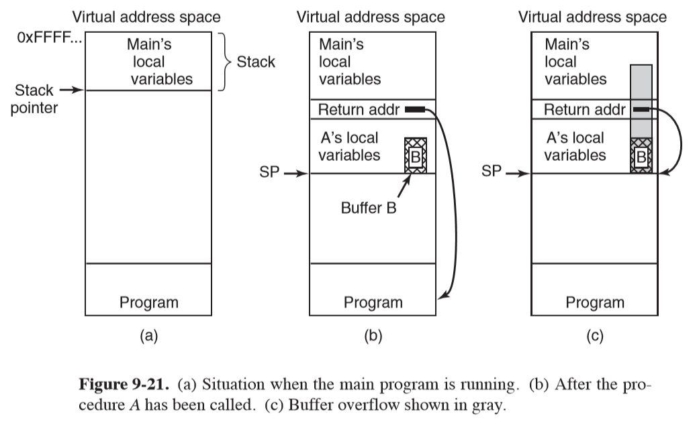
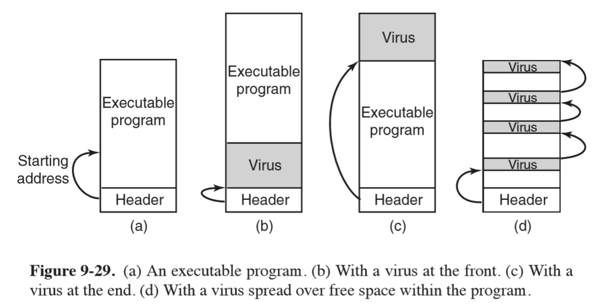
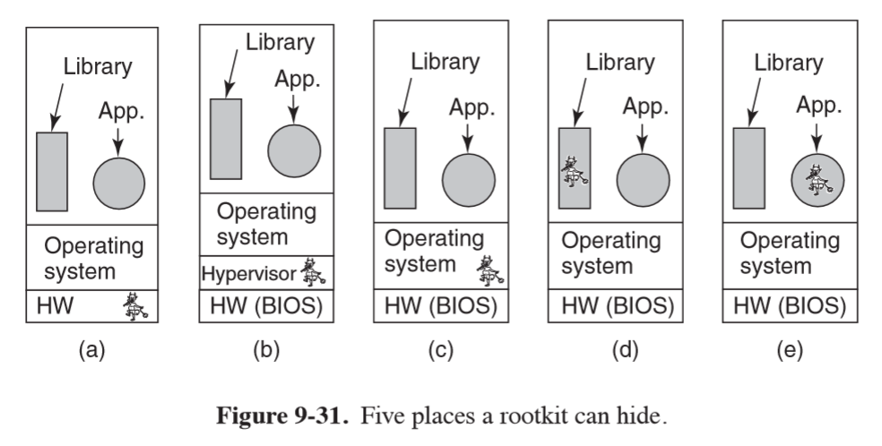

---
title: Attacks
notebook: Computer Systems
layout: note
date: 2020-07-12 21:51
tags: 
...

# Software Exploits

[TOC]: #

## Table of Contents
- [Buffer Overflow Attacks](#buffer-overflow-attacks)
  - [Data execution prevention](#data-execution-prevention)
  - [Code Reuse Attack](#code-reuse-attack)
  - [Non-control flow diverting attacks](#non-control-flow-diverting-attacks)
- [Format-string attacks](#format-string-attacks)
- [Dangling Pointers](#dangling-pointers)
- [Null Pointer Dereference Attacks](#null-pointer-dereference-attacks)
- [Integer Overflow Attacks](#integer-overflow-attacks)
- [Command Injection Attack](#command-injection-attack)
- [Time of Check to Time of Use](#time-of-check-to-time-of-use)
- [Logic Bomb](#logic-bomb)
- [Back Door](#back-door)
- [Login spoofing](#login-spoofing)
- [Viruses](#viruses)
  - [Companion virus](#companion-virus)
  - [Executable Program Virus](#executable-program-virus)
  - [Memory Resident Virus](#memory-resident-virus)
  - [Boot sector viruses](#boot-sector-viruses)
  - [Device Driver viruses](#device-driver-viruses)
  - [Macro Viruses](#macro-viruses)
  - [Source code viruses](#source-code-viruses)
  - [Spyware](#spyware)
- [Rootkit](#rootkit)


## Buffer Overflow Attacks

C/C++ is used for most systems programs and operating systems, but the compilers
don't check array bounds.

- `gets` reads a string of unknown size into a fixed size buffer with no check
  for overflow, and is notorious for buffer overflow exploits
- if `gets` was used to get user input, say, and the user inputs more characters
  than the buffer could hold, the extra characters would write into the stack,
  and could overwrite the return address of a function
- if this was not malicious, it would likely result in an invalid memory address being
  referenced, and the process would crash
- **shellcode**: if this was malicious, the attacker could make the return address point to a location
  inside the buffer, having filled the buffer with machine instructions.  This will
  make the process execute whatever the attacker wants, and could be used for an `exec`
  to launch a shell.  The attacker then has access to the system.



- **nop sled**: if the attacker doesn't exactly know where the shellcode resides,
  they can prepend the shellcode with a sequence of one-byte `NO OPERATION` instructions
  that do nothing, such that execution will eventually reach the real shellcode
  - works on both stack and heap
- **stack canary**: defence against buffer overflow attacks.  The compiler inserts
  code to save a random canary value on the stack just below a return address.  When
  returning from a function, the compiler inserts code to check the value of the canary.
  If the value has changed, something has gone wrong.
- any function pointer that is reachable via an overflow is fair game for an attack

### Data execution prevention

- **data execution prevention**: prevent code injection attacks by distinguishing
  between executable and non-executable code
- CPUs typically have an **NX bit (no execute)**. In AMD64, this is the most significant bit of the page table entry.
  This means you can set the NX bit for a page representing the stack/data, and have the bit 0 for pages
  of text.
- **W^X: W XOR X**: data segment is writable, not executable; text segment is executable, not writable

### Code Reuse Attack

- attacker constructs functionality from existing functions and instructions in binaries/libraries
- **return to libc**: most C programs are linked with the library `libc`, which contains
  `system`, allowing execution of arbitrary commands. The attacker can simply place
  the command as a string on the stack, and divert control to the `system` function via
  the return address
- **return-oriented programming (ROP)**: attacker returns to any instruction in the text segment,
  By locating small sequences of instructions that do something useful and end with
  a return instruction, the attacker can string them together to form a **gadget**
  - gadgets provide a sort of instruction set that can then be used to build arbitrary
    functionality
  - automated tools: gadget harvesters, ROP compilers
- **address-space layout randomisation**: defence against code reuse attacks by randomising
  the positions of the initial stack, the heap, and libraries each time a program is run, making
  it much harder for the attacker to exploit the system
  - often ASLR isn't random enough: code found at fixed locations, or weak randomisation, allowing
    brute force attacks
- **memory disclosure**: initial attack to leak information about memory layout, to facilitate
  a second attack.  Typically only need to determine the address of a single function,
  as other functions will be consistently offset from this position

### Non-control flow diverting attacks

- data itself can be a target for the attacker: e.g. an authorisation check.
  A buffer overflow could overwrite the value of the authorisation variable in the stack,
  leading to secret information being leaked to an unauthorised user

## Format-string attacks

- `printf` has a mechanism to write to memory: the `%n` specifier in a format string
  calculates how many characters should have been output at the place it appears
  in the string and stores it in the next argument 

```c 
int main(int argc, char **argv) {
    int i = 0;
    printf("Hello %nworld\n", &i);
    printf("i=%d\n", i);
}
// outputs:
// Hello World!
// 6
```

- if the next argument is omitted, it will be assumed that the next value on the stack is
  the next parameter
- in a lazy implementation of `printf` where a format string is not specified but the parameter
  is dependent on user input, an attacker can place a cleverly crafted format string
  to modify the return value and get the program to execute arbitrary code

## Dangling Pointers

- `malloc` is used to allocate memory on the heap, which is then `free`ed after use
- dangling pointer: program accidentally uses memory that has already been freed
- after you `free`, the pointer still points to the same address
- the attacker can perform **heap feng shui** to place a specific heap object in memory
  such that the dangling pointer is pointing to interesting information - allowing
  information leakage

## Null Pointer Dereference Attacks

- in Linux, the kernel is mapped into every process' address space
- a buggy kernel may dereference a `NULL` pointer, taking down the entire system
- if the attacker can trigger this from a user process, they can take the system down
  at will
- however the crash happens before there is no code mapped at page 0: using `mmap`,
  the user process can ask the kernel to map memory at address 0, writing shellcode
  in this page.  The attacker then triggers the null pointer dereference, causing
  shellcode to be executed with kernel privileges
- modern kernels prevent this
- note that similar bugs may allow attacker to inject their own pointer into the kernel
  and have it dereferenced

## Integer Overflow Attacks

- C programs overflow silently: if undetected this can be turned into an attack
- e.g. a graphics program accepting command line arguments could be passed two very
  large values for image height and width, resulting in an overflow.  This could produce
  a `malloc` of a small buffer, opening the door to a buffer overflow attack

## Command Injection Attack

- get target program to execute commands without realising it is doing so

```c 
printf("enter destination: ");
gets(dst);
strcat(cmd, dst);
system(cmd);
```

- if the user inputs "xyz; rm -rf /" they can wipe all files on the system

## Time of Check to Time of Use

- exploits race conditions

```c
int fd;
if (access("./my_document", W_OK) != 0) {
    exit(1);
}

fd = open("./my_document", O_WRONLY);
write(fd, user_input, sizeof(user_input));
```

- e.g. use of `access` system call: just after the access check, the attacker creates
  a symlink with the same file name to the password file.  `open` ends up opening the
  symlink, and the `write` is applied to the password file
- issue: `access` syscall isn't safe because its vulnerable to these race attacks
- instead open the file first, then check permissions using `fstat`
  - the file descriptor cannot be changed between `fstat` and `write`

- designing a robust API for operating systems is hard

# Insider Attacks

- executed by developers of the software, with specialised knowledge/access

## Logic Bomb

- have some negative effect under some condition, say if employee is fired e.g. clear disk, erase files
- e.g. Spafford 1989: logic bomb checked the payroll.  If the personnel number of the
  programmer didn't appear in it for 2 consecutive payroll periods it went off

## Back Door

- code inserted into the system by system programmer to bypass normal check
- code reviews/open source are a good way to prevent backdoors

## Login spoofing

- collect usernames/passwords by providing fake login screen
- defend with a key combination user programs cannot catch: this is why
  Windows uses `CTRL-ALT-DEL` to start login screen

# Malware

- malicious software

- **trojan horse**: user voluntarily downloads and installs a useful program
  that also installs malware

## Viruses

- **virus**: program that can reproduce itself by attaching its code to another program
  - can do other things, other than reproducing itself
  - **worm**: similar to virus, but self-replicating
  - typically written in C/assembler to be small and efficient

### Companion virus

- doesn't infect a program, but gets to run when the program is supposed to run
- e.g. when a user types `prog` in the command line, MS-DOS first looks for `prog.com`.
  If this isn't found, it looks for `prog.exe`.  `.com` files became very rare: attacker
  can release a virus `prog.com`, such that it will execute whenever the user tries to
  execute `prog`, and will typically do what it needs to, then executes `prog.exe`
  such that the user is none the wiser
- similarly, Windows Desktop shortcuts are symlinks: a virus can change the target
  of the shortcut to make it point to the virus

### Executable Program Virus

- virus that infects executable program
- **overwriting virus**: simple version that walks the tree and overwrite any binary with a copy of the virus
  - could be written in assembly-code for MS-DOS in 44 bytes when assembled
  - the same logic can also be used by antivirus programs to hunt down infected programs
    in order to remove the virus
  - easy to detect
- **parasitic virus**: attach themselves to the front, back, or throughout an executable
  program
  - attaching to the front is hard because the virus will have to relocate the program
    it has moved, so attaching to the end is more common
- **cavity virus**: executable program formats (e.g. `.exe`) allow a program to have multiple text
  and data segments.  The loader assembles them and relocates them on the fly.
  In Windows, all segments are multiples of 512 bytes.  Segments that aren't full
  get filled out with 0s: viruses can use this to try to hide in the holes. The
  virus may be able to fit in the program with no change in file size



### Memory Resident Virus

- stays in RAM all the time, hiding at the very top of memory or down among interrupt vectors
- typically will capture a trap/interrupt vector by copying the contents to a scratch variable
  and putting its own address there, directing he trap/interrupt to it
- this allows the virus to run in kernel mode on every system call,
- e.g. when an `exec` system call is made, the virus can infect the binary
- doesn't produce lots of disk activity
- potential for spying on data

### Boot sector viruses

- copies true boot sector to safe place on disk, allowing it to boot when the operating
  system is finished
- when the computer boots, the virus copies itself to RAM: at this point the machine is
  in kernel mode with MMU off, no operating system, no antivirus: the virus can do whatever
  it wants

### Device Driver viruses

- make the OS load the virus officially, by infecting a device driver
- device drivers also run in kernel mode

### Macro Viruses

- e.g. Word/Excel macros with arbitrary programs

### Source code viruses

- virus looks for source code, parses it, and adds:

```c
#include <virus.h>

run_virus()
```

### Spyware

- hides, collects data about the user, communicates this back to the distant master,
  and tries to survive attempts to remove it
- additionally may change settings
- used for marketing, surveillance, creating zombie for use in a botnet
- spreads as Trojans, drive-by-downloads, infected toolbars

## Rootkit

- **rootkit**: set of program/files that attempts to conceal its existence, even
  in the face of determined efforts by the owner of the machine to locate/remove it.
  Usually contains malware as well



- **firmware rootkit**: could hide by reflashing BIOS.  Not observed in the wild
- **hypervisor rootkit**: run entire OS and all applications in a VM under its control
  - **blue pill**: proof-of-concept 2006
  - modifies boot sequence to execute hypervisor on bare hardware, then starts OS
    in VM
- **kernel rootkit**: most common; infects OS and hides in it as a device driver/loadable
  module
- **library rootkit**: hides in system library e.g. `libc`, allowing malware to inspect
  arguments/return values of system calls
- **application roootkit**: hidden inside large application, typically one that creates
  many files while running.  The new files can be used to hide things, and noone
  notices that they exit

- hard to detect when you cannot trust hardware, OS, libraries, applications
  - use external trusted medium (boot disk)
  - compare software hashes
- **Sony rootkit**: 2005, Sony released audio CDs including a rootkit.  `autorun.inf`
  silently installed a 12-MB rootkit, with the goal of stopping music piracy.  The software
  would display a license agreement, then check if any copy programs were running,
  then would prevent access unless the programs were stopped.  The rootkit was difficult
  to uninstall


