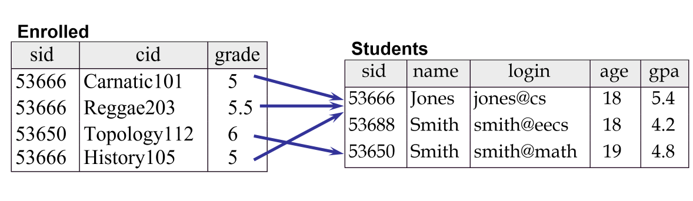

---
title: Subject Intro
notebook: Database Systems
layout: note
date: 2020-03-03 12:03
tags: 
...

# Subject Intro

[TOC]: #

## Table of Contents
- [Metadata](#metadata)
- [Databases and DBMS](#databases-and-dbms)
- [File-based systems](#file-based-systems)

- data: raw stored facts
- information: data presented in context; summarise; processed to increase user
  knowledge

## Metadata

- data about data to provide consistency and meaning
- structures + rules + constraints
- *data dictionary*: defines data description, type, size

## Databases and DBMS

- *database*: large, integrated, structure collection of data
  - e.g. university comprises:
    - entities: e.g. courses, subjects, professors (_rectangles_ in DB schema)
    - relationships: e.g. enrollment, teaching (_arrows_ in DB schema)
- *database management system (DBMS)*: software system to store, manage, facilitate
  database access

## File-based systems
- *without a database* you use file-based system
  - program-data dependence
    - if file structure changes, program does too
  - data duplication
  - limited data sharing: data tied to application
  - slow development with program implementing low-level data management
  - increased program maintenance: ~80% of dev time for file based systems is
    tied up in maintenance
- *with a database*
  - manage data in structured way
  - relational model dominant
    - rows and columns form relations
    - keys, foreign keys link relations
 

 ### Advantages of a Database

- **data independence**:
  - separation of data from program
  - central data repository, centrally managed
- **minimal data redundancy**:
  - redundancy can be controlled
- **improved data consistency**:
  - single store with definitive data dictionary: no disagreements, update
    problems
- **improved data sharing**:
  - data can be shared as a corporate resource e.g. for business insights
  - external users can be granted access
  - arbitrary views of data
- **reduced program maintenance**:
  - data structure can change without application changing
- **ad hoc data access without programming**: SQL

