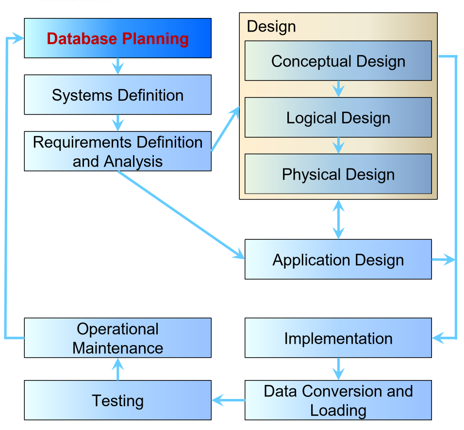

---
title: Database Development Process
notebook: Database Systems
layout: note
date: 2020-03-05 16:12
tags: 
...

# Database Development Process

[TOC]: #

Example: producing an enterprise database for an investment bank

- planning:
  - how does enterprise work
  - produce an enterprise data model at a high level
- systems definition:
  - scope and boundaries: users, application areas
- requirements definition and analysis
  - produce model of data in the database
  - 
