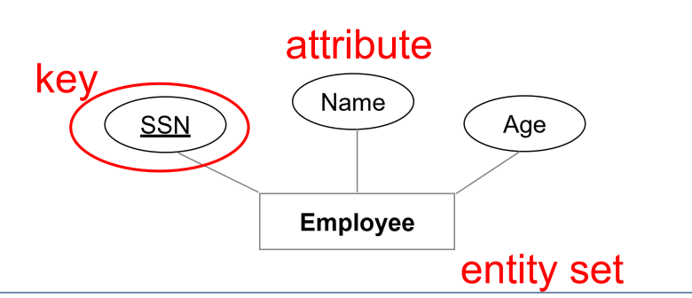
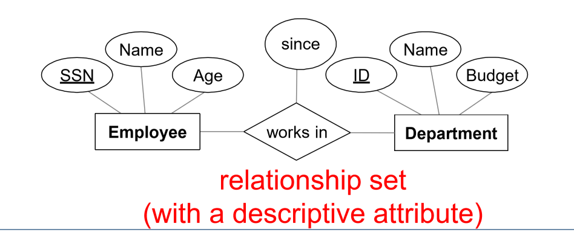
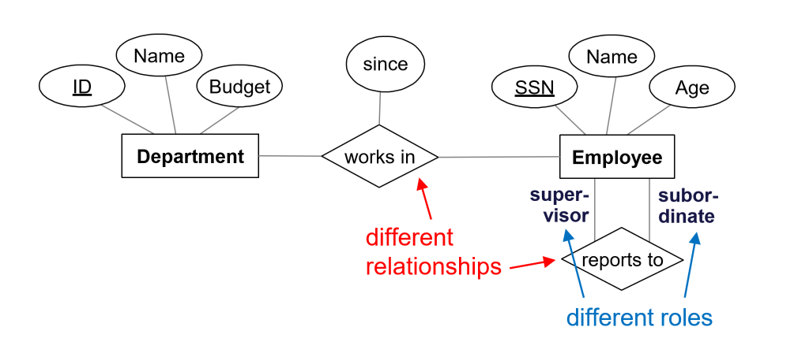
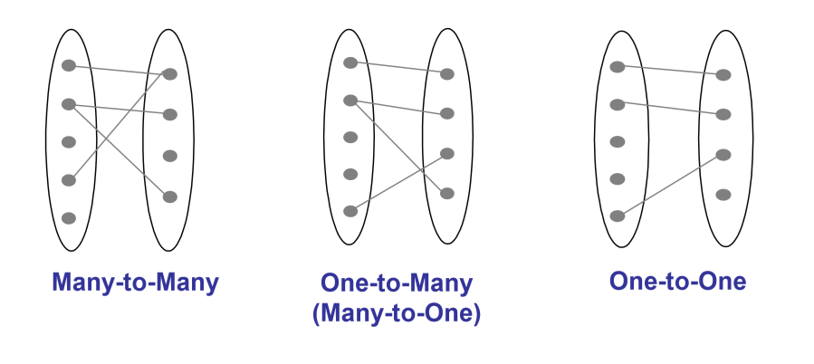
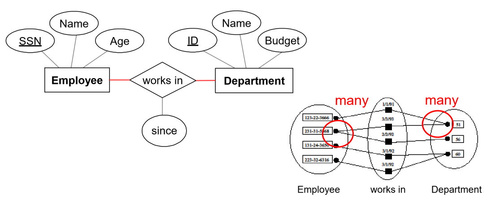
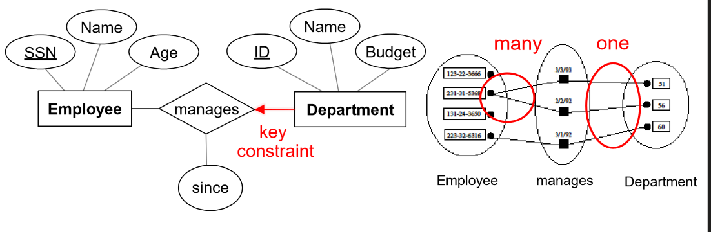
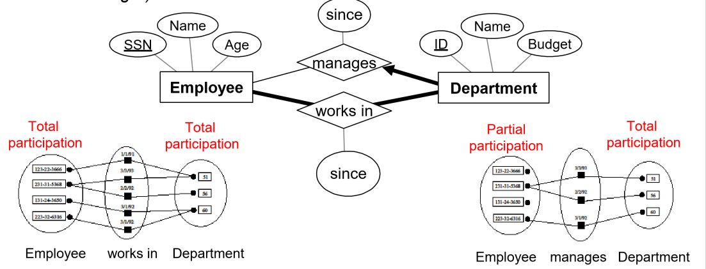

---
title: Conceptual Design
notebook: Database Systems
layout: note
date: 2020-03-10 12:04
tags: 
...

# Conceptual Design

[TOC]: #

## Table of Contents
- [Objectives of Conceptual design](#objectives-of-conceptual-design)
- [Entities and Relationships](#entities-and-relationships)
- [Constraints](#constraints)
  - [Special attribute](#special-attribute)
- [Conceptual Design [todo]](#conceptual-design-todo)

[ ] Ch 2 R&G

## Objectives of Conceptual design

- identify **entities** and **relationships**
- identify **information** to store about entities and relationships
- identify **integrity constraints**

## Entities and Relationships
- **entity**: real-world object distinguishable  from other objects
- **entity set**: collection of entities of the same type
  - need not be disjoint
  - set of $n$-tuples: $\{(e_1, \ldots, e_n) | e_1 \in E_1, \ldots, e_n \in E_n\}$
  - each $n$-tuple involves $n$ entities $e_i$ in entity set $E_i$
- **attributes**: describe each entity in a given entity set

- **relationship**: association among two or more entities
  - can have their own attributes
  - e.g. Fred _works_ in pharmacy department
- **relationship set**: collection of relationships of the same type
  - e.g. employees _work in_ departments
  - instance of relationship set: snapshot of relationship set in time

- same entity set can participate in
  - different relationship sets
  - different roles in the same set

- **entity-relationship (ER) data model**: tools to move from informal user needs to precise description
  that can be implemented

## Constraints

- **key constraints**: determine number of objects taking part in relationship set
  - specifies _upper bound_, i.e. _many_ implies you could have 0 relationships to more than 1
  - one of:

- **many-to-many**: employee can work in _many_ departments; a department can have _many_ employees
  - represented by a line

- **one-to-many**: single entity per relationship
  - represented by an arrow
  - e.g. each department has _at most one_ manager

- **one-to-one**: e.g. each employee can manage at most one department

- **participation constraint**: do all entities of an entity set take part in a particular relationship?
  - **total participation**: every entity must take part in _at least 1_ relationship
    - represented by a _bold line_
  - **partial participation**: otherwise
  - e.g. every employee must work in a department.  each department has at least one employee
    each department has to have a manager (but not everyone is a manager)

- **weak entity**: uniquely identified by considering primary key of an owner entity
  - represented as _bold rectangle_
  - owner entity set and weak entity set must participate in a relationship where
    each weak entity has exactly one strong entity to depend on
- **partial key** uniquely identifies weak entity when considering primary key of owner entity
  - represented with _dashed underline_

- **ternary relationships** [TODO]

### Special attribute

- **multi-valued attributed**: multiple values of same type
  - e.g. employee home phone and work phone numbers
  - represented with _oval with double border_
- **composite attributes**: hidden structure, each element having different type
  - e.g. employee address composed of postcode, street name, street number

## Conceptual Design [todo]

- 