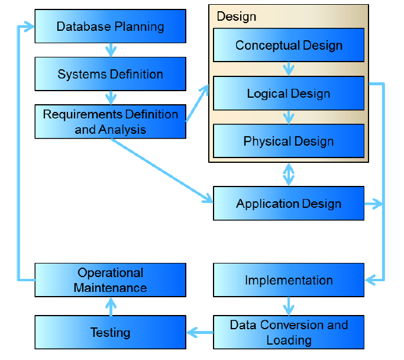

---
title: Tutorial Week 2
notebook: 
layout: note
date: 2020-03-11 14:09
tags: 
...

# Tutorial Week 2

[TOC]: #

## Table of Contents
- [Extra: Ramakrishnan 2.1](#extra-ramakrishnan-21)

1. The diagram above shows the stages of the Database Development Lifecycle.
    1. What is the purpose of each stage and what do we, as database designers, need to do in each stage?
        - **Database planning:** project management; understanding the enterprise and enterprise data model
          from a very high level
        - **Systems definition:** specify the scope and boundaries, how the system will interface with other
          organisational systems
        - **Requirements definition and analysis:** perspectives; understanding user needs, existing infrastructure,
          the nature and volume of the data to be stored, what operations are most frequent, what is performance
          critical.
          - business rules between entities; constraints
          - discussions with users, assessment of existing documentation
        - **Conceptual design:** construct concept model of data in the database independent of physical implementation.
          Typically includes forming Entity-Relationship diagrams
          - **semantic** data models
          - simple description of data that closely matches how users and developers think of data
          - facilitates discussion with end users while providing something sufficiently precise to progress
        - Logical design: construct **relational model** based on concept model; independent of physical implementation
          [TODO: differentiate from conceptual]
        - Physical design: description of implementation of logical design for specific DBMS, describing basic relations, data types,
          file organisation, indexes
        - Application design: in conjunction with database design; involves interface and applications
          that use and process the database
        - Implementation: creating database e.g. implementing database tables
        - Data conversion and loading: importing, cleaning, validating data from other sources
        - Testing: running database, finding errors, ensuring performance requirements, robustness etc.
        - Operational maintenance: monitoring and maintaining the database, handling new and changing requirements
    1. Describe the tasks that are performed in the conceptual design stage to generate a conceptual model.
    1. How do you refine a conceptual model to convert it to a logical model (Relational)?
    1. What must be done to transform a logical model to a physical model (Relational)?

2. Consider the following case study:

    _A cinema chain operates a number of cinemas. Each cinema has several screens, numbered starting from 1. The chain keeps track of the size (in feet) and seating capacity of every screen, as well as whether the screen offers the Gold Class experience.
    The cinema chain owns hundreds of movie projectors – both film projectors (16 mm and 35 mm) and digital projectors (2D and 3D). The chain stores key information about each projector, namely its serial number, model number, resolution and hours of use. Each movie screen has space for a single projector; technicians must be able to identify which screen each projector is currently projecting onto.
    A wide range of movies are shown at these cinemas. The system should keep track of the last time a movie was shown on a particular screen. The marketing department needs to know the movie’s title and year of release, along with the movie’s rating (G, PG, M, MA15+ or R18+).
    Each cinema has a numeric ID, name and address. For cinemas that are not owned outright, the business also keeps track of yearly rent. The system needs to be able to generate weekly activity reports for the chain’s chief operating officer._

    1. Identify the entities.
      - cinema
      - screen
      - projectors
      - movie
      - screening
      - likely also to be tickets/orders
    1. Identify the business rules.
      -
    1. For any three identified entities, list the attributes.
      - cinema:
        - ID
        - Name
        - Address
        - Rent
      - projector
        - serial number
        - model number
        - hours of use
        - type (film/digital)
        - resolution
      - screen
        - size
        - seats
        - class
      - movie
        - release date
        - title
        - rating

### Extra: Ramakrishnan 2.1

Brief descriptions of each of the following terms:
- **Attribute:** an attribute is a property of an entity (or relationship)
- **Domain:** the set of possible values of an attribute
- **Entity:** an object distinguishable from another object
- **Relationship:** an association between multiple entities
- **Entity set:** set of similar entities that share the same attributes
- **Relationship set:** set of similar relationships
- **One-to-many relationship:** key constraint that indicates one entity can be associated with many of a different entity e.g. employee can work for only one department, departments have many employees
- **Many-to-many relationship:** key constraint that indicates many entities of one type can be associated
  with many of a different entity e.g. a student can register for many classes, any class can have many students
- **Participation constraint:** a constraint indicating the number of entities participating in a relationship; whether a relationship must involve certain entities
  - **total participation:** every entity must participate in a relationship e.g. each department must have a head;
  - **partial participation:** otherwise; e.g. each specialty may have a subject matter expert
- **Overlap constraint:** determines whether two subclasses can contain the same entity
  - consider employee subclasses:** e.g. salaried employee cannot also be hourly; but salaried employee can be a senior employee
- **Covering constraint:** determines if entities in the subclass collectively include all entities in the superclass
  - e.g. a car superclass must be fully covered by all subclass makes of car; car make A and car make B cover cars
- **Weak entity set:** entities uniquely identified by some of its attributes in combination with an owner key e.g. dependents on an employee health plan
- **Aggregation:** used to model relationships between relationships, such that one relationship set participates in another relationship set, indicated with a dashed box around the aggregation
- **Role indicator:** used when entity play more than one role; role indicators describe the different purpose in the relationship e.g. employee entity set has ReportsTo relation with supervisors and subordinates