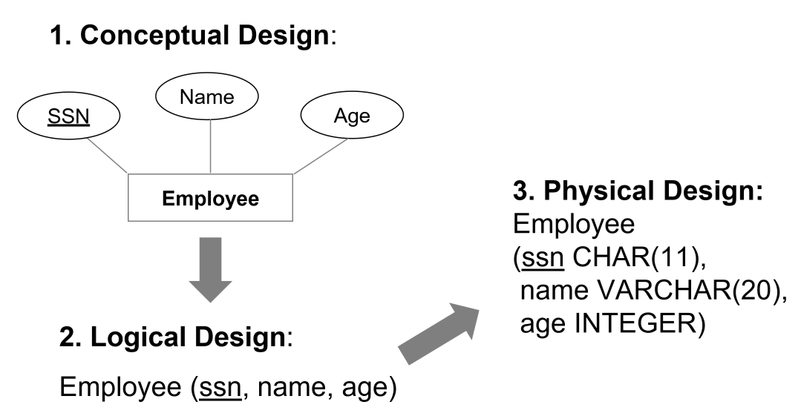
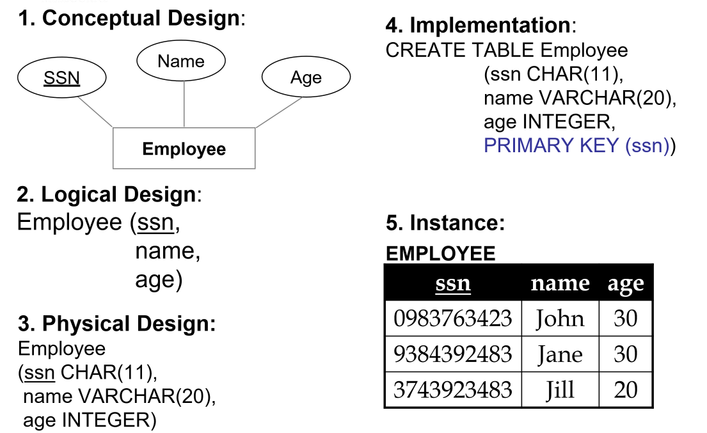
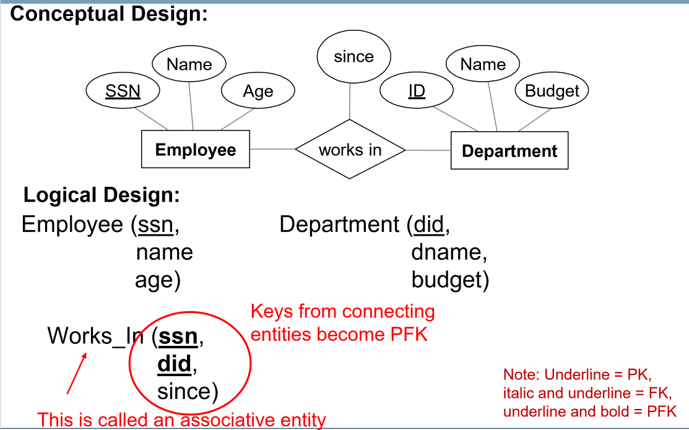

---
title: Relational Models
notebook: Datbase Systems
layout: note
date: 2020-03-12 16:22
tags: 
...

# Relational Models

[TOC]: #

## Table of Contents
- [Definitions](#definitions)
- [Keys](#keys)
- [Logical Design](#logical-design)
  - [Multi-valued Attributes](#multi-valued-attributes)
  - [Composite Attributes](#composite-attributes)
  - [Many-to-many relationships](#many-to-many-relationships)
  - [Ternary Relationships](#ternary-relationships)

## Definitions
- **data model**: transforms real world objects into structures a computer can store
  - many approaches: relational, ER, object-oriented, network, hierarchical, ...
- **relational model**:
  - rows (Tuples/records)
  - columns (attributes/fields)
  - primary keys and foreign keys to link relations
- **relational database**: set of relations
- **relation**: consists of schema + instance
  - **schema**: name of relation plus name and type of each attribute
  - **instance**: **table** with rows and columns
    - **cardinality**: number of rows
    - **degree/arity**: number of fields
  - consider relation a _set of rows/tuples_
  - all rows are **distinct and unordered**
- logical design: **entity set $\rarrow$ relation**
- physical design: select data types

## Keys

- keys associate tuples/rows in different relations
- **integrity constraint** [TODO]
- **superkey**: set of fields used to uniquely identify a record
- **key**: minimal subset that uniquely identifies a record
  - set of fields for a relation if it is a superkey and no subset is a superkey
- **primary key**: key chosen
  - others are **candidate keys**
  - every relation has a primary key
  - `PRIMARY KEY (<key>)
- **foreign key**: set of fields in one relation used to refer to a tuple/row in another
  relation
  - must correspond to primary key of other relation
- **referential integrity**: implies all foreign key constraints are enforced in DBMS
  - `FOREIGN KEY (<key>) REFERENCES <table>`
  - i.e. referenced tuple exists in referenced table
  - can define behaviour on tuple deletion: disallow deletion of referenced object,
    cascade deletion through relations that reference the object, ...

 ## Integrity Constraints

- **integrity constraint**: condition must be true for _any_ instance of database
  - e.g. **domain constraints**
  - ICs specified when schema defined
  - ICs checked when relations modified
- **legal** instance $\iff$ all specified ICs satisfied
  - DBMS should not allow illegal instances.

## Logical Design

### Multi-valued Attributes

- **multi-valued attributes**: options
  - unpack/flatten when converting to logical design
  - otherwise create a lookup table
  - e.g. multiple phone numbers for an employee $\Rarrow$ (home_num, work_num)

### Composite Attributes

- e.g. address: flatten by breaking into components (postcode, street name, street num)

### Many-to-many relationships

- **many-to-many** relationship $\rarrow$ relation
  - attributes include:
    - keys for each participating entity set (as foreign keys)
      - set of attributes forms **superkey** of relation
    - all descriptive attributes

### Ternary Relationships

[TODO]
