---
title: Summary
notebook: Database Systems
layout: note
date: 2020-06-22 22:36
tags: 
...

# Summary

[TOC]: #

## Table of Contents
- [Data vs Information](#data-vs-information)
- [File processing systems vs databases](#file-processing-systems-vs-databases)
  - [File processing systems](#file-processing-systems)
  - [Database systems](#database-systems)
- [Entities and relationships](#entities-and-relationships)
- [Constraints](#constraints)
- [Weak Entity](#weak-entity)
- [Ternary relationships](#ternary-relationships)
- [Attributes](#attributes)
- [Relational Data Model](#relational-data-model)
- [Keys](#keys)
  - [Primary key](#primary-key)
  - [Foreign key](#foreign-key)
- [Integrity constraints](#integrity-constraints)
- [ER to Relational model](#er-to-relational-model)
  - [Example](#example)
  - [Example: key and participation constraints](#example-key-and-participation-constraints)
  - [Example: Weak Entity](#example-weak-entity)
- [Conceptual to logical checklist](#conceptual-to-logical-checklist)
- [Convert from Logical](#convert-from-logical)
  - [Binary relationships](#binary-relationships)
  - [Unary relationships](#unary-relationships)
  - [Ternary relationship](#ternary-relationship)
- [Basic Operations](#basic-operations)
- [Compound Operators](#compound-operators)
- [SQL](#sql)
- [`SELECT` statement overview](#select-statement-overview)
  - [`LIKE` Clause](#like-clause)
  - [Aggregate Functions](#aggregate-functions)
  - [Order By](#order-by)
  - [Joins](#joins)
  - [Comparison and logical operators](#comparison-and-logical-operators)
  - [Set operators](#set-operators)
- [Other Statements](#other-statements)
  - [`INSERT` Statement](#insert-statement)
  - [`UPDATE`](#update)
  - [`REPLACE`](#replace)
  - [`DELETE`](#delete)
- [Views](#views)
- [More DDL](#more-ddl)
  - [`ALTER`](#alter)
  - [`RENAME`](#rename)
- [Approach for writing SQL](#approach-for-writing-sql)
- [Files in DBMS](#files-in-dbms)
- [Indexes](#indexes)
  - [Clustered vs Unclustered](#clustered-vs-unclustered)
  - [Primary vs Secondary](#primary-vs-secondary)
  - [Single Key vs Composite Key](#single-key-vs-composite-key)
  - [Index Type](#index-type)
- [Query Processing](#query-processing)
- [Relational Operations](#relational-operations)
  - [Selection](#selection)
- [Projection](#projection)
  - [External Merge Sort](#external-merge-sort)
  - [Sort-based Projection](#sort-based-projection)
  - [Hash-based projection](#hash-based-projection)
- [Joins](#joins-1)
  - [Simple nested loop join](#simple-nested-loop-join)
  - [Page-Oriented Nested Loop Join](#page-oriented-nested-loop-join)
  - [Block Nested Loop Join](#block-nested-loop-join)
  - [Sort-Merge Join](#sort-merge-join)
  - [Hash Join](#hash-join)
  - [General Joins](#general-joins)
- [Query plan](#query-plan)
- [Query optimisation steps](#query-optimisation-steps)
  - [Break query into blocks](#break-query-into-blocks)
  - [Relational algebra equivalences](#relational-algebra-equivalences)
  - [Statistics and Catalogs](#statistics-and-catalogs)
  - [Cost Estimation](#cost-estimation)
  - [Reduction Factors](#reduction-factors)
- [Single-relation plans](#single-relation-plans)
- [Multi-relation plans](#multi-relation-plans)
- [Motivation for Normalisation](#motivation-for-normalisation)
- [Functional dependency](#functional-dependency)
  - [Armstrong's Axioms](#armstrongs-axioms)
- [Steps in Normalisation](#steps-in-normalisation)
- [Normalisation vs Denormalisation](#normalisation-vs-denormalisation)


# 1. Databases

## Data vs Information

- **Data**: known facts, stored and recorded e.g. text, numbers, dates, ...
- **Information**:
  - data presented in context.
  - may be summarised/processed.
  - increases user knowledge.
- Data is known and available; information is processed and more useful
- **DBMS**: software designed to store, manage, facilitate access to databases

## File processing systems vs databases

### File processing systems

- data duplication: wasteful
- program-data dependence: program needs to change if file structure changes
- poor data sharing
- high program maintenance
- long development time

### Database systems

- data independence: separate data from program
- minimise data redundancy
- improve data consistency
- improve data sharing
- reduce program maintenance
- ad hoc data access via SQL

# 2. Database development lifecycle


- Planning: how to do project
  - how enterprise works; top level perspective on data requirements
  - enterprise data model
- Systems definition: specify scope and system boundaries
  - who are the users, what is the application area
  - how does system interfere/interact with other systems
- Requirements definition and analysis: collection and analysis of requirements
  for the new system
- Conceptual design: construct model of data independent of physical
  considerations
  - Identify business rules
  - ER entity-relationship diagrams
- Logical design
  - relational model of data based on conceptual design
  - independent of specific database
  - foreign keys
  - cardinality
- Physical design: description of implementation of logical design for a
  specific DBMS
  - data types: help ensure consistency, integrity, minimise storage space
    - need to consider range of possible values and data manipulation required
  - file organisation
  - indexes
  - look up/go between tables
  - whether or not to perform normalisation/de-normalisation
    - denormalise: improved performance; increased storage requirements; may
      reduce data integrity/consistency
- Application design
  - design of interface and application
  - programs that use/process database
- Implementation
  - physical realisation of database
- Data conversion and loading
  - transfer existing data into database
  - conversion from old systems
  - non-trivial
- Testing
  - run database to find errors in design/setup
  - assess performance, robustness, recoverability, adaptability
- Operational maintenance
  - monitoring and maintaining the database
  - handling new and changed requirements

# 3. Conceptual Design

## Entities and relationships

- **entity**: real-world object distinguishable from other objects, described by
  a set of attributes
- **entity set**: collection of entities of the same type. All entities in an
  entity set have the same set of attributes, and is identified by a key.
- **relationship**: association between two or more entities
  - can have attributes
- **relationship set**: collection of relationships of the same type

## Constraints

- **key constraints**: number of objects participating in the relationship set
  - upper bound
  - e.g. an employee can work in _many_ departments, a department can have
    _many_ employees
  - one-to-many: represented by an arrow towards relationship set
- **participation constraint**: whether all entities in a relationship
  participate in a relationship
  - lower bound
  - **total participation**: all entities must participate; bold line
  - **partial participation**: not every entity need participate

## Weak Entity

- **weak entity**: uniquely identified by considering primary key of owner
  entity
  - represented by bold rectangle
  - identifying relationship also bold
  - total participation in identifying relationship
  - only have a partial key (dashed underline)

## Ternary relationships

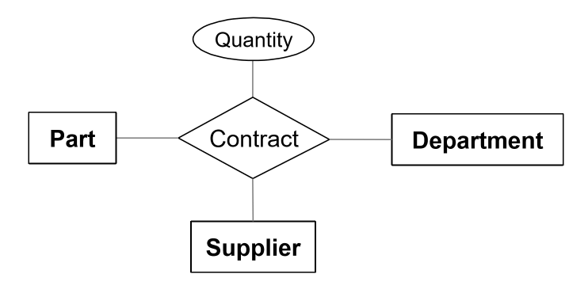

## Attributes

- **multi-valued attributes**: multiple values of same type (e.g. phone numbers)
- **composite attributes**: structured values of possibly different type e.g.
  address

- entity vs attribute: depends on how you use information e.g. several addresses
  per employee, you should model address as an entity

# 4. Translating ER diagrams

## Relational Data Model

- **data model**: allows you to translate real world things into form that can
  be stored by a computer
  - relational, ER, object-oriented, ...
- **relational model**:
  - rows: aka tuples, records
  - columns: aka attributes, fields
- **relational database**: set of relations
- **relation**: schema + instance
  - **schema**: specifies name of realtion, name and type of each column
  - **instance**: table with rows and columns
    - **cardinality**: number of rows
    - **degree**: number of fields
  - relation is a set of distinct, unordered rows

## Keys

- **keys**: associate tuples in different relations
  - form of **integrity constraint**: e.g. only students can be enrolled in
    subjects

### Primary key

- **superkey**: set of fields where no two distinct tuples have the same values
  for all fields
- set of fields is a **key** for a relation if:
  - it is a superkey, and
  - no subset of fields is a super key, i.e. it is a minimal subset
- **primary key**: chosen key for the relation
- **candidate key**: all other keys
- each relation has a primary key

### Foreign key

- **foreign key**: set of fields in one relation used to refer to a tuple in
  another relation. Must correspond to primary key in the other relation
- **referential integrity**: achieved when all foreign key constraints are
  enforced

## Integrity constraints

- **integrity constraint/IC**: condition that must be true for any instance of
  the database
  - specified when schema is defined
  - checked when relations are modified
  - instance of a relation is **legal** if it satisfies all specified ICs


## ER to Relational model

- logical design:
  - entity sets become relations
  - attributes become attributes of relation
- physical design: assign data types

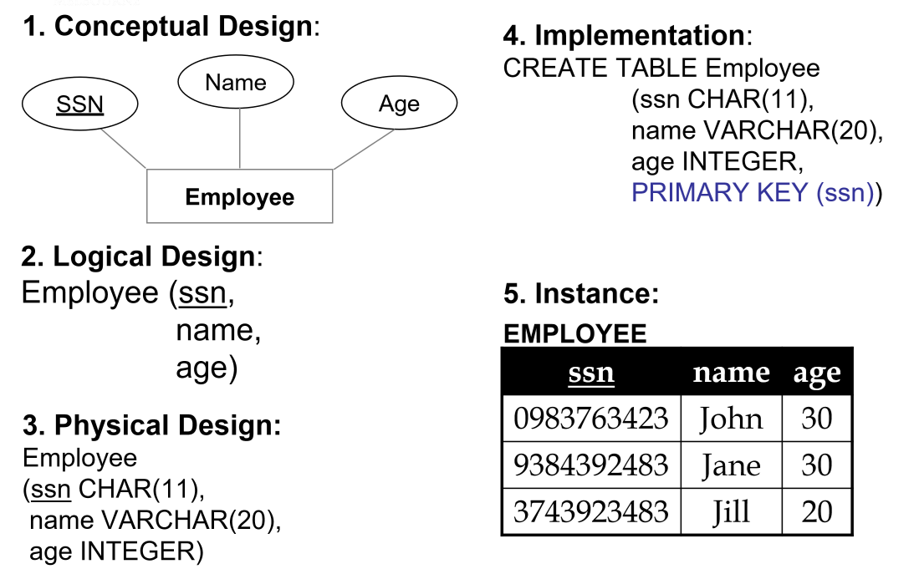

- multi-valued attributes: either flatten or introduce lookup table

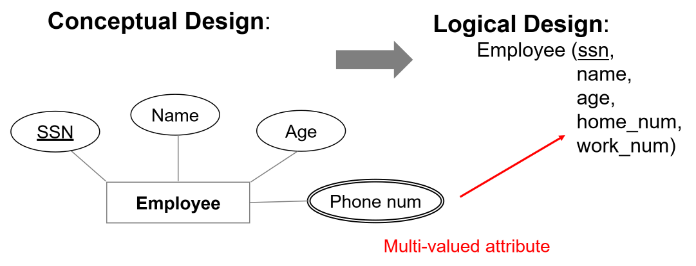

- composite attributes: flatten
- many-to-many relationship set to relation
  - include keys for each entity set as foreign keys. This will form a superkey
  - descriptive attributes

### Example

_Conceptual design_
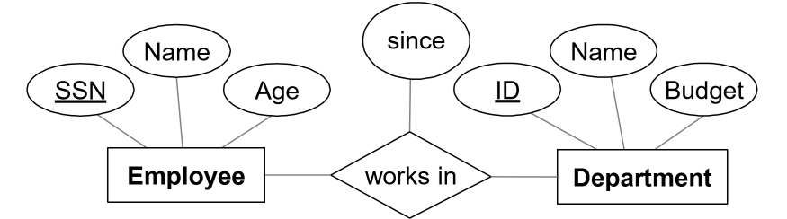

_Logical design_

```
Employee(ssn PK, name, age)
Department(did PK, dname, budget)
Works_In(ssn PFK, did PFK, since)
```

_Physical Design_

```
Employee(ssn CHAR(11) PK, 
         name VARCHAR(20), 
         age INTEGER)
Department(did INTEGER PK, 
           dname VARCHAR(20),
           budget DECIMAL(10, 2))
Works_In(ssn CHAR(11) PFK, 
         did INTEGER PFK, 
         since DATE)
```

_Implementation_

```mysql
CREATE TABLE Employee (
    ssn CHAR(11), 
    name VARCHAR(20),
    age INTEGER,
    PRIMARY KEY (ssn)
);

CREATE TABLE Department (
    did INTEGER,
    dname VARCHAR(20),
    budget DECIMAL(10, 2),
    PRIMARY KEY (did)
);

CREATE TABLE Works_In (
    ssn CHAR(11),
    did INTEGER,
    since DATE
    PRIMARY KEY (ssn, did),
    FOREIGN KEY (ssn) REFERENCES Employee,
    FOREIGN KEY (did) REFERENCES Department
);
```

### Example: key and participation constraints

_Conceptual model_
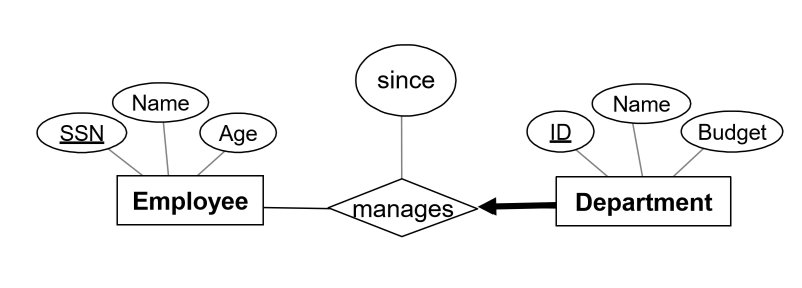

- each department has at most one manager
- **rule: primary key from many side becomes foreign key on the one side**
  - this ensures the key constraint holds
- every department has a manager: total participation. Enforce with `NOT NULL`

_Implementation_

```mysql
CREATE TABLE Department (
    did INTEGER, 
    dname VARCHAR, 
    budget DECIMAL(10, 2),
    since DATE, 
    ssn CHAR(11) NOT NULL,
    PRIMARY KEY (did),
    FOREIGN KEY (ssn) REFERENCES Employee
        ON DELETE NO ACTION
);
```

### Example: Weak Entity

- weak entity set and identifying relationship set become a single table
- when owner is deleted, all owned weak entities must also be deleted

_Logical design_

```
Dependent(dname PK, age, cost, ssn PFK)
```

_Implementation_

```mysql
CREATE TABLE Dependent (
    dname CHAR(20) NOT NULL,
    age INTEGER NULL,
    cost DECIMAL(7, 2) NOT NULL,
    ssn CHAR(11) NOT NULL,
    PRIMARY KEY (dname, ssn),
    FOREIGN KEY (ssn) REFERENCES Employee
        ON DELETE CASCADE
);
```

# 5. MySQL Workbench

- **derived attributes**: values can be derived from other attributes in the
  database
  - need not be stored physically: redundant, threat to integrity
  - may want to store so that you don't have to recompute
  - e.g. number of years employee has been employed

## Conceptual to logical checklist

1. Flatten composite and multi-valued attributes, or introduce lookup table for
   multi-valued attributes when number of values is unknown or variable.
2. Resolve many-many relationships
3. Add foreign keys at crows foot end of relationship (many side)

## Convert from Logical

- choose data types
- choose whether `NULL` or `NOT NULL`

### Binary relationships

- **one-to-many**: primary key on one side becomes foreign key on many side
- **many-to-many**: create associative entity (new relation) with primary key of
  each entity as combined primary key
- **binary one-one relationship**: primary key on mandatory side becomes foreign
  key on optional side
  - otherwise just choose one

### Unary relationships

- **one-to-one**: put FK in relation
- **one-to-many**: put FK in relation
- **many-to-many**: generate associative entity
  - put two foreign keys in it

### Ternary relationship

- generate associative entity
- 3 one-to-many relationships: add FKs

# 6. Relational Algebra

## Basic Operations

- **Selection $\sigma$**: select subset of rows satisfying selection condition
  - result: relation with identical schema to input relation
- **Projection $\pi$**: retain wanted columns in projection list
  - schema: contains only fields in projection list
  - eliminates duplicates
- **Set-difference $-$**: get tuples in one relation but not the other
  - input relations must be union-compatible
  - not symmetrical: $S1-S2 \not = S2-S1$
- **Union $\cup$**: tuples in one relation and/or in the other
  - input relations must be union-compatible
  - duplicates removed
- **Cross product $\times$**: combine two relations
  - each row of one input merged with each row from another input
  - output: new relation with all attributes of both inputs
  - e.g. num tuples of $S \times R = card(S).card(R)$
- **renaming operator $\rho$**: useful for naming conflicts e.g. in cross
  product
  - $\rho(ResultName(\text{ field1 } \rightarrow \text{newField1}, \text{field2}
    \rightarrow \text{newField2}), S\times R)$

- **union-compatible**:
  - same number of fields
  - corresponding fields are of the same type
- **or**: $\vee$
- **and**: $\wedge$

## Compound Operators

- no additional computational power: they can be expressed in terms of basic
  operations
- may be useful shorthand
- **intersection $\cap$**: retain rows appearing in both relations
  - inputs must be union-compatible
  - $R\cap S = R - (R-S)$
- **join**: cross product + selection + optional projection
- **natural join $R\bowtie S$**: match rows where attributes appearing in both
  relations have equal values. Omit duplicate attributes. Steps:
  - compute $R \times S$
  - select rows where attributes in both relations have equal values
  - project all unique attributes, copy each common one
- **condition join/theta join $R\bowtie_c S = \sigma_c(R\times S)$**: cross
  product with a condition
- **equi-join**: special case of condition join, where condition only contains
  equalities

# 8, 9. SQL

## SQL

- Structured Query Language
- Supports CRUD commands:
  - Create
  - Read
  - Update
  - Delete
- capabilities:
  - **data definition language DDL**: define, set up database
    - `CREATE, ALTER, DROP`
  - **data manipulation language DML**: maintain, use database
    - `SELECT, INSERT, DELETE, UPDATE`
  - **data control language DCL**: control access to the database
    - `GRANT, REVOKE`
  - administration
  - transactions

## `SELECT` statement overview

```mysql
# List columns/expressions returned from query
SELECT [ALL|DISTINCT] select_expr [, select_expr ...]
# tables from which data is obtained
FROM table_references
# filtering conditions
WHERE where_condition
# categorisation of results
GROUP BY { col_name | expr } [ASC | DESC], ...
# filtering conditions for categories.  Can only be used with a GROUP BY
HAVING where_condition
# sort
ORDER BY {col_name | expr | position} [ASC | DESC]
# limit which rows are returned
LIMIT {[offset, ] row_count | row_count OFFSET offset}];
```

### `LIKE` Clause

- `%`: 0+ characters
- '_': exactly 1 character

```
LIKE "<regex>"
```

e.g.

```mysql
SELECT * FROM Customer
# any values starting with "a"
WHERE CustomerName LIKE 'a%'
# any values starting with "a", at least 3 values long
WHERE CustomerName LIKE 'a_%_%'
# any values starting with "a", ends with "o"
WHERE CustomerName LIKE 'a%o'
```

### Aggregate Functions

[MySQL Group By Functions](https://dev.mysql.com/doc/refman/8.0/en/group-by-functions.html)

- `AVG()`
- `MIN()`
- `MAX()`
- `COUNT()`: counts number of records
- `SUM()`
- all except `COUNT` ignore null values and return null if all values are null

### Order By

```mysql
ORDER BY XXX ASC/DESC
```

### Joins

- Cross product: not usually useful. Typically want records matching on a key

```mysql
# Cross product
SELECT * FROM R1, R2;

# Natural join: join tables on keys.  Attributes must have same name
SELECT * 
FROM R1 NATURAL JOIN R2;

# Inner join: only retain matching rows
SELECT *
FROM R1 INNER JOIN R2
    ON R1.id = R2.id;
k
# Outer join:: left/right; includes records that don't match from the outer table
SELECT *
FROM R1 LEFT OUTER JOIN R2
    ON R1.id = R2.id;
```

### Comparison and logical operators

- `<>, !=`: not equal to
- `IN, NOT IN`: test whether attribute is in/not in subquery list
- `ANY`: true if any value meets condition
- `ALL`: true if all values meet condition
- `EXISTS`: true if subquery returns 1+ record

### Set operators

- MySQL specific
- `UNION`: classical set operation, no duplicates
- `UNION ALL`: duplicates allowed

## Other Statements

### `INSERT` Statement

- insert records into a table

```mysql
# insert single record
INSERT INTO NewEmployee SELECT * FROM Employee;

# insert multiple records
INSERT INTO Employee VALUES
    (DEFAULT, "A", "address A", "2012-02-12", NULL, "S"),
    (DEFAULT, "B", "address B", "2012-02-12", NULL, "R");

# insert specific columns
INSERT INTO Employee
    (Name, Address, DateHired, EmployeeType)
    VALUES
        ("D", "address D", "2012-02-12", "C"),
        ("E", "address E", "2012-02-12", "C");
```

### `UPDATE`

- change existing data in table

```mysql
UPDATE Salaried
    SET AnnualSalary = 
        CASE
            WHEN AnnualSalary <= 100000
            THEN AnnualSalary * 1.1
            ELSE AnnualSalary * 1.05
        END;
```

### `REPLACE`

- works identically to insert, but row is updated if it exists, otherwise a new
  row is inserted

### `DELETE`

- dangerous!
- in production, you don't physically delete, you use a flag to indicate not
  active, known as a logical delete

```mysql
DELETE FROM Employee
    WHERE Name = "Grace";
```

- foreign key constraints
  - `ON DELETE CASCADE`
  - `ON DELETE RESTRICT`: prevent deletion if child row exists

## Views

- **view**: relation not in physical model, but made available to end user as a
  virtual relation
- hides query complexity from user
- hides data from users: helps improve DB security
- once created, schema is stored in DB, and it can be used like any other table

```mysql
CREATE VIEW nameOfView AS validSqlStatement
```

## More DDL

### `ALTER`

- allows you to add/remove attributes from a table

```mysql
ALTER TABLE TableName ADD AttributeName AttributeType;
ALTER TABLE TABLENAME DROP AttributeName;
```

### `RENAME`

- allows you to rename table

```mysql
RENAME TABLE CurrentName TO NewName;
```

## Approach for writing SQL

1. Use design as a map to help format queries
2. Create skeleton `SELECT` statement as a template
3. Fill in parts to build query

# 10. Storage and Indexing

## Files in DBMS

- **file**: collection of pages, each containing collection of records
  - each record has a record ID, correspoding to physical address of page that
    the record is on
- DBMS must support:
  - insert, delete, modify records
  - read particular records
  - scan all records
- pages are stored on hard disks HDD
- for processing, pages need to be loaded into RAM
- costs of operations modelled by DBMS in terms of number of page accesses (disk
  I/Os)

- **heap files**: no order among records
  - suitable for retrieval of all records
  - as file grows/shrinks pages are allocated/deallocated
  - fastest for inserts
- **sorted file**: pages and records ordered by some condition
  - fast for range queries
  - hard to maintain: each insertion may reshuffle records
  - rarely done in practice; B+ tree index is a better option
- **index file organisation**: fastest retrieval in some order
  - best tool a DBA has to optimise a query

## Indexes

- **index**: data structure built on top of data pages used for efficient search
  - built over **search key fields**: selections on search key fields will be
    fast
    - any subset of fields of a relation can be search key for an index
    - search key is distinct from key, and need not be unique
  - contains collection of **data entries**, supporting efficient retrieval of
    **data records** matching a given **search condition**

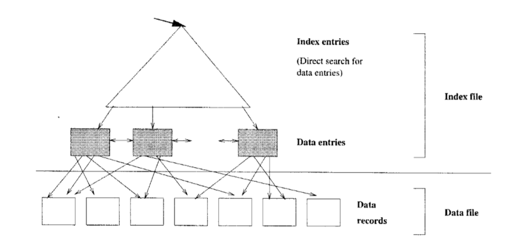

### Clustered vs Unclustered

- **clustered**: order of data records is the _same_ as order of index data
  entries
  - e.g. if the underlying file is sorted on the same fields
  - you cannot have multiple clustered indexes over a single table
  - much cheaper for clustered retrieval
  - more expensive to maintain
  - very efficient for range search
  - Cost ~ number of pages in data file with matching records

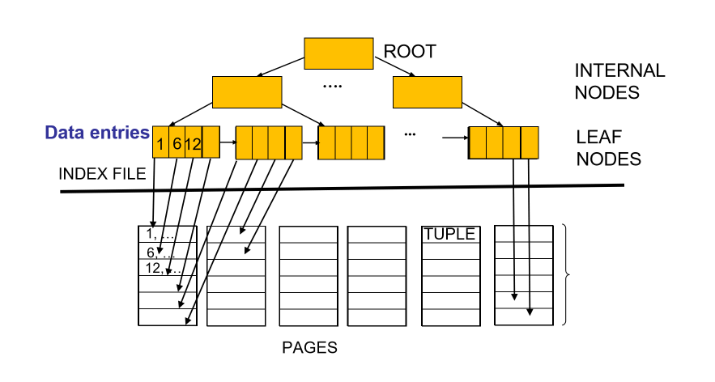

- **unclustered**: order of data records is _different_ from order of index data
  entries
  - e.g. heap file
  - cost ~ number of matching index data entries (data records)

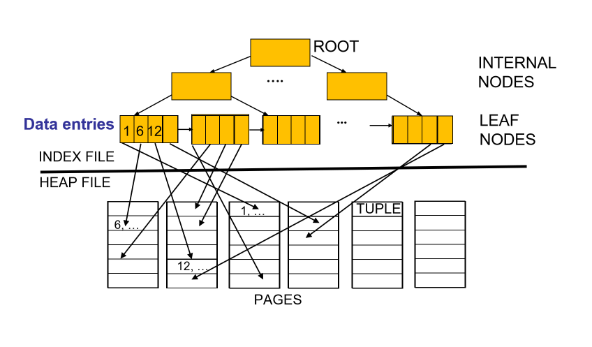

### Primary vs Secondary

- **primary index** includes table's primary key
  - never contains duplicates
- **secondary index** is any other index
  - may contain duplicates

### Single Key vs Composite Key

- index can be built over a combination of search keys
- data entries in the index are sorted by search keys

### Index Type

- **hash-based index**: index is a collection of buckets
  - hash function maps search key to corresponding bucket
  - h(r.search_key) = bucket in which record r belongs
  - good for **equality** selections
  - bad for range selections

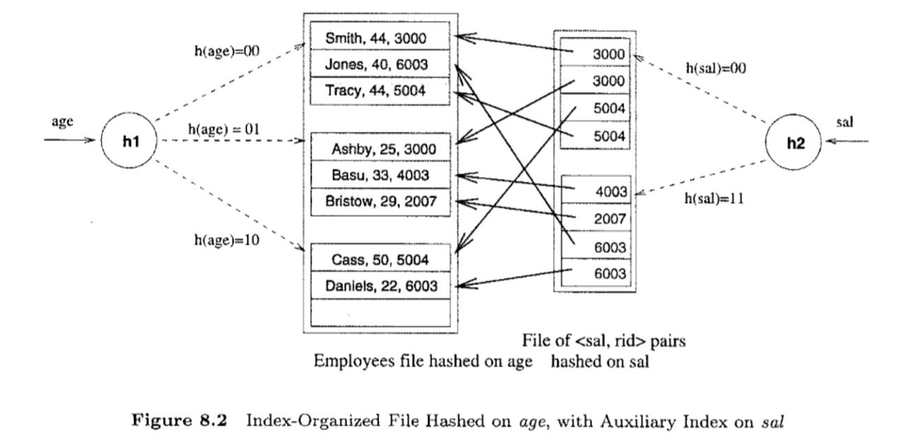

- **tree-based index**: B+ tree
  - nodes contain pointers to lower levels
  - leaves contain data entries
  - B+ tree maintains a short path from root to leaf, minimising I/Os
  - good for range selections

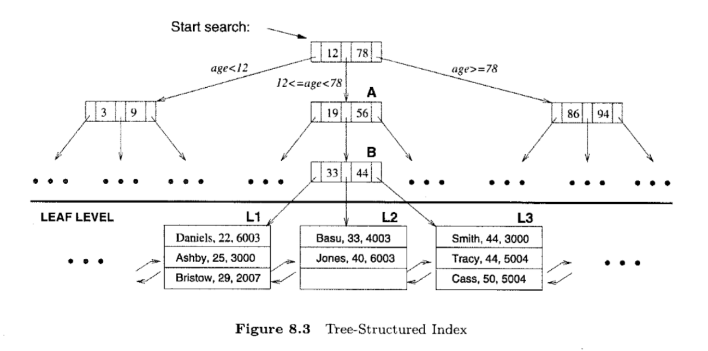

- choosing an index depends on the needs of the database: if selection queries
  are frequent, building an index is important. The type of index you choose
  will depend on the type of queries that are performed

# 11. Query Processing

## Query Processing

- some DB operations are expensive
- clever implementation can result in $10^6$ performance improvement
- tools:
  - clever implementation techniques for operators
  - exploit equivalencies of relational operators
  - use cost models to choose between alternatives

## Relational Operations

### Selection

- multiple predicates:
- a B+ tree index matches predicates that involve attributes in a **prefix of
  the search key**.
- e.g. Index on `<a,b,c>`:
  - matches predicates on `(a,b,c), (a, b)` and `(a)`
  - matches `a = 5 AND b = 3`
  - does not match `b = 3`
  - only **matching predicates** are used to determine cost
- e.g. index on `<a, b>`: Can this be used to estimate cost of following
  conditions?
  - `a > x`: yes
  - `a > x AND b > y`: yes
  - `b > y`: no
  - `a = 5 AND b = 3 & c = 7` : yes. Only the first two are matching predicates.
- approach:
  - find **cheapest access path**: index/file scan with lowest estimated page
    I/O
  - retrieve tuples using it: predicates that match the index reduce the number
    of tuples retrieve, and impact the cost
  - apply predicates that don't match the index later on, **on-the-fly**, in
    memory
    - doesn't affect total number of tuples/pages fetched

## Projection

- issue: removing duplicates is expensive
- approaches: hashing, sorting
- sorting:
  - scan whole relation, extract only needed attributes
  - sort the result set (external merge sort)
  - remove adjacent duplicates

### External Merge Sort

- used when data doesn't fit in memory all at once
- conduct several passes:
  - sort runs: make each of B pages individually sorted (runs)
  - merge runs: make multiple passes to merge runs

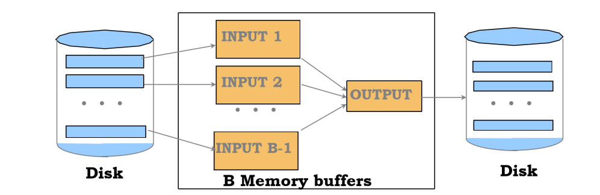

### Sort-based Projection

```
Cost =  ReadTable +             # read entire table, keep projected attributes
        WriteProjectedPages +   # write back to disk 
        SortingCost +           # external merge sort 
        ReadProjectedPages      # discard adjacent duplicates

WriteProjectedPages = NPages(R) * PF
SortingCost = 2*NumPasses*ReadProjectedPages
```

- **projection factor PF**: how much we are projecting, ratio with respect to
  all attributes
  - e.g. keeping 10% of all attributes

### Hash-based projection

- scan R, extract needed attributes
- hash data into buckets: apply hash function `h1` to choose one of `B` output
  buffers
- remove adjacent duplicates from a bucket
  - 2 tuples from different partitions guaranteed to be distinct

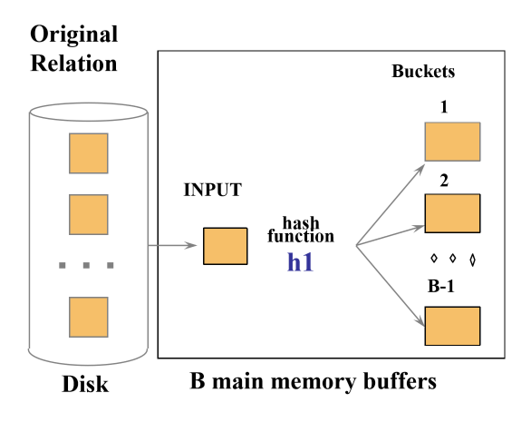

- external hashing
  - partition data into B-1 partitions with hash function `h1`
  - load each partition, hash it with a different hash function `h2` and
    eliminate duplicates

```
Cost = ReadTable + WriteProjectedPages + ReadProjectedPages
```

# 12. Query Processing II

## Joins

- very common
- can be very expensive (cross product in worst case)
- in expression $R\times S$:
  - $R$: left/outer
  - $S$: right/inner
- properties
  - commutative: $A\times B = B\times A$
  - associative: $A\times(B\times C) = (A\times B) \times C$

### Simple nested loop join

- $R\bowtie S$
- for each tuple in outer relation $R$, we scan entire inner relation $S$

```
for each tuple r in R:
  for each tuple s in S:
    if ri = sj:
       add <r, s> to the result
```

```
Cost(SNLJ) = NPages(Outer) + NTuples(Outer) * NPages(Inner)
```

### Page-Oriented Nested Loop Join

- $R\bowtie S$
- for each page of R, get each page of S.
  - Write out matching pairs of tuple `<r, s>`

```
for each page b_r in R:
  for each page b_s in S:
    for each tuple r in b_r:
      for each tuple s in b_s:
        if r_i = s_j, add <r,s> to the result
```

```
Cost(PNLJ) = NPages(Outer) + NPages(Outer) * NPages(Inner)
```

### Block Nested Loop Join

- exploit additional memory buffers
- use one page as input buffer for scanning inner S
- use one page as output buffer
- use all remaining pages to hold block of outer R

```
for each block in R:
  for each page in S:
    for each matching tuple r in R-block, s in S-page:
      add `<r, s>` to result
```

$$\text{NBlocks(Outer)} = \lceil\frac{\text{NPages(Outer)}}{B-2}\rceil$$

```
Cost(BNLJ) = NPages(Outer) + NBlocks(Outer)*NPages(Inner)
```

### Sort-Merge Join

- sort R and S on the join column
- scan them to do a merge
- output result tuples
- useful when:
  - one/both inputs are already sorted on join attributes
  - output required to be sorted on join attributes

```
Cost(SMJ) = Sort(Outer) + Sort(Inner)     # Sort inputs
          + NPages(Outer) + NPages(Inner) # Merge inputs

Sort(R) = external sort cost = 2*NumPasses*NPages(R)
```

### Hash Join

- partition both relations using hash function `h`: tuples from R in partition 1
  can only match tuples from S in partition 1
- read in a partition of R, hash with a different hash function `h2`
  - scan matching partition of S and probe the hash table for matches

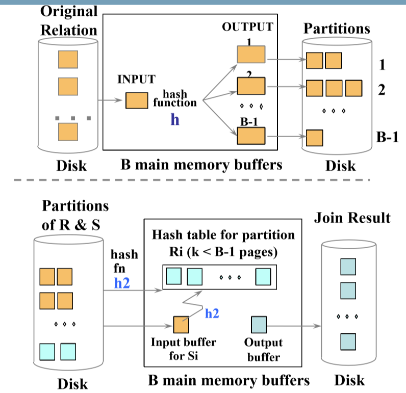

```
Cost(HJ) = 2*NPages(Outer) + 2*NPages(Inner)  # Create partitions
            + NPages(Outer) + NPages(Inner)   # Match partitions
```

### General Joins

- equality over several attributes
  - for sort-merge and hash join, sort/partition on combination of the join
    columns
- range/inequality conditions
  - hash join, sort merge join not applicable
  - block NL likely to be best join method here

# 13. Query Optimisation

## Query plan

- tree with relational algebra operators as nodes
- pipeline of tuples from bottom to top
- exclude cost of writing result, as this will be identical for all plans
- each operator labeled with choice of algorithm

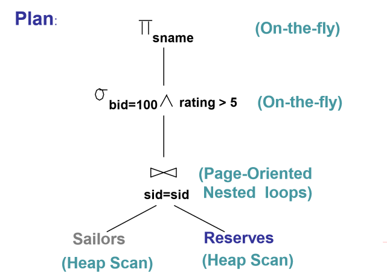

## Query optimisation steps

1. break query into blocks
2. convert block to relational algebra
3. consider alternative query plans for each block
4. select plan with lowest estimated cost

### Break query into blocks

- **query block**: any statement starting with select
  - unit of optimisation
  - inner most block optimised first, then move outwards

### Relational algebra equivalences

- Selections

___Cascade___

$$\sigma_{c_1 \wedge ... \wedge c_n}(R) = \sigma_{c_1}(...(\sigma_{c_n}(R)))$$

___Commute___

$$\sigma_{c_1}(\sigma_{c_2}(R)) = \sigma_{c_2}(\sigma_{c_1}(R))$$

- Projections

___Cascade___

$$\pi_{a_1}(R) = \pi_{a_1}(...(\pi_{a_n}(R)))$$

Where $a_i$ is a set of attributes of R and $a_i \subseteq a_i+1$ for $i =
1..n-1$

- projection also commutes with selection that only uses attributes retained by
  the projection

- Joins

___Associative___ $$R\bowtie (S \bowtie T) = (R\bowtie S)\bowtie T$$

___Commutative___ $$R\bowtie S = S\bowtie R$$

- consequences:
  - allow you to push down selections and projections before joins
    - care needed for projection
  - allows you to choose different join order, and pick minimum cost option

### Statistics and Catalogs

- **system catalog** provides optimiser with information about relations and indexes
- typically contains:
  - number of tuples, number of pages per relation
  - number of distinct keys for each index/attribute
  - low/high values
  - index height
  - number of index pages
- statistics are updated periodically

### Cost Estimation

- for each plan, estimate the cost:
  - estimate result size for each operation in tree
  - estimate cost of each operation in tree

$$\text{ResultSize} = \Pi_{j=1...k}\text{NTuples}(R_j)\Pi_{i=1...n} RF_i$$

### Reduction Factors

|      Condition       |                             Reduction Factor                             |
|:--------------------:|:------------------------------------------------------------------------:|
|     col = value      |                      $\frac{1}{\text{NKeys(col)}}$                       |
|     col > value      | $\frac{\text{High(col)}-\text{value}}{\text{High(col)}-\text{Low(col)}}$ |
|     col < value      | $\frac{\text{value}-\text{Low(col)}}{\text{High(col)}-\text{Low(col)}}$  |
| Col_A = Col_B (join) |      $\frac{1}{\max{(\text{NKeys}(Col_A),  \text{NKeys}(Col_B))}}$       |
|       no info        |                          Use magic number 1/10                           |

# 14. Query Optimisation 2

## Single-relation plans

- each available access path (file scan/index) is considered
- choose lowest cost option
- heap scan is always available
- indexes are alternatives if they match selection predicates
- other operations may be performed on top of access but they don't typically
  incur additional cost as they are done on the fly (e.g. projection, non-matching predicates)

## Multi-relation plans

1. select order of relations
2. select join algorithm for each join
3. for each input relation select access method (heap scan, ...)

- restrict plan space to **left-deep join trees**

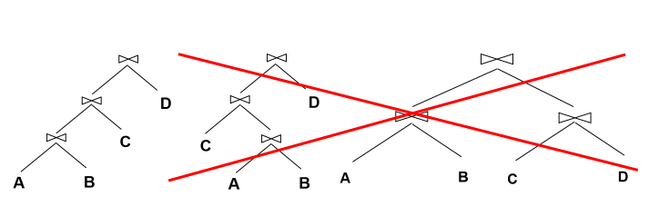

- allows you to pipeline results from intermediate operations: you don't
  write back to disk, and then incur cost when you need to read again, you just
  feed it into the next operation
- prune plans from the tree with cross products immediately

# 15. Normalisation

## Motivation for Normalisation


- anomalies in denormalised data
  - **insertion**: cannot add new course until at least one student is enrolled
  - **deletion**: if student 425 withdraws, the course is lost
  - **update**: if the fee changes for a course, every row referencing that course
    will have to be updated. It would be easy to make inconsistent changes: if the fee changes for a course, every row referencing that course
      will have to be updated. It would be easy to make inconsistent changes.
- **normalisation**: technique to remove undesired redundancy from databases by breaking
  a large table into several smaller tables
- **a relation is normalised if all determinants are candidate keys**

## Functional dependency

- **functional dependency**: set of attributes $X$ **determines $Y$ if each value of $X$
  is associated with only one value of Y
  - $X\rightarrow Y$: X determines Y; if I know X, then I also know Y

Consider **A(X PK, Y PK, Z, D)**:
- **determinants**: $X, Y \rightarrow Z$
  - X, Y are determinants
- **key/non-key attributes**: each attribute is/isn't a part of the primary key
- **partial functional dependency**: $Y\rightarrow Z$
  - functional dependency of 1+ non-key attributes upon part (not all) of primary key
  - presence indicates normalisation required
- **transitive dependency**: $Z\rightarrow D$
  - functional dependency between 2+ non-key attributes
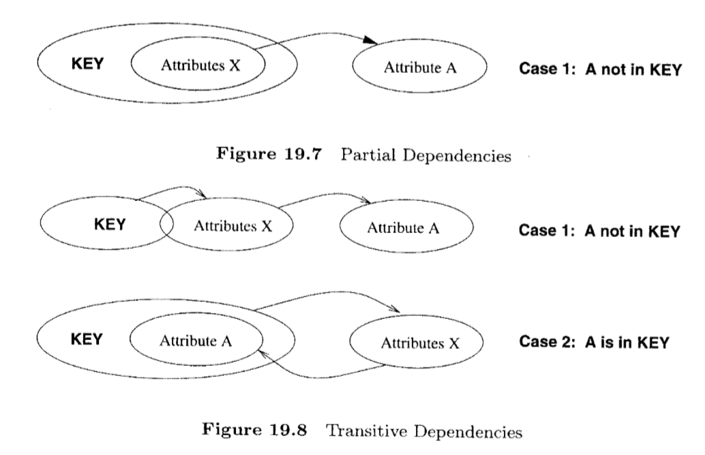
### Armstrong's Axioms

## Steps in Normalisation

[Wikipedia: normalisation](https://en.m.wikipedia.org/wiki/Database_normalization)

- 1st Normal Form: keep atomic data
  - atomic columns: cells have a single value
  - in 1NF if every field contains only atomic values, i.e. no lists or sets
- 2nd Normal Form: remove partial dependencies
  - in 2NF non-key attribute cannot be identified by part of a composite key
- 3rd Normal Form: remove transitive dependencies
  - in 3NF non-key attribute cannot be identified by another non-key attribute

## Normalisation vs Denormalisation

- normalisation:
  - minimal redundancy
  - allows users to insert, modify, delete rows without errors/inconsistencies
- denormalisation:
  - improved query speed and performance.  Good for time-critical operations
  - extra work on updates to ensure data is consistent

# 16. Database Administration

- 
# 17. Transactions

# 18. Data Warehousing

# 19. Distributed Databases

# 20. NoSQL
