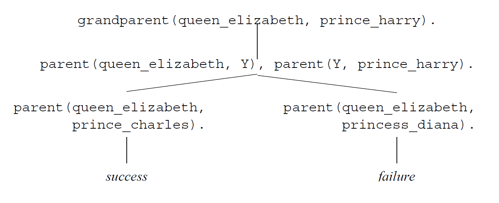
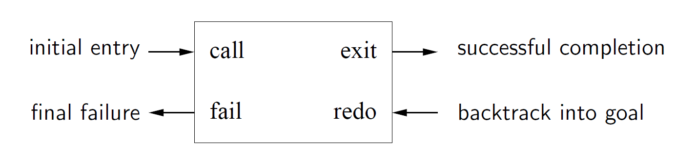
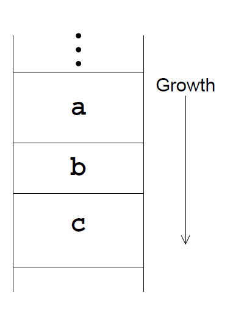
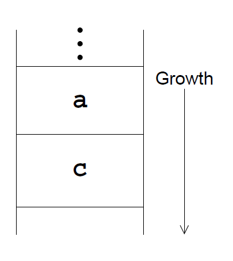
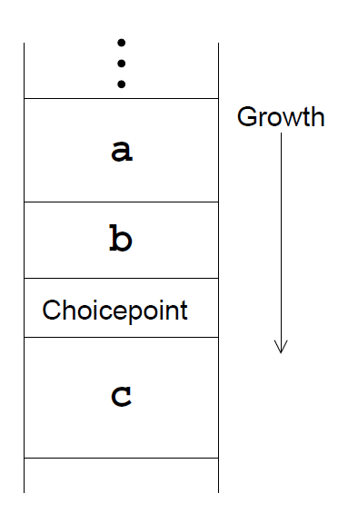

---
title: "Logic Programming: Prolog"
notebook: Declarative Programming
layout: note
date: 2020-08-03
tags: 
...

# Logic Programming: Prolog
[TOC]: #

## Table of Contents

# Prolog

## Key points

- __closed world assumption:__ anything you haven't said to be true is assumed to be false
- __negation as failure:__ to execute `\+G`, Prolog first tries to prove `G`.  If it fails, `\+G` succeeds.
  Otherwise, it fails.
  - failing goals does not bind variables, so `\+G` cannot solve for variables
  - ensure all variables in a negated goal are bound before the goal is executed
- __terms:__ all data structures are terms.  They can be 
  - __atomic:__
    - integers, floating point numbers
    - __atoms:__ begins with lower case letter
  - __compound:__ functor/function symbol followed by 0+ arguments
  - __variable:__ denotes a single unknown term, begins with upper case letter
    - single `_` specifies a different variable each time it appears
- __Datalog:__ fragment of Prolog with only atomic terms and variables
- __single-assignment language:__ a variable can only be bound once
- __ground term:__ contains no variables
  - has only one instance
- __nonground term:__ contains 1+ variable
  - has an infinite number of instances
- __substitution:__ mapping from variables to terms
  - never replaces atomic/compound terms, only replaces variables
- __applying a substitution:__ consistently replacing occurrences of each variable in the map with the term it is mapped to
- do arithmetic with the `is/2` predicate, infix e.g. `X is 6*7`
  - `is/2` only works if the 2nd argument is ground

### Proper List

- either empty `[]` or not `[X|Y]`
- if not empty, the tail `Y` must be a proper list

```prolog
proper_list([]).
proper_list([Head|Tail]) :- proper_list(Tail).
```

- this is a common pattern for recursive list traversal in Prolog

### Append

```prolog
append([], C, C).
append([A|B], C, [A|BC]) :- append(B, C, BC).
```

### Member

```prolog
member1(Elt, List) :- append(_, [Elt|_], List).

member2(Elt, [Elt|_]).
member2(Elt, [_|Rest]) :- member2(Elt, Rest).
```

- `member2` is more efficient: `member1` builds and ignores the list of elements before `Elt` in `List`.
  The second does not.

## Logic and Resolution

### Interpretations

- __interpretation__:
  - atomic terms stand for entities in the __domain of discourse (universe)__
  - each functor (function symbol of arity $n > 0$ stands for a function from $n$ entities to one entity
    in the domain
  - each predicate of arity $n$ stands for a particular relationship between $n$ entities in the domain of discourse

### Views of predicates

- predicate with $n$ arguments can be viewed in different ways:
  - function from all possible combinations of $n$ terms to a truth value
  - set of tuples of $n$ terms.  Every tuple in the set is implicitly mapped to true, while every other tuple
    is mapped to false
- predicate definition is then, for each view
  - define the mapping
  - define the set of tuples

### Meaning of clauses

```prolog
grandparent(A, C) :- parent(A,B), parent(B,C).
```

means "for all terms that A and C may stand for: A is a grandparent of C if there is a term B such that A is a parent of B,
 and B is a parent of C"

$$
\forall A,C (grandparent(A,C) \leftarrow \exists B (parent(A,B) \wedge parent(B,C))).
$$

- variables in the head are universally quantified over the entire clause
- variables appearing only in the body are existentially quantified over the body

### Meaning of predicate definitions

- predicates are define by a finite number of clauses, each of which is in the form of an implication
- e.g. `parent(queen_elizabeth, prince_charles)` represents
$$
\forall A,B(parent(A,B) \leftarrow (A = \text{queen\_elizabeth} \wedge B = \text{prince\_charles}))
$$

- the meaning of the predicate is a disjunction of the bodies of all the clauses:
$$
\forall A,B : parent(A,B) \leftarrow 
  \newline(A = \text{queen\_elizabeth} \wedge B = \text{prince\_charles}) \vee
  \newline(A = \text{prince\_philip} \wedge B = \text{prince\_charles}) \vee
  \newline(A = \text{prince\_charles} \wedge B = \text{prince\_william})
$$

### Closed world assumption

- to implement closed world assumption, make the implication biimplication
$$
\forall A,B : parent(A,B) \iff 
  \newline(A = \text{queen\_elizabeth} \wedge B = \text{prince\_charles}) \vee
  \newline(A = \text{prince\_philip} \wedge B = \text{prince\_charles}) \vee
  \newline(A = \text{prince\_charles} \wedge B = \text{prince\_william})
$$

- A is not a parent of B unless they are one of the listed cases
- adding reverse implication produces the __Clark completion__ of the program

### Semantics

- logic program P consists of a set of predicate definitions
- __semantics/meaning of P__: set of __logical consequences__ as ground atomic formulae
- a ground atomic formula $a$ is a logical consequence of a program $P$ if $P$ makes it true
- a negated ground atomic formula $\neg a$ (`\+a`) is a logcical consequence of $P$ if $a$ is not
  a logical conequence of $P$

### Finding semantics

- you can determine the semantics of a logic program by working backwards: instead of reasoning from 
  a query to find a satisfying substitution, you reason from the program to find what ground queries
  succeed.
- immediate consequence operator $T_P$ takes a set of ground unit clauses $C$ and produces the set of ground
  unit clauses implied by $C$ together with the program $P$
- always includes all ground instances of all unit clauses in $P$
- for each clause `H :- G1, ... Ga` in P

e.g. 
```prolog
% P
q(X,Z) :- p(X,Y), p(Y,Z).
% C
p(a,b).
p(b,c).
p(c,d).

```
Then:
$$T_P(C) = \{q(a,c).q(b,d).\}$$

- the semantics of P is always $T_P$ applied infinitely many times to the empty set: $T_P(T_P(...(\empty)...))$

### Procedural interpretation

```prolog
grandparent(A, C) :- parent(A,B), parent(B,C).
```

Logical interpretation:

$$
\forall A,C (grandparent(A,C) \leftarrow \exists B (parent(A,B) \wedge parent(B,C))).
$$

Procedural interpretation: to show that A is a grandparent of C, it suffices to show A is a parent of B and B is a parent of C.

### Selective Linear Definite Resolution

- consequences of a logic program are determined through __resolution__
- __SLD resolution__ is an efficient version of resolution
- e.g. to determine if Queen Elizabeth is Prince Harry's grandparent:

```
?- grandparent(queen_elizabeth, prince_harry).
```
With program:
```prolog
granpdarent(X,Z) :_ parent(X,Y), parent(Y,Z).
```

- Unify query goal (`grandparent(queen_elizabeth, prince_harry)` with clause head `grandparent(X,Z)`
- apply resulting substitution to the clause, to yield the __resolvent__
- the goal is identical to the resolvent head, so we can replace it with the resolvent body:

```
?- parent(queen_elizabeth, Y), parent(Y, prince_harry).
```

- now pick one of these goals to resolve: say you choose `parent(Y, prince_harry)`
- only two clauses can resolve with it:

```prolog
parent(prince_charles, prince_harry).
parent(princess_diana, prince_harry).
```

- choose the second clause.  After resolution, we are left with the query:
```
?- parent(queen_elizabeth, princess_diana).
```

- no clause unifies with this query: resolution fails.  This can sometimes take many steps.
- now __backtrack__ and try the first matching clause

```
?- parent(queen_elizabeth, prince_charles).
```

- there is a matching program clause, so there is nothing more to prove.  The query succeeds.



### Order of Execution

- order of goal resolution and trial of different clauses:
  - doesn't matter for correctness
  - does matter for efficiency
- Prolog always selects the first goal to resolve, and always selects the first matching clause to pursue first
  - allows programmer to control execution

### Backtracking

- when there are multiple clauses matching a goal, Prolog leaves a __choicepoint__ so that it can return to 
  that state and try the next matching clause
- when a goal fail, Prolog __backtracks__ to the most recent choicepoint
  - removes all variable bindings since the choicepoint
  - Prolog begins resolution with next matching clause
  - once all matching clauses are exhausted, the choicepoint is removed
  - subsequent failures then backtrack to the next choicepoint

### Indexing

- __indexing__ can improve efficiency
- Prolog systems automatically create an index for predicates with multiple clauses, where the heads
  have distinct constants/functors
- for a call with the first argument called, Prolog immediately jumps to the first matching clause
- SWI Prolog constructs indices for multiple arguments, meaning more queries benefit from indexing

## Debugging

### Prolog Debugger

- `trace` turns on the debugger
- `nodebug` turns off the debugger
- Byrd box model: goal execution is a box with ports for entry/exit



### Infinite Backtracking Loop

Initial version of reverse

```prolog
% rev1(X,Y)
% rev1/2 holds when Y is the reverse of the list X
rev1([], []).
rev1([A|BC], CBA) :-
    rev1(BC, CB),
    append(CB, [A], CBA).
```

- Doesn't work if the first argument is free, e.g. `rev1(X, [a]).`
- Prolog enters an infinite backtracking loop: 
  - `rev1(BC,CB)` has an infinite backtracking sequence of solutions 
    `{BC ->[Z], CB->[Z]}, {BC ->[Y,Z], CB->[Z,Y]}`
  - `append([Z], [A], [a]` fails
  - `append([Y,Z], [A], [a]` fails
  - ...

- you could prevent this by swapping the body goals around, but then it won't 
  work with the second argument free
- solution: ensure that `rev1`'s first argument is always bound to a list when called
  - length of a list must always be the same as that of its reverse
  - when `same_length/2` succeeds, both arguments are bound to lists of the same
    fixed length

```prolog
% rev3(X,Y)
% rev3/2 holds when Y is the reverse of the list X
rev3(ABC, CBA) :-
    same_length(ABC, CBA),
    rev1(ABC, CBA).

same_length([], []).
same_length([_|Xs], [_|Ys]) :- 
    same_length(Xs, Ys).
```

### Managing nondeterminism

- when clauses succeed, but there are later clauses that may succeed, 
  Prolog leaves a choicepoint so that it can later backtrack and try the later 
  clause
- when efficiency matters: ensure recursive predicates don't leave choicepoints
  when they should be deterministic (i.e. leave no choice points) when there are 
  no other solutions
- if choicepoints remain, it disables tail recursion optimisation

### If-then-else `( -> ; ).`

- can be used to avoid choicepoints
- `->` is treated like conjunction, but any alternative solutions of the condition,
  and any alternatives of the else block will be forgotten.  
- if the condition goal fails, the else goal is tried
- deterministic whenever the then/else blocks are deterministic
- indexing is preferable to ITE: avoid where possible
  - ITE often prevents code working in multiple modes

## Tail Recursion

- __tail recursive:__ the only recursive call is the last code executed before returning to the caller

### Tail Recursion Optimisation (TRO)

- Prolog performs __tail recursion optimisation__, making recursive predicates behave as if they were loops
- more often applicable in Prolog than other languages

### The Stack

- __stack frame:__ stores local variables and where to return to when finished
- when `a` calls `b`, it creates a fresh stack frame for `b`, preserving `a`'s frame
- similarly when `b` calls `c`
- if all `b` does after calling `c` is return to `a`, there is no need to preserve `b`'s local variables



- __last call optimisation:__ saves significant stack space
  - Prolog can release `b`'s frame before calling `c`
  - then when `c` finishes, it directly returns to `a`



- TRO is a special case of last call optimisation, where the last call is recursive
- particularly beneficial, as recursion replaces looping
- without TRO: a new stack frame would be needed for each iteration, which would quickly exhaust the stack
- with TRO: tail recursive predicates execute in __constant__  stack space, just like a loop

### Choicepoints

- if `b` leaves a choicepoint, it sits on the stack above `b`'s frame
- this freezes it, and all earlier frames, meaning they can't be reclaimed
- this is necessary: when Prolog backtracks to the choicepoint, `b`'s arguments 
  must be ready to try the next matching clause for `b`



### Accumulator

- make code tail recursive through an __accumulating parameter/accumulator__,
  an extra parameter to the predicate that holds a partially computed result
- base case: (usually) partially computed result is the actual result
- recursive clause: compute more of the partially computed result, and pass this to
  the recursive goal
- helpful approach: consider how you would implement it using a `while` loop, then implement it in Prolog

### Accumulating Lists

- accumulators can make an order difference to efficiency
  - e.g. replacing `append/3` (linear time) with list construction (constant time)
- e.g. `rev1` defined earlier is $O(n^2)$: 
  - for the $n$-th element from the end of we append a list of length $n-1$ to a singleton list
  - doing this $n$ times gives ~ $\frac{n(n-1)}{2}$

### Tail Recursive `rev/2`

```prolog
% rev(BCD, A, DCBA)
% DCBA is BCD reversed, with A appended
rev([], A, A).
rev([B|CD], A, DCBA) :-
  rev(CD, [B|A], DCBA).
```

- at each step, an element is removed from the head of the input list, and added to the head of the accumulator
- the cost of each step is constant, so overall cost is linear in length of the list
- accumulator here works like a stack, last element is the first element added to it

### Difference Pairs

- the tail recursive `rev` is a common pattern in Prolog 
- a predicate that generates a list takes an extra argument specifying what should come after the list,
  avoiding the need to append to the list
- if you don't know what will come after the list at the time you call the predicate, you can pass an unbound variable
- then bind the variable when you do know what should come after
- many predicates intended to produce a list have 2 arguments
  - 1st argument: list produced
  - 2nd argument: what comes after
- __difference pair:__ predicate that generates the difference between the first and second list

```prolog
% inorder tree flatten
flatten(empty, List, List).
flatten(node(L,E,R), List, List0) :-
    flatten(L, List, List1),
    List1 = [E|List2],
    flatten(R, List2, List0).
```

## Homoiconicity

- a language is __homoiconic__ if a program written in it can be manipulated as data, using the language
  - a program's internal representation can be inferred by reading the program itself
  - e.g. a Lisp program is written as a regular Lisp list, and can be manipulated by other Lisp code
  - the language treats __code as data__
  - primary representation of programs is a data structure in a primitive type of the language itself
- Prolog is homiconic
- `clause(+Head, -Body)` allows a running program to access the clauses of the program
  - holds if `Head` can be unified with a clause head, and `Body` with the corresponding clause body

```prolog
?- clause(append(X,Y,Z), Body).
X = [],
Y = [],
Body = true ;
X = [_1234|_1235],
Z = [_1236|_1237],
Body = append(_1238, Y, _1239).
```

### Prolog interpreter

```prolog
% A simple Prolog interpreter
interp(Goal) :-
        % if goal is a free variable, throw an exception
        (   var(Goal)
        ->  throw(error(instantiation_error,context(interp/1,interp(Goal))))
        ;   Goal = true
        ->  true
        % conjunction of two goals
        ;   Goal = (G1,G2)
        ->  interp(G1),
            interp(G2)
        % disjunction of two goals
        ;   Goal = (G1 ; G2)
        ->  (   interp(G1)
            ;   interp(G2)
            )
        % negation of a goal
        ;   Goal = \+(G1)
        ->  \+ interp(G1)
        % a known goal
        ;   clause(Goal,Body),
            interp(Body)
        ).
```

## Higher order programming

- `call/1`: executes a term as a goal
  - allows higher order programming: writing a predicate that takes a goal as an argument, then call
    that goal

### Currying

- often you want to provide a goal that omits some arguments, which get supplied when the goal is called
- this way the same goal can be reused with different arguments
- `call/n` (`call` with higher arity)
  - all arguments after the goal are added as extra arguments at the end of the goal
- __currying:__ arguments are supplied with the goal

```prolog
% append is called without the 3rd argument
% call has an extra argument: this becomes the 3rd argument of append
?- X = append([1,2],[3]), call(X,L).
X = append([1,2], [3]),
L = [1,2,3]
```
### Writing higher-order code

- `maplist` is defined in SWI Prolog library with arities 2-5 (i.e. 1-4 extra arguments)
  - calls a predicate with arguments corresponding to the elements of the lists
```
maplist(_, [], []).
maplist(P, [X|Xs], [Y|Ys]) :-
        % call P on elements X and Y
        call(P, X, Y),
        maplist(P, Xs, Ys).
```

```prolog
?- maplist(length, [[a,b],[a],[a,b,c]], Lengths).
Lengths = [2, 1, 3].
```

### All solutions

- `setof(Template, Goal, List)` binds `List` to a __sorted__ list of all __distinct__ instances of `Template`
  satisfying `Goal`
  - `Template`: any term, often with variables that appear in `Goal`
- `bagof/3`: same as `setof/3`, but does not sort the result, or remove duplicates
  - solutions are collected in the order produced
  - __not purely logical:__ the order of solutions should not matter, nor should the number of times a 
    solution is produced

```prolog
?- setof(P-C, parent(P,C), List).
List = [prince_charles-prince_william, prince_philip-prince_charles | ...].
```

- if `Goal` contains variables not in `Template`, `setof/3` backtracks:

```prolog
?- setof(C, parent(P,C), List).
P = prince_charles,
List = [prince_harry, prince_william] ;
P = prince_philip,
List = [prince_charles] ;
...
```

- existential quantification (`^`): collect solutions for `Template` for a variable that is not 
  in `Template`
- e.g. to find all people in the database who are parents of any child:

```prolog
>- setof(P, C^parent(P,C), Parents).
Parents = [prince_charles, prince_philip|...].
```

This is something like saying 
$$
Parents = \{ P | \exists C : parent(P,C) \}
$$

### Input/Output

- Prolog I/O doesn't try to be pure
- I/O operations are executed when they are reached in simple execution order
- backtracking does not undo I/O
- `write/1`: prints messages

```prolog
?- write('hello '), write('world!').
hello world!
true.
?- write('world!'), write('hello ').
world!hello 
true.
```

- notice this is non-logical: conjunction should be commutative
- guideline: isolate I/O in a small part of the code, and keep the bulk of the code I/O free

### Comparing terms

- Prolog terms can be compared for ordering using `@=`, `@=<`, `@>`, `@>=`
- Prolog arbitrarily orders as:

$$
\text{Variables} < \text{Numbers} < \text{Atoms} < \text{Compound Terms}
$$

- within these classes: terms are ordered
  - numbers: by value
  - atoms: alphabetically
  - compound terms: 
    - by arity, then
    - alphabetically by functor, then
    - by arguments, left-to-right

### Sorting

- SWI Prolog built-ins for sorting ground lists with `@<` ordering:
  - `sort/2`: sorts a list, removing duplicates
  - `msort/2`: sorts a list without removing duplicates
  - `keysort/2`: stable sorts list of `K-V` terms, only comparing the `K` part
```prolog
?- sort([h,e,l,l,o], L).
L = [e, h, l, o].
?- msort([h,e,l,l,o], L).
L = [e, h, l, l, o].
?- keysort([7-a, 3-b, 3-c, 8-d, 3-a], L).
L = [3-b, 3-c, 3-a, 7-a, 8-d].
```

### Recognising Terms and Variables

- using these can make code behave differently in different modes
- can be used to write code that works in multiple modes, by checking whether the term is an 
  unbound variable 

#### Terms

- NB all of these fail for variables:
- `integer/1` holds for integers, otherwise fails 
- `float/1` holds for floats
- `number` holds integers/floats
- `atom/1` holds for atoms
- `compound/1` recognises compound terms

#### Variables

- `var/1` holds for unbound variables
- `nonvar/1` holds for any term other than an unbound variable
- `ground/1` holds for ground terms

### Multi-mode code

Tail-recursive `len` that works when length is either known/unknown

```prolog
len(L, N) :-
    % if N is an integer, use len2
    (   integer(N)
    ->  len2(L, N)
    % N is not an integer, but is not an unbound variable: an error
    ;   nonvar(N)
    ->  throw(error(type_error(integer, N), context(len/2, '')))
    % N is unbound: use len1
    ;   len1(L, 0, N)
    ).

% len1(+L, +N0, -N): length is unknown
len1([], N, N).
len1([_|L, N0, N) :-
    N1 is N0 + 1,
    len1(L, N1, N).

% len2(+L, +N): length is known
len2(L, N) :-
    % this will throw an exception if N is free
    (  N =:= 0
    -> L = []
    ;  N1 is N-1,
       L = [_|L1],
       len2(L1, N1)
    ).
```
## Constraint (Logic) Programming

- __imperative program:__ specifies exact sequence of actions to be executed
- __functional program:__ specifies how the result is to be computed more abstractly
  - function definitions suggest an order of actions, but the language implementation
    can deviate from that order: __lazyness, parallel execution, optimisation__
- __logic program:__ in some sense more declarative
  - specify a set of __equality constraints__ that the terms of the solution must satisfy,
    then searches for a solution
- __constraint program:__ even more declarative
  - allows more __general constraints__ than equality constraints

### Specification

Specification comprises:

- set of __variables__, each with a known domain
- set of __constraints__, each involving 1+ variables
- __objective/cost function__ (optional): maps each solution to a number

Purpose:

- find a __solution__: set of assignments of values to variables that satisfies all constraints

### Common constraint systems

- __Herbrand:__ variables represent terms
  - Basic constraints are unifications `term1 = term2`
  - constraint domain Prolog implements
- __Finite Domain (FD):__ each variable's domain has a finite number of elements
- __Boolean satisfiability (SAT):__ variables represent booleans
  - each constraint asserts the truth of an expression constructed with logical operations
- __Linear inequality:__ variables represent real numbers (sometimes integers)
  - constraints are of the form $ax + by \leq c$
  - $x, y$: variables
  - $a, b, c$: constants

### Herbrand Constraints

- equality constraints over Herbrand terms as used in vanilla Prolog
- Prolog: you can constrain variables to be equal
  - Prolog will succeed if that is possible, and fail if not

### Search

- __generate and test:__ strategy used by Prolog to search for variable bindings that satisfy constraints
  - Nondeterministic goals __generate__ possible solutions
  - later goals __test__ those solutions, imposing further constraints, and rejecting some candidate solutions

```prolog
?- between(1,9,X), 0 =:= X mod 2, X =:= X * X mod 10.
```

- goal 1: generates single digit numbers
- goal 2: tests number is even
- goal 3: tests the numbers square ends in the same digit

- __constrain and generate__: used in constraint logic programming, more efficient than generate and test
  - constraints on variable can be more sophisticated than binding to a Herbrand term
  - accomplished in Prolog with __attributed variables__.  These allow constraints domains to control
    unification of constrained variables

### Propagation and Labelling

- algorithm for solving set of Finite Domain (FD) constraints has two steps: 
  - propagation 
  - labelling
- they alternate between these two steps until failure/solution
- __propagation:__ reduce the domain of each variable as much as possible
  - for each constraint, check whether the constraint rules out any values in the current domainss
    of any variables in that constraint 
  - if it does: remove that value from the variable's domain 
  - schedule the constraints involving that variable to be reexamined
- propagation ends if:
  - you found a solution: i.e. every variable has a domain of size one (a single value)
  - it failed: some variable has an empty domain
  - all constraints have been examined: propagation can do no more
- __labelling:__
  - picks a non-fixed variable
  - partitions its domain (size $n$) into $k$ parts $d_1, ..., d_k$ (usually $k = 2$)
  - recursively invoke the whole constraint solving algorithm (propagation + labelling) $k$ times, with invocation $i$
    restricting the domain of the chosen variable to $d_i$
- labelling generates a search tree: the size depends on the effectiveness of propagation
  - more effective propagation removes more values from domains, reducing the size of the tree, and the time search will take

### CLP(FD) Arithmetic Constraints

- vanilla Prolog predicates only work in certain modes
  - e.g. `is/2` only works when its second argument is ground
- __CLP(FD)__ library: constraint logic programming over finite domains
  - provides alternative predicates for arithmetic: __arithmetic constraints__
  - these works in both directions: `in,out` and `out,in`
  - most just add a `#` prefix to arithmetic operations

| Arithmetic constraint | Description                                    |
|:---------------------:|:----------------------------------------------|
| `Expr1 #= Expr2`      | `Expr1` equals `Expr2`                        |
| `Expr1 #\= Expr2`     | `Expr1` is not equal to `Expr2`               |
| `Expr1 #> Expr2`      | `Expr1` is greater than `Expr2`               |
| `Expr1 #< Expr2`      | `Expr1` is less than `Expr2`                  |
| `Expr1 #>= Expr2`     | `Expr1` is greater than or equal to `Expr2`   |
| `Expr1 #=< Expr2`     | `Expr1` is less than or equal to `Expr2`      |
| `Var in Low..High`    | Low ≤ Var ≤ High                              |
| `List ins Low..High`  | every Var in List is between `Low` and `High` |

```prolog
?- 25 #= X * X.
X in -5\/5.
```

- read the `\/` as disjunction $\vee$
- note: this propagation step didn't provide unique integer value, but provided a constrained variable

### CLP(FD) Propagation and Labelling

- domain of a CLP(FD) variable: $\Z$
- reduce/restrict domain with CLP(FD) constraints
- propagation: when a constraint is posted, the library automatically revises the domains of relevant variables as necessary
  - sometimes propagation alone is enough to find a solution 
  - if not, labelling is needed
- `label/1`: enumeration predicate, searches for an assignment to each variable in a list that satisfies all posted constraints
  - forces the variables in the list to be ground

```prolog
?- 25 #= X * X, label([X]). 
X = -5 ;
X = 5.
```

- going from the domain of $5\vee -5$, `label` splits the domain in half, and now we have a single value.  You can ask for another
  solution, forcing backtracking and __generation__ of another solution

#### Prolog generate and test

```prolog
?- between(1,9,X), 0 =:= X mod 2, X =:= X * X mod 10.
```

#### Constrain and generate

```prolog
?- X in 1..9, 0 #= X mod 2, X #= X * X mod 10.
X in 2..8,
_12562 mod 10#=X,
X^2#=_12562,
X mod 2#=0,
_12562 in 4..64.
```

With labelling:

```prolog
?- X in 1..9, 0 #= X mod 2, X #= X * X mod 10.
X = 6.
```

- Propagation eliminates possibilities: much smaller set of possibilities to explore, so its more efficient

### Sudoku: Finite Domain Constraints

- you can represent sudoku rules:
  - set of 81 constraint variables $r1c1, r1c2, ...$, each with domain $1..9$
  - 27 constraints: 9 rows, 9 columns, 9 boxes
  - e.g. top left box constraint: $\text{all\_different}([r1c1, r1c2, r1c3, r2c1,r2c2, r2c3, r3c1, r3c2, r3c3])$
- if you fix the value of a variable (e.g. $r1c1 = 5$) the other variables that share a row, column, box cannot be 5,
  so their domain becomes $[1..4,6..9]$
- represent grid as a list of lists

```prolog
%% Example Sudoku solver using SWI Prolog's library(clpfd)
:- ensure_loaded(library(clpfd)).

sudoku(Rows) :-
        % each Row is a list in list of lists, there are 9 of them
        length(Rows, 9), 
        % make this a square grid: each row has the same number of 
        % elements as the number of rows
        maplist(same_length(Rows), Rows),
        % append/2 flattens list of lists to a single list
        append(Rows, Vs), 
        % each of those 81 variables is in range 1 to 9
        Vs ins 1..9,
        % apply row constraint: all values are distinct in a row, using clpfd's all_distinct
        maplist(all_distinct, Rows),
        % get Columns from Rows
        transpose(Rows, Columns),
        % apply column constraints
        maplist(all_distinct, Columns),
        Rows = [A,B,C,D,E,F,G,H,I],
        % pass groups of 3 rows in a block to blocks to impose block constraints
        blocks(A, B, C), blocks(D, E, F), blocks(G, H, I).

% blocks takes 3 lists, corresponding to 3 rows: 
% take first 3 values from each list and assert that these 
% 9 values are all distinct.  Then call recusively for the next block
blocks([], [], []).
blocks([A,B,C|Bs1], [D,E,F|Bs2], [G,H,I|Bs3]) :-
        all_distinct([A,B,C,D,E,F,G,H,I]),
        blocks(Bs1, Bs2, Bs3).

puzzle([[5,3,_, _,7,_, _,_,_],
        [6,_,_, 1,9,5, _,_,_],
        [_,9,8, _,_,_, _,6,_],

        [8,_,_, _,6,_, _,_,3],
        [4,_,_, 8,_,3, _,_,1],
        [7,_,_, _,2,_, _,_,6],

        [_,6,_, _,_,_, 2,8,_],
        [_,_,_, 4,1,9, _,_,5],
        [_,_,_, _,8,_, _,7,9]]).
```

Test with
```prolog
?- puzzle(Puzzle), time(sudoku(Puzzle)), write(Puzzle).
% 307,876 inferences, 0.039 CPU in 0.039 seconds (100% CPU, 7895949 Lips)
[[5,3,4,6,7,8,9,1,2],
 [6,7,2,1,9,5,3,4,8],
 [1,9,8,3,4,2,5,6,7],
 [8,5,9,7,6,1,4,2,3],
 [4,2,6,8,5,3,7,9,1],
 [7,1,3,9,2,4,8,5,6],
 [9,6,1,5,3,7,2,8,4],
 [2,8,7,4,1,9,6,3,5],
 [3,4,5,2,8,6,1,7,9]]
```

-  we use `write/1` because Prolog doesn't show the whole result.
- generates a solution in 40ms
- works similar to a human: when it labels, you pick a value to pivot on

### Linear inequality constraints

- bake sale: different ingredients available, how many cakes of each type to make to maximise profit?
  - $n_i$: number of cake $i$ to make
  - $f_i$: flour required to make cake $i$
  - $p_i$: unit price of cake $i$
- you need to set up system of constraints:
  - $\sum{n_i f_i}\leq f$ (flour available)
  - $n_i \geq 0$: the number of each cake is non-negative
  - Maximise revenue $r$, where $r = \sum{n_i p_i}$
- `library(clpr)` is a SWI Prolog library to solve these problems
  - constraints are enclosed in curly braces

```prolog
% first: ingredient constraints
?- {250*B + 200*C =< 10000},
|   {2*B =< 30},
|   ...
|   {B >= 0}, % number of cakes is non-negative
|   {C >= 0},
|   {Revenue = 4*B + 6.5*C}, % establish cost function
|   maximize(Revenue). % indicate goal
B = 12.0,
C = 2.0,
Revenue = 61.0
```

## Predicates

- logic programming language based on predicate calculus
- build on __predicates__ which define __relations__ among their arguments
- e.g. relationships: parent/child
 
- predicates can be defined by 1+ __clauses__
- __fact/unit clause__
_classes.pl_:

```prolog
% the students we know about
student(alice).
student(bob).
student(claire).
student(don).
% who is enrolled in which subjects
enrolled(alice, logic).
enrolled(alice, maths).
enrolled(bob, maths).
enrolled(claire, physics).
enrolled(don, logic).
enrolled(don, art_history).

```

You can then load this file, and make queries:

```prolog
?- [classes].
true.
?- student(bob).
true.
?- student(sally).
false.

```

## Variables

- __variables__ in Prolog can only hold one value each time it exists, and refers
  to the same value each place it appears in that scope.  Think of it as standing
  in for a value we don't yet know
- must begin with capital letter or underscore, containing only letters, digits, underscores
If you pose queries with variables in them, Prolog looks for bindings that satisfy the query:

```
?- student(X).
X = alice ;
X = bob ;
X = claire ;
X = don.

```
The semicolon is input by the user to move to the next possible binding.  Enter accepts a binding.

```prolog
?- enrolled(alice, Subject).
Subject = logic ;
Subject = maths.

```
Special variable `_` matches anything, and each place you write it, it names a different variable.

```prolog
% is alice enrolled in any subject?
?- enrolled(claire, _).
true.
% is anyone enrolled in any subject?
?- enrolled(_, _).
true ;
true ;
...
true.

```

## Compound queries

- queries can involve conjunctions (`AND`), disjunctions (`OR`), and negations (`NOT`)
- conjunction operator: `,`
- disjunction operator: `:`
- negation operator: `\+`

```prolog
% who is taking both maths and logic?
?- enrolled(S, maths), enrolled(S, logic).
S = alice ;
false.
% who is enrolled in either maths or logic?
?- enrolled(S, maths) ; enrolled(S, logic).
S = alice ;
S = don ;
S = alice ;
S = bob.
% who is enrolled in logic but not maths?
?- enrolled(S, logic), \+ enrolled(S, maths).
S = don.

```

## Rules

__Facts__ are clauses specifying that a relationship holds.
__Rules__ are clauses that specifies that a relationship holds under certain conditions.

```prolog
head :- body

```
The rule specifies that `head` holds if `body` holds

```prolog
% general syntax: the rule specifies that the relationship holds if
head :- body
% two people are classmates if they are enrolled in the same class
classmates(X, Y) :- enrolled(X, Class), enrolled(Y, Class)

```

## Equality

```prolog
% this shows bob is his own classmate
?- classmates(bob, X).
X = alice ;
X = bob.
% we can use negation and equality to rectify:
?- classmates(X, Y) :- 
    enrolled(X, Class),
    enrolled(Y, Class),
    \+ X = Y.
?- classmates(bob, X).
X = alice ;
false.

```

## Disequality and Negation as Failure

- `\=`: not equal predicate.. `X \= Y` behaves the same as `\+ X = Y`
- __negation as failure__: Prolog negates a query by attempting to find a solution: if it succeeds, the negation fails.
  If it fails, the negation succeeds.  It doesn't bind any variables, so negations should be written _following_ goals
  that do bind variables used in the negation.

```prolog
% this doesn't work properly:
?- X \= Y, X = bob, Y = alice.
false.
?- X = bob, Y = alice, X \= Y.
X = bob,
Y = alice.

```

## Terms

- Prolog is __dynamically typed__.  All data are called __terms__.
- __atomic terms__: primitive types.  Integers, floating point numbers, and atoms.
- atoms can begin with a lowercase letter and follow with letters, digits, or underscores, otherwise
  it begins/ends with a single quote `'` and can contain any characters
- the Prolog compiler will not identify type errors in the code
- any argument of any predicate you define can have any type

## Compound Terms

- compound term: Prolog equivalent to C `struct`. Begins with a _functor_ (an atom) and follows with 1+ terms as arguments
- e.g. compound term with functor `card`, arity 2, first argument is clubs, second argument is 3.

```prolog
card(clubs, 3)
```

## Lists
- `[]` : empty list
- `[E|Es]` : non empty list, `E`: head, `Es`: tail
- e.g. `[E1,E2,E3|Es]`

## Unification

- variables in Prolog are a kind of data that stands for a currently unknown value, and continue to exist after the predicate that creates them finishes executing.
- variables become bound through __unification__, which takes two terms and tries to make them identical, binding variables as necessary
- if a set of _consistent_ bindings cannot be found for all variables, unification fails
- unification happens at every predicate call: the call is unified with the head of the first clause for the predicate: if it succeeds, Prolog executes the body
  of the clause; if the unification fails, Prolog goes to the next clause for the predicate and tries the same thing
- the equality predicate `=` also unifies its two arguments

## `length`

Here's an implementation of Haskell's `take` that returns the first `N` elements of a list

```prolog
take(N, List, Front) :-
    length(Front, N), 
    append(Front, _, List).

```

`Front` is the first `N` elements of `List` if the length of `Front` is `N` and you can append `Front` to something to produce `List`.

## `member`

- `member(E, List)` holds when `E` is one of the elements of `List`
- use this to check whether `E` is an element of `List`, or to have Prolog produce elements of `List` one at a time

## `select`

- `select(Elem, List1, List2)`: `List2` contains everything in `List1` except `Elem`
  - can use to remove single occurrence of `Elem` from `List1`, or insert `Elem` in any place in `List2`, 
    or to select an element of `List1`, producing 1 element plus the rest of the list

## `nth0/3`

- `nth0(Index, List, Elem)`: finds the _n_ th element of `List` (0-based).
- can determine position of `Elem` in `List`
- can produce elements of `List` together with their positions.

## `nth0/4`

- `nth0(N, List, Elem, Rest)`: same as `nth0/3`, but `Rest` is the list of elements other than `Elem`
- use it to remove an element from a list by position, by value while providing position, or to 
  insert an element at a particular position


## Documenting Modes

- document each Prolog predicate in a comment before the predicate definition
- give each argument a character indicating its mode
- `+`: input argument.  Expected to be __bound__ when the predicate is called
- `-`: output argument.  Normally __unbound__ when the predicate is called.  If it is 
  bound, it will be unified with the output
- `?`: the predicate may be input/output/both
- e.g. `append/3`


```prolog
% append(+List1, +List2, -List3)
% append(-List1, -List2, +List3)
% List3 is a list of all the elemnts of List1 in order followed
% by the all the elements of List2 in order.

```

- documentation should indicate all intended modes of use, and be clear when it doesn't work


## Arithmetic

- `is/2` is used to evaluate expressions:
```prolog
?- X is 6*7.
X=42.

```
- the 2nd argument must be a ground term!

```prolog
?- X is 1*A.
ERROR: Arguments are not sufficiently instantiated.
ERROR: In:
...

```
- Prolog is not a symbolic computation system, with very limited ability to reason about arithmetic

### Arithmetic Predicates 

| **Predicates**  | **Description**                                               |
|-----------------|:--------------------------------------------------------------|
| `V is Expr      ` | Unify V with the value of expression Expr                   |
| `Expr1 =:= Expr2` | Succeeds if Expr1 and Expr2 are equal                        |
| `Expr1 =\= Expr2` | Succeeds if Expr1 and Expr2 are different                    |
| `Expr1 < Expr2  ` | Succeeds if Expr1 is strictly less than the value of Expr2    |
| `Expr1 =< Expr2 ` | Succeeds if Expr1 is less or equal to the value of Expr2      |
| `Expr1 > Expr2  ` | Succeeds if Expr1 is strictly greater than the value of Expr2 |
| `Expr1 >= Expr2 ` | Succeeds if Expr1 is greater or equal to the value of Expr2   |

### Arithmetic Expressions

| __Function__   | __Description__                       |
|------------|----------------------------------------|
| `-X         ` | unary negation (integer or float)      |
| `X + Y      ` | addition (integer or float)            |
| `X - Y      ` | subtraction (integer or float)         |
| `X * Y      ` | multiplication (integer or float)      |
| `X / Y      ` | division, producing integer or float   |
| `X // Y     ` | integer division, rounding toward zero |
| `X rem Y    ` | integer remainder, same sign as X      |
| `X div Y    ` | integer division, rounding down        |
| `X mod Y    ` | integer modulus, same sign as Y        |
| `integer(X) ` | round X to the nearest integer         |
| `float(X)   ` | floating point value of X              |
| `ceil(X)    ` | smallest integer `>=` X                  |
| `floor(X)   ` | largest integer `=<` X                   |
| `max(X,Y)` | larger of X and Y (integer or float)   |
| `min(X,Y)` | smaller of X and Y (integer or float)  |


## Semantics

- __semantics__ of a logic program: what does it make true?
- i.e. a program consisting of a set of ground facts 
- to determine the semantics of a program containing rules, you start with
  an empty set of clauses, and then copy all facts into the semantics
- then for each `Head :- Body`, unify all goals in `Body` with every combination of facts
  in the semantics.  Add each combination instance of `Head` to the semantics
- when this process reaches a __fixed point__, where no new clauses are added to the semantics,
  you are done.

## Tail recursion

- make recursive calls operate more like iterative calls, using constant stack space instead of linear stack space
- this works when the last call in the predicate is recursive
- you can typically do this by adding an __accumulator__ argument to the predicate that stores an intermediate result

e.g. we want to make `sumList2` tail recursive

```prolog
sumlist([], 0).
sumlist([E|Es], N) :-
    sumlist(Es, N1),
    N is N1 + E.
```

As a for loop, this would be:

```python
N = 0
for elem in list:
    N = N + elem

return N
```

To translate this to Prolog, create a new predicate `sumlist/3` with an accumulator

```prolog 
% make sumlist/2 call sumlist/3 with initialised accumulator
sumlist(List, Sum) :-
    sumlist(List, 0, Sum).

sumlist([], Sum, Sum).
sumlist([E|Es], Sum0, Sum) :-
    Sum1 is Sum0 + E,
    sumlist(Es, Sum1, Sum).
```

## Determinism


## Indexing

When you call a predicate with some arguments bound, Prolog looks at all the clauses for the predicate to see if some
have non-variables in that position of the cluase head.  If so, it constructs an index on that argument position.  Then
Prolog can jump straight to the first clause that matches the query.  If it is forced to backtrack, it will jump to the 
next clause that could match.  When it knows there are no more clauses that could match, it removes the choicepoint.

## `if -> then ; else`

- Prolog goal of the form `(p -> q ; r)`: first calls p.  If that succeeds then call `q` and ignore `r`.  Otherwise ignore `q` and call `r`
- used to produce determinism
- note that if `p` has more than one solution, Prolog commits to the first solution and throws away the others
- good practice to write the `;` at the start of the line to distinguish it from the `,`


```prolog
ints_between(N0, N, List) :-
    (  N0 < N
    -> List = [N0|List1],
       N1 is N0 + 1,
       ints_between(N1, N, List1)
    ;  N0 = N,
       List = [N]
    ).
```


