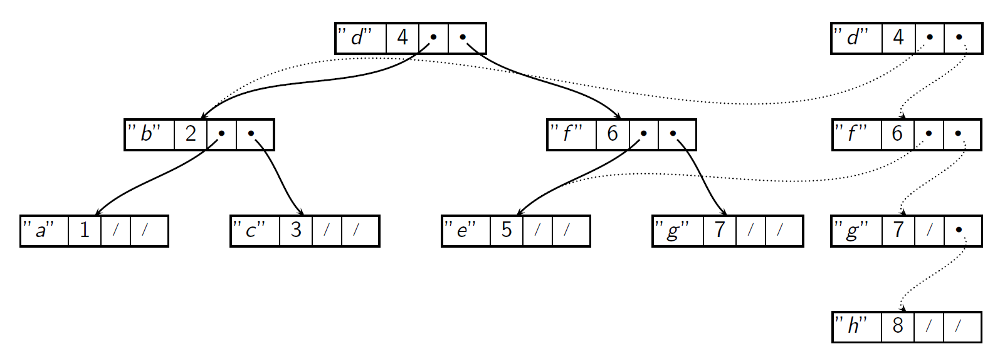

---
title: Haskell 
notebook: Declarative Programming
layout: note
date: 2020-11-08
tags: 
...

# Functional Programming 

## Expression Evaluation 

- conceptually, you can consider Haskell runtime as executing a loop which
  - searches for a function call in the current expression
  - searches for a matching equation for the function
  - sets values of variables in matching pattern to corresponding arguments
  - replaces LHS of equation with RHS
- loop terminates when current expression contains no function calls
- what order should be chosen for rewriting?
  - Church-Rosser theorem: order doesn't matter for final value
  - does matter for efficiency

### Church-Rosser Theorem

- for rewriting system of lambda calculus, regardless of the order in which the 
  original term's subterms are rewritten, final result is always the same
- Haskell is based on variant of lambda calculus, so the theorem holds
- __not__ applicable to imperative languages

## Referential transparency

- __referential transparency:__ expression can be replaced with its value
  - requires expression has no side effects and is pure: must return same
    results on the same input 
- __impure functional language:__ e.g. Lisp, permits side effects like assignment
  so programs are not referentially transparent

## Single Assignment

- imperative/OO languages: variable has current value, which is mutable
- functional languages: variables are __single assignment__
  - no assignment statements
  - immutable: can define variable's value, but cannot redefine it

## Haskell type system

- type system is __strong, safe, static__
- strength refers to how permissive a type system is, with a stronger type
  system accepting fewer expressions as valid than a weaker one
- __strong__: type system guarantees a program cannot errors from trying to
  write expressions that don't make sense
  - no loopholes: cannot make an integer a pointer
    - C: `(char *) 42`
- __safe:__ running program will never crash due to a type error
- __static:__ types are checked when program is compiled
  - c.f. dynamic: types are checked when program is run
  - safe follows partially from static
- types can be automatically __inferred__

## Type classes

- membership of `Ord` implies membership of `Eq`, but not vice cersa

### Deriving

- deriving `Ord` uses ordering in declaration for the comparison function
  - lexicographic ordering used if there are multiple values in top level data constructor

## Disjunction and conjunction

```haskell
data Suit = Club | Diamond | Heart | Spade
data Card = Card Suit Rank
```

- __enumerated type:__ value of type `Suit` is __either__ `Club` or `Diamond` ...
  - disjunction of values
- __structure type:__ value of type `Card` contains a value of type `Suit` __and__
  a value of type `Rank`
  - conjunction of values
- most imperative languages permit types as disjunction or conjunction, but not 
  both at once
- Haskell doesn't have this limitation

### Discriminated Union Types

- __discriminated union types:__ can include both disjunction and conjunction
  - in C, you could create a similar union, but wouldn't be able to determine
    which field was applicable
  - in Haksell, data constructor tells you, hence __discriminated__
- __algebraic type system:__ permits combination of disjunction + conjunction
  - __algebraic types:__ types produced under algebraic type system

```haskell
data JokerColor = Red | Black
data JCard = NormalCard Suit Rank | JokerCard JokerColor
```

- value of `JCard` constructed
  - either using `NormalCard` constructor, containing a value of type `Suit` and a 
    value of type `Rank`
  - or using `JokerCard` constructor, containing a value of type `JokerColor`

## Representing Expressions in Haskell

```haskell
data Expr
    = Number Int
    | Variable String
    | Binop Binopr Expr Expr
    | Unop Unopr Expr

data Binopr = Plus | Minus | Times | Divide
data Unopr  = Negate
```

- very direct, much shorter than C/Java implementation, no comments required

### Errors 

The C implementation is error prone:

- able to access fields that aren't meaningful
  - caught by Haskell, Java compiler
- can forget to initialise fields
  - caught by Haskell compiler
  - not caught by Java
- can forget to process some alternatives
  - caught by Java
  - can be caught by Haskell (with particular flags)

### Memory

- C: requires 8 words per expression
- Java/Haskell: maximum of 4
  - can be __more__ efficient than a C program

### Maintenance

- adding a new expression:
  - Java: add new class
    - implement all methods
  - C: add new alternative to enum
    - add needed members to the type
    - add code for it to all functions handling that type
  - Haskell: add new alternative to the type
    - add code to all functions handling that type
- adding a new operation for expressions
  - Java: add new method to abstract `Expr` class
    - implement it for all classes
  - C: write one new function
  - Haskell: write one new function

## Non-Exhaustive Patterns

- Haskell: Detect with `-fwarn-incomplete-patterns`
  - if not handled, will throw an exception
- C: without default case program may continue and silently compute incorrect result
  - requires more implementation of default cases
- Java: forgetting to write a method for subclass will probably inherit the wrong 
  behaviour of the superclass

## Recursion vs Iteration

- functional languages have no constructs for iteration
- what you do with iteration in imperative languages is done with recursion in functional languages

- viewpoints
  - writing code
  - reliability
  - productivity
  - efficiency

- as Haskell uses lists instead of arrays, compiler can warn when you are going to do something
  wrong.  C compiler can't provide such warnings
- Haskell gives meaningful name to jobs done by loops
- functional program's structure is closer to what you would need to build a correctness 
  argument, helping make them more reliable
- named auxiliary functions helps readability

### Efficiency

- recursive versions of e.g. `search_bst` allocate one stack frame per node traversed
  - iterative version: 1 stack frame overall
  - recursive is less efficient: allocate, fill in, deallocate stack frames
  - recursive version also needs more stack space
- emphasis of compilers on optimisation of recursive code: in many cases they can produce
  iterative code in the target language
- declarative programs are typically slower than if written in C
- depending on which language/implementation, as well as the particular program the slowdown
  can be few percent to 100x.
- other popular languages (Python, Javascript) are also significantly slower than C, and often
  significantly slower than corresponding Haskell programs
- trade off between speed and level of programming language

## Sublists

- write a function `sublists :: [a] -> [[a]]` that returns a list of all sublists of a list
- a list `a` is a sublist of a list `b` iff  every element of `a` appears in `b` in the same order

```haskell
sublists "ABC" = ["ABC", "AB", "AC", "A", "BC", "B", "C", ""]
sublists "BC" = ["BC", "B", "C", ""]
```

Notice: combining "A" with `sublists "BC"`, followed by `sublists "BC"`, gives `sublists "ABC"`
The base case: the only sublist of `[]` is `[]`, so list of sublists is `[[]]`
The recusrive case: sublists of a list is the sublists of its tail, both with and without the head
added to the front of each list

```haskell
sublists :: [a] -> [[a]]
sublists [] = [[]]
sublists (x:xs) = map (x:) tail ++ tail
  where tail = sublists xs
```

## Immutable data structures

- data structures are __immutable__ in declarative languages, i.e. once created they cannot be 
  changed
- to update:
  - create another version of the data structure with changes, and use the new version
  - you can also keep the old version if needed: e.g. undo, statistics, ...

## Polymorphism

- __monomorphic__
- __polymorphic__

## `Data.Map`

- polymorphic tree in standard library is `Map` from the `Data.Map` module
- key functions:

```haskell
insert     :: Ord k => k -> a -> Map k a -> Map k a
Map.lookup :: Ord k => k -> Map k a -> Maybe a
(!)        :: Ord k => Map k a -> k -> a -- infix operator
size       :: Map k a -> Int
```

## `let` vs `where`

- `let` clauses can be used for any expression
- `where` clauses can only be used at the top level of a function

- introduce a name for a value used in the main expression

```haskell
let name = expr in mainexpr
mainexpr where name = expr
```

## Higher Order Functions

- 1st order values: data
- 2nd order values: functions whose arguments, results are 1st order values
- 3rd order values: functions whose arguments, results are 1st or 2nd order values
- __nth order values:__ functions whose arguments, results are values of order up to $(n-1)$
- __higher order values:__ belong to an order higher than 1st
- higher order programming is central to Haskell, and often allows you to avoid writing recursive
  functions

- Higher order programming is widely used in functional programming:
  - code reuse
  - higher level of abstraction
  - canned solutions to frequently encountered problems
- code that fails to use higher order programming is an antipattern, in that there is 
  lots of structural repetition

### Higher order functions in C

- function pointers: `Bool (*f)(int)`
  - ugly, complicated

### Higher order function in Hskell

- much simpler and more natural, but also polymorphic

```haskell
filter :: (a -> Bool) -> [a] -> a
filter f (x:xs) = if f x then x:filter xs else filter xs
```

### Partial Application

- __partial application:__ giving a function that takes $n$ arguments $k$ arguments, $k < n$
- produces a __closure__, recording the identity of the function and the values of those $k$ 
  arguments
- closure behaves like a function with $n-k$ arguments
- a call of the closure leads to a call of the original function with both sets of arguments
  - see e.g. definition I gave of `sublists` above

### Operators and sections

- __section:__ by enclosing an infix operator in parentheses, you can partially
  apply it by enclosing it with __either__ left or right operand

```haskell
> map (5 `mod`) [3,4,5]
[2,1,0]
> map (`mod` 3) [3,4,5]
[0,1,2]
```

### Currying

- you can keep transforming the function type until every single argument is supplied separately

```haksell
f :: at1 -> (at2 -> (at3 -> ... (atn -> rt)))
```

- __currying:__ transformation from function type with all arguments supplied
  together to a function type with all arguments supplied one-by-one
- in Haskell __all function types are curried__
- this is why it uses the arrow syntax for function types
- NB arrow is right associative
- what do you get when you've supplied all arguments?  Either
  - closure containing all the functions arguments, or
  - result of evaluation of the function
- in C, and most other languages, these would be different, but in Haskell, they are equivalent

### Function Composition

```haskell
(f . g) x = f (g x)
```

- __point-free style:__ writing functions without arguments e.g. `minimum = head . sort`
- function composition expresses a sequence of operations: `step3f . step2f . step1f`
- this forms the basis of monads

## Folds

- reduce (or aggregate) a list to a single value
- three types:
  - __left:__ $((((I \odot X_1) \odot X_2) ... ) \odot X_n)$
    - consumes list from left to right
  - __right:__ $(X_1 \odot (X_2 \odot ( ... (X_n \odot I)$
    - consumes list from right to left
  - __balanced:__ $((X_1 \odot X_2) \odot (X_3 \odot X_4))\odot ...$
- fold operation $\odot$: binary "step" function
  - takes an accumulator and a list element and combines them to produce the new accumulator value
- $I$: identity element of the operation, an initial value for the accumulator

### `foldl`

`foldl` takes the step function, the accumulator value, the list to fold, and
returns an accumulated value
```haskell
foldl :: (a -> b -> a) -> a -> [b] -> a
foldl _ acc [] = acc
foldl stepFn acc (x:xs) = foldl stepFn acc' xs
      where acc' = stepFn acc x

suml :: Num a => [a] -> a
suml xs = foldl (+) 0 xs

productl :: Num a => [a] -> a
productl = foldl (*) 1 

concatl :: Num a => [[a]] -> [a]
concatl = foldl (++) []
```

- `foldl` is a poor choice in real Haskell, as it can produce __space leaks__
  - small expressions: code operates normally, but uses much more memory than it should
  - large expressions: stack overflow
  - `Data.List` has `foldl'` that doesn't build up thunks

### `foldr`

`foldr` takes the step function, the accumulator value, the list to fold, and
returns an accumulated value

```haskell
foldr :: (a -> b -> b) -> b -> [a] -> b
foldr _ acc [] = acc
foldr stepFn acc (x:xs) = stepFn x acc'
      where acc' = foldr stepFn acc xs

sumr :: Num a => [a] -> a
sumr xs = foldr (+) 0 xs

productr :: Num a => [a] -> a
productr = foldr (*) 1 

concatr :: Num a => [[a]] -> [a]
concatr = foldr (++) []
```

Note: as sum, product, concatenation are associative, we can define them using either `foldl` or `foldr`

### Balanced fold

- see lecture slides

### More folds

- `maximum` has no identity element, and will error if the list is empty
- Prelude defines:

```haskell
foldl1 :: (a -> a -> a) -> [a] -> a
foldr1 :: (a -> a -> a) -> [a] -> a

maximum = foldr1 max
minimum = foldr1 min
```

- these compute, e.g. 
- __`foldl1`:__ $((((X_1 \odot X_2) \odot X_3) ... ) \odot X_n)$

- can compute length of a list by summing 1 for each element

```haskell
const :: a -> b -> a
const a b = a

length = foldr ((+) . const 1) 0
```

- `map` can also be defined in terms of folds:

```haskell
map = foldr ((:) . f) []
```
- you can reverse a list by reversing cons

```haskell
reverse = foldl (flip (:)) []
```
### `Foldable`

- you can fold over any type in type class `Foldable`
- to make a type an instance of `Foldable`, define `foldr` for our type
- this allows standard functions (`length`, `sum`, ...) to work on that type

## Type System

### `gcc`

- `gcc`: initially implemented by Stallman, who was a Lisp programmer
  - Lisp is dynamically typed
  - code being compiled is therefore represented in nodes which are a big union of various fields
  - produces various errors in handling these unions, which require lots of checking
  - slows down `gcc` by 5%-15%
  - violations are only detected at runtime
  - code is harder to read and write
- algebraic type system isn't vulnerable to these errors

### Generic lists

- in C, you can use `(void *)` and store a heterogeneous set of elements
- might be convenient, but then elements need to be cast to the correct type, which can easily be done incorrectly
- alternatively: use separate list types for every different type of item
  - safe, but lots of duplication, and all the problems that come with it
- Haskell type system is increasingly being copied by other languages
- no other well-known language supports full algebraic types
- e.g. application: unit mismatch on physical measurements
  - solve in Haskell with data constructor that gives the unit: `data Length = Metres Double`

## Monads

- __monad:__ type constructor representing a computation
  - computations can be composed to create other computations
  - power: programmer's ability to determine how computations are composed
  - "programmable semicolons"

### Implementing a monad

A monad `M` is defined with 3 things:

- Type constructor `M`
- Definition of `return :: a -> M a`
  - identity operation, injects a normal value into the chain
  - i.e. you can take a value of type `a` and wrap it in the monad's type constructor
  - acts as a bridge between the pure and the impure
  - _returns_ a pure value
- Definition of `>>= :: M a -> (a -> M b) -> M b`: sequencing
  - chains output of one function as the input of another
  - unwraps the first argument, invokes the function given as the second argument, returning the wrapped result

- think of `M a` as a computation producing an `a`, and possibly carries something extra
  - e.g. if `M` is `Maybe`: the "extra" bit is whether or not an error has occurred

### `Maybe` Monad

```haskell
data Maybe t = Just t | Nothing

return x = Just x

(Just x) >>= f = f x
Nothing >>= _ = Nothing
```

- once you get a failure (`Nothing`), you perform no further operations

### `IO`

- Haskell has `IO` type constructor
- function returning type `IO t` returns a value of type `t`, but can also do IO

```haskell
-- reading
getChar :: IO Char
getLine :: IO String

-- writing
putChar :: Char -> IO ()
putStr :: String -> IO ()
putStrLn :: String -> IO ()
print :: (Show a) => a -> IO ()
```

- `()` unit: type of 0-tuples
  - similar to `void` in C/Java
  - only one value of this type, the empty tuple, `()`

- type constructor `IO` is a monad
- identity: `return val` returns `val` inside `IO` without doing any IO
- sequencing: `f >>= g`
  - calls `f`, which may do IO, and returns a value `rf` that may be meaningful (or `()`)
  - calls `g rf`, which may do IO, and returns `rg`
  - return `rg` inside `IO` as the result of `f >>= g`
- you can use sequencing to chain together any number of IO actions

```haskell
-- monadic hello world
hello :: IO ()
hello = putStr "Hello, " >>= \_ -> putStrLn "world!"
```

- 2 IO actions
  - call to `putStr`, printing the first half of the message, returning `()`
  - second is an anonymous function, ignoring the input, and printing the rest of the message


### `do` blocks

Syntactic sugar time: write things under `do`

```haskell
greet :: IO ()
greet = do
    putStr "Enter name: "
    name <- getLine
    putStr "Enter address: "
    address <- getLine
    let msg = name ++ " lives at " ++ address
    putStrLn msg
```

- Haskell is layout sensitive: you need to indent actions the same or else they won't be considered
  part of the `do` expression
- elements of `do` block
  - IO action returning an ignored value (usually of type `()`) e.g. `putStr` and `putStrLn` above
  - `var <- expr`: IO action whose return value is used to bind a variable
  - `let var = expr`: binds a variable to a non-monadic value (N.B. no `in`)

### `return`

- for functions doing IO and returning a value, if the code that computes the return value
  does no IO, you need to invoke `return` as the last operation in the block

```haskell
readlen :: IO Int
readlen = do
    str <- getLine
    return (length str)
```

### I/O actions as descriptions

- functions returning type `IO t` don't actually _do_ the action, but you can think of them as returning:
  - a value of type `t`
  - a __description__ of an IO operation
- `>>=` then takes descriptions of 2 IO operations, and returns a description of those two operations executed in order
- `return` associates a description of a do-nothing operation with a value

### `main`

```haskell
main :: IO ()
```

- `main` is where program starts execution:
- conceptually:
  - OS starts program invoking the Haskell runtime system
  - runtime system calls `main`, which returns a description of a sequence of IO operations
  - the runtime system executes the sequence of IO operations
- reality:
  - compiler + runtime system together ensure each IO operation is executed once the description is computed provided:
    - all previous operations have been executed to avoid executing operations out of order
    - description will end up in the lost of operation descriptions returned by `main`: you don't want to execute 
      IO operations a program doesn't actually call for

### Non-immediate Execution of IO actions

- existence of a description of an IO action does not mean it will eventually be executed
- descriptions of IO operations can be passed around:
  - build up lists of IO actions
  - put IO actions into BST as values
  - select a value from a list/tree, and execute it by including it in list of actions returned by `main`

### IO in Haskell programs

- in imperative languages (C, Java, Python), the type of a function doesn't tell you if a function does IO
- Haskell very explicitly does
- most Haskell programs: vast majority of functions are not IO functions, but transform data structures and perform calculations
- IO code is then a small amount on top
- produces __low coupling__ between IO code and non-IO code
- __optimisations:__ code that does no IO is able to be arrange: 
- __parallelism:__ calls to functions that do no IO can be done in parallel

### Debugging printf

- `unsafePerformIO :: IO t -> t` allows you to perform IO anywhere, but order of output is probably wrong
  - useful for debugging
  - you give it an IO operation (a function of type `IO t`
  - `unsafePerformIO` calls it, returning a value of type `t` and a description of an IO operation
  - `unsafePerformIO` executes the described operation and returns the value

### `State` Monad

- useful for computations that need to thread information throughout the computation
- allows information to be transparently passed around a computation, and updated/accessed as needed
- allows imperative programming style without losing declarative semantics

- here's a function that adds 1 to each value in a tree.  Doesn't need a monad

```haskell
data Tree a = Empty | Node (Tree a) a (Tree a)
    deriving Show

type IntTree = Tree Int

incTree :: IntTree -> IntTree
incTree Empty = Empty
incTree (Node l e r) = Node (incTree l) (e + 1) (incTree r)
```

- what if we want to add 1 to leftmost element, 2 to next element, ...
- we'd need to pass an integer into our function saying what to add, and pass an integer out, saying what to add to the next element
- we return a pair of the updated tree and the current value
- the code is a bit complex

```haskell
incTree1 :: IntTree -> IntTree
incTree1 tree = fst (incTree1' tree 1)

incTree1' :: IntTree -> Int -> (IntTree, Int)
incTree' Empty n = (Empty, n)
incTree' (Node l e r) n = (Node newl (e + n1) newr, n2)
    where (newl, n1) = incTree1' l n
          (newr, n2) = incTree2' r (n1 + 1)
```

- the `State` monad abstracts away the type `s -> (v, s)`
  - `s`: state
  - `v`: value
- using it with `do` allows you to focus on the `v` and ignore the `s` where it isn't relevant

```haskell
incTree2 :: IntTree -> IntTree
incTree2 tree = fst (runState (incTree2' tree) 1)

incTree2' :: IntTree -> State Int IntTree
IncTree2' Empty = return Empty
incTree2' (Node l e r) = do
    newl <- incTree2' l
    -- get current state
    n <- get
    -- set the current state
    put (n + 1)
    newr <- incTree2' r
    return (Node newl (e+n) newr)
```

- as we don't need arbitrary update of the integer state, we can define a `Counter` that simply increments

```haskell
type Counter = State Int

withCounter :: Int -> Counter a -> a
withCounter init f = fst (runState f init)

nextCount :: Counter Int
nextCount = do 
    n <- get
    put (n+1)
    return n

incTree3 :: IntTree -> IntTree
incTree3 tree = withCounter 1 (incTree3' tree)

incTree3' :: IntTree -> Counter IntTree
IncTree3' Empty = return Empty
incTree3' (Node l e r) = do
    newl <- incTree3' l
    n <- nextCount
    newr <- incTree3' r
    return (Node newl (e+n) newr)
```

## Lazy Evaluation

- __eager evaluation:__ each expression is evaluated as soon as it is bound to a variable, whether explicitly, in an assignment statement, or implicitly during a call
  - most programming languages
- __lazy evaluation:__ expression is not evaluated until its value is needed, when:
  - program wants value as input to arithmetic operation
  - program wants to match the value against a pattern
  - program wants to output the value
- Haskell uses lazy evaluation
- allows you to work with conceptually infinite data structures (e.g. `[1..]`
- see sieve of Erastosthenes example

### Representation of unevaluated expressions

- the code to execute to eventually provide a value needs to be remembered
- __suspension/thunk/promise__: Haskell compiled to C (e.g. using GHC) stores this code to execute with 
  - a pointer to a C function
  - all arguments you need to give to the C function
- _suspension_: computation whose evaluation is temporarily suspended
- _promise:_ promise to carry out a computation if needed
- _thunk_: first name given to it in Algol-60

### Parametric Polymorphism

- permits functions to work independently of type variables
- implementation requires values of all types can be represented in the same amount of memory
  - e.g. `length` wouldn't be able to handle lists with elements of all types without this
- word size is the size of a pointer: anything that doesn't fit into one word is represented by a pointer
  to a chunk of memory on the heap
- suspension's arguments can then be stored in an array of words
  - all functions can be arranged to take arguments from a single array of words

### Evaluating lazy values only once

- many functions use the values of some variables multiple times, e.g. `takeWhile` uses `x` twice:

```haskell
takeWhile _ [] = []
takeWhile p (x:xs) 
    | p x       = x : takeWhile p xs
    | otherwise = []
```

- you need to know the value of `x` for the test `p x`
- this requires calling the function in the suspension representing `x`
- if the test succeeds, you again need to know `x` to put it at the front of the output list 
- to avoid redundant work: 
  - call to `x`'s suspension to record the result
  - all references to `x` then get the value from this record
- now once the result of the call is no, you don't need the function and arguments anymore

### Call by need

- __call by need:__ function arguments and other expressions are evaluated only when their value is needed
  - c.f. call by value

### Implementing Control Structures

- lazyness guarantees expressions will not be evaluated if its value is not needed
- programmers can define their own control structures as functions

e.g. if-then-else which returns the value of one of 3 expressions, depending on whether an expression is $>, =, < 0$:

```haskell
ite :: (Ord a, Num a) => a -> b -> b -> b -> b
ite x lt eq gt
    | x < 0  = lt
    | x == 0 = eq
    | x > 0  = gt
```

### Avoiding unnecessary work

```haskell
minimum = head . sort
```

- looks wasteful: sorting is usually $O(n^2)$ or $O(n \log{n})$
- `minimum` should be doable in $O(n)$
- evaluation of the sorted list however can stop after the first element has materialised
- (still higher overhead than standard definition)

### Multiple passes

```haskell
output_prog chars = do
    let anno_chars = annotate_chars 1 1 chars
    let tokens = scan anno_chars
    let prog = parse tokens
    let prog_str = show prog
    putStrLn prog_str
```

- takes as input one data structure `chars` and calls for construction of four others: `anno_chars`, `tokens`, `prog`, `prog_str`
- this pass structure occurs frequently
- eager evaluation: completely construct each data structure before starting construction of the next
  - maximum memory needed: size of largest data structure (pass n), plus size of any part of the previous data structure (pass n-1)
    needed to compute the last part of pass n
  - all other memory can be garbage collected before then
- lazy evaluation: execution driven by `putStrLn`, which needs to know what the next character to print should be
  - for each character to print, the program materialises the parts of the data structures needed to determine this
  - memory demand: tree of suspensions from earlier passes needed to materialise the rest of the string to print
  - can be significantly lower than eager evaluation demands

### Lazy Input

- in Haskell, input is implemented lazily
- `readFile` returns the contents of the file as a string, but it returns the string lazily
  - i.e. it reads the next character from the file _only_ when the rest of the program needs it

```haskell
parse_prog_file filename = do
    fs <- readFile filename
    let tokens = scan (annotate_chars 1 1 fs)
    return (parse_prog [] tokens)
```

- when the main module calls `parse_prog_file` it gets back a tree of suspensions
- only when the suspensions start to be forced is input file read
- each call to `evaluate_suspension` on the tree causes only as much to be read as is needed to figure out the value of the forced data constructor

## Performance

### Effect of Lazyness on Performance

- overhead from lazyness
  - creation of suspensions, unpacking of suspension when they need to be executed
  - each access to a value needs to check whether the value has been materialised
- benefits from lazyness
  - avoid executing long-running/non-terminating computation
- whether benefits outweigh the costs depends on particulars of program and input
- in most cases you lose a bit, sometimes you win a little, rarely you win a lot

### Strictness

- __bottom__ $\bot$: value of an expression whose evaluation loops infinitely, or throws an exception
- a __strict__ function always need the values of all its arguments
  - if any of its arguments is $\bot$ then its result will be $\bot$
- `+` is strict
- `ite` from previous section is non-strict
- __strictness analysis:__ compiler pass to analyse program code and figure out which functions are/aren't strict
  - when a strict function is found, instead of generating code that creates a suspension, it can generate code
    that an imperative language compiler would generate, i.e. code that evaluates all arguments, then calls the function
  - performed by some compilers including GHC

### Unpredictability

- lazyness makes it more challenging to understand where the program is spending most time, and where most memory gets allocated
- small changes in when/where program demands a value can cause large changes in the parts of a suspension tree that are evaluated
  - large change in time/space complexity
- Haskell implementations provide advanced profilers to help with this

### Memory Efficiency

- immutable data structures mean that more memory needs to be allocated and written, taking time and requiring extra garbage collection

#### Inserting into a BST

- replace one node on each level of tree
- for a roughly balanced tree of $n$ nodes, the height is roughly $\log_2{n}$
- number of nodes allocated during insertion scales logarithmically with size of the tree
- if old version of tree isn't needed: imperative does better, as it only needs to allocate a single node
- if old version of tree is needed: imperative does worse.  Entire tree needs to be copied
- note that any nodes that don't get updated become a part of the new tree
  - e.g. image below shows insertion of key `h` into BST with keys `a` to `g`



### Deforestation

- many Haskell programs have code following this pattern
  - start with first data structure `ds1`
  - traverse `ds1` to produce `ds2`
  - traverse `ds2` to produce `ds3`
- if programmer can restructure code to compute `ds3` directly from `ds1`, this will speed up the program, as:
  - no longer need to create `ds2`
  - 1 traversal instead of 2
- this process, of eliminating intermediate data structure (typically a tree or similar), is called __deforestation__

#### Basic deforestation

- you can always deforest two calls to `map`
```haskell
map (+1) $ map (2*) list
-- becomes the more succinct, elegant, efficient:j
map ((+1) . (2*)) list
```

- similarly you can combine filters:

```haskell

filter (>=0) $ filter (<10) list
-- becomes
filter (\x -> x >= 0 && x < 10) list
```
### `filter_map`

```haskell
-- two list traversal
two_pass xs = map triple (filter is_even xs)

-- implement filter map to perform filtering and mapping at the same time
filter_map :: (a -> Bool) -> (a -> b) -> [a] -> [b]
filter_map _ _ [] = []
filter_map p m (x:xs) = if p x then (m x):xs' else xs'
    where xs' = filter_map p m xs

-- now we can do the same with one list traversal 
one_pass xs = filter_map is_even triple xs
```

### Standard deviations

- see lecture slides

### Cords

- repeated appends to the end of a list take time quadratic in the final list length
- imperative approach: keep a pointer to list tail, and destructively update tail $O(1)$
- declarative approach: switch from lists to cords for $O(1)$ appends

```haskell
data Cord a = Nil | Leaf a | Branch (Cord a) (Cord a)

append_cords :: Cord a -> Cord a -> Cord a
append_cords a b = Branch a b
```
- to convert a cord to a list, you might try:

```haskell
cord_to_list :: Cord a -> [a]
cord_to_list Nil = []
cord_to_list (Leaf x) = [x]
cord_to_list (Branch c1 c2) = (cord_to_list c1) ++ (cord_to_list c2)
```

- but this has the same performance problem (using append)
  - second equation puts empty list behind all leaves
  - all but one of the lists it creates is copied again
- take 2: use an accumulator

```haskell
cord_to_list :: Cord a -> [a]
cord_to_list 

cord_to_list' :: Cord a -> [a] -> [a]
cord_to_list' Nil xs = xs
cord_to_list' (Leaf x) xs = x:xs
cord_to_list' (Branch c1 c2) xs = cord_to_list' c1 (cord_to_list' c2 xs)
```

### Sortedness

- see lecture slides

### Optimisation

- e.g. compilation with `ghc -dynamic -c -O3`
- can give better results than hand-optimised code

## Interfacing with Foreign Languages

## Parsing

