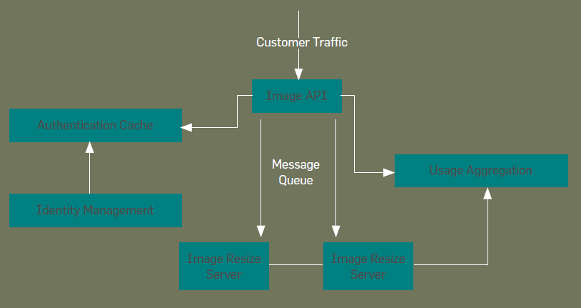

---
title: Challenges
notebook: Distributed Systems
layout: note
date: 2020-08-12
tags: 
...

[TOC]: #

## Table of Contents

## Distributed Systems 

- __distributed systems__
  - networked system components communicate and coordinate actions through message passing alone
  - collection of independent computers that appears to users as a single, coherent system
- key points
  - _multiple_ components in the system
  - _communication_ between components
  - _synergy_ between components, such that they achieve more than the sum of individual components

### Computer Networks vs Distributed Systems

- computer network: independent, interconnected computers that exchange messages based on particular
  protocols
- distributed system: multiple computers on the network __collaborating__ as a system.  Spatial 
  separation and communication aspects are hidden from users

### Benefits

- __resource sharing__
  - hardware: disks, printers, scanners
  - software: files, databases
  - other: processing power, memory, bandwidth
- __benefits of resource sharing__
  - economy
  - availability
  - reliability
  - scalability

### Consequences

- __concurrency:__ services provided by DS will be accessed by multiple users simultaneously
  - system design needs to account for this use case, and implement concurrency techniques
- __no global clock:__ 
  - individual computers have independent clocks
  - limits to the degree of clock synchronisation as all communication is via message passing
  - system design needs to handle absence of global clock, and implement synchronisation techniques
- __independent failures:__ some components may fail while others continue to run
  - failure of some components will not be known immediately by others

## Wireless networks

Paradigms making heavy use of wireless networks:

- __Mobile/nomadic computing:__ users can perform computing tasks on the move,
  while being part of a DS
- __Ubiquitous computing:__ small, cheap embedded computing devices used as part of a DS
- __IoT:__ everyday objects are addressable and connected to the Internet.

# Challenges

## Heterogeneity

- disparate hardware and software.  Big challenge
- e.g. different browsers implement many different features
- variation in:
  - networks
  - computer hardware
    - e.g. representation of integer data types: big endian/little endian
  - operating systems: different system calls
  - programming languages
  - implementations by different developers

### Approaches

  - standard protocols
  - agreed upon message formats and data types
  - adhering to an API
  - using middleware
  - portable code (Java)

### Middleware

- __middleware:__ software layer between distributed application and OS
  - provides programming abstraction
  - masks heterogeneity of underlying resources (hardware, OS, ...)
- may only address a subset of heterogeneity issues
- e.g. Java RMI doesn't address programming language heterogeneity 

#### Middleware models

- Distributed file systems
- RPC (procedural languages)
- RMI (OO languages)
- distributed documents
- distributed databases

### Mobile Code

- __mobile code__ is sent from one computer to another to be run at the destination
  - e.g. Java applets
- code compiled in one OS doesn't run on another architecture, OS
- __Virtual machine__ approach: compiler produces code interpreted by the VM, allowing code
  executable on any hardware
- cross-platform compilation also works

## Openness

- __openness:__ ability to extend the system by adding hardware/software resources
- e.g. Skype: closed
- e.g. Internet: open protocols has allowed it to scale

### Approaches

- publish key interfaces
- ensure all implementations adhere to published standards

## Security

- __Confidentiality__: protection against disclosure to unauthorised individuals
- __Integrity:__ protection against alteration/corruption
- __Availability:__ protection against interference with means of access (e.g. DoS)
  - measure of proportion of time system is available for use 

- security against mobile code: executables as attachments

### Approaches

- encryption (e.g. RSA)
- authentication (e.g. passwords, public key authentication)
- authorisation (e.g. Access control lists)

## Scalability

- __scalability:__ ability to handle growth of number of users 

- __controlling cost of resources:__ ideally scales linearly with number of users
  - always will have some overhead to manage resources
- __controlling performance loss:__ dependent on underlying distributed algorithms
  - $O(n^2)$ would not be scalable
  - $O(\log{n})$ is scalable
- __preventing resources running out:__ e.g. IPv4 addresses; use of particular data types
- __avoiding performance bottlenecks:__ resolved with decentralised architectures/algorithms

## Failure Handling

- __detection__: 
  - some failures can be detected e.g. with checksums 
  - others are hard to be certain of, e.g. remote server failure
- __masking__: hide/ameliorate effects of failure
  - e.g. message retransmission after timeout
  - e.g. Zoom may mask errors by interpolating frames
- __tolerating__: sometimes better to tolerate errors, rather than try to handle them
  - e.g. render video with a frame dropped, or report failure to user
- __recovery__: ability to rollback if failure produces corrupted data
- __redundancy__: tolerate failure through redundancy
  - __failover:__ multiple servers provide the same service

## Concurrency

- multiple clients accessing a shared resource at the same time
- sequential access could handle it but slows down system
- semaphores used by OS to handle concurrency
- e.g. starting up a system also poses concurrency issues: comment that if all
  of Google was switched off it couldn't be restarted

## Transparency

- hiding components of distributed system from user and application programmer
  - system doing something at a lower level that isn't seen by the user
- e.g. on a mobile phone, while moving around, the hardware will change between
  cells and frequencies without user being aware of it
- sometimes you don't want transparency: some failures need to involve the user e.g. if
  the Ethernet cable is unplugged

- __network transparency:__ combination of access/location transparency.  Most important: strongly
  affects utilisation of distributed resources 
  - e.g. email address `username@domain.com`: consists of username and domain name.  To send mail
    you don't need to know physical/network location of mail server, and it is independent of the
    location of the recipient
- __access transparency__: e.g. distributed file system.  API you use to access
  files locally should be the same as the API you use to access remotely.  That way
  applications don't need to change depending on whether you're accessing locally/remotely.  
  - e.g. GUI with folders behaves/looks the same whether files are local or remote
- __location transparency:__ access resources without knowledge of physical/network location
- __mobile transparency:__ movement of resources/clients in a system without affecting operation of
  users or programs
  - e.g. moving between cell towers while on a phone call: participants are unaware of change
- Note: __location transparency__ is more about server side-changes, while __mobile transparency__ is more about client-side changes
- __concurrency transparency:__ several processes can operate concurrently on shared resources 
  without interference
- __replication transparency:__ multiple resource instances can be used for reliability and 
  performance without knowledge of replicas by users/application programmers
- __failure transparency:__ concealment of faults, so that users can complete their tasks despite
  failures
- __performance transparency:__ reconfiguration of system to improve performance as load varies
- __scaling transparency:__ allows system to expand in scale without change to system structure
  or applications

## Quality of Service

- main non-functional properties:
  - reliability
  - security
  - performance
  - adaptability
  - availability

## Web Services and APIs

- __web services:__ allows programs (other than browsers) to be clients for web programs
- data passed as XML/JSON
- __SOAP protocol__ allows clients to invoke web services (XML format)
- __REST (REpresentational State Transfer) architecture:__

### Success of WWW

- data is distributed over web servers
- manageable and extensible
  - __interoperable:__ different implementations of server/client are able to work together
  - open system
    - __extended__ and implemented in new ways without disturbing existing functionality
    - open with respect to the types of __resource__ that can be published/shared
  - process __faults are isolated__ to individual servers/clients
  - hyperlinks: allow clients to discover other servers, without client needing to store a list of all servers
- search engines provide indexing and rapid searching for content
- organisations can administer their own part of the WWW with their own policies
- API allows for wide variety of more complicated applications, instead of simply static content
- predecessor e.g. gopher based on a subscription model, and was not widely adopted

# Building a Distributed System (Paper)

- distributed systems
  - difficult to design, build, operate
  - many more variables in the design than with a single machine
  - root cause analysis much more difficult
  - failures manifest as intermittent errors, decreased performance: difficult to diagnose and reproduce
- reasons for building a DS
  - demands of API, website etc. exceed ability of a single machine
  - migrating an existing application to the cloud for cost saving on hardware/data centre
    - often requires rewriting: applications will not function if not designed for DS

### Architecting

- service oriented architecture (SOA): loosely coupled services, each serving a small and independent function
  - solid principle for resilient DS
  - services are the new process: the right abstraction level for discrete functionality
- to construct a SOA
  - identify each function making up the business goals of the application
  - map these into discrete services that can be scaled, with well defined fault boundaries
- consider for each service
  - geography: global? region based?
  - data segregation
  - service level agreements: latency, availability, throughput, consistency, durability guarantees
  - security: identity, authentication, authorisation, audit
    - data confidentiality
    - privacy
  - usage tracking: capcacity planning, billing
  - deployment

## Web service that resizes images

### Requirements

- system ingests images, converts them, makes available to customer ASAP
  - response time acceptable to interactive user (web browser)
- assume images aren't stored
- customers need to identify themselves
- usage-based pricing model
- each data centre is isolated
- assume maximum users 100,000
  - maximum requests per second per region: 10,000
- 99.9% availability in a month
- 99th percentile of latency less than 500ms for images under 1MB

### Is a distributed system needed?

- 10,000 resizes per second
- assume 256kB per image, 10 conversions per second per CPU core
- 32 core processor can support 320 conversions per second
- 32 image-processing servers required
- add 20% for surge capacity: ~ 40 servers is a lower bound
- clearly DS is justified

### Services

- services:
  - customer-facing API (e.g. REST)
  - message queue to send requests to compute servers
  - identity manager with authentication cache
  - usage aggregation: analytics, billing
- provides
  - separation of concerns for failure modes
  - scaling
  - consistency

### Image API

- make as many pieces of DS stateless as possible: state is where challenges arise
- geography: API servers only serve a particular region
- availability: worst number the system/software/data centre/network can offer
  - 99.99% availability for API: 5 mins downtime per month
- latency: latency of a request is sum of latencies to dependent systems
  - ~ 1-10ms
- throughput: ~ 3 servers to handle traffic
  - means load balancing needed; can use DNS round-robin
- consistency: stateless
- security: customers need credentials
  - users cannot access other's input/output images
- usage tracking: meter all requests on per-customer basis; API needs to be designed with this in mind
- custom implementation as the API is highly particular to the business logic 

### Message Queue

- many more servers needed to handle image processing than to handle API
- message queue: 
  - API server is producer, image processing servers are consumer
  - provides FIFO
  - user resize times will degrade when system is too busy
  - supports scalability
  - prioritises consistency over availability
- geography: run a MQ per region
- data segregation: one MQ per region
- latency: sub-ms latency, most MQs support this
- throughput: MQ used bidirectionally, needs to support 20,000 requests per second
- consistency: queue provides FIFO semantics, strong consistency

### Platform Components

#### Identity, authentication

- customer management will happen far less than Web service requests
- critical function, but not value-adding: latency must be as low as possible
- scaling is necessary to keep up with service requests
- authentication events aren't cacheable, but data required to serve them is
  - largely read-only
  - allows decoupling of data plane and management plane, such that they can be independently scaled
  - tradeoff: 2 separate systems, with eventual consistency

#### Usage collection

- write intensive, and read infrequently, often only once (for billing)
- difficult aspect: need to process larger number of records than requests with reasonable read latency
- approach: local grouping of usage records on each API server by time/size boundaries

### Architecture Takeaways

- decompose business application into discrete services
- make as much as possible stateless
- when dealing with state, depend on CAP, understand latency, throughput, durability requirements

### Implementation

- usually not a good approach to survey software and glue it together: each system is implemented with assumptions by engineers implementing it
- important to understand these assumptions and the resulting trade-offs, and how these will impact your system
  - some software is compatible with your assumptions, other software will not be
- when you need to implement software, assess prior art
  - use strong points and then rejig for your needs

### Testing and validation

  - very difficult
  - system needs to be empirically validated
  - total outages relatively uncommon, degraded service for brief periods is very likely
  - failures and degraded state need to be introduced regularly, as failures can and will happen.  This helps understand component dependencies
  - e.g. Netflix Chaos Monkey

### Operations

- capture, analyse all aspects of hardware and OS, network, application software: if it moves, measure it
- components:
  - realtime monitoring to respond to failures
  - analytics
- amount of data likely will exceed amount of data serving business function: this probably requires its own DS to manage the DS
