---

title: Models
notebook: Distributed Systems
layout: note
date: 2020-08-12
tags: 
...

[TOC]: #

## Models

Models are used to provide abstract, simplified, consistent description of some aspect of interest
of distributed system design.  

- __physical:__ describe types of computers/devices that constitute a system and their 
  interconnectivity without details of specific computer/networking technologies
  - most explicit
  - considers underlying hardware elements
- __architectural:__ describe system in terms of computational and communication tasks performed
  by computational elements
  - e.g. client-server, peer-to-peer
  - __elements:__ components of the system which interact
  - __patterns:__ how components are mapped to underlying system
  - __middleware:__ existing solutions to common problems
- __fundamental:__ abstract perspective to describe solutions to particular issues faced by most
  distributed systems
  - non-functional aspects e.g. interaction, failure, security, reliability, performance

## Physical Models

- __baseline:__ extensible set of computer nodes interconnected by computer network for passing
  of messages
- 3 generations of distributed systems

### 1970s-80s, early distributed systems

- 10-100 nodes
- local area network, usually Ethernet
- limited Internet connectivity: file transfer, email
- shared local printers and file servers

### 1990s, Internet-scale distributed systems

- large-scale distributed systems emerged with rapid growth in Internet
- extensible set of nodes interconnected by network of networks (i.e. the Internet)
- significant heterogeneity: networks, computer architecture, operating systems, languages, ...
- emphasis on open standards

### Contemporary distributed systems

- nodes in earlier generations were primarily desktop computers which were:
    - _static_: not moving around
    - _discrete_: not embedded in other objects
    - _autonomous_: largely independent of other computers
- in contrast, modern distributed systems don't satisfy these properties:
  - _mobile computing_: nodes have varying location, needing service discovery and spontaneous 
    interoperation
  - _ubiquitous computing_: computers embedded in everyday objects
  - _cloud computing_: pools of nodes together providing a service

## Architectural Models

- system architecture: structure in terms of separately specified components and their 
  interrelationships
  - goal: ensure the structure meets present/future demand
  - concerns: reliability, managability, adaptability, cost-effectiveness

- __architectural elements:__ interacting components of system
- __architectural patterns:__ 
- __middleware__

## Architectural Elements

Building blocks: 

- communicating __entities:__ 
  - system perspective: threads, processes, nodes
  - programming perspective: objects, components, web services
- communication __paradigm:__ e.g. message queue, publish/subscribe
- __roles and responsibilities:__ e.g. client, server, peer
- __placement:__ mapping onto physical distributed infrastructure

### Communicating Entities

System-oriented perspective 

- __processes:__ usually processes are the communicating entities
  - __threads:__ strictly threads may be the endpoints of communication
- __nodes:__ sensor networks, OS may not support process abstraction

Problem-oriented perspective

- __objects:__ objects accessed via interfaces
- __components:__ specify interfaces and make dependencies explicit, providing a more complete
  contract with which to construct the system than objects 
- __web services:__ closely related to objects/components. Intrinsically integrated with the WWW,
  using web standards to represent and discover services.
  - software application identified by a URI with interfaces defined, described, discovered as XML
  - supports direct interaction with other software agents via XML message exchange through IP
- objects/components are usually internal to an organisation for tightly coupled applications
- web services are complete services

### Interfaces

- __interface definition:__ specifies set of functions that can be invoked by external processes
- programmers need not know underlying implementation of the service, only the abstraction offered
- a stable interface can change transparently
- careful design needed: performance may be impacted if many messages need to be exchanged to get things done
- backwards compatibility/breaking changes need to be carefully considered
- ideally: succinct, expressive

### Communication Paradigms

#### Direct Communication: coupled senders/receivers

- __interprocess communication:__ low-level support for communication between processes in 
  distributed systems
  - message passing primitives, socket programming, multicast
- __remote invocation:__ most common communication paradigm for distributed systems
  - 2 way exchange between communicating entities which resulting in remote operation being 
    called

#### Examples: Remote Invocation

- __request-reply protocol:__ pattern on message-passing to support client-server computing
  - pairwise message exchange
  - most DS use RPC/RMI, but both are supported by 
    underlying request-reply exchanges
- __remote procedure call (RPC):__ procedures in processes on remote computers can be called
  as if they are procedures in the local address space.
  - baked in access and location transparency
- __remote method invocation (RMI):__ resembles RPC but in a world of distributed objects
  - a calling object invokes a method in remote object

#### Indirect Communication: allow decoupling of senders/receivers

Uncoupling

- __space uncoupling:__ senders don't need to know who they are sending to
- __time uncoupling:__ senders/receivers don't need to exist at the same time

#### Examples: Indirect Communication 

- __group communication:__ delivery of messages to set of recipients; one-to-many
  - abstraction of group with an ID, which maintains group membership
  - recipients elect to receive messages by joining a group
  - senders send messages to the group using the group ID
- __publish-subscribe:__ large number of producers distributing information to a large number
  of consumers (with different interests); one-to-many
  - uses intermediary service to ensure efficient routing of information from producers to 
    consumers
- __message queues:__ point-to-point service; producer sends messages to a specified queue
  - consumer receives messages from the queue
- __tuple space:__ processes can place structured data in a persistent tuple space
  - other processes can read/remove tuples by specifying patterns of interest
  - readers/writers don't need to exist simultaneously
- __distributed shared memory:__ abstraction for sharing data between processes that don't share
  physical memory

### Roles and Responsibilities

- _processes_, not machines, are the subject of roles
- __client-server/centralised:__ client processes interact with individual server processes
  - __client__ processes establish connections with server
  - __server__ processes listen for incoming connections
  - clients never communicate: everything goes through the server
  - most important and most widely used architecture
- __peer-to-peer/decentralised:__ all processes play similar role as peers
  - resources of each peer are used, so the system resources scale with the number of users
  - substantially more complex than client-server architecture
  - any process can make/receive connections from any other process
  - no hierarchy: all processes have same capabilities
  - in many systems some peers contribute more than others (seed, super peer)
  - reliable: no single point of failure: if a client fails, probably won't be noticed
  - available: difficult to deny service for adversaries, as no central point of control
  - non-homogeneous: peers likely have different resources
  - e.g. BitTorrent
- P2P vs C-S __security__: 
  - for client server to be insecure, server has to be compromised. Requires
    a lot of trust in server: if attacker compromises the server, that's all that's needed
  - P2P: attacker may have to break many components to take down system/get data

#### Napster

- __hybrid architecture:__ client/server + P2P
  - (C/S) clients send list of music and IP address to index server
  - (C/S) another client queries the index server, looking for some music
  - (C/S) index server replies with IP addresses of those that have the music
  - (P2P) client then establishes connections to these peers to start the download

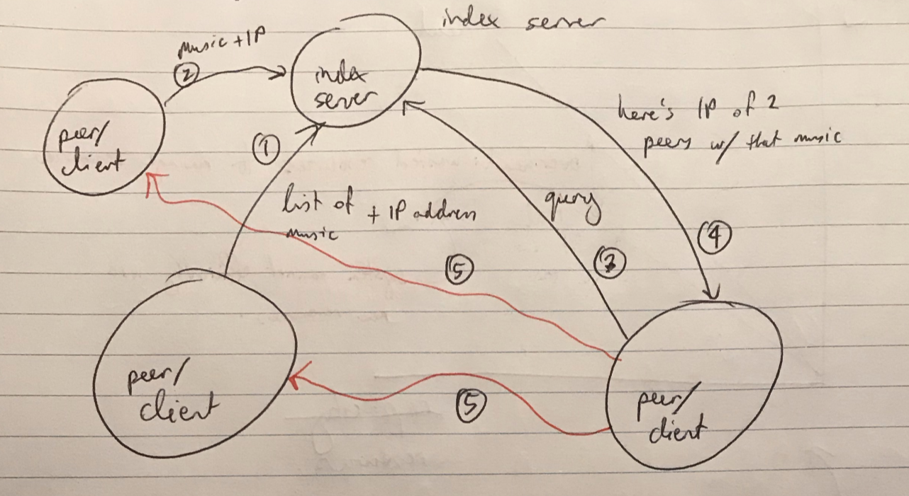

### Placement

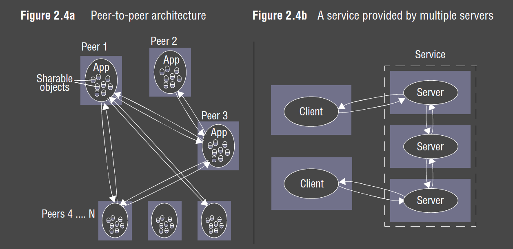

- how objects/services map onto physical distributed infrastructure
- crucial determinant of DS properties: performance, reliability, security
- where to place a given client/server in terms of machines/processes
- needs to account for e.g.:
  - communication pattern between entities
  - reliability of machines and current loading
  - quality of communications
- __mapping services to multiple servers:__ services can be implemented as multiple server 
  processes in separate host computers which interact to provide a service to clients
  - increases capacity of system
  - can partition/replicate across multiple hosts
  - __cluster:__ thousands of commodity processing boards
  - e.g. data sharding
- __cache:__ store of recently used objects that is closer to some clients than objects themselves
  - new objects are added to the cache replacing existing objects (e.g. via LRU policy)
  - reduce network traffic and server load
  - may improve performance for client
- __proxy server:__ increase availability/performance by reducing load on wide area network
  - also used for: caching, hide identity of client, translation between APIs

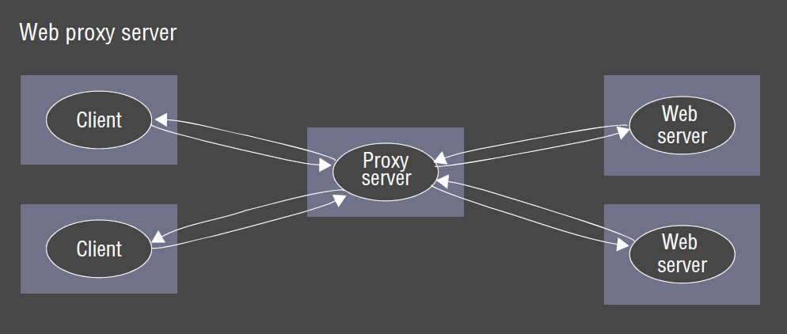

- __mobile code:__ applets/Javascript
  - good interactivity, allows asynchronous behaviour (AJAX)
  - server provides code to browser which client browser runs to access services
  - potential security threat
- __mobile agent:__ running program (code + data) that travels from computer to computer, 
  carrying out a task on someones behalf, typically collecting data, eventually returning
  with results
  - reduced communication cost and time by replacing remote invocations with local ones
  - big security threat, and web crawlers can still access resources successfully through remote 
    invocations
  - used to install/maintain software on computers within organisation
  - not widely used anymore

## Architectural Patterns

- patterns build on primitive architectural elements, providing composite recurring structures
  that work well in particular circumstances

### Layering

- __layering:__ partition system into layers, with a given layer making use of services provided
  by the layer below.  Higher layers are unaware of lower layer implementation details
  - vertical organisation of services into service layers
- __platform:__ lowest-level hardware/software; e.g. Intel x86/Linux 
- __middleware:__ software that masks heterogeneity and provides useful programming model. 
  - Processes interact to implement communication/resource-sharing.  
  - Provides building blocks for constructing software (value added services)
    - naming
    - security
    - transactions
    - persistent storage
    - event service
  - adds overhead: additional abstraction
  - communication cannot be completely hidden so that error handling can occur properly

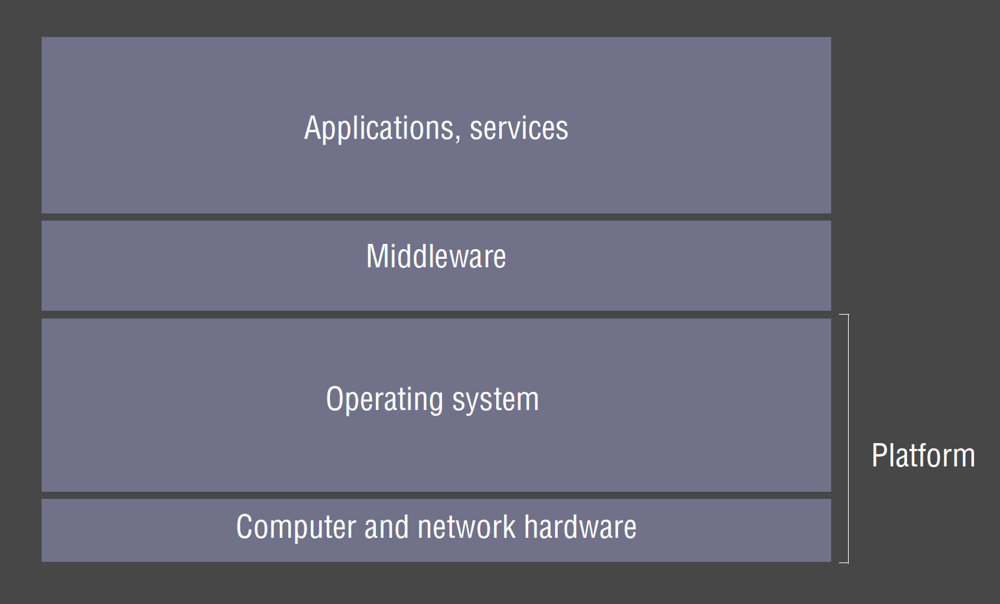

### Tiered architecture

- __tiered architecture:__ complements layering.  Horizontal partitioning within a layer,
  separating functionality into different servers. e.g.
  - presentation logic: user interaction/view as presented to user
  - application logic: app-specific processing/business logic
  - data logic: persistent storage; DBMS
  - 3-tier: separates each logical element into a distinct server
  - only applicable to client-server; P2P is by definition a single tier
- __thin client:__ software layer supporting window-based UI local to the user while accessing
  services on a remote computer
  - allows simple, low-cost devices to be used with a wide range of services
  - poor performance for highly interactive graphical activities: CAD, image processing
  - e.g. X terminals
  - only does IO: draws things on screen/transmits mouse/keyboard
  - server does all the computation
  - __Virtual Network Computing (VNC):__ remote access to GUI through VNC client via VNC protocol
- __proxy:__ support location transparency in RPC/RMI
  - proxy created in local address space to represent remote object: offers same interface
    as remote object, meaning application programmer calls on the proxy without knowing about
    the distributed nature
  - also used for replication/caching
- __brokerage:__ supports interoperability in complex distributed systems

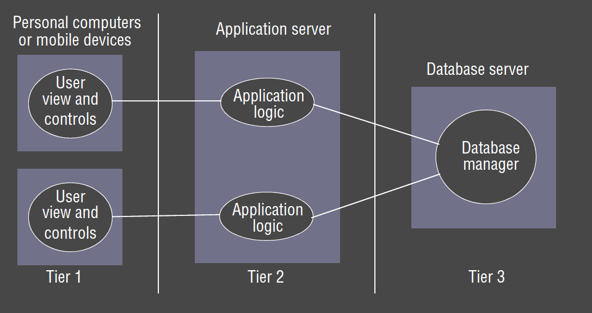

## Fundamental Models

- fundamental models allow you to analyse distributed systems regardless of architecture
  - understand support of non-functional requirements
  - e.g. how secure is the system? what attacks can it withstand?
- should only contain essential ingredients to understand/reason about aspect's of system 
  behaviour
- __purpose__
  - make explicit relevant assumptions
  - make generalisations concerning what is possible/impossible given those assumptions
    - desirable properties
    - general purpose algorithms
- aspects of distributed systems captured in fundamental models:
  - __interaction:__ account for inherent delays and absence of global clock
  - __failure:__ classify faults
  - __security:__ classify forms of attacks

### Interaction Models

- model __interaction between processes__ of a distributed system
- Message passing between processes produces 
  - __communication:__ information flow
  - __coordination:__ synchronisation, ordering
- distributed systems composed of many processes can be described by __distributed algorithms:__
  - steps taken by each process
  - transmission of messages between processes

#### Performance of communication channels

- communication performance is often a limiting characteristic
- __latency:__ delay between start of message transmission from process 1 and beginning of receipt by process 2
- __bandwidth:__ information transmitted/time
- __jitter:__ variation in time taken to deliver a series of messages
  - most relevant to multimedia

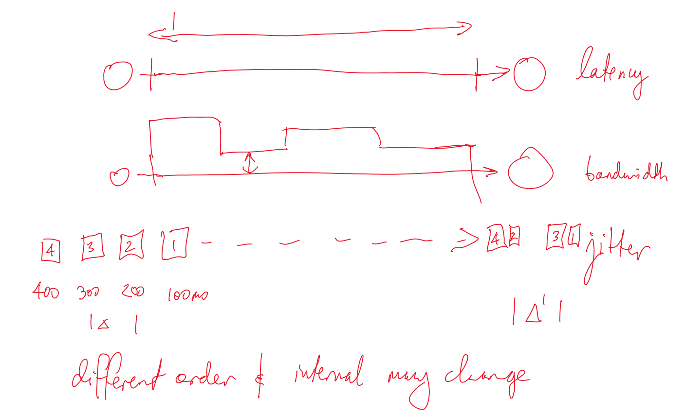

#### Computer clocks and timing events

- each computer has its own internal clock
- timestamps between processes can vary
  - time set differently initially
  - differences in clock drify rate
- GPS can synchronise clocks ($\sim 1\mu s$).  Doesn't work inside buildings
- synchronise to time server
  - time server synchronises with GPS and time infrastructure
- e.g. collaborative whiteboard
  - take order of arrival at server if only the logical ordering matters, rather than exact order
  - users can tolerate small errors

#### Synchronous System model

- assumes __known bound__ for
  - time to execute each step of process
  - message transmission delay
  - local clock drift rate
- view execution/message passing in terms of rounds.  Everything is assumed
  to be completed before the next round commences
- time period could be long: e.g. 1 day for a sensor update system
- assumptions allow simplification of the system, making it easier to analyses
- if an operation didn't complete in time: system is operating outside bounds of the model,
  may result in an error

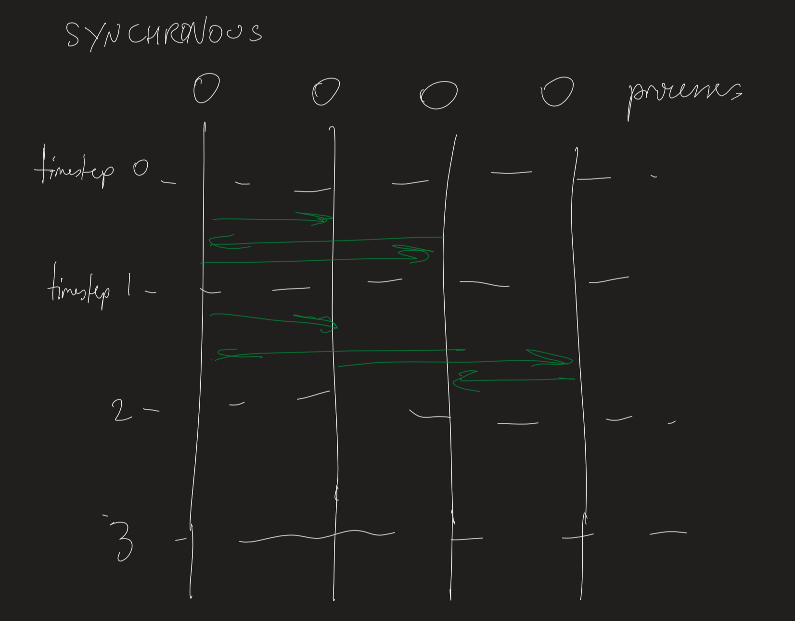

#### Asynchronous system model

- assumes __no bound__ on:
  - execution speed
  - transmission delays
  - clock drift rates
- processes can just proceed when they are ready: no notion of rounds
- exactly models the Internet: no intrinsic bound on server/network load
- actual distributed systems are very often asynchronous: 
  - processes need to share processors
  - communication channels need to share the network
- necessitates queues for send/receive
- harder to program, but can simplify reasoning

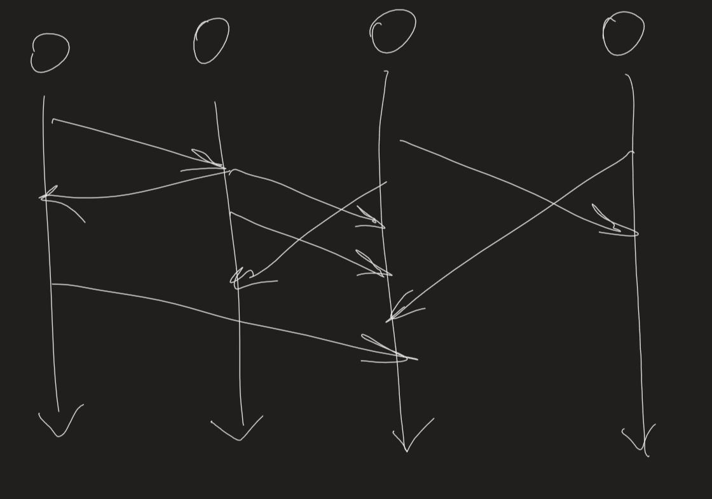

#### Event Ordering

- some applications require event ordering: i.e. whether an event at one process occurred before/after/concurrently
  with another event at another process
- messages may be received out of logical order: $m_1$ received after $m_3$ even though it was transmitted first

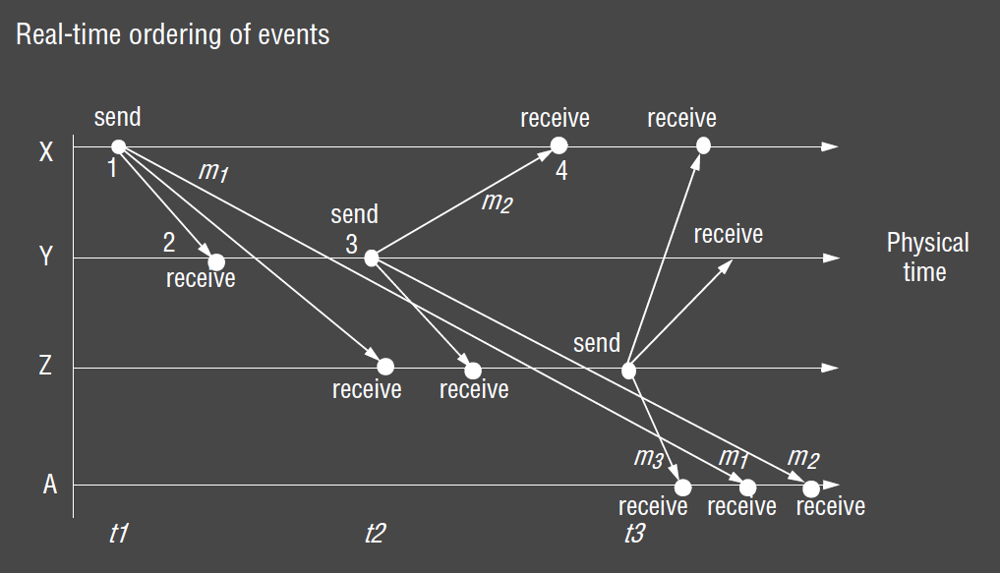

- if clocks could be synchronised, each message could simply be timestamped
- if clocks are roughly synchronised, timestamps will often be in correct order
- __logical ordering:__ you know when events occur relative to others
  - X sends $m_1$ before Y receives $m_1$
  - Y sends $m_2$ before X receives $m_2$
  - Y receives $m_1$ before sending $m_2$
- __logical time:__ assign a number to each event based on its logical ordering (1-4 in diagram)

### Failure Models

Define and classifies faults

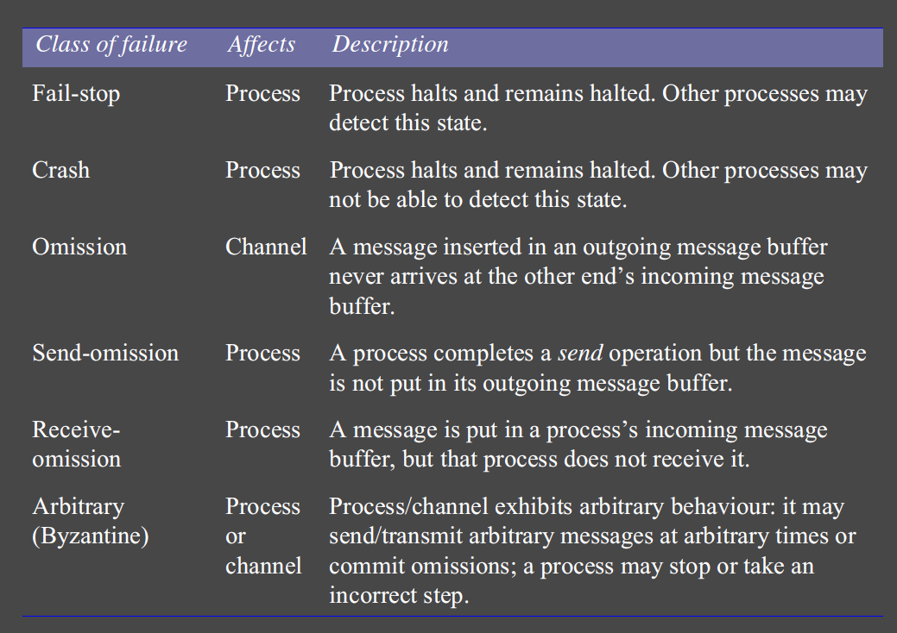

#### Omission failures

- process/communication channel fails to do what its expected to do
- process crash or network failure
- process failure:
  - crash: may not be detectable
  - __fail-stop:__ crash can detect with certainty that the process crashed
- communication channel: failure occurs
  - send omission failure: between sending process and outgoing message buffer
  - channel omission failure: in channel
  - receive omission failure: between incoming message buffer and receiving process 

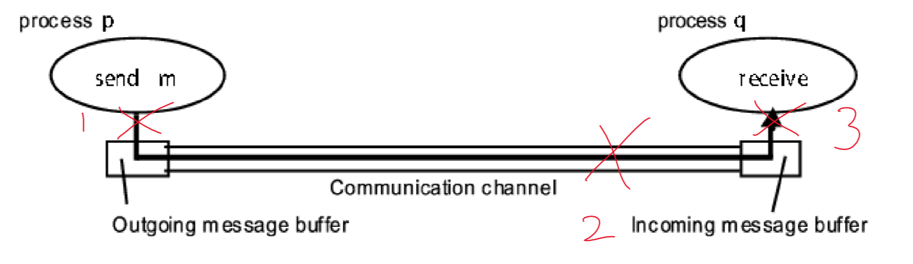

- repeated failures to respond during invocation: suggestive
- __Detection:__ timeouts
  - can only indicate a process is not responding: may have crashed, be still processing, or messages are en route

#### Arbitrary failures

- __arbitrary failures:__ worst possible failure semantics
  - process: arbitrarily omits/performs intended/unintended processing steps
  - communication channel: 
    - message contents corrupted, 
    - non-existent messages delivered, 
    - messages delivered more than once
    - rare due to checksums, sequence numbers, etc.
  - any type of error may occur
  - e.g. process sets wrong values in data items, 
  - e.g. process returns a wrong value in response to an invocation

#### Timing failures

- applicable to synchronous distributed systems, which have time limits set: execution time, message delivery time, clock drift rate
- __timing failures:__  time limits exceeded
  - may mean responses are unavailable to clients in specified time interval

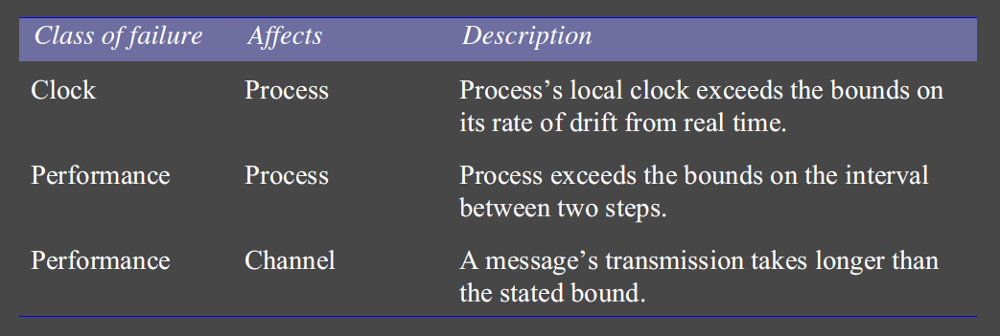

#### Reliable Communication

- __validity:__ any message in outgoing buffer is eventually delivered to incoming message buffer
- __integrity:__ message received is identical to the one sent
  - no message is delivered twice

### Security Models

- securing processes, communication channels
- protecting objects against unauthorised access
- __access rights:__ specify who is allowed to perform operations on an object
- __principal:__ each invocation is associated with a principal (user/process)
- server responsible for
  - verifying identity of principal
  - checking principal has sufficient access rights
- __enemy/adversary:__ assumed to be capable of sending any message to any process or reading/copying any message between a pair of processes

#### Threats

- to processes: servers/clients cannot be certain of source of message, as addresses can be spoofed
- to channels: enemy can copy, alter, inject messages
- denial of service
- mobile code: corrupt server/service arbitrarily

#### Addressing threats

- cryptography, shared secrets, encryption
- authentication
- secure channel: encryption + authentication to build a secure channel as a service layer on top of existing communication channel

## Questions

2.1 Provide three specific and contrasting examples of the increasing levels of heterogeneity
experienced in contemporary distributed systems as defined in Section 2.2. page 39

- ubiquitous computing: e.g. smart fridges, mobile phones, tablets, laptops, ... with
  significant differences in performance, input devices, etc.
- mobile computing: nodes may move from location to location
- cloud computing: pools of nodes that together provide a service

2.2 What problems do you foresee in the direct coupling between communicating entities
that is implicit in remote invocation approaches? Consequently, what advantages do you
anticipate from a level of decoupling as offered by space and time uncoupling? Note:
you might want to revisit this answer after reading Chapters 5 and 6. page 43

- idempotency

2.3 Describe and illustrate the client-server architecture of one or more major Internet
applications (for example, the Web, email or netnews). page 46

the Web: a client (i.e. a browser) opens TCP connections in order to send HTTP requests.
A Web server, listening on port 80, responds with a HTTP response.

2.4 For the applications discussed in Exercise 2.1, what placement strategies are employed
in implementing the associated services? page 48

