---
title: Operating System Support
notebook: Distributed Systems
layout: note
date: 2020-10-15
tags: 
...

# Operating System Support

## Motivation

- in DS context, OS lies below middleware layer
- OS provides support for remote communication
- the structure and services the OS provides impact the middleware's ability to deliver distributed resource sharing
- trade-offs between kernel-level facilities and user-level facilities, with tension between efficiency and robustness

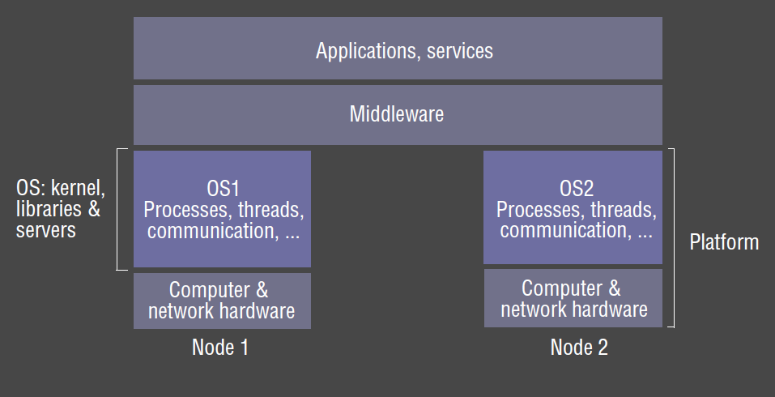

### Kernel and Server functions

- kernels and client/server processes that act upon them are main architectural components. They should provide:
- __encapsulation:__ provide useful service interfaces to their resources
  - hide details of memory management and devices
- __protection:__ protect resources from illegitimate access
- __concurrent processing:__ provide concurrency transparency so that clients can share resources and access them concurrently
  - time sharing

### Invocation related functions

- __invocation mechanism:__ means of accessing encapsulated resource
  - clients access resources through various means, e.g. RMI to a server object, system call to kernel
- libraries, kernels, servers may perform invcation tasks:
- __communication:__ parameters and results need to be passed to resource managers, over network or within a computer
- __scheduling:__ when an operation is invoked, processing must be scheduled within the kernel/server

## Network vs Distributed OS

- __network operating system:__ have inbuilt networking capability, with each node remaining autonomy in managing its own resources
  - e.g. UNIX, Windows
- __single system image/distributed operating system__: OS has control over all nodes in the system
  - long time goal, but not in general use:
    - lots of apps have already been developed for existing systems
    - users prefer to have a degree of autonomy over their machines

## Core OS components

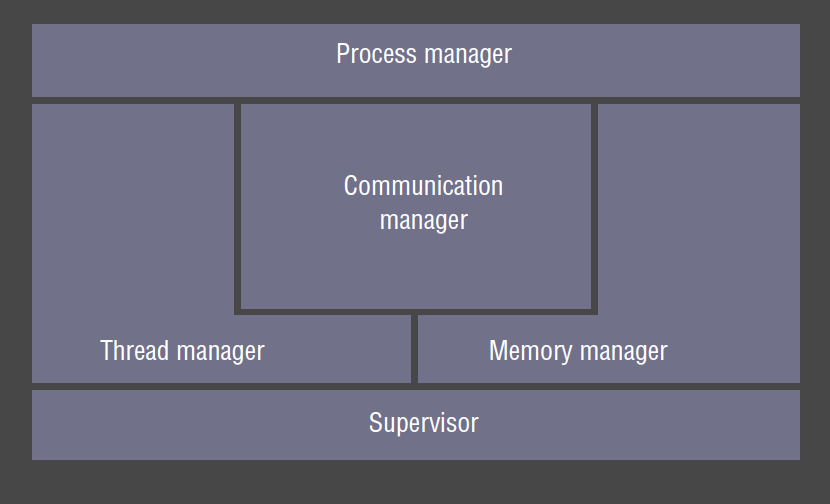

- __memory manager:__ allocation and access to physical and virtual memory
  - translation between physical/virtual memory
  - paging
- __process manager:__ creation and operations on processes
- __thread manager:__ thread creation, synchronisation, scheduling
- __communication manager:__ handles interprocess communication
  - communication between threads attached to different processes on the same machine
- __supervisor:__ handles privileged operations i.e. those directly affecting shared resources on the host
  - responsible for ensuring the host continues to provide proper service to the client
  - dispatch interrupts, system call traps.  
  - Control of MMU, hardware caches, processor register manipulation
  - Windows: Hardware Abstraction Layer

## Operating System Functions

- implement resource management policies
- encapsulate resources (providing a useful interface to application programmer)
- protect resources from illegitimate access
- facilitate concurrent sharing of resources

## Protection

- resources encapsulating space: memory, files
  - typical operations: read/write
  - legimitate operations: those carried out by clients who have the right to perform them
    - conforms to resource policies of the host
- resources encapsulating time: processes
  - operations: execute
  - legitimate operations: client may not have right to create a process
    - policies need to be enforced
- __kernel__: program that is loaded from system initialisation, and is executed with full access privileges to
  all physical resources on the host computer
  - register in CPU maintains current mode
  - in kernel/supervisor mode: full set of instructions available, can access/control every resource
  - in user mode, only a subset of CPU instructions is available
- __address space__: collection of ranges of virtual memory locations with particular rights (rwx)
  - __user level process:__ executes in user mode and has a user-level address space (restricted access rights c.f. kernel address space)
- __system call trap__: invocation mechanism for resources managed by the kernel
  - corresponds to a `TRAP` instruction, switching to kernel mode and kernel address space
  - process switching is expensive

## Processes and Threads

- __process:__ execution environment + threads
  - encapsulates basic resources of memory and processor time
  - has address space, allocated memory
  - has 1+ threads given processor time
  - has higher-level resources: open files, windows
- __execution environment:__ unit of resource management: an address space, communication interfaces, local resources (e.g. semaphores)
- __thread (of execution):__ activity abstraction executing within an execution environment
  - threads have equal access to resources encapsulated within the process
- analogy: execution environment is a stoppered jar with air and food inside.  Initially the jar has a single fly.  This fly 
  can produce and kill other flies, as can its progeny.  Any fly can consume any resource in the jar.  Flies can be programmed to
  queue up in an orderly manner to consume resources.
- purpose of multiple threads of execution is to maximise the degree of concurrent operations.  This enables overlap of computation with slow I/O
  and concurrent processing on multiprocessors

- __copy-on-write:__ consider a `fork` creating a copy of a process, which includes its text + heap + stack 
  - default: the inherited region is copied by sharing the page frames that comprise the inherited region, so no physical copying occurs
  - page in the region is only physically copied when a process attempts to modify it
  - also used for copying large messages

### Address spaces

- __virtual address space:__ most OS's allocate for each process
  - byte addressable
  - 32 bit architecture: $2^32$ byte addresses
  - divided into contiguous, non-overlapping __regions__
- __paged virtual memory:__ divides address space into fixed size blocks (pages)
  - each page is located in physical memory or in swap space on HDD
- __page table:__ used by processor and OS to map virtual addresses to real addresses
  - contains access control bits for each page to determine access privileges
- OS manages the pages, swapping them in and out of memory in response to process memory address accesses

### Process creation

- `fork`: system call that duplicates caller's address space, creating new address space for new process
  - new process is identical.  Parent receives different return value from fork to the child
- `exec`:__ system call replaces callers address space with a new address space for a new process named in the system call
- `fork` + `exec` allows new processes to be allocated

### Shared Memory

- 2 distinct address spaces can share parts of real memory.
- useful:
  - __libraries:__ binaries can be quite large, and will be identical for all processes using it
    - separate copy in each process wastes space, better to share it
  - __kernel:__ maintains code/data identical in every process, often located at the same virtual memory space
    - sharing code/data is more efficient
  - __data sharing/communication:__ 2 processes that want access to the same data/to communicate can use shared memory

### Copy on write

- __copy on write:__ when you `fork` a new process, address space is identical to old address space
  - makes a copy of a memory region only when new process actually writes to it
  - saves time allocating the new process
  - saves memory: only what's required is copied

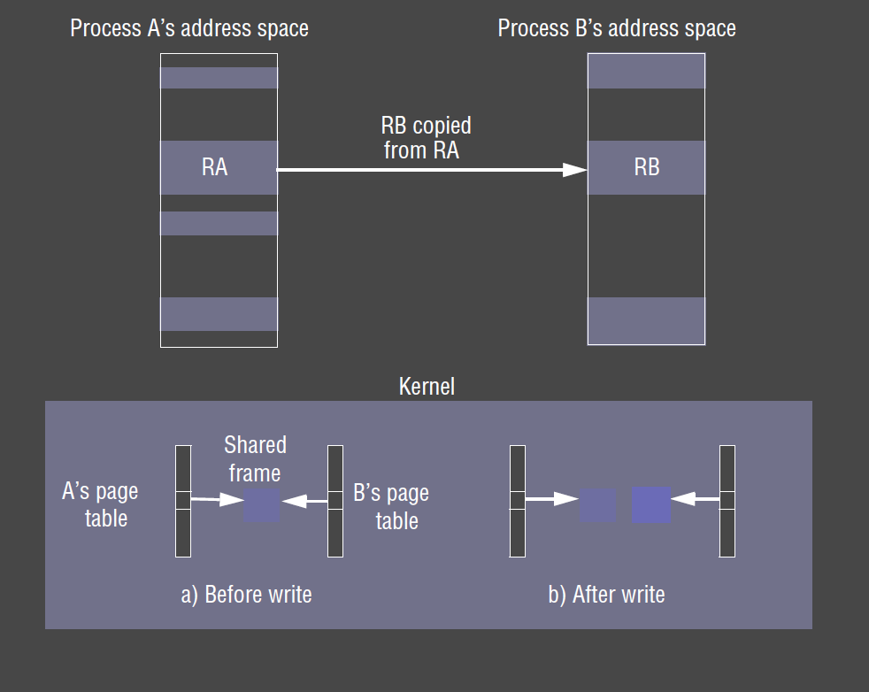

### New Processes in a Distributed System

- which host will the new process be created on?
- matter of policy
  - __transfer policy:__ determines whether to create locally/remotely
  - __location policy:__ determines which host (of a set) the new process will be allocated on
- location policies: can be 
  - __static:__ doesn't take into account state of distributed system 
  - __adaptive:__ receives feedback about the current state of the distributed system
- usually transparent to the user
- takes into account: 
  - relative load across hosts
  - interprocess communication
  - host architectures
  - specialised resources required
- __load manager:__ gather info about the state of the distributed system
  - __centralised:__ single load manager receives feedback from all other hosts
    - bottleneck
  - __hierarchical:__ LM's in a tree, where leaf nodes are hosts
  - __decentralised:__ LM for every host, all LM's communicate directly with each other
- __sender-initiated/push policy:__ local host responsible for determining remote host to allocate the process
- __receiver-initiated/push policy:__ remote host advertises to other hosts that new processes should be allocated on it

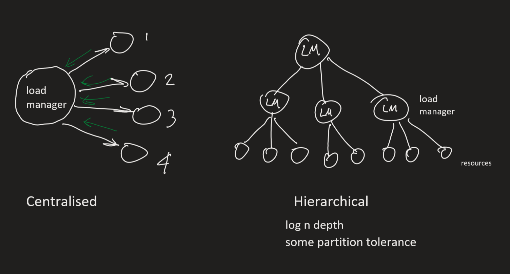

### Process Migration

- processes can be __migrated__ between hosts by copying their address space
  - if architecture differs between hosts this may prohibit migration, as process code is typically CPU dependent
  - virtual machines can assist
- if the process is using other resources e.g. open files, sockets migration is further complicated

## Architectures for Multi-Threaded Servers

### Worker pool

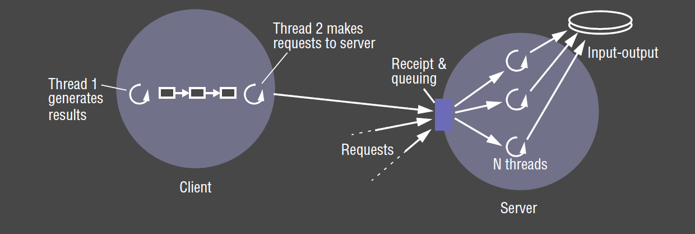

- fixed pool of worker threads: avoids bottleneck from thread creation by creating threads in advance
- each request is placed in a request (priority) queue by an IO thread
- workers pull requests off the queue when they are free
- disadvantages:
  - inflexible: cannot scale up if there are insufficient workers
  - high level of switching between IO and worker threads as they manipulate the queue

### Thread-per-request architecture

- IO thread spawns a new worker thread for each request
- the worker destroys itself once the request has been fulfilled
- advantages: 
  - workers don't contend for a shared queue
  - number of workers can scale with number of requests
- disadvantages: 
  - overhead of thread creation/destruction

### Thread-per-connection architecture

- server creates new worker thread when a client makes a connection, and destroys it when the 
  connection is closed
- the thread can then be used to service multiple requests
- advantage:
  - less overhead in creating/destroying threads, as well as creating/tearing down connections
- disadvantages:
  - only suitable for connection-oriented protocols
  - may be delay while a worker is servicing requests while another worker is idle

### Thread-per-object

- each thread created is associated with a remote object
- this uses a per-object queue
- advantages/disadvantages as per thread-per-connection

## Threads

### Threads within clients

- threads are useful in clients when request to the server takes considerable time
  - communication invocations often block
- e.g. web browser can continue to interact with current page while next page is being fetched
  - multiple threads can fetch each image on the page, with each image coming from a separate server

### Using Threads vs Processes

- __creating__ a new thread in an existing process is __cheaper__ than creating a process
- __switching__ to a different thread within the same process is __cheaper__ than switching threads belonging
  to different processes
- threads within a process may __share__ data and other resources __conveniently and efficiently__ compared with separate processes
- threads within a process are __not protected__ from one another

### Context Switch

- __processor context:__ values of processor registers
- __context switch:__ transition between contexts when switching between threads, or when a single thread makes a system call
  or takes another type of exception
  - save processor's original register state
  - load new state
  - (possibly) domain transition: switch between user/kernel mode
- __domain transition:__ changing from user context to kernel context, plus changing protection mode

### Threads in Java

- `Thread(ThreadGroup group, Runnable target, String name)`: new thread in `SUSPENDED` state
  - belongs to `group`
  - executes `run()` method of target
  - identified as `name`
- new threads are created in JVM in `SUSPENDED` state
- `start()` makes the thread `RUNNABLE`, and then it executes the `run()` method of the contained object
- `sleep(int millisecs)`: make thread `SUSPENDED` for specified time
- `synchronized`: designate a method/block as belonging to a monitor associated with an individual object 
  - monitor guarantees at most one thread can execute within it at any time
- `wait()`: used to block a thread while waiting for a particular criteria
- `notify()`: wakes/unblocks at most one thread 
- `join()`: blocks caller until the target thread terminates
- `interrupt()`: used to prematurely wake a waiting thread
- `yield()`: enter `READY` state and invoke scheduler
- `destroy()`: destroys the thread

### Thread Scheduling

- some thread scheduling is preemptive, while other may be non-preemptive
- __preemptive:__ a running thread is suspended at any time (periodically) to allow processor time for other threads
- __non-preemptive:__ a running thread continues to receive processor time until it yields control back to the thread scheduler
  - much simpler for concurrency issues: e.g. mutual exclusion to a shared variable
  - doesn't guarantee other threads will receive processor time: an errant thread can run arbitrarily long time before yielding,
    affecting performance and usability
- real-time scheduling: non supported by vanilla Java
  - imposes additional constraints

### Implementation

- some kernels allow threads of a process to be scheduled across different processes
- some kernels provide system calls only for allocating processes
- some kernels provide system calls for allocating threads, __kernel threads__
  - depends on whether kernel itself is threaded
- user can manage __user threads__ within a process
  - kernel gives processor time to process
  - process is responsible for thread scheduling

### User vs Kernel threads

- User threads within a process
  - cannot take advantage of multiple processors
  - if it causes a page fault, blocks the entire process
  - faster context switching between user threads
  - customisable by user for particular application
  - can usually allocate more user threads than you can kernel threads
- kernel level and user level threads can be combined

## Communication and Invocation

- __invocation:__ construct whose purpose is to bring about an operation on a resource in a different address space
  -  e.g. RMI, RPC, event notification
- OS support: questions for distributed systems
  - communication primitives
  - protocols and openness
  - efficiency
  - high-latency/disconnected operation support

### Communication primitives

- kernel can provide communication primitives e.g. TCP, UDP
- higher level primitives are usually implemented by middleware

### Protocols and Openness

- open protocols (c.f. closed/proprietary protocols) facilitate interoperation between middleware implementations on different systems
- kernels implementing their own network protocols don't succeed
- newer kernels: leave implementation of networking protocols to servers
- kernel needs to provide device drivers for new networking devices (e.g. Bluetooth)

### Invocation Performance

- clients and servers make millions of invocation-related operations in their lifetimes: fractions of ms add up in invocation costs
- invocation times have not decreased in proportion with increases in network bandwidth
- software overheads often dominate network overheads in invocation time
- performance related distinctions:
  - does a domain transition occur? (i.e. crossing an address space)
  - is there network communication?
  - is there thread switching/scheduling?
  - synchronous/asynchronous?

### Invocation between Address spaces

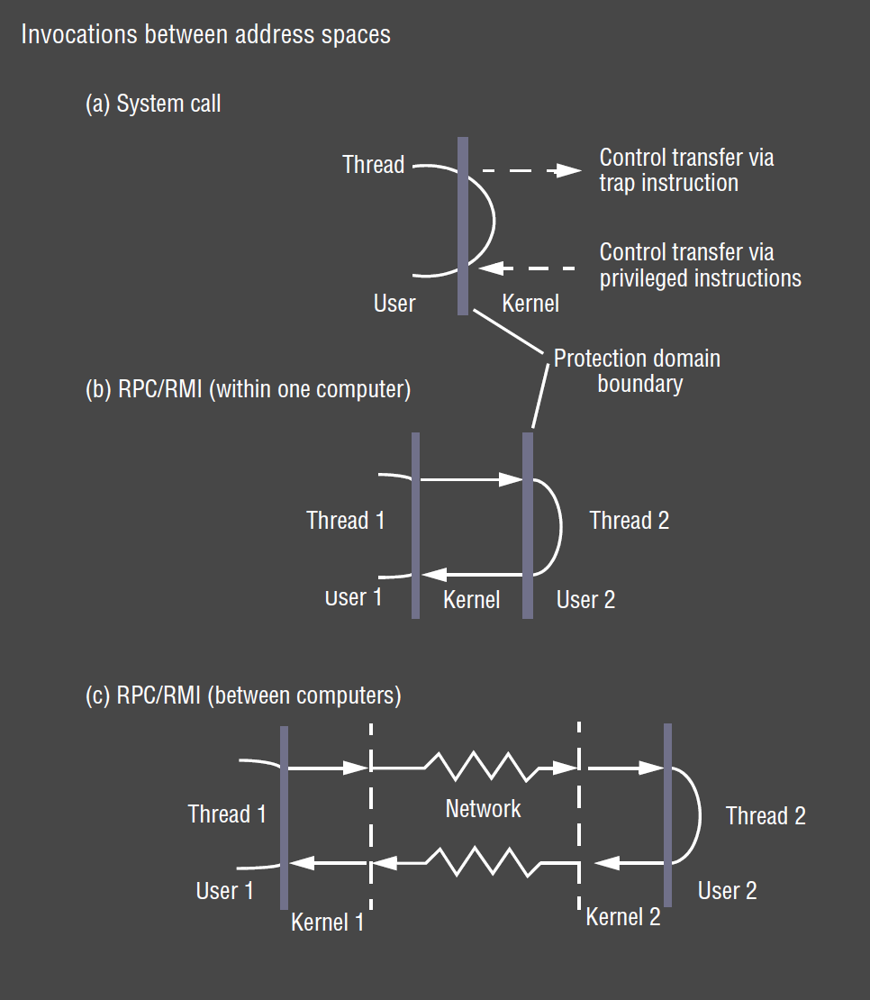

- __user space procedure:__ minimal overhead, allocate stack space
- __system call:__ overhead is domain transition to/from kernel
- __interprocess, same host:__ domain transition to kernel, to other process, back to kernel, back to calling process
- __interprocess, remote host:__ same as above, plus overhead of network communication between two kernels

### Null Invocation 

- __null RPC:__ RPC without parameters executing a null procedure, returning no values
  - involves exchange of messages with system data but no user data
  - null RPC on LAN: ~ 0.1ms
  - null conventional procedure call: 0.1$\mu$s
- null invocation (RPC/RMI) costs measure __latency__, a fixed overhead
  - invocation costs increase with the size of arguments and results, but often latency is significant compared with the remainder of the delay

### Remote Invocation Delay

- client delay vs requested data size: once size exceeds packet size, an extra packet has to be sent to carry extra data

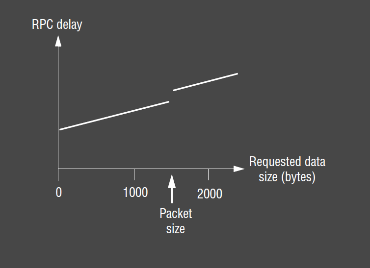

- three main components in the delay
- __marhsalling/unmarshalling:__ copying/converting data.  Becomes more significant as amount of data grows
- __data copying:__ message data after marshalling gets copied (possibly) several times in the course of an RPC
  - across user-kernel boundary
  - across each protocol layer (RPC/UDP/IP/Ethernet)
  - between network interface and kernel buffers
- __packet initialisation:__ checksums, headers, trailers.  Overhead is Proportional to amount of data
- __thread scheduling/context switching:__ 
  - several system calls (context switches) are made during an RPC as stubs invoke kernel's communication operations
  - 1+ server threads is scheduled
  - if OS employs separate network manager process, each `send` involves a context switch to one of its threads
- __waiting for acknowledgements:__ above network level acknowledgements, choice of RPC protocol may influence delay

### Communication via Shared Memory

- shared memory can be used to communicate between user processes, or between user processes and the kernel
- data is communicated by writing to/reading from the shared memory, like a whiteboard
- when communicating between user processes: data is not copied to/from kernel space
- processes typically need to use synchronisation mechanism to ensure communication is deterministic

- `shmget()`: gets shared memory area
  - system call returning an identifier
  - identifier is communicated to other processes
  - some overhead associated with this setup
- `shmat()`: attaches shared memory area to a process
- `shmctl()`: controls shared memory area (e.g. read/write permissions)

### Choice of Protocol

- __connection-oriented protocols:__ (TCP) used when client and server exchange information in a single session for a reasonable amount of time
  - e.g. telnet, ssh
  - protocols work poorly if endpoints change identity (e.g. mobile/roaming from one IP address to another)
- __connectionless protocols:__ (UDP) often used for request-reply applications
  that don't need a session
  - e.g. get time from time server
  - less overhead, so suitable for applications needing low latency e.g. streaming media, online games
  - good for unreliable networks
- often cross-address space communication happens between processes on the same host
  - preferable to transparently choose a more efficient communication mechanism e.g. share memory
  - e.g. lightweight RPC (LRPC)

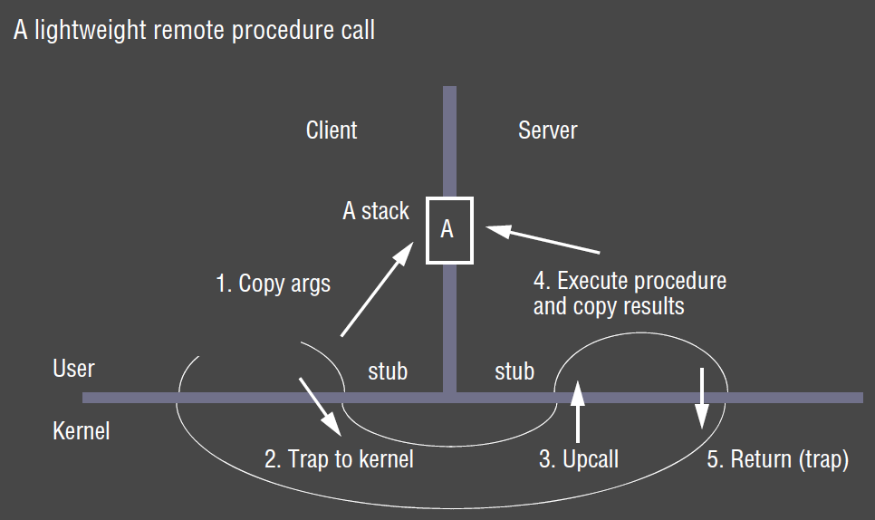

### Concurrent and asynchronous operations

- OS can assist middleware layer to provide efficient remote invocation mechanisms
- Internet has high latency (as well as disconnection/reconnection), low throughput, 
  high server load: may exceed any benefit OS provides
- __asynchronous operations:__ primarily middleware technique to defeat high latency, used in
  - concurrent invocation 
  - asynchronous invocation

#### Concurrent Invocation 

- middleware provides only __blocking__ invocations, but application spawns multiple 
  threads to perform blocking invocations concurrently
- in many applications, you can have a number of outstanding requests
- don't need to wait for response to request before issuing a new request
- e.g. __web browser:__ multiple threads for clients for multiple concurrent requests 
  to different web servers, pipelining
- benefit: performance benefit for client as total time taken is reduced c.f. serialised case

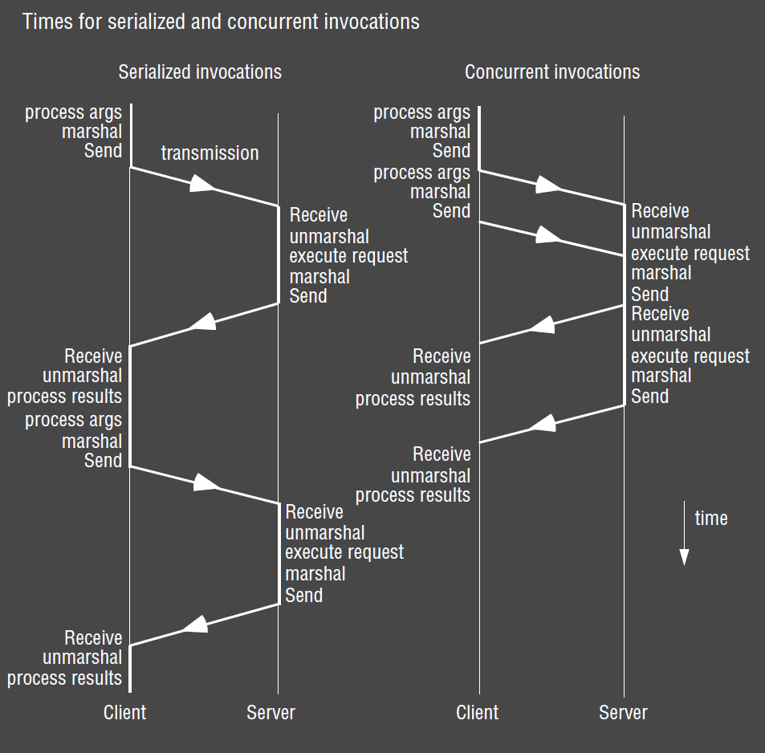

#### Asynchronous Invocation

- __asynchronous invocation:__ returns without waiting for invocation request to be 
  completed
- performed asynchronously w.r.t. caller: i.e. made with a __non-blocking call__
  that returns as soon as the invocation request is ready for dispatch
- either: 
  - __polling:__ caller must periodically check whether request has completed, or
  - caller is notified when the request has completed
- e.g. __telnet client/server__
  - whenever a key is typed at the keyboard, the client sends the key to the server
  - whenever output is available from the server it is sent to the client.  Received 
    data is printed on the terminal by the client as soon as it arrives
  - sends/receives are not synchronised in any particular way

### Persistent asynchronous invocations

- normal async invocation mechanisms are implemented over TCP streams, and fail if a stream
  breaks due to down network link or target host crashes
- conventional invocation mechanism fails after given number of timeouts 
  - often short-term timeouts are inappropriate where disconnections/very high latency 
    occurs
- __persistent asynchronous invocation:__ tries indefinitely to perform invocation
  until it is known to have succeeded or failed, or until application cancels the invocation
  - use of mobile devices: long disconnection times
- e.g. Queued RPC
  - queues outgoing invocation requests in a stable log while there is no network connection
  - schedules dispatch when there is a connection
  - queues invocation results from servers (like a mailbox) until client connects and retrieves them

## Operating System Architecture

- requirement for OS: __openness__, because it allows
  - run only system software necessary for its role in architecture to __minimise resource 
    wastage__
  - independent, __interchangeable__ services
  - __configurable__/customisable services to suit user needs
  - __flexibility__ to introduce new services without negatively impacting existing ones

### Monolith vs Microkernel

- __monolithic kernel:__ performs all basic OS functionalities
  - e.g. UNIX, Windows
  - undifferentiated: non-modular 
  - intractable: altering any individual component to suit needs is difficult
  - sometimes more efficient: 
    - complex functionality requires fewer system calls
    - IPC minimised
- __microkernel:__ kernel provides minimal basic abstractions: address spaces, threads,
  local IPC
  - all other system services are provided by servers that are dynamically loaded as needed
  - e.g. Mach, Minix?
  - much more extensible
  - better ability to enforce modularity behind memory protection boundaries
  - more likely to be free of bugs - or if they occur they are less likely to occur in kernel and may be more fault tolerant
  - much more amenable to formal verification for correctness and security than monolith
  

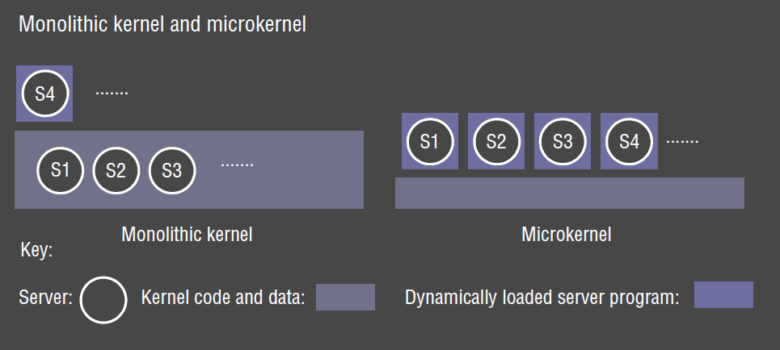

## Emulation and virtualisation

- microkernels haven't been adopted: poor support for software majority of users want to 
  run
  - can use binary __emulation__ of another operating system to overcome this
  - e.g. Mach OS emulates UNIX

### Virtualisation 

- __virtualisation:__ allows you to run multiple instances of VMs on a single real machine
  - each VM can run a different kernel
- __hypervisor:__ thin layer of software over physical machine architecture
- __full virtualisation:__ hypervisor offers identical interface to underlying physical 
  architecture
  -  allows existing OS to run transparently, unmodified
  - hard to realise with satisfactory performance on legacy architectures (x86)
- __paravirtualisation:__ hypervisor provides modified interface
  - requires OS to be ported across

#### Benefits

- key advantage c.f. emulation: applications can run in virtualised environments without
  being rewritten/recompiled
- security
- provision of cloud computing: 
  - ability to allocate/charge users for their resource use precisely
  - ability to create/destroy virtual machines on demand, helping scale to meet demand
- flexibility and resource sharing: convenient access to multiple OSs on a single desktop/machine
  - or you can implement an OS's API, as UNIX Wine does for Windows: implements Win32 API 
  on Unix

### Xen Architecture

- goal: enabled multiple OS instances to run in isolation on conventional hardware, with
  minimal performance overhead
- hypervisor supports virtualisation of underlying physical resources: CPU, scheduling of CPU, physical memory
  - provides VMs with virtualisation of hardware so that each VM has its own virtualised 
    physical machine
  - multiplex virtual resources onto underlying physical resource
  - ensure strong protection between VMs
- __control-sensitive instructions:__ attempt to change configuration of system resources,
  e.g. changing memory mappings
- __behaviour sensitive instructions:__ read privileged state, revealing physical resources,
  breaking virtualisation
- __condition for virtualisation:__ architecture lends itself to virtualisation if all 
  sensitive instructions are privileged instructions
  - x86: 17 sensitive but not privileged instructions

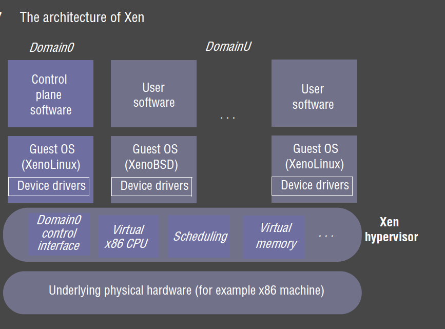

### Privileges

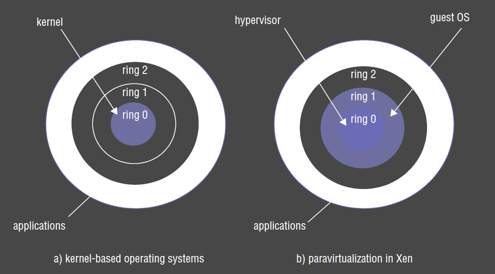 

- x86 processor has 4 different privilege rings built in.  Normally only 2 rings are used, 
  with kernel operating in innermost ring, and user mode operating in outer mode ring
- Xen uses innermost ring for hypervisor, and next ring for the guest OS, with the outermost
  ring for applications
- this provides protection to hypervisor from guest OS and ensures virtualisation isn't 
  broken
- privileged operations are rewritten as __hypercalls__ that trap to the hypervisor

### Virtual Memory

- virtual memory management is most complicated part of virtualisation
  - underlying hardware is complex
  - need to add extra protection to isolate domains

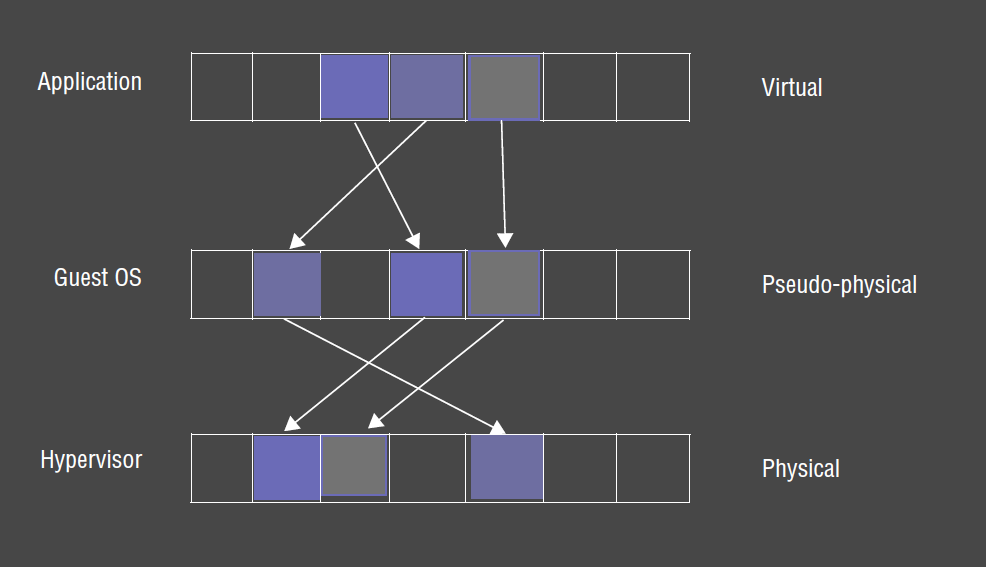

- Xen uses 3 level architecture
  - hypervisor manages main memory
  - kernel of guest OS provides pseudo-physical memory
  - applications within that OS get virtual memory

### Split Device Drivers

- Xen provides abstraction for each guest OS to have its own virtual device

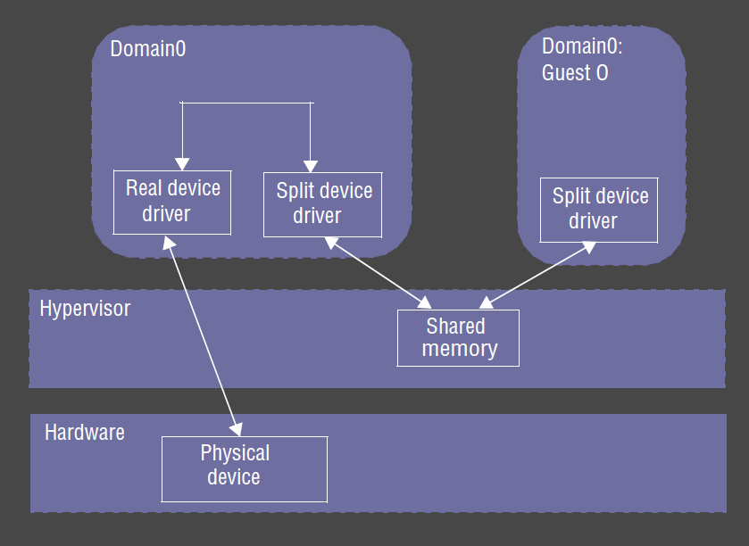

