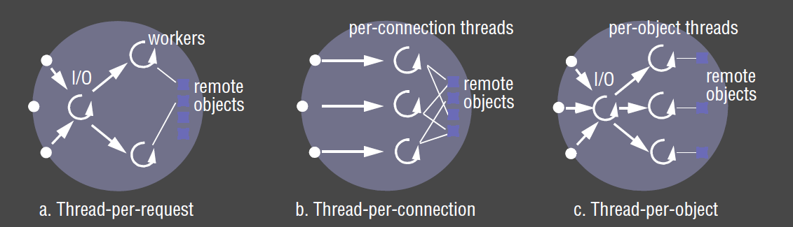

---
title: Operating System Support
notebook: Distributed Systems
layout: note
date: 2020-10-15
tags: 
...

# Operating System Support

## Motivation

- in DS context, OS lies below middleware layer
- the structure and services the OS provides impact the middleware's ability to deliver distributed resource sharing

## Network vs Distributed OS

- __network operating system:__ have inbuilt networking capability, with each node remaining autonomy in managing its own resources
  - e.g. UNIX, Windows
- __single system image/distributed operating system__: OS has control over all nodes in the system
  - long time goal, but not in general use:
    - lots of apps have already been developed for existing systems
    - users prefer to have a degree of autonomy over their machines

## Core OS components

- memory manager: manage physical and virtual manager
- process manager: creation and operations on processes
- thread manager: thread creation, synchronisation, scheduling
- communication manager: communication between threads attached to different processes on the same machine
- supervisor: dispatch interrupts, system call traps.  Control of MMU, hardware caches, processor register manipulation
  - Windows: Hardware Abstraction Layer

## Operating System Functions

- implement resource management policies
- encapsulate resources (providing a useful interface to application programmer)
- protect resources from illegitimate access
- facilitate concurrent sharing of resources

## Protection

- __kernel__: program that is loaded from system initialisation, and is executed with full access privileges to
  all physical resources on the host computer
  - register in CPU maintains current mode
  - in user mode, only a subset of CPU instructions is available
- __address space__: collection of ranges of virtual memory locations with particular rights (rwx)
  - __user level process:__ executes in user mode and has a user-level address space (restricted access rights c.f. kernel address space)
- __system call trap__: invocation mechanism for resources managed by the kernel
  - corresponds to a `TRAP` instruction, switching to kernel mode and kernel address space
  - process switching is expensive

## Processes and Threads

- __process:__ execution environment + threads
- __execution environment:__ unit of resource management: an address space, communication interfaces, local resources (e.g. semaphores)
- __thread (of execution):__ activity abstraction executing within an execution environment
- analogy: execution environment is a stoppered jar with air and food inside.  Initially the jar has a single fly.  This fly 
  can produce and kill other flies, as can its progeny.  Any fly can consume any resource in the jar.  Flies can be programmed to
  queue up in an orderly manner to consume resources.
- purpose of multiple threads of execution is to maximise the degree of concurrent operations.  This enables overlap of computation with slow I/O
  and concurrent processing on multiprocessors

- __copy-on-write:__ consider a `fork` creating a copy of a process, which includes its text + heap + stack 
  - default: the inherited region is copied by sharing the page frames that comprise the inherited region, so no physical copying occurs
  - page in the region is only physically copied when a process attempts to modify it
  - also used for copying large messages

## Architectures for Multi-Threaded Servers

### Worker pool

- fixed pool of worker threads
- each request is placed in a request (priority) queue by an IO thread
- workers pull requests off the queue when they are free
- disadvantages:
  - inflexible: cannot scale up if there are insufficient workers
  - high level of switching between IO and worker threads as they manipulate the queue

### Thread-per-request architecture

- IO thread spawns a new worker thread for each request
- the worker destroys itself once the request has been fulfilled
- advantages: 
  - workers don't contend for a shared queue
  - number of workers can scale with number of requests
- disadvantages: 
  - overhead of thread creation/destruction

### Thread-per-connection architecture

- server creates new worker thread when a client makes a connection, and destroys it when the 
  connection is closed
- the thread can then be used to service multiple requests
- advantage:
  - less overhead in creating/destroying threads, as well as creating/tearing down connections
- disadvantages:
  - only suitable for connection-oriented protocols
  - may be delay while a worker is servicing requests while another worker is idle

### Thread-per-object

- each thread created is associated with a remote object
- this uses a per-object queue
- advantages/disadvantages as per thread-per-connection

## Using Threads vs Processes

- __creating__ a new thread in an existing process is __cheaper__ than creating a process
- __switching__ to a different thread within the same process is __cheaper__ than switching threads belonging
  to different processes
- threads within a process may __share__ data and other resources __conveniently and efficiently__ compared with separate processes
- threads within a process are __not protected__ from one another

### Context Switch

- __processor context:__ values of processor registers
- __context switch:__ transition between contexts when switching between threads, or when a single thread makes a system call
  or takes another type of exception
  - save processor's original register state
  - load new state
  - (possibly) domain transition: switch between user/kernel mode

## Threads in Java

- new threads are created in JVM in `SUSPENDED` state
- `start()` makes the thread `RUNNABLE`, and then it executes the `run()` method of the contained object
- `synchronized`: designate a method/block as belonging to a monitor associated with an individual object 
  - monitor guarantees at most one thread can execute within it at any time
- `wait()`: used to block a thread while waiting for a particular criteria
- `notify()`: unblocks at most one thread
- `join()`: blocks caller until the target thread terminates
- `interrupt()`: used to prematurely wake a waiting thread

## Communication and Invocation

- __invocation:__ construct whose purpose is to bring about an operation on a resource in a different address space
  -  e.g. RMI, RPC, event notification
- OS support: questions for distributed systems
  - communication primitives
  - protocols and openness
  - efficiency
  - high-latency/disconnected operation support
