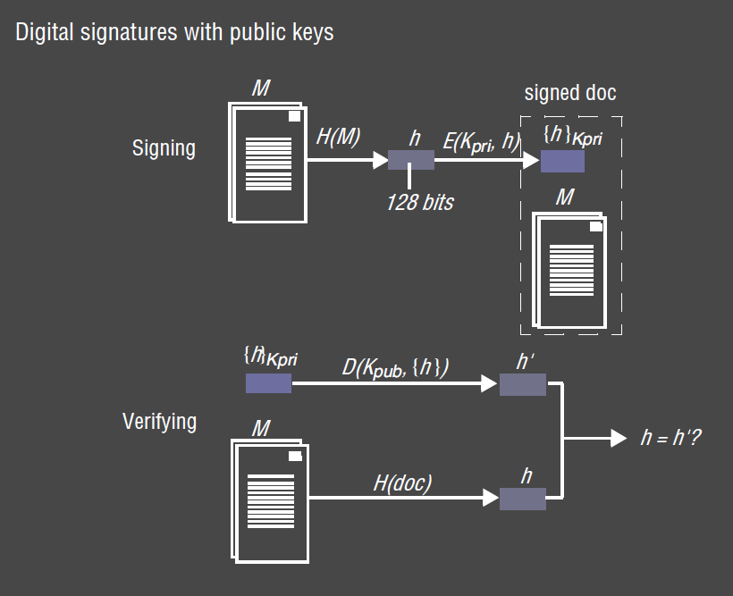
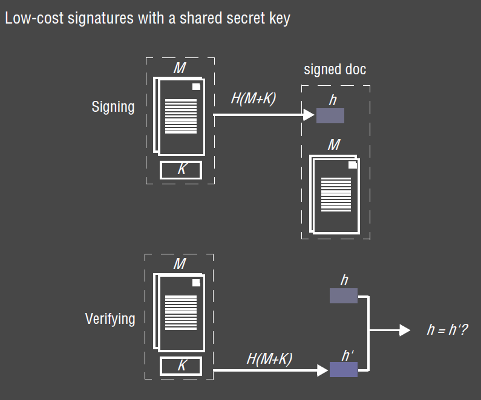
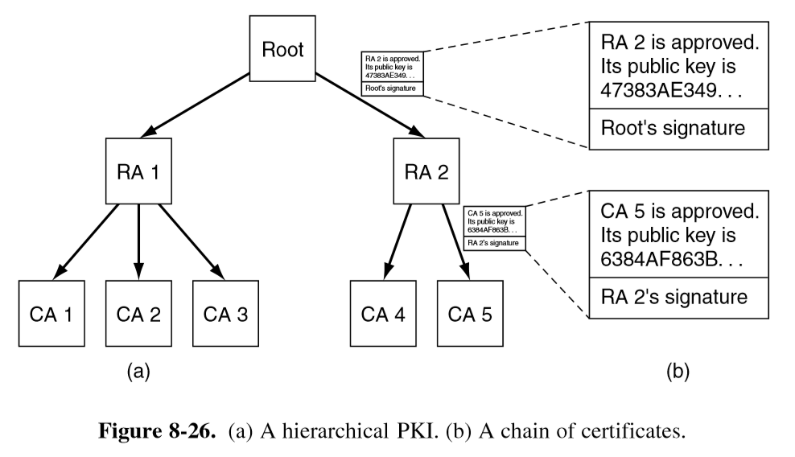
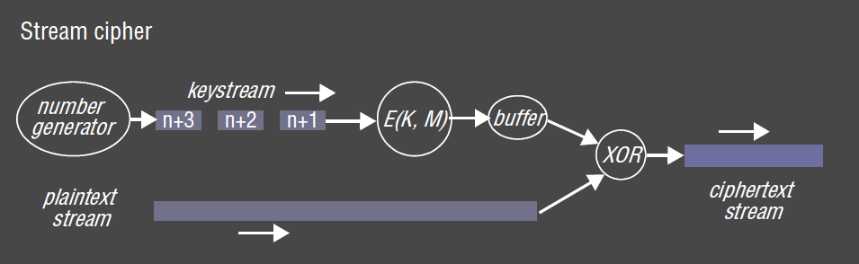
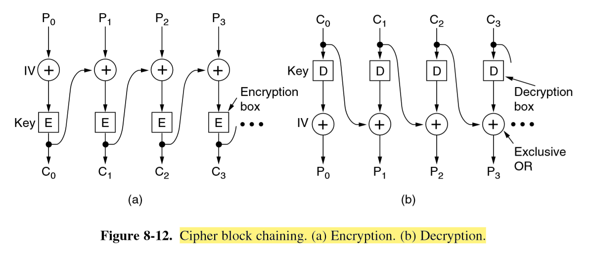
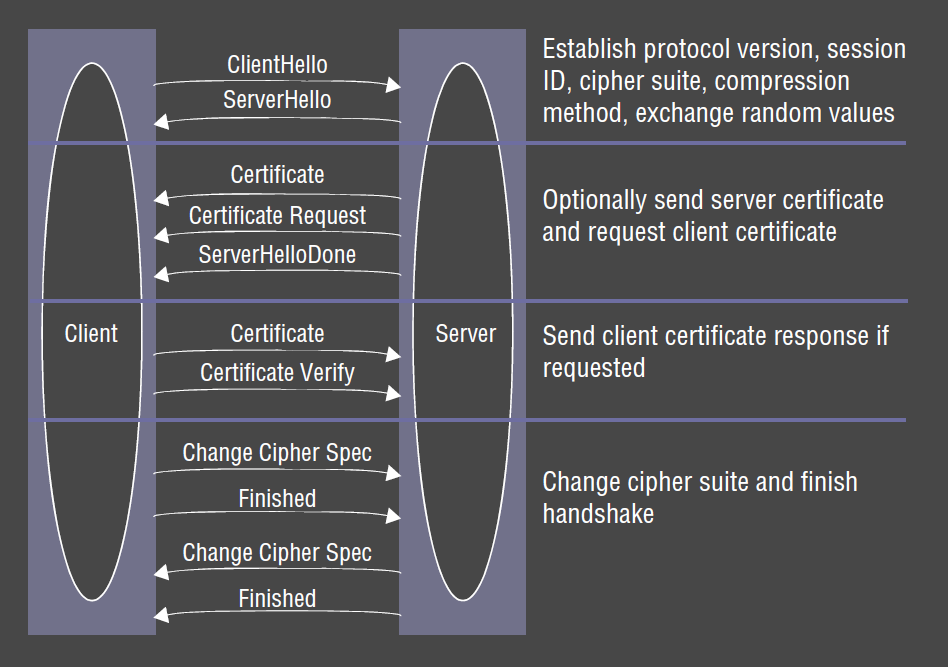
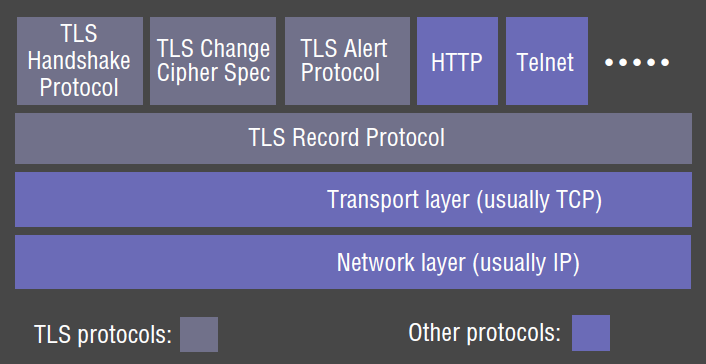
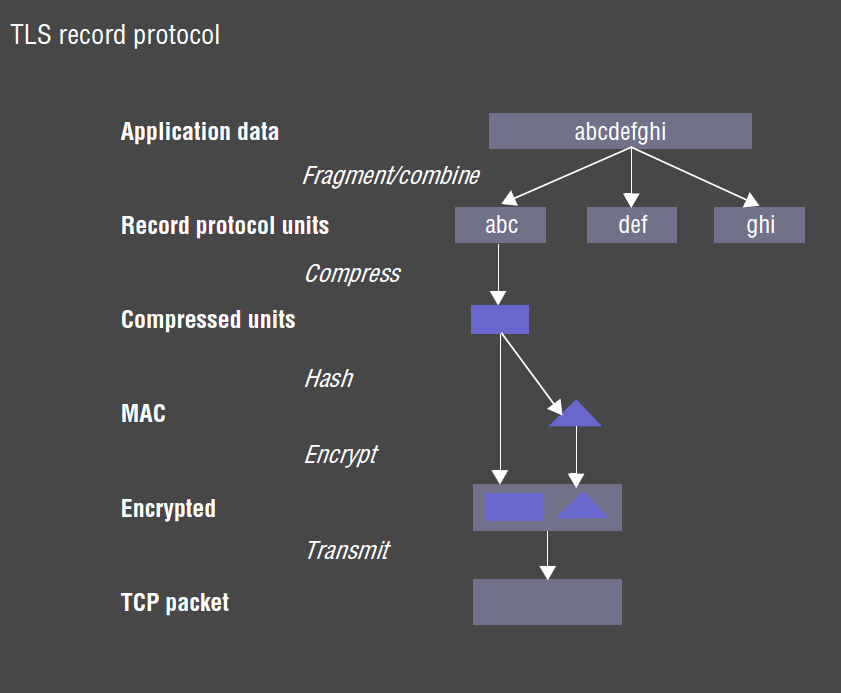

---
title: Security
notebook: Distributed Systems
layout: note
date: 2020-10-15
tags: 
...

0 TODO: add link to comp systems summary <15-10-20, yourname> 0

[[toc]]

## Challenges of Security

- challenges arise due to need to share/distribute resources
- __security policy:__ statement of required __integrity and privacy__ of shared information
  - other limits to allowable usage of shared resource
- __security mechanism:__ enforces a security policy
  - cryptography is the basis of most mechanisms

## Threats and Attacks

### Threats 

Main classes of security threats
- __leakage:__ acquisition of information by unauthorised recipients
- __tampering:__ unauthorised alternation of information
- __vandalism:__ interference with proper operation of a system without gain to perpetrator

- obvious threats: reading traffic on shared network
- unobvious threats: pretending to be official server

### Attacks

- depend on access to existing communication channel
- misuse of communication channel can take various forms

- __eavesdropping:__ obtaining copies of messages without authority
- __masquerading:__ sending/receiving messages using the identity of another principal without their authority
- __message tampering:__ intercepting messages, and altering their contents before passing them on
  - e.g. man-in-the-middle attack
- __replaying:__ storing intercepted messages and sending them at a later date
- __denial of service:__ flooding a channel or other resource with messages in order to deny access to others

### Threats from Mobile Code

- when distributed system allows code to be communicated for execution by other hosts, it needs to
  provide protection to ensure that the host is secure from operations the mobile code undertakes
  while permitting legitimate operations
- e.g. code delivered in email or via web browser: OS usually asks user whether code should be trusted or not
- Java VM: sandboxed to ensure mobile code is not a security risk
  - gives each application its own environment, which has its own security manager that determines available resources 
  - security manager cannot be replaced once set
  - JVM stores downloaded classes separately to local classes to prevent replacement with malicious variants
  - bytecodes are checked for validity, and that instructions won't access illegal memory addresses
- producing secure environments for running mobile code is more challenging than providing secure channels

### Information Leakage

- observing transmission of a message can reveal information: e.g. flood of messages to stock broker regarding a particular 
  stock may signal high level of trading
- can be very difficult to prevent
- system must appear to be random in order for no information to be leaked

### Securing Electronic Transactions

- many Internet uses require secure transactions
- email: personal info, used for authentication
- purchase of goods & services: payments via web interface, delivery of digital products
- banking transactions
- micro-transactions

#### Example security policies

- authenticate vendor to buyer so buyer is confident server is operated by vendor
- ensure credit card + personal details are transmitted unaltered and privately
- responses from the vendor should be received without alteration or disclosure during transmission
- authenticating buyer not usually required, as long as payment is received

## Designing Secure Systems

- known threats can be listed, designer can document how threats are addressed
- logs can be used for audit and to determine security violations
- costs of implementing policy need to be traded against threat
- security should not needlessly inhibit legitimate uses

### Worst case assumptions

- interfaces are exposed: e.g. socket interface is open to the public
- networks are insecure: messages can be looked at, falsified, copied
- algorithms and program code are available to attackers: 
  - the larger the secret the greater the risk of its disclosure
  - open source provides benefit in finding security problems, and scrutiny of methods
- attackers may have access to large resources
  - note Moore's law: resources of attackers are likely to grow exponentially over the lifetime of 
    the product

### Design Guidelines 

- minimise the trusted base
- limit the lifetime and scope of each secret 

## Cryptography

- public key encryption algorithms: 100-1000x more processing power than symmetric algorithms

### Standard participants

- Alice, Bob, Carol, Dave: general participants
- Eve: eavesdropper
- Mallory: malicious
- Sara: server

### Notation

- $k_B$ Bob's secret key
- $k_{ AB }$ shared secret key between Alice and Bob
- $k_{A\text{ priv }}$ Alice's __private__ key: known only to Alice
- $k_{ A\text{pub}}$ Alice's __public__ key: shared freely
- $\{M\}_k$ message $M$ __encrypted__ with key $k$
- $[M]_k$ message $M$ __signed__ with key $k$
- $\{M\}_k = E(M, k), M = D(\{M\}_k, k)$
  - $E$ encryption algorithm
  - $D$ a decryption algorithm

### Scenario 1: Secret communication via shared secret key

- fundamental policy: ensure secrecy of message

Alice and Bob share a secret key $k_{AB}$, and agree upon an encryption/decryption algorithm.

If the decrypted message makes sense or contains an agreed upon-value (checksum etc), Bob can be confident: 

- the message came from Alice
- the message hasn't been tampered with

__Issues__
- how to securely __send the shared key__?
- how can Bob know any message is not a __replay__?

Alice needs to send something with the message so that Bob can verify it isn't a replay

### Scenario 2: Authenticated communication with a server

- Alice wants to access Bob's resource.
- Sara is a securely managed authentication server.
- Sara issues passwords to all users, and knows secret keys $k_A, k_B$, as they are derived from the passwords.
  - user passwords aren't transmitted over the network
- __ticket__: encrypted item issued by authentication server, containing the identity of the principal 
  and a shared key generated for the current communication session

1. Alice sends a plaintext message to Sara stating identity and requesting a ticket for access to Bob
2. Sara sends a ticket $\{K_{AB}, \text{Alice}\}_{K_B}$ to Alice encrypted with $k_A$ containing ticket encrypted by $k_B$, and a
   new secret key $k_{AB}$: $\{\{\text{Ticket}\}_{K_B}, K_{AB}\}_{K_A}$
3. Alice decrypts with $K_A$, giving a ticket for Bob and a shared key: 
     - Alice can't tamper with the ticket, as it's encrypted with $K_B$
4. Alice sends the ticket to Bob with her identity and request $R$ to access a file: $\{\text{Ticket}\}_{K_B}, Alice, R$
5. Bob decrypts the ticket with $K_B$, allowing him to confirm Alice's identity, and establishes a shared session key $K_{ AB }$

- this approach is simplified version of that used in Kerberos
  - full version includes protection against replay attacks and other weaknesses

__Issues__
- how to trust server?
- how to enrol in the system?

### Scenario 3: Challenge-response

- authentication server is only practical when all users are part of a single organisation
- __challenge-response technique:__ identity of a client is established by sending the client an encrypted message 
  - only the client should be able to decrypt it
  - if the client cannot decrypt the message, they cannot properly respond
- common use: avoid sending passwords in the clear

### Scenario 4: Authenticated communication with public keys

- Alice accesses __key distribution service__ Sara to obtain a __pub-key certificate__ `Cert`
  giving Bob's public key, signed by Sara using $k_{Spriv}$
  - $k_{Spub}$ is widely known, so Alice can used it to check the signature
  - the certificate contains $\text{Bob},\text{keyname},k_{Bpub}$
- Alice creates $k_{AB}$ and encrypts it using $k_{Bpub}$
- Alice sends this to Bob, with a name identifying the public/private key pair (Bob may have multiple)
  - $\{\text{keyname}, k_{AB}\}_{k_{Bpub}}$
- Bob decryptes the message with $k_{Bpriv}$ to get $k_{AB}$
- Alice and Bob can now communicate securely
- if the message was tampered with, $k_{AB}$ won't match, and the messages Bob sends back to Alice will be garbled

## Digital Signature

- __digital signature__: binds an identity to a message
  - for public/private key exchange, the _identity_ is the key pair itself
  - verifies to third party that a message/document is an unaltered copy of the one produced by the signer
- provides 
  - authentic
  - unforgeable
  - non-repudiable
- __digest__ $Digest(M)$: maps an arbitrary message $M$ to a fixed length message 
  - e.g. SHA-1
- Alice wants to sign $M$, so constructs $M,\{Digest(M)\}_{k_{Apriv}}$
- Receiver Bob decrypts the digest using $k_{Apub}$
- Bob computes digest of $M$ locally.  If the message/digest have been tampered with, the results won't match
- signature based on identity $k_{Apriv}$: 
  - no other private key would produce that encrypted digest
  - no other message is likely to produce that digest
  - __non-repudiation:__ Alice cannot deny having signed the message

### MACs - Digital signatures with secret keys

- public-key method is most convenient most of the time:
  - difficult to securely transmit secret key used for signing, ...
- when a secure channel is used to transmit unencrypted messages, but an authenticity check is needed, 
  __Message Authentication Codes__ can be used
  - more limited purpose
  - authenticate communication between pairs of principals using a shared secret

- performance advantage over pub-key digital signatures: no encryption
- TLS supports variety of MACs

## Certificates

- __digital certificate:__ document containing statement signed by a principal
  - principal's public key must be known to anyone who wants to authenticate the certificate
  - principal is known as __certifying authority__
- e.g. Bob is a bank.  
  - Customers establish contact for the first time.  They need to know they are talking to Bob
  - Bob needs to authenticate customers before giving account access
- might contain information like: 
  - Certificate type: public key
  - Name: Bob
  - Public key: $k_{Bpub}$
  - certifying authority: Sara
  - Signature: $\{Digest(name+k_{Bpub})\}_{k_{Spriv}}$
- certificate says "Sara certifies Bob's public key is $k_{Bpub}$"
- Sara cannot deny this attestation

### Certificate Chain

- for Alice to authenticate a certificate from Sara, Alice first needs Sara's public key
  - recursive problem
- e.g. __certificate chain:__ assume Carol signs certificate attesting to Bob's public key
  - Sara has signed a certificate attesting to Carol's public key
  - if Alice trusts Carol's certificate she can authenticate Bob's identity
  - otherwise, Alice first needs to authenticate Carol's identity using Sara's certificate
- __certificate revocation:__ usually uses expiry dates
- how do you choose a trusted authority from which a chain of authentications can be built
- a number of __root certificates__ are installed with each browser/operating system from which
  certificate chains ccan be constructed

- X.509: standard for digital certificates

## Cryptographic Algorithms

- symmetric/shared key
  - e.g. AES: variable block length and key length
- asymmetric
  - e.g. RSA: security from difficulty of factoring large primes
  - weakness: attacker has public key, so can attempt to encrypt all possible messages to find one that matches
    - defend against this by only encrypting messages with at least as many bits as they key.  then the attack is
      equivalent to trying all possible keys
- __block ciphers:__ operate on fixed size blocks of data (e.g. 64 bits)
  - message is subdivided into blocks, with last block padded out
  - each block is independently encrypted
  - blocks are transmitted as soon as encrypted
- __cipher block chaining:__ avoids problem of identical plain text blocks being encrypted to identical encrypted blocks
  - if the same message is sent to different recipients, it will still look the same, posing an information leakage weakness
  - __initialisation vector__ used to guard against this by starting each message in a different way
- __stream cipher:__ used when data cannot be easily divided into blocks
  - __key stream__ is agreed upon (from a RNG with known seed)
  - output is `XOR`ed with data stream

### Cipher Block Chaining (CBC)

- encryption: each plaintext block is XORed with the preceding encrypted block
- decryption: block is decrypted, and preceeding encrypted block is XORed with it to obtain new plaintext block
- works because XOR is its own inverse

## Transport Layer Security

- TLS succeeds Secure Socket Layer (SSL) protocol
- intent: provide flexible means for client and server to communicate using a secure channel
- adds secure communication layer below existing application-level protocols
- widely used to secure HTTP interactions `https:`
- prevents eavesdropping, tampering, message forgery
- typically server is authenticated, client is unathenticated (however both can be authenticated if required)
- only requirement: pub-key certificates are issued by authority recognised by both parties

### Handshake Protocol

- peer negotiation for algorithm support
  - choose cipher, compression, connection parameters 
- key exchange using pub-key encryption, with certificate based authentication
  - __master secret:__ negotiated and used to generate all other key data
- symmetric cipher-based traffic encryption

### Security Measures

- records are numbered
- sequence numbers are included in signatures
- message ending the handshake sends hash of all exchanged data seen by both parties
  - hashing: XOR results of both MD5 and SHA in case one is vulnerable

### Protocol stack

- __Record Protocol:__ layer above Transport layer to exchange records

### Record Protocol 

### Java secure server

- Java secure server/client: need to use a __keystore__ file which contains certificates and other data needed for SSL

