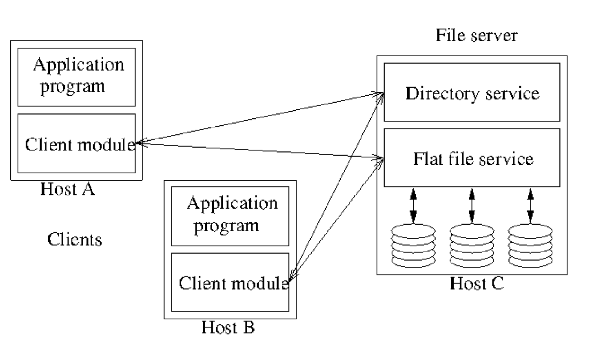
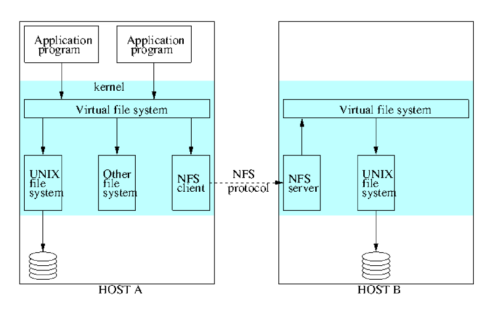
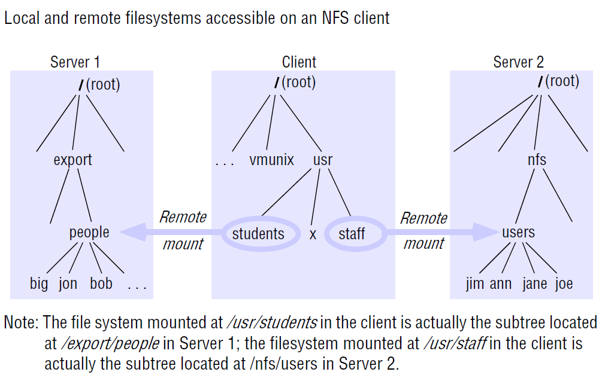

---
title: File Systems
notebook: Distributed Systems
layout: note
date: 2020-10-22
tags: 
...

[TOC]: #

## DFS Summary

- key design issues for distributed file systems
  - effective client caching for performance similar to local file system
  - maintaining consistency of files copied in multiple client caches
  - recovery from server/client failure
  - high throughput for reading/writing files
  - scalability

## File Systems

- __filesystem vs file system__:
  - __filesystem:__ set of files held in a storage device/partition
  - __file system:__ software component providing access to files

- __file system:__ provides 
  - convenient programming interface for persistent/disk storage
  - name space (hierarchical/flat)
  - sharing of data between users
    - access control
    - file-locking 
- access files in early days of networking
  - FTP, Telnet
  - lacks transparency: need to know IP address, as well as directory structure
- __distributed file system:__ emulates non-distributed file system for client programs running
  on multiple remote computers
  - transparency: local computing, with a remote file system
- __file service:__ allow programs to store and access remote files as they do local ones
  - access files from any computer on intranet
  - hosts providing such services can be optimised for multiple disk drives, and can supply
    file services for other services (web, email)
  - facilitates backup and archiving

- __files:__ data + attributes
  - data: sequence of bytes that can be accessed/modified
  - attributes: timestamps, file type, owner, access control lists
- files have a name. 
- __directory:__ file containing list of other files

### File System Layers

- __Directory:__ relate file names to IDs
- __File:__ relate file IDs to particular files
- __Access control:__ check permissions for requested operations
- __File access:__ read/write file data/attributes
- __Block:__ access/allocate disk blocks
- __Device:__ disk IO and buffering

### UNIX file system operations

- `open`
- `create`
- `close`
- `read`
- `write`
- `lseek`: move read/write pointer to new position in the file
- `link`: add new name for file
- `stat`: get file attributes

## Distributed File System Requirements

- e.g. Hadoop 

### Transparency

- __Access:__ clients unaware of distribution of files
  - uniform API for accessing local and remote files
- __Location:__ clients see a uniform file name space
  - names of files should be consistent regardless of where the file is physically stored
- __Mobility:__ client programs/admin services don't need to change when the files are physically
  moved
- __Performance:__ client programs should perform satisfactorily while the load varies in 
  specified range
- __Scaling:__ service can be expanded by incremental growth

### Concurrent file updates

- multiple clients' updates should not interfere with each other
- should be able to manage policies
- solutions
  - file, record-level locking
  - isolation

### File replication

- multiple copies of files over several servers: reduced latency, scalability, 
  fault tolerance
- requires other copies are updated when one copy is modified
- full replication is challenging to implement
- solutions
  - cache all/part of file: gives many benefits

### Heterogeneity

- client and server should be able to operate on various hardware/OS
- i.e. design must be compatible with the file system of different OS
- use protocols to standardise operations with server

### Fault tolerance

- transient communication problems shouldn't result in file corruption 
- system should still function as much as possible when clients/server fails
- faults need to be detected, reported, and corrected
- invocation semantics: can be
  - at-most-once 
  - at-least-once: simpler, but requires idempotent operations
- servers can be __stateless__ such that there is no recovery required if a server goes down
- solutions
  - redundant copies of data, redundant hardware, backups, transaction logs
  - stateless servers
  - idempotent operations

### Consistency

- multiple, concurrent access to file should see consistent representation of the file
  - complete, current, correct
- differences in file's location/update latencies shouldn't make the file look different at different times
- file metadata should be consistent on all clients
- particular concern when data is replicated
- solutions:
  - timestamps and ownership info

### Security

- file systems need to be protected against
  - unathorised access
  - data corruption
  - loss and other threats
- solutions:
  - access control: ownership, permissions
  - client requests should be authenticated
  - data transfer should be encrypted

### Efficiency

- comparable to conventional file systems

## File Service Architecture

- abstract architecture based on NFS

### Flat file service

- implements operations on contents of files
- __UFID, Unique File Identifier__ given to flat file service to refer to the file to operate on
  - unique over all files in the distributed system
- flat file service creates a new UFID for each new file it creates

### Directory service

- maps between text file names and UFID
- creates directories, and manages files within them
- client of flat file service, as directory files are stored there

### Client module

- integrates directory service and flat file service to provide API expected by client applications
- client maintains a list of available file servers
- caching to improve performance

## Flat file service interface

- UNIX interface requires the filesystem to maintain state (in the __file pointer__), which is 
  manipulated during read/write
- flat file service differs from UNIX interface for __fault tolerance__
  - __repeatable operations:__ except for `Create`, operations are idempotent, permitting 
    at-least-once RPC semantics
  - __stateless server:__ flat file service doesn't need to maintain state.  Can be restarted
    after failure and resume operation without need for clients/server to restore any state
  - files can be accessed immediately, c.f. UNIX where they first need to be opened

### RPC Calls

- `Read(UFID, i, n) -> Data`: read up to $n$ items from position $i$ in the file
- `Write(UFID, i, Data)`: write data starting at position $i$ in the file
- `Create() -> UFID`: creates a new file of length 0, and returns its UFID
- `Delete(UFID)`: remove file from file store
- `GetAttributes(UFID) -> Attr`
- `SetAttributes(UFID, Attr)`

## Flat file service access control

- service needs to 
  - authenticate RPC caller
  - prevent illegal operations: e.g. legal UFIDs, enforce access privileges
- cannot store access control state: would break idempotency
- options: 
  - access check made whenever file name is converted to UFID, and results encoded as a capability 
    returned to client for submission to flat file server
  - user ID can be submitted for every request, with access checks performed by flat file server for
    each file operation

## Directory service interface

- primary purpose: translation from file name to UFID
- directory server maintains directory files, which store this mapping
- directory files themselves are stored in flat file server: directory server is a client of the flat file server  
- in a hierarchical file system, the client function can make requests for UFIDs corresponding to each component of the pathname

### Interface

- `Lookup(Dir, Name) -> UFID`: return UFID for file name in given directory
- `AddName(Dir, Name, UFID)`: add file name with UFID to directory
- `UnName(Dir, Name)`: remove file name from directory
- `GetNames(Dir, Pattern) -> Names`: return all names matching a pattern

## File Group

- __file group:__ collection of files on a given server
- server may hold several file groups, and file groups can be moved between servers
- files __cannot__ change file group
- permits file service to be implemented across several servers
- files given UFIDs that ensure uniqueness across different servers
  - e.g. concatenate server IP address with a date the file was created
  - permits files in a group (i.e. files with common __file group id__) to be relocated to a
    different server without conflicting with files already on that server
- mapping of UFIDs to servers can be cached at client module

## Sun Network File System

- uses architecture described above
- many implementations of NFS following NFS protocols, using a set of RPCs that provide means for 
  the client to perform operations on the remote file store
- NFS client makes requests to NFS server to access files

### Virtual File System

- __Virtual file system (VFS):__ used by UNIX to provide transparent access to any number of different file systems, combining
  remote and local file systems into a single filesystem
  - maintains VFS structure for each filesystem in use
  - maintains __v-node__ for each open file, which records whether file is local/remote
    - if local, v-node contains reference to `i-node` on UNIX file system
    - if remote, v-node contains reference to files NFS __file handle__, a combo of __filesystem 
      identifier, i-node number__ and any other identifying info
- NFS integrated in the same way 

### Client Integration

- emulates UNIX file system primitives closely
- NFS client is integrated within the kernel, meaning:
  - user programs can access files using UNIX system calls without recompiling or reloading
  - one client module serves all user-level processes (with a shared cache)
  - encryption key used to authenticate user IDs passed to the server can be retained in the kernel:
    this prevents impersonation by user-level clients
- client transfers blocks of files from server host to local host and caches them
  - shares the same buffer cache used for local IO
  - as several hosts may access the same remote file concurrently, caching poses a consistency problem

### Server Interface

- NFS server interface integrates directory and file ops in a single service
- `create(filename, targetDirectoryHandle)`: both creates and inserts file names in directories in a single operation
- primitives resemble UNIX filesystem primitives

### Mount Service

- __mount service:__ process running at user level of an NFS server computer, allowing clients to mount subtrees of remote filesystems
- each server maintains a file (`/etc/exports`) describing the parts of the local filesystems available for remote mounting
- clients use a modified UNIX `mount` to request mounting of a remote filesystem, which communicates using an RPC mount protocol
- remote filesystems can be hard/soft-mounted in a client's file system:
  - __hard-mounted filesystem:__ blocks on each access until the access is complete
    - i.e. a user-level process accessing a file is suspended until the request is completed
    - if the remote host is unavailable, the NFS client module continues to retry until the request is satisfied
  - __soft-mounted filesystem:__ retries a few times before returning an error to the calling process

### Server caching

- conventional UNIX systems: data read from disk/pages are retained in main memory buffer cache, 
  and evicted when buffer space is needed.  Accesses to the cache do not require disk access
  - __read-ahead:__ anticipates read accesses, fetches pages following those recently read
  - __delayed-write/write-back:__ optimises writes to disk by only writing pages when both modified
    and evicted 
    - UNIX `sync` flushes modified pages every 30s
  - works for conventional filesystem on single host, because there is only 1 cache and file 
    accesses cannot bypass it
- use of cache at server for client _reads_ introduces no problems
- use of cache for _writes_ requires special care: client needs to be confident writes are persistent
  if server crashes
- options: cache policies used by the server
  - __Write-through__: data written to cache and directly to disk
    - client can be sure data is stored persistently as soon as the reply is received
    - increases disk I/O and latency for write
    - operation completes when the data has been written to disk
    - poor when server receives large number of write requests for the same data: causes performance bottleneck
    - saves network bandwidth
  - __Commit__: data is written to cache and is only written to disk when a commit operation is received
    for the data
    - reply sent when data has been written to disk 
    - client can be sure data is persistently stored only when a reply to a commit has been received
    - uses more network bandwidth
    - may lead to uncommitted data being lost
    - receives full benefit of cache
    - standard NFS clients use this mode, issuing commit whenever a file open for writing is closed

### Client Caching

- NFS Client caches data reads, writes, attributes and directory operations to reduce network IO
- caching at the client: problem for cache consistency, as different caches on multiple clients, 
  and the server
- reading and writing are both problems: a `write` on another client between
  two `read`s will lead to the second `read` being incorrect
- NFS clients are responsible for polling the server for currency of cached data (i.e. are there any updates?)

- timestamp method is used to validate cached blocks before used
- each item in the cache is tagged with 2 timestamps:
  - $T_c$: time when a cache block was last validated by the client
  - $T_m$: time when a block was last modified
- cache block is valid at time $T$ if 
  - $T-T_c < t$ where $t$ is a freshness interval, or
  - $T_{m, client}= T_{m,server}$: i.e. the data hasn't been modified at the server since the cache entry was made
- value of $t$ is a trade off between consistency and efficiency
- small value for $t$ leads to close approximation of __one-copy consistency__, but costs greater
  network IO
- in Sun Solaris clients $t$ is set adaptively (3-30s) depending on file update frequency
  - for directories its only 30-60s, as there is a lower risk of concurrent updates
- validity check is made on each access to a cache block
  - first half of check requires no network IO, and if this is true, the second condition need not be checked
- separate server $T_{m,server}$: kept by server for file attributes
  - if first half of check is found to be false, the client contacts the server to retrieve $T_{m, server}$ for file attributes
  - if it matches $T_{m,client}$ then cache block is valid, and client sets $T_c$ to the current time
  - otherwise, cache block is invalid, and the client must request a new copy
- traffic can be reduced by applying new values of $T_{m,server}$ to all relevant cache blocks and piggy-backing attribute values with
  results of every operation on the file
- write-back is used for writes, where modified files are flushed when a file is closed or when a sync operation takes place in the VFS.
  - special purpose daemon is used to do this asynchronously

### NFS Summary

- $\checkmark$ access transparency: applications are usually unaware files are remote
- $\times$ location transparency: not enforced; no global namespace as different clients can 
  mount filesystems at different points
- $\times$ mobility transparency: if server changes, the client must be updated
- $\thicksim$ scalability: good, can be better.  System can grow to accommodate more servers 
  as needed. Bottlenecks when many processes access a single file.
- $\times$ file replication:  not supported for updates.  Additional services can be added to do 
  this
- $\checkmark$ Hardware/OS heterogeneity: NFS implemented on most OS and hardware platforms
- $\checkmark$ fault tolerance: acceptable.  NFS is stateless, idempotent.  Options to handle 
  failures
- $\checkmark$ consistency: tunable. not recommended for close synchronisation between processes
- $\checkmark$ security: Kerberos is integrated with NFS. Secure RPC also an option
- $\checkmark$ efficiency: acceptable, can be tuned.

## Dropbox

- 100+ millions users, 1 billion files/day
- design
  - small client with minimal resource usage
  - works with a low-capacity/disrupted network
  - backend scales
- read/write ratio of 1:1 c.f. typical value of 100:1 for Twitter/Facebook
- traffic only when changes occur
- uses compression to reduce traffic

