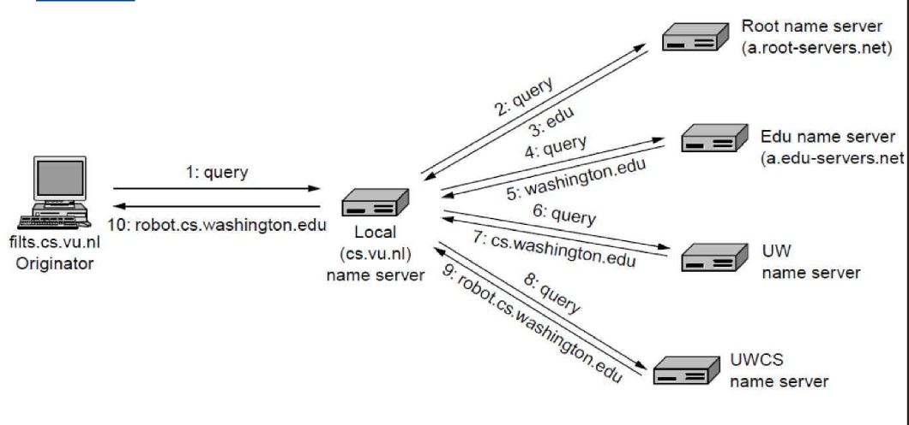
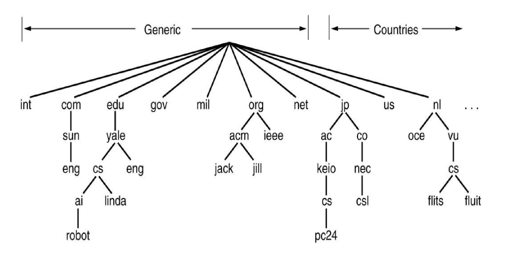

---
title: Name Services
notebook: Distributed Systems
layout: note
date: 2020-10-29
tags: 
...

[TOC]: #

# Name Services

## Overview 

- name services are used by client processes to obtain resource attributes given their names
  - resource: e.g. file
  - attribute: e.g. attribute
- directory services: look up services when given some of their attributes
- name spaces: structure and management
- implementation of name services

### Names and Addresses

- __names:__ used to refer to shared resource
  - computers
  - services
  - remote objects
  - files
  - users
- names are needed to request a computer system act on a specific, chosen resource
- processes need to be able to name resources to share them
- users need to be able to name each other to directly communicate
- sometimes descriptive __attributes__ of a resource uniquely identify it
- __human-readable names:__ e.g. `/etc/passwd`, `http://www.registermachine.com`
- __identifier:__ not usually human-readable, e.g. remote object references, NFS file handles
  - more efficiently stored and processed by software
- __attribute:__ value of a property associated with an object

- __address:__ value identifying the location of the object, rather than the object itself
  - attribute of an object
  - efficient for accessing objects
  - cannot be used as a name, because the object may change its address
- __pure name:__ contains no information about the object itself.
  - Must be looked up to obtain an address before the named resource can be
    accessed 
  - e.g. names of people are pure names
  - uninterpreted bit patterns
  - __address__ is the opposite extreme
- __non-pure name__ contains some information about the object, typically location information

- a name is __resolved__ when it is translated to data about the named resource
- __binding:__ association between a name and an object
  - __names__ are bound to object __attributes__, rather than the objects themselves
  - DNS maps human readable domain names to IP addresses/other attributes
  - X500 directory service: can map a person's name onto attributes e.g. email address, phone
    number


- __local significance:__ many names only have meaning to the service that creates it
  - when a service allocates a resource it generates a unique name, and a client to the 
    service needs to supply the name in order to access that resource
- sometimes the client can specify to the service the desired name for a new resource 
  - e.g. email username they would like
  - service is responsible for ensuring username is __locally unique__
  - then, in combination with __unique domain name__, the email address is unique
- services may need to cooperate to have __name consistency__
  - e.g. NFS users need the same unique ID on both the client and server to ensure ownership
    rights are preserved

## Uniform Resource Identifiers

- __URI:__ identifies resources on the Web and other Internet resources (email boxes)
  - generic way of specifying identifier to make it easy for common software to process it
  - allows new types of identifiers to be introduced easily and existing identifiers to be used 
    widely
  - scheme at start of URI indicates kind of resource being named `scheme:`
  - e.g. to incorporate existing identifiers such as telephone numbers, prefix it with `tel`:
    - `tel:+1-123-456-7890`
  - can define a new `widget` URI by specifying `widget:` scheme
    - all URIs obey overall URI syntax, plus any additional widget rules
- __Uniform Resource Locator (URL):__ used for URIs that provide location information, and specify
  method for accessing the resource (`http:`)
  - efficient identifier for accessing resources
  - disadvantage: if resource is deleted/moved, dangling links may remain with the old URL.
    A user may get a 404 or get a different resource occupying the same location
- __Uniform Resource Names (URNs):__ URIs used as pure resource names rather than locators
  - requires resolution service/name service to translate URN into an actual address
  - `urn:` prefix is allocated for URNs
  - e.g. `urn:ISBN:0-201-62433-8` identifies a resource (book) by ISBN number

- `doi:10.1007/s10707-005-5887-8` 
  - lookup service is `http://dx.doi.org/10.1007/s10707-005-5887-8`
  - resolves to `http://springerlink.com/content/c250mnlu2m7n5586/`
  - refers to a document _Building and Querying a P2P Virtual World_

## Name Services

- purpose: resolve a name, i.e. lookup attributes bound to a name
- separated from other services because of openness of DS, which brings:
  - __unification:__ resources managed by different services use the same naming scheme, as with 
    URIs
  - __integration:__ to share resources in different administrative domains requires naming them. 
    without a common naming service, administrative domains may use different name formats, getting
    difficult very quickly

## Goals of Global Name Service

- handle arbitrary number of names 
- serve an arbitrary number of administrative organisations
- __a long lifetime:__ over many changes to the names and system
- __high availability:__ as dependent services stop working if the name server is unavailable
  - e.g. WikiLeaks DNS blocked by US government
- __fault isolation:__ local failures do not cause entire service to fail
- __tolerance of mistrust:__ large open system cannot have any component that is trusted by all clients
  - false attributes given to names

## Name spaces

- __name space:__ defines set of names valid for a given service
  - service will only lookup a valid name
- name space structure
  - can be hierarchical, like DNS and UNIX filenames
  - can be flat: e.g. randomly chosen integer ID
- structured names allow 
  - efficient lookup
  - name can incorporate semantics about the resource
- length
  - fixed: e.g. 32 bit; easier to store and process
  - unbounded
- __alias:__ an alternative name for a resource.  Provides transparency.
  - may be easier to remember
  - may be a common name allowing ease of access to a resource managed by another name
    e.g. `www.eg.com` may be an alias for `a.b.com`, which may change to `b.eg.com`, while 
    the alias remains the same
- __naming domain:__ name space for which there exists a single administrative authority for 
  assigning names within it
- administrative authority is usually delegated by division of domain into subdomains, with
  each sub-domain sharing a common part of the overall name in that name space

## Name Resolution

- typically an iterative process: name either resolves to a set of primitive attributes, or it
  resolves to another name
- aliases mean resolution cycles can occur.  Solutions
  - abandon resolution after fixed number of iterations
  - require admins to ensure no cycles occur

## Distribution 

- large name databases need to be distributed across multiple services
- bottlenecks: 
  - network I/O
  - server reliability
- replication can increase availability for heavily used name services
- when you delegate name service authority, the service is naturally distributed over delegates:
  service data is usually distributed with respect to domain ownership

## Navigation 

- __navigation:__ when the resolution request propagates from one server to another 
  - can happen if the first server is unable to resolve the name
- __iterative navigation:__ client makes request at different servers one at a time, visiting
  increasingly more specific parts of the domain hierarchy
- __multicast navigation:__ client multicasts request to group/subset of name servers
  - Only server with the named request returns a result
- __non-recursive server-controlled navigation:__ client sends request to server and the server
  continues on behalf of the client iteratively
- __recursive server-controlled navigation:__ client sends request to a server and server sends
  request to another server recursively



## Caching

- critical to __performance__ of name services
- binding of names to attributes changes __infrequently__ in most circumstances
- results of resolution can be __cached by client and server__
- eliminates high level name servers from navigation path and allows resolution to proceed 
  despite some server failures
- cached data can be out of date: changes take time to propagate

## Domain Name System

- name service design whose main naming database is used across the Internet
- prior to DNS, a single central master file was maintained and downloaded to all computers that
  needed it
  - doesn't scale 
  - local organisations cannot administer their own naming systems
  - general name service was needed, not just one for looking up computer addresses
- DNS is designed for use in multiple implementations, each with its own name space

### Name space 

- name space is partitioned organisationally and geographically
- hierarchical from right to left, delimited by `.`
- top level domains e.g. `com`, `edu` `gov`
- country domains e.g. `au`, `uk`
- each domain authority can specify their own subdomains



### Queries

- applications use DNS to resolve host names into IP addresses
- also used to make requests for other services that support a domain, e.g. `MX` for mail server
- __reverse resolution:__ allows IP address to be resolved into a domain name
- __host information:__ allows information about a host to be obtained.  Usually blocked due to 
  security
- __well-known service__ allows info about services run by a computer to be returned

### Name servers

- database is distributed across a logical network of servers
- DNS naming data are divided into __zones__, containing:
  - attribute data for names in a domain (excluding those contained within a subdomain)
  - name/addresses of at least 2 name servers providing __authoritative__ data for the zone
  - names/addresses of name servers holding authoritative data for delegated subdomains 
  - zone management parameters: e.g. caching, replication
- 2 name servers need to be specified for each domain to ensure __availability__ in event of a single 
  crash
- __primary/master server__ reads zone data from a file
- __secondary server__ downloads zone data from primary server
- both primary/secondary servers provide authoritative data for the zone
- any DNS server can cache data from other servers.  They need to inform clients that data
  is not authoritative
  - each entry in a zone has TTL, after which the cached entry must be deleted/updated

### Database: Resource Records

- resource records carried by DNS replies are 4-tuples: 

```
(Name, Value, Type, TTL)
```

| __Type__ | __Value__                                                    |
|:-----:|:-------------------------------------------------------------------------:|
|  `A`  | IPv4 address for hostname `Name`                                      |
|`AAAA` | IPv6 address for hostname `Name`                                      |
| `NS`  | Hostname of authoritative DNS server for domain `Name`                           |
|`CNAME`| Canonical hostname for alias hostname `Name`                                |
| `MX`  | Mail exchange. Canonical name of a mail server.  Allows company to have same aliased name for mail and Web |

