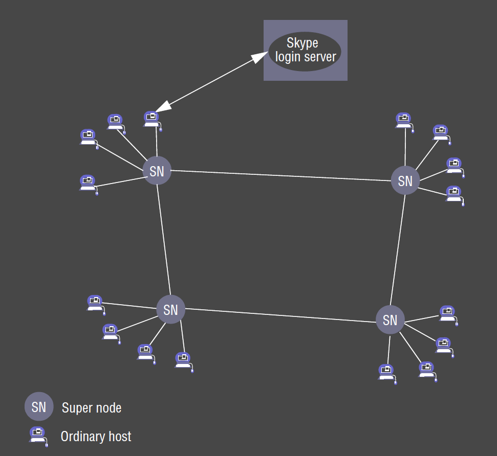

---
title: Interprocess Communication
notebook: Distributed Systems
layout: note
date: 2020-11-08
tags: 
...

# Interprocess Communication (IPC)

- Middleware
  - low layer: supports basic IPC
  - next layer: high level communication paradigm RMI, RPC

## Overview

### Java APIs for Internet Protocols

- UDP
  - message passing abstraction
  - processes transmit a single datagram to a receiving process
  - best effort
  - no guarantees

- TCP
  - abstraction of 2-way stream
  - streams have no message boundaries
  - basis of producer/consumer communication
  - transparent recovery
  - higher overhead than UDP
  - reliable
  - if connection fails, exception is produced

### Data Representation 

- how objects/data are translated into suitable form for sending as messages over 
  network
  - receiver needs to be able to decode what it receives

### Higher level Protocols

- request-reply protocols: client-server
- group multicast protocol: group communication

## API for IP

- processes use two message communication functions: `send`, `receive`
- queue associated with each message destination
  - receive side: OS is producer, process is consumer
- __synchronous communication:__ both `send` and `receive` are __blocking__
  - when a `send` is issued, sending process is blocked until `receive` is issued
  - when a `receive` is issued, process blocks until a message arrives
- __asynchronous communication:__ `send` is non-blocking
  - sending process returns as soon as the message is copied to a local buffer
  - transmission of the message proceeds in parallel
  - `receive` usually blocking, but can be non-blocking
- non-blocking `receive`: provides buffer to be filled in the background
  - needs an interrupt/polling to be notified when the buffer is filled
  - may be more efficient, requires more complex code to acquire incoming message
- blocking `receive`: when you can have multiple threads in a single process (e.g.
  in Java), there are no disadvantages, as one thread can issue the blocking call
  while other threads remain active

| Communication | `send`       | `receive`          |
|:-------------:|:------------:|:------------------:|
| Synchronous   | blocking     | blocking           |
| Asynchronous  | non-blocking | blocking (usually) |

- producer/consumer: linked blocking queue
- __producer:__
  - `offer()`: look at queue - if full, returns False and doesn't add to the queue
    - otherwise adds data to the queue
    - non-blocking
  - `put()`: blocks until it can be put in the queue
    - causes context switch
- __consumer:__
  - `take()`: blocks until there's something to take from the queue
    - causes context switch
  - `peek()`: non-blocking look at the first element without removing it
  - `poll()`: returns `null` if empty, or 1st item from queue (removing it)
    - non-blocking

- NB: different to synchronous protocol: send a message and don't do anything else 
  until reply received (doesn't mean thread is blocked)
- Node uses non-blocking calls and is single-threaded

## Sockets

- __socket:__ provides end point for communication between processes
  - to receive messages, its socket must be __bound__ to a local port on one of the
    Internet addresses of the host
  - same socket can be used for both sending/receiving
  - each socket is associated with single protocol: TCP/UDP

### Java Internet Address

- `IntAddress`: class encapsulating Internet address
- call `getByName` to get an instance
- throws `UnknownHostException`

```java
IntAddress aComputer = IntAddress.getByName("registermachine.com")
```

## UDP datagram Communication

- server (receiver) binds its socket to a server port (known to the client)
- client (sender) binds socket to any free port
- receive method returns Internet address/port of the sender with the message
  - this allows replies to be sent
- message size
  - receiving process defines array of bytes to receive message
  - if too big message is truncated
  - practical limit 8kB
  - protocol allows packets up to $2^16$ bytes
- barebones: low overhead
- e.g. DNS, VoIP

### Blocking

- non-blocking `send`s
- blocking `receive`s
- message delivered to message buffer of socket bound to the destination port
- invocations of receive on the socket collect the messages
- messages discarded if no socket bound to the port

### Timeouts

- `receive` waits indefinitely until messages received
- can set timeouts on sockets to exit from infinite waits and check condition of 
  sender e.g. `Thread.interrupt()`
- `receive` allows receiving from any port
  - can be restricted to given IP addr/port

### Possible failures

- __data corruption:__ detected with checksum
- __omission failures:__ buffers full, corruption, dropping
- __order:__ messages may be delivered out of order

### Java API

- `DataGramPacket`
  - 2 constructors for sending or for receiving
  - `getData()`
  - `getPort()`
  - `getAddress()`
- `DatagramSocket`
  - constructors: port number/no argument
  - `send()`
  - `receive()`
  - `setSoTimeout()`
  - `connect()`

- see textbook for client/server e.g.  

## TCP Stream Communication 

- __message sizes:__ no limit on data size
- __lost messages:__ acknowledgement scheme retransmits unacknowledged packets
- __flow control:__ receive window; match speed between sender/receiver
- __congestion control:__ prevent congestion collapse of network
- __duplication/ordering:__ sequence numbers ensure duplicates are rejected and
  reordering occurs as necessary
- __destinations:__ connection established before communication
- e.g. HTTP, FTP, Telnet, SMTP

### Establishing TCP stream socket

- __client:__
  - create socket with server address + port
  - read/write data using stream associated with socket
- __server:__
  - create listening socket bound to server port
  - wait for clients to request connection: listening socket maintains a queue
    of incoming connection requests
  - server accepts a connection and creates new stream socket for the server to 
    communicate with the client
- pair of sockets (client/server) now connected by pair of streams, one in each 
  direction. A socket has an input stream and an output stream

### Closing a socket

- data in output buffer sent to other end with indication stream is broken
- no further communication possible

### Issues

- need pre-agreed format for data sent
- blocking is possible at both ends
- if the process supports threads, best approach is to assign a thread to each 
  connection so that other clients are not blocked

### Failure model

- checksum: detect/reject corrupt packets
- sequence number: detect/reject duplicates
- timeout + retransmission: lost packets
- severe congestion: TCP streams declare connection broken
  - breaks reliable communication 
- communication broken: processes cannot distinguish between process failure and 
  process crash
- communicating processes cannot definitely say whether messages sent recently
  were received
- clean exit: very confident all data received correctly 

### Java API

- `ServerSocket`
  - used to create a listening socket
  - `accept()`: gets connect request from queue, returns `Socket` instance
  - `accept()`: blocks until connection arrives
- `Socket`
  - used by pair of processes with a connection
  - client: uses constructor specifying DNS hostname:port, creating a socket
    bound to a local port and connects to remote computer
  - `getInputStream()`
  - `getOutputStream()`

- see textbook for TCP client/server

## External Data Representation and Marshalling

- files are either __binary or text format__
  - CORBA, Java's object serialisation: binary
- binary file formats
  - faster, 
  - more flexible, 
  - uses less memory
- texted based file formats: 
  - easy to interpret
  - application specific tags can be constructed and parsed with external parsers/libraries
- data structures need to be flattened to a sequence of bytes for transmission or storage
- approaches to allow computers to interpret data
  - use agreed external format
  - transmit in senders format, with indication of format used
- __external data representation:__ agreed standard for representing data structures 
  and primitive data
  - CORBA common data representation
  - Java serialization
  - JSON
  - XML
- __marshalling:__ process of converting data to form suitable for transmission
- __unmarshalling:__ disassembling data at receiver
  - lots of validation required to ensure it conforms to expected format

### CORBA's Common Data Representation

- 15 primitive data types: short, long, unsigned short, ..., float, double, char, 
  boolean, octet, any
- primitives can be sent in big-endian/little-endian orderings
- values are sent in sender's ordering, which is specified in the message
- marshalled data only includes values of objects transmitted, not information concerning its type:
  common knowledge at sender/receiver about types of data items in the message 
- constructed types: primitive types combined in order


- marshalling: performed by middleware
  - operations can be automatically generated from data type specification 
    defined in CORBA interface definition language (IDL)
  - CORBA interface compiler generates marshalling/unmarshalling operations

### Java Object serialization

- __serialisation:__ convert an object into a byte stream for storage/transmission
- __deserialisation:__ restoring that state of an object from a serialised form
- information about the class is included in the serialization (name, version)
- all objects it references are serialized with it
- the byte stream created is __platform independent__
- references are serialised as __handles__ 
- contents of primitive instance variables that are primitive types are written in a portable 
  format using portable format using `ObjectOutputStream` methods
  - Strings/characters written using `writeUTF()`

```java 
public class Person implements Serializable {...}
```

- anonymous functions aren't usually serialisable 
- can be very inefficient
- can also implement `Externalizable`
  - programmer needs to implement flattening methods
  - potentially much more efficient
- during RMI: arguments are results are serialized/deserialized by middleware
- __reflection:__ permits automatic de-/serialization
- `transient`: Java won't transmit that variable

### XML Extensible Markup Language

- __markup language:__ textual encoding representing data and details of the structure/appearance
- XML
  - markup language defined by World Wide Web Consortium (W3C)
  - tags describe logical structure
  - __extensible__: additional tags can be defined
  - tags are generic; c.f. HTML, where tags give display instructions
  - __self-describing__: tags describe the data
  - textual: __human-readable, platform independent__
  - textual: messages are __large__, so lots of processing, storage, transmission time
  - SOAP: XML format whose tags are published for use by web services and their clients

```xml
<person id="123456789">
    <name>Smith</name>
    <place>London</place>
    <year>1934</year>
    <!-- comment -->
</person>
```

#### Elements, attributes

- __elements:__ data surrounded by tags e.g. `<name>Smith</name>`
  - __hierarchical representation__ via nesting of elements
  - empty tag with no contents terminated with `/>` e.g. <european/>
- __attributes:__ start tag optionally contains attributes: name + value
  - e.g. `id="123456789"`
- either can be used to represent data
  - substructures can only be represented with elements
  - attributes can only be used for simple data types

#### Namespace

- __namespace:__ set of names for a collection of element types and attributes 
  - referenced by a URL
  - can be specified with attribute `xmlns` with value of the URL for the file containing namespace definition
    - e.g. `xlmns:pers = "http://abc.def/person"`

```xml
<person pers:id="123456789" xlmns:pers ="http://abc.def/person">
    <pers:name>Smith</pers:name>
    <pers:place>London</pers:place>
    <pers:year>1934</pers:year>
    <!-- comment -->
</person>
```

### Schema

- __XML schema:__ defines elements/attributes that can appear in a document
  - how elements are nested
  - order/number of elements
  - whether an element is empty/can include text
  - intention: single schema definition shared by many documents
```xml
<xsd:schema xmlns:xsd = URL of XML schema definitions >
  <xsd:element name= "person" type ="personType" />
    <xsd:complexType name="personType">
      <xsd:sequence>
        <xsd:element name = "name" type="xs:string"/>
        <xsd:element name = "place" type="xs:string"/>
        <xsd:element name = "year" type="xs:positiveInteger"/>
      </xsd:sequence>
    <xsd:attribute name= "id" type = "xs:positiveInteger"/>
    </xsd:complexType>
</xsd:schema>
```

### JSON JavaScript Object Notation

- becoming dominant format used today
  - supplanting XML
  - MongoDB uses JSON derivative
- lightweight
- text-based
- easy to program with
- easy to understand
- easy to parse

- syntax diagrams at [www.json.org](https://www.json.org)

#### Parsing Numbers


- there is no limit to the number of digits: this makes it difficult to represent (e.g. in a database).
  What storage class should you use for this?
- e.g. Twitter ran out of digits for id's, so added a string version of id
- MongoDB created BSON (Binary JSON) to address numeric issues
  - this can sometimes break downstream processing that expects vanilla JSON
  - can lock you in to proprietary formats (technology lock-in)

### JSON vs XML

- JSON
  - lightweight: fewer bytes to represent the same information, reducing memory use and data transmission 
  - supports arrays
- XML
  - has attributes for metadata within tags.  To do this in JSON requires adding an extra field

## Group Communication 

- __multicast__ operation allows group communication
  - send single message to a number of processes, identified as a group
  - can happen with/without delivery guarantees
  - one packet is sent out of 1 computer, and is received by multiple parties
  - routers are responsible for routing multiple copies

### Uses 

- __propagation of event notification:__ e.g. pub-sub, Facebook.  When a status changes, all friends receive notification
- __fault tolerance when used with replicated services:__ client requests get multicast to all members of the group
  - even when some members fail, the client can still be served
- __discovering services:__ multicast used by servers/clients to locate discovery services to register interfaces etc.
- __better performance through replicated data:__ data are replicated to increase performance
  - updated data are multicast to processes managing replicas

### IP Multicast: Java API

- `MulticastSocket`: subclass of `DatagramSocket`
  - `joinGroup()`
  - `leaveGroup()`
- __IP multicast:__ built on top of IP
  - lets sender transmit a single packet to a set of computers forming a group
  - sender unaware of individual recipients, only group
  - group identified by class D IP address (224.x.x.x)
- router may not be configured to allow multicast
  - while you may be able to use it locally, ISPs do not allow it

#### API 
  
- IP multicast only available via UDP
- application can send UDP datagrams to multicast address and ordinary port numbers
- application can join a multicast group my making its socket join the group
- when multicast message reaches a computer, copies are forwarded to __all__ processes with sockets bound
  to the multicast address + port number

- see Textbook for multicast peer

#### Failure model 

- datagrams multicast over IP multicast suffer from omission failures
  - __unreliable multicast:__ not guaranteed to be delivered to any particular group member 
    - messages may not get to 1+ members due to a single omission (i.e. some, not all members receive it)

## Overlay Networks: Network virtualisation

- virtual networks can be constructed on top of an existing network (e.g. the Internet)
- these can be tailored to meet to needs of a particular distributed system
- __overlay network:__ virtual network of nodes and virtual links sitting on top of an underlying network (e.g. IP network) 
  - tailored service for needs of application
  - more efficient operation in a particular networked environment
  - additional features e.g. multicast/secure communication
- overlays are layer sitting outside standard architecture, allowing degrees of freedom to be exploited

### Advantages

- new network services can be defined without changing underlying network
- encourage experimentation to drive innovation
- multiple overlays can coexist: more open, extensible network architecture

### Disadvantages

- additional indirection: performance penalty
- additional complexity of network services

### Types


### Skype



- Skype is impure P2P application for VoIP
- developed by Kazaa - similar to Kazaa P2P filesharing application
- virtual network: establishes connections between people 
  - no IP address/port required to establish a call

- __architecture:__ P2P infrastructure of ordinary users' machines (hosts) and super nodes
  - super nodes: ordinary Skype hosts with sufficient capabilities to carry out enhanced role
    - selected based on demand, based on available bandwidth, reachability, availability
- __user connection:__ 
  - authentication via well-known login server
  - make contact with a selected super node (IP addr:port is stored in client cache)
- __search for users:__
  - super nodes: perform efficient search of global index of users
  - search orchestrated by client's chosen super node
  - expanding search until specified user found
  - on average 8 super nodes are contacted, 3-4s
- __voice connection:__ once user is discovered, Skype establishes voice connection between two parties
  - TCP: signal call requests/terminations
  - UDP/TCP for streaming audio.  TCP sometimes required to get around firewalls

### Properties

- __diameter/depth:__ shortest path between any two nodes
  - affects latency
- __degree:__ sum of in and out degree
  - affects bandwidth consumption
- __scalability bottlenecks:__ tailor depth/degree to reduce latency and bandwidth consumption

### Various Configurations

- latency/diameter $O(1)$, bandwidth/degree $O(n)$
  - every node connects to every other node, degree of all nodes is $n-1$


- diameter $O(n)$, degree $O(1)$
  - chaining


- diameter $O(\log{n})$, degree $O(1)$
  - $n$-ary Tree


- diameter $O(1)$, degree $O(\sqrt{n})$


