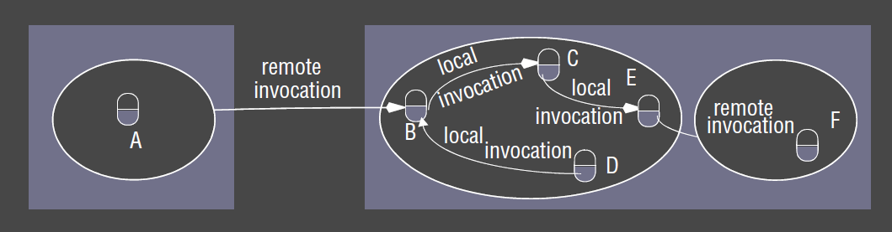
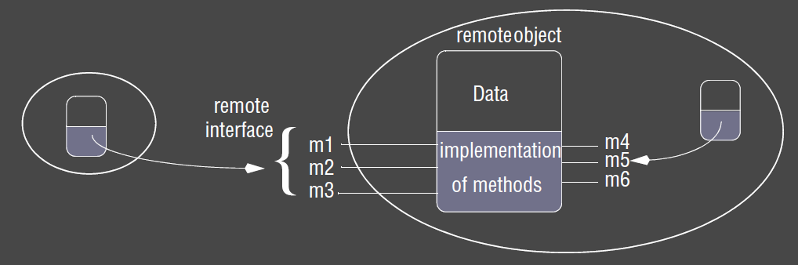
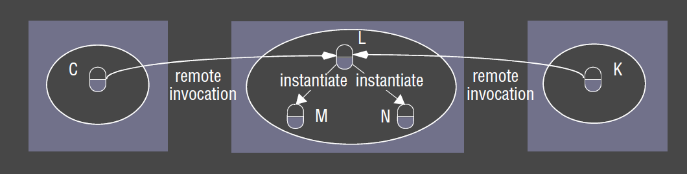
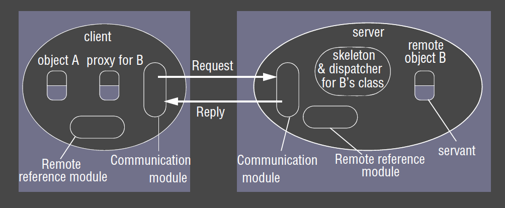

---
title: Remote Invocation
notebook: Distributed Systems
layout: note
date: 2020-11-09
tags: 
...

# Remote Invocation

- request-reply communication: most primitive; minor improvement over underlying IPC primitives
  - 2-way exchange of messages as in client-server computing
- RPC, RMI: mechanisms enabling a client to invoke a procedure/method from the server via communication between client and server
- __Remote Procedure Call (RPC):__ extension of conventional procedural programming model
  - allow client programs to transparently call procedures in server programs running in separate processes,
    and in separate machines from the client
  - i.e. to the caller, the procedures appear to be in local address space
  - RPC system hides encoding/decoding of parameters and results, message passing, and preserves required invocation semantics
- __Remote Method Invocation (RMI):__ extension of conventional object oriented programming model
  - allows objects in different processes to communicate i.e. an object in one JVM is able to invoke methods in an object in another JVM
  - extension of local method invocation: allows object in one process to invoke methods of an object living in another process

## Request-Reply Protocol

- most common exchange protocol for remote invocation

### Operations 

- `doOperation()`: send request to remote object, and returns the reply received
- `getRequest()`: acquire client request at server port
- `sendReply()`: sends reply message from server to client

### Design issues

- timeouts: what to do when a request times out? how many retries?
- duplicate messages: how to discard?
  - e.g. recognise successive messages with the same request ID and filter them
- lost replies: dependent on idempotency of server operations
- history: do servers need to send replies without re-execution? then history needs to be maintained

### Design decisions

- retry policy
  - how many times to retry?
- duplicate filter mechanism
- retransmission policy

### Exchange protocols

Different flavours of exchange protocols:

- __request (R):__ no value to be returned from remote operation
  - client needs no confirmation operation has been executed
  - e.g. sensor producing large amounts of data: may be acceptable for some loss
- __request-reply (RR):__ useful for most client-server exchanges.  Reply regarded as acknowledgement of request
  - subsequent request can be considered acknowledgement of the previous reply
- __request-reply-acknowledge (RRA):__ acknowledgement of reply contains request id, allowing server
  to discard entry from history

### TCP vs UDP

- limited length of datagrams may affect transparency of RMI/RPC systems which should be able to accept data of any size
- TCP can be chosen to avoid multipacket protocols, avoiding this issue
- TCP additional overheads: acknowledgements, connection establishmen
- TCP also ensures reliable delivery
  - no need to filter duplicates or use histories
- TCP therefore simplifies implementation of request-reply protocol
- if application doesn't require all of TCP facilities, more efficient, tailored protocol can be implemented over UDP

### Invocation semantics

- __maybe:__ RPC may be executed once or not at all
  - unless call receives result, it is unknown whether RPC was called
- __at-least-once:__ either 
  - remote procedure was executed at least once and caller received a response, or
  - caller received exception to indicate remote procedure was not executed at all
- __at-most-once:__ RPC was either 
  - executed exactly once, in which case caller received response, or
  - not executed at all, and caller receives an exception

- level of transparency provided depends on design choices and objectives
- Java RMI supports at-most-once invocation semantics
- Sun RPC supports at-least-once

### Fault tolerance

### Transparency

- location and access transparency are usually goals for remote invocation
- sometimes complete transparency undesirable:
  - remote invocations are more prone to failure due to network/remote machines
  - latency of remote invocations significantly higher than local ones
- many implementations provide access transparency, but not complete location transparency,
  allowing programmer to optimise based on location

### HTTP: RR protocol

- see comp sys notes

## RPC

- RPCs enable clients to execute procedures in server processes based on a defined service interface
- generally implemented over request-reply protocol

### RPC Roles 

- __communication module:__ implements design w.r.t. retransmission of requests, duplicate handling, result retransmission
- __client stub procedure:__ behaves like a local procedure to client
  - marshals procedure identifiers and arguments, and passes it to communication module
  - unmarshals the results in the reply
- __dispatcher:__ selects server stub based on procedure identifier, forwarding request to the server stub
- __server stub procedure:__ unmarshalls arguments in request message, and forwards to service procedure
  - marshals arguments in result message and returns to client
- __service procedure:__ actual procedure to call, implements procedures in the service interface

- client/server stub procedures, as well as dispatcher, can be generated automatically by an interface compiler

### Sun RPC

- designed for client-server communication in __NFS__
- implementer can choose to make RPCs over __UDP or TCP__
- broadcast RPC is available
- __at-least-once__ invocation semantics
- __interface definition language__ XDR (external data representation) allows you to define the remote interface
  in a standard way
- __compiler__ `rpcgen` compiles the remote interface
- has a runtime library
- interfaces are not named, but referenced by program number (obtained from central authority) and version number
- procedure definition specifies procedure signature and procedure number
  - procedure number used as a procedure identifier in requests
- procedures only allow a __single input parameter__
- output parameters 

## Remote Method Invocation

- RMI is similar to RPC, but extended to distributed objects
- a calling object is able to invoke a method in a remote object
- underlying details are generally hidden from the user

### Similarities: RMI and RPC

- support programming with interfaces
- constructed on top of Request-Reply protocols
- can offer range of call semantics
- similar level of transparency

### Differences: RMI and RPC

- full expressive power of OOP, methodologies and tools
- all objects in RMI-based system have unique object references: much richer parameter-passing
  than possible in RPC

### Distributed Object Concepts

- __object references:__ used to access objects.  Can be assigned to variables, passed as arguments, returned as results
- __actions:__ initiated by an object invoking a method in another object
  - modified state of the object
  - object state queried
  - new object created
  - tasks delegated to other objects (chain of invocations)
- __garbage collection:__ process of releasing memory that was used by objects, but is no longer in use

### Architectures

- client-server architecture: can be adopted for a distributed object system
  - server manages objects
  - clients invoke methods using RMI: the request is sent in a message to the server managing the object
  - invocation carried out, and result returned to the client
  - client/server in different processes enforces encapsulation: unauthorised method invocations are not possible
- replicated architecture: objects can be replicated to improve fault tolerance and performance

### Remote Objects

- __remote object:__ an object able to receive and make local/remote invocations
- __remote object references:__ other objects are able to invoke the methods of a remote object if they have access to its 
  remote object reference
  - identifier used throughout distributed system to refer to particular, unique remote object
- __remote interface:__ every remote object has a remote interface, specifying which of its methods can be invoked remotely
  - class of a remote object implements the methods of the remote interface
  - CORBA Interface Definition Language: allows definition of remote interfaces.  Clients don't need to use the same programming language
    as the remote object in order to invoke its methods remotely
  - Java RMI: become remote interfaces by extending `Remote`

### Distributed Actions

- actions can be performed on remote objects (i.e. in different processes):
  - e.g. executing a remote method defined in the remote interface
  - e.g. creating a new object in the target process
- actions are invoked using RMI

### Garbage Collection

- if underlying language (e.g. Java) supports GC, any associated RMI system should allow GC of remote objects
- __Distributed GC:__ local, existing GC cooperates with additional module that __counts references__ to do distributed GC

### Exceptions

- remote invocation may fail
  - process may have crashed
  - process may be too busy to reply
  - result message may have been lost
- need to have all usual exceptions for local invocations
- extra exceptions for remote invocation: e.g. timeouts
- CORBA IDL allows you to specify application-level exceptions

### Implementation

- __communication module:__ communicates messages (requests, replies) between client and server
  - two cooperating modules implement request-reply protocol
  - responsible for implementing __invocation semantics__
  - queries remote reference module to obtain local reference of object, then passes local reference to the dispatcher for the class
- __remote reference module:__ creates remote object references
  - maintains remote object table which maps between local and remote object references
- __remote object table:__ has an entry for each 
  - remote object reference held by the process
  - local proxy
- entries get added to the remote object table when
  - remote object reference is passed for the first time
  - remote object reference is received, and an entry is not present in the table
- __servant:__ objects in process receiving the remote invocation
  - instance of a class that provides the body of a remote object
  - live within a server process

### RMI Software

- software layer between application and the communication and object reference modules, composed of
  proxies, dispatchers, and skeletons
- __proxy:__ behaves like a local object to the invoker making RMI transparent to clients 
  - lives in the __client__
  - instead of executing the invocation, it forwards it in a message to a remote object
  - hides details of remote object reference, marshalling, unmarshalling, sending/receiving messages from client
  - one proxy per remote object reference the process holds
- __dispatcher:__ __server__ has 1 dispatcher + 1 skeleton for each class representing a remote object
  - receives requests from the communication module
  - uses `operationId` to select appropriate method in the skeleton
- __skeleton:__ skeleton class of remote object implementing methods of remote interface
  - skeleton methods unmarshal arguments in the request and invoke the corresponding method in the servant
  - marshals the result in a reply message to the sending proxy's method

### Development

1. __definition of interface for remote objects:__ defined using supported mechanism of the particular RMI software
2. __compile interface:__ generate proxy, dispatcher, skeleton classes
3. __writing server:__ remote object classes are implemented and compiled with classes for dispatchers and skeletons.
Server is also responsible for creating/initialising objects, and registering them with the binder.
4. __writing client:__ client programs implement invoking code and contain proxies for all remote classes.  Binder
used to lookup remote objects

### Dynamic invocation

- as proxies are precompiled to a program, they don't allow invocation of remote interface not known during compilation 
- __dynamic invocation:__ permits invocation of generic interface using `doOperation` method for generic remote invocation

### Server and client program

- server contains
  - classes for dispatchers, skeletons
  - initialisation section for creating/initialising at least one servant
  - code for registering servants with the binder
- client contains
  - classes for all proxies of remote objects

### Factory Methods

- servants can't be created by remote invocation on constructors (interfaces cannot have constructors)
- __factory method:__ method used to create servants 
- __factory object:__ object with factory methods
- factory methods are included in the remote object interface to allow clients to create remote objects on demand

### Binder

- client programs need a way to get the remote object reference of remote objects in the server 
- __binder:__ service in distributed system that supports this
  - maintains table mapping textual names to object references
- servers register remote objects (by name) with the binder
- clients look them up by name

### Activation of Remote Objects

- some applications require information survive for long periods, but its not practical to be kept in running processes
  indefinitely
- to avoid wasting resources from running all servers that manage remote objects simultaneously, servers
  can be started whenever needed by clients
- __activator:__ processes that start server processes to host remote objects
  - registers passive objects available for activation
  - starts named server processes and activates remote objects in them
  - keeps track of locations of servers for remote objects that have already been activated
- __active remote object:__ is one that is available for invocation in the process
- __passive remote object:__ is not currently active, but can be made active.  Contains
  - implementation of the methods
  - state in marshalled form
- __activation:__ creating an active object from the corresponding passive object

### Persistent Object Stores

- __persistent object:__ object guaranteed to live between activations of processes
- __persistent object stores:__ manage persistent objects, storing their state in marshalled form on disk
- e.g. CORBA persistent state service, Java Data Objects

### Object Location

- possible remote object reference: IP address + port number to help guarantee uniqueness
- can also be used as an address, as long as the object remains in the same process for the rest of its life
- __location service:__ helps clients locate remote objects based on remote object references
  - uses database that maps remote object references to probable current locations

### Java RMI

- Java RMI extends Java object model to provide support for distributed objects, 
- allowing objects to invoke methods on remote objects using the same syntax as for local invocations
- objects making remote invocations are aware their target is remote as it must handle `RemoteExceptions`
- implementer of a remote object is aware an object is remote as it extends the `Remote` interface

__Developing a Java RMI server:__

1. specify remote interface
2. implement Servant class
3. compile interface and servant classes
4. generate skeleton and stub classes
5. implement server
6. compile server

__Developing a Java RMI client:__

1. implement client program
2. compile client program

### Java RMI: Distributed Garbage Collection

- Java's distributed GC mechanism
  - `B.holders`: server maintains list of names holding remote object references to the object
  - when client `A` receives reference to remote object `B` it makes an `addRef(B)` invocation to the server,
  - server adds `A` to `B.holders`
  - when `A`s GC notices no references exist for proxy of remote object `B` if makes `removeRef(B)` invocation to server
  - server removes `A` from `B.holders`
  - when `B.holders` is empty, server's local GC releases the space
  - race conditions need to be addressed

