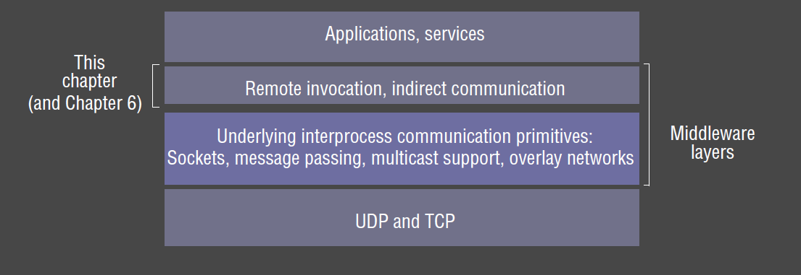
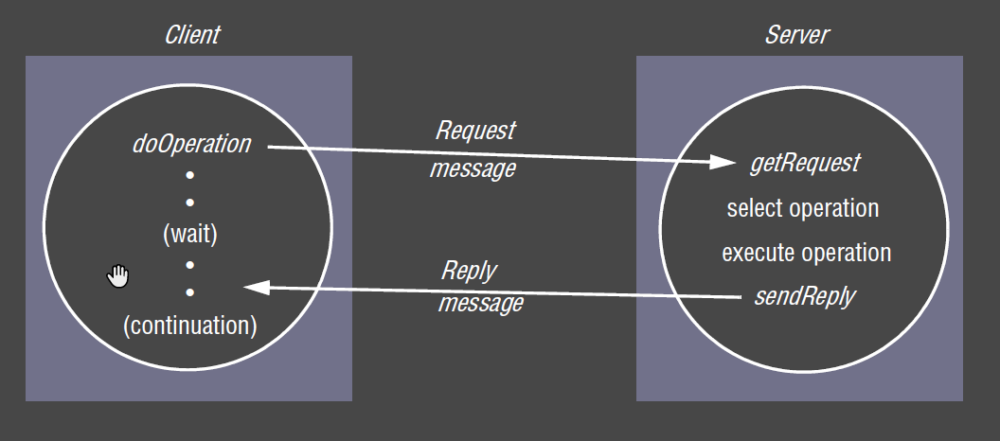
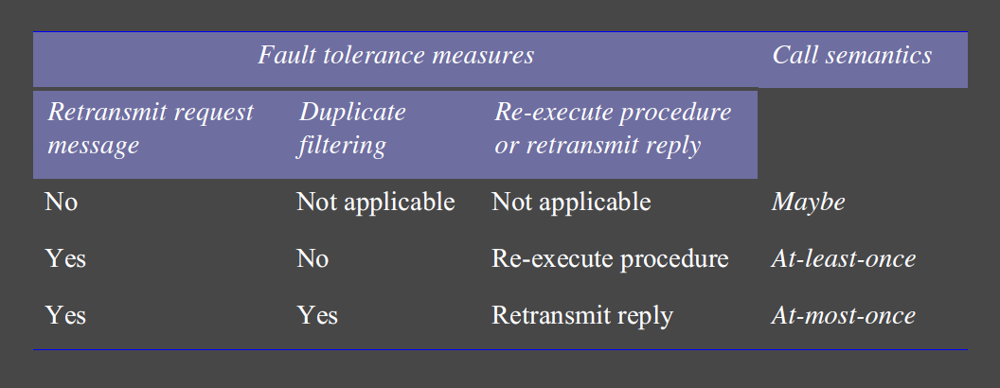
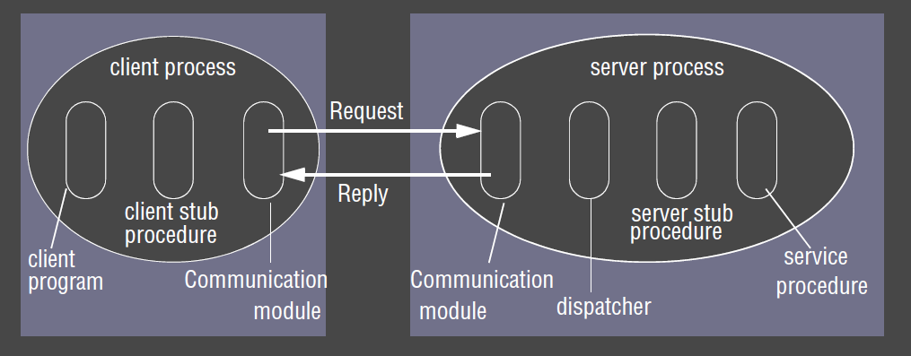

---
title: Remote Invocation
notebook: Distributed Systems
layout: note
date: 2020-11-09
tags: 
...

# Remote Invocation

- request-reply communication: most primitive; minor improvement over underlying IPC primitives
  - 2-way exchange of messages as in client-server computing
- __Remote Procedure Call (RPC):__ extension of conventional procedural programming model
  - allow client programs to transparently call procedures in server programs running in separate processes,
    and in separate machines from the client
- __Remote Method Invocation (RMI):__ extension of conventional object oriented programming model
  - allows objects in different processes to communicate 
  - extension of local method invocation: allows object in one process to invoke methods of an object living in another process

## Request-Reply Protocol

- most common exchange protocol for remote invocation

### Operations 

- `doOperation()`: send request to remote object, and returns the reply received
- `getRequest()`: acquire client request at server port
- `sendReply()`: sends reply message from server to client

### Design issues

- timeouts: what to do when a request times out? how many retries?
- duplicate messages: how to discard?
  - e.g. recognise successive messages with the same request ID and filter them
- lost replies: dependent on idempotency of server operations
- history: do servers need to send replies without re-execution? then history needs to be maintained

### Design decisions

- retry policy
  - how many times to retry?
- duplicate filter mechanism
- retransmission policy

### Exchange protocols

Different flavours of exchange protocols:

- __request (R):__ no value to be returned from remote operation
  - client needs no confirmation operation has been executed
  - e.g. sensor producing large amounts of data: may be acceptable for some loss
- __request-reply (RR):__ useful for most client-server exchanges.  Reply regarded as acknowledgement of request
  - subsequent request can be considered acknowledgement of the previous reply
- __request-reply-acknowledge (RRA):__ acknowledgement of reply contains request id, allowing server
  to discard entry from history

### TCP vs UDP

- limited length of datagrams may affect transparency of RMI/RPC systems which should be able to accept data of any size
- TCP can be chosen to avoid multipacket protocols, avoiding this issue
- TCP additional overheads: acknowledgements, connection establishmen
- TCP also ensures reliable delivery
  - no need to filter duplicates or use histories
- TCP therefore simplifies implementation of request-reply protocol
- if application doesn't require all of TCP facilities, more efficient, tailored protocol can be implemented over UDP

### Invocation semantics

- __maybe:__ RPC may be executed once or not at all
  - unless call receives result, it is unknown whether RPC was called
- __at-least-once:__ either 
  - remote procedure was executed at least once and caller received a response, or
  - caller received exception to indicate remote procedure was not executed at all
- __at-most-once:__ RPC was either 
  - executed exactly once, in which case caller received response, or
  - not executed at all, and caller receives an exception

- level of transparency provided depends on design choices and objectives
- Java RMI supports at-most-once invocation semantics
- Sun RPC supports at-least-once

### Fault tolerance

### Transparency

- location and access transparency are usually goals for remote invocation
- sometimes complete transparency undesirable:
  - remote invocations are more prone to failure due to network/remote machines
  - latency of remote invocations significantly higher than local ones
- many implementations provide access transparency, but not complete location transparency,
  allowing programmer to optimise based on location

### HTTP: RR protocol

- see comp sys notes

## RPC

- RPCs enable clients to execute procedures in server processes based on a defined service interface
- generally implemented over request-reply protocol

### RPC Roles 

- __communication module:__ implements design w.r.t. retransmission of requests, duplicate handling, result retransmission
- __client stub procedure:__ behaves like a local procedure to client
  - marshals procedure identifiers and arguments, and passes it to communication module
  - unmarshals the results in the reply
- __dispatcher:__ selects server stub based on procedure identifier, forwarding request to the server stub
- __server stub procedure:__ unmarshalls arguments in request message, and forwards to service procedure
  - marshals arguments in result message and returns to client
- __service procedure:__ actual procedure to call, implements procedures in the service interface

- client/server stub procedures, as well as dispatcher, can be generated automatically by an interface compiler

