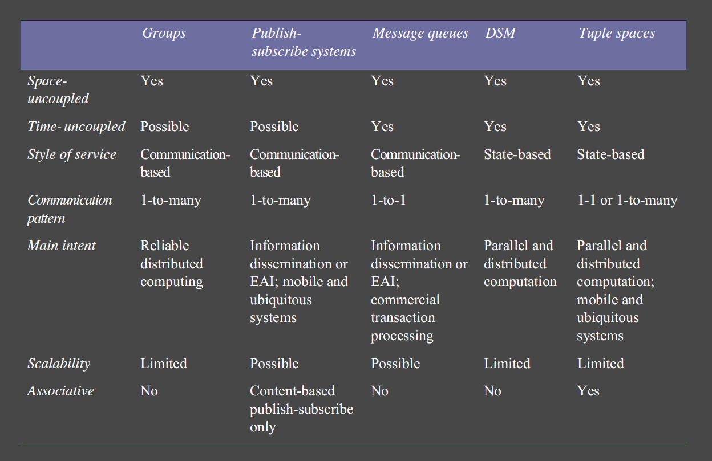
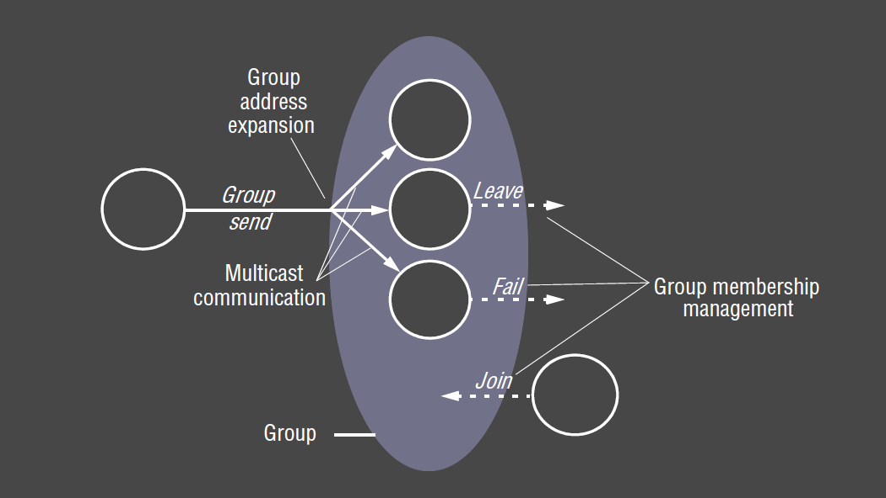
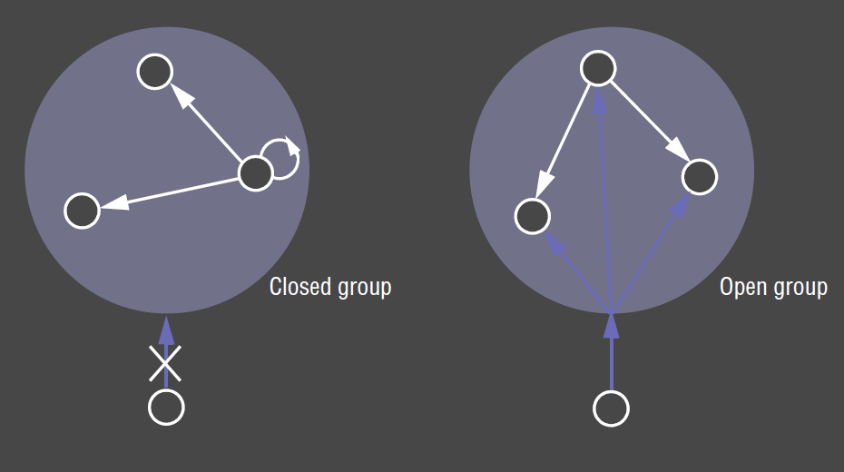
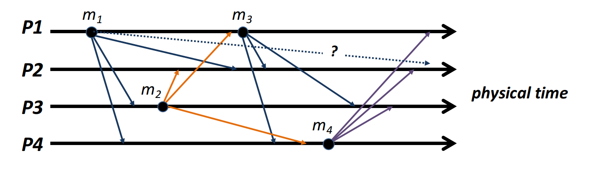
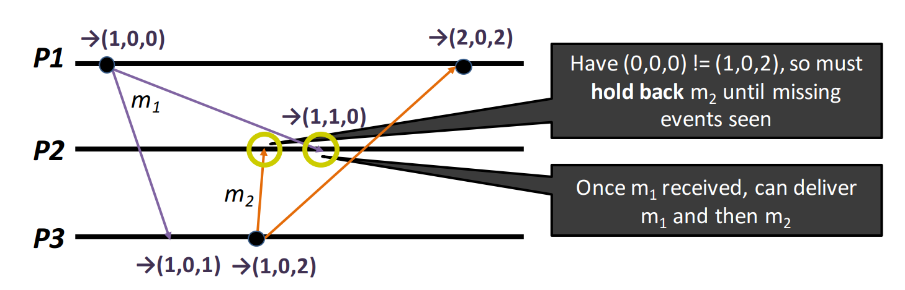
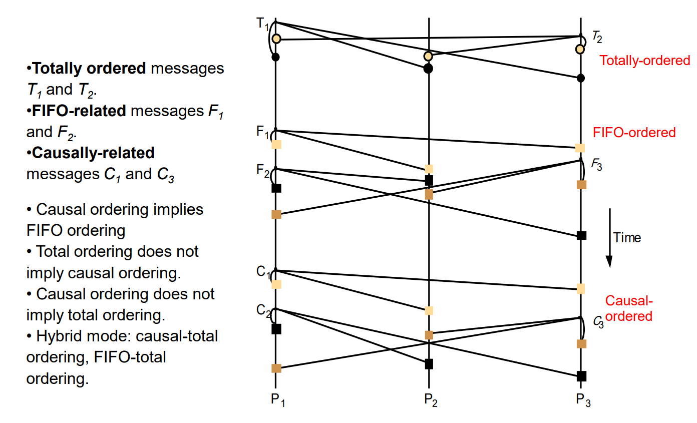
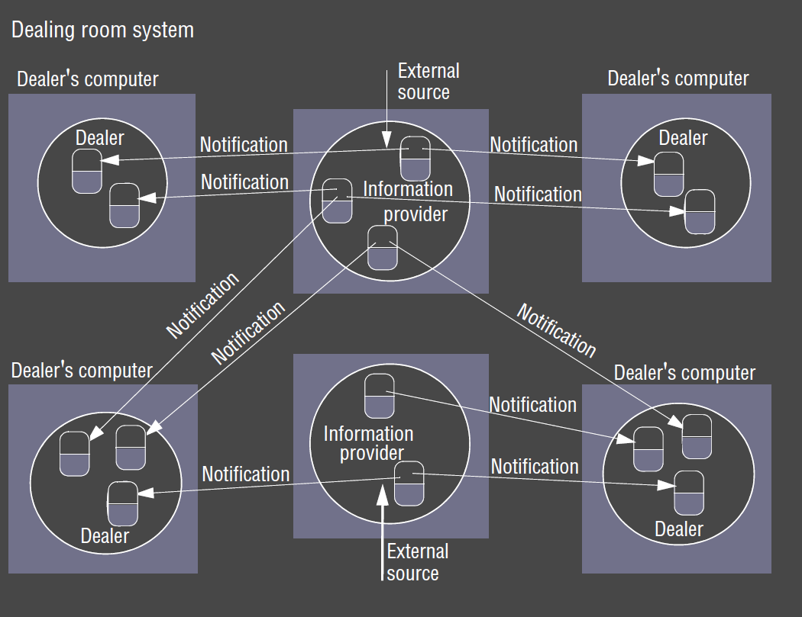
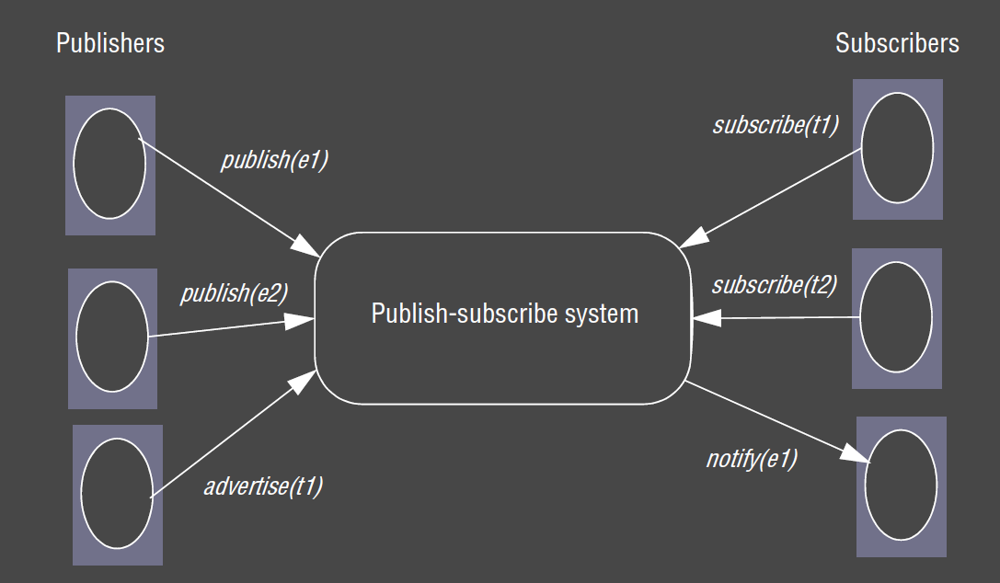

---
title: Indirect Communication
notebook: Distributed Systems
layout: note
date: 2020-11-11
tags: 
...

# Indirect Communication

- __indirect communication:__ communication between entities in a distributed system via an __intermediary__,
  with __no direct coupling__ between the sender and the receiver/s
- Remote invocation is based on direct coupling between senders and receivers, making systems rigid and difficult to chane
- indirect communication used when change is anticipated: e.g.  mobile environments with users coming and going
- disadvantages: 
  - performance overhead due to extra indirection
  - more difficult to manage due to lack of space/time coupling

## Space and Time Uncoupling

- __space uncoupling:__ sender doesn't know the identity of the receiver/s
  - participants can be replaced, updated, replicated, migrated
- __time uncoupling:__ sender and receiver don't need to exist at the same time
  - useful in volatile environments where participants come and go
  - implies persistence in communication channel: messages must be stored
  - NB different to asynchronous communication: asynchronous comms don't imply that the receiver has an independent lifetime

|                      | Time-coupled                       | Time-uncoupled                        |
|:--------------------:|:----------------------------------:|:-------------------------------------:|
| __Space coupling__   | message passing,  remote invocation |                                       |
| __Space uncoupling__ | IP multicast                       | Most indirect   communication paradigms |

## Paradigms

- group communication
- publish subscribe
- message queues
- shared memory

## Group Communication

- __group communication:__ communication via group abstraction
  - space uncoupled service: sender doesn't know receivers identities
  - single message sent by sender to a group gets delivered to all group members
  - single multicast send is defining feature c.f. multiple unicast sends
  - management of group membership
  - more effective use of bandwidth with single multicast to multiple receivers (instead of multiple, independent send operations) 
  - detection of failures
  - reliability and ordering guarantees: if a process fails half-way through multiple independent send operations to different recipients,
    system has no way of guaranteeing whether all recipients received the message or not
- provides more than primitive IP multicast, but may be implemented over IP multicast or an overlay network
- important element when building reliable distributed systems

### Applications 

-  __financial:__ reliable dissemination of financial information (e.g. stock tickers) to large number of clients
  - institutions need accurate, up-to-date access to large number of information sources
- multiuser game
- fault-tolerance: consistent update of replicated data
- system monitoring/management, load balancing

### Primitives

- group
- group membership
- join
- leave
- multicast
- broadcast: communication to all processes in the system

### Group Model 

### Group Distinctions

These distinctions signficantly impact the underlying multicast algorithms.
e.g. some algorithms assume groups are closed

- __process groups:__ groups where communicating entities are processes
  - most commonly used, e.g. JGroups
- __object groups:__ higher level approach than process groups
  - collection of objects that process the same set of invocations concurrently, 
    each returning responses
- __closed:__ only members of the group can multicast to it
- __open:__ processes outside the group may send to it
- __overlapping:__ entities may be members of multiple groups

### Implementation Issues

#### Reliability 

- __reliable multicast:__
  - integrity: deliver message correctly at most once
  - validity: message sent is eventually delivered
  - __agreement:__ if the message is delivered to one process, it is delivered to all processes in the group

#### Ordering 

- ordering is not guaranteed by underlying interprocess communication primitives
- Group services offer ordered multicast, which may possess 1+ of the following properties:
- __FIFO ordering:__ preserve ordering from sender's perspective
  - if a process sends one message before another, it will be delivered in this order at all processes in the group
- __Causal ordering:__ if a message happens before another message, this causal relationship will be preserved in delivery at all processes
- __Total ordering:__ if a message is delivered before another message at one process, the same order will be preserved at all processes

FIFO ordering:

Causal Ordering:

[Source](https://www.cl.cam.ac.uk/teaching/1516/ConcDisSys/2016-DistributedSystems-1B-L5.pdf)

Comparison of all 3:

[Source](http://courses.engr.illinois.edu/cs425/fa2009/L5tmp.pdf)

#### Group membership management

- group members leave and join
- failed members
- notify members of group membership changes
- changes to the group address

## Publish-Subscribe 

- __publish-subscribe systems:__ publisher disseminates events to multiple recipients via an intermediary
  - aka __distributed event-based systems__
  - most widely used paradigm
  - __publishers__ publish structure events to an __event service__ 
  - __subscribers__ express interest in events through __subscriptions__, which are arbitrary patterns over the structured events
  - one-to-many: given event eventually delivered to many recipients

### Applications

- financial information systems
- live feeds of real-time data
- cooperative working: number of participants notified of events of interest
- ubiquitous computing: management of events from ubiquitous infrastructure (e.g. location events)
- monitoring: e.g. network monitoring
- Google's ad clicks

### Dealing Room

- financial information system
- task: allows dealers to see latest market prices of stocks
- market price for a single stock represented by an object
- information providers: processes that collect information arriving in dealing room from a number of external sources 
  - each update is an event
  - provider publishes events to pub-sub system for delivery to all dealers subscribed to the corresponding stock
- dealer process subscribes to a named stock
  - it receives notifications and updates the objects representing the stocks
  - update is then displayed to user

### Events and Notifications

- RMI, RPC support synchronous communication model: client invoking call waits for results to be returned
- events and notifications are associated with __asynchronous communication model__
- event sources can generate different event types
  - attributes contain event information
  - types and attributes are used by subscribers when subscribing to events
  - notifications occur when event types and attributes match that of a subscription

### Characteristics

- __heterogeneity:__ events allow components that weren't designed for interoperation to work together
  - publisher needs to publish required events
  - subscribers need to subscribe to events of interest
  - interface needs to be provided for receiving/dealing with notifications
- __asynchronous:__ communication is asynchronous and event-driven

### Model

- event `e`
- filter `f`
- `publish(e)`
- `subscribe(f)`
- `unsubscribe(f)`
- `notify(e)`
- `advertise(f)`: publishers can declare the nature of future events in terms of filters
- `unadvertise(f)`

### Types

- __channel-based:__ publishers publish events to named channels, and subscribers subscribe to one of these 
  channels to receive all events on that channel
  - primitive: only scheme that defines a physical channel
  - more advanced approaches use filtering over event contents
- __topic-based/subject-based:__ notification expressed in terms of number of fields, one field denoting the topic
  - subscriptions defined in terms of topics
  - channels are implicitly defined, while topics are explicitly declared
  - permits hierarchical organisation of topics
- __content-based:__ generalisation of topic based approach
  - express subscriptions over a particular values for a range of fields in an event notification
  - notifications sent are those matching the attributes specified 
  - most flexible
- __type-based:__ object-based, with objects having a specific type
  - subscriptions defined in terms of types of events
  - notifications sent are those matching types or subtypes of the given filter
  - similar expressiveness to content-based

### Centralised

### Architecture

### Examples

## Message Queue

- __message queue:__ messages are placed on a queue, receivers extract messages from the queue

### Programming Model

## Shared Memory

- __shared memory:__  abstraction of global shared memory
  - e.g. distributed shared memory, tuple spaces

### Tuple Spaces

### York Linda Kernel

