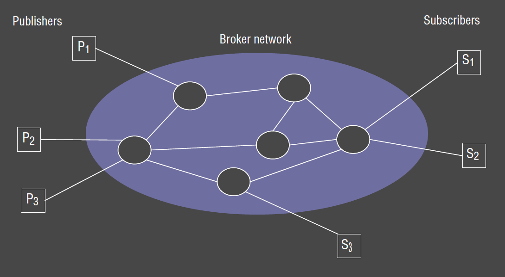
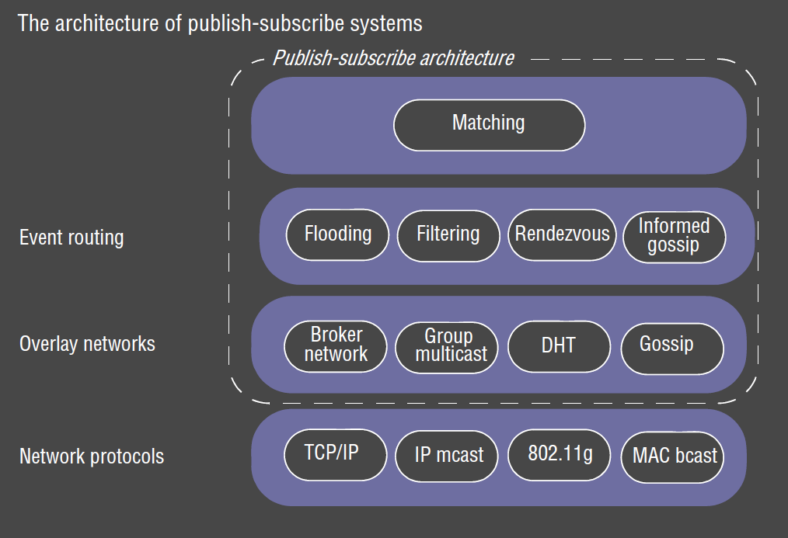
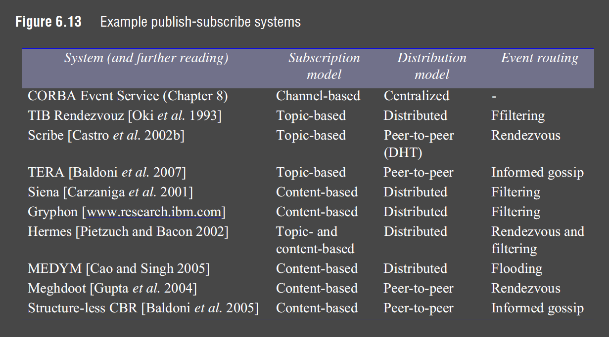
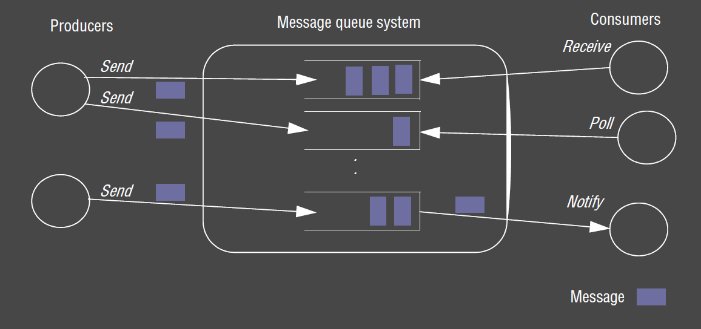
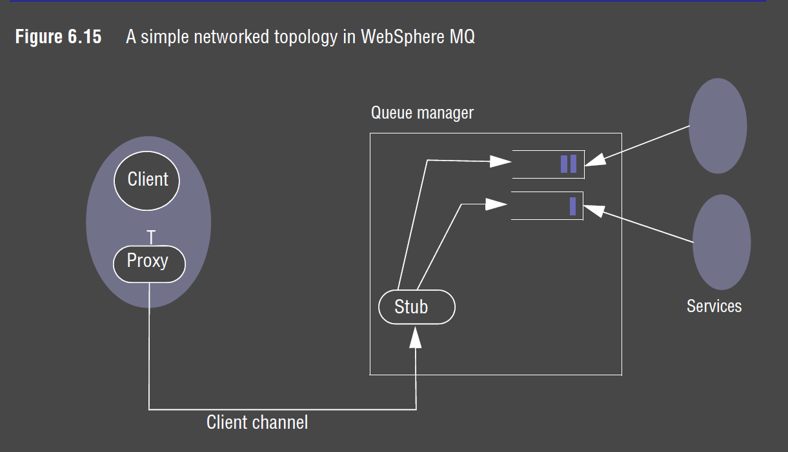
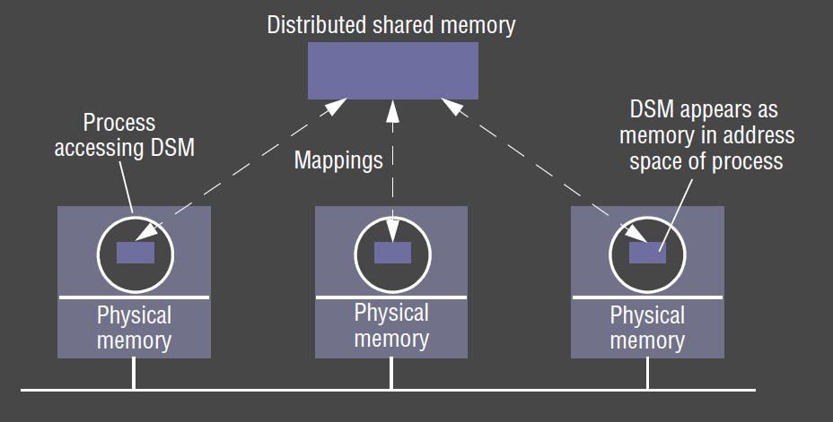
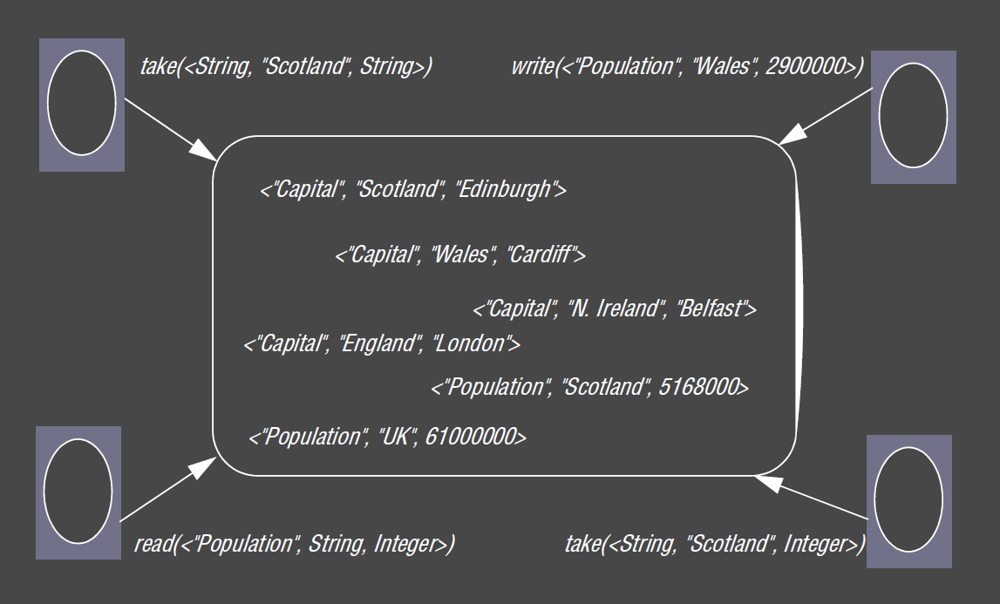
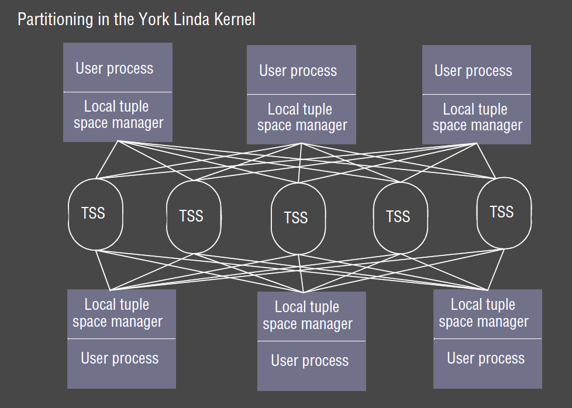
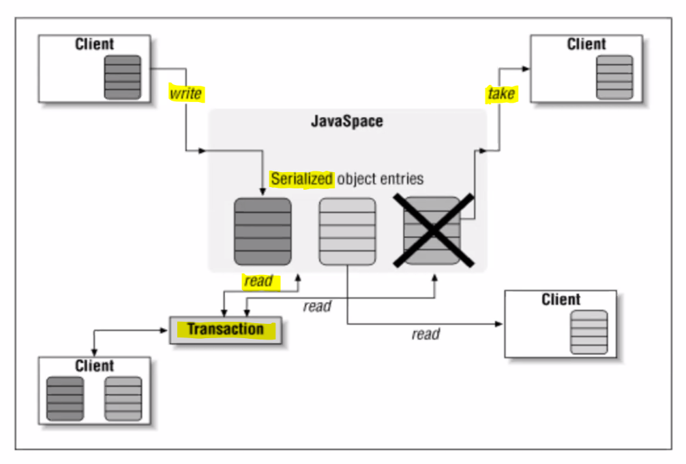

---
title: Indirect Communication
notebook: Distributed Systems
layout: note
date: 2020-11-11
tags: 
...

# Indirect Communication

- __indirect communication:__ communication between entities in a distributed system via an __intermediary__,
  with __no direct coupling__ between the sender and the receiver/s
- Remote invocation is based on direct coupling between senders and receivers, making systems rigid and difficult to chane
- indirect communication used when change is anticipated: e.g.  mobile environments with users coming and going
- disadvantages: 
  - performance overhead due to extra indirection
  - more difficult to manage due to lack of space/time coupling

## Space and Time Uncoupling

- __space uncoupling:__ sender doesn't know the identity of the receiver/s
  - participants can be replaced, updated, replicated, migrated
- __time uncoupling:__ sender and receiver don't need to exist at the same time
  - useful in volatile environments where participants come and go
  - implies persistence in communication channel: messages must be stored
  - NB different to asynchronous communication: asynchronous comms don't imply that the receiver has an independent lifetime

|                      | Time-coupled                       | Time-uncoupled                        |
|:--------------------:|:----------------------------------:|:-------------------------------------:|
| __Space coupling__   | message passing,  remote invocation |                                       |
| __Space uncoupling__ | IP multicast                       | Most indirect   communication paradigms |

## Paradigms

- group communication
- publish subscribe
- message queues
- shared memory

## Group Communication

- __group communication:__ communication via group abstraction
  - space uncoupled service: sender doesn't know receivers identities
  - single message sent by sender to a group gets delivered to all group members
  - single multicast send is defining feature c.f. multiple unicast sends
  - management of group membership
  - more effective use of bandwidth with single multicast to multiple receivers (instead of multiple, independent send operations) 
  - detection of failures
  - reliability and ordering guarantees: if a process fails half-way through multiple independent send operations to different recipients,
    system has no way of guaranteeing whether all recipients received the message or not
- provides more than primitive IP multicast, but may be implemented over IP multicast or an overlay network
- important element when building reliable distributed systems

### Applications 

-  __financial:__ reliable dissemination of financial information (e.g. stock tickers) to large number of clients
  - institutions need accurate, up-to-date access to large number of information sources
- multiuser game
- fault-tolerance: consistent update of replicated data
- system monitoring/management, load balancing

### Primitives

- group
- group membership
- join
- leave
- multicast
- broadcast: communication to all processes in the system

### Group Model 

### Group Distinctions

These distinctions signficantly impact the underlying multicast algorithms.
e.g. some algorithms assume groups are closed

- __process groups:__ groups where communicating entities are processes
  - most commonly used, e.g. JGroups
- __object groups:__ higher level approach than process groups
  - collection of objects that process the same set of invocations concurrently, 
    each returning responses
- __closed:__ only members of the group can multicast to it
- __open:__ processes outside the group may send to it
- __overlapping:__ entities may be members of multiple groups

### Implementation Issues

#### Reliability 

- __reliable multicast:__
  - integrity: deliver message correctly at most once
  - validity: message sent is eventually delivered
  - __agreement:__ if the message is delivered to one process, it is delivered to all processes in the group

#### Ordering 

- ordering is not guaranteed by underlying interprocess communication primitives
- Group services offer ordered multicast, which may possess 1+ of the following properties:
- __FIFO ordering:__ preserve ordering from sender's perspective
  - if a process sends one message before another, it will be delivered in this order at all processes in the group
- __Causal ordering:__ if a message happens before another message, this causal relationship will be preserved in delivery at all processes
- __Total ordering:__ if a message is delivered before another message at one process, the same order will be preserved at all processes

FIFO ordering:

Causal Ordering:

[Source](https://www.cl.cam.ac.uk/teaching/1516/ConcDisSys/2016-DistributedSystems-1B-L5.pdf)

Comparison of all 3:

[Source](http://courses.engr.illinois.edu/cs425/fa2009/L5tmp.pdf)

#### Group membership management

- group members leave and join
- failed members
- notify members of group membership changes
- changes to the group address

### Unicast vs Multicast

- __unicast:__ one sender sends message to one receiver
  - UDP or TCP
  - UDP: unreliable; packets may get lost, duplicated, arrive out of order, maximum packet size
  - TCP: unicast, but handles retransmission, eliminates duplicates, fragments packets, presents messages to application layer in order
- multicast: one sender sends message to many receivers
  - IP multicast extends UDP
  - message transmission therefore unreliable
  - no notion of membership

### JGroups

- based on IP multicast: extends reliable unicast (1-1) message transmission (as in TCP) to multicast (1-many)
- JGroups: toolkit for reliable messaging
  - can create clusters whose nodes can send messsages using group membership
  - framework provides services to enable P2P communications between nodes in a cluster

#### Reliability

- lossless transmission of message to all recipients
- fragmentation 
- FIFO ordering: messages m1 and m2 sent by P will be received by all receivers in the same order, not as m2, m1
- atomicity: message received by all receivers, or none

#### Group membership

- knowledge of members of group
- notifications when new member joins, existing member leaves, existing member has crashed

#### Features

- cluster creation and deletion
- joining/leaving clusters
- membership detection/notification
- detection, removal of crashed nodes
- point-to-multipoint: sending/receiving of node-to-cluster messages

## Publish-Subscribe 

- __publish-subscribe systems:__ publisher disseminates events to multiple recipients via an intermediary
  - aka __distributed event-based systems__
  - most widely used paradigm
  - __publishers__ publish structure events to an __event service__ 
  - __subscribers__ express interest in events through __subscriptions__, which are arbitrary patterns over the structured events
  - one-to-many: given event eventually delivered to many recipients

### Applications

- financial information systems
- live feeds of real-time data
- cooperative working: number of participants notified of events of interest
- ubiquitous computing: management of events from ubiquitous infrastructure (e.g. location events)
- monitoring: e.g. network monitoring
- Google's ad clicks

### Dealing Room

- financial information system
- task: allows dealers to see latest market prices of stocks
- market price for a single stock represented by an object
- information providers: processes that collect information arriving in dealing room from a number of external sources 
  - each update is an event
  - provider publishes events to pub-sub system for delivery to all dealers subscribed to the corresponding stock
- dealer process subscribes to a named stock
  - it receives notifications and updates the objects representing the stocks
  - update is then displayed to user

### Events and Notifications

- RMI, RPC support synchronous communication model: client invoking call waits for results to be returned
- events and notifications are associated with __asynchronous communication model__
- event sources can generate different event types
  - attributes contain event information
  - types and attributes are used by subscribers when subscribing to events
  - notifications occur when event types and attributes match that of a subscription

### Characteristics

- __heterogeneity:__ events allow components that weren't designed for interoperation to work together
  - publisher needs to publish required events
  - subscribers need to subscribe to events of interest
  - interface needs to be provided for receiving/dealing with notifications
- __asynchronous:__ communication is asynchronous and event-driven

### Model

- event `e`
- filter `f`
- `publish(e)`
- `subscribe(f)`
- `unsubscribe(f)`
- `notify(e)`
- `advertise(f)`: publishers can declare the nature of future events in terms of filters
- `unadvertise(f)`

### Types

- __channel-based:__ publishers publish events to named channels, and subscribers subscribe to one of these 
  channels to receive all events on that channel
  - primitive: only scheme that defines a physical channel
  - more advanced approaches use filtering over event contents
- __topic-based/subject-based:__ notification expressed in terms of number of fields, one field denoting the topic
  - subscriptions defined in terms of topics
  - channels are implicitly defined, while topics are explicitly declared
  - permits hierarchical organisation of topics
- __content-based:__ generalisation of topic based approach
  - express subscriptions over a particular values for a range of fields in an event notification
  - notifications sent are those matching the attributes specified 
  - most flexible
- __type-based:__ object-based, with objects having a specific type
  - subscriptions defined in terms of types of events
  - notifications sent are those matching types or subtypes of the given filter
  - similar expressiveness to content-based

### Implementation Issues

- basic requirement: ensure events are delivered efficiently to all subscribers with filters matching the event
- additional requirements: security, scalability, failure handling, concurrency, QoS
  - increases complexity of iplementation

#### Centralised vs Decentralised

- __centralised:__ server on a single node acts as an event broker
  - publishers publish events to broker
  - subscribers send subscriptions to broker, and receive notifications in turn
  - interaction with broker is through point-to-point messages: message passing or remote invocation
  - advantages: simple to implement
  - disadvantages: lacks resilience and scalability as server is a single point of failure and a performance bottleneck
- __distributed pub-sub:__ network of brokers cooperate to provide desired functionality
  - improved ability to survive node failure
  - proven to operate well in Internet-scale deployments
- __P2P pub-sub:__ no distinction between publishers, subscribers, and brokers
  - all nodes act as brokers, cooperating to provide required event routing functionality
  - very popular for recent systems

Network of Brokers:

#### Overall Architecture

Range of choices for architecture

- __event routing:__ ensures event notifications are routed efficiently to appropriate subscribers
- __overlay networks:__ supports event routing by setting up networks of brokers/P2P structures required
- top layer: implements matching of events to a subscription, often a part of event routing layer

#### Content-based Routing
- __flooding:__ send event notification to all nodes in the network, then carry out matching at subscriber end
  - can also send subscriptions to all publishers, with matching carried out by publishers
  - implemented with underlying broadcast/multicast
  - brokers can be arranged in an acyclic graph, forming an multicast overlay network where each broker forwards incoming notifications to all neighbours
  - simple, but produces lots of network traffic
- __filtering:__ apply filtering in network of brokers
  - brokers forward notifications through the network only where there is a path to a valid subscriber
  - each node maintains 
    - neighbours list of all connected neighbours in the network of brokers
    - subscription list of all directly connected subscribers this node services
    - routing table with neighbours and valid subscriptions on that path
  - can generate lots of traffic to propagate subscriptions (which are basically flooded)
- __advertisements:__ propagates advertisements towards subscribers 
- __gossip:__ nodes in the network periodically and probabilistically exchange events with neighbours
  - mechanism for achieving multicast 
  - __informed gossip__ takes into account local info and content

### Examples

## Message Queue

- __message queue:__ messages are placed on a message queue, receiver extracts messages from the queue
  - message queue is an indirection
  - provides space and time-uncoupling through storage of messages
  - messages are __persistent__: messages are stored until consumed
  - point-to-point: sender places message in the queue, which is removed by a single process
- groups, pub-sub are one-to-many, MQ is point-to-point
- line often gets blurred between MQ and pub-sub: pure pub-sub shouldn't record anything
- basis of commercial transaction processing systems: natural fit for transactions

- centralised/decentralised: key implementation issues
  - centralised: simple, performance bottleneck and single point of failure

### Programming Model

- `send`: producer puts message on a particular queue
- `receive` (blocking): consumer waits for 1+ message on a queue before returning
- `poll` (non-blocking): consumer checks if queue has a message, returning it if present, otherwise returns without a message
- `notify`: generates an event at the receiver when a message is available

### Example

## Shared Memory

- distributed shared memory operates at level of reading/writing bytes
  - memory accessed by address
- tuple spaces offer higher-level perspective: semi-structured data
  - accessed by pattern-matching on content

### Distributed Shared Memory

- __distributed shared memory (DSM):__  abstraction of global shared memory between computers that don't share physical memory
  - processes access DSM by reads and updates to what appears as normal memory in their address space 
  - used in HPC and distributed system; quite specialised
  - spares programmer having to worry about message passing

### Tuple Spaces

- processes communicate indirectly by placing tuples in a tuple space, from which other processes can read or remove them
- tuples are accessed by pattern matching on content

### York Linda Kernel

- TSS = tuple space server
- complexity in communication
- scales poorly

### JavaSpaces 

- JavaSpaces: high-level tool for building distributed/collaborative applications
- provides a shared space for object storage and exchange
- uses a simple but expressive API
- objects are stored in JavaSpaces as __serialised object entries__
  - entries are typed: templates for one type won't match a different type
- API
  - `write` entries into the space
  - `read` entries from the space (leaving it in the space)
    - you get a random entry that matches your template
    - if there are multiple matches, you only get one
    - to remove all, you use a loop
  - `take` entries from space (removing it from the space)
  - `notify` sends notification through an event handler if entries matching a template are added
- template: entry with 1+ fields set to null
- matching: entry matches a template if
  - same type/subtype
  - every non-null field matches exactly 

#### Design Goals

- platform to __simplify__ design and implementation of distributed systems
- client should have few classes to maintain simplicity and reduce download time
- client should have small footprint so it is able to run on computers with minimal memory
- support variety of implementations
- replication should be possible

#### JavaSpaces vs Databases

- not relational database
  - relational database: 
    - based on relational model of data, storing data in structure format using rows/columns
    - understand data stored
    - manipulated via SQL
  - JavaSpaces:
    - store entries they understand only by type and serialised form of each field
    - no general queries in JavaSpaces, only "exact match" or "don't care"
- not object database
  - object database: DBMS in which information represented in form of objects
    - OO image of stored data that can be used/modified similar to the object being in primary memory
  - JavaSpaces: 
    - do not provide nearly transparent, persistent, or transient layer
    - works only on copies of entries

### Implementation Issues

