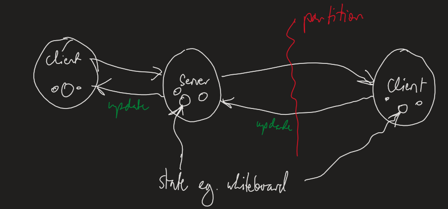

---
title: Eventual Consistency
notebook: Distributed Systems
layout: note
date: 2020-11-11
tags: 
...

## CAP Theorem

- Consistency, availability, partitioning

- __consistency:__ every node agrees on current state
  - client sees the same data throughout the transaction
  - __strong consistency:__ when a process reads a value, it always gets the latest value
  - __weak consistency:__ no guarantees the value read is the latest one
- __availability:__ you go to get/set state, and the system is available to do that
  - data availability is not compromised due to any ongoing transaction
- e.g. drawing on collaborative whiteboard
  - propagation is required to maintain consistency
  - ideally this would happen instantaneously, but clearly that's not possible
- __partitioning:__ network problem creating disjoint regions of distributed system
  - with distributed systems there's always a chance of partitioning occurring
  - system functions even if the communication fails between servers
- __CAP Theorem:__ when partitioning occurs, you need to choose between consistency and availability

## PACELC Theorem

- builds on CAP theorem by discussing trade-offs in consistency, availability, partition tolerance
  - also latency + consistency
- PAC: partitioning? then availability vs consistency
- ELC: else latency vs consistency

[Wikipedia PACELC](http://en.m.wikipedia.org/wiki/PACELC_theorem):

In case of network partitioning (P) in a distributed computer system, one has
to choose between availability (A) and consistency (C) (as per the CAP
theorem), but else (E), even when the system is running normally in the absence
of partitions, one has to choose between latency (L) and consistency (C).

## Fallacies of Distributed Computing

From [Wikipedia](http://en.m.wikipedia.org/wiki/Fallacies_of_distributed_computing)

The fallacies of distributed computing are a set of assertions made by L Peter
Deutsch and others at Sun Microsystems describing false assumptions
that programmers new to distributed applications invariably make.

The fallacies are:

1. The network is reliable;
2. Latency is zero;
3. Bandwidth is infinite;
4. The network is secure;
5. Topology doesn't change;
6. There is one administrator;
7. Transport cost is zero;
8. The network is homogeneous.

## Eventual Consistency

- Notes on _Eventual Consistency Today: Limitations, Extensions, and Beyond (Bailis and Ghodsi), 2013_

- __eventual consistency:__ if no additional updates are made to a given data item, all reads will eventually return the same value
  - eventually, all servers converge to the same state; at some point in the future, servers are indistinguishable
  - "eventually, all accesses return the last updated value"
  - very weak, but extremely useful
  - systems are strongly consistent most of the time, and are often faster than strongly consistent counterparts
- benefits
  - simplifies design and operation of distributed services
  - improves availability
  - often consistent
- costs
  - some inconsistency will exist
  - cannot provide guarantee of currency of data
- there are properties eventual consistency can never provide: there is a cost to remaining highly available and providing low latency
- even without partitions, a system that chooses availability over consistency benefits from low latency
- partition tolerance is not something you can trade-off: partitions happen, and when they do, you must choose between availability and consistency
- most of the time, availability wins over consistency 
  - e.g. social network and timeline updates: you degrade user experience by preventing user from posting if you choose consistency
    - network partition: cannot deliver each update to all timelines
    - consistency: do you prevent user from posting an update, or wait until partition heals before providing a response?
    - availability: propagate update to reachable followers, delay the update to other followers until paritition heals
    - availability approach: better user experience; all users eventually see the same timeline with all updates
  - e.g. ATM: two users simultaneously withdrawing money from an account, and ending up with more money than the account ever held
    - in practice banks allow this behaviour: ATMs availability outweighs the cost of temporary inconsistency
    - banks should have well defined compensating actions: overdraft fees etc.
- __anti-entropy:__ information exchange between replicas about what writes they have seen to ensure convergence towards consistency
  - __concurrent writes:__ if these happen, the replicas deterministically choose a winning value
  - needs to be asynchronous to prevent replicas hanging when partitions occur
  - you don't want to return immediately on write, or you risk data durability.
    Better to trade off between durability and availability by returning after
    W replicas have acknowledged the write
- __safety:__ nothing bad happens, every value that is read was, at some point, written to the database
- __liveness:__ something good eventually happens, e.g. all requests eventually receive a response
- eventual consistency makes no safety guarantees, but purely liveness

### How eventual is eventual consistency?

- __time:__ how long will it take for writes to become visible to readers?
- __versions:__ how many versions old will a given read be?
- __measurement:__ how consistent is my store under given workload presently
- __prediction:__ how consistent will the store be under a given configuration/workload
- __probabilistically bounded staleness:__ expectation of recency for reads of data items
  - measure how far an eventually consistent store deviates from that of a strongly consistent store
  - e.g. "100ms after a write completes, 99.9% of reads will return the most recent version"
  - degree of inconsistency is determined by the rate of anti-entropy
  - can calculate expected consistency from: anti-entropy protocol, anti-entropy rate, network delay, local processing delay

### How to program under eventual consistency?

- don't need to write corner cases for downed replicas/partitions: anti-entropy just stalls
- don't need to write complex code for coordination
- external compensation outside the system: proceed as though the value
  presented is the latest.  When you turn out to be wrong, you need to
  compensate for any incorrect actions taken.  Retroactive safety to restore
- guarantees
  - __trade-off:__ need to weight benefit of weak consistency against cost per anomaly * rate of anomalies
  - cost of anomalies = cost of compensation
  - if the rate of anomalies is extremely low, you may forgo compensation entirely
- __data structures that avoid inconsistency:__ consistency as logical monotonicity (CALM)
  - __monotonic program:__ computes an ever-growing set of facts, and never retract facts that they emit
  - such programs can always be safely run on an eventually consistent store
  - CALM tells you where stronger coordination mechanisms are likely required
  - e.g. storing time series of stock market data vs storing latest value
  - overwrites, set deletion, counter resets, negation: not logically monotonic
  - __CALM captures ACID 2.0 (associativity, commutativity, idempotence, distributed)__
    - associative: you can apply a function in any order $f(a,f(b,c)) = f(f(a,b),c)$
    - commutative: function's arguments are order insensitive $f(a,b) = f(b,a)$
    - idempotence: you can call a function any number of times and get the same result $f(f(x)) = f(x)$
      - allows use of simpler, lower cost at-least-once message delivery
  - Commutative replicated data types e.g. increment-only counter
    - increment is commutative: it doesn't matter in which order two increments are applied
    - replicas understand semantics of increment instead of general purpose read/write which is not commutative
    - key property: separation of data store and application consistency concerns
  - CALM + CRDT: toolkit for consistency without concurrency control

### Can stronger guarantees be provided without losing benefits?

- high availability can be retained while providing stronger guarantees, e.g. causality and ACID properties
- __causal consistency:__ each processes writes are seen in order writes follow
  reads, useful in ensuring comment threads are seen in correct order without
  dangling replies 
  - strongest consistency model possible in presence of partitions
