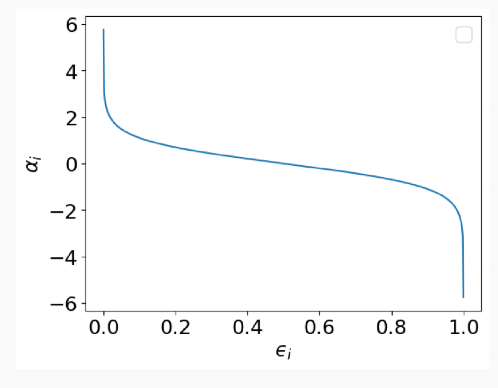
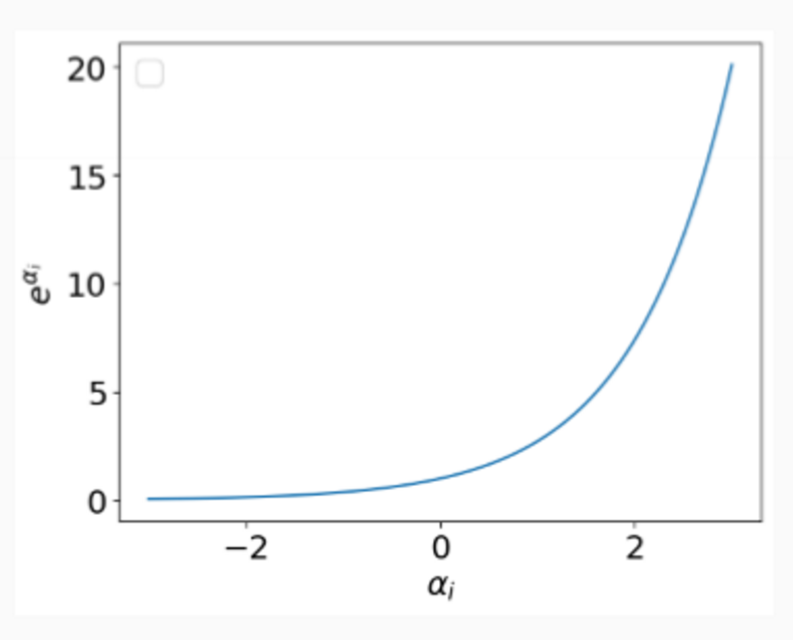

---
title: Ensemble Methods
notebook: Machine Learning
layout: note
date: 2021-06-15
tags: 
...

## Manipulation approaches for Ensemble Learning

- instance
- feature
- algorithm
- class label

## Ensemble Methods

- stacking
- bagging
  - random forest
- boosting
  - AdaBoost

## Stacking

- idea: smooths errors over range of algorithms with different biases

### Simple voting

- generate multiple training datasets through different feature subsets
- train base classifier over each dataset
- presupposes classifiers have equal performance

### Meta classification

- train a classifier over output of base classifiers
- train using nested cross validation to reduce bias
- e.g. Level 0: given training dataset $(X, y)$:
  - train NN
  - train NB
  - train DT
- (possibly) discard $X$, and add new attributes for each instance
  - prediction of classifier above
  - other data as available (NB scores)
- Level 1: train meta-classifier
  - usually logistic regression or neural network

### Nested cross-validation

- need to prevent testing $L_1$ classifier on same data as $L_0$ classifiers trained on
- cross-validate base models on a subset of the folds
- cross-validate meta-classifier on all the folds
- [Nested Cross Validation](https://towardsdatascience.com/how-to-properly-validate-a-model-when-stacking-ad2ee1b2b9c)

### Assessment

- mathematically simple
- computationally expensive
- can combine heterogeneous classifiers with varying performance
- generally produces $\ge$ results than best base classifier
- widely used in applied research, less interest in theoretical circles
  - few guarantees, but empirically good performance

## Bagging

- bootstrap aggregation
- idea: more data means better performance (lowering variance)
  - how can we get more data out of a fixed training dataset?
- method: construct novel dataset through random sampling and replacement
  - __bootstrap:__ randomly sample original dataset $N$ times with replacement
  - gives new dataset of same size.  Probability any individual instance is absent is $\approx 37\%$ for large $N$
  - construct $k$ random datasets for $k$ bae classifiers
  - prediction via voting

- __Random sampling with replacement:__ when instance selected from population at random is returned to population before next element is sampled
  - each sample value is independent: what we get the second time has no dependence on what we got the first time
  - cf. without replacement: you won't get repetition of any elements; two samples aren't independent

### Assessment

- the same weak base classifier used throughout
- as bagging is aimed towards minimising variance through sampling, the algorithm should be unstable (high-variance)
- so use it with more complex models e.g. decision trees
- bagging __cannot__ reduce bias
- simple method: sampling + voting
- can parallelise computation of individual base classifiers
- highly effective over noisy datasets: outliers may vanish
- performance generally significantly better than base classifiers, but occasionally substantially worse

## Random Forest

### Random tree

- __feature manipulation__
- decision tree, where
  - at each node, only some of possible attributes considered
  - e.g. fixed proportion of all unused attributes
  - attempts to control for unhelpful attributes in feature set
  - faster to build than deterministic decision tree, but has higher model variance

### Random forest

- bagging method
- ensemble of random trees
- each tree is built using a different bagged training dataset
- combined classification via voting
- idea: minimise overall model variance, without introducing combined model bias
- __instance manipulation__
- __hyperparameters:__ 
  - number of trees $B$: can be tuned, e.g. 100
  - feature sub-sample size - often $(\log{|F|} + 1)$
- loss of interpretability
  - logic behind individual instances can be followed for individual trees
  - logic of overall model is unclear

### Assessment

- generally strong performer
- parallelisable
- surprisingly efficient
- robust to overfitting
- loss of interpretability

## Boosting

- idea: tune base classifiers to focus on difficult instances (i.e. those hard to classify)
- approach: iteratively change the distribution and weights of training instances to reflect performance of classifier at previous iteration
  - start with each training instance having uniform probably of inclusion in the sample
  - over $T$ iterations, train a classifier.  __Update the weight__ of each instance according to whether it was correctly classified
  - combine base classifiers via __weighted voting__
 
## AdaBoost

- Adaptive Boosting
- sequential ensembling algorithm
- base classifier: $C_0$
- training instances: $\{(x_j, y_j)|j=1,...,N\}$
- initial instance weights: $w_j^0 = \frac{1}{N}$
- in iteration $i$:
  - construct classifier $C_i$
  - compute error rate $\epsilon_i$ 
$$\epsilon_i = \sum_{j=1}^N w_j^i\delta(C_i(x_j)\not = y_j)$$
  - use $\epsilon_i$ to compute __classifier weight__ $\alpha_i$ - importance of classifier $C_i$
    - low error means high classifier weight
  - use $\alpha_i$ to update __instance weights__
  - add weighted $C_i$ to ensemble

Output: weighted set of base classifiers: $\{(\alpha_1, C_1), ..., (\alpha_T, C_T)\}$

### Computing $\alpha$

- importance of $C_i$, the weight associated with $C_i$'s vote
$$\alpha_i = \frac{1}{2}\ln{\frac{1-\epsilon_i}{\epsilon_i}}$$

- this is derived via minimisation of error

- when error is low, $\alpha$ is high
- random classifier has $\epsilon = 0.5$, so if error is greater than this ($\alpha < 0$), re-initialise

### Updating $w$

- weights for instance $j$ at iteration $i+1$

- if $C_i(x_i) = y_i$, correct prediction, so decrease weight for next iteration: 

$$w_j^{i+1} = \frac{w_j^i}{Z_i}\exp{-\alpha_i}$$

- if $C_i(x_i) \not = y_i$, incorrect prediction, so increase weight for next iteration: 

$$w_j^{i+1} = \frac{w_j^i}{Z_i}\exp{\alpha_i}$$

- $Z_i$ is a normalisation constant such that $\sum w_j = 1$

- iterate for $i = 1,...,T$
- reinitialise instance weights whenever $\epsilon_i < 0.5$

### Classification

- classification by weighted vote

$$C^{*}(x) = \argmax_y \sum_{j=1}^{T}\alpha_j\delta(C_j(x)=y)$$

### Assessment

- mathematically complicated, computationally cheap
- iterative sampling + weighted voting
- more expensive than bagging
- as long as each base classifier is better than random, convergence to a stronger model is __guaranteed__
- guaranteed performance - __error bounds__ over training data
- decision stumps/decision trees typically used as base classifiers.  Extremely popular
- has a tendency to __overfit__
- gradient boosting is another more recent boosting approach

## Bagging vs Boosting

### Bagging

- parallel sampling
- simple voting
- homogeneous base classifiers
- minimises __variance__
- not prone to overfitting

### Boosting

- iterative sampling
- weighted voting
- homogeneous base classifiers
- minimises __instance bias__
- prone to overfitting

