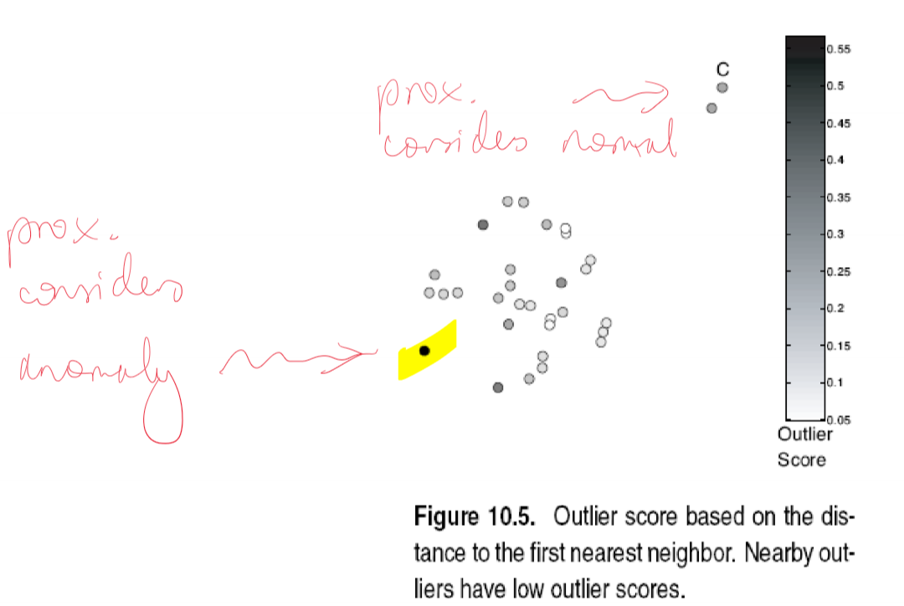
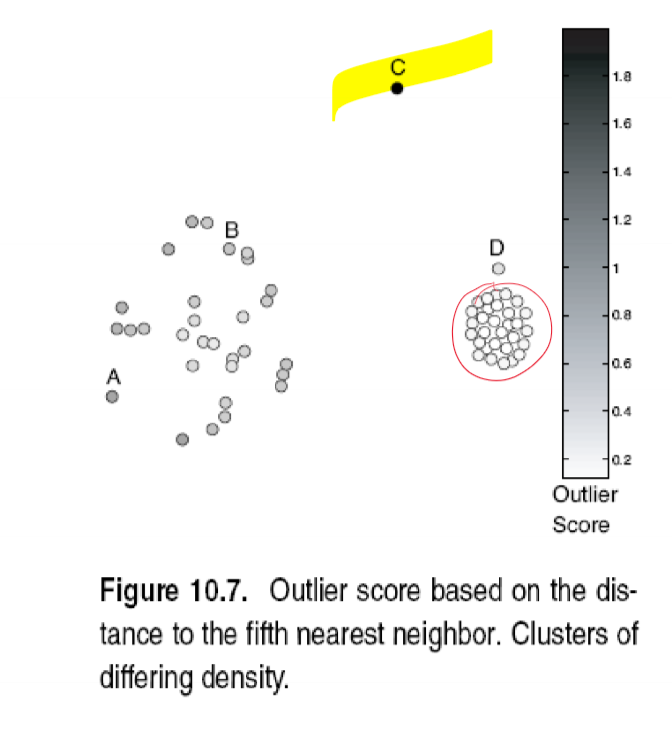
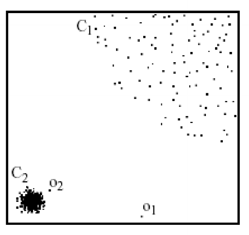
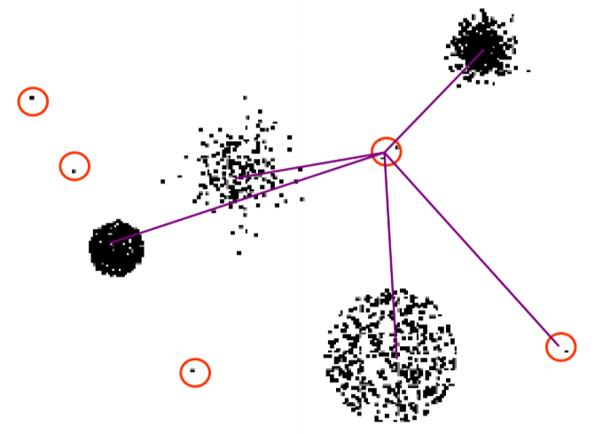

---
title: Anomaly Detection
notebook: Machine Learning
layout: note
date: 2021-06-15
tags: 
...

## What are outliers/anomalies?

- __anomaly:__ data object that __deviates significantly__ from normal objects as if it were __generated by a different mechanism__
  - e.g. unusual credit card purchase
  -  distinct from noise:
    - noise is random error/variance in measured variable
    - should be removed prior to anomaly detection
  - are __interesting__ as violations of mechanism generating normal data
    - translate to significant/critical real life entities
    - e.g. cyber intrusion, credit card fraud
- example of CCTV camera performing facial recognition
  - anomaly: new face encountered
  - noise: variation in lighting; person is wearing a mask

## Variants of Anomaly detection problems

- given database $D$ find all data points $x\in D$ with anomaly scores greater than __threshold $t$__
- given database $D$ find $n$ data points $x\in D$ with __highest anomaly scores__
- given database $D$ of mostly normal, unlabelled data, and a test point $x$, compute its __anomaly score__ with respect to $D$
  - how well is some data point explained

## Types of Anomalies

### Global/Point anomaly

- object significantly deviates from rest of data set
- e.g. intrusion detection in computer networks
- issue: appropriate measure of deviation

### Contextual/Conditional Anomaly

- object deviates significantly based on selected context
- attributes need to be classified according to 
  - contextual attributes: define context e.g. time, location
  - behavioural attributes: object characteristics used for anomaly evaluation, e.g. temperature
- generalisation of local anomalies whose density significantly deviates from local area
- issue: defining meaningful context
- example: 10°C in Paris: is this an anomaly?
  - in June: yes
  - in December: no

### Collective Anomaly

- subset of objects collectively deviate significantly from the whole data set, even if individual data objects may not be anomalies
- e.g. intrusion detection
  - mistype password once, producing a DoS packet: not anomalous
  - collection of DOS packets all at once: anomalous
- detection
  - consider behaviour of groups of objects
  - requires background knowledge of relationship among data objects, e.g. distance or similarity measure
- requires a relationship among data instances, whether
  - sequential data
  - spatial data
  - graph data
- individual instances are not anomalous by themselves
- e.g. ECG of normal heart rate with sudden flatline: you need background knowledge to know what normal ECG looks like

## Anomaly Detection Paradigms

### Supervised

- labels available for both normal data and anomalies: unrealistic to expect in reality
- samples that have been examined by domain expert are used for train and test
  - e.g. medical domain and ECG
- challenge
  - obtaining labels for both normal and anomalous data
  - imbalanced classes: anomalies are rare
    - could boost anomaly class and make up artificial anomalies
  - cannot detect unknown/emerging anomalies
  - catch as many outliers as possible, i.e. __recall__ more important than accuracy.  We don't want to mislabel normal objects as outliers

### Semi-Supervised

- labels only available for normal data, a more typical scenario
- model normal objects, then report those not matching the model as outliers
- challenges
  - requires labels from normal class
  - may get high false alarm rate from unseen legitimate records

### Unsupervised Anomaly Detection

- no labels available
- assume normal objects are clustered into multiple groups having distinct features
- outlier is expected to be far away from any groups of normal objects
- steps
  - build profile of normal behaviour through:
    - summary statistics for overall population
    - model of multivariate data distribution
  - use normal profile to detect anomaly, as points varying significantly from normal profile
- challenges
  - no guarantee normal objects will share strong patterns
  - possible outliers may share high similarity in a small area
  - e.g. in intrusion/virus detection, normal activities are diverse: unsupervised methods may have high FP rate and miss real outliers
- many clustering methods can be used for anomaly detection
  - find clusters, then outliers are those points not belonging to any cluster
  - problem 1: distinguishing noise from outliers
  - problem 2: costly since first clustering; far less outliers than normal objects

## Unsupervised Anomaly Detection Approaches

- statistical: assume normal data follow some statistical model
- proximity-based: object is an outlier if the nearest neighbours of the object are far away
- density-based: outliers are objects in regions of low density
- clustering-based: normal data belong to large, dense clusters

## Statistical anomaly detection

- anomalies are objects fit poorly by a statistical model
- idea: learn a model fitting given data set
  - identify objects in low probability regions as anomalous
- assumption: normal data is generated by parametric distribution with parameter $\theta$
  - PDF of parametric distribution, $f(x,\theta)$, gives the probability that object $x$ is generated by the distribution
  - the smaller the value, the more likely $x$ is an outlier
- challenges
  - dependent on assumption of statistical model holding for the data

### Pros

- theoretically well-founded
- statistical tests well understood, well validated
- quantitative measure of degree to which an object is an outlier

### Cons

- data may be hard to model parametrically
  - multiple modes
  - varying density
- in high dimensions, data may be insufficient to estimate true distribution

### Graphical Approaches

- boxplot (1D), scatter plot (2D), spin plot (3D)
- time consuming, subjective

### Univariate data

- assuming univariate Gaussian distribution
- use maximum likelihood method to estimate $\mu, \sigma$

$$\hat\mu = \frac{1}{n}\sum_{i=1}^{n}x_i$$
$$\hat\sigma^2 = \frac{1}{n}\sum_{i=1}^{n}(x_i-\hat\mu)^2$$

- choose confidence limits, e.g. $3\sigma$
  - $\mu\pm3\sigma$ covers 99.7% of data

### Multivariate data

- multivariate Gaussian distribution
- outliers defined by __Mahalanobis distance__
- apply __Grubb's test__ on the distances

- in above image, Euclidean distance for B is greater than for A
- but there is much more variation on the $x$ axis, so we want to standardise such that each dimension has the same variation and range
- there is also correlation between x and y which needs to be controlled for
- Mahalanobis Distance

$$y^2 = (x-\bar x)' S^{-1} (x-\bar x)$$
- $S$: covariance matrix
$$S = \frac{1}{n-1}\sum_{i=1}^{n}(x_i)-\bar x)(x_i-\bar x)'$$

### Likelihood Approach

- assume dataset $D$ contains samples from a mixture of 2 probability distributions:
  - $M$: majority distribution, estimated from data
  - $A$: anomalous distribution, initially assumed to be uniform
- approach
  - initially assume all data points belong to $M$ - estimate majority distribution
  - let $L_t(D)$ be log-likelihood of $D$ at time $t$
  - for each point $x_t\in M$ move it to $A$ - i.e. test whether it is an anomaly
    - compute the difference $\Delta = L_t(D)-L_{t+1}(D)$
    - if $\Delta > c$, some threshold value, then $x_t$ declared an anomaly and permanently moved to $A$

## Proximity-based Anomaly Detection

- idea: anomalies are objects far from other objects
- an object is anomalous if the nearest neighbours are far away
- i.e. the proximity of the object deviates significantly from the proximity of most other objects in the same dataset
- approach: outlier score: distance to $k$-th nearest neighbour
- score is sensitive to choice of $k$
- can produce some counterintuitive results:

- in above image, 5-NN is used.  Point D is close to a cluster, and so has a low anomaly score.  However the cluster is very dense - so probably should be considered
  an outlier

### Pros

- easier to define proximity measure than to determine statistical distribution of dataset
- quantitative measure of degree to which object is an outlier
- deals with multiple modes (i.e. multiple clusters)

### Cons

- $O(n^2)$ complexity
- score is sensitive to choice of $k$
- doesn't work well if data has widely variable density

## Density-based Anomaly Detection

- idea: outliers are objects in regions of low density
- outlier score: inverse of density around a point
  - scores are based on proximity
- example scores:
  - number of points in a fixed radius $d$
  - inverse of average distance to k-nearest neighbours
  - $N(x, k)$: $k$ nearest neighbours of point $x$

$$\text{density}(x, k) = (\frac{1}{k}\sum_{y\in N(x,k)} \text{distance}(x,y))^{-1}$$

- works poorly if data has variable density

### Relative Density Outlier Score

- define __Local outlier factor (LOF):__ reciprocal of average distance to $k$ nearest neighbours, relative to that of the $k$ neighbours

$$\text{relative density}(x,k) = \frac{\text{density}(x,k)}{\frac{1}{k}\sum_{y\in N(x,k)}\text{density}(y,k)}$$

- in above image: 
  - proximity-based NN approach: 
    - $o_2$ not considered outlier as absolute distance to cluster is low
  - LOF approach:
    - $o_1, o_2$ considered outliers

### Pros

- quantitative measure of degree to which object is an outlier
- works well even if data has variable density

### Cons

- $O(n^2)$ complexity
- need to choose parameters appropriately
  - $k$ for nearest neighbours
  - $d$ for distance threshold 

## Cluster-based Outlier Detection

- outliers: objects that don't belong strongly to any cluster
- generalisation of proximity/density based methods
- approaches
  - assess degree to which object belongs to any cluster
  - eliminate objects to improve objective function
  - discard small clusters which are far from other clusters
- issue
  - outliers may affect initial formation of clusters
    - e.g. k-means is very sensitive to seeds

### Degree to which object belongs to any cluster

- for k-means, use __distance__ to cluster centres
- for variable density clusters, use __relative distance__

$$\frac{\text{distance}(x, \text{centroid}_c)}{\text{median}(\{\text{distance}(x',\text{centroid}_c)|x'\in c)\}}$$

- similar concepts for density-based and connectivity-based clusters

- if you used distance, instead of relative distance, points in low density clusters may get counterintuitively high outlier scores
- use of relative distance fixes this (similar to relative density approach)

### Eliminate objects to improve objective function

- steps
  - form initial set of clusters
  - remove object which most improves objective function
  - repeat until ...

### Discard small clusters far from other clusters

- need to define thresholds for small and far

### Pros

- some clustering techniques are $O(n)$ complexity
- extends outlier concept from single objects to groups of objects

### Cons

- requires thresholds for minimum size, distance to be set
- sensitive to number of clusters chosen
- hard to associate an outlier score with objects
- outliers may effect the initial formation of clusters
