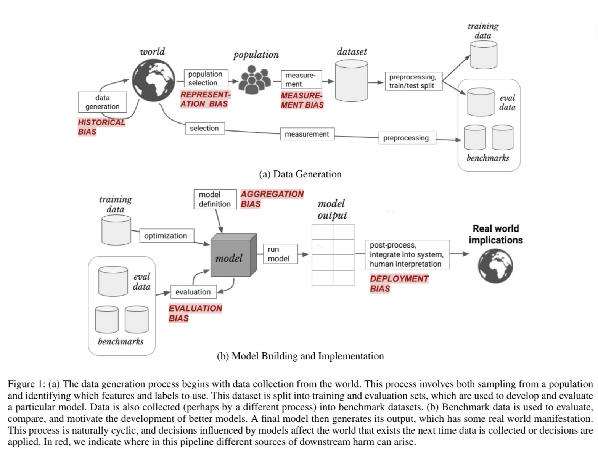
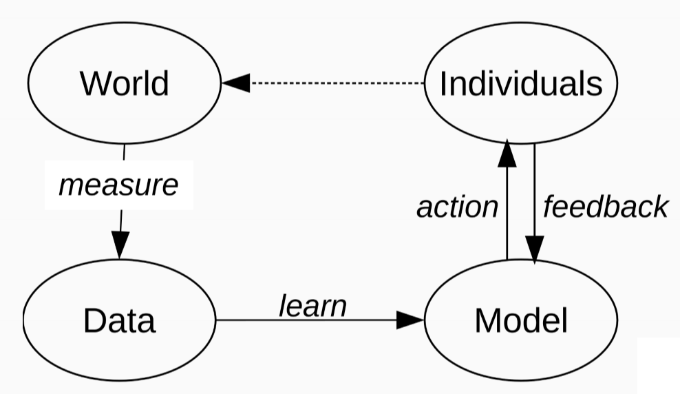
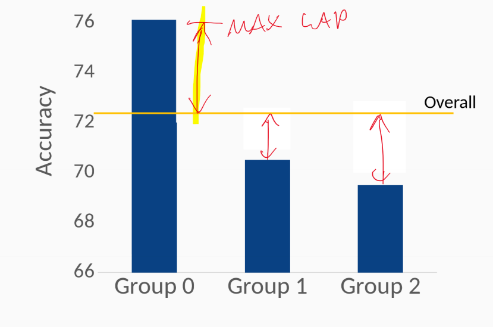
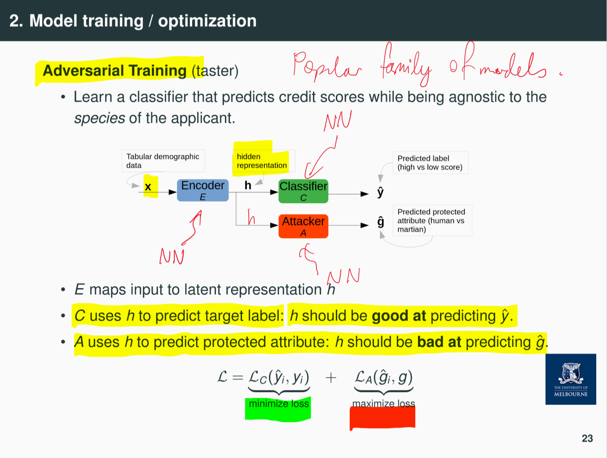

---
title: Measuring and Mitigating Algorithmic Bias
notebook: Machine Learning
layout: note
date: 2021-06-15
tags: 
...

- how can we be sure models are fair?
- how to measure fairness with respect to minority groups
- what can we do to improve fairness?

## Bias in ML

### Human Bias

- humans are the 1st source of bias, with many cognitive biases
- e.g. out-group homogeneity bias (stereotypes/prejudice)
  - perceive out-group members as less nuanced than in-group members
- correlation fallacy: mistaking correlation with causation

### Data Bias

#### Historical bias

- randomly sampled data set reflects the world as it was, including existing biases
  - e.g. image search of professor shows primarily older white males
- misalignment between world as it is and values/objectives to be encoded/propagated in a model
- concerned with state of the world
- exists even with perfect sampling and feature selection

#### Representation/Reporting bias

- data set likely doesn't faithfully represent whole population
- minority groups are underrepresented
- obvious facts are underrepresented, while anomalies are overemphasised
  - e.g. the word murder is commonly used in the corpus, but murders themselves are vary rare

#### Measurement bias

- noisy measurements: errors/missing data which isn't randomly distributed
  - e.g. records of police arrests differ in level of detail across postcode areas
- mistaking noisy proxy for label of interest
  - e.g. using 'hiring decision' as proxy for applicant quality: nepotism, cronyism, unconscious biases, recruiter sorts by inappropriate criterion
- oversimplification of quantity of interest
  - e.g. classifying political leaning into Democrat/Republican as opposed to existing on continuum across social/economic progressivism
  - binarising gender

#### overcoming data bias

- know your domain
- know your task
- know your data

### Model bias

#### Model fit

- weak models: high bias, low variance
  - make unjustified simplifying assumptions

#### Biased Loss Function

- blind to certain types of errors
- e.g. 0/1 loss will tolerate errors in minority class with highly imbalanced data, similar to accuracy

#### Overcoming model bias

- carefully consider model assumptions
- carefully choose loss functions
- model groups separately 
- represent groups fairly in the data

### Evaluation/Deployment Bias

#### Evaluation bias

- test set unrepresentative of target population (e.g. WASP dataset)
- model overfits to a test set
  - wide use of benchmark data sets reinforces this problem
- evaluation metrics may not capture all quantities of interest
  - e.g. disregard minority groups or average effects
  - face recognition models largely trained on images of white people

#### Deployment bias

- use of systems in ways they weren't intended for 
- results from lack of education of end users

#### Overcoming

- carefully select evaluation metrics
- use multiple evaluation metrics
- carefully select test sets/benchmarks
- document models to ensure they are used correctly

### Machine Learning Pipeline

#### Measurement

- define variables of interest
- define target variable
- care needed if target variable measured through proxy, i.e. not measured explicitly
  - e.g. hiring decision -> applicant quality; income -> credit worhiness

#### Learning

- models faithful to data
- data contains knowledge: smoking causes cancer
- data contains stereotypes: boys like blue, girls like pink
  - difference based on social norms

#### Action

- ML concept: regression, classification, information retrieval, ...
- resulting action: class prediction (spam, credit granted), search results, ...

#### Feedback

- approximated from user behaviour
- e.g. click rates
- may reinforce bias: e.g. clicks from majority groups

### Demographic Disparity/Sample Size disparity

- demographic groups will be differently represented in samples
  - historical bias
  - minority groups
  - ...
- what does this mean for model fit?
  - models work better for majorities (e.g. dialects: speech recognition)
  - models generalise based on majorities
  - anomaly detection
- effects on society
  - minorities may adopt technology more slowly, increasing the gap
  - danger of feedback loops: predictive policing -> more arrests -> reinforce model signal
- questions
  - is any disparity justified?
  - is any disparity harmful
- e.g. Amazon same-day delivery
  - areas with large population left out
  - Amazon objective: minimum cost, maximum efficiency.  Purchase power in regions is correlated with white people
  - system is biased
  - discrimination is happening
  - is discrimination justified? is it harmful?
    - No, yes

## Measuring Fairness 

### Sensitive Attributes

- $X$: non-sensitive features
- $A$: sensitive attributes with discrete labels 
  - e.g. male/female, old/young, ...
- $Y$: true labels
- $\hat Y$: classifier score (predicted label)

- often instances have mix of useful, uncontroversial attributes and senstive attributes based on which we don't want to make classification decisions
- different attributes lead to different demographic groups
- rarely clear which attributes are/aren't sensitive, yet choice can have profound impact
  - need to engage domain experts and sociologists

### Fairness through unawareness

- remove controversial features: hide all sensitive features from classifier.  Only train on $X$ and remove $A$
$$P(\hat Y_n|X_n, A_n) \approx P(\hat Y_n|X_n)$$

- case study:
  - bank serving humans + martians
  - wants classifier to predict whether applicant receives credit
  - assume access to features (credit history, education, ...) for all applications
  - $A$: race
  - consider applying fairness through unawareness: would model be fair?
    - no: there may be other attributes correlated with race, so may still be unfair
- Problem: 
  - general features may be strongly correlated with sensitive features
- this approach doesn't generally result in a fair model

## Fairness Criteria

### Positive predictive value/precision

- proportion of positive predictions that are truly positive

$$PPV = P = \frac{TP}{TP+FP}$$

### True positive rate/Recall

- proportion of truly positive instances correctly identified

$$TPR = R = \frac{TP}{TP+FN}$$

### False Negative rate

- proportion of truly negative instances correctly identified

$$FNR = \frac{FN}{TP+FN} = 1-TPR$$

### Accuracy

- proportion of instances correctly labelled

$$Acc = \frac{TP+TN}{TP+TN+FP+FN}$$

### Example problem

- we have trained a classifier to predict binary credit score: should applicant be granted credit?
- assume we have an Adult data set as training data, covering both humans and martians
- consider species as protected attribute: classifier should make fair decisions for both human and martian applicants

### Criterion 1: Group Fairness/Demographic Parity

- sensitive attribute shall be statistically independent of the prediction
- for the classifier this means it is fair if - probability of good credit given martian is the same as the probability of good credit given human

$$P(\hat Y = 1 | A = m) = P(\hat Y = 1 | A = h)$$

- goal: same chance to get positive credit score for all applicants, regardless of species
- no restriction on quality of predictions: criterion is independent of $y$
- can get away with predicting many TPs for 1 group and many FPs for another group, because we don't look at $y$

- pro: simple and intuitive
- sometimes pro: independent of ground truth label $Y$: means it can be used for unsupervised learning
- con: can predict good instances for majority class, but bad instances for minority class - increasing unfairness.  Don't measure quality of predictions
  - danger to further harm reputation of minority class

### Criterion 2: Predictive Parity

- all groups shall have same PPV (precision): i.e. probability predicted positive is truly positive
- for classifier, this means we want:

$$P(Y=1|\hat Y=1,A=m) = P(Y=1|\hat Y = 1, A=h)$$

- chance to correctly get positive credit score should be the same for both human and martian applicants
- now ground truth is taken into account
- subtle limitation: assumes ground truth is fair
  - if ground truth is unfair in dataset, this impacts the predictions we make
  - e.g. humans are more likely to have good credit score in the data
  - may perpetuate this into the future
  - common problem for all fairness metrics

### Criterion 3: Equal Opportunity

- all groups have the same FNR (and TPR): probability of truly positive instance to be predicted negative
  - FN: don't grant credit to someone who qualifies
- for classifier, we want

$$P(\hat Y=0|Y=1,A=m) = P(\hat Y = 0|Y=1,A=h)$$
equivalently with true positives:
$$P(\hat Y=1|Y=1,A=m) = P(\hat Y = 1|Y=1,A=h)$$

- i.e. classifier should make similar predictions for humans and martians with truly good credit scores
- accounts for ground truth
- same limitation as predictive parity

### Criterion 4: Individual Fairness

- rather than balancing by group (human, martian) compare individuals directly

$$P(\hat Y = 1| A_i, X_i) \approx P(\hat Y_j=1|A_j, X_j) \quad\text{if}\quad sim(X_i,X_j) < \theta$$

- individuals with similar features $X$ should receive similar classifier scores
- need to 
  - establish similarity function $sim$
  - set similarity threshold $\theta$

### Other criteria

- no fair free lunch
- many other criteria which often cannot be simultaneously satisfied
- many criteria limit maximum performance of model 
- long term impact
  - group fairness: enforces equal rates of credit loans to men/women even though women statistically less likely to return 
  - further disadvantages the poor and the bank
- fairness criteria should be considered 
  - __soft constraints__
  - __diagnostic tools__
- criteria are __observational__, measuring correlation.  They don't allow us to argue about causality

## Fairness Evaluation

### GAP measures

- measure deviation of performance from any group $\phi_g$ from global average performance $\phi$
- simple, straightforward way to measure fairness of a classifier
- average GAP: 

$$GAP_{avg} = \frac{1}{G}\sum_{g=1}^G |\phi_g - \phi|$$

- maximum GAP: 

$$GAP_{max} = \max_{g\in G}|\phi_g-\phi|$$

- __Accuracy GAP__

- __true positive rate (TPR) GAP__: equal opportunity
- __positive predictive value (PPV) GAP:__ predictive parity

## Creating Fairer Classifiers

- we know
  - where bias can arise: data, model, ...
  - how to statistically define fairness in classifiers
  - how to diagnose unfairness in evaluation
- what steps can we take to achieve better fairness?
  - pre-processing
  - training/optimisation: select models known to be fair
  - post-processing: leave data + model untouched, use different thresholds for different classes

### Pre-processing

#### balance the data set
  - upsample minority group
  - downsample majority group

#### reweight data instances

- expected distribution if A independent to Y ($A \perp Y$)

$$P_{exp}(A=a, Y=1) = P(A=a)P(Y=1) = \frac{count(A=a)}{|D|}\frac{count(Y=1)}{|D|}$$

- observed distribution

$$P_{obs}(A=a,Y=1) = \frac{count(Y=1,A=a)}{|D|}$$

- weigh each instance by

$$W(X_i=\{x_i,a_i,y_i\}) = \frac{P_{exp}(A=a_i,Y=y_i)}{P_{obs}(A=a_i,Y=y_i)}$$

### Model training/optimisation

#### add constraints to optimisation function

- minimise the overall loss $\mathcal{L}(f(X,\theta), Y)$
- subject to fairness constraints, e.g. GAP: $\forall g\in G: |\phi_g-\phi| < \alpha$
- incorporate with Lagrange multipliers
$$\mathcal{L}_{final}(\theta) = \mathcal{L}(f(X,\theta),Y)+\sum_{g=1}^{G}\lambda_g\psi_g$$

#### adversarial training

- learn a classifier that predicts scores while being agnostic to species of applicant
- learn a hidden representation that is good for predicting target label, and bad for predicting protected attribute
- hidden representation doesn't remember anything about protected attribute
- bleach out info about protected attributes from hidden representation

- e.g. learn classifier that predicts sentiment of movie review (positive/negative) while being agnostic to gender
  - often sentiment scores are biased w.r.t. gender

### Post-processing

#### modify classifier predictions

  - decide on individual thresholds per group such that $\hat y_i = 1$ if $s_i > \theta_i$
  - come up with special strategy for instances near decision boundary

#### pros

  - model independent 
  - works with proprietary/black-box models

#### cons
  - needs access to protected attribute at test time
