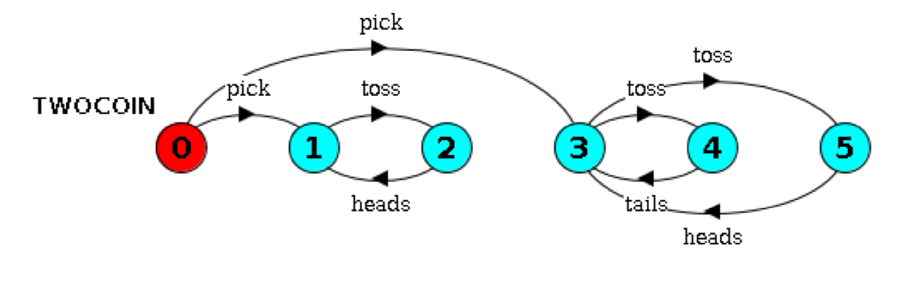
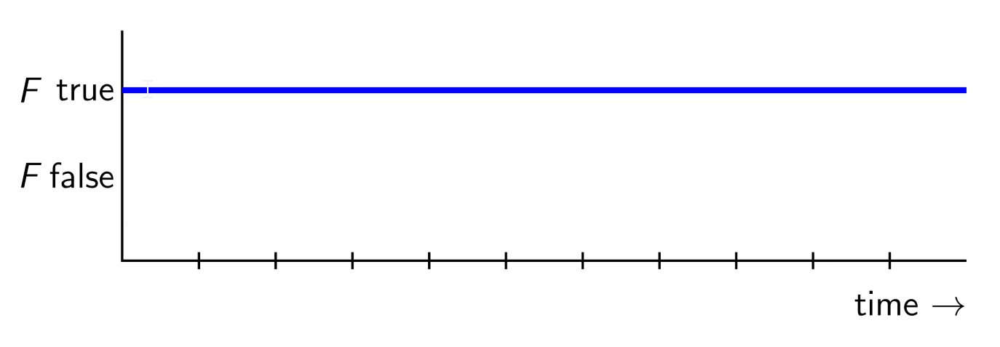
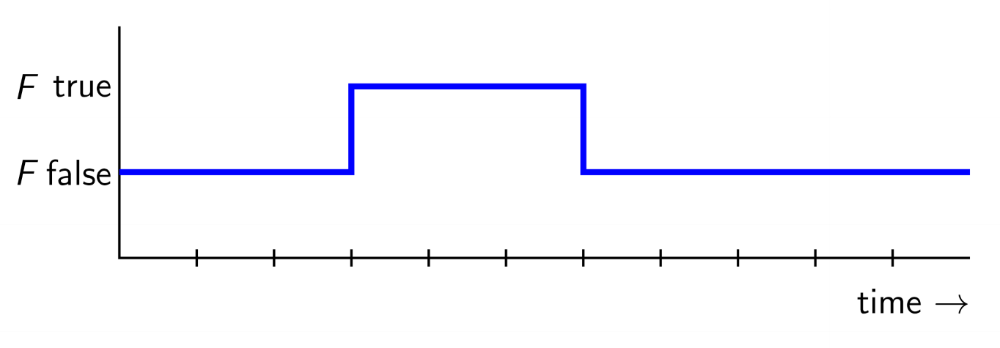
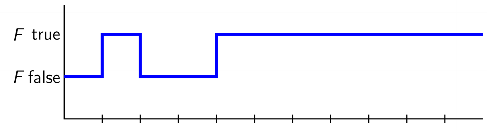
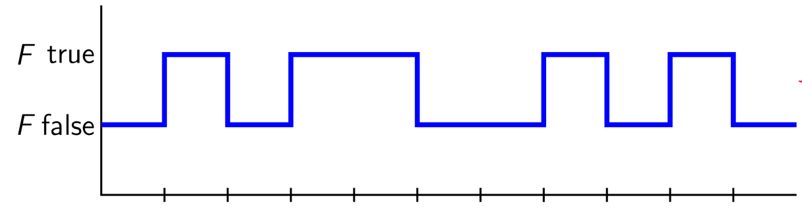
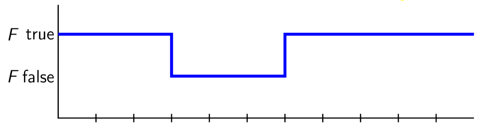
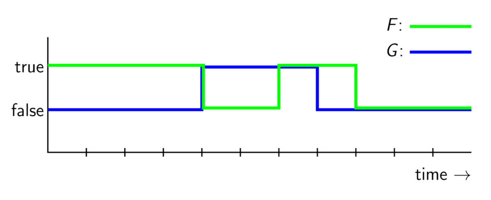

---
title: Concurrency
notebook: Modelling Complex Software Systems
layout: note
date: 2021-03-05
tags: 
...

## Concurrency

### What?

- concurrency is a design principle: structuring programs to reflect potential parallelism
- sequential vs concurrent program: 
- sequential: single thread of control: one instruction pointer is sufficient to manage execution
- concurrent: multiple threads of control, allowing multiple calculations to occur at the same time,
  and simultaneous interaction with external events
- threads/processes in a concurrent program share data or communicate with 1+ threads in that program

### Why?

- natural model: e.g. user interface with keyboard + mouse + multiple windows
- necessity: e.g. autonomous robot requires multiple threads to respond appropriately
- performance: increased performance with multiple processors

### What makes it hard?

- processes need to interact:
- __communication:__ communication by accessing shared data/message passing
- __synchronisation:__ processes need to synchronise certain events: P mustn't reach p until after Q has reached q.
- __non-determinism:__ execution is non-deterministic - hence model checkers to formally establish properties

### Concurrent Language Paradigms

- __shared-memory:__ uses monitors
- e.g. Concurrent Pascal, Java, C#
- __message-passing:__ Hoare's idea of __Communicating Sequential Processes (CSP)__
- e.g. Go, Erlang, Occam

### Speed Dependence

- __speed-dependent:__ when concurrent programs are dependent on relative speeds of components' execution
- fluctuations in processor/IO speed are sources of non-determinism
- __real-time systems:__ when absolute speed of system matters (in embedded systems)

### Arbitrary interleaving

- model of concurrent behaviour: at level of atomic events, no 2 events occur at exactly the same time
- e.g. process P performs atomic actions a, b.  process Q performs x, y, z.
- 10 possible interleavings of these actions while maintaining order
- arbitrary interleaving model: these 10 sequences are the possible outcome of running P and Q concurrently

### Concurrent Programming Abstraction

- concurrency is an abstraction to help reason about the dynamic behaviour of programs
- the abstraction can be related to machine language instructions, however there are no important
  concepts that cannot be explained at the higher level of abstraction
- __concurrent program:__ finite set of sequential processes, composed of a finite number of atomic statements
- execution of a concurrent program proceeds via execution of sequence of atomic statements from the processes
- sequence formed as an __arbitrary interleaving__ of atomic statements of the processes
- __computation/scenario:__ possible execution sequence resulting from interleaving
- NB sequential processes implies ordering of steps is maintained
- __control pointer:__ of a process indicates next statement that can be executed  


- arbitrary interleaving lets us ignore real-time behaviour, making programs more amenable to formal analysis
- program properties are then invariant under hardware

### Atomicity

- assignments such as `n := n+1` are not atomic in most programming languages, as most compilers break them up
into more basic machine code instructions:  `load, increment, store`
- if 2 processes attempt to increment a shared variable simultaneously, the interleaving of these atomic instructions
could be `P.load, Q.load, P.increment, Q.increment, P.store, Q.store`, such that the result is only `n+1`
- each process falsely assumes exclusive access to n in the _read-change-write_ cycle
- __race condition/interference__
- requires __mutual exclusion__

### Correctness

- for a concurrent program to be correct it must be correct for _all_ possible interleavings
- correctness of non-terminating concurrent programs is defined in terms of properties: safety, liveness
- __safety properties:__ property must always be true.  For safety property $P$ to hold, it must be true that in every state
of every computation, $P$ is true. "Always, a mouse cursor is displayed"
- safety properties often take form _always, something bad is not true_
- nothing bad will ever happen
- e.g. absence of __interference__
- __liveness properties:__ property must eventually become true. For liveness property $P$ to hold, it must be true that in every computation 
there is some state in which $P$ is true. "If you click on a mouse button, eventually the mouse cursor will change shape"
- something good eventually happens
- e.g. absence of __deadlock__
- safety, liveness are duals of each other: the negation of a safety property is a liveness property and vice versa

## Java Threads

- in Java processes are called threads

### Creation

Two ways to create:
  - extend `java.lang.Thread`: as Java doesn't support multiple inheritance this is not always possible
  - implement `Runnable` interface: recommended approach

### States

Alive thread is in one of these states:
- __running:__ currently executing
- __runnable:__ not currently executing, but ready to execute
- __non-runnable:__ not currently executing, not ready to run
  - e.g. waiting on input or shared data to become unlocked


### Primitives

- `start()` causes JVM to execute `run()` in a dedicated thread, concurrent with the calling code
- a thread stops executing when `run()` finishes
- `sleep(long milliseconds)` allows you to suspend thread for specified time
- `isAlive()`: indicates whether thread is running
- `yield()`: causes current thread to pause (running -> runnable)
- transition from runnable -> running is up to runtime system's scheduler
- `t.join()` suspends caller until thread `t` has completed (i.e. two threads join together)

### More states

Additional states:
- having called `sleep()`
- having called `join()`
- waiting for a lock to be released: having called `wait()`

### Interruption

- Threads can be __interrupted__ via `Thread.interrupt()`
- if interrupted in one of the 3 above states, the thread returns to a __runnable__ state, causing
  `sleep(), join(), wait()` to throw an `InterruptedException`

## Mutual Exclusion (Mutex)

- N processes executing infinite loops, alternating between __critical__ and __non-critical__ sections
- process may halt in __non-critical__ section, but not in __critical__ section
  - shared variables are only written to in the critical section: to avoid race condition, only one thread can be in 
    critical section at any time

```java
class P extends Thread {
  while (true) {
    non_critical_P();
    pre_protocol_P();
    critical_P();
    post_protocol_P();
  }
}

class Q extends Thread {
  while (true) {
    non_critical_Q();
    pre_protocol_Q();
    critical_Q();
    post_protocol_Q();
  }
}
```

### Properties of mutex solution

- __mutual exclusion:__ only 1 process may be active in critical section at a time 
  - safety: ensure interference prevented
- __no deadlock:__ if 1+ processes trying to enter their critical section, one must eventually succeed
  - liveness
- __no starvation:__ if a process is trying to enter its critical section, it must eventually succeed

Also desirable:
- __lack of contention:__ if only one process is trying to enter critical section, it must succeed with minimal overhead
  - efficient

### Assumptions

- no variable used in protocol is used in critical/non-critical sections and vice-versa
- load, store, test of common variables are atomic operations
- must be progress through critical sections: if a process reaches critical section, it must eventually reach the end of it
- cannot assume progress through non-critical sections: a process may terminate or enter an infinite loop

### Attempt 1

- single protocol variable: token passed between processes `static int turn = 1;`
- processes wait for their turn
- properties:
  - mutex: yes.  Only 1 thread can enter a critical section at a time
  - no deadlock: yes. `turn` can only have values 1 or 2, so one process can always enter
  - no starvation: no: Q can be waiting for its turn while P executes non-critical section indefinitely.  Q never gets a turn - starvation.

### Attempt 2

- give each thread a flag.  Each thread can only modify its own flag
- a thread can only enter the critical region when the other process has lowered its flag.
- a thread raises its flag after waiting, as it is entering its critical region
- properties:
  - mutual exclusion: no. Possible for both processes to enter critical region simultaneously

### Attempt 3

- as in attempt 2, give each thread a flag.  Each thread can only modify its own flag
- now each process sets the flag prior to waiting
- properties:
  - mutual exclusion: yes
  - no deadlock: no. Both processes set flag prior to entering critical region.  Neither can proceed
  - no starvation: no, as there can be deadlock, both processes will starve
  - lack of contention: yes. if P is in non-critical section Q can enter its critical section

### Attempt 4

- as in attempt 3, give each thread a flag.  Each thread can only modify its own flag
- each process sets the flag prior to waiting
- if both processes have the flag raised, momentarily lower then re-raise the flag
- properties:
  - mutual exclusion: yes
  - no deadlock: yes. Lowering of flags removes deadlock
  - no starvation: no. Can get livelock, with infinite sequence of both processes lowering/raising flags without either entering critical region
  - lack of contention: yes, per attempt 3

__Livelock:__ processes are still moving, but critical section is unable to be completed

### Attempt 5: Dekker's Algorithm

- use flags + turn token
```java
static int turn =1;
static int p = 0;
static int q = 0;
```
- whoever previously entered critical section has lower priority to enter the critical section

```java
while (true) {
  non_critical_P();
  p = 1;
  // repeat while Q has flag raised
  while (q != 0) {
    // if it is Q's turn
    if (turn == 2) {
        // lower flag
        p = 0;
        // wait until its P's turn
        while (turn == 2);
        // raise p's flag
        p = 1;
    }
  }
  critical_P();
  turn = 2;
  p = 0;
}

while (true) {
  non_critical_Q();
  q = 1;
  // repeat while P has flag raised
  while (p != 0) {
    // if it is Q's turn
    if (turn == 1) {
        // lower flag
        q = 0;
        // wait until its Q's turn
        while (turn == 1);
        // raise Q's flag
        q = 1;
    }
  }
  critical_Q();
  turn = 1;
  q = 0;
}
```

- properties:
  - mutex: yes.  P only enters critical section if `q != 0`
  - no deadlock: yes, thanks to flag lowering
  - no starvation: yes, no livelock as in attempt 4 due to turn priority
  - lack of contention: yes.  If P is in non-critical section Q can enter critical section
- hard to generalise to programs with > 2 processes

### Peterson's Mutex Algorithm

- 1981 solution, scales more readily than Dekker's algorithm
- also uses flags and turn token

```java
static int turn = 1;
static int p = 0;
static int q = 0;

while (true) {
  non_critical_P();
  p = 1;
  turn = 2;
  // give Q a turn.  wait till it is complete
  while (q && turn == 2);
  critical_p();
  p = 0;
}
```

## Java: Monitors and synchronisation 

- correct algorithms for mutex are tedious and complex to implement
- concurrent programming languages offer higher-level synchronisation primitives
- Java offers
  - __synchronised methods/objects:__ a method/object can be declared `synchronized` - only 1 process can execute/modify it at a time
  - __monitors:__ set of synchronized methods/data that queue processes trying to access the data

### Synchronised methods

- `synchronized` keyword declares method/object as being executable/modifiable by only 1 process at a time
  - marks method as __critical section__

```java
synchronized void increment() { ... }
```

### Synchronized object

- can declare an object as synchronised, making entire object mutually exclusive:
- disadvantage: requires user of shared object to lock the object, rather than placing this inside shared object and encapsulating
- if user fails to lock object correctly, race conditions can occur

```java
class SynchedObject extends Thread {
  Counter c;

  public SynchedObject(Counter c) { this.c = c; }

  public void run() {
    for (int i = 0; i < 5; i++) {
      synchronized(c) {
        c.increment();
      }
    }
  }
}
```

### Monitors

- language feature that provides mutual exclusion to shared data
- in Java, a monitor is an object that encapsulates some private data, with access via synchronized methods
  - manages blocking/unblocking of processes seeking access
- e.g. bank account shared between parent and child
- leaving responsibility of wait to client of shared object is bad because
  - user has to continually poll: wasteful
  - code needs to be replicated for multiple clients
  - an incorrect implementation of any client means interference can occur
- monitors alleviate these issues by making the encapsulating class do the work
- __monitor:__ encapsulated data + operations/methods 
  - maintains queue of processing wanting access
- all objects in Java have monitors, having a lock that allows holding thread to access synchronized methods of the object
- `Object` contains 3 relevant methods:
  - `void wait()`: causes current thread to wait until another thread invokes `notify()` or `notifyAll()` for
    this object. (i.e. `wait()` causes the thread to block, and relinquishes the lock the thread holds to other waiting threads)
  - `void notify()`: wakes up a _single_ thread waiting on this object's lock
    - choice of thread is arbitrary (up to JVM)
    - not needed for this course
  - `void notifyAll()`: wakes up all threads waiting on object's lock

```java
class MonitorAccount extends Account {
    public synchronized void withdraw(int amount) {
        while (balance < amount) {
            // withdrawal cannot proceed.  get thread to wait until balance updates
            try {
                wait();
            } catch (InterruptedException e) {}
        }
        super.withdraw(amount);
    }

    public synchronized void deposit(int amount) {
        super.deposit(amount);
        // after deposit, notify all threads waiting for updated balance
        notifyAll();
    }
}
```

### Lightweight monitors

- every object has a lock: to execute a `synchronized` method, a process first needs to acquire the object's lock
- the lock is released upon return
- a process P, holding the lock on object o, can relinquish the lock by invoking `wait()`
  - P is then __waiting__ on o
- a process Q may execute `o.notify()`, changing some waiting process' state to __locking__
  - Q must have o's lock, and be running, for this to occur
  - the notifier holds the lock until the end of the synchronised method/code block
- Java monitors are lightweight, and don't guarantee fairness
  - some programming languages include priority: Java does not.
  - it is essentially random which thread will be chosen
  - typical pattern: `while () { wait() }`
    - common mistake: using `if` where `while` should be used
  - original monitor concepts allowed for different wait sets, each waiting for a specific condition to hold.  Java does not
    - instead Java uses `notifyAll()` to release all processes waiting on the object

### Implementation

- for a class to meet the requirements of a monitor:
  - all attributes `private`
  - all methods   `synchronized` 
- if a class satisfies these requirements, all methods are treated as atomic events

### Volatile variables

- declaring variable  `volatile` directs JVM to reload its value every time it needs to refer to it
  - otherwise compiler may optimise code to load value once only
- compilers/VMs load the value of a variable into a cache for efficiency
- if value is modified by one thread, other threads relying on cached values may not detect this,
  and use the stale cached value
- updates to variable values may be made initially in the cache, and not immediately be written back to memory
- declaration of variables as `volatile` directs VM to read/write that variable directly to/from memory

### Process states

- synchronisation constructs (e.g. monitors) can produce a different non-runnable state in which the process is blocked
- __blocked__ process relies on other processes to __unblock__ it, after which it is again __runnable__


### Synchronisation constructs

| Level of abstraction | Construct | 
|----------------------|-----------|
| High                 | Monitor   |
|                      | Semaphore |
| Low                  | Protocol variables |

## Java: Semaphores 

- __semaphore:__ $(v, W)$, simple, versatile concurrent device for managing access to a shared resource
  - __value $v \in \mathbb{N}$:__ number of currently available access permits
  - __wait set $W$:__ processes currently waiting for access
- must be initialised $S := (k, \{\})$
  - $k$: maximum number of threads simultaneously accessing the resource
- atomic operations: `wait`, `signal`

### Analogy: Hotel with $k$ rooms

- 1 guest per room
- at the door is a receptionist
- outside are people wanting a room
- receptionist gives out the 10 keys they have.  Number of keys decreases as each key is handed out
- once all keys have been handed out, others must wait outside until a key is returned

### Operations

- `S.wait()`: receive permit if available, otherwise get added to the wait set
- `S.signal()`: return a permit, unblock an arbitrary process

```python
S.wait():

if S.v > 0
  # provide permit
  S.v--
else 
  # add process p to wait set 
  S.w = union(S.W, p)
  p.state = blocked
```

```python
S.signal():

if S.W == {}
  # empty wait set, so keep the permit
  S.v++
else 
  # hand out permit to someone in the wait set
  choose q from S.W
  # remove q from wait set
  S.W = S.W \ {q}
  q.state = runnable
```

### Binary Semaphore: Mutex

- if $S.v \in \{0,1\}$, $S$ is called __binary/mutex__ as it ensures mutual exclusion
- semaphores are implemented in many programming languages, as well as at the hardware level

### Solution of Mutex Problem

- using a binary semaphore:

```bash
binary semaphore S = (1, {});

Process P loop:
p1:  non_critical_p();
p2:  S.wait();
p3:  critical_p();
p4:  S.signal();

Process Q loop:
q1: non_critical_q();
q2: S.wait();
q3: critical_q();
q4: S.signal();
```

### State Diagrams

- digraph: nodes - states, edges - transitions
- state gives info about a process at a point in time: values of instruction pointer + local variables
- below shows semaphore solution - only shows `signal, wait` operations:


- can show 
  - correctness of solution (i.e. mutual exclusion): there is no state `p4, q4`
  - absence of deadlock: deadlock would be a node with no outgoing edges
  - absence of starvation

### Controlling execution order

- use of 2 semaphores to control sorting

```bash
integer array A
binary semaphore S1 = (0, {})
binary semaphore S2 = (0, {})

p1: sort low half
p2: S1.signal()
p3: 

q1: sort high half
q2: S2.signal()
q3:

# wait for both semaphores to become available
m1: S1.wait()
m2: S2.wait()
m3: merge halves
```

### Strong semaphores

- binary semaphore solution to mutex problem generalises to $N$ processes
- when $N > 2$: no longer guarantee of freedom from __starvation__
  - blocked processes are taken arbitrarily from a set
  - fair implementation: processes wait in a __queue__
  - removes starvation, and then we have __strong semaphore__

### Bounded Buffer Problem

- e.g. streaming video via YouTube
  - Producer: server
  - Consumer: browser
  - want regular, consistent speed of video even with noisy data transfer
  - use a buffer to smooth this out, using a queue of video frames
  - need a way to add to/remove from queue
  - buffer has finite size: 
    - cannot add data to a full buffer
    - cannot remove data from an empty buffer
- common pattern in concurrent/async systems
- Producer process `p`
- Consumer process `q`
- `p` generates items for `q` to process
- if they have similar average but varying speed, a __buffer__ can smooth overall processing and speed it up,
  permitting asynchronous communication between `p` and `q`
- general semaphores can be used for this:
  - two semaphores $S1, S2$ maintain a loop invariant $S1.v + S2.v = n$
  - $n$: buffer size
- let's call the semaphores `notEmpty, notFull`

```bash
buffer = empty queue;
// no permits available for removal from queue
semaphore notEmpty = (0, {});
// n permits available for adding to queue
semaphore notFull = (n, {});

Producer
idem d
loop
  # produce items
  p1: d = produce();
  # wait for buffer to have space
  p2: notFull.wait();
  p3: buffer.put(d);
  # indicate data has been put onto buffer
  p4: notEmpty.signal();

Consumer
item d
loop
  # wait until the buffer has items to consume
  q1: notEmpty.wait();
  q2: d = buffer.take();
  # indicate item taken from buffer
  q3: notFull.signal();
  q4: consume(d);
```

### Java semaphores

- `java.util.concurrent` has `Semaphore` class
  - `acquire()` = wait
  - `release()` = signal
- has optional argument to make it a strong semaphore, by default they are weak

### Java Thread states in detail


### Peterson's mutex algorithm

```java
static int turn = 1;
static int p = 0;
static int q = 0;

while (true) {
p1:  non_critical_P();
p2:  p = 1;
p3:  turn = 2;
     // give Q a turn.  wait till it is complete
p4:  while (q && turn == 2);
p5:  critical_p();
p6:  p = 0;
}

while (true) {
q1:  non_critical_q();
q2:  q = 1;
q3:  turn = 1;
     // give P a turn.  wait till it is comqlete
q4:  while (p && turn == 2);
q5:  critical_q();
q6:  q = 0;
}
```

- finite number of states:
  - possibly as many as 288 states, but most are unreachable
- each state is a tuple $(p_i, q_i, p, q turn)$
- can exclude statements that aren't part of the protocol $p_1, p_5, q_1, q_5$
- 14 states of interest
- can see from state diagram
  - mutex achieved: states (p6, q6, ...) are unreachable
  - no deadlock: no state of form (p4, q4, ...) is stuck (i.e. can always progress when both are waiting to enter critical region)
  - no starvation: from each state (p4,...) a state (p6,...) can be reached.  The same holds for q4.

## Formal modelling with FSP

- Finite State Processes (FSP): language based on Communicating Sequential Processes (CSP) and Calculus of Communicating Systems (CCS)
- rules for manipulating/reasoning about expressions in these languages: process algebra
- use of FSP vs CSP/CCS
  - machine readable syntax
  - models are finite.  The others can have infinite system states, making them much more difficult to reason about
  - allows us to execute them and exhaustively prove properties about them

### Advantages of formal modelling

- forces preciseness in thinking
- provides rigour needed to analyse models, compare with physical circumstances and make trade-offs

### LTS 

- __Labelled transition system (LTS):__ __finite state machine__ used as a model of our programs
- doesn't specify timing, only considers sequence
  - alternative formalisms do consider timing

### FSP 

- graphical representation works for small systems but quickly becomes unmanageable/unreadable for real problems
  - huge number of states/transitions
- hence we use an algebraic language, __finite state processes__, to describe process models
- each FSP model has a corresponding LTS model

### Concepts

- process model consists of 
  - alphabet: atomic actions that can occur in a process
  - definition of legal sequences of atomic actions
- processes, and synchronisation of concurrent processes is described using algebraic operators

### Action prefix operator `->`

If x is an action and P a process, then x -> P describes a process that first engages in action x and then behaves as described by P

- always has 
  - atomic action as left operand
  - process as right operand
- repetitive behaviour: use recursion
- atomic actions: lower case
- process names: upper case

### Subprocesses `,`

- subprocesses can be defined local to the definition of a process using `,`

```
PROCESS = SUBPROCESS,
SUBPROCESS = (action1 -> SUBPROCESS2),
SUBPROCESS 2 = (action2 -> SUBPROCESS).
```

### Choice `|`

- choice operation `|` describes a process that can execute more than one possible sequence of actions
- `(x -> P | y -> Q)` describes a process which initially engages in either x or y, followed by process P or Q respectively
- FSP does not distinguish input/output actions
  - actions that form part of a choice are usually considered inputs
  - actions that offer no choice are usually considered outputs

### Non-deterministic choice

- `(x -> P | x -> Q)`: describes process that engages in x then behaves as P or Q
- x is prefix in both options
- choice is made by process, not environment: x could be an input from the environment, but the choice of P/Q is not controlled by it

### Indexed Processes

- can use an index to model a process that can take multiple values
- increases expressiveness of FSP
- e.g. buffer that can contain a single input value, ranging from 0-3, and then outputs the value

```
BUFFER = (in[i:0..3] -> out[i] -> BUFFER).
```

### Constants and Ranges

- constants can only take integer values
- ranges are finite ranges of integers

```
const N = 3
range T = 0..N

BUFF = (in[i:T] -> STORE[i]),
STORE[i:T] = (out[i] -> BUFF).
```

### Guarded actions

- guarded action allows a context condition to be added to options in a choice
- `(when B x -> P | y -> Q)`: 
  - when guard B is true, actions x and y are both eligible to be chosen
  - when guard B is false, action x cannot be chosen
- counter

```
COUNT(N=3) = COUNT[0],
COUNT[i:0..N] = ( when (i<N) inc -> COUNT[i+1]
                | when (i>0) dec -> COUNT[i-1]
                ).
```

### STOP process

- `STOP` is a special, predefined process that engages in no further actions
- used for defining processes that terminate

## Concurrency in FSP

### Parallel composition `||`

- if P and Q are processes, `(P || Q)` represents concurrent execution of P and Q
- semantics specify 2 processes will interleave: only a single atomic action from either will execute at one time
- when a process P is defined by parallel composition, its name must be prefixed `||P`

### Parallel composition rules

- algebraic laws - for all P, Q, R:
  - commutativity: `(P || Q) == (Q || P)`
  - associativity:  `((P || Q) || R) == (P || (Q || R))`
- composite processes are 1st class citizens and can be interleaved with other processes
- i.e. we can build up large, complicated systems from simpler systems

### Shared Actions

- if processes in composition have actions in common, these actions are __shared__
  - this models process interaction
- unshared actions may be arbitrarily interleaved
- shared actions must be executed simultaneously by all processes that participate in that shared action
  - i.e. other processes will be blocked until able to take that action

### Relabelling actions

- sometimes convenient to make actions relevant to the local process, and rename them so that they are shared in a composite process
- `P/{new1/old1, ..., newN/oldN}` is the same as P but with action `old1` renamed to `new1` etc.

### Process Labelling

- to distinguish between different instances of the same process, we can prepend each action label of an instance with a distinct instance name
- `a:P` prefixes each action label in P with a
- you can also use an array of prefixes: `||N_CLIENTS(N=3) = (c[i:1..N]:CLIENT).`
- equivalently: `||N_CLIENTS(M=3) = (forall[i:1..M] c[i].CLIENT).`
- to ensure composite process of the server with clients then shares actions, you will need to prepend the prefixes for all action labels and add transitions
- `{a1,..,ax}::P` replaces every action label `n` in P's alphabet with the labels `a1.n, ..., ax.n`.  Every transition `n->X` in P is replaced with transitions
  `({a1.n,..,ax.n}->X)`
  - `{a1,..,ax}`: shorthand for set of transitions `(a1 -> X), ..., (ax -> X)`

### Client-Server example

- N clients and one server:

```
CLIENT = (call -> wait -> continue -> CLIENT).
SERVER = (request -> service -> reply -> CLIENT).

||N_CLIENT_SERVER(N=2) = 
    (  forall[i:1..N] (c[i]:CLIENT) 
    || {c[i..N]}::(SERVER/{call/request, wait/reply})
    ).
```

### Variable hiding

- you can hide variables to reduce complexity
- `P\{a1,...,aN}` is the same as P with actions `a1, ..., aN` removed, making them silent.  
- silent actions are name `tau` and are never shared
- alternatively you can list variables that are not to be hidden: `P@{a1,...,aN}` is the same as P with all action names other than `a1,...,aN` removed

## FSP Synchronisation

- we can use LTSA to check for problems such as deadlock, interference automatically
- __deadlock:__ process is blocked waiting for a condition that will never become true
- __livelock:__ busy wait deadlock; process is spinning while waiting for a condition that will never become true
  - can happen if concurrent processes are mutually waiting for each other

### Coffman Conditions

4 necessary and sufficient conditions.  All must occur for deadlock to happen

1. __serially reusable resources:__ processes must __share__ some reusable resources between themselves under __mutual exclusion__
2. __incremental acquisition:__ processes __hold on__ to allocated resources __while waiting__ for other resources
3. __no preemption:__ once a process has acquired a resource, it can only release it __voluntarily__, i.e. it cannot be preempted/forced to release it
4. __wait-for cycle:__ a __cycle__ exists in which each process holds a resource which its __successor__ is waiting for

- e.g. serially reusable resource: 2 people at dinner order steak, with only 1 steak knife at the table
  - to eat steak, the steak knife is required
  - need to wait for the knife to be available to proceed
- e.g. incremental acquisition: once you have the knife, wait until you also acquire a fork
- any deadlock in concurrent systems can be broken down to 4 Coffman conditions
- Corollary: to __remove__ deadlock, break any of the Coffman conditions

### LTSA Deadlock

- automatic checks via BFS on LTS (labelled transition system)
- terminates when
  - finds a state with no outgoing transitions = deadlock
  - has searched all states = no deadlock
- when a deadlock is found, BFS finds a shortest possible trace to deadlock

### Monitors: FSP vs Java

- FSP monitors map well to Java monitors: `when cond act -> NEW_STATE` becomes

```java
public synchronized void act() throws InterruptedException {
    while (!cond) wait();
    // modify monitor data
    notifyAll();
}
```

### Bounded buffers using monitors

- buffer with finite size, into which items are inserted by a producer, and removed by a consumer in FIFO manner
- due to finite size, items can only be inserted if buffer is not full, otherwise the producer is blocked.  
- Items can only be removed if it is not empty, otherwise the consumer is blocked

```
// bounded buffer using monitor

// buffer size 
const N = 4
range U = 0..N

BUFFER = BUFF[0],
BUFF[i:U] = ( when (i < N) put -> BUFF[i+1]
      			| when (i > 0) get -> BUFF[i-1]
		      	).

PRODUCER = (put -> PRODUCER).
CONSUMER = (get -> CONSUMER).

||BOUNDED_BUFFER = (PRODUCER || CONSUMER || BUFFER).
```

- note FSP implementation is much simpler than Java implementation: FSP is concise and expressive

### Bounded buffers using semaphores

- 2 semaphores: each blocks when value is 0
  - empty: semaphore that blocks when buffer is empty, initialised to N, allowing `put` before a `get` occurs
  - full: semaphore that blocks when buffer is full, initialised to 0; blocks calls to `get` initially
- given `put`, empty is decremented, full is incremented
- given `get`, full is decremented, empty is incremented

```
// bounded buffer using semaphores

// buffer size 
const N = 4
range U = 0..N

// up/signal: return permit
// down/wait: block until permit acquired
SEMAPHORE(X=N) = SEMAPHORE[X],
SEMAPHORE[i:U] = 
	( when (i < N) signal -> SEMAPHORE[i+1]
	| when (i > 0) wait -> SEMAPHORE[i-1]
	).

BUFFER =
	// given a put, one empty token is removed, and one full token is acquired
	( empty.wait -> put -> full.signal -> BUFFER
	// given a get, one full token is removed, and one empty token is acquired
	| full.wait -> get -> empty.signal -> BUFFER
	).

PRODUCER = (put -> PRODUCER).
CONSUMER = (get -> CONSUMER).

// empty: semaphore that blocks when buffer is empty
// full: semaphore that blocks when buffer is full
||BOUNDED_BUFFER = (empty:SEMAPHORE(N) || full:SEMAPHORE(0) 
					|| PRODUCER || CONSUMER || BUFFER).
```

- `full.wait` placed before `get` to prevent deadlock via incremental acquisition
  - execution of `get` process obtains lock for buffer, then tries to claim `full` semaphore as well
  - buffer lock should be acquired after semaphore is acquired
  - see con_07 for more details
- however with a half-full buffer, this approach blocks the other process (consumer/producer) from the other semaphore
- more efficient design: leave semaphore access to producer/consumer

```
BUFFER = (put -> BUFFER | get -> BUFFER).
PRODUCER = (empty.wait -> put -> full.signal -> PRODUCER).
CONSUMER = (full.wait -> get -> empty.signal -> CONSUMER).
```

### Dining Philosophers problem

- 5 philosophers at circular table
- philosophers alternately think and eat
- large plate of spaghetti in centre of table
- to eat, a philosopher needs 2 forks
- only 5 forks at table, one between each pair of philosophers
- each philosopher only uses forks to immediate left/right

- forks are shared resource

### Philosophers 1: Deadlock

```
const N = 5

PHILOSOPHER = (think -> left.get -> right.get -> eat -> left.release -> right.release -> PHILOSOPHER).

FORK = (get -> release -> FORK).

||DINING_PHILOSOPHERS = 
	(  forall[i:0..N-1] p[i]:PHILOSOPHER
	|| forall[i:0..N-1] {p[i].left,p[((i-1)+N)%5].right}::FORK
	).
```

- produces deadlock: each philosopher takes left fork: this is a __wait-for cycle__

### Philosophers 2

- how do we resolve this? let's remove the wait-for cycle
  - let's have odd-numbered philosophers behave differently to even-numbered philosophers:
    - odd #: pick up right fork first
    - even #: pick up left fork first
- LTSA confirms this has no deadlocks

```
const N = 5

PHILOSOPHER(I=0) = 
	// even philosopher: left fork first
	( when (I%2 == 0) think -> left.get -> right.get -> eat -> left.release -> right.release -> PHILOSOPHER
	// odd philosopher: right fork first
	| when (I%2 == 1) right.get -> left.get -> eat -> left.release -> right.release -> PHILOSOPHER
	). 

FORK = (get -> release -> FORK).

||DINING_PHILOSOPHERS = 
	(  forall[i:0..N-1] p[i]:PHILOSOPHER(i)
	|| forall[i:0..N-1] {p[i].left,p[((i-1)+N)%5].right}::FORK
	).
```

## Checking Safety in FSP

### Counter

```
const N = 4
range T = 0..N

VAR = VAR[0],
// variable can be read/written to 
VAR[u:T] = (read[u] -> VAR[u] | write[v:T] -> VAR[v]).

CTR = ( read[x:T] -> 
        ( when (x<N) increment -> write[x+1] -> CTR
        | when (x==N) end -> END
        )
      )+{read[T], write[T]}.

// create a shared counter
||SHARED_COUNTER = ({a,b}:CTR || {a,b}::VAR).
```        

### Alphabet Extensions

- __alphabet:__ set of action a process engages in
- in above e.g. CTR process has alphabet `{read[0], ..., read[4], write[1], ..., write[4]}`
- `write[0]` is not part of the alphabet, as CTR never performs this action
- when CTR is composed with VAR, this means `write[0]` can be executed at any time
- extend the alphabet of CTR to prevent this problem

### Checking for interference

- find a trace such that both processes write the same value

```
INTERFERENCE = (a.write[v:T] -> b.write[v] -> ERROR).

||SHARED_COUNTER = ({a,b}:CTR || {a,b}::VAR || INTERFERENCE).
```

ERROR is a predefined process signalling an error in the model, causing deadlock.

- now safety check shows deadlock, produced by both processes writing the same value to the variable
- e.g. both processes write value 1: interference

```
a.read.0
a.increment
b.read.0
a.write.1
b.increment
b.write.1
```

### Mutual Exclusion

- create a LOCK process to allow synchronisation between counters

```
LOCK = (acquire -> release -> LOCK).
```

- modify CTR so it has to acquire a lock on VAR before executing the critical section, and release afterwards

```
CTR = ( acquire -> read[x:T] -> 
        ( when (x<N) increment -> write[x+1] -> release -> CTR
        | when (x==N) release -> END
        )
      )+{read[T], write[T]}.


||LOCKED_SHAREDCOUNTER = ({a,b}:CTR || {a,b}::(LOCK||VAR)).
```

- if we add in the `INTERFERENCE` process, we see it fails to find a trace for
  interference, but a deadlock is found (because INTERFERENCE expects a to
  write before b)
- instead of making INTERFERENCE more complicated, we should instead use __properties__
  - the approach used above specifies negative behaviours that can occur: sometimes more powerful to use 
    the inverse

### Safety and Liveness Properties

- methodology:
  - describe concurrent processes using FSP
  - describe property of model, i.e. something true for every possible trace/execution of that model
- categories of properties of interest for concurrent systems:
  - __safety:__ nothing bad happens during execution.  E.g. deadlock
    - sequential system safety property: satisfies some assertion each time a given program point is reached
    - concurrent system: e.g. absence of deadlock/interference
  - __liveness:__ something good eventually happens. e.g. all processes trying to access a critical section eventually get access
    - sequential system: system terminates
    - concurrent system: as non-terminating, relates to resource access
 
### Error States

 - `ERROR`: pre-defined process signalling termination in an error state, i.e. a state we don't want to move into
  - labelled -1
  - no outgoing transitions
  - can be used to indicate erroneous behaviour: explicitly identify erroneous action

### Safety Properties

- better to consider __desired system behaviour__ rather than enumerating all possible undesirable behaviours
- i.e. specify desirable properties and check the model maintains them: __safety properties__
- specified with `property` keyword
- LTSA compiler adds outgoing action to error state for all actions in process alphabet that aren't outgoing actions
  - LTS is then complete: all actions can occur from all states, invalid actions leading to the error state
  - safety properties must be deterministic processes: no non-deterministic choice
- NB safety properties don't affect normal behaviour of original process because all combinations of actions are allowed: all previous transitions remain,
  and all shared actions can be synchronised
  - if behaviour violating safety property occurs, the result in the composite process is the error state

```
ACTUATOR = (command -> ACT),
ACT = (respond -> ACTUATOR | command -> ACTUATOR).

property SAFE_ACTUATOR = (command -> respond -> SAFE_ACTUATOR).

||CHECK_ACTUATOR = (ACTUATOR || SAFE_ACTUATOR).
```

### Safety property: interference

- returning to counter e.g. 
- when a value `v` is written, the next value written is `v+1`

```
property NO_INTERFERENCE = ({a,b}.write[v:T] -> (when (v<N) {a,b}.write[v+1] -> NO_INTERFERENCE)).

||SHARED_COUNTER = ({a,b}:CTR || {a,b}::VAR || NO_INTERFERENCE).
```

- `{a,b}.write`: either `a` or `b` can engage in `write`
- the property therefore doesn't care who writes the value, as long as the next value is one higher
- the guard `(v<N)` prevents `N+1` being written
- safety property processes must be composed with the other processes

#### Without lock

```
const N = 4
range T = 0..N

VAR = VAR[0],
VAR[u:T] = (read[u] -> VAR[u] | write[v:T] -> VAR[v]).

CTR = (read[x:T] -> ( when (x<N) increment -> write[x+1] -> CTR
					| when (x == N) end -> END
				))+{read[T], write[T]}.

property NO_INTERFERENCE = ({a,b}.write[v:T] -> (when (v<N) {a,b}.write[v+1] -> NO_INTERFERENCE)).

||SHARED_COUNTER = ({a,b}:CTR || {a,b}::VAR || NO_INTERFERENCE).
```

- property NO_INTERFERENCE violation

#### With lock

```
const N = 4
range T = 0..N

VAR = VAR[0],
VAR[u:T] = (read[u] -> VAR[u] | write[v:T] -> VAR[v]).

LOCK = (acquire -> release -> LOCK).
CTR = ( acquire -> read[x:T] -> 
        ( when (x<N) increment -> write[x+1] -> release -> CTR
        | when (x==N) release -> END
        )
      )+{read[T], write[T]}.

property NO_INTERFERENCE = ({a,b}.write[v:T] -> (when (v<N) {a,b}.write[v+1] -> NO_INTERFERENCE)).

||LOCKED_SHAREDCOUNTER = ({a,b}:CTR || {a,b}::(LOCK||VAR) || NO_INTERFERENCE).
```

- no deadlocks/errors produced, i.e. no interference
- gives more confidence that there is no interference cf. INTERFERENCE process

### Safety: Mutual Exclusion with Semaphores

- model of M concurrent loops requiring access to a critical section
- each loop executes the following (mutex = binary semaphore)
  - up/signal: return permit
  - down/wait: acquire permit
  - enter/exit: entering/exiting critical region
- safety property defined for mutual exclusion

```
// example of mutual exclusion with 10 processes attempting to access critical region, using binary semaphore

// number of loops
const M = 10

// up/signal: return permit
// down/wait: block until permit acquired
SEMAPHORE(X=1) = SEMAPHORE[X],
SEMAPHORE[i:0..X] = 
	( when (i < X) signal -> SEMAPHORE[i+1]
	| when (i > 0) wait -> SEMAPHORE[i-1]
	).

LOOP = (mutex.wait -> enter -> exit -> mutex.signal -> LOOP).

// check safety property: mutual exclusion, when a process enters critical
// region, the same process must exit critical region
property MUTEX = (p[i:1..M].enter -> p[i].exit -> MUTEX).

// compose M loops with binary semaphore
||M_LOOPS = (  p[1..M]:LOOP 
            || {p[1..M]}::mutex:SEMAPHORE(1)
            || MUTEX
            ).
```

- now let semaphore have 2 permits: we get a MUTEX property violation, as multiple processes can enter critical region.
- this approach of deliberately introducing an error is useful for checking safety violations are detected as expected (i.e. that they are correctly specified.

## Checking liveness in FSP

- __liveness:__ something good eventually happens; dual/opposite of safety property
- __progress property:__ liveness property stating that a specified action will eventually execute
  - opposite of starvation
  - simpler to specify than safety properties, but powerful
  - starvation can be as harmful as deadlock if starved processes are critical

### Toin coss and Fair Choice

```
COIN = (toss -> heads -> COIN | toss -> tails -> COIN).
```

- an infinite number of coin tosses with a __fair__ coin would produce infinite number of heads and infinite number of tails
- __fair choice:__ if a choice over a set of transitions is executed infinitely often, every transition in the set will be executed infinitely often
- if a single transition occurs infinitely often, it must be the case that at any state, that action will occur at some point in the future 

### Progress Properties in FSP

- `progress P = {a1, ..., aN}` defines a progress property `P` that asserts that, in an infinite execution of a target system, at least 1 
  of the actions `a1, ..., aN` will be executed infinitely often.
- if no progress property is specified, LTSA uses default progress property, that every action in the alphabet of the system occurs infinitely often
- for the coin toss:

```
progress HEADS = {heads}
progress TAILS = {tails}
```

- checking progress in LTSA reveals no violations

### Trick coin

```
// choose between fair coin and trick coin
TWOCOIN = (pick -> COIN | pick -> TRICK),
COIN = (toss -> heads -> COIN | toss -> tails -> COIN),
// trick coin only returns heads
TRICK = (toss -> heads -> TRICK).
```

- checking the progress properties reveals progress violation: tails may never occur
- note that this property is not violated by `TWOCOIN`: `progress HEADSTAILS = {heads, tails}`
  - only 1 of the actions in the set needs to occur infinitely often

### Progress Analysis

- to check progress properties, LTSA:
  - finds all __terminal sets of states__, which are __strongly connected components (SCC)__ of the LTS
  - finds actions that can happen only finitely often 

#### Terminal Sets

- SCCs are equivalence class of nodes under _mutually reachable_ relation:
  - a __terminal set $T$__ of states is a set in which each state in $T$ is reachable from all other states in $T$, and there is no transition 
    from within $T$ to a state outside $T$



- SCCs in the image: {1,2} and {3,4,5}.  Once you are in one of these regions, you can't get out.

#### Actions occurring finitely often

- FSP models have a finite number of states
- to be visited infinitely often, a state must belong to a terminal set
- assuming fair choice, unless an action is in __all__ terminal sets, it cannot be guaranteed to occur infinitely often for all traces
- to check if a progress property holds, consider each terminal  set $T$:
  - for each action in the progress property set, is the action used between 2 states in $T$?
  - if for some $T$ __none__ of the actions in the progress property set occur as transitions in $T$, the property does __not__ hold
- progress property $P$ holds $\iff \exists$ action $a \in P$ s.t. $\forall$ terminal sets $T$, $\exists$ states $U,V \in T: a$ is used between $U,V$

#### LTSA Output

- Trace to terminal set of states: gives a trace leading to a terminal set void of the required actions
- Cycle in terminal set: gives some cycle of actions in that terminal set
- Actions in terminal set: gives the set of actions used in the terminal set

### Readers/writers problem

- occurs in shared-access databases
- DB typically allows access from many processes simultaneously
- each thread is either
  - __reader:__ only reads from DB
  - __writer:__ writes to DB.  Must have exclusive access to DB when accessing it
- if there are no writers, multiple readers should be able to access the DB concurrently
- model: import actions are acquisitions/releases of locks

- access to DB will be restricted via read/write lock
  - read lock can be acquired if no process is writing to DB
  - write lock can be acquired if no process is reading/writing
- multiple processes can read
- only one process can write

```
// readers-writers problem

// set of actions is useful for extending alphabet
set Actions = {acquireRead, releaseRead, acquireWrite, releaseWrite}

READER = (acquireRead -> examine -> releaseRead -> READER)+Actions.
WRITER = (acquireWrite -> modify -> releaseWrite -> WRITER)+Actions.

const False = 0
const True = 1
range Bool = False..True

const NReaders = 5
const NWriters = 1

LOCK = LOCK[0][False],
LOCK[i:0..NReaders][b:Bool] = 
	( when (i == 0 && !b) acquireWrite -> LOCK[i][True]
	| when (b) releaseWrite -> LOCK[i][False]
    | when (i > 0) releaseRead -> LOCK[i-1][b]
	| when (i < NReaders && !b) acquireRead -> LOCK[i+1][b]
	).

||READERS_WRITERS = (  r[1..NReaders]:READER 
                    || w[1..NWriters]:WRITER 
                    || {r[1..NReaders],w[1..NWriters]}::LOCK).
```

### Readers/writers safety property

- __safety property:__ a writer can only acquire the write lock when no other process is reading/writing
  - a reader can only acquire a read lock when no process is writing

```
property SAFE_RW = ( acquireRead -> READING[1] | acquireWrite -> WRITING),
// record the number of readers holding a read lock
READING[i:1..NReaders] = (acquireRead -> READING[i+1]
						 | when (i>1) releaseRead -> READING[i-1]
						 | when (i == 1) releaseRead -> SAFE_RW
						 ),
// block until the writer releases
WRITING = (releaseWrite -> SAFE_RW).

||READERS_WRITERS = (  r[1..NReaders]:READER 
				    || w[1..NWriters]:WRITER 
					|| {r[1..NReaders],w[1..NWriters]}::LOCK
					|| {r[1..NReaders],w[1..NWriters]}::SAFE_RW
					).
```

- there are no safety violations

### Readers/writers progress property

- __progress property:__ all readers should eventually be able to read from DB, and all writers should eventually be able to write
- the following actually says __some__ reader should eventually read, and __some__ writer should eventually write
- as readers are identical, this is probably fine
- no progress violations:

```
progress WRITE[i:1..NWriters] = {w[i].acquireWrite}
progress READ[i:1..NReaders] = {r[i].acquireRead}
```

### Progress in a stressed system

- LTSA assumes fair choice: all options in all choices will be eventually taken
- in readers/writers e.g., some chosen are only enabled if DB can keep up with requests
- if there are always >= 1 reader reading the DB, __all writers starve__
- we can simulate the stressed system to show this using action priority

### FSP Action Priority

- __high priority operator:__ `P<<{a1,...,aN}` specifies actions `{a1,...,aN}` have higher priority than all other actions in P
- __low priority operator:__ `P>>{a1,...,aN}` specifies actions `{a1,...,aN}` have lower priority than all other actions in P
- when there is a choice between an action `a` in `{a1,...,aN}` and action `b` not in the set
  - high priority: action `a` will be chosen 
  - low priority: action `b` will be chosen
- priority operators remove transitions from the process. e.g. process `HIGH`

```
P = (a -> b -> P | c -> d -> P).
// a is higher priority than all other actions
||HIGH = P<<{a}.
```
is equivalent to: `HIGH = (a -> b -> HIGH)`

### Readers-Writers Action priority

- place DB under many requests, i.e. give readers an advantage
  - give release actions lower priority - always execute acquire over release, and keep multiple readers holding locks

```
||RW_PROGRESS = READERS_WRITERS>>{r[1..NReaders].releaseRead, w[1..NWriters].releaseWrite}.
```

- now LTSA reports progress violation for `WRITE.1`, as there are traces through the system cause starvation of all writers

### Improved readers-writers

- prevent writers from starving
  - add an action `requestWrite` for writers
  - add a parameter `nWaiting` to `LOCK` to record the number of waiting writers
  - this will ensure readers can only acquire read locks if there are no writers waiting
  - will now cause readers to starve
- prevent readers from starving
  - add boolean parameter `readerTurn` to `LOCK` to allow readers to acquire locks if a writer has just had a turn

```
LOCK = LOCK[0][False][0][False],
LOCK[i:0..NReaders][writing:Bool][nWaiting:0..NWriters][readerTurn:Bool] = 
	( when (!writing && (nWaiting == 0 || readerTurn)) 	
		acquireRead -> LOCK[i+1][writing][nWaiting][readerTurn]
    | releaseRead -> LOCK[i-1][writing][nWaiting][False]
	| when (i == 0 && !writing) 
		acquireWrite -> LOCK[i][True][nWaiting-1][readerTurn]
	| requestWrite -> LOCK[i][writing][nWaiting+1][readerTurn]
	| releaseWrite -> LOCK[i][False][nWaiting][True]
	).
```

- no violations detected by LTSA

## Temporal Logic

- safety/progress properties hold true for every execution of a concurrent system
- not as powerful as __logical properties__ comprising propositions and connectives (propositional logic)
- describe properties about the state of a system at a given instant
- FSP models have no state: they consist of actions that occur in time

### Linear Temporal Logic (LTL)

- __LTL predicates__
  - allow more flexibility than propositional logic or safety/liveness properties
  - allow specification of more intricate system properties (able to be checked using LTSA)

### Logic for Actions

- atomic propositions in logic are concerned with the state of a system e.g. `i >= 0`
- in concurrency, we are concerned with ordering of actions
- you could adopt the propositional logic idea: `a` is true when action `a` executions, and false at all other times
- this isn't very useful, as only one proposition is true at a time
- we are interested in properties about sequences of actions over time
- temporal logics allow discussion of __duration__ and __relative__ timing of events (cf. absolute time)

### FSP Fluents

- __fluent:__ property that can change over time
  - used to describe properties of a system over its lifetime, rather than at an instant
  - heavily used in logic and AI
- FSP fluent: `fluent FL = <{s1, ..., sN}, {e1, ..., eN}>`
  - `{s1,...,sN}`, `{e1,...,eN}` are actions
  - `FL` is the proposition
  - `FL` is initially false
  - `FL` becomes true when any of the actions in `{s1,...sN}` occur
  - `FL` becomes false again when any of the actions in `{e1,...,eN}` occur
- to specify a fluent that is initially true: `fluent FL = <{s1, ..., sN}, {e1, ..., eN}> initially 1` 
- 1 represents True, 0 represents False
- e.g. `fluent GREEN = <{green}, {yellow, red}> initially 1`
  - initially true
  - becomes true when `green` action occurs
  - becomes false when `yellow` or `red` occur
  - different from an action: remains true when actions other than `yellow` or `red` occur

### FSP Indexed Fluents

- you can define indexed fluents for multiple traffic lights

```
fluent GREEN[i:1..2] = <{green[i]}, {yellow[i], red[i]}> initially 1
```

### FSP Fluent Expressions

- can use propositional logic connectives
  - `&&`, $\wedge$
  - `||`, $\vee$
  - `!`, $\neg$
  - `->`, $\rightarrow$
  - `<->`, $\iff$
- bounded universal and existential quantifiers:
  - `forall[i:1..2] GREEN[i]`, $\forall$
  - `exists[i:1..2] GREEN[i]`, $\exists$

- to express that we don't want 2 lights green at the same time: 
  - `!forall[i:1..2] GREEN[i]`$\equiv$`!(GREEN[1] && GREEN[2]`$\equiv$`exists[i:1..2] !GREEN[i]`

### Temporal Logic: Always and Eventually

- so far we have specified properties of a single point in time
- truth/falsehood depends on the trace up to that point
- to express properties w.r.t an entire timeline: __temporal operators__
  - specify properties about all traces in our model, and thus of the model

#### Always

- LTL formula `[]F` (always F) is true iff the formula F is true at the __current__ instant __and__ at __every__ instant in the future
  - $\square F$



#### Eventually

- LTL formula `<>F` (eventually F) is true iff the formula F is true at the __current__ instant __or__  at __some__ instant in the future
  - $\diamond F$



#### Example

```
fluent GREEN = <{green}, {yellow,red}> initially 1
fluent YELLOW = <{yellow}, {green, red}> initially 0
fluent RED = <{red}, {yellow, green}> initially 0

// the light is always green, yellow, or red
assert ALWAYS_A_COLOUR = [](GREEN || YELLOW || RED)

// the light will eventually become red
assert EVENTUALLY_RED = <>RED
```

- actions vs fluents: `[](green || yellow || red)` does not hold, because other actions can occur
  - at those points in time, none of `green, yellow, red` hold, but one of the fluents does

### Safety and Liveness

- __always:__ used to describe __safety__ properties
- __eventually:__ used to describe __liveness__ properties
- far more flexibility than `property` keyword: progress property requires infinitely many occurrences
- consider the terminating system 

```
A = (a -> b -> END | c -> b -> END)
```

- `b` will eventually occur: `assert B = <>b`
- LTSA will report no violations
- `b` doesn't occur infinitely often, which is what a progress property specifies
- with LTL we can express `b` eventually occurs, even if only once

### Combining temporal operators

- $\diamond F$: F will become true, not that F remains true
- F remains true: $\diamond \square F$: it's eventually the case that F will always be true



- very different from $\square\diamond F$: its always the case that eventually F will become true (may or may not remain true indefinitely)



- $\square\diamond F$ won't hold if F becomes false indefinitely

### Temporal logic laws

- $\square$ and $\diamond$ are __dual__ operators
- $\neg\square F \equiv \diamond\neg F$: its not the case that F is always true/its eventually the case that F is false


- $\neg\diamond F \equiv \square\neg F$: its not the case that F will eventually become true/its always the case that F doesn't hold 


### Temporal Logic Expressiveness

- arbitrary combination of temporal operators via usual connectives
- permits expression of intricate properties of a concurrent system
- Consider processes P, Q run concurrently, vying for some resource
  - p: action P performs when in its critical section (with the resource)
  - q: ditto for Q
- $p \rightarrow \diamond q$: if P is currently in its critical section, then Q will eventually get to be in its critical section
- $\square(p \rightarrow\diamond q)$: Q will not be starved

### Until operator

- always/eventually have limited expressive power as they are monadic (applied to a single formula)
- correctness specifications often involve relating several propositions
  - e.g. P enters its critical section at most once before Q enters its critical section
- __until__ operator allows specification that a certain property is true until another property becomes true
- `F U G` is true iff G eventually becomes true, and F is true until that instant
  - doesn't imply F becomes false at that instant, once G becomes true, F is no longer of interest



- in traffic light: light is initially green, and should stay green until the button is pushed
  -   `assert INITIALLY_GREEN = (GREEN U button)`

### Next Operator

- __next__ operator specifies a certain property is true at the next instant
- the LTL formula `X F` is true iff F is true at the __next__ instant
  - next instant $\equiv$ when the next action occurs
- e.g. when button is pushed, the light will go yellow at the next instant:
  -  `assert BUTTON_TO_YELLOW = (button -> X YELLOW)`
  - here we could replace fluent `YELLOW` with the action `yellow` with the same result: the fluent becomes true when `yellow` occurs

### Mutual Exclusion revisited


