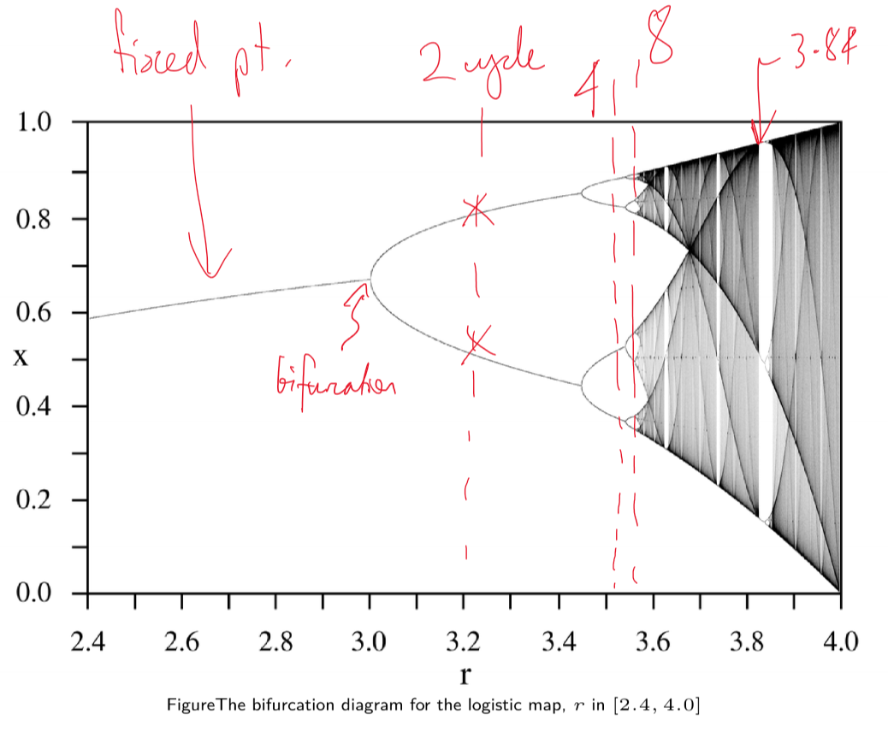

---
title: Complex Systems
notebook: Modelling Complex Software Systems
layout: note
date: 2021-06-03
tags: 
...

## Complex Systems 

### What is a system?

- set of things working together as parts of a mechanism/interconnecting network
- complex whole
- e.g. physiology: set of organs in body with common structure/function
- e.g. biology: human body as a whole
- e.g. automobile

### What makes a system complex?

- consider:
  - how many parts in the system?
  - are rules of parts simple or complicated?
  - is the behaviour of the system as a whole simple or complex?
- few parts, simple rules, simple behaviour: e.g. 2 body problem
  - solved analytically 
  - produces regular trajectories, predictable
  - complete understanding
- few parts, simple rules, complex behaviour: 
  - e.g. 3 body problem
    - solved numerically
    - chaotic trajectories
  - e.g. logistic equation: simple dynamical equation giving rise to broad range of complex emergent behaviours, including chaos
- many parts, simple rules, simple behaviour
  - e.g. crystals: highly ordered and regular
  - e.g. gases: highly disordered but statistically homogeneous
- many parts, simple rules, complex behaviour
  - e.g. flocking behaviour
  - e.g. cellular automata
  - e.g. complex networks
- many parts, complicated rules, complex behaviour
  - e.g. biological development, evolution, societies, markets
    - heterogeneous rules, specialisation, hierarchies
    - complex behaviour but reproducible and robust
    - e.g. termite colony producing a mound: local interactions with one another mediated by environment, no centralised leader
    - e.g. division of a fertilised cell -> increased specialisation -> organs -> full organism
    - e.g. brain, immune system
- many parts, complicated rules, deterministic behaviour
  - classical engineering: many specialised parts, globally designed to ensure predictable behaviour
  - behaviour is designed not emergent
- many parts, complicated rules, centralised behaviour
  - e.g. orchestra: global behaviour is emergent but not complex due to centralised controller

### What is a complex system?

- complex systems
  - made of a number of components
  - that interact
  - typically in a non-linear fashion
  - may arise from/evolve through self-organisation
  - neither completely regular nor completely random
  - permit development of emergent behaviour at macroscopic scale

### Properties

#### Emergence

- system has properties individual parts do not
- properties are not easily inferred/predicted
- different properties can emerge from the same parts depending on context/arrangement
- e.g. bird flock: global pattern of movement (flock shape) emerges, not apparent from observation of any individual bird

#### Self-organisation

- order increases without external intervention as a result of interactions between parts
- e.g. bird flock: global pattern: neither completely regular nor completely random but does show some order
  - order is not imposed externally, but results from simple set of rules applied by individuals based on local context

#### Decentralisation

- no single controller
- __distribution:__ each part carries a subset of global information
- __bounded knowledge:__ no part has full view of the whole
- __parallelism:__ parts can act simultaneously
- e.g. bird flock
  - bird at front is not leader
  - all birds act independently based on local cues
  - no bird is aware of whole flock
  - all birds are continuously updating their position

#### Feedback

- positive feedback: amplify fluctuations in system state
  - e.g. bubbles in cryptocurrency
  - decreases system stability
- negative feedback: damp fluctuations in system state
  - e.g. air-con thermostat
  - increases system stability

### What is a model?

- simplified description of a system/process
  - typically mathematical
  - assists calculations/predictions

### Why build models?

- examine system behaviour in a way infeasible in real world
  - too expensive
  - too time consuming
  - unethical
  - impossible
- allow us to understand a system by building it
  - analyse
  - predict
  - understand

### Mathematical models

#### Macro-Equations
- __macro equations:__ describe global state/behaviour of system, ignoring individual components
  - e.g. predator-prey system described with ODEs
- __analytical solution:__ closed form solution found via calculus of macro-equations
- __numerical solution:__ discretisation of time/space
  - as typically the case, no closed form solution exists
  - solve algorithmically to discover future trajectory
 
### Computational Models

#### No macro-equations

- cannot formulate global description of system: pressure, GDP, flock
- systems contain heterogeneity:
  - __differentiated__ parts
  - irregularly __located__ parts
  - parts connected in complex __network__
- systems are dynamically adaptive
  - interaction topology changes over time in response to environment

### Agent-based models (ABMs)

- arose in 1960s to model systems too complex for analytical descriptions
- system parts: agents with local state and rules
- system structure: pattern of local interaction between agents
- system behaviour: dynamic rules for updating agent state on basis of interactions

### Steps in modelling complex system

1. define key questions
2. identify structure - parts and interactions - of system
3. define possible states for each part
4. define how state of each part changes over time through interactions
5. verify, validate, evaluate model: simplicity, correctness, robustness
6. define, run experiments to address key questions

### Questions in complex system modelling

- how to explain current/past events?
  - disease outbreak
  - climate change
  - mass extinction
  - market crashes and bubbles
  - collapse of civilisation
- how to predict future behaviour?
  - motivates understanding of system
- how to design/build better engineered systems
  - nature inspired optimisation - ant colonies, particle swarms
  - decentralised computing, Internet
  - autonomous sensor networks

## Dynamical systems and Chaos

### Summary of Dynamic Behavious

- dynamic systems can exhibit different types of long term behaviour: e.g. __fixed points, limit cycles__
- fixed points/limit cycles can be:
  - __attractors:__ stable and attracting 
  - __unstable__ and repelling
- single system can exhibit multiple stable and unstable fixed points
- long term behaviour of systems with multiple stable fixed points is dependent on initial conditions
- __basin of attraction:__ set of initial conditions that approach an attractor 

### What is a dynamical system?

- __state space $\{x_i\}$:__ set of possible states
- time $t$: discrete/continuous
- __update rule:__ state at present time $x_t$ as function of earlier states
  - deterministic: history uniquely determines present state
  - non-deterministic: probabilistic/stochastic
- __initial condition $x_0$:__ state at $t = 0$

### Functions and iteration

- iteration: using output of previous function application as input for next function application
$$
x_0, x_1 = f(x_0), x_2 = f(f(x_0)), ...
$$

### Population growth

- apex predator: red foxes, not predated by other species
- prey: e.g. numbat, bilby

#### Fox population

- assumptions:
  - initial population: 2 female red foxes
  - female red fox reproduces in 1st year of life
  - female red fox reproduces once in its life
  - half of newborn kits are female
- number of female red foxes doubles each year: $x_{t+1} = 2x_t$
  - $x_t$ number of female red foxes alive in year $t$
- produces exponential growth: $x_t = x_0 2^t$
- more generally $x_t = x_0 r^t$, where $r$ governs steepness of curve
  - $r$: intrinsic rate of increase
  - e.g. $r = 1$: replacement fertility; stable population
  - e.g. $r < 1$: shrinking population
- __orbit/trajectory:__ sequence of states visited as dynamical system evolves over time

#### Model refinement: logistic model of population growth

- unlimited exponential growth unrealistic: red foxes will at some point run out of food/space
- extra assumptions:
  - few red foxes: plenty of food, rapid growth
  - many red foxes: not enough food, slower growth
- define population size $A$ at which foxes eat all available food, producing starvation and 0 foxes next year
  - $A$: carrying capacity
$$P_{t+1} = rP_t (1 - \frac{P_t}{A})$$
- P ~ A: fewer foxes next year; $(1-P_t/A) \approx 0$
- P ~ 0: more foxes next year; $(1-P_t/A) \approx 1$
- let $x = \frac{P}{A}$: __logistic map__
$$x_{t+1} = rx_t(1-x_t)$$

### Logistic Map

$$x_{t+1} = rx_t(1-x_t)$$
- $rx_t$: positive feedback
- $(1-x_t)$: negative feedback
- display range of behaviours depending on the value of $r$
- __fixed point:__ 
  - numerically: $x_{t+1} = x_t$

#### $r \in [0,1]$

- population dies out
- 0: fixed point, stable for $r\in[0,1]$

#### $r \in [1,3)$

- no longer attracted towards 0
- new stable fixed point: identify as intersection of parabola with identity line
- system moves towards stable fixed point whether $x_0$ less than/greater than it
- i.e. population has a stable value it likes to remain at
- fixed point at 0 still exists but is unstable: at locations near 0, system moves away from 0
- only if $x_0$ is exactly 0, the system will stay at 0 indefinitely

#### $r \ge 3$

- no stable fixed points
- @ $r = 3.2$: limit cycle with period 2; oscillation between 2 values
- @ $r = 3.52$: limit cycle with period 4
- @ $r = 3.56$: limit cycle with period 8
- __bifurcation:__ qualitative change in system's behaviour
  - e.g. transition from fixed point to limit-2 cycle
  - indicate points in parameter space where system behaviour changes dramatically
  - tipping point
- @ $r = 3.84$: initial transient, followed by limit cycle with period 3

#### $r = 4.0$: Chaotic attractor

- system behaviour appears all transient
- system displays aperiodic behaviour typical of deterministic chaos
- can be shown that time series never repeats

### Chaos

A system is __chaotic__ if it displays __all__ of the following properties

1. __deterministic__ update rule: not random; given same starting conditions, get same result
2. __aperiodic__ system behaviour: trajectory does not repeat
3. __bounded__ system behaviour: exponential never repeats but aperiodicity is not interesting; logistic map bounded between 0 and 1
4. __sensitivity__ to initial conditions: butterfly effect; wildly varying outputs with only small modification to inputs

### Bifurcation Diagrams

- for logistic map, sweep through parameter space of $r$
- output: series of values system converges to after initial transient

- bifurcation diagram of logistic map has __fractal/self-similar__ properties: i.e. if you zoom in you see the structure repeated

## Numerical solution of ODEs

### Euler method

for the system $y'(t) = f(t, y(t))$

- $f$: relationship between variables $y$ and their derivatives
- Euler forward difference approach: time-stepped simulation of behaviour

$$y_{n+1} = y_n + \Delta t .f(t_n, y_n)$$
$$t_{n+1} = t_n + \Delta t$$

- principle: take small step along tangent to that trajectory

- good accuracy requires small time intervals, becoming expensive
- use of slope at the midpoint, instead of start of the interval, increases accuracy
  - slower divergence from true solution
  - more calculations per iteration

### Runge-Kutta

- improved accuracy over Euler method by considering more points in interval $[t_n, t_n+1]$
- Runge-Kutta family, typically RK4, computes next value using 4 intermediate estimates of the slope

### Matlab

- Matlab uses adaptive time stepping, speeding up/slowing down to keep error within bounds
- see `ode45`

## ODE Models: Predator-Prey

### Lotka-Volterra Model

- motivation: multiple species in shared space
- lynx/hare historical record from fur hunting across 90 years, assumed to indicate underlying population
- populations are not stable, and not steadily increasing/decreasing
  - periodic oscillations over ~ decade
- interdependence between 2 populations
- how can we build models able to predict such relationships?
- formulated independently in 1925, 1926 by Lotka and Volterra, inspired by logistic equation

### Assumptions

- predators: foxes $F$
- prey: rabbits $R$
- rabbit population is sustainable (ample food)
- rabbit population grows proportional to its size in absence of foxes
- foxes only eat rabbits
- fox population declines proportional to its size in absence of rabbits
- environment is static, and has no effect on rates of population growth

### Building our model

- start with exponential model, with population $P$

$$P_{t+1} = rP_t$$

Decompose growth rate $r$ into birth rate $B$ and death rate $D$

$$P_{t+1} = (B-D)P_t = BP_t - DP_t$$

For rabbits, define 
- $\alpha$ as rabbit birth rate
- $\beta$ as rate at which foxes predate upon rabbits, such that death rate is $\beta F_t$

Then we have:

$$R_{t+1} = \alpha R_t - \beta R_t F_t$$

Similarly for the fox population, define:
- $\delta$: growth rate of fox population
- $\gamma$: decay rate of fox population due to death and migration

Then we have:

$$F_{t+1} = \delta R_t F_t - \gamma F_t$$

This was done for discrete time.  Converting to continuous time

### Formulation

Prey (rabbits):
$$
\frac{dR}{dt} = \alpha R - \beta RF
$$
Predators (foxes):
$$
\frac{dF}{dt} = \delta RF - \gamma F
$$
- NB expect $\beta > \delta$ as several rabbits would be eaten for an extra fox to be produced

### Behaviour

- $F = 0$: no foxes; rabbit population grows exponentially
- $R = 0$: no rabbits; fox population decays exponentially
- rate of predation and growth rate of predators both depend on interactions between 2 populations
- rate of rabbit depletion is distinct from rate of fox increases

### Numerical solution of Lotka-Volterra

- lag between peaks in predator and prey: rabbit population increases with low predation, which supports growth in fox population
- comparison to real world
  - smooth, continuous curves vs noisy historical curves
  - stable oscillations 

- trajectory (time series) plotting size of populations against each other
- trajectory runs counter-clockwise

### Analysis

#### Long term behaviour

- equilibria: $\frac{dR}{dt} = 0 = \frac{dF}{dt}$

$$R(\alpha-\beta F) = 0$$
$$F(\delta R - \gamma) = 0$$

- equlibria:
  - $R = 0, F = 0$: both populations are extinct
  - $R = \frac{\gamma}{\delta}, F = \frac{\alpha}{\beta}$: both populations sustained indefinitely

#### Dependence on initial conditions

- 1st equilibrium is unstable: can only arise if prey level is set to 0, at which point predators die out
  - saddle point: perturbation in $F$ causes system to return to saddle point.  perturbation in $R$ causes system to move to the right indefinitely: unchecked
    rabbit population growth.  perturbation along $F$ and $R$ together produces new limit cycle attractor
- 2nd equilibrium is neutrally stable, surrounded by infinitely many periodic orbits
- realistic?
  - amplitude of the orbit depends on initial conditions
  - real world: tends to have characteristic amplitude
  - we want a model with system behaviour stabilised to a single stable limit cycle: structurally stable
  - can also have fractional number of foxes/rabbits: number of foxes/rabbits is in reality discrete not continuous

### Lotka-Volterra with intraspecies competition

- no carrying capacity for prey species
- logistic equation captured intraspecific (within species) competition
- base Lotka-Volterra model captures interspecies (between species) competition
- add an additional term to LV model to account for competition among members of the same species

$$\frac{dR}{dt} = \alpha R - \beta RF - aR^2$$
$$\frac{dF}{dt} = \delta RF - \gamma F - bF^2$$

- converges to a stable population size
- perturbations will return to stable point
- this is a more realistic model of real world behaviour

- other model refinements have been suggested to capture observed phenomena

### Other considerations

- relationship between predator's consumption and density of prey
- efficiency with which extra food is transformed into extra predators: unlikely to be linear
- spatial distribution of species will also play a role

### Lotka-Volterra with multiple species

- $n$ species model

$$\frac{dx_i}{dt} = r_i x_i(1 - \frac{\sum_{j=1}^N{\alpha_{ij}x_j}}{K_i})$$

- $x_i$: population of species $i$
- $\alpha_{ij}$: matrix of interaction terms, the effect of species $j$ on species $i$
- $K_i$: carrying capacity of species $i$

- can also pull carrying capacities $K_i$ and interaction terms $\alpha_{ij}$ inside interaction matrix $A$

$$\frac{dx_i}{dt} = x_i(r_i + \sum_{j=1}^N A_{ij}(1-x_j))$$

- e.g. certain parameter values with 3 species will produce chaotic behaviour

### Lynxes and Hares

- few real predator-prey systems exhibit pure oscillations as Lotka-Volterra model
- Lynx and hare is one example, with stable 10-year cycle for a century

### Applicability of Lotka-Volterra

- 1960s, Goodwin: model of relationship between wages and employment in an economy, analogous to Lotka-Volterra
  - wages = predator
  - employment = prey
- high employment: employees bargain for higher wages, reducing profits
- as profits shrink, fewer workers employed, increasing profits
- with higher profit levels, employment increases
- cyclic behaviour

- common to find underlying patterns of behaviour in complex systems across multiple domains

## ODE Models: Epidemics

### Questions for models

- level of vaccination coverage needed to prevent spread
- allocation of scarce antiviral drugs 
- when do socially/economically disruptive interventions (e.g. lockdown) make sense?
- prevention of future outbreaks

### Infectious Disease Models

- dynamic model: how does infection spread through population over time
- state: which people are currently healthy/sick
- update rules: how do healthy people become sick
- parameters: calibrate to real world 

### SIR model

- proposed 100 years ago
- simple model, basis of infection disease modelling today
- sort people in to 3 categories based on their disease state
  - __susceptible:__ can be infected
  - __infectious:__ can infect others
  - __recovered:__ cannot be infected, nor infect others (they have immunity)
- considering a single person in the population, possible events are:
  - __Infection: infected + susceptible -> infected + infected:__ if they are susceptible and encounter an infectious person, they may be infected
  - __Recovery: infected -> recovered:__ if they are infectious, they may recover

### Implementation 1

- __state:__ population of N = 10 people, each with a state $\in {S, I, R}$ - i.e. vector of 10 elements
- __initial condition:__ day 0, 1 infectious, 9 susceptible
- __rules:__
  - assume everybody meets everybody else every day (small group)
  - infection: each encounter between infectious person and susceptible person has probability $q$ of becoming infectious the next day
  - recovery: infectious person recovers on the next day with probability $\gamma$
- __parameters:__
  - $q$: infection probability
  - $\gamma$: recovery probability

#### Probabilistic events  

- get random number $r \in [0,1]$
- event with probability $p$ can be determined to occur if $r < p$

#### Running the model

- each day
  - infection: check each susceptible person $X$
    - check each contact between $X$ and each infectious person $Y$
    - pick random number $r$
    - if $r < q$ then $X$ infected by $Y$
  - recovery: check each infectious person $Y$
    - pick random number $r$
    - if $r < \gamma$ then $Y$ recovers
  - stop if no more infectious people, otherwise continue

#### Turning the knobs

- what happens with very small $q$ and very high $\gamma$?
  - very low chance of infection, and very fast recovery
  - doesn't propagate through full population, no breakout
- what happens with very high $q$ and very low $\gamma$?
  - very high chance of infection, very low chance of recovery
  - transmission frequent, recovery rare
  - most of population gets infected quickly
- problems with this approach?
  - no birth/death, migration, or any other changes to population size
  - no reinfection (transmission after infection)

### How does contact scale with population size?

- typical assumption: if population increases in size, any individual still encounters roughly same number of people per day ($c$)

- $N$: size of population
- then the risk of infection on a given day becomes:

$$\lambda = (\text{\# contacts})(\text{prob. of transmission})(\text{prob. a contact is infectious}) = cq\frac{I}{N}$$

- define $\beta = \frac{cq}{N}$: the per capita rate of individuals coming into effective contact
  - effective contact: sufficient to allow disease transmission
- then:

$$\lambda = \beta I$$

### Implementation 2

- __state:__ triple of number of people with each disease state $(S, I, R)$
  - $S + I + R = N$
- __initial condition:__ day 0, 1 infectious, 9 susceptible
  - $t = 0: (S=9, I=1, R=0)$
- __rules:__ each time step
  - infection: probability of a susceptible person becoming infected is $\lambda = \beta I$
  - recovery: probability of an infectious person recovering is $\gamma$
- __parameters:__
  - $\beta$: per capita rate of individuals coming into effective contact
  - $\gamma$: recovery probability

#### Sampling from a distribution

- consider 2 susceptible people at risk of infection, with probabilty $\lambda$
- 3 possible outcomes: 
  - neither infected, probability $(1-\lambda)(1-\lambda)$
  - one infected, probability $2\lambda(1-\lambda)$ (NB 2 because 2 outcomes $(I,S),(S,I)$)
  - 2 infected, probability $\lambda^2$
- now we use single random number to determine how many infections occurred
- consider below, probability distribution for 2 susceptible people, with $\lambda = 0.2$

- case where random number $r$:
  - $r <= 0.64$: neither infected
  - $0.64 < r <= 0.96$: one person infected
  - $r > 0.96$: both people infected

#### Running the model

- for each time interval
  - infection:
    - calculate probability $\lambda = \beta I$ a susceptible person is infected
    - calculate distribution of number of susceptible people who will be infected during the current day
    - sample from this distribution to determine how many susceptible people will be infectious on the next day
  - recovery:
    - calculate distribution of number of infectious people who will recover during current day
    - sample from this distribution to determine how many infectious people will be recovered on the next day
  - if number of infectious people is 0, stop

#### Comparison to implementation 1

- no longer keep track of every single person (reduced space), no longer need to simulate every single contact event (reduced algorithmic complexity)
- much faster to run models with large populations

#### Large population outbreak

#### Stochastic Models

- __stochastic model:__ incorporates effects of chance
  - non-deterministic: state does not fully determine the next state
  - each time you run the model, you get a different outcome: 
    - sometimes an outbreak, sometimes no outbreak
    - some outbreaks large, others small
  - can get inconsistent behaviour
  - need to estimate __most likely sequence of future events__
- use a __histogram__ to show distribution of proabilities that each outcome will eventuate
- properties of interest
  - final size of outbreak: impact on population
  - size of outbreak at peak: hospital capacity
  - time outbreak peaks: plan/preparation

#### Basic reproduction number 

- __reproduction number $R$:__ average number of secondary cases infected by a typical primary case
- __basic reproduction number $R_0$:__ average number of secondary cases infected by a typical primary case in a __totally susceptible__ population
- reproduction number tells us whether an outbreak can occur:
  - $R<1$: outbreak dies out
  - $R>1$: outbreak takes off

#### Behaviour when $R_0$ near 1

- even with many susceptible people to infect, disease with $R_0 = 1$ struggles to persist
- outbreaks can fade out even when initial number of infectious people is relatively large
  - e.g. H5N1 can spread from birds to humans but is not usually human transmissible; $R_0$ very low

#### Stochastic models

- as population size increases, influence of chance diminishes
  - behaviour of system becomes more regular and predictable
- perhaps stochasticity can be ignored altogether if population is large enough
- when does stochasticity matter?
  - we cannot abandon stochasticity completely: it still matters when number of infected people is small

### Implementation 3: Deterministic SIR

#### Deterministic models

- stochastic models: generate distributions of potential outcomes
- deterministic models: generate unique outcome based on given set of parameters + initial condition
  - for each state of a deterministic model, there is only one possible future state
- if we ignore variability in potential epidemic outcomes, can efficiently model average system behaviour 

#### Deterministic SIR

- __state:__ triple of number of susceptible, infectious and recovered at time $t$: $(S_t, I_t, R_t)$
- __rules:__ mathematical function specifies update
  - by convention, let $\delta t = 1$ and set units accordingly (e.g. 1 day, 1 week)
  - difference equations
$$S_{t+1} = S_t - \lambda S_t = S_t - \beta S_t I_t$$
$$I_{t+1} = I_t + \beta S_t I_t - \gamma I_t$$
$$R_{t+1} = R_t + \gamma I_t$$

- __parameters:__ 
  - $\beta$: rate of effective contact per capita
  - $\gamma$: rate of recovery

#### Recovery rate and duration of infection

- $D = \gamma^{-1}$: average time someone is infectious
  - if rate of recovery is 0.25 days, expect an infected person to experience recovery every four days

#### Running Det SIR

- very easy to setup in Matlab, spreadsheet, R, etc.
- each time we run the model we get exactly the same result (cf. stochastic model)

#### Differential equations

- ODE representation, continuous time

$$\frac{dS}{dt} = - \beta SI$$
$$\frac{dI}{dt} = \beta SI - \gamma I$$
$$\frac{dR}{dt} = \gamma I$$

- permits you to find analytical properties/solutions
- common to describe proportions of population in each bin: $S + I  + R = 1$

#### Basic reproduction number and outbreak size

- estimate of $R_0$ lets us estimate proportion of population that will have been infected at end of outbreak
  - final attack rate
  - Covid-19: mean value 3.28

#### Examples

- almost everyone infected

- lower peak than measles

- longer recovery

- less transmissible

#### Fitting SIR to data

- can tune parameters to calibrate to historical data

#### Vaccination

- equivalent to moving people from $S$ to $R$
- prevent people from becoming infected
- fraction $v$ of population that need to be vaccinated in order to prevent an outbreak from occurring

$$ v \ge 1 - \frac{1}{R_0}$$

#### Extensions: Demography

- assumption of fixed population size/composition
  - okay for single outbreak (e.g. flu in one winter)
  - not appropriate for long term behaviour over years/decades, as death/birth leads to most of population being replaced

$$\frac{dS}{dt} = mN - \beta SI - mS$$
$$\frac{dI}{dt} = \beta SI - \gamma I - mI$$
$$\frac{dR}{dt} = \gamma I - mR$$

- people are born susceptible at a rate $m$
- people die at same rate irrespective of disease state
- size of population is constant over time

- approaches steady fixed point (above 0 infectious) i.e. becomes endemic

#### Extensions: Demography + Vaccination

### SIR Summary

- assumptions
  - homogeneous population
  - homogeneous mixing: everyone has same chance of contact
- stochastic models
  - more computation, better suited to small populations
  - provide info on distribution of outcomes
- deterministic models
  - more efficient, allow you to explore more parameters
  - analytical results provide more general insights
  - only applicable under certain conditions: larger population, larger number of infectious people

