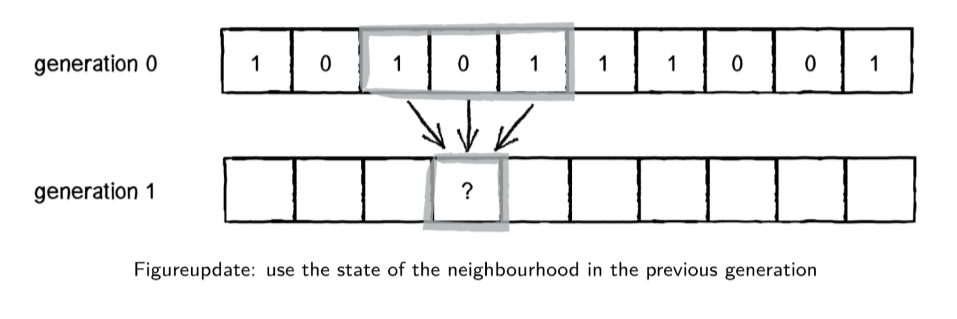

---
title: Complex Systems
notebook: Modelling Complex Software Systems
layout: note
date: 2021-06-03
tags: 
...

## Complex Systems 

### What is a system?

- set of things working together as parts of a mechanism/interconnecting network
- complex whole
- e.g. physiology: set of organs in body with common structure/function
- e.g. biology: human body as a whole
- e.g. automobile

### What makes a system complex?

- consider:
  - how many parts in the system?
  - are rules of parts simple or complicated?
  - is the behaviour of the system as a whole simple or complex?
- few parts, simple rules, simple behaviour: e.g. 2 body problem
  - solved analytically 
  - produces regular trajectories, predictable
  - complete understanding
- few parts, simple rules, complex behaviour: 
  - e.g. 3 body problem
    - solved numerically
    - chaotic trajectories
  - e.g. logistic equation: simple dynamical equation giving rise to broad range of complex emergent behaviours, including chaos
- many parts, simple rules, simple behaviour
  - e.g. crystals: highly ordered and regular
  - e.g. gases: highly disordered but statistically homogeneous
- many parts, simple rules, complex behaviour
  - e.g. flocking behaviour
  - e.g. cellular automata
  - e.g. complex networks
- many parts, complicated rules, complex behaviour
  - e.g. biological development, evolution, societies, markets
    - heterogeneous rules, specialisation, hierarchies
    - complex behaviour but reproducible and robust
    - e.g. termite colony producing a mound: local interactions with one another mediated by environment, no centralised leader
    - e.g. division of a fertilised cell -> increased specialisation -> organs -> full organism
    - e.g. brain, immune system
- many parts, complicated rules, deterministic behaviour
  - classical engineering: many specialised parts, globally designed to ensure predictable behaviour
  - behaviour is designed not emergent
- many parts, complicated rules, centralised behaviour
  - e.g. orchestra: global behaviour is emergent but not complex due to centralised controller

### What is a complex system?

- complex systems
  - made of a number of components
  - that interact
  - typically in a non-linear fashion
  - may arise from/evolve through self-organisation
  - neither completely regular nor completely random
  - permit development of emergent behaviour at macroscopic scale

### Properties

#### Emergence

- system has properties individual parts do not
- properties are not easily inferred/predicted
- different properties can emerge from the same parts depending on context/arrangement
- e.g. bird flock: global pattern of movement (flock shape) emerges, not apparent from observation of any individual bird

#### Self-organisation

- order increases without external intervention as a result of interactions between parts
- e.g. bird flock: global pattern: neither completely regular nor completely random but does show some order
  - order is not imposed externally, but results from simple set of rules applied by individuals based on local context

#### Decentralisation

- no single controller
- __distribution:__ each part carries a subset of global information
- __bounded knowledge:__ no part has full view of the whole
- __parallelism:__ parts can act simultaneously
- e.g. bird flock
  - bird at front is not leader
  - all birds act independently based on local cues
  - no bird is aware of whole flock
  - all birds are continuously updating their position

#### Feedback

- positive feedback: amplify fluctuations in system state
  - e.g. bubbles in cryptocurrency
  - decreases system stability
- negative feedback: damp fluctuations in system state
  - e.g. air-con thermostat
  - increases system stability

### What is a model?

- simplified description of a system/process
  - typically mathematical
  - assists calculations/predictions

### Why build models?

- examine system behaviour in a way infeasible in real world
  - too expensive
  - too time consuming
  - unethical
  - impossible
- allow us to understand a system by building it
  - analyse
  - predict
  - understand

### Mathematical models

#### Macro-Equations
- __macro equations:__ describe global state/behaviour of system, ignoring individual components
  - e.g. predator-prey system described with ODEs
- __analytical solution:__ closed form solution found via calculus of macro-equations
- __numerical solution:__ discretisation of time/space
  - as typically the case, no closed form solution exists
  - solve algorithmically to discover future trajectory
 
### Computational Models

#### No macro-equations

- cannot formulate global description of system: pressure, GDP, flock
- systems contain heterogeneity:
  - __differentiated__ parts
  - irregularly __located__ parts
  - parts connected in complex __network__
- systems are dynamically adaptive
  - interaction topology changes over time in response to environment

### Agent-based models (ABMs)

- arose in 1960s to model systems too complex for analytical descriptions
- system parts: agents with local state and rules
- system structure: pattern of local interaction between agents
- system behaviour: dynamic rules for updating agent state on basis of interactions

### Steps in modelling complex system

1. define key questions
2. identify structure - parts and interactions - of system
3. define possible states for each part
4. define how state of each part changes over time through interactions
5. verify, validate, evaluate model: simplicity, correctness, robustness
6. define, run experiments to address key questions

### Questions in complex system modelling

- how to explain current/past events?
  - disease outbreak
  - climate change
  - mass extinction
  - market crashes and bubbles
  - collapse of civilisation
- how to predict future behaviour?
  - motivates understanding of system
- how to design/build better engineered systems
  - nature inspired optimisation - ant colonies, particle swarms
  - decentralised computing, Internet
  - autonomous sensor networks

## Dynamical systems and Chaos

### Summary of Dynamic Behavious

- dynamic systems can exhibit different types of long term behaviour: e.g. __fixed points, limit cycles__
- fixed points/limit cycles can be:
  - __attractors:__ stable and attracting 
  - __unstable__ and repelling
- single system can exhibit multiple stable and unstable fixed points
- long term behaviour of systems with multiple stable fixed points is dependent on initial conditions
- __basin of attraction:__ set of initial conditions that approach an attractor 

### What is a dynamical system?

- __state space $\{x_i\}$:__ set of possible states
- time $t$: discrete/continuous
- __update rule:__ state at present time $x_t$ as function of earlier states
  - deterministic: history uniquely determines present state
  - non-deterministic: probabilistic/stochastic
- __initial condition $x_0$:__ state at $t = 0$

### Functions and iteration

- iteration: using output of previous function application as input for next function application
$$
x_0, x_1 = f(x_0), x_2 = f(f(x_0)), ...
$$

### Population growth

- apex predator: red foxes, not predated by other species
- prey: e.g. numbat, bilby

#### Fox population

- assumptions:
  - initial population: 2 female red foxes
  - female red fox reproduces in 1st year of life
  - female red fox reproduces once in its life
  - half of newborn kits are female
- number of female red foxes doubles each year: $x_{t+1} = 2x_t$
  - $x_t$ number of female red foxes alive in year $t$
- produces exponential growth: $x_t = x_0 2^t$
- more generally $x_t = x_0 r^t$, where $r$ governs steepness of curve
  - $r$: intrinsic rate of increase
  - e.g. $r = 1$: replacement fertility; stable population
  - e.g. $r < 1$: shrinking population
- __orbit/trajectory:__ sequence of states visited as dynamical system evolves over time

#### Model refinement: logistic model of population growth

- unlimited exponential growth unrealistic: red foxes will at some point run out of food/space
- extra assumptions:
  - few red foxes: plenty of food, rapid growth
  - many red foxes: not enough food, slower growth
- define population size $A$ at which foxes eat all available food, producing starvation and 0 foxes next year
  - $A$: carrying capacity
$$P_{t+1} = rP_t (1 - \frac{P_t}{A})$$
- P ~ A: fewer foxes next year; $(1-P_t/A) \approx 0$
- P ~ 0: more foxes next year; $(1-P_t/A) \approx 1$
- let $x = \frac{P}{A}$: __logistic map__
$$x_{t+1} = rx_t(1-x_t)$$

### Logistic Map

$$x_{t+1} = rx_t(1-x_t)$$
- $rx_t$: positive feedback
- $(1-x_t)$: negative feedback
- display range of behaviours depending on the value of $r$
- __fixed point:__ 
  - numerically: $x_{t+1} = x_t$

#### $r \in [0,1]$

- population dies out
- 0: fixed point, stable for $r\in[0,1]$

#### $r \in [1,3)$

- no longer attracted towards 0
- new stable fixed point: identify as intersection of parabola with identity line
- system moves towards stable fixed point whether $x_0$ less than/greater than it
- i.e. population has a stable value it likes to remain at
- fixed point at 0 still exists but is unstable: at locations near 0, system moves away from 0
- only if $x_0$ is exactly 0, the system will stay at 0 indefinitely

#### $r \ge 3$

- no stable fixed points
- @ $r = 3.2$: limit cycle with period 2; oscillation between 2 values
- @ $r = 3.52$: limit cycle with period 4
- @ $r = 3.56$: limit cycle with period 8
- __bifurcation:__ qualitative change in system's behaviour
  - e.g. transition from fixed point to limit-2 cycle
  - indicate points in parameter space where system behaviour changes dramatically
  - tipping point
- @ $r = 3.84$: initial transient, followed by limit cycle with period 3

#### $r = 4.0$: Chaotic attractor

- system behaviour appears all transient
- system displays aperiodic behaviour typical of deterministic chaos
- can be shown that time series never repeats

### Chaos

A system is __chaotic__ if it displays __all__ of the following properties

1. __deterministic__ update rule: not random; given same starting conditions, get same result
2. __aperiodic__ system behaviour: trajectory does not repeat
3. __bounded__ system behaviour: exponential never repeats but aperiodicity is not interesting; logistic map bounded between 0 and 1
4. __sensitivity__ to initial conditions: butterfly effect; wildly varying outputs with only small modification to inputs

### Bifurcation Diagrams

- for logistic map, sweep through parameter space of $r$
- output: series of values system converges to after initial transient

- bifurcation diagram of logistic map has __fractal/self-similar__ properties: i.e. if you zoom in you see the structure repeated

## Numerical solution of ODEs

### Euler method

for the system $y'(t) = f(t, y(t))$

- $f$: relationship between variables $y$ and their derivatives
- Euler forward difference approach: time-stepped simulation of behaviour

$$y_{n+1} = y_n + \Delta t .f(t_n, y_n)$$
$$t_{n+1} = t_n + \Delta t$$

- principle: take small step along tangent to that trajectory

- good accuracy requires small time intervals, becoming expensive
- use of slope at the midpoint, instead of start of the interval, increases accuracy
  - slower divergence from true solution
  - more calculations per iteration

### Runge-Kutta

- improved accuracy over Euler method by considering more points in interval $[t_n, t_n+1]$
- Runge-Kutta family, typically RK4, computes next value using 4 intermediate estimates of the slope

### Matlab

- Matlab uses adaptive time stepping, speeding up/slowing down to keep error within bounds
- see `ode45`

## ODE Models: Predator-Prey

### Lotka-Volterra Model

- motivation: multiple species in shared space
- lynx/hare historical record from fur hunting across 90 years, assumed to indicate underlying population
- populations are not stable, and not steadily increasing/decreasing
  - periodic oscillations over ~ decade
- interdependence between 2 populations
- how can we build models able to predict such relationships?
- formulated independently in 1925, 1926 by Lotka and Volterra, inspired by logistic equation

### Assumptions

- predators: foxes $F$
- prey: rabbits $R$
- rabbit population is sustainable (ample food)
- rabbit population grows proportional to its size in absence of foxes
- foxes only eat rabbits
- fox population declines proportional to its size in absence of rabbits
- environment is static, and has no effect on rates of population growth

### Building our model

- start with exponential model, with population $P$

$$P_{t+1} = rP_t$$

Decompose growth rate $r$ into birth rate $B$ and death rate $D$

$$P_{t+1} = (B-D)P_t = BP_t - DP_t$$

For rabbits, define 
- $\alpha$ as rabbit birth rate
- $\beta$ as rate at which foxes predate upon rabbits, such that death rate is $\beta F_t$

Then we have:

$$R_{t+1} = \alpha R_t - \beta R_t F_t$$

Similarly for the fox population, define:
- $\delta$: growth rate of fox population
- $\gamma$: decay rate of fox population due to death and migration

Then we have:

$$F_{t+1} = \delta R_t F_t - \gamma F_t$$

This was done for discrete time.  Converting to continuous time

### Formulation

Prey (rabbits):
$$
\frac{dR}{dt} = \alpha R - \beta RF
$$
Predators (foxes):
$$
\frac{dF}{dt} = \delta RF - \gamma F
$$
- NB expect $\beta > \delta$ as several rabbits would be eaten for an extra fox to be produced

### Behaviour

- $F = 0$: no foxes; rabbit population grows exponentially
- $R = 0$: no rabbits; fox population decays exponentially
- rate of predation and growth rate of predators both depend on interactions between 2 populations
- rate of rabbit depletion is distinct from rate of fox increases

### Numerical solution of Lotka-Volterra

- lag between peaks in predator and prey: rabbit population increases with low predation, which supports growth in fox population
- comparison to real world
  - smooth, continuous curves vs noisy historical curves
  - stable oscillations 

- trajectory (time series) plotting size of populations against each other
- trajectory runs counter-clockwise

### Analysis

#### Long term behaviour

- equilibria: $\frac{dR}{dt} = 0 = \frac{dF}{dt}$

$$R(\alpha-\beta F) = 0$$
$$F(\delta R - \gamma) = 0$$

- equlibria:
  - $R = 0, F = 0$: both populations are extinct
  - $R = \frac{\gamma}{\delta}, F = \frac{\alpha}{\beta}$: both populations sustained indefinitely

#### Dependence on initial conditions

- 1st equilibrium is unstable: can only arise if prey level is set to 0, at which point predators die out
  - saddle point: perturbation in $F$ causes system to return to saddle point.  perturbation in $R$ causes system to move to the right indefinitely: unchecked
    rabbit population growth.  perturbation along $F$ and $R$ together produces new limit cycle attractor
- 2nd equilibrium is neutrally stable, surrounded by infinitely many periodic orbits
- realistic?
  - amplitude of the orbit depends on initial conditions
  - real world: tends to have characteristic amplitude
  - we want a model with system behaviour stabilised to a single stable limit cycle: structurally stable
  - can also have fractional number of foxes/rabbits: number of foxes/rabbits is in reality discrete not continuous

### Lotka-Volterra with intraspecies competition

- no carrying capacity for prey species
- logistic equation captured intraspecific (within species) competition
- base Lotka-Volterra model captures interspecies (between species) competition
- add an additional term to LV model to account for competition among members of the same species

$$\frac{dR}{dt} = \alpha R - \beta RF - aR^2$$
$$\frac{dF}{dt} = \delta RF - \gamma F - bF^2$$

- converges to a stable population size
- perturbations will return to stable point
- this is a more realistic model of real world behaviour

- other model refinements have been suggested to capture observed phenomena

### Other considerations

- relationship between predator's consumption and density of prey
- efficiency with which extra food is transformed into extra predators: unlikely to be linear
- spatial distribution of species will also play a role

### Lotka-Volterra with multiple species

- $n$ species model

$$\frac{dx_i}{dt} = r_i x_i(1 - \frac{\sum_{j=1}^N{\alpha_{ij}x_j}}{K_i})$$

- $x_i$: population of species $i$
- $\alpha_{ij}$: matrix of interaction terms, the effect of species $j$ on species $i$
- $K_i$: carrying capacity of species $i$

- can also pull carrying capacities $K_i$ and interaction terms $\alpha_{ij}$ inside interaction matrix $A$

$$\frac{dx_i}{dt} = x_i(r_i + \sum_{j=1}^N A_{ij}(1-x_j))$$

- e.g. certain parameter values with 3 species will produce chaotic behaviour

### Lynxes and Hares

- few real predator-prey systems exhibit pure oscillations as Lotka-Volterra model
- Lynx and hare is one example, with stable 10-year cycle for a century

### Applicability of Lotka-Volterra

- 1960s, Goodwin: model of relationship between wages and employment in an economy, analogous to Lotka-Volterra
  - wages = predator
  - employment = prey
- high employment: employees bargain for higher wages, reducing profits
- as profits shrink, fewer workers employed, increasing profits
- with higher profit levels, employment increases
- cyclic behaviour

- common to find underlying patterns of behaviour in complex systems across multiple domains

## ODE Models: Epidemics

### Questions for models

- level of vaccination coverage needed to prevent spread
- allocation of scarce antiviral drugs 
- when do socially/economically disruptive interventions (e.g. lockdown) make sense?
- prevention of future outbreaks

### Infectious Disease Models

- dynamic model: how does infection spread through population over time
- state: which people are currently healthy/sick
- update rules: how do healthy people become sick
- parameters: calibrate to real world 

### SIR model

- proposed 100 years ago
- simple model, basis of infection disease modelling today
- sort people in to 3 categories based on their disease state
  - __susceptible:__ can be infected
  - __infectious:__ can infect others
  - __recovered:__ cannot be infected, nor infect others (they have immunity)
- considering a single person in the population, possible events are:
  - __Infection: infected + susceptible -> infected + infected:__ if they are susceptible and encounter an infectious person, they may be infected
  - __Recovery: infected -> recovered:__ if they are infectious, they may recover

### Implementation 1

- __state:__ population of N = 10 people, each with a state $\in {S, I, R}$ - i.e. vector of 10 elements
- __initial condition:__ day 0, 1 infectious, 9 susceptible
- __rules:__
  - assume everybody meets everybody else every day (small group)
  - infection: each encounter between infectious person and susceptible person has probability $q$ of becoming infectious the next day
  - recovery: infectious person recovers on the next day with probability $\gamma$
- __parameters:__
  - $q$: infection probability
  - $\gamma$: recovery probability

#### Probabilistic events  

- get random number $r \in [0,1]$
- event with probability $p$ can be determined to occur if $r < p$

#### Running the model

- each day
  - infection: check each susceptible person $X$
    - check each contact between $X$ and each infectious person $Y$
    - pick random number $r$
    - if $r < q$ then $X$ infected by $Y$
  - recovery: check each infectious person $Y$
    - pick random number $r$
    - if $r < \gamma$ then $Y$ recovers
  - stop if no more infectious people, otherwise continue

#### Turning the knobs

- what happens with very small $q$ and very high $\gamma$?
  - very low chance of infection, and very fast recovery
  - doesn't propagate through full population, no breakout
- what happens with very high $q$ and very low $\gamma$?
  - very high chance of infection, very low chance of recovery
  - transmission frequent, recovery rare
  - most of population gets infected quickly
- problems with this approach?
  - no birth/death, migration, or any other changes to population size
  - no reinfection (transmission after infection)

### How does contact scale with population size?

- typical assumption: if population increases in size, any individual still encounters roughly same number of people per day ($c$)

- $N$: size of population
- then the risk of infection on a given day becomes:

$$\lambda = (\text{\# contacts})(\text{prob. of transmission})(\text{prob. a contact is infectious}) = cq\frac{I}{N}$$

- define $\beta = \frac{cq}{N}$: the per capita rate of individuals coming into effective contact
  - effective contact: sufficient to allow disease transmission
- then:

$$\lambda = \beta I$$

### Implementation 2

- __state:__ triple of number of people with each disease state $(S, I, R)$
  - $S + I + R = N$
- __initial condition:__ day 0, 1 infectious, 9 susceptible
  - $t = 0: (S=9, I=1, R=0)$
- __rules:__ each time step
  - infection: probability of a susceptible person becoming infected is $\lambda = \beta I$
  - recovery: probability of an infectious person recovering is $\gamma$
- __parameters:__
  - $\beta$: per capita rate of individuals coming into effective contact
  - $\gamma$: recovery probability

#### Sampling from a distribution

- consider 2 susceptible people at risk of infection, with probabilty $\lambda$
- 3 possible outcomes: 
  - neither infected, probability $(1-\lambda)(1-\lambda)$
  - one infected, probability $2\lambda(1-\lambda)$ (NB 2 because 2 outcomes $(I,S),(S,I)$)
  - 2 infected, probability $\lambda^2$
- now we use single random number to determine how many infections occurred
- consider below, probability distribution for 2 susceptible people, with $\lambda = 0.2$

- case where random number $r$:
  - $r <= 0.64$: neither infected
  - $0.64 < r <= 0.96$: one person infected
  - $r > 0.96$: both people infected

#### Running the model

- for each time interval
  - infection:
    - calculate probability $\lambda = \beta I$ a susceptible person is infected
    - calculate distribution of number of susceptible people who will be infected during the current day
    - sample from this distribution to determine how many susceptible people will be infectious on the next day
  - recovery:
    - calculate distribution of number of infectious people who will recover during current day
    - sample from this distribution to determine how many infectious people will be recovered on the next day
  - if number of infectious people is 0, stop

#### Comparison to implementation 1

- no longer keep track of every single person (reduced space), no longer need to simulate every single contact event (reduced algorithmic complexity)
- much faster to run models with large populations

#### Large population outbreak

#### Stochastic Models

- __stochastic model:__ incorporates effects of chance
  - non-deterministic: state does not fully determine the next state
  - each time you run the model, you get a different outcome: 
    - sometimes an outbreak, sometimes no outbreak
    - some outbreaks large, others small
  - can get inconsistent behaviour
  - need to estimate __most likely sequence of future events__
- use a __histogram__ to show distribution of proabilities that each outcome will eventuate
- properties of interest
  - final size of outbreak: impact on population
  - size of outbreak at peak: hospital capacity
  - time outbreak peaks: plan/preparation

#### Basic reproduction number 

- __reproduction number $R$:__ average number of secondary cases infected by a typical primary case
- __basic reproduction number $R_0$:__ average number of secondary cases infected by a typical primary case in a __totally susceptible__ population
- reproduction number tells us whether an outbreak can occur:
  - $R<1$: outbreak dies out
  - $R>1$: outbreak takes off

#### Behaviour when $R_0$ near 1

- even with many susceptible people to infect, disease with $R_0 = 1$ struggles to persist
- outbreaks can fade out even when initial number of infectious people is relatively large
  - e.g. H5N1 can spread from birds to humans but is not usually human transmissible; $R_0$ very low

#### Stochastic models

- as population size increases, influence of chance diminishes
  - behaviour of system becomes more regular and predictable
- perhaps stochasticity can be ignored altogether if population is large enough
- when does stochasticity matter?
  - we cannot abandon stochasticity completely: it still matters when number of infected people is small

### Implementation 3: Deterministic SIR

#### Deterministic models

- stochastic models: generate distributions of potential outcomes
- deterministic models: generate unique outcome based on given set of parameters + initial condition
  - for each state of a deterministic model, there is only one possible future state
- if we ignore variability in potential epidemic outcomes, can efficiently model average system behaviour 

#### Deterministic SIR

- __state:__ triple of number of susceptible, infectious and recovered at time $t$: $(S_t, I_t, R_t)$
- __rules:__ mathematical function specifies update
  - by convention, let $\delta t = 1$ and set units accordingly (e.g. 1 day, 1 week)
  - difference equations
$$S_{t+1} = S_t - \lambda S_t = S_t - \beta S_t I_t$$
$$I_{t+1} = I_t + \beta S_t I_t - \gamma I_t$$
$$R_{t+1} = R_t + \gamma I_t$$

- __parameters:__ 
  - $\beta$: rate of effective contact per capita
  - $\gamma$: rate of recovery

#### Recovery rate and duration of infection

- $D = \gamma^{-1}$: average time someone is infectious
  - if rate of recovery is 0.25 days, expect an infected person to experience recovery every four days

#### Running Det SIR

- very easy to setup in Matlab, spreadsheet, R, etc.
- each time we run the model we get exactly the same result (cf. stochastic model)

#### Differential equations

- ODE representation, continuous time

$$\frac{dS}{dt} = - \beta SI$$
$$\frac{dI}{dt} = \beta SI - \gamma I$$
$$\frac{dR}{dt} = \gamma I$$

- permits you to find analytical properties/solutions
- common to describe proportions of population in each bin: $S + I  + R = 1$

#### Basic reproduction number and outbreak size

- estimate of $R_0$ lets us estimate proportion of population that will have been infected at end of outbreak
  - final attack rate
  - Covid-19: mean value 3.28

#### Examples

- almost everyone infected

- lower peak than measles

- longer recovery

- less transmissible

#### Fitting SIR to data

- can tune parameters to calibrate to historical data

#### Vaccination

- equivalent to moving people from $S$ to $R$
- prevent people from becoming infected
- fraction $v$ of population that need to be vaccinated in order to prevent an outbreak from occurring

$$ v \ge 1 - \frac{1}{R_0}$$

#### Extensions: Demography

- assumption of fixed population size/composition
  - okay for single outbreak (e.g. flu in one winter)
  - not appropriate for long term behaviour over years/decades, as death/birth leads to most of population being replaced

$$\frac{dS}{dt} = mN - \beta SI - mS$$
$$\frac{dI}{dt} = \beta SI - \gamma I - mI$$
$$\frac{dR}{dt} = \gamma I - mR$$

- people are born susceptible at a rate $m$
- people die at same rate irrespective of disease state
- size of population is constant over time

- approaches steady fixed point (above 0 infectious) i.e. becomes endemic

#### Extensions: Demography + Vaccination

### SIR Summary

- assumptions
  - homogeneous population
  - homogeneous mixing: everyone has same chance of contact
- stochastic models
  - more computation, better suited to small populations
  - provide info on distribution of outcomes
- deterministic models
  - more efficient, allow you to explore more parameters
  - analytical results provide more general insights
  - only applicable under certain conditions: larger population, larger number of infectious people

## Cellular Automata

### Mathematical, top down models

- complex systems are systems whose behaviour emerges from interactions between many individual parts
  - Lotka-Volterra: 
    - parts = animals (predator/prey)
    - interactions: predation
  - SIR model:
    - parts = people
    - interaction = disease transmission
- ODE approach: represent state w.r.t. global/macro variables, and define update rules w.r.t. change of global variables over time
  - top-down approach
  - LV
    - variables: size of predator/prey population
    - update: rates of birth, death, predation
  - SIR:
    - variables: proportion of population in S/I/R
    - update: rates of infection, recovery
- ODE approach makes assumptions: treat all individuals as identical, with equal chance of interaction
  - ignore heterogeneity of individuals and interactions
  - these assumptions were limitations of models
  - LV:
    - some predator/prey may be weaker/stronger
    - some preadtor/prey may be faster/slower
    - predator/prey populations might be not be uniformly spatially distributed 
  - SIR model
    - different age groups may be more susceptible/infectious
    - non-uniform spatial distribution - e.g. cluster of unvaccinated people
- ODE models could be extended to reflect heterogeneity, but number of equations would increase dramatically
 
### Computational models

- bottom up approach, represent microstate
- reflect heterogeneity in populations
- approaches
  - cellular automata models
  - agent based models
  - network models

### Spatial Model

- e.g. SIR model with each person occupying a fixed location on a 2D grid
- consider
  - data structure: 2D array
  - state representation: value of S, I, R for each cell of 2D array
  - who interacts with whom: immediate neighbourhood
    - those further away have lower probability of being infected
  - update rules

### Cellular Automata

- CAs are a type of discrete dynamical system exhibiting complex behaviour resulting from simple, local rules
  - 1940s: von Neumann and Stanislav Ulam
- __automaton:__ theoretical machine that updates internal state based on 
  - external inputs
  - its own previous state
- __cellular automaton:__ array of automata (cells) where inputs to one cell are current states of nearby cells

### Properties

- time: discrete
- space: discrete (e.g. 1D, 2D, ...)
- system state: discrete, in finite set of states
  - entire system therefore has finite, countable number of states
- update rules: defined w.r.t. local interactions between components
  - no global function describing state

### Applications

- simulation of physical systems
  - particle methods in fluid dynamics
  - earthquakes
  - bushfires
- simulation of biological/social systems
  - artificial life: self replication
  - pattern formation e.g. on seashells, chemical signal interactions
  - social simulation: e.g. wealth distribution
- computing
  - theory: CAs with universal computing properties
  - graphics/image processing: texture simulation, surface effects
  - games: emergent game play

### Formal definition

- a finite automata consists of a finite set of cell states $\Sigma$
- finite input alphabet $\alpha$
- transition function $\Delta : \Sigma^N \rightarrow N$ mapping from set of neighbourhood states to set of cell states
- state of a neighbourhood is a function of states of the automata covered by the neighbourhood template
- input alphabet $\alpha$ for each automaton consists of set of possible neighbourhood states
- $K :=|\Sigma|$ is the number of cell states
- $|\alpha| = |\Delta| = |\Sigma^N| = K^N$ is number of possible neighbourhood states
- as there are $K$ choices of state to assign as the next state for each of $\alpha$ neighbour states, there are $K^{K^N}$ possible transition functions $\Delta$
- $D^K_N$ is the set of all possible transition functions that can be define for $N$ neighbours and $K$ states
- even a tiny model has a large set of possible behaviours it can exhibit
- e.g. 2D CA using 8 states per cell, with a 5 cell neighbourhood
  - $K = 8, N = 5$
  - $D^8_5 = 8^{8^5} \approx 10^{30000}$ possible transition functions
- gives lots of flexibility to capture some behaviour we are interested in

### 1D CA

- neighbourhood: cell itself and 2 adjacent neighbours

- $k$: number of states
- $n$: number of cells in neighbourhood
- $k^n$ possible combinations of neighbourhood states
- $k^{k^n}$: possible update rules

- e.g. states = {0,1}, adjacent neighbours.  $k = 2, n = 3$ then $8$ possible input states, and $256$ possible update rules
- transformations
  - mirror: reflection about vertical axis
  - complement
- as a result there are only 88 distinct rules
- naming rules: interpret sequence of 8 output values as base-2 number
  - $0b01011010 = 90$
  - so rule 90 has update rule $01011010$
  - i.e. transition function for rule 90 is 
    - $000 \rightarrow 0$
    - $001 \rightarrow 1$
    - $010 \rightarrow 0$
    - $011 \rightarrow 1$
    - $100 \rightarrow 1$
    - $101 \rightarrow 0$
    - $110 \rightarrow 1$
    - $111 \rightarrow 0$

#### Rule 30

- chaotic, aperiodic behaviour
  - sensitive to starting conditions
- resembles patterns seen in nature e.g. seashells

#### Rule 110

- Turing complete: capable of universal computation
- i.e. can find a rule set to transform input -> output
- moving left -> right
- collision/interaction performs computation

#### Discrete Time Dynamics

- long term behaviour: what happens as $t \rightarrow \infty$
- __state space:__ set of all possible states; discrete and finite
- __trajectories:__ sequences of states
- can observe __transients, fixed point attractors, limit cycle attractors__
- __basin of attraction:__ states leading to each attractor

#### Wolfram classes

- "many (perhaps all) CA fall into four basic behaviour classes"

1. __Fixed homogeneous state:__ system freezes into a fixed state after a short time
2. __Fixed inhomogeneous state:__ system develops periodic/limit cycle behaviour
3. __Chaotic/aperiodic behaviour:__ system continuously changes in unpredictable ways, and in some cases has sensitive dependence on initial conditions
4. __Evolve to complex localised structures:__ evolves in highly patterned but unstable ways; complex interactions between local structures; focus of study for computational properties

### 2D CAs

- common neighbourhoods: 
  - von Neumann: 5 cells $\{(0,0), (\pm1,0),(0,\pm 1)\}$
  - Moore neighbourhood: 9 cells $\{-1,0,1\}\times \{-1,0,1\}$

### Conway's Game of Life

- John Conway, 1970
- Turing complete
- Rules
  - each cell alive (black)/dead (white)
  - loneliness: alive cell with $<$ 2 living neighbours dies
  - overcrowding: alive cell with $>$ 3 living neighbours dies
  - survival: alive cell with 2 or 3 living neighbours stays alive
  - reproduction: if a dead cell has exactly 3 living neighbours it comes alive
- initial pattern constitutes first generation
- long term behaviour: organised patterns emerge

- can be used to implement information carrying signals and logical operations

- classic example of complex system
  - many components
  - local interactions
  - decentralised control
  - parallel processing
  - emergent global behaviour
  - self-organisation
- makes strong assumptions: all updates are synchronous, all updates are deterministic

## CA Model Implementation

- ODE models: top down; CA models: bottom up
- CA models better suited when macro-rules are hard to formulate
- not straightforward to analyse behaviour
- good for testing questions e.g. "can local mechanism X generate phenomenon Y?"

### Design Decisions

#### Space

- How is space represented?
  - discrete/continuous
- How are agents located in space?
  - single/multiple occupancy of cells
  - proximate vs long range interactions

#### Time

- How is time represented?
- How does order of events affect behaviour?
- Considerations:
  - order in which state of each cell is updated
    - synchronous: each component updated simultaneously
    - asynchronous: components updated one at a time; what ordering to use?
  - discrete time: check what happens at each time step
  - continuous: what event happens next, and when does it happen 
    - e.g. random event occurs according to a probability distribution

#### Information

- what information do cells use?
- how do cells obtain it?

- considerations:
  - scope of variables: global, cell (patch), agent (turtle)
  - how variables accessed/modified
  - spatial range of sensing - what is neighbourhood

#### State Update

- Deterministic or stochastic?
  - deterministic: future state uniquely determined by current state + update rules
  - stochastic: some randomness is involved
- How does this decision affect behaviour?

### CA Lotka-Volterra 

- how to build a CA model of fox-rabbit population dynamics?
  - represent each individual explicitly, rather than macro-variable of size of each population
  - observe population size
- __space:__ 2d regular lattice
  -  only 1 animal can occupy a grid space
- __time:__ discrete time steps
- __information:__ each individual is only aware of immediate neighbours
- __state:__ $x_{i,j} \in {0,1,2}$
  - 0: empty
  - 1: rabbit (prey)
  - 2: fox (predator)
- __update rules__
  - pick a cell $A$ at random
  - choose one of $A$s neighbours $B$ at random
  - prey reproduction: if $A$ contains rabbit and $B$ empty, then with probability $\alpha$, rabbit reproduces and $B$ contains a new rabbit
  - prey death: if $A$ contains fox and $B$ contains a rabbit, or vice versa, then with probability $\beta$ rabbit is eaten
    - predator reproduction: if this happens, with probability $\delta$ cell formerly containing rabbit now contains a fox
  - predator death: if $A$ contains a fox and $B$ is empty, with probability $\gamma$, fox dies
  - animal movement: if $A$ is empty, and $B$ contains a fox/rabbit, adjacent animal moves from $B$ to $A$
- NB never modelled movement in ODE

### CA SIR

- represent each individually explicitly, observe population fractions in each state S/I/R
- discrete time
- only one person occupies a grid cell at a time, people's location is fixed
- fraction of population $p$ initially infected, with the remainder susceptible
#### Model 1

- __state:__ $x_{i,j} \in {0,1,2}$
  - 0: susceptible
  - 1: infectious
  - 2: recovered
- update rules
  - susceptible person infected by infectious neighbour with probability $\beta$
  - infectious person recovers with probability $\gamma$

#### Model 2
  
- temporary immunity: people become susceptible at a rate $\omega$
- on average, people are immune for $r = \frac{1}{\omega}$ days
- __state:__ $x_{i,j} \in [0, q+r]$
  - 0: susceptible
  - $1,...,q$: infectious
  - $q+1, ... q+r$: recovered/immune
- __update rules:__
  - susceptible becomes infected if at least one neighbour is infectious
  - infectious person recovers after $q$ days
  - recovered person loses immunity and becomes susceptible after $r$ days

### Exploring model behaviour

- parameter sweep
  - systematic variation of each parameter to understand effect on system behaviour
  - when model behaviour is stochastic, run for each parameter set multiple times and compute statistics for behaviour of system, e.g. mean and stdev

### Extensions to basic CA

- asynchronous CA: update cells at different times
- probabilistic CA: stochastic update rules
- non-homogeneous CA: context-sensitive rules varying by cell
- network-structured CA: define neighbourhood by network topology, rather than grid adjacency

### Pros/cons of CAs

- __Advantages__
  - simple, easy to implement
  - represent interactions/behaviours that are difficulit to model via ODEs
  - reflect intrinsic individuality of system components
- __Disadvantages__
  - relatively constrained: topology, interactions, individual behaviour
  - global behaviour more difficult to interpret

## Agent-based Models

- ABMs, like CAs, focus on modelling components of system and interactions (bottom up)
- 3 elements
  - agents
  - environment
  - interactions
- provide more flexibility than CAs in representation of agent behaviour and interaction structure
- can consider them a generalisation of CAs
- more modelling insights are required when designing models
- design goal: achieve same aggregate dynamics as observed in real world
- research goal: gain insight into how aggregate dynamics emerge from interactions between agents

### Flocking behaviour

- flocking of birds/fish is a canonical example of complex system
  - no central control
  - birds sense immediate neighbours only, not whole flock
  - emergent global behaviour of flocking based on local interactions
- Reynolds, 1986: ABM model of flocking behaviour

#### Agent 

- agent: boid 
  - reflexive agents with internal state of speed and heading
  - future behaviour: based on current state and reflexive reaction to sensory input
    - forward motion
    - turn left/right
    - accelerate/decelerate
  - no long term goals
  - no notion of utility to maximise
  - no learning from past experience
  - simply reacts
  - minimal agent

#### Environment

- environment: other boids in the flock
  - neighbourhood function: sensory range of boid (how far away it can perceive other agents

#### Rules

- separation: collision avoidance
  - boids steer to avoid crowding nearby boids

- cohesion: safety in numbers
  - boids steer towards average location of nearby boids

- alignment
  - boids steer towards average bearing of nearby boids

- with these simple rules, we see self-organising groups of birds

### Agent Characteristics

- __self-contained:__ modular component of a system
  - has a boundary; clearly distinguished from/recognised by other agents
  - e.g. flocking model: boids are clearly distinguishable and recognised by other boids
- __autonomous:__ functions independently in environment, and in interactions with other agents
  - e.g. flocking model: behaviour of each boid entirely defined by information it obtains about local environment
- __dynamic state:__ agent has attributes that can change over time
  - current state determines future actions/behaviour
  - e.g. flocking model: boid's state is heading and speed, determining motion of boid and modified based on information received about local environment
- __social:__ dynamic interactions with other agents that influence their behaviour; interaction stimulated by spatial proximity
  - e.g. flocking: interact by perceiving/reaction to location/behaviour of other boids
- __adaptive:__ agent _may_ have ability to learn/adapt its behaviour based on past experience
  - e.g. prey boids move at different speeds - faster moving ones live longer and reproduce more often.  If inherited, prey population evolves to move faster
- __goal-directed:__ agent may have goals it is attempting to achieve via its behaviours
  - e.g. prey boids may want to avoid predators and collect material to build their nest
- __heterogeneous:__ system may have agents of different types (e.g. predator/prey), or be a result of agents' history (e.g. energy level)
  - more complex ABM: numerous types of agent e.g. resident, planner, business, developer, lobbyist for land use model

### Environment 

- agents monitor and react to environment
- CA grids were very simple environments
- may be __static__ (unchanging), may be influenced by agent behaviour (e.g. harvesting of grain in wealth distribution) or independently __dynamic__
- real environments typically dynamic and often stochastic
  - may not be able to foresee all possible environment states and how agents would respond to them
- richer environments
  - continuous
  - higher dimensional
  - multiple layers: e.g. land use model - soil composition, transportation network, land value, ...
  - complex feedback loops: e.g. atmospheric/climate models that consider agent behaviours

### Interactions

- defining characteristic of complex systems: __local interactions between agents__ as per agent neighbourhood
- agent neighbourhood may be __dynamic__
- neighbourhoods may be defined __spatially__ or as __networks__ with particular topology
- interactions may be direct/indirect (e.g. mediated by environment)
  - e.g. termites building a nest may communicate 
    - directly: physical/chemical signals
    - indirectly: placing/removing building materials that influences other termite behaviour

### Foraging in an Ant Colony

- efficient food foraging
- 1960s: Wilson, evolutionary biologist 
- individual ants perform limited range of tasks, picking up/dropping food based on simple decision rules
- inputs to decision rules are __chemical signals (pheromones)__, from
  - direct interactions with nearby ants (synchronous)
  - stigmergic interactions by pheromones deposited by ants in environment (asynchronous)
    - stigmergic: stigma (mark, sign) + ergon (work, action); an agent's actions leave signs in environment which other agents sense and respond to 

#### Experiment 1: Equal length bridge

- experiment: food source placed opposite nest separated by a bridge with 2 equal paths
- ants randomly choose either bridge initially
- ants deposit pheromones as they move
- if by random chance, a few more ants select one bridge, a greater amount of pheromone accumulates on it
- future ants are then more likely to take this bridge

#### Experiment 2: Unequal length bridge

- experiment: food source placed opposite nest separated by a bridge with 1 leg much longer than the other
- shorter branch accumulates more pheromone because journey is shorter, with ants depositing pheromone on both outward/return journeys
  - less diffusion on shorter leg
  - amplification of initial fluctuations: positive feedback
- ant colony optimisation

#### Ant rules

- if an ant is not carrying food
  - move randomly around environment
  - if it encounters food pheromones, move in direction of strongest signal
- if an ant encounters food, pick it up
- if an ant is carrying food
  - follow nest pheromone gradient back towards nest
  - deposit food pheromones into environment while moving=

#### Environment

- nest pheromone gradient diffusing out from nest
- food pheromones evaporate over time

### Agent decision making

- often agents are designed to make rational decisions i.e. act to maximise expected value of behaviour given information received
- rational $\not =$ omniscient: agent may have imperfect information; doesn't mean agents make perfect decisions
- rational $\not =$ clairvoyant: agent action may not produce intended outcome
- rational $\not =$ successful necessarily
- rational $\rightarrow$ exploration, learning, adaptation
- e.g. boid doesn't know what is happening on other side of the network
- e.g. wealth distribution model: agents have limited vision, and choose direction to move prior to harvesting; once harvesting occurs, there may be no grain in 
  direction they are heading, causing some delay.  But it is rational, based on information available, to head in direction with most grain

#### Decision making strategies

- probabilistic: represent decisions via distributions
- rule-based: model decision making process; if-then-else; deterministic mapping from inputs to outputs
- adaptive: agents may learn via reinforcement/evolution

Choice of strategy depends on purpose of model
Ranges from simple to complex: usually best to keep it as simple as possible until complicated rules necessary

### Agent Types

#### Reflexive agents

- perceive some aspect of environment via sensors
- according to some set of rules, choose behaviour
- simplest agent type
- little/no internal state
- no internal history
- no planning for long term goal
- no ability to change behavioural rules/learn over time

#### Reflexive agents with internal state

- slightly more complex: holds internal state to keep track of past actions, consequences
- richer perception of current state of the world
- able to react to __trends__ (increase/decrease) in some environmental variable, or detect __oscillations__ and react

#### Goal driven agents

- select action based on current/past world state, as well as based on desired future world state
- builds internal model of its environment, which it uses to test effects of possible actions
- selects action that brings environment state closer to goal state

#### Utilitarian agents

- refinement of goal-driven agent
- possible future states not assessed against specific goal state, but are evaluated according to a utility function
- e.g. trading agent: seeks to maximise profit; specific means to achieve this not necessarily defined, as long as profit is maximised

#### Learning agent

- adapts rules it uses to make choice in response to feedback from past performance
- e.g. artificial neural networks

### Summary

- ABMs:
  - agent + environment + interactions between other agents and environment
  - decentralised information/decision making; reproduce emergent behaviour and self-organisation characteristic of complex systems
  - wide variety of domains: economics, political science, ecology, social science
  - can be much more elaborate than CAs

## ABM Development and Applications

- goal of ABMs: explanatory insight into way real world complex systems work
  - how do ant colonies forage in absence of central leader?
  - how will infectious disease spread through a population?
  - what market dynamics arise from agents making self-interested decisions?
- naturally occurring complex systems suggest new solutions to real world problems in computing, engineering, system design:
  - optimisation
  - load balancing
  - robotics
  - ...

### Parcel delivery

- trends: shift from delivery of letters, with fixed destinations and route, to parcels, with varying destinations day to day
- Xmas 2015: 1.3 million parcels per day in Dec 2015, different addresses each day
  - what is most efficient route for driver to follow?
- if a typical driver delivers 50 parcels/day how many possible routes are there? $n!$ possible routes
  - some of these will be obviously suboptimal
  - optimal/shortest route will not necessarily be clear
  - infeasible to evaluate $n!$ routes

#### Travelling salesman problem (TSP)

- given list of cities and distances between each pair of cities, what is shortest possible route visiting each city exactly once, and returning to the original city
- NP-complete:
  - solutions verified in polynomial type
  - solutions cannot be located in polynomial type (possibly exponential)
  - heuristic/approximate approaches often required
  - used as benchmark for optimisation algorithms
- many problems in other domains isomorphic to TSP
  - as long as problem can be represented as identifying efficient path on a graph, any heuristic developed for solving TSP will be applicable 
  - e.g. bioinformatics: nodes - fragments of DNA sequence; edges - similarity between fragments

#### Ant colony optimisation

- ant colonies display ability to efficiently locate efficient routes
- can be used to identify efficient paths between nodes in network
- Dorgio, 1992: algorithm developed; applied to vehicle routing/scheduling/image processing/circuit design/...
  - timetable schedules
  - set partitions

- ants move from nest (N) to food source (F), before returning to N
- as ants move they deposit pheromone
- when choosing direction to move, ants move toward high pheromone concentrations
- pheromones evaporate over time
- ants that choose shorter routes deposit pheromone along those routes more frequently, leading to accumulation on shorter routes
 - positive feedback: more ants take these routes, depositing more pheromones along them

#### Ant colony optimisation algorithm

1. distribute $N$ ants at random among nodes
2. each ant randomly choose new node to travel to, based on
  - pheromone concentration on edge to that node, weighted by $\alpha$
  - distance to that node, weight by $\beta$
  - must not have visited the node previously
3. repeat 2 until each ant has visited all nodes
4. calculate total route length for each ant
5. ant with shortest route deposits pheromone along edges in their route, with concentration inversely proportional to route length,
   making this edge more likely to be chosen in the future
6. pheromones evaporate at rate $\rho$

## Networks: Theory and Models

- networks are used to define structure of interactions between agents

### Research 

#### Euler's 7 bridges, 1735

- Euler and 7 bridges of Konigsberg: generate walk around city crossing each bridge exactly once
  - Euler found general solution to this problem
  - start of study of networks
  - solution exists if all nodes have even degree, or exactly 2 nodes have odd degree

#### Milgram's small world experiments, 1960s

- social scientist
- experiment to measure degree of interconnection of population
- led to 6 degrees of separation
- networks with low degrees of separation are common in many domains
  - e.g. network of movie actors: nodes - actors, edges - actors have starred in a film together

#### Other research

- operations, 1900s-: logistics, shortest path, optimisation
- social networks, 1960s-: shift from studying individuals to groups to relationships
- modern network science, 1990s-: abstract models; seek general insights into systems on basis of shared structural properties
  - applicable to wide variety of domains

#### Examples

- map of portions of the Internet: 
  - examine growth over time
  - identify structural features: weakly/densely connected regions
  - presence of central hubs indicates vulnerable points

### Why networks?

- increasing amount of data on interactions available
- network science helps make sense of it
- learn something about __functional properties__ by studying __structural properties__
- insights may generalise across domains
- networks are ubiquitous

### Properties

- network: graph + data
  - set of nodes/vertices, $N$
  - set of edges/links $E \subseteq N \times N$
  - graph: ordered pair of finite sets $G = (N,E)$ 
- can represent
  - graphically
  - adjacency matrix
  - adjacency list
- structural properties have functional consequences

#### Network type by nodes

- __unipartite:__ all nodes of the same type
- __bipartite:__ nodes of 2 types
  - e.g. actors and movies they have appeared in
- __k-partite:__ nodes of k types
 
#### Network type by edges

- __directed:__ e.g. web pages and links between them
- __undirected__

#### Initial Assumptions

- unipartite networks with undirected edges
- no parallel edges: only one edge between 2 nodes
- no self-connections: no edges from a node to itself

#### Density

- __$D$, Density:__ ratio of number of edges in network to number of possible edges
- network with $N$ nodes, $E$ edges can have up to $\frac{N(N-1)}{2}$ edges

$$D = \frac{2E}{N(N-1)}$$

- suggests efficient way to store network
  - sparse: store as adjacency list, otherwise adjacency matrix is mostly $0$s
  - dense: store as adjacency matrix

#### Degree

- __degree $k_i$ of node $i$:__ number of edges between node $i$ and other nodes
- nodes with high degree are typically more important
- __average degree $<k>$:__ $<k> = \frac{2E}{N}$
- __degree distribution $P(k)$:__ probability distribution of degrees over all nodes in the network
  - $P(k) = \frac{N_k}{N}$, where $N_k$ is number of nodes of degree $k$
  - degree distributions for many real world networks are highly skewed

#### Distance

- __distance $d_{ij}$__ between nodes $i$ and $j$ is the length of the __shortest path__ between those 2 nodes
  - topology has a large impact on distance
- __characteristic path length $L$:__ average distance (shortest path) between all pairs of nodes in the network

$$L = \frac{1}{N(N-1)} \Sigma_{i\not = j}{d_{ij}}$$

- __diameter:__ longest distance between any two nodes, i.e. $\max_{i\not =j}{d_{ij}}$
  - longest shortest path between any 2 nodes
  - largest number of nodes that need to be traversed to move from one node to another without backtracking/looping

#### Clustering

- __clustering coefficient $C$:__ measure of clique-ishness in network
  - the extent to which if Alice is friends with Bob and Carol, Bob and Carol are likely to be friends with each other
  - clustering coefficient of a node $i$: proportion of possible triangles containing $i$ that exist

- in above image, working out the clustering coefficient $C_A$, the 3 possible triangles are $AXY, AYZ, AXZ$
- left: edges present so all 3 triangles are filled; $C_A = 1$
- mid: only $AXY$ exists, so $C_A = 1/3$
- right: no triangles exist, so $C_A = 0$

$$C = \frac{T_c}{T_c+T_o}$$

- $T_c$: number of closed triplets (set of 3 interconnected nodes, each node is connected to the other 2)
- $T_o$: number of open triplets: set of 3 nodes in which exactly 1 node links the other 2

- clustering coefficient of node $i$: ratio between number of edges that exist $E_i$ between these nodes and total number possible $\frac{k_i(k_i-1)}{2}$:

$$C_i = \frac{2E_i}{k_i(k_i-1)}$$

- clustering coefficient of a network: typically __average__ clustering coefficient of all nodes

#### Centrality

- measure of which are most important nodes/edges
- many definitions:
  - number of shortest paths passing through a particular edge/node
  - extent to which a node is connected to other important nodes

- centrality may be important: e.g. if above figure represents Internet between Australia and the rest of the world, then
  breaking the central node means Australia loses connectivity

#### Assortativity

- extent to which similar nodes tend to be connected to each other=
- w.r.t. degree:
  - __highly__ assortative: high degree nodes are all connected to each other
    - indicative of a robust network.  Even if a hub breaks, other routes exist
  - __disassortative:__ high degree nodes tend to be connected to low degree nodes

### Network Types

- several network classes demonstrating different structural properties
  - regular
  - random
  - small world
  - scale free

### Regular Lattices

- every node has exactly $m$ edges
- degree distribution is given by $p_k = 1 if k = m else 0$

- can associate these with CA models

- 2D lattice
  - e.g. 2D CA with von Neumann neighbourhood
  - longest path length is high, scaling with size
  - triplets are open, so low clustering coefficient

- 1D CA with wrapping coordinates represented by a ring
  - depicted uses 2 neighbours either side
  - large diameter: long time to get to other side of ring
  - all triplets are closed: high clustering coefficient
 

### Random Networks

- opposite side of spectrum regular lattices
- __Erdos-Renyi__ random graphs, 1950s: start with $N$ nodes and add edges between pairs of nodes at random
  - e.g. sample each edge with a given probability
- low clustering coefficient: low chance of closing triplets, unless you add enough edges to make network dense
- short characteristic path length: random links make it easy to get from one side to the other

### Small World Networks

- 1990s: somewhere in between regular and random
- intended to reflect characteristics of real world social networks
- algorithm
  - start with regular lattice of even degree $m$
  - randomly rewire a proportion $p$ of the edges, or add new edges at random

#### Rewiring in small world networks

- $p = 0$: regular lattice
- $p = 1$: completely random lattice
- $p \rightarrow 1$: 
  - clustering $C \propto (1-p)^3$
  - characteristic path length approaches $\frac{\log{N}}{\log{m}}$
- for some intermediate value of $p$: 
  - high clustering coefficient
  - low characteristic path length

$C(p)/C(0)$: average clustering coefficient of a lattice with proportion $p$ edges rewired relative to $0$ edges rewired
$L(p)/L(0)$: average shortest path of a lattice with proportion $p$ edges rewired relative to $0$ edges rewired

- after a small number of rewirings (e.g. $p = 0.01$)
  - average shortest path length drops dramatically (ratio$\approx 20\%$)
  - average clustering coefficient remains relatively high (ratio $\approx 95\%$)

- small world networks give technique to produce networks with similar characteristics to real world networks

### Scale free networks

- __degree distribution__ follows a __power law__ distribution: $p_k \sim k^{-\gamma}$
- $\gamma$ typically 2-3

- most nodes in network are of very low degree (i.e. they have few neighbours)
- small number of nodes have very high degree (many neighbours)
- resembles real world social network

- size of node scaled to reflect degree
- well connected core, with weakly connected periphery

#### Constructing Scale Free network

- growth and preferential attachment

1. start with small number of randomly connected nodes
2. add a new node to the network
3. connect the new node to $m$ existing nodes with a probability proportional to the current degree of those nodes
4. repeat steps 2 and 3. 

- as network _grows_, positive feedback leads to a small number of nodes gaining a disproportionate number of edges

#### Properties of Scale free networks

- relatively high clustering coefficient
- short average path length
- highly __robust__ to random error
  - if random node fails, connectivity of overall network is unlikely to be affected
- tradeoff: highly __sensitive__ to targeted atttack
  - if specific high degree node is targeted and incapacitated, connectivity of overall network can be affected dramatically
  - e.g. computer networks and effects of targeted attack cf. random failure

### Summary

- broad variety of systems can be described w.r.t. network structure
- doing so allows us to quantify/analyse system structure w.r.t. simple properties
- properties have functional consequences that may generalise across domains

## Network Dynamics and ABMS

- look at relationship between networks and ABMs
- what is the impact of networks on dynamical behaviour of ABMs

### Network Dynamics

- __dynamics on networks:__ static structural properties of networks
  - network structure static
  - state of nodes changes
- __dynamics of networks:__ how networks evolve over time
  - network structure changes

### Dynamics on Networks: SIR Disease Model

- we explored CA model of disease transmission on 2D grid
- grid can be represented as __regular lattice__ so we can generalise our approach to consider spread of infection across __any network__
- may want to rethink update rules e.g. consider density

- what effect might network structure have on dynamics of disease spread?
- which nodes in a network are at greatest risk
  - of being infected
  - of infecting others
- what does this suggest about approaches to prevent spread of infection?
  - e.g. where to focus vaccination, whether quarantine is required
- __short characteristic path length $\implies$ rapid disease spread__

#### STI Transmission 

- bipartite: male/female
- many disconnected components: chance of being infected is much lower if you are in a small connected component compared to the large connected component

#### SARS 2002-2003

- can representation chain of transmission

- those people having many contacts with other people have
  - higher chance of becoming infected
  - higher chance of infecting others
- probably good candidates for vaccination/treatment
- another example of high-degree nodes being important
- influence of structural properties on transmission dynamics
  - characteristic path length: longer path length means slow spread through population
  - density: increased contacts means faster spread

### Dynamics of Networks

- simple examples of network dynamics
  - growth model for creating scale-free networks
  - rewiring model for creating small world networks
- in such models, the state of a node may be unimportant
- more complex dynamic behaviour: network state and network structure change simultaneously
- SIR disease model
  - rewiring of edges: travel
  - what effect might this have: connect up regions previously disconnected, resulting in spread across more of the population

### Adaptive networks

- changing node state (local dynamics) + changing network state (topological evolution)
- e.g. road network/traffic system
  - nodes: locations
  - edges: roads
  - roads have a capacity, and can become congested: a property of network state
  - in response to this congestion new roads may be built: change to network topology
  - this may cause patterns of travel to change
  - in general very difficult to predict the impact of a change to road network, necessitating modelling and simulation

### Networks and ABMs

- what is the relationship between ABMs and networks?
- simple case
  - agent maps to node
  - network topology determines patterns of interaction
- __network models preferred over spatial models when:__
  - __relationships__ among agents are more important than physical locations
    - e.g. network: model of info spreading through population (via phone/email)
    - cf. spatial: model of fire spreading through forest
  - interaction between agents are not grounded in physical proximity
    - e.g. network: model of interacting software agents
    - cf. spatial: predator-prey

## Petri Nets

- Petri nets are an elegant formalism for analysing and describing complex distributed systems

### Constructs

- Petri net: bipartite directed graph
- node types: places, transitions
- edges: arcs

#### Places $P$

- passive system component
- represented as circle/ellipse
- has discrete states and can store things

#### Transitions $T$

- active system component
- represented as square/rectangle
- consumes, produces or transports things stored in places

#### Arcs $F$

- logical relation between system 
- $F$ for flow relation
- relates place-transition or transition-place
- never relates place-place or transition-transition

#### Net Structures

- a net structure is a triple $N = (P, T, F)$ of places, transitions, and arcs.
- $F \subseteq (P\times T)\cup (T\times P)$

$$N = (P, T, F)$$
$$P = \{A,B,C,D,E,F,G,H\}$$
$$T = \{a, b, c, d, e\}$$
$$F = \{(a,B), (a,E), (a,F), (A,a), (E,a), (G,a),...\}$$

#### Tokens

- a token is a thing that can be stored in a place
- tokens are things that can be consumed, produced, transferred by a transition
- can indicate a condition that is satisfied for the occurrence of a transition
- drawn as black dots inside places, or using a symbolic token to refer to a concrete thing
- __elementary net systems__ only use abstract tokens (i.e. black dot tokens)

#### Marking

- __marking:__ encodes _state_ of a system
  - arrangement of __tokens__ across places of a net structure

#### Elementary net systems

- __elementary net system $S$__ is a pair $(N, M_0)$
- net structure $N=(P,T,F)$
  - $P,T$ finite and disjoint $P \cap T = \emptyset$
- $M_0: P \rightarrow \N^+$: initial marking
  - each place $p \in P$ holds $M_0(p)$ tokens 
- net system $S$ describes current state of control flow and availability of resources

Markings can be represented in one of the following ways:
$$M_0 = \{(A,0),(B,0),(C,0),(D,1),(E,5),(F,0),(G,1),(H,5)\}$$
$$M_0 = DEEEEEGHHHHH$$

#### Pre- and Post-set

- for a net structure $(P,T,F)$, consider an element $x\in P\cup T$
- __pre-set:__ all inputs of element $x$
$$\bullet x := \{y \in P \cup T\space |\space (y, x) \in F\}$$
- __post-set:__ all outputs of element $x$
$$x\bullet  := \{y \in P \cup T\space|\space  (x, y) \in F\}$$

#### Transition Enablement

- rule determines which transitions are enabled for execution/can fire
- given net system $(N, M)$ with $N=(P,T,F)$, marking $M$ __enables__ transition $t\in T$ if every place in
  the pre-set of $t$ contains at least one token, i.e:
$$\forall p \in \bullet t: M(p) \ge 1$$

#### Step rule

- how does the system transition between states?
- an enabled transition $t$ can __occur__
- an occurrence of an enabled transition $t$ of a net system $(N,M)$ results in a __step__
$$M\xrightarrow{t}M'$$
- marking $M'$ describes the next state of the system resulting from $M$ by first __destroying__ one token in every place in the pre-set of $t$
  and then creating one fresh token in every place in the post-set of $t$
- if $p\in \bullet t$ and $p\not\in t\bullet$: $M'(p) = M(p) - 1$
- if $p\in t\bullet$ and $p\not\in \bullet t$: $M'(p) = M(p) + 1$
- otherwise $M'(p) = M(p)$

- which transition occurs is non-deterministic for elementary nets

#### Example: Cookie vending machine

- once `counter` reaches $0$, transition $a$ becomes disabled: all cookies have been dispensed

#### Hot and Cold Transitions

- __hot transition:__ internal to system
  - assume that if enabled they will eventually become disabled or eventually occur
  - e.g. `a, b, return coin`
- __cold transition:__ triggered by external system (e.g. customer)
  - not guaranteed they will ever occur
  - e.g. `insert coin, take packet`
  - marked with $\epsilon$
  - rare: usually found at interface to the environment

### Interleaving Semantics

#### Reachable Markings

- a reachable marking is one you can get to from the initial marking by following a sequence of steps

For a net system $S = (N, M_0)$ a marking $M$ of $N$ is a __reachable marking__ of $S$ if $\exists$ sequence of stops 
$$M_0 \xrightarrow{t_1}M_1 \xrightarrow{t_2}...\xrightarrow{t_n}M_n$$

- $n\in \N^+$
- $M_n = M$

- a marking is a __final marking__ of $N$ in which __no hot transitions are enabled__
- the system can remain in a final marking forever (or a cold transition occurs)

#### Sequential Runs/Occurrence Sequences

- a __sequential run__ of a net system $S = (N, M_0)$ is a possibly infinite sequence of steps of $S$ that starts with the initial marking $M_0$
$$M_0 \xrightarrow{t_1}M_1 \xrightarrow{t_2}M_2 \xrightarrow{t_3}...$$
- __complete__ sequential runs 
  - a __finite__ sequential run is __complete__ if it leads to a final marking of $S$
  - an __infinite__ sequential run is __complete__ if no additional step can be inserted into it

#### Interleaving semantics

- __interleaving semantics:__ collection of all __complete sequential runs__ of $S$

#### Marking Graphs/Reachability Graphs

- the reachable markings and steps of a net system $S$ generate the __marking graph__ of $S$
- nodes: reachable markings
- edges: steps between reachable markings
- initial marking: arrow leading in
- each final marking: circle with dashed border

- e.g. above marking graph only has 5 reachable markings
- each sequential run of a net system is a directed walk in the marking graph
- each directed walk starting at $M_0$ is a sequential run
- a _finite_ marking graph can describe an _infinite_ collection of sequential runs

#### Marking graphs and LTS

- a marking graph of a net system is essentially a labelled transition system (LTS)
- marking graphs are therefore amenable to the same analysis and tools applied to LTS e.g. safety, liveness, LTL properties

### Concurrency Semantics

- Petri nets are able to __describe concurrent actions explicitly__
- we now know how to interpret Petri net systems as a collection of __sequential__ runs
- we can also interpret it as a collection of __distributed__ runs, but first we need the concept of __actions__

#### Actions

- main building block of a distributed run
- an __action__ describes a step
- actions explicitly capture __causes (preconditions)__ and __effects__ (conditions following the transition) of the step on the system

- note that the __action is a net system__

#### Distributed Runs/Causal Nets

- a distributed run is a net system produced by a composition of actions (also net systems)
- a __distributed run/causal net__ of a net system $S = (N, M_0)$ is a possibly infinite, acyclic net structure
  describing an uninterrupted part of the behaviour of S
- each transition $t$ of $S$ with $\bullet t$ and $t \bullet$ represents an action
- a distributed run is __complete__ $\iff$ 
  - places without incoming arcs represent __initial marking__, and
  - places without outgoing arcs represent a __final marking__

#### Concurrency semantics

- __concurrency semantics:__ collection of all complete distributed runs of $S$

#### Sequential vs Distributed Runs

- consider the systems below:

- both systems have identical complete __sequential__ runs: 
  - $ACE \xrightarrow{a} BCE \xrightarrow{b} BDE$
  - $ACE \xrightarrow{b} ADE \xrightarrow{a} BDE$
- however complete __distributed__ runs for these two net systems are distinct:

- i.e. __while the interleaving semantics are identical, the concurrency semantics are different__
- for $S_1$: $a \parallel b$, i.e. these transitions can be simultaneously enabled
- for $S_2$: $a \leadsto b$, i.e. in order for $b$ to execute it needs resource $E$ which is produced by $a$

#### Causality and Concurrency Relations

- distributed runs encode __causality__ and __concurrency relations__ between actions
- __$x$ causally precedes $y$, $x \leadsto y$__
  - specified by a chain of arcs from element $x$ to element $y$ in a causal net 
- if $x \not \leadsto y \space\wedge\space y \not \leadsto x \implies x \parallel y$
  - i.e. if 2 elements of a distributed run are not causal , then they are __concurrent__
- causality, inverse causality, concurrency relations partition the Cartesian product of elements of a causal net
  - i.e. we can represent them as a matrix

- e.g. $b\parallel B$: when $b$ can occur, $B$ has a token

### Petri nets and Software Engineering

- Petri nets can be used to build, simulate, analyse abstract software models
  - in particular: distributed systems
- concepts we have seen can be used to describe control flow of distributed software systems and simple data structures
- high-level Petri nets extend elementary nets: stochastic, temporal properties of transition occurrence
- here's an example of a net system which describes a non-sequential program that adds two non-negative numbers:

- spin up two threads: in one thread, increment $y$, in the other, decrement $x$
- these transitions can occur truly concurrently: if you construct distributed runs of the system, there is no chain of arcs between these transitions,
  and correspondingly there is no causal relation between them

### Summary

Petri nets:
- can be interpreted according to different semantics, including interleaving and concurrency
- explicitly model causality and concurrent relations between actions
  - occurrence of actions in sequence by chance can be distinguished from a
    situation when occurrence of action is a prerequisite for the occurrence
    of the next action
  - actions that may occur in any order, but never simultaneously, can be distinguished from actions that can truly occur simultaneously
- can describe systems with infinitely many reachable states
- are a natural formalism for describing distributed systems: distributed DBs and asynchronous communication protocols
- rich body of knowledge on verifying formal properties of systems: reachability, boundedness, safety, liveness
