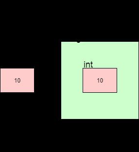
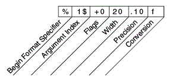

---
title: Intro to Java
notebook: Object Oriented Programming
layout: note
date: 2020-03-01 16:59
tags: java, oop
...

# Intro to Java

[TOC]: #

## Table of Contents
- [Overview](#overview)
- [Java Features](#java-features)
- [Hello world!](#hello-world)
  - [Compiling and running](#compiling-and-running)
  - [Comments](#comments)
  - [Command Line args](#command-line-args)
  - [Java vs C](#java-vs-c)
  - [identifiers](#identifiers)
- [Data types](#data-types)
- [Variables](#variables)
- [Variable classes](#variable-classes)
- [Constants](#constants)
- [Operators](#operators)
  - [Arithmetic](#arithmetic)
  - [Relational](#relational)
  - [Logical](#logical)
  - [Bitwise](#bitwise)
  - [Other operators](#other-operators)
- [Mathematical functions](#mathematical-functions)
- [Control flow](#control-flow)
  - [Branching](#branching)
  - [Loops](#loops)
- [Operator Precedence](#operator-precedence)
- [String Functions](#string-functions)
  - [Basic string operations](#basic-string-operations)
  - [Substrings](#substrings)
  - [String equality and references](#string-equality-and-references)
  - [String Modification](#string-modification)
- [Wrapper classes](#wrapper-classes)
  - [Example: Integer wrapper class](#example-integer-wrapper-class)
  - [String parsing](#string-parsing)
  - [Boxing and Unboxing](#boxing-and-unboxing)
  - [String Comparison](#string-comparison)
- [IO](#io)
  - [Input](#input)
  - [Output](#output)
  - [String Formatting](#string-formatting)
- [Arrays](#arrays)
  - [Array Methods and Tools](#array-methods-and-tools)
  - [Multi-dimensional arrays](#multi-dimensional-arrays)


## Overview

- 1991: James Gosling at Sun Microsystems developed first version of Java
- intended for embedded systems (home appliances e.g. washing machines, TVs).
  - complex: various processors make it difficult to make portable, and
    manufacturers wouldn't want to develop expensive compilers
  - used two-step translation:
    - translate to an intermediate language, _Java byte-code_ which is the same
      for all appliances
    - small, easy-to-write interpreter converts to machine language
    - *Write Once, Run Anywhere*
    - Less low-level facilities
- Oracle now owns Java
- _byte code_: computer-readable program
- *object-oriented programming*: Java is an OOP language
  - objects
  - methods: actions an object can take
  - class: collects objects of the same type
- *Java application program*: class with a `main` method
- *application*: meant to be run by computer, c.f. applet
  - has a `main` method
  - can be invoked from command line using Java interpreter
- *applets*: little Java application;
  - no `main` method
  - program embedded in a web page
  - run by Java-enabled web browser
  - always use a window interface
- Java 13: latest stable verion (3/2020)
    - Java 11: long-term support

## Java Features

1. Compiled and interpreted
   - Compiled language (e.g. C)


   - Java


   - Java is compiled to bytecode, then interpreted to machine code
   - porting Java to a new system involves writing an interpreter
   - Java uses **just-in-time** compilation: parts of bytecode are compiled to
     native code at runtime based on which parts are used most often, and what is
     expected to be needed next
2. Platform independent


3. Object oriented

## Hello world!

```java
// HelloWorld.java: Display "Hello World!" on the screen
import java.lang.*;             // imports java.lang.* package; optional
public class HelloWorld{        // name of class must be same as filename
    public static void main(String args[]) {    // standalone program must have main defined
        // args[] contain command-line arguments
                                              
        System.out.println("Hello World!");     // out is an object
        return;                                 // optional; usually excluded
    }
}
```

### Compiling and running

```console
# compile
javac HelloWorld.java
# run
java HelloWorld
```

### Comments

- `/* */`: multi-line comments
- `//`: single line comments
- `/** */`: documentation comments

### Command Line args

- accessed by `args[]`

### Java vs C

- Java: oop language; C: procedural language
- Java:
  - no `goto`, `sizeof`, `typedef`
  - no structures, unions
  - no explicit pointer type
  - no preprocessor: (`#define`, `#include`, `#indef`)
  - safe, well-define: memory is managed by VM not programmer

### identifiers

- *rules*:
  - must not start with a digit
  - all charactes must in {letters, digits, underscore}
  - can theoretically be of any length
  - are case-sensitive
- *conventions*:
  - `camelCase`:
    - variables, methods, objects: start with lower case, word boundaries
      uppercase, remaining characters are digits and lower case letters
  - classes: start with upper case letter; otherwise camelCase
- *keywords, reserved words*: cannot be used as identifiers
  - e.g. `public, class, void, static`
- *pre-defined identifiers*: defined in libraries required by Java standard
  packages e.g. `System, String, println`
  - can be redefined but can be confusing/dangerous

## Data types

Java Primitives

|   Type    | Size (bytes) |                   Values                   |
|:---------:|:------------:|:------------------------------------------:|
| `boolean` |      1       |              `false`, `true`               |
|  `char`   |      2       | All UTF-16 characters (e.g. 'a', 'ρ', '™') |
|  `byte`   |      1       |        −27 to 27 − 1 (-128 to 127)         |
|  `short`  |      2       |     −215 to 215 − 1 (-32768 to 32767)      |
|   `int`   |      4       |       −231 to 231 − 1 (≈ ±2 × 109 )        |
|  `long`   |      8       |         −263 to 263 − 1 (≈ ±1019)          |
|  `float`  |      4       |      ≈ ±3 × 1038 (limited precision)       |
| `double ` |      8       |        ≈ ±10308 (limited precision)        |


- characters are enclosed in `' '` not `" "`
- floating point numbers are treated as _double-precision_ unless forced by
  appending `f` or `F` to the number e.g. `float a = 2.3F;`
- `boolean` type: `true, false`

## Variables

- must be _declared_ and _initialised_ before use:

```
<type> <variable name> = <initial value>;
```

- **implicit type cast**: a value of any type in the list can be assigned to a variable to its right:

```
byte -> short -> int -> long -> float -> double
char -> int
```

- explicit *type cast* required to assign a value of one type to variable whose
  type appears to left on above list (e.g. `double` to `int`)

```
int x = 2.99; // invalid assignment
int y = (int)2.99; // valid assignment; x will be 2
```

- `int` variable cannot be assigned to `boolean` variable or vice-versa

## Variable classes

1. *instance*
2. *static* (or *class*)
3. *local*: define in a Java method

## Constants

- read only values; do not change during execution
- declared with `final` keyword
- `final` variables can be assigned exactly once: this need not be at declaration
e.g.
```java
final double PI;
...
PI = 3.14159265;
```

- convention: upper case letters with words separated by `_`
- data type need to be explicitly specified

```java
final int MAX_LENGTH = 420;
```

## Operators

- Java doesn't support operator overloading, except for `+` in concatenation
  of `String`s

### Arithmetic

| Operator |         Meaning          |
|:--------:|:------------------------:|
|   `+`    |   addition, unary plus   |
|   `-`    | subtraction, unary minus |
|   `*`    |      multiplication      |
|   `/`    |         division         |
|   `%`    |     modulo division      |

- *mixed-mode arithmetic expression*: if one operand is real and other is
  integer
  - integer operand converted to real, real arithmetic performed

### Relational

| Operator |           Meaning           |
|:--------:|:---------------------------:|
|   `<`    |        Is less than         |
|   `<=`   |  Is less than or equal to   |
|   `>`    |                             |
|   `>=`   | Is greater than or equal to |
|   `==`   |         Is equal to         |
|   `!=`   |       Is not equal to       |

- result of relational operator is `boolean`

#### Floating point comparisons

- care needed when checking for equality of two `float`s
- use a small $`\varepsilon`$ value i.e. `Math.abs(float1 - float2) < eps`
### Logical

| Operator | Meaning |
|:--------:|:--------|
|   `&&`   | AND     |
|   `||`   | OR      |
|   `!`    | NOT     |

### Bitwise

| operator |          Meaning           |
|:--------:|:--------------------------:|
|   `&`    |        bitwise AND         |
|   `!`    |         bitwise OR         |
|   `^`    |    bitwise exclusive OR    |
|   `~`    |      one's compliment      |
|   `<<`   |         shift Left         |
|   `>>`   |        shift Right         |
|  `>>>`   | shift Right with zero fill |

### Other operators

- (pre/post)-increment: `++`
  - pre-increment: performs addition, returns incremented value
  - post-increment: returns original value, performs addition
- (pre/post)-decrement: `--`
- conditional: `exp1 ? exp2: exp3`
- `a += b` $`\iff`$ `a = a + b`
- `a *= b` $`\iff`$ `a = a * b`


## Mathematical functions

- [`Math` class](https://docs.oracle.com/javase/8/docs/api/java/lang/Math.html)
  in `java.lang` package defines mathematical functions via:
```java
import java.lang.Math;

Math.PI;
Math.sin(15);
Math.toDegrees(Math.PI/2.0);
Math.pow(5, 2);
```

## Control flow

### Branching

- `if-else`:

  ```java
  if (boolean_expression) {
    // statements
  } else if (boolean_expression_2) {
    // statements
  } else {
    // otherwise statements
  }
  ```
- `switch`

  ```java
  switch (control expression)
  {
      case Case_Label_1:
          Statement_Sequence_1
          break; // necessary in most cases, otherwise execution falls through to next case
      case Case_Label_2:
          Statement_Sequence_2
          break;
      case Case_Label_<n-1>: // cascading cases: you can join cases together like this to produce the same output
      case Case_Label_n:
          Statement_sequence_n
          break;
      default:
          Default_Statement_Sequence
          break;
  }
  ```
- two way decision expression: `expression ? value_true : value_false`

### Loops

- `while`

  ```java
  while (condition) {
      // statements to execute
  }
  ```
- `do-while`
  - use sparingly.  `while` is usually a better approach
  ```java
  do {
      // statements to execute
  } while (expression) 
  ```

- `for`

  ```java
  for (initialise_expr; terminate_expr; update_expr) {
      // statements to execute
  }
  ```
- `break`: exits `while, do, for` loop
  - exits exactly 1 loop
  - if unlabelled, exits innermost loop
  - loops can be labelled, and then you can specify which loop to break from
```java
// break with a label used inside the inner loop to break from the outer loop
public class BreakExample {
    public static void main(String args[]) {
        aa: for (int i=1; i <= 3; i++) {
            bb: for (int j=i; j <= 3; j++) {
                if (i ==2 && j ==2) {
                    break aa;
                }
                System.out.println(i + " " + j);
            }
        }
    }
}
```
Output:
```
1 1
1 2
1 3
2 1
```
- `continue`: skips rest of statements in loop
  - kills current iteration of loop

## Operator Precedence

|    Symbol     |            Definition            |
|:-------------:|:--------------------------------:|
|   `.` (dot)   | Method invocation, member access |
|    `++ --`    |     Increment and decrement      |
|     `- !`     |          Unary negation          |
|   `(type)`    |           Type casting           |
|    `* / %`    |          Multiplicative          |
|     `+ -`     |             Additive             |
|  `< > <= >=`  |            Relational            |
|    `== !=`    |             Equality             |
|     `&&`      |           Boolean and            |
|     `||`      |            Boolean or            |
| `= += *=` ... |            Assignment            |

## String Functions

- [`String`s](https://docs.oracle.com/javase/8/docs/api/java/lang/String.html) are a class imported by default in Java

### Basic string operations
```java
String s = "Hello";
s.length();             // returns length of s (5)
s.toUpperCase();        // returns "HELLO"
s.toLowerCase();        // returns "hello"
```

### Substrings
```java
String substr = "el";
s.contains(substr);         // indicates if substr found in s
s.indexOf(substr);          // indicates index of first instance of substring; else -1
s.substring(arg1, arg2);    // slice of string with indices [arg1, arg2 - 1]
```

### String equality and references

```java
public class Program {
    public static void main(String[] args) {
        // 1. Two string literals
        System.out.println("Hello" == "Hello"); // true

        // 2. One literal, one variable
        String s0 = "Hello";
        System.out.println(s0 == "Hello");      // true

        // 3. Two variables, given the same literal value
        String s1 = "Hello";
        String s2 = "Hello";
        System.out.println(s1 == s2);           // true

        // 4. Two variables, with one creating a new "object"
        String s3 = "Hello";
        String s4 = new String("Hello");
        System.out.println(s3 == s4);           // false
    }
}
```
- Java is built on **references** which act like pointers
- when you explicitly write a `String` (e.g. "Hello") it is effectively treated
  as a constant (string literal*) and stored separate to dynamic memory
  - this constant is only created once, in e.g. 1-3, the string is the same, irrespective
    of which variable it is in
- e.g. 4 creates a `new String`, which Java puts on the _heap_ (dynamic memory)
  - `s3` is now pointing at different address than `s4`
- `==` applied to objects is actually comparing _address_ of reference
- for string comparison, use `String.equals()`

### String Modification

- strings are **immutable**: once created they cannot be modified
- all string methods return a string which you can then assign to a variable

## Wrapper classes

- most Java methods expect Objects - so when you need to pass in a primitive e.g.
  `int`/`double` you need to use a wrapper class to dress up the primitive to
  behave like an object
- wrapper classes also provide additional functionality to primitives
- use them sparingly - i.e. only when you need to

|  primitive  | wrapper Class |
|:-----------:|:-------------:|
|  `boolean`  |   `Boolean`   |
|   `byte`    |    `Byte`     |
|   `char`    |  `Character`  |
|    `int`    |   `Integer`   |
|   `float`   |    `Float`    |
|  `double`   |   `Double`    |
|   `long`    |    `Long`     |
| ` `short` ` |    `Short`    |

### Example: Integer wrapper class

```java
Integer.reverse(10);    // reverses bit sequence of a number
// -> 1342177280
Integer.rotateLeft(10, 2); // shifts bit sequence
// -> 40
Integer.signum(-10);    // indicates sign of number
// -> -1
Integer.parseInt("10"); // parses string as integer
// -> 10
```

### String parsing

Every wrapper class has a parseXXX method that converts a string into that type
```java
int i = Integer.parseInt("10"); // -> 10
double d = Double.parseDouble("10"); // -> 10.0
boolean b = Boolean.parseBoolean("TrUe"); // -> true
```

### Boxing and Unboxing

- typically when a primitive is expected, wrapper is automatically **unboxed** to behave like
  a primitive, and when a class is expected, the primitive is automatically **boxed**



### String Comparison

Use `string1.equals(string2)`

## IO

### Input

```
import java.util.Scanner;

public class Program {
    public static void main(String[] args) {
        Scanner scanner = new Scanner(System.in);
        // read next line of input: NB this is the only one to eat newline characters
        String inputLine = scanner.nextLine(); 
        // read next word of input
        String input = scanner.next();
        // read next int
        int i = scanner.nextInt();
        // read next double
        double d = scanner.nextDouble()
        // read next bool
        boolean b = scanner.nextBoolean() 
        
    }
```
Use `scanner.hasNextXXX()` to determine if there is input of type `XXX` ready to be read

### Output

```
System.out.print(...) // outputs without newline character
System.out.format(...) // format and print to terminal
String.format(...) // returns formatted string
```
### String Formatting

- [string formatting documentation](https://docs.oracle.com/javase/8/docs/api/java/util/Formatter.html)


- `%`: indicates start of format specifier
- argument index: indexes arguments provided after string to be formatted
  - `<` references previous value
- flags: special characters that can be applied to all formatting
  - `0` pads with zeroes
  - `-` left justify
- width: minimum number of characters a formatted value should occupy
  - by default it is padded with spaces
- precision: number of decimals for a float
- conversion: type of value
  - `d`: integer/decimal
  - `f`: floating point
  - `s`: String

```java
String.format("%3.2f", 4.56789); // min width 3, 2 decimal points, float
// output: 4.57

String.format("%+05d", 10);  // always include a sign, pad with zeroes, min width 5, integer
// output: +0010

String.format("%2$d %<05d %1$d %3$10s", 10, 22, "Hello");
// %2$d: 2nd arg, integer 
// %<05d: use previous arg (2nd arg), pad with zeroes, min width 5, integer
// %1$d: use 1st arg, integer
// %3$10s: use 3rd arg, min width 10, string
// output: 22 00022 10 Hello
```

## Arrays

- Declaration: Brackets can be attached to the _type_ or the _variable_name_
```java
int[] nums;
int nums[];
```
- Allocation: declaring an array doesn't initialise it, so you first need to allocate it
  - can use the `new` operator, declare an array of `<type>` values, storing up to `<size>`
    elements
  - primitives are initialised to "zero" (`int`: 0, `double`: 0.0, ...)
  - objects: initialised to `null`
```java
<type>[] var = new <type>[<size>];
```
- can also specify initial values
```java
<type>[] var = new <type>[]{element1, element2, ..., elementn};
```
- can use an already declared array to initialise a second,
- second array is an **alias** for the first array; they both refer to same values
```java
<type>[] var = new <type>[<size>];
<type>[] var2 = var;
```
- any variable that stores a **non-primitive** value is a **pointer/reference**

### Array Methods and Tools

```java 
int num = nums[0];          // array indexing
int length = nums.length;   // array length
```

- `Arrays` library 
```java
import java.util.Arrays;
...
System.out.println(Arrays.toString(nums));      // converting to a string
int[] nums = Arrays.copyOf(nums, nums.length);  // create distinct copy of an array
Arrays.sort(nums)                               // in-place sort
Arrays.equal(nums, nums2);                      // equality: same length + holds same values
```

### Multi-dimensional arrays

- treated as arrays of arrays


- declaration and initialisation: rectangular 2D array
```java
int[][] nums = new int[100][10]; // array with 100 rows and 10 columns, each cell initialised to 0
```
- irregular array (e.g. triangular)
```java
import java.util.Arrays;

public class Program {
    public static void main(String args[]) {
        final int NUM_ROWS = 5;
        final int MAX_COLS = NUM_ROWS;
        
        int[][] nums = new int[NUM_ROWS][]; // <- declaration of uninitialised 2D array

        for (int i = 0; i < nums.length; i++) {
	    nums[i] = new int[NUM_ROWS - i];
	}

        for (int i = 0; i < NUM_ROWS; i++) {
	    System.out.println(Arrays.toString(nums[i]));
        }
    }
```

}
