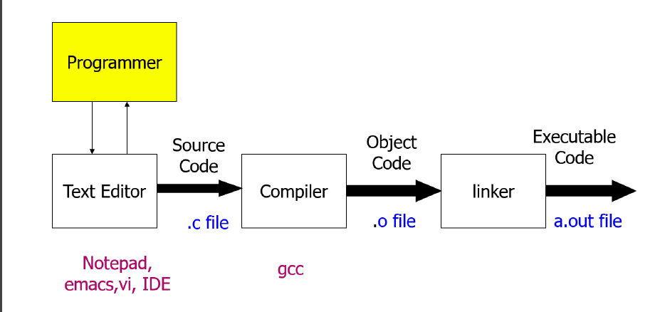
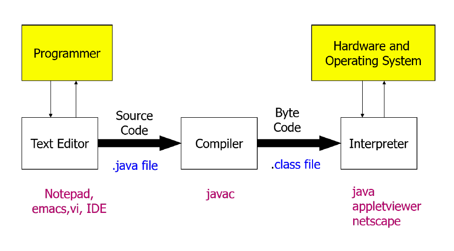
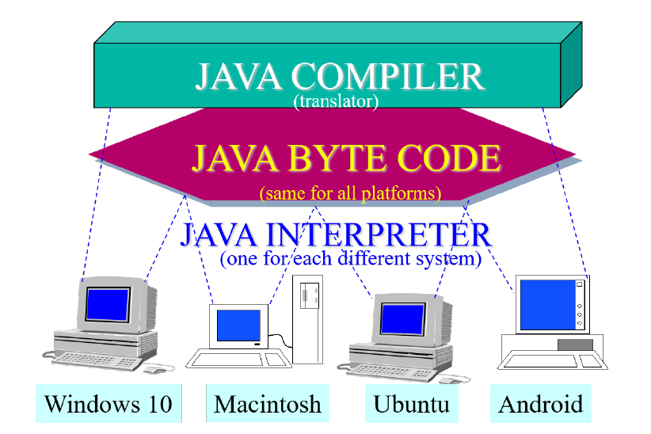
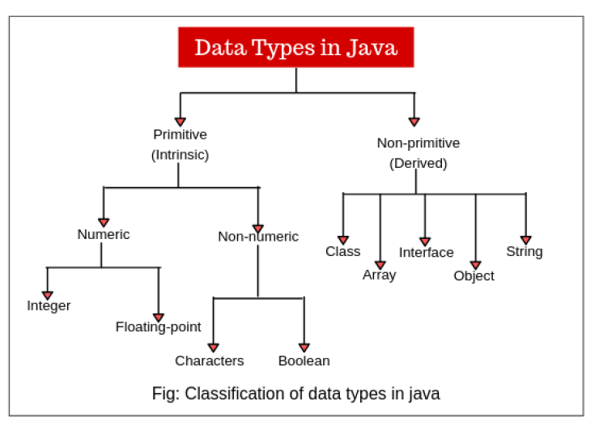
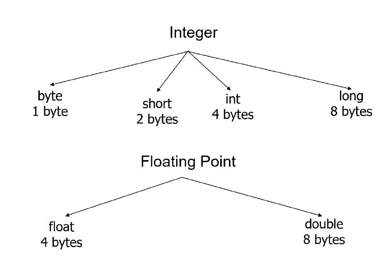

---
title: Intro to Java
notebook: Object Oriented Programming
layout: note
date: 2020-03-01 16:59
tags: java, oop
...

# Intro to Java

[TOC]: #

## Table of Contents
- [Overview](#overview)
- [Java Features](#java-features)
- [Hello world!](#hello-world)
  - [Compiling and running](#compiling-and-running)
  - [Comments](#comments)
  - [Command Line args](#command-line-args)
  - [Java vs C](#java-vs-c)
  - [identifiers](#identifiers)
- [Data types](#data-types)
- [Variables](#variables)
- [Variable classes](#variable-classes)
- [Constants](#constants)
- [Operators](#operators)
  - [Arithmetic](#arithmetic)
  - [Relational](#relational)
  - [Logical](#logical)
  - [Bitwise](#bitwise)
  - [Other operators](#other-operators)
- [Mathematical functions](#mathematical-functions)
- [Control flow](#control-flow)
  - [Branching](#branching)
  - [Loops](#loops)

## Overview

- 1991: James Gosling at Sun Microsystems developed first version of Java
- intended for embedded systems (home appliances e.g. washing machines, TVs).
  - complex: various processors make it difficult to make portable, and
    manufacturers wouldn't want to develop expensive compilers
  - used two-step translation:
    - translate to an intermediate language, _Java byte-code_ which is the same
      for all appliances
    - small, easy-to-write interpreter converts to machine language
- Oracle now owns Java
- _byte code_: computer-readable program
- *object-oriented programming*: Java is an OOP language
  - objects
  - methods: actions an object can take
  - class: collects objects of the same type
- *Java application program*: class with a `main` method
- *application*: meant to be run by computer, c.f. applet
  - has a `main` method
  - can be invoked from command line using Java interpreter
- *applets*: little Java application;
  - no `main` method
  - program embedded in a web page
  - run by Java-enabled web browser
  - always use a window interface

## Java Features

1. Compiled and interpreted
   - Compiled language (e.g. C)

   - Java

   - Java is compiled to bytecode, then interpreted to machine code
   - porting Java to a new system involves writing an interpreter
2. Platform independent

3. Object oriented

## Hello world!

```java
// HelloWorld.java: Display "Hello World!" on the screen
import java.lang.*;             // imports java.lang.* package; optional
public class HelloWorld{        // name of class must be same as filename
    public static void main(String args[]) {    // standalone program must have main defined
        // args[] contain command-line arguments
                                              
        System.out.println("Hello World!");     // out is an object
        return;                                 // optional; usually excluded
    }
}
```

### Compiling and running

```console
# compile
javac HelloWorld.java
# run
java HelloWorld
```

### Comments

- `/* */`: multi-line comments
- `//`: single line comments
- `/** */`: documentation comments

### Command Line args

- accessed by `args[]`

### Java vs C

- Java: oop language; C: procedural language
- Java:
  - no `goto`, `sizeof`, `typedef`
  - no structures, unions
  - no explicit pointer type
  - no preprocessor: (`#define`, `#include`, `#indef`)
  - safe, well-define: memory is managed by VM not programmer

### identifiers

- *rules*:
  - must not start with a digit
  - all charactes must in {letters, digits, underscore}
  - can theoretically be of any length
  - are case-sensitive
- *conventions*:
  - `camelCase`:
    - variables, methods, objects: start with lower case, word boundaries
      uppercase, remaining characters are digits and lower case letters
  - classes: start with upper case letter; otherwise camelCase
- *keywords, reserved words*: cannot be used as identifiers
  - e.g. `public, class, void, static`
- *pre-defined identifiers*: defined in libraries required by Java standard
  packages e.g. `System, String, println`
  - can be redefined but can be confusing/dangerous

## Data types





- floating point numbers are treated as double-precision unless forced by
  appending `f` or `F` to the number e.g. `float a = 2.3F;`
- `boolean` type: `true, false`

## Variables

- must be _declared_ and _initialised_ before use:

```
<type> <variable name> = <initial value>;
```

- a value of any type in the list can be assigned to a variable to its right:

```
byte -> short -> int -> long -> float -> double
char -> int
```

- explicit *type cast* required to assign a value of one type to variable whose
  type appears to left on above list (e.g. `double` to `int`)

```
int x = 2.99; // invalid assignment
int y = (int)2.99; // valid assignment; x will be 2
```

- `int` variable cannot be assigned to `boolean` variable or vice-versa

## Variable classes

1. *instance*
2. *static* (or *class*)
3. *local*: define in a Java method

## Constants

- read only values; do not change during execution
- declared with `final` keyword
- convention: upper case letters with words separated by `_`
- data type need to be explicitly specified

```java
final int MAX_LENGTH = 420;
```

## Operators

### Arithmetic

| Operator |         Meaning          |
|:--------:|:------------------------:|
|   `+`    |   addition, unary plus   |
|   `-`    | subtraction, unary minus |
|   `*`    |      multiplication      |
|   `/`    |         division         |
|   `%`    |     modulo division      |

- *mixed-mode arithmetic expression*: if one operand is real and other is
  integer
  - integer operand converted to real, real arithmetic performed

### Relational

| Operator |           Meaning           |
|:--------:|:---------------------------:|
|   `<`    |        Is less than         |
|   `<=`   |  Is less than or equal to   |
|   `>`    |                             |
|   `>=`   | Is greater than or equal to |
|   `==`   |         Is equal to         |
|   `!=`   |       Is not equal to       |

- result of relational operator is `boolean`

### Logical

| Operator | Meaning |
|:--------:|:--------|
|   `&&`   | AND     |
|   `||`   | OR      |
|   `!`    | NOT     |

### Bitwise

| operator |          Meaning           |
|:--------:|:--------------------------:|
|   `&`    |        bitwise AND         |
|   `!`    |         bitwise OR         |
|   `^`    |    bitwise exclusive OR    |
|   `~`    |      one's compliment      |
|   `<<`   |         shift Left         |
|   `>>`   |        shift Right         |
|  `>>>`   | shift Right with zero fill |

### Other operators

- increment: `++`
- decrement: `--`
- conditional: `exp1 ? exp2: exp3`

## Mathematical functions

- `Math` class in `java.lang` package defines mathemtical functions via:
  `Math.method_name();`
  - e.g. `sin, cos, log`

## Control flow

### Branching

- `if-else`:

  ```java
  if (boolean_expression) {
    // statements
  } else if (boolean_expression_2) {
    // statements
  } else {
    // otherwise statements
  }
  ```
- `switch`

  ```java
  switch (control expression)
  {
      case Case_Label_1:
          Statement_Sequence_1
          break;
      case Case_Label_2:
          Statement_Sequence_2
          break;
      case Case_Label_n:
          Statement_sequence_n
          break;
      default:
          Default_Statement_Sequence
          break;
  }
  ```
- two way decision expression: `expression ? value_true : value_false`

### Loops

- `while`

  ```java
  while (condition) {
      // statements to execute
  }
  ```
- `do-while`

  ```java
  do {
      // statements to execute
  } while (expression) 
  ```

}
- `for`

  ```java
  for (initialise_expr; terminate_expr; update_expr) {
      // statements to execute
  }
  ```
- `break`: exits `while, do, for` loop
- `continue`: skips rest of statements in loop

