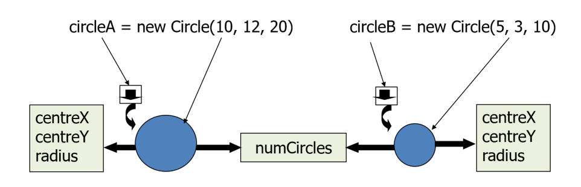
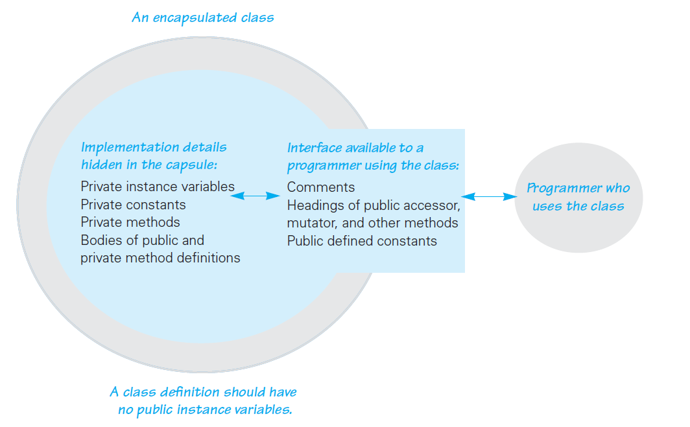

---
title: Classes and Objects
notebook: Object Oriented Programming
layout: note
date: 2020-03-10 10:07
tags: 
...

# Classes and Objects

[TOC]: #

## Table of Contents
- [OOP overview](#oop-overview)
  - [Classes](#classes)
  - [Objects](#objects)
- [Object Oriented Features](#object-oriented-features)
- [Class definition](#class-definition)
- [Class instantiation](#class-instantiation)
- [Garbage collection](#garbage-collection)
- [Using instance variables and methods](#using-instance-variables-and-methods)
- [`main` method](#main-method)
- [Example: Drinking glass](#example-drinking-glass)
- [Getters and Setters](#getters-and-setters)
- [Constructors](#constructors)
- [Method Overloading](#method-overloading)
- [`this`](#this)
- [Static Attributes and Methods](#static-attributes-and-methods)
  - [Static variables example](#static-variables-example)
  - [Instance vs static variables](#instance-vs-static-variables)
  - [Static Methods](#static-methods)
- [Standard Methods](#standard-methods)
  - [`equals`](#equals)
  - [`toString`](#tostring)
  - [`copy`](#copy)
- [Operator Overloading](#operator-overloading)
- [Packages in Java](#packages-in-java)
  - [Package creation](#package-creation)
  - [Using packages](#using-packages)
  - [`default` package (Non-assessable)](#default-package-non-assessable)
- [Information Hiding](#information-hiding)
  - [Visibility modifiers](#visibility-modifiers)
  - [`Circle` class with visibility modifiers](#circle-class-with-visibility-modifiers)
- [Mutability](#mutability)
- [Delegation through Association](#delegation-through-association)
- [Wrapper Classes](#wrapper-classes)
  - [Integer class](#integer-class)


## OOP overview

- All programming languages have
  - calculation
  - selection
  - iteration
  - abstraction
- **abstraction** is fundamental concept differentiating procedural from OOP languages
  - C: uses functions as unit of abstraction
    - functions manipulate data
  - OOP: combines data and function to create a class, the fundamental unit of
    abstraction

### Classes

- Classes: generalisation of a real world entity
  - physical real world thing: student/book
  - abstract real world thing: subject
  - even more abstract thing: list/string (data
- template for things with common properties
- _attributes_ and _methods_
- defines new **data type**

### Objects

- **instance** of a class
- contains **state**
- **object**: specific, concrete example of a class
- **instance**: object that exists in your code
- e.g. could define Car as class, then Ford, Ferrari, Toyota may be instances of class,
  but dependent on the definition

## Object Oriented Features

- data abstraction: creating new data types well suited to application by defining
  new classes
  - similar to C `struct` but with additional features i.e. attributes and methods
- encapsulation: grouping data (attributes) and methods that manipulate the data
  to a single entity through defining a class
  - unique to OOP, not present in procedural programming
- information hiding
- delegation
- inheritance
- polymorphism


## Class definition

```java
<visibility modifier> class <ClassName> {
    // attribute declarations
    <visibility modifier> <type> <variable name>; 
    // method declarations
    <visibility modifier> <typeReturned> myMethod(paramList) {
        variable declarations
        statements
    }
}
```

- **instance variables**: attributes defined within class (not in methods)
  - maintain state of the object
  - **property/attribute** particular to a given object of a class
- **local variables**: variables define inside a method

## Class instantiation

```java
Circle aCircle;
Circle bCircle;
```
- this does not create `Circle` objects: `aCircle` is a **reference/pointer** to `Circle` objects
- currently they are **null references** as they are pointing to nothing
- **null**: Java keyword for "no object here"
- objects are `null` until **instantiated**
```java
Circle circle_1 = new Circl();
Circle circle_2 = new Circl();
```
- **`new`**: directs JVM to allocate memory for an object, instantiating it

## Garbage collection

- `circle_1 = circle_2` changes `circle_1` to point to `circle_2`
  - this leaves the original object `circle_1` referred to without any references
- an object without a valid reference (orphan) cannot be used in future
- becomes candidate for **Java automatic garbage collection**
  - periodic memory free of unused objects
  - do not need to do explicitly

## Using instance variables and methods

```java
<objectName>.<variableName>
<objectName.<methodName>(<args>);
```

## `main` method

- a program in Java $\iff$ class with a `main` method
- `main` is void

## Example: Drinking glass

- attributes
  - height
  - radius
  - isFull
  - Material: nb this could be defined as a class itself; class composition
  - Shape
- methods
  - fill glass
  - empty glass
  - wash glass

## Getters and Setters

- instance variables initialised, accessed and updated using specific methods
- **Accessor: Getter**
- **Mutator: Setter**
- IDEs support automatic getter/setter generation
```java
// setter
public void setCentreX(double centreX) {
    this.centreX = centreX;
}

// getter
public double getCentreY() {
    return centreY;
}
```

## Constructors

- **constructor**: method used to initialise objects
  - **cannot** return values
  - has same name as class
- **overloading**: class can have _1+ constructors_ with different sets of parameters

```java
public <Classname>(<arguments>) {
    <execute things>
}
```

e.g. `Circle` constructor:
```java 
public Circle(double newCentreX, double newCentreY, double newRadius) {
    centreX = newCentreX;
    centreY = newCentreY;
    radius = newRadius;
}
```

- without constructor: `new Circle()` produces circle with centre of (0.0, 0.0) and radius 0.0
  - default values for variables

## Method Overloading

- **method overloading**: ability to define methods with same name, distinguished by signature, i.e.:
  - number of arguments
  - type of arguments
  - position of arguments
- any method can be overloaded
- overloading is a type of **polymorphism**: same method different behaviour
- distinct from **method overriding**
- **polymorphism**: ability to process objects differently depending on type/class
  - literal meaning: many shapes
  - (Wikipedia)[https://en.m.wikipedia.org/wiki/Polymorphism_(computer_science]

## `this`

- **`this`**: reference to calling object i.e. the object that owns/is executing
  the method
- good practice to use `this` in constructor
```java
public Circle(double centreX, double centreY, double radius) {
    this.centreX = centreX;
    this.centreY = centreY;
    this.radius = radius;
}
```

## Static Attributes and Methods

- **static members**: methods and attributes _not specific_ to any object of the class
- **static variable**: variable shared among *all* objects of the class
- **static method**: method that does not depend on (access/modify) any instance of
  the class.  Such a method is invoked using the class name

### Static variables example

- for Circle e.g.: static attribute my be `numCircles`, the number of circles that have been created
  - shared between objects: there is only one copy

```java
// Circle.java
public class Circle {
    public static int numCircles = 0;   // <- static (class) variable, one instance
                                        //    for Circle class
    public double centreX, centreY, radius;

   // constructor
   public Circle(double x, double y, double r) {
       centreX = x;
       centreY = y;
       radius = r;
       numCircles++;    // <- updating the static variable
   }
   
   // other methods here
}
```

- using static variables
```java
// CountCircles.java
public class CountCircles {
    public static void main(String args[]) {
        Circle circleA = new Circle( 10.0, 12.0, 20.0);
        System.out.println("Number of circles = " + Circle.numCircles);
        Circle circleB = new Circle( 5.0, 3.0, 10.0);
        System.out.println("Number of circles = " + Circle.numCircles;
    }
}
```
Outputs:
```
Number of circles = 1
Number of circles = 2
```

### Instance vs static variables

- **instance variables**: one copy per object
- **static variables**: one copy per class



### Static Methods

- static methods
  - _cannot_ access instance variables
  - _cannot_ refer to keywords such as `this`, `super` because they are related to
    class instances
- instance methods _can_ access static methods
- Don't make all methods/attributes static!
- Before making something `static` consider if it is a class level member or an
  instance specific member

e.g. static method to print the number of circles
```java
// in Circle.java
public static void printNumCircles() {
    System.out.println("Number of circles = " + numCircles);
}
```

## Standard Methods

### `equals`

- `equals`: used to compare if objects are equal
  - using `==` between objects only checks if references are equal

```java
public boolean equals(<ClassName> var) {
    return <boolean expression>;
}
```

e.g. for `Circle`:
```java
public boolean equals(Circle circle) {
    return Double.compare(circle.centreX, centreX) == 0 &&
           Double.compare(circle.centreY, centreY) == 0 &&
           Double.compare(circle.radius, radius) == 0;
}
```

### `toString`

- `toString`: returns a `String` representation of an object
  - automatically called when object is asked to act like a `String`
```java
public String toString() {
    return <String>;
}
```

e.g. `Circle` class
```java
public String toString() {
    return "I am a cirlce with {" + "centreX=" + centreX + 
           ", centreY=" + centreY +
           ", radius=" + radius + '}';
}
```

### `copy`

- `copy`: creates a separate copy of the object sent as input

```java
public <ClassName>(<ClassName> var) {
    <code block>
}
```

- **deep copy**: if instance variables refer to other objects, new objects with
  the same state must be created using their copy constructor

## Operator Overloading

- Java has built in string concatenation (with `+`), otherwise you cannot arbitrarily
  define operator overloading, as is possible in C++ and Python.
- This was initially a personal choice by James Gosling to maintain simplicity
  and prevent abuse he had seen with operator overloading in C++.  In addition the
  number strongly supporting operator overloading in Java is outnumbered by those
  strongly opposing it, thus making a vote for its inclusion unlikely.
- From (this interview)[http://www.gotw.ca/publications/c_family_interview.htm]:

  _There are some things that I kind of feel torn about, like operator overloading.
  I left out operator overloading as a fairly personal choice because I had seen
  too many people abuse it in C++. I've spent a lot of time in the past five to
  six years surveying people about operator overloading and it's really fascinating,
  because you get the community broken into three pieces: Probably about 20 to 30
  percent of the population think of operator overloading as the spawn of the devil;
  somebody has done something with operator overloading that has just really ticked them off,
  because they've used like + for list insertion and it makes life really, really confusing.
  A lot of that problem stems from the fact that there are only about half a dozen
  operators you can sensibly overload, and yet there are thousands or millions of
  operators that people would like to define -- so you have to pick, and often the
  choices conflict with your sense of intuition. Then there's a community of about
  10 percent that have actually used operator overloading appropriately and who r
  eally care about it, and for whom it's actually really important; this is almost
  exclusively people who do numerical work, where the notation is very important
  to appealing to people's intuition, because they come into it with an intuition
  about what the + means, and the ability to say "a + b" where a and b are complex
  numbers or matrices or something really does make sense. You get kind of shaky
  when you get to things like multiply because there are actually multiple kinds
  of multiplication operators -- there's vector product, and dot product, which
  are fundamentally very different. And yet there's only one operator, so what
  do you do? And there's no operator for square-root. Those two camps are the
  poles, and then there's this mush in the middle of 60-odd percent who really
  couldn't care much either way. The camp of people that think that operator
  overloading is a bad idea has been, simply from my informal statistical sampling,
  significantly larger and certainly more vocal than the numerical guys. So, given
  the way that things have gone today where some features in the language are
  voted on by the community -- it's not just like some little standards committee,
  it really is large-scale -- it would be pretty hard to get operator overloading
  in. And yet it leaves this one community of fairly important folks kind of
  totally shut out. It's a flavor of the tragedy of the commons problem._

## Packages in Java

- **package**: groups classes and interfaces into bundles, allowing them to be handled together
  with an accepted naming convention
  - allows _reuse_, rather than rewriting classes
  - prevents _naming conflicts_
  - allows _access control_
  - another level of _encapsulation_

### Package creation

- to place a class in a package, first statement in Java class must be `package` statement:
```java
package <directory1>.<directory2>;
```
- e.g. 
```java
package utilities.shapes;

public class Circle {
    // Code for Circle goes here
}
```
- `Circle.class` must be in directory `shapes`, a sub-directory of `utilities`

### Using packages

- use packages with the `import` statement, which has different forms:
```java
import <packageName>.*; // import all classes in the package
import <packageName>.<className>; // import a particular class from the package
```
- parent directory where classes are placed must be in `CLASSPATH` environment variable

e.g. 
```java
import utilities.shapes.Circle;
public class CircleTest {
    public static void main(String args[]) {
        Circle my_circle = new Circle();
    }
}
```
- here parent directory of `utilities` must be in `CLASSPATH`

### `default` package (Non-assessable)

- all classes in current directory belong to an unnamed `default` package - no `package` statement
  is needed
- if current directory is part of `CLASSPATH` all classes in `default` package are automatically
  available to a program
- if `CLASSPATH` is set: current directory must be included as one of the alternatives listed, 
  otherwise Java may not be able to `.class` files for the program itself.
- if `CLASSPATH` is set: all class files for a program must be put in the current directory
- further reading: [Packages in Java](https://www.geeksforgeeks.org/packages-in-java/)

## Information Hiding

- OO paradigm allows class attributes and methods to be grouped together (**encapsulation**)
- **information hiding**: ability to hide details of a class from outside world
    - also part of OO paradigm
    - aka **visibility control**
- **interface** to the class: actions on objects can be performed through visible methods of the 
  class 
- **access control**: preventing an outside class from _manipulating_ properties of another class
  in _undesired_ ways
- **visibility modifiers**: Java implementation to control **visibility/access** of variables and 
  methods:
  - safely seals data in capsule of class
  - prevents programmers from relying on details of class implementation
  - helps protect against accidental/wrong usage
  - keeps code elegant, clean, making maintenance easier
  - provides access to an object through a clean interface



### Visibility modifiers

Keywords applied to class, method, or attribute:
- **`public`:** available/visible _everywhere_ (within/outside the class)
  - anyone can use it
- **`private`:** only visible _within_ a class
  - methods/attributes
  - not visible within subclasses
  - not inherited
- **`protected`:** only visible within class, subclasses, and all classes in the same package
  - methods/attributes
  - visible to subclasses in other packages
- **default:** visibility modifier omitted;
  - can be accessed within other classes in the same package, but not from
    outside the package

|  Modifier   | Class | Package | Subclass | Outside |
|:-----------:|:-----:|:-------:|:--------:|:-------:|
|  `public`   |   Y   |    Y    |    Y     |    Y    |
| `protected` |   Y   |    Y    |    Y     |    N    |
|  `default`  |   Y   |    Y    |    N     |    N    |
|  `private`  |   Y   |    N    |    N     |    N    |

### `Circle` class with visibility modifiers

- convention: attributes of class must be made **`private`** and accessed through getter/setter 
  methods, which are `public`
  - methods that other classes do not call must be defined as **`private`**

```java
public class Circle {
    private double centreX, centreY, radius;

    // methods to get/set instance variables
    public double getX() { return centreX; }
    public double getY() { return centreY; }
    public double getR() { return radius; }
    public double setX(double centreX) { this.centreX = centreX;}
    public double setY(double centreY) { this.centreY = centreY;}
    public double setR(double radius) { this.radius = radius;}
    // other methods
```

## Mutability

- **mutable class:** contains public mutator methods that can change the instance variables
  - instances are **mutable objects**
- **immutable class:** contains no methods (except constructors) that change instance variables
  - instance objects are **immutable objects**

e.g `Circle` class
```java
// Circle.java
public class Circle {
    private double centreX, centreY, radius;
    private static int numCircles;

    public Circle(double newCentreX, double newCentreY, double newRadius) {...};
    public double getCentreX() {...};
    public void setCentreX(double centreX) {...};
    public double getCentreY() {...};
    public void setCentreY(double centreY) {...};
    public double getRadius() {...};
    public void setRadius(double radius) {...};
    public double computeCircumference() {...};
    public double computeArea() {...};
    public void resize(double factor) {...};
    public static int getNumCircles() {...};
}
```
- is this an immutable class? No, it has getters and setters that are public
- how would you create an immutable class? Remove all the setters and resize methods.

```java
// ImmutableCircle.java
public class ImmutableCircle {
    private final double centreX, centreY, radius;  // <- note: these are now final
    private static int numCircles;

    public ImmutableCircle(double newCentreX, double newCentreY, double newRadius) {...};
    // all setters have been removed
    public double getCentreX() {...};
    public double getCentreY() {...};
    public double getRadius() {...};
    public double computeCircumference() {...};
    public double computeArea() {...};
    public static int getNumCircles() {...};
}
```

## Delegation through Association

- class can **delegate** responsibilities to other classes
- object can **invoke methods** in other objects through **containership**
- this is an **Association** relationship between classes

e.g. Association relationship and Delegation through a `Point` class contained within `Circle` class.
Is there a better way to store information about the centre of the Circle?
```java
public class Circle {
    private Point centre;
    private double radius;

    public Circle(Point centre, double radius) {
        this.centre = centre;
        this.radius = radius;
    }

    public double getX() {          // <- interface has not changed
        return centre.getXCoord();
    }

    public double getY() {
        return centre.getYCoord();
    }
    //other methods here
}
```
- `Point` object is contained in `Circle` object: methods in `Circle` object can call methods in 
  `Point` object using reference to the object, `centre`

## Wrapper Classes

- **primitive**: unit of information that contains only data, with no attributes or methods
  - cannot perform actions e.g. parsing
  - e.g. `int, double`
- Java provides **wrapper classes** for primitives
  - packages/boxes primitive data types into objects
  - allows primitives to pretend they are classes
  - provides extra functionality for primitives
- e.g. `boolean` $\rightarrow$ `Boolean`
- Java does automatic boxing/unboxing to convert primitive from/to wrapper class

### Integer class

- Reverse: `Integer.reverse(10)`
- Rotate left: `Integer.rotateLeft(10, 2)`
- Signum: `Integer.signum(-10)`
- parsing: `Integer.parseInt("10");

