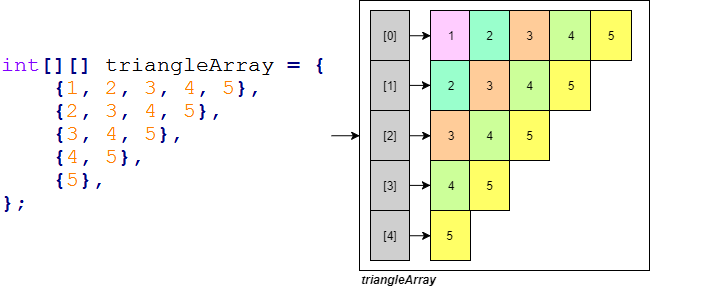
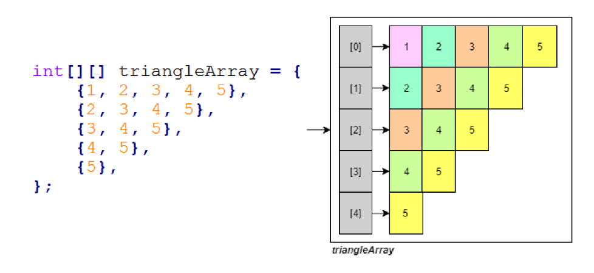

---
title: Arrays and Strings
notebook: Object Oriented Programming
layout: note
date: 2020-03-22 12:51
tags: 
...

# Arrays and Strings

[TOC]: #

## Table of Contents
- [Arrays](#arrays)
  - [Array Methods and Tools](#array-methods-and-tools)
  - [Array Iteration](#array-iteration)
  - [Multi-dimensional arrays](#multi-dimensional-arrays)
  - [Arrays of Objects](#arrays-of-objects)
- [Strings](#strings)
  - [Basic string operations](#basic-string-operations)
  - [Substrings](#substrings)
  - [String concatenation](#string-concatenation)
  - [String equality and references](#string-equality-and-references)
  - [String Modification](#string-modification)


## Arrays

- [Array documentation](https://docs.oracle.com/javase/8/docs/api/java/util/Arrays.html)
- Declaration: Brackets can be attached to the _type_ or the _variable_name_
```java
int[] nums;
int nums[];
```
- Allocation: declaring an array doesn't initialise it, so you first need to allocate it
  - can use the `new` operator, declare an array of `<type>` values, storing up to `<size>`
    elements
  - primitives are initialised to "zero" (`int`: 0, `double`: 0.0, ...)
  - objects: initialised to `null`
```java
<type>[] var = new <type>[<size>];
```
- can also specify initial values
```java
<type>[] var = new <type>[]{element1, element2, ..., elementn};
```
- can use an already declared array to initialise a second,
- second array is an **alias** for the first array; they both refer to same values
```java
<type>[] var = new <type>[<size>];
<type>[] var2 = var;
```
- any variable that stores a **non-primitive** value is a **pointer/reference**

### Array Methods and Tools

```java
int[] nums = new int[10]
int num = nums[0];          // array indexing
int x = intArray[10];       // gives out of bounds error: doesn't cause program to crash
int length = nums.length;   // array length is public instance variable (NB not usually available)
```

- `Arrays` library
```java
import java.util.Arrays;
...
System.out.println(Arrays.toString(nums));      // converting to a string
int[] nums = Arrays.copyOf(nums, nums.length);  // create distinct copy of an array
Arrays.sort(nums)                               // in-place sort
Arrays.equal(nums, nums2);                      // equality: same length + holds same values
```
- Resizing
```java
int[] intArray = new int[5];
intArray = new int[intArray.length + 3];
```

### Array Iteration

- **`for each` loop:** can use to access each element of an iterable e.g. array when you
  are not modifying it
```java
for (<type> var : <iterable>) {
    // code block
}
```

### Multi-dimensional arrays

- treated as arrays of arrays


- declaration and initialisation: rectangular 2D array
```java
int[][] nums = new int[100][10]; // array with 100 rows and 10 columns, each cell initialised to 0
```
- irregular array (e.g. triangular)
```java
int[][] nums = new int[10][];
for (int i = 0; i < nums.length; i++) {
    nums[i] = new int[<length of subarray>];
}
```
```java
import java.util.Arrays;

public class Program {
    public static void main(String args[]) {
        final int NUM_ROWS = 5;
        final int MAX_COLS = NUM_ROWS;
        
        int[][] nums = new int[NUM_ROWS][]; // <- declaration of uninitialised 2D array

        for (int i = 0; i < nums.length; i++) {
	    nums[i] = new int[NUM_ROWS - i];
	}

        for (int i = 0; i < NUM_ROWS; i++) {
	    System.out.println(Arrays.toString(nums[i]));
        }
    }
```

- Write a Java static method `computeDoublePowers` that accepts an integer `n`
  and returns an array of `double`s of that size.  Your method should then
  fill that array with increasing powers of 2 (starting from 1.0)

```java
import java.lang.Math;
// ...
public static double[] computeDoublePowers(int n) {
    double[] nums = new double[n];
    for (int i = 0; i < n; i++) {
        arr[0] = Math.pow(2, i);
    }
    return nums;
}
```

- Write a program that can generate the following 2D array:


```java
public class IrregularArray {
    public static void main(String[] args) {
        final int HEIGHT = 5;
        final int MAX_WIDTH = HEIGHT;
        int[][] triangleArray = new int[HEIGHT][];
        for (int i = 0; i < HEIGHT; i++) {
            triangleArray[i] = new int[MAX_WIDTH - i];
            for (int j = 0; j < MAX_WIDTH - i; j++) {
                triangleArray[i][j] = j+i+ 1;
            }
        }
    }
}
```

### Arrays of Objects

- arrays can also be used to store objects, but when you initialise the array it
  doesn't create the objects

```java
// CircleArray.java
class CircleArray {
    Circle[] circleArray = new Circle[3];
    // create circle objects, store in array
    for (int i = 0; i < circleArray.length; i++) {
        circleArray[i] = new Circle(i, i, i+2);
    }
}
```

## Strings

- [`String`s](https://docs.oracle.com/javase/8/docs/api/java/lang/String.html) are a class imported by default in Java
- cannot use single quotes for Java `String`s

### Basic string operations
```java
String s = "Hello";
s.length();             // returns length of s (5)
s.toUpperCase();        // returns "HELLO"
s.toLowerCase();        // returns "hello"
s.split(" ");           // split by space character
```
e.g. What does this output?
```java
String s = "Hello World";
s.toUpperCase();    // "HELLO WORLD"
s.replace("e", "i");// "Hillo World"
s.substring(0,2);   // "He"
s += " FIVE";       // s = "Hello World FIVE"
System.out.println(s);  // "Hello World FIVE"
```
### Substrings
```java
String substr = "el";
s.contains(substr);         // indicates if substr found in s
s.indexOf(substr);          // indicates index of first instance of substring; else -1
s.substring(arg1, arg2);    // slice of string with indices [arg1, arg2 - 1]
```
### String concatenation

- Java has `+` operator overloaded for string concatenation
```java
System.out.println("1 + 1 = " + 1 + 1);
// "1 + 1 = 11"
System.out.println("1 + 1 = " + (1 + 1));
// "1 + 1 = 2"
```

### String equality and references

```java
public class Program {
    public static void main(String[] args) {
        // 1. Two string literals
        System.out.println("Hello" == "Hello"); // true

        // 2. One literal, one variable
        String s0 = "Hello";
        System.out.println(s0 == "Hello");      // true

        // 3. Two variables, given the same literal value
        String s1 = "Hello";
        String s2 = "Hello";
        System.out.println(s1 == s2);           // true

        // 4. Two variables, with one creating a new "object"
        String s3 = "Hello";
        String s4 = new String("Hello");
        System.out.println(s3 == s4);           // false
    }
}
```
- Java is built on **references** which act like pointers
- when you explicitly write a `String` (e.g. "Hello") it is effectively treated
  as a constant (string literal*) and stored separate to dynamic memory
  - this constant is only created once, in e.g. 1-3, the string is the same, irrespective
    of which variable it is in
- e.g. 4 creates a `new String`, which Java puts on the _heap_ (dynamic memory)
  - `s3` is now pointing at different address than `s4`
- `==` applied to objects is actually comparing _address_ of reference
- for string comparison, use `String.equals()`

### String Modification

- strings are **immutable**: once created they cannot be modified
- all string methods return a string which you can then assign to a variable
